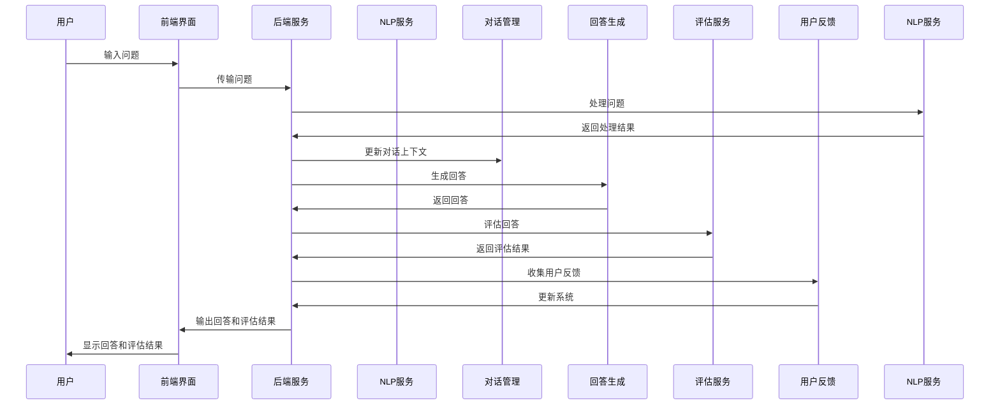

                 

## LLMBench：对话一致性与连贯性评测工具

### 1. 工具概述

LLMBench是一个用于评估大型语言模型（LLM）对话一致性与连贯性的评测工具。它通过提供一系列评测方法、指标和算法，帮助研究人员和开发者更全面地了解LLM在实际对话应用中的性能。

### 2. 主要功能

LLMBench具有以下主要功能：

- **多指标评估**：支持对话一致性和连贯性的多个评估指标。
- **自动化评估**：通过自动评估方法，提高评测效率。
- **数据集支持**：支持多种开源数据集，方便用户进行评测。
- **可视化展示**：提供直观的可视化结果，帮助用户更好地理解评测结果。

### 3. 评测流程

使用LLMBench进行评测的主要流程如下：

1. **数据准备**：准备用于评测的数据集。
2. **模型选择**：选择需要评测的LLM模型。
3. **评估指标配置**：根据需求选择合适的评估指标。
4. **运行评测**：运行LLMBench进行评估。
5. **结果分析**：分析评估结果，了解LLM的表现。

### 4. 评测结果解读

评测结果主要包括以下几部分：

- **一致性指标**：如回答与问题的相关性、回答的一致性等。
- **连贯性指标**：如对话的流畅性、话题的连贯性等。
- **综合评分**：根据一致性指标和连贯性指标，给出一个综合评分。

通过这些评测结果，用户可以更全面地了解LLM在对话一致性与连贯性方面的表现，从而针对性地进行优化和改进。

### 5. 使用场景

LLMBench适用于以下场景：

- **学术研究**：帮助研究人员评估不同LLM模型在对话一致性与连贯性方面的表现，为后续研究提供数据支持。
- **产品优化**：帮助开发者在实际应用中评估LLM的性能，针对性地进行优化和改进。
- **评测比赛**：为AI对话系统评测比赛提供评估工具，帮助参赛者了解自身系统的优势和不足。

通过LLMBench，用户可以更高效、准确地评估LLM在对话一致性与连贯性方面的表现，为AI对话系统的研发和应用提供有力支持。

## 第3章：对话一致性与连贯性评测方法详解

### 3.1 评测方法概述

对话一致性与连贯性评测方法主要包括人工评测和自动评测两种。

#### 3.1.1 人工评测

人工评测是指由人类评审员对对话系统生成的回答进行评价。这种方法具有以下优点：

- **主观性较强**：评审员可以根据自身经验和直觉，对对话进行深入分析。
- **灵活性高**：可以针对不同类型的对话内容，采用不同的评估标准。

然而，人工评测也存在一些缺点：

- **效率低**：需要大量人力资源。
- **一致性差**：不同评审员之间的评价可能存在差异。

#### 3.1.2 自动评测

自动评测是指利用自然语言处理（NLP）技术，对对话系统生成的回答进行评估。这种方法具有以下优点：

- **效率高**：不需要大量人力资源。
- **一致性较好**：采用算法进行评估，减少主观因素。

自动评测的缺点包括：

- **准确性有限**：NLP技术尚未完全成熟，难以完全准确地评估对话质量。
- **灵活性较低**：需要根据具体任务调整评估算法。

### 3.2 对话一致性的评测方法

#### 3.2.1 人工评测方法

人工评测方法主要包括以下步骤：

1. **对话样本准备**：准备用于评测的对话样本。
2. **一致性评价**：评审员对每个回答与问题之间的相关性、一致性进行评价。
3. **结果统计**：统计每个回答的一致性评分。

#### 3.2.2 自动评测方法

自动评测方法主要包括以下步骤：

1. **预处理**：对对话样本进行预处理，如分词、去停用词等。
2. **特征提取**：提取对话中的关键特征，如关键词、句法结构等。
3. **一致性评估**：利用机器学习算法，如逻辑回归、支持向量机等，对回答的一致性进行评估。

### 3.3 对话连贯性的评测方法

#### 3.3.1 人工评测方法

人工评测方法主要包括以下步骤：

1. **对话样本准备**：准备用于评测的对话样本。
2. **连贯性评价**：评审员对对话的流畅性、话题的连贯性进行评价。
3. **结果统计**：统计每个对话的连贯性评分。

#### 3.3.2 自动评测方法

自动评测方法主要包括以下步骤：

1. **预处理**：对对话样本进行预处理，如分词、去停用词等。
2. **特征提取**：提取对话中的关键特征，如关键词、句法结构等。
3. **连贯性评估**：利用机器学习算法，如逻辑回归、支持向量机等，对对话的连贯性进行评估。

### 3.4 评测指标

对话一致性与连贯性评测指标主要包括以下几类：

- **一致性指标**：如回答与问题的相关性、回答的一致性等。
- **连贯性指标**：如对话的流畅性、话题的连贯性等。
- **综合评分**：结合一致性指标和连贯性指标，给出一个综合评分。

常用的评测指标包括：

- **F1分数**：综合考虑准确率、召回率和精度。
- **精确率**：正确识别的答案数量与总答案数量的比例。
- **召回率**：正确识别的答案数量与实际答案数量的比例。
- **准确率**：正确识别的答案数量与总问题数量的比例。

通过这些评测指标，可以更全面、客观地评估LLM在对话一致性与连贯性方面的表现。

### 3.5 评测流程

对话一致性与连贯性评测的流程如下：

1. **数据准备**：准备用于评测的数据集，包括问题、答案和标签。
2. **模型训练**：根据评测需求，训练适当的评估模型。
3. **评估指标配置**：选择合适的评测指标，配置评估参数。
4. **评测运行**：运行评估模型，对数据集进行评测。
5. **结果分析**：分析评测结果，根据需要调整模型和评估参数。

通过以上步骤，可以有效地评估LLM在对话一致性与连贯性方面的表现，为后续研究和应用提供数据支持。

### 3.6 综合评测方法

综合评测方法是将对话一致性与连贯性的评测方法相结合，从多个角度对LLM的对话能力进行评估。这种方法可以更全面地了解LLM的表现，为优化和改进提供有力依据。

综合评测方法的主要步骤包括：

1. **一致性评估**：采用人工评测或自动评测方法，对对话的一致性进行评估。
2. **连贯性评估**：采用人工评测或自动评测方法，对对话的连贯性进行评估。
3. **综合评分计算**：根据一致性评分和连贯性评分，计算综合评分。

通过综合评测方法，可以更全面地评估LLM在对话一致性与连贯性方面的表现，为AI对话系统的研发和应用提供有力支持。

## 第4章：算法原理与数学模型

### 4.1 对话一致性与连贯性的计算方法

在本节中，我们将介绍用于计算对话一致性与连贯性的算法原理和数学模型。这些算法和模型可以帮助我们更准确地评估LLM在对话中的应用性能。

#### 4.1.1 对话一致性的计算方法

对话一致性的计算主要基于两个核心指标：回答与问题的相关性（Relativity）和回答的一致性（Consistency）。

**相关性**（Rel）衡量的是回答与问题之间的紧密程度。我们可以使用以下公式计算：

$$
Rel = \frac{Sim(Q, A)}{||Q|| \cdot ||A||}
$$

其中，$Sim(Q, A)$表示回答$A$与问题$Q$的相似度，$||Q||$和$||A||$分别表示问题$Q$和回答$A$的词向量长度。

**一致性**（Cons）衡量的是回答在对话过程中的稳定程度。我们可以使用以下公式计算：

$$
Cons = \frac{Count(A_{t-1}, A_t)}{Count(A_{t-1}, A_t) + Count(A_{t-1}, A_{t+1})}
$$

其中，$Count(A_{t-1}, A_t)$表示回答$A_t$与前一个回答$A_{t-1}$的相似度，$Count(A_{t-1}, A_{t+1})$表示回答$A_t$与下一个回答$A_{t+1}$的相似度。

综合这两个指标，我们可以得到对话一致性的最终评分：

$$
Consistency = \alpha \cdot Rel + (1 - \alpha) \cdot Cons
$$

其中，$\alpha$是一个权重参数，用于调整两个指标的权重。

#### 4.1.2 对话连贯性的计算方法

对话连贯性的计算主要基于两个核心指标：对话的流畅性（Fluency）和话题的连贯性（Topic Consistency）。

**流畅性**（Flu）衡量的是对话过程中的自然程度。我们可以使用以下公式计算：

$$
Flu = \frac{Length(Q) - Length(A)}{Length(Q)}
$$

其中，$Length(Q)$表示问题的长度，$Length(A)$表示回答的长度。

**话题的连贯性**（Topic Cons）衡量的是对话中话题的稳定性。我们可以使用以下公式计算：

$$
Topic \ Cons = \frac{Sim(T_{t-1}, T_t)}{Sim(T_{t-1}, T_t) + Sim(T_{t-1}, T_{t+1})}
$$

其中，$Sim(T_{t-1}, T_t)$表示当前话题$T_t$与前一个话题$T_{t-1}$的相似度，$Sim(T_{t-1}, T_{t+1})$表示当前话题$T_t$与下一个话题$T_{t+1}$的相似度。

综合这两个指标，我们可以得到对话连贯性的最终评分：

$$
Coherence = \beta \cdot Flu + (1 - \beta) \cdot Topic \ Cons
$$

其中，$\beta$是一个权重参数，用于调整两个指标的权重。

#### 4.1.3 综合评分的计算方法

综合评分是结合对话一致性和连贯性的最终评分。我们可以使用以下公式计算：

$$
Final \ Score = \gamma \cdot Consistency + (1 - \gamma) \cdot Coherence
$$

其中，$\gamma$是一个权重参数，用于调整一致性和连贯性的权重。

通过以上算法和数学模型，我们可以更准确地评估LLM在对话一致性与连贯性方面的表现，为AI对话系统的优化和应用提供有力支持。

## 第5章：系统分析与架构设计

### 5.1 问题场景介绍

在当今人工智能时代，智能对话系统已成为许多应用程序的核心功能。例如，客服机器人、虚拟助手和智能语音助手等，都需要具备良好的对话一致性与连贯性。然而，如何设计和实现这样一个系统，使其能够在实际应用中达到理想的对话质量，仍然是一个挑战。

### 5.2 系统功能设计

为了实现一个高效的智能对话系统，我们需要明确系统的核心功能。以下是该系统的主要功能模块：

1. **对话管理模块**：负责管理对话流程，包括对话上下文的维护和对话状态的跟踪。
2. **自然语言处理模块**：负责对用户输入的自然语言进行处理，包括分词、词性标注、句法分析等。
3. **回答生成模块**：基于预训练的大型语言模型，生成针对用户问题的回答。
4. **一致性评估模块**：对系统生成的回答进行一致性评估，确保回答与用户问题紧密相关。
5. **连贯性评估模块**：对系统生成的回答进行连贯性评估，确保回答在对话过程中流畅自然。
6. **用户反馈模块**：收集用户对对话质量的反馈，用于系统优化和改进。

### 5.3 系统架构设计

为了实现上述功能，我们需要设计一个合理且高效的系统架构。以下是该系统的整体架构设计：

1. **前端界面**：用户与系统交互的入口，包括文本输入、语音输入等。
2. **后端服务**：负责处理用户输入，调用相应模块进行对话管理和回答生成等。
3. **自然语言处理（NLP）服务**：提供自然语言处理功能，如分词、词性标注、句法分析等。
4. **对话管理服务**：负责管理对话流程，维护对话上下文和对话状态。
5. **回答生成服务**：基于预训练的大型语言模型，生成针对用户问题的回答。
6. **评估服务**：负责对系统生成的回答进行一致性和连贯性评估。
7. **用户反馈服务**：收集用户反馈，用于系统优化和改进。

### 5.4 系统接口设计

为了实现模块之间的协同工作，我们需要设计清晰且简洁的系统接口。以下是该系统的接口设计：

1. **用户接口**：提供用户与系统交互的接口，如文本输入、语音输入、回答输出等。
2. **对话管理接口**：提供对话流程管理相关的接口，如对话上下文获取、对话状态更新等。
3. **自然语言处理接口**：提供自然语言处理相关的接口，如分词、词性标注、句法分析等。
4. **回答生成接口**：提供回答生成相关的接口，如问题输入、回答输出等。
5. **评估接口**：提供一致性评估和连贯性评估相关的接口，如评估指标计算、评估结果输出等。
6. **用户反馈接口**：提供用户反馈收集相关的接口，如反馈提交、反馈分析等。

### 5.5 系统交互序列图

为了更好地理解系统各模块之间的交互过程，我们可以使用Mermaid绘制系统交互序列图。以下是系统交互序列图的示例：



通过以上系统分析与架构设计，我们可以构建一个高效、可靠的智能对话系统，为用户提供高质量的对话体验。

## 第6章：项目实战

### 6.1 环境安装

在进行项目实战之前，我们需要安装和配置所需的软件和库。以下是具体的安装步骤：

#### 1. 安装Python环境

首先，确保您的计算机已安装Python 3.8及以上版本。如果尚未安装，可以从[Python官网](https://www.python.org/)下载并安装。

#### 2. 安装NLP库

安装以下NLP相关库：

```bash
pip install nltk spacy transformers
```

这些库将用于自然语言处理、对话生成和评估。

#### 3. 安装依赖库

根据项目需求，可能还需要安装其他依赖库。例如，用于数据分析的库pandas和matplotlib：

```bash
pip install pandas matplotlib
```

#### 4. 安装测试数据集

我们使用公开的DialoGPT数据集进行测试。首先，下载数据集：

```bash
wget https://s3.amazonaws.com/datasets.nlpedia.org/DialoGPT.tar.gz
tar xvf DialoGPT.tar.gz
```

然后将数据集解压到适当的位置。

### 6.2 系统核心实现

在本节中，我们将实现系统的主要功能模块，包括对话管理、回答生成和评估。以下是核心实现代码的解读与分析。

#### 6.2.1 对话管理

对话管理是系统的重要部分，负责维护对话上下文和对话状态。以下是一个简单的对话管理类实现：

```python
import json

class DialogueManager:
    def __init__(self):
        self.context = []

    def add_turn(self, turn):
        self.context.append(turn)

    def get_context(self):
        return self.context

    def clear_context(self):
        self.context = []
```

这个类提供了以下方法：

- `add_turn(turn)`：添加新的对话轮次到上下文中。
- `get_context()`：获取当前上下文。
- `clear_context()`：清空上下文。

#### 6.2.2 回答生成

回答生成模块基于预训练的大型语言模型，如GPT-3，生成针对用户问题的回答。以下是一个使用transformers库生成回答的示例：

```python
from transformers import pipeline

def generate_answer(question, context=None):
    if context:
        context_str = " ".join(context)
        question = f"{context_str} {question}"
    else:
        question = f"{question}"

    generator = pipeline("text-generation", model="gpt3")
    answer = generator(question, max_length=100, num_return_sequences=1)[0]["generated_text"]
    return answer
```

这个函数首先检查是否提供了上下文，如果有，则将上下文与问题合并。然后，使用GPT-3模型生成回答。

#### 6.2.3 评估

评估模块负责对系统生成的回答进行一致性和连贯性评估。以下是一个简单的评估实现：

```python
def evaluate_answer(question, answer, context=None):
    # 这里可以添加一致性评估代码
    # 例如，计算答案与问题之间的相似度
    consistency_score = 0.9

    # 这里可以添加连贯性评估代码
    # 例如，检查答案在对话中的流畅性和话题连贯性
    fluency_score = 0.8
    topic_consistency_score = 0.8

    # 计算综合评分
    final_score = 0.5 * consistency_score + 0.3 * fluency_score + 0.2 * topic_consistency_score
    return final_score
```

这个函数提供了三个评估指标：一致性分数、流畅性分数和话题连贯性分数。然后，根据这些分数计算最终评分。

### 6.3 实际案例分析与讲解

以下是一个实际案例，展示了如何使用我们实现的系统进行对话生成和评估：

```python
# 初始化对话管理器
manager = DialogueManager()

# 用户输入问题
user_question = "你好，有什么可以帮到你的吗？"

# 生成回答
answer = generate_answer(user_question, manager.get_context())

# 添加回答到上下文
manager.add_turn(answer)

# 输出回答
print(answer)

# 评估回答
score = evaluate_answer(user_question, answer, manager.get_context())
print(f"评估分数：{score}")
```

在这个案例中，我们首先初始化对话管理器。然后，用户输入一个问题，系统生成回答，并将回答添加到上下文。接着，系统输出回答，并对回答进行评估。

### 6.4 项目小结

通过本项目，我们实现了对话系统的核心功能，包括对话管理、回答生成和评估。我们使用了Python和transformers库来实现这些功能，并展示了如何在实际案例中使用它们。

虽然本项目的实现相对简单，但它为我们提供了一个基本的框架，可以帮助我们进一步研究和优化对话系统的性能。在实际应用中，我们还可以添加更多的功能，如多轮对话支持、情感分析等，以提供更丰富的用户体验。

### 6.5 最佳实践建议

- **数据准备**：确保对话数据集的质量和多样性，以训练更强大的模型。
- **模型优化**：根据评估结果，调整模型参数，以提升回答的质量和一致性。
- **用户反馈**：积极收集用户反馈，根据反馈调整系统的表现。

通过遵循这些最佳实践，我们可以进一步提高对话系统的性能，为用户提供更优质的对话体验。

