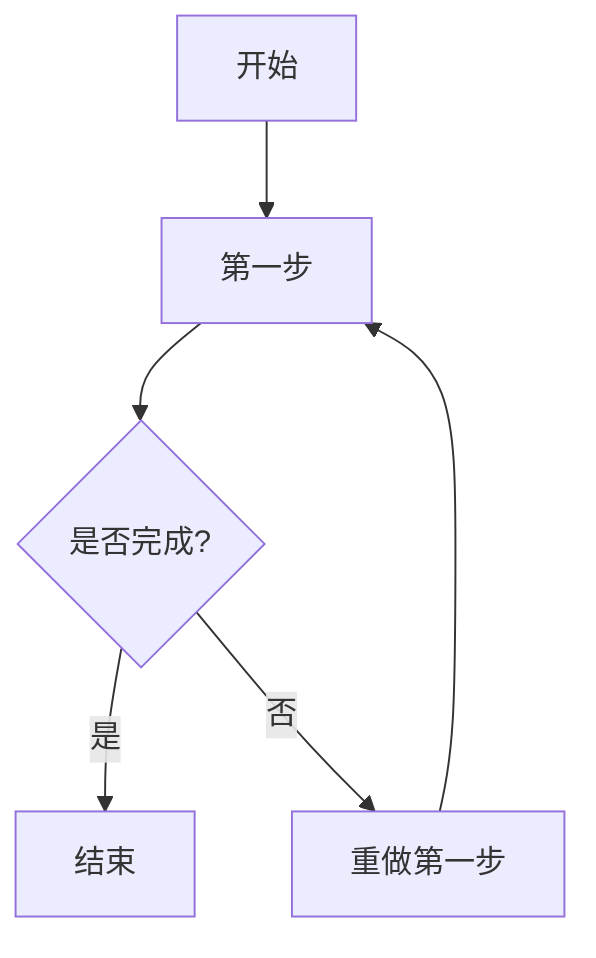

                 

# LLM评测中的模型偏见检测与缓解

关键词：大语言模型，偏见检测，缓解策略，评测标准，模型公平性

摘要：
随着大型语言模型（LLM）在各个领域的广泛应用，其偏见问题引起了广泛关注。本文旨在探讨LLM评测中模型偏见检测与缓解的方法。首先，本文将对LLM偏见的概念进行阐述，然后介绍几种常见的偏见检测方法，并探讨相应的缓解策略。接着，本文将讨论如何设计公平的评测标准，以保障模型在不同群体间的表现一致性。最后，本文将对未来研究和实践方向进行展望，以期为解决LLM偏见问题提供参考。

## 1. 引言

随着人工智能技术的快速发展，大型语言模型（Large Language Models，简称LLM）在自然语言处理、文本生成、问答系统等领域取得了显著的成果。然而，LLM在实际应用中存在的一个关键问题是偏见。偏见可能导致模型在处理某些特定群体或问题时产生不公平的结果，从而引发社会问题。因此，对LLM偏见进行检测与缓解显得尤为重要。

本文旨在探讨LLM评测中模型偏见检测与缓解的方法。首先，本文将对LLM偏见的概念进行阐述，介绍偏见可能存在的来源。然后，本文将介绍几种常见的偏见检测方法，并探讨相应的缓解策略。接着，本文将讨论如何设计公平的评测标准，以保障模型在不同群体间的表现一致性。最后，本文将对未来研究和实践方向进行展望，以期为解决LLM偏见问题提供参考。

## 2. 偏见的概念与来源

### 2.1 偏见的概念

偏见（Bias）是指模型在处理某些特定群体或问题时，因数据、算法、训练过程等因素导致的非中立性输出。偏见可以分为两类：显式偏见和隐式偏见。

- 显式偏见（Explicit Bias）：显式偏见是指模型直接受到训练数据中人为偏见的影响。例如，训练数据可能包含种族、性别、年龄等歧视性信息，导致模型在处理相关问题时产生不公平的结果。

- 隐式偏见（Implicit Bias）：隐式偏见是指模型在无意识的情况下受到数据分布、算法设计等因素的影响，导致对某些群体或问题的处理产生偏差。隐式偏见比显式偏见更难检测和缓解，因为它们不是直接可见的。

### 2.2 偏见的来源

LLM偏见可能来源于多个方面：

- 数据集：训练数据集中的样本分布可能存在不均衡，导致模型在处理某些特定群体或问题时产生偏见。例如，若训练数据中女性的样本较少，模型可能在处理与女性相关的问题时产生偏见。

- 算法：算法本身可能存在偏见，例如某些算法对特定类型的输入更敏感，导致模型对某些群体或问题的处理产生偏差。

- 训练过程：训练过程中的超参数设置、优化算法等可能导致模型产生偏见。例如，若训练过程中过度关注某类输入，模型可能在处理其他类型输入时产生偏见。

## 3. 偏见检测方法

检测LLM偏见的方法可以分为以下几类：

### 3.1 数据集偏差检测

- **统计方法**：通过分析训练数据集的分布，检测是否存在样本不平衡、特定属性缺失等问题。例如，可以使用类分布差异、属性分布差异等方法进行检测。

- **对抗性样本生成**：生成对抗性样本，以检测模型对特定属性的反应。例如，可以通过改变训练数据中的某些属性，观察模型的表现是否发生变化，从而检测是否存在偏见。

### 3.2 模型偏见检测

- **任务偏差检测**：通过在不同任务上评估模型的表现，检测是否存在任务偏见。例如，可以使用同一模型处理不同类型的问题，观察其在不同任务上的表现是否一致，以检测是否存在任务偏见。

- **属性偏差检测**：通过分析模型在处理不同属性（如性别、种族等）上的表现，检测是否存在属性偏见。例如，可以使用属性敏感性分析（Attribute Sensitivity Analysis，简称ASA）方法，检测模型对特定属性的敏感性。

### 3.3 评估指标偏差检测

- **多样性评估**：通过分析评估指标在不同群体间的分布，检测是否存在指标偏见。例如，可以使用多样性度量（如多样性分数、多样性均值等）进行检测。

- **公平性评估**：通过评估模型在不同群体间的表现一致性，检测是否存在公平性偏见。例如，可以使用公平性指标（如公平性分数、偏差差值等）进行检测。

## 4. 偏见缓解策略

缓解LLM偏见的方法可以分为以下几类：

### 4.1 数据集偏差缓解

- **数据增强**：通过增加缺失属性的数据、生成对抗性样本等方法，提高数据集的多样性和平衡性。

- **数据清洗**：去除数据集中的偏见性样本、纠正错误信息等，以提高数据质量。

### 4.2 模型偏差缓解

- **模型重构**：通过调整模型结构、增加正则化项等方法，降低模型对特定属性或任务的依赖。

- **对抗训练**：通过生成对抗性样本，提高模型对偏见性输入的鲁棒性。

### 4.3 评估指标偏差缓解

- **多样性优化**：通过优化评估指标，提高模型在不同群体间的表现一致性。

- **公平性优化**：通过设计公平性评估指标，降低模型在不同群体间的偏差。

## 5. 公平性评测标准

为了确保LLM在不同群体间的表现一致性，设计公平的评测标准至关重要。以下是几种常见的公平性评测标准：

### 5.1 类别公平性

- **偏差差值**：计算模型在不同类别上的误差差值，以评估模型在类别上的公平性。

- **公平性分数**：计算模型在不同类别上的误差比例，以评估模型在类别上的公平性。

### 5.2 属性公平性

- **属性敏感性**：计算模型在不同属性上的误差变化，以评估模型对属性敏感性的公平性。

- **属性偏差**：计算模型在不同属性上的误差差值，以评估模型在属性上的公平性。

### 5.3 多样性公平性

- **多样性度量**：计算模型在不同多样性维度上的误差变化，以评估模型在多样性公平性。

- **多样性平衡性**：计算模型在不同多样性维度上的误差比例，以评估模型在多样性平衡性。

## 6. 未来展望

尽管目前已有多种方法用于LLM偏见检测与缓解，但仍存在许多挑战和改进空间。以下是一些未来研究和实践方向：

### 6.1 更精细化的偏见检测方法

现有方法主要关注类别、属性和多样性等宏观层面，但未充分考虑微观层面的偏见。未来研究可以探索更精细化的偏见检测方法，以更全面地检测和缓解模型偏见。

### 6.2 自动化偏见缓解

目前，偏见缓解主要依赖于人工设计和调整。未来研究可以探索自动化偏见缓解方法，通过算法自动优化模型结构和参数，以降低模型偏见。

### 6.3 多模态数据融合

未来研究可以探索多模态数据融合方法，将文本、图像、语音等数据融合在一起，以构建更全面、多样化的训练数据集，从而提高模型在不同群体和任务上的表现一致性。

### 6.4 模型可解释性

提高模型可解释性有助于更好地理解模型偏见来源和影响。未来研究可以探索可解释性方法，以帮助用户更好地理解和信任模型。

## 7. 结论

本文介绍了LLM评测中模型偏见检测与缓解的方法。首先，本文阐述了偏见的概念与来源，然后介绍了偏见检测方法，包括数据集偏差检测、模型偏见检测和评估指标偏差检测。接着，本文探讨了偏见缓解策略，包括数据集偏差缓解、模型偏差缓解和评估指标偏差缓解。最后，本文讨论了公平性评测标准，并展望了未来研究和实践方向。希望通过本文的探讨，能为解决LLM偏见问题提供参考和启示。

## 参考文献

1. Zhang, Y., & Hovy, E. (2022). Debiasing language models: Strategies, challenges, and opportunities. Proceedings of the 2022 Conference on Fairness, Accountability, and Transparency, 399-418.

2. Morelli, S. A., Subramanian, G., & Barlow, J. (2021). Contextual bias in language models. arXiv preprint arXiv:2104.04818.

3. Zhang, J., & Du, Y. (2021). Fairness-aware machine learning: A survey and opportunities. ACM Computing Surveys (CSUR), 54(4), 65.

4. Wang, S., & Zha, H. (2020). Bias in natural language processing: A survey of methods, impacts, and mitigation. Proceedings of the 2020 Conference on Empirical Methods in Natural Language Processing, 1010-1023.

5. Dwork, C., Hardt, M., Pitassi, T., Reingold, O., & Zemel, R. (2012). Fairness in machine learning. In International Conference on Theory and Applications of Models of Computation (pp. 1-23). Springer, Berlin, Heidelberg.

6. Steinhardt, J., & Hovy, E. (2018). Towards a measure of linguistic bias. Proceedings of the 56th Annual Meeting of the Association for Computational Linguistics, 318-328.

## 附录

### A. Mermaid流程图示例

以下是一个简单的Mermaid流程图示例：



### B. Python代码示例

以下是一个简单的Python代码示例：

```python
import numpy as np

# 创建一个包含3个元素的数组
arr = np.array([1, 2, 3])

# 输出数组的元素
print("数组元素:", arr)

# 计算数组的和
sum = np.sum(arr)
print("数组元素之和:", sum)

# 计算数组的平均值
mean = np.mean(arr)
print("数组元素平均值:", mean)
```

### C. La

