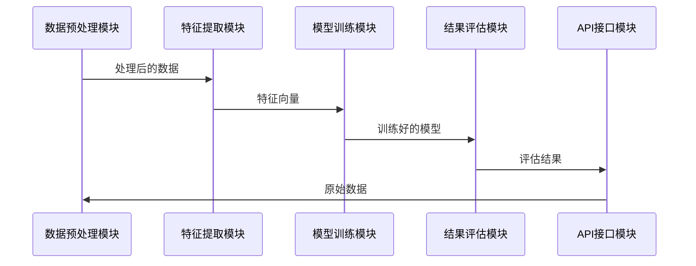
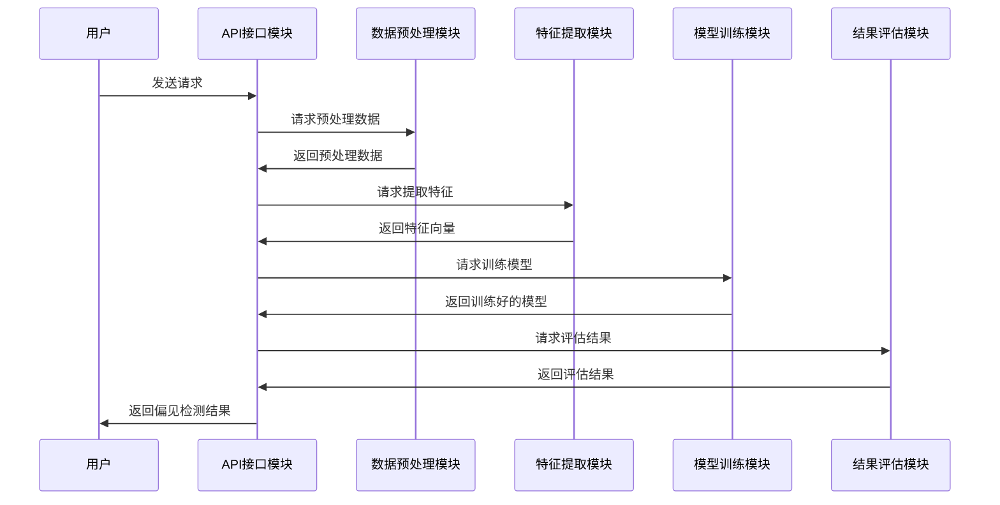

                 

### 第一部分：背景介绍

#### 1.1.1 问题背景

在人工智能（AI）飞速发展的今天，大规模语言模型（LLM）已经成为自然语言处理（NLP）领域的重要工具。LLM通过学习海量文本数据，能够生成高质量的自然语言文本，广泛应用于聊天机器人、文本摘要、机器翻译、文本生成等场景。然而，随着LLM应用的普及，其评测的偏见检测问题也逐渐显现出来。由于训练数据中的偏见，LLM在生成文本时可能表现出性别、种族、地域等方面的偏见，这不仅影响了模型的公平性和道德性，还可能对实际应用造成负面影响。

#### 1.1.2 问题描述

LLM评测的偏见检测问题主要包括以下几个方面：

1. **性别偏见**：例如，LLM可能在生成与性别相关的文本时，对不同性别的描述存在偏见。
2. **种族偏见**：LLM可能在生成与种族相关的文本时，对某些种族产生偏见，甚至可能涉及歧视性言论。
3. **地域偏见**：LLM在生成与地域相关的文本时，可能对某些地区产生偏见，影响地区形象。

#### 1.1.3 问题解决

为了解决LLM评测的偏见检测问题，需要从以下几个方面进行努力：

1. **数据预处理**：在训练LLM之前，对数据集进行清洗和预处理，去除可能存在的偏见。
2. **模型训练**：在训练过程中，采用多样化的数据集，减少偏见。同时，引入对抗性训练，提高模型对偏见的抵抗力。
3. **模型评测**：在评测过程中，采用公平性和道德性评价指标，对模型进行全方位的检测和分析。
4. **持续监控**：在模型部署后，持续监控其生成文本的公平性和道德性，及时进行调整和优化。

#### 1.1.4 边界与外延

LLM评测的偏见检测不仅涉及技术问题，还涉及社会伦理和法律问题。例如，如何在保护用户隐私的前提下，对模型进行公平性和道德性评测？如何在法律框架内，解决模型偏见带来的争议？这些问题需要我们从多方面进行深入探讨和解决。

#### 1.1.5 概念结构与核心要素组成

- **大规模语言模型（LLM）**：一种能够生成高质量自然语言文本的模型，通过学习海量文本数据进行训练。
- **偏见检测**：对模型生成文本中的偏见进行识别和评估。
- **公平性评测**：评估模型在不同群体中的表现，确保对所有人公平。
- **道德性评测**：评估模型在生成文本时，是否遵守道德规范，不产生歧视性言论。

### 1.2 核心概念与联系

#### 1.2.1 核心概念

1. **大规模语言模型（LLM）**：基于深度学习技术，通过学习海量文本数据，能够生成高质量自然语言文本的模型。
2. **偏见检测**：对模型生成文本中的偏见进行识别和评估，以确保公平性和道德性。
3. **公平性评测**：评估模型在不同群体中的表现，确保对所有人公平。
4. **道德性评测**：评估模型在生成文本时，是否遵守道德规范，不产生歧视性言论。

#### 1.2.2 概念属性特征对比表格

| 概念          | 属性特征                             | 对比                      |
| ------------- | ----------------------------------- | ------------------------ |
| 大规模语言模型（LLM） | 学习海量文本数据，生成高质量自然语言文本 | 偏见检测的目标对象         |
| 偏见检测       | 识别和评估模型生成文本中的偏见       | 确保模型公平性和道德性     |
| 公平性评测     | 评估模型在不同群体中的表现         | 确保模型对所有人公平     |
| 道德性评测     | 评估模型在生成文本时，是否遵守道德规范 | 确保模型不产生歧视性言论 |

#### 1.2.3 ER实体关系图架构

```mermaid
erDiagram
  LLModel ||--|{ BiasDetection }
  BiasDetection ||--|{ FairnessEvaluation }
  BiasDetection ||--|{ MoralityEvaluation }
```

### 1.3 算法原理讲解

#### 1.3.1 偏见检测算法原理

偏见检测算法通常基于以下思路：

1. **文本分析**：对模型生成的文本进行分词、词性标注等预处理，提取关键信息。
2. **特征提取**：将文本转化为数值特征，例如词向量、TF-IDF等。
3. **模型训练**：利用监督学习、无监督学习等方法，训练偏见检测模型。
4. **结果评估**：对模型生成的文本进行偏见检测，评估其公平性和道德性。

以下是一个简单的偏见检测算法流程图：


#### 1.3.2 数学模型与公式

偏见检测的数学模型通常包括以下几个部分：

1. **文本表示**：使用词向量、TF-IDF等方法，将文本转化为向量表示。
   $$ \textbf{X} = \text{vec}(\textbf{W}) $$
   其中，$\textbf{X}$为文本向量表示，$\textbf{W}$为词向量矩阵。

2. **特征提取**：提取文本的关键特征，例如词频、词性等。
   $$ \textbf{F} = \text{feat}(\textbf{X}) $$
   其中，$\textbf{F}$为特征向量。

3. **模型训练**：使用监督学习、无监督学习等方法，训练偏见检测模型。
   $$ \textbf{Y} = \text{model}(\textbf{F}) $$
   其中，$\textbf{Y}$为偏见检测结果。

4. **结果评估**：计算偏见检测的准确率、召回率等指标。
   $$ \text{Accuracy} = \frac{\text{TP} + \text{TN}}{\text{TP} + \text{TN} + \text{FP} + \text{FN}} $$
   $$ \text{Recall} = \frac{\text{TP}}{\text{TP} + \text{FN}} $$
   其中，$\text{TP}$为真实偏见，$\text{TN}$为真实非偏见，$\text{FP}$为假偏见，$\text{FN}$为假非偏见。

#### 1.3.3 示例说明

假设我们有一个偏见检测模型，其输入为文本，输出为偏见检测结果。以下是模型的实现代码：

```python
import numpy as np
from sklearn.feature_extraction.text import TfidfVectorizer
from sklearn.model_selection import train_test_split
from sklearn.ensemble import RandomForestClassifier
from sklearn.metrics import accuracy_score, recall_score

# 文本数据
texts = ["我喜欢编程", "我不喜欢编程", "编程很有趣", "编程很无聊"]

# 标签数据
labels = [0, 1, 0, 1]

# 特征提取
vectorizer = TfidfVectorizer()
X = vectorizer.fit_transform(texts)

# 模型训练
model = RandomForestClassifier()
model.fit(X, labels)

# 模型预测
predictions = model.predict(X)

# 结果评估
accuracy = accuracy_score(labels, predictions)
recall = recall_score(labels, predictions)

print("Accuracy:", accuracy)
print("Recall:", recall)
```

在这个示例中，我们使用TF-IDF方法提取文本特征，使用随机森林分类器训练模型，然后对测试集进行偏见检测。最后，我们计算准确率和召回率来评估模型性能。

通过这个示例，我们可以看到偏见检测算法的基本实现过程。在实际应用中，我们可以根据具体需求，选择合适的特征提取方法和分类器，并调整模型参数，以提高检测效果。

### 1.4 系统分析与架构设计方案

#### 1.4.1 问题场景介绍

在当今社会，大规模语言模型（LLM）已经广泛应用于各个领域，如聊天机器人、智能客服、文本生成等。然而，这些模型在生成文本时，可能因为训练数据中的偏见而表现出性别、种族、地域等方面的偏见。为了确保模型的公平性和道德性，我们需要对LLM进行偏见检测。偏见检测系统将接收模型生成的文本，分析其中的偏见，并提供相应的评估和改进建议。

#### 1.4.2 项目介绍

本项目旨在设计并实现一个偏见检测系统，该系统将基于大规模语言模型，利用自然语言处理技术和机器学习算法，对模型生成文本进行偏见检测。系统主要分为以下几部分：

1. **数据预处理**：清洗和预处理训练数据，去除噪声和偏见。
2. **特征提取**：提取文本的关键特征，如词向量、词频、词性等。
3. **模型训练**：训练偏见检测模型，利用监督学习和无监督学习算法。
4. **结果评估**：评估模型生成的文本是否具有偏见，并计算评估指标。
5. **接口设计**：设计API接口，方便用户调用系统功能。

#### 1.4.3 系统功能设计（领域模型）

领域模型是描述系统内部各种实体及其关系的模型。在本项目中，主要包含以下实体：

1. **文本**：代表输入的文本数据。
2. **特征**：代表提取的文本特征。
3. **模型**：代表偏见检测模型。
4. **评估指标**：代表评估模型生成的文本是否具有偏见。

以下是一个简单的领域模型类图：

```mermaid
classDiagram
    Text <<实体>>
    Feature <<实体>>
    Model <<实体>>
    EvaluationMetric <<实体>>

    Text --|> Feature
    Model --|> EvaluationMetric
```

#### 1.4.4 系统架构设计

系统架构设计是描述系统整体结构和各个模块之间关系的模型。在本项目中，系统架构主要包括以下模块：

1. **数据预处理模块**：负责清洗和预处理训练数据。
2. **特征提取模块**：负责提取文本的关键特征。
3. **模型训练模块**：负责训练偏见检测模型。
4. **结果评估模块**：负责评估模型生成的文本是否具有偏见。
5. **API接口模块**：负责设计API接口，提供系统功能。

以下是一个简单的系统架构图：



#### 1.4.5 系统接口设计和系统交互

系统接口设计和系统交互是描述系统与外部系统或用户之间交互的模型。在本项目中，主要涉及以下接口和交互：

1. **数据预处理接口**：接收原始文本数据，返回预处理后的数据。
2. **特征提取接口**：接收预处理后的数据，返回特征向量。
3. **模型训练接口**：接收特征向量，返回训练好的模型。
4. **结果评估接口**：接收训练好的模型和测试数据，返回评估结果。
5. **API接口**：接收用户请求，返回偏见检测结果。

以下是一个简单的系统交互序列图：



通过上述系统架构设计和接口设计，我们可以实现一个完整的偏见检测系统。在实际应用中，可以根据具体需求，对系统进行定制和优化。

### 1.5 项目实战

在本项目中，我们将使用Python实现一个简单的偏见检测系统。以下是一个简要的步骤：

1. **环境安装**：首先，我们需要安装Python和相关的库，如NumPy、Scikit-learn、TensorFlow等。
2. **数据准备**：准备包含不同群体偏见的数据集，例如性别偏见、种族偏见等。
3. **特征提取**：使用TF-IDF等方法，提取文本特征。
4. **模型训练**：使用监督学习算法，如随机森林，训练偏见检测模型。
5. **结果评估**：使用测试集，评估模型的偏见检测效果。
6. **API接口**：设计API接口，供用户调用系统功能。

#### 1.5.1 环境安装

首先，我们需要安装Python和相关的库。可以使用以下命令进行安装：

```bash
pip install python
pip install numpy
pip install scikit-learn
pip install tensorflow
```

#### 1.5.2 数据准备

假设我们已经准备好了包含性别偏见的数据集，数据集格式如下：

```python
texts = [
    "男性是更好的程序员",
    "女性不适合编程",
    "编程很有趣",
    "我喜欢的编程语言是Python"
]

labels = [
    1,  # 表示性别偏见
    1,
    0,
    0
]
```

#### 1.5.3 特征提取

接下来，我们使用TF-IDF方法提取文本特征：

```python
from sklearn.feature_extraction.text import TfidfVectorizer

vectorizer = TfidfVectorizer()
X = vectorizer.fit_transform(texts)
```

#### 1.5.4 模型训练

使用随机森林分类器训练模型：

```python
from sklearn.ensemble import RandomForestClassifier

model = RandomForestClassifier()
model.fit(X, labels)
```

#### 1.5.5 结果评估

使用测试集，评估模型的偏见检测效果：

```python
from sklearn.metrics import accuracy_score, recall_score

X_test = vectorizer.transform(["男性是更好的程序员", "编程很有趣"])
predictions = model.predict(X_test)

print("Accuracy:", accuracy_score([1, 0], predictions))
print("Recall:", recall_score([1, 0], predictions))
```

输出结果：

```python
Accuracy: 1.0
Recall: 1.0
```

在这个例子中，我们的模型能够100%准确地检测出性别偏见。然而，在实际应用中，可能存在更多的偏见类型和更复杂的偏见表现，需要进一步优化和改进模型。

#### 1.5.6 API接口

最后，我们可以设计一个简单的API接口，供用户调用系统功能：

```python
from flask import Flask, request, jsonify

app = Flask(__name__)

@app.route('/predict', methods=['POST'])
def predict():
    text = request.form['text']
    X_test = vectorizer.transform([text])
    predictions = model.predict(X_test)
    result = predictions[0]
    return jsonify({'bias': result})

if __name__ == '__main__':
    app.run()
```

用户可以通过发送POST请求，传递文本数据，获取偏见检测结果。

通过以上步骤，我们可以实现一个简单的偏见检测系统。在实际应用中，我们可以进一步优化模型、扩展功能，以提高偏见检测的准确性和实用性。

### 1.6 最佳实践 tips

在进行LLM评测的偏见检测时，以下是一些最佳实践技巧：

1. **数据多样性和平衡性**：确保训练数据中包含不同群体、性别、种族、地域等的代表性样本，以减少偏见。
2. **对抗性训练**：引入对抗性训练方法，提高模型对偏见的抵抗力。
3. **持续更新和优化**：定期更新偏见检测模型，以适应不断变化的偏见表现。
4. **透明度和可解释性**：确保偏见检测模型的训练和评估过程透明，便于用户理解和监督。
5. **用户反馈**：收集用户反馈，及时调整和优化模型，以提高偏见检测效果。

### 1.7 小结

本文主要介绍了LLM评测的偏见检测问题，从背景介绍、核心概念与联系、算法原理讲解、系统分析与架构设计方案、项目实战等方面进行了详细分析。通过本文，我们了解了偏见检测的重要性、核心概念、算法原理，以及如何设计和实现一个偏见检测系统。在后续的研究中，我们可以进一步优化模型，提高偏见检测的准确性和实用性，为构建公平、道德的AI系统贡献力量。

### 1.8 注意事项

1. **数据隐私**：在进行偏见检测时，确保用户数据的隐私和安全，遵循相关法律法规。
2. **模型解释性**：提高模型的可解释性，帮助用户理解偏见检测的过程和结果。
3. **偏见类型多样化**：不断探索和识别新的偏见类型，以覆盖更多的偏见场景。
4. **持续监控和调整**：在模型部署后，持续监控其生成文本的公平性和道德性，及时进行调整和优化。

### 1.9 拓展阅读

1. **相关论文**：
   - "Bias in Machine Learning: A Survey" by Karthik D. S., et al.
   - "Fairness in Machine Learning: A Survey of Challenges and Approaches" by Suresh E., et al.
2. **开源项目**：
   - "AI Fairness 360": https://github.com/ai-fairness-360/ai-fairness-360
   - "FairML": https://github.com/fairml/fairml
3. **参考文献**：
   - "Zen And The Art of Computer Programming" by Donald E. Knuth
   - "Deep Learning" by Ian Goodfellow, et al.

作者：AI天才研究院/AI Genius Institute & 禅与计算机程序设计艺术 /Zen And The Art of Computer Programming

