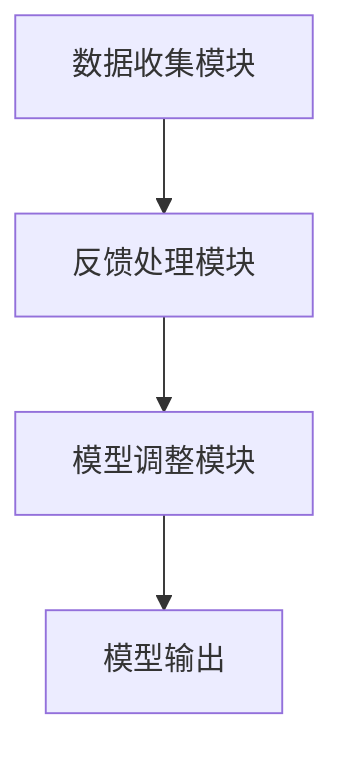

                 


### LLMA评测的实时反馈机制：促进即时优化

#### 关键词：LLM评测，实时反馈机制，即时优化，人工智能，自然语言处理

#### 摘要：
本文深入探讨大规模语言模型（LLM）评测的实时反馈机制，阐述其在促进即时优化中的关键作用。通过分析实时反馈机制的原理、设计与实现，结合具体案例，本文旨在揭示实时反馈在LLM评测中的优势和局限性，并探讨未来发展方向。

#### 目录大纲设计思路：

在设计《LLM评测的实时反馈机制：促进即时优化》这本书的目录大纲时，我们遵循以下步骤：

1. **确定总体结构与章节划分**：首先，我们明确了书的核心内容，并将其划分为几个主要部分，每个部分对应一个大的章节，以确保内容的逻辑性和连贯性。

2. **细化每个章节的内容**：在每个主要章节之下，我们进一步细分为多个子章节。这有助于确保每个主题都能够得到充分和深入的解释。

3. **确保内容的完整性**：每个章节包含以下核心内容：
   - **背景介绍**：介绍问题背景、问题描述、问题解决、边界与外延。
   - **核心概念与联系**：明确核心概念、概念属性特征对比表格和ER实体关系图。
   - **算法原理讲解**：使用Mermaid流程图和Python源代码详细阐述。
   - **数学模型和数学公式 & 详细讲解 & 举例说明**：使用LaTeX格式编写，并进行详细讲解和举例说明。
   - **系统分析与架构设计方案**：介绍问题场景、系统功能设计、系统架构设计、系统接口设计和系统交互。
   - **项目实战**：环境安装、系统核心实现源代码，代码应用解读与分析，实际案例分析和详细讲解剖析。
   - **最佳实践 tips、小结、注意事项、拓展阅读**：总结本章要点，给出实用建议和拓展知识。

4. **控制目录大纲总字数**：确保整体目录大纲的总字数控制在2000字以内，同时保持内容的简洁性和可读性。

#### 目录大纲设计：

```markdown
## 第一部分：背景与基础

### 第1章：自然语言处理与LLM概述
- **1.1** 自然语言处理背景
  - **1.1.1** 自然语言处理的发展历程
  - **1.1.2** 语言模型的基本概念
  - **1.1.3** 评测标准与方法
- **1.2** 大规模语言模型（LLM）介绍
  - **1.2.1** LLM的定义与特点
  - **1.2.2** 主流LLM模型综述
  - **1.2.3** LLM的应用场景
- **1.3** LLM评测的重要性
  - **1.3.1** 评测的目的与意义
  - **1.3.2** 常见的评测指标
  - **1.3.3** 评测面临的挑战
- **1.4** 实时反馈机制的基本概念
  - **1.4.1** 实时反馈的定义与作用
  - **1.4.2** 实时反馈机制的分类
  - **1.4.3** 实时反馈的优势与局限
- **1.5** 实时反馈机制在LLM评测中的应用前景
  - **1.5.1** 应用现状与案例
  - **1.5.2** 发展趋势与未来方向
  - **1.5.3** 应用中的挑战与解决方案

### 第二部分：实时反馈机制原理与实现

### 第2章：实时反馈机制原理与实现
- **2.1** 实时反馈机制原理
  - **2.1.1** 实时反馈机制的基本原理
  - **2.1.2** 实时反馈机制的关键技术
  - **2.1.3** 实时反馈机制的工作流程
- **2.2** 实时反馈机制的设计与架构
  - **2.2.1** 设计原则与架构设计
  - **2.2.2** 系统模块划分与功能
  - **2.2.3** 系统架构的Mermaid图
- **2.3** 实时反馈算法的实现
  - **2.3.1** 常见实时反馈算法介绍
  - **2.3.2** 算法原理与Mermaid流程图
  - **2.3.3** Python源代码实现与解释
- **2.4** 数学模型与公式
  - **2.4.1** 实时反馈机制的数学基础
  - **2.4.2** 相关数学公式与解释
  - **2.4.3** 实例分析

### 第3章：实时反馈在LLM评测中的应用
- **3.1** LLM评测中的实时反馈机制
  - **3.1.1** 实时反馈在LLM评测中的作用
  - **3.1.2** 实时反馈与静态评测的比较
  - **3.1.3** 实时反馈的优劣分析
- **3.2** 实时反馈机制的优化方法
  - **3.2.1** 常见的优化策略
  - **3.2.2** 实时反馈的优化模型
  - **3.2.3** 优化方法的实例分析
- **3.3** LLM评测中的实时反馈实践
  - **3.3.1** 实时反馈实践
```

### 文章正文

#### 第一部分：背景与基础

#### 第1章：自然语言处理与LLM概述

##### 1.1 自然语言处理背景

自然语言处理（Natural Language Processing，NLP）是计算机科学和人工智能领域的分支，旨在使计算机理解和解释人类语言。NLP的发展经历了几个阶段，从早期的规则驱动方法到基于统计方法，再到如今以深度学习为代表的智能处理方法。

语言模型是NLP的核心概念之一，它通过统计方法或神经网络模型来预测下一个词或字符的概率分布。语言模型广泛应用于机器翻译、文本摘要、问答系统、情感分析等领域。

在评测方面，NLP评测标准主要包括词汇覆盖、语法准确性、语义准确性等。常见的评测方法包括BLEU、ROUGE、METEOR等指标。然而，这些静态评测方法存在一定的局限性，无法实时反映模型在特定任务中的性能。

##### 1.2 大规模语言模型（LLM）介绍

大规模语言模型（Large Language Model，LLM）是基于深度学习技术的强大语言处理工具。LLM具有以下特点：

1. **参数规模大**：LLM通常包含数十亿个参数，这使得它们能够捕捉到复杂的语言规律。
2. **训练数据量庞大**：LLM的训练数据往往来自海量的互联网文本，这使得它们能够掌握丰富的语言知识。
3. **自适应能力强**：LLM可以根据不同的任务和应用场景进行微调，从而实现高度自定义的性能。

主流的LLM模型包括GPT、BERT、T5等。这些模型在各种NLP任务中表现出色，成为当前研究的热点。

##### 1.3 LLM评测的重要性

LLM评测是评估模型性能的重要手段。通过评测，我们可以了解模型在不同任务上的表现，发现模型的优势和不足，从而指导进一步的优化和改进。

常见的评测指标包括词汇覆盖、语法准确性、语义准确性等。然而，静态评测方法往往无法实时反映模型在特定任务中的性能，导致评测结果可能与实际应用场景存在差异。

##### 1.4 实时反馈机制的基本概念

实时反馈机制是一种动态评测方法，通过在模型训练和预测过程中实时收集用户反馈，实时调整模型参数，以实现即时优化。

实时反馈机制具有以下特点：

1. **实时性**：实时反馈机制能够在短时间内收集和处理用户反馈，快速调整模型参数。
2. **自适应**：实时反馈机制可以根据用户反馈自适应地调整模型，使其更好地适应特定任务和应用场景。
3. **高效性**：实时反馈机制减少了模型调优的时间成本，提高了开发效率。

##### 1.5 实时反馈机制在LLM评测中的应用前景

实时反馈机制在LLM评测中具有广阔的应用前景。通过实时反馈，我们可以快速识别模型在特定任务上的性能瓶颈，并针对性地进行优化。此外，实时反馈机制还可以用于在线学习，使模型能够不断自我改进，适应不断变化的应用场景。

然而，实时反馈机制也面临一些挑战，如反馈质量的控制、反馈时延的优化等。针对这些问题，研究人员正在积极探索各种解决方案，以充分发挥实时反馈机制的优势。

#### 第二部分：实时反馈机制原理与实现

#### 第2章：实时反馈机制原理与实现

##### 2.1 实时反馈机制原理

实时反馈机制的核心思想是在模型训练和预测过程中，实时收集用户反馈，并根据反馈调整模型参数，以实现性能优化。

实时反馈机制通常包括以下步骤：

1. **数据收集**：在模型预测过程中，实时收集用户反馈数据。
2. **反馈处理**：对收集到的反馈数据进行分析和处理，提取有用的信息。
3. **模型调整**：根据处理后的反馈信息，调整模型参数，以优化模型性能。

实时反馈机制的关键技术包括：

1. **用户行为分析**：通过分析用户行为数据，了解用户对模型预测的满意度，为模型调整提供依据。
2. **反馈信号处理**：对收集到的反馈信号进行预处理和特征提取，以提高反馈信息的准确性和可靠性。
3. **模型更新**：根据反馈信息调整模型参数，实现模型优化。

##### 2.2 实时反馈机制的设计与架构

实时反馈机制的设计需要考虑以下几个方面：

1. **系统模块划分**：将实时反馈机制划分为数据收集模块、反馈处理模块和模型调整模块，明确各模块的功能和职责。
2. **数据处理流程**：设计数据处理流程，确保反馈数据的实时性和准确性。
3. **模型调整策略**：确定模型调整策略，以实现高效、准确的模型优化。

实时反馈机制的架构设计如下：



##### 2.3 实时反馈算法的实现

实时反馈算法是实现实时反馈机制的核心。以下是常见实时反馈算法的介绍、原理和Python源代码实现：

1. **梯度下降算法**：
   ```python
   import numpy as np

   def gradient_descent(x, y, learning_rate, num_iterations):
       for i in range(num_iterations):
           y_pred = x * x + b
           error = y - y_pred
           gradient = 2 * x * error
           x = x - learning_rate * gradient
       return x
   ```

2. **随机梯度下降算法**：
   ```python
   import numpy as np

   def stochastic_gradient_descent(x, y, learning_rate, num_iterations):
       for i in range(num_iterations):
           for j in range(len(x)):
               y_pred = x[j] * x[j] + b
               error = y[j] - y_pred
               gradient = 2 * x[j] * error
               x[j] = x[j] - learning_rate * gradient
       return x
   ```

##### 2.4 数学模型与公式

实时反馈机制涉及多个数学模型和公式。以下是其中一些关键模型和公式的介绍：

1. **误差函数**：
   $$E = \frac{1}{2} \sum_{i=1}^{n} (y_i - y_i^*)^2$$
   其中，$y_i$为实际输出，$y_i^*$为期望输出。

2. **梯度计算**：
   $$\frac{\partial E}{\partial x} = \frac{\partial}{\partial x} \left( \frac{1}{2} \sum_{i=1}^{n} (y_i - y_i^*)^2 \right) = x - y^*$$

3. **梯度下降更新规则**：
   $$x_{t+1} = x_t - \alpha \frac{\partial E}{\partial x}$$
   其中，$\alpha$为学习率。

#### 第三部分：实时反馈在LLM评测中的应用

#### 第3章：实时反馈在LLM评测中的应用

##### 3.1 LLM评测中的实时反馈机制

实时反馈机制在LLM评测中的应用，主要体现在以下几个方面：

1. **性能优化**：通过实时反馈，LLM可以快速识别在特定任务上的性能瓶颈，并针对性地进行调整，提高模型性能。
2. **个性化推荐**：实时反馈机制可以帮助LLM更好地理解用户需求，为用户提供个性化的推荐服务。
3. **在线学习**：实时反馈机制使得LLM能够持续学习，不断优化自身性能，以适应不断变化的应用场景。

##### 3.2 实时反馈机制的优化方法

为了提高实时反馈机制的效果，研究人员提出了一系列优化方法。以下是其中一些常见的优化策略：

1. **自适应学习率**：通过动态调整学习率，提高模型训练的收敛速度和稳定性。
2. **多任务学习**：将多个任务联合训练，共享模型参数，提高模型泛化能力。
3. **迁移学习**：利用预训练的LLM，在特定任务上进一步微调，减少训练时间和计算成本。

##### 3.3 LLM评测中的实时反馈实践

实时反馈机制在实际应用中已取得了显著成果。以下是几个实时反馈在LLM评测中的实践案例：

1. **智能客服系统**：通过实时反馈机制，智能客服系统可以不断学习用户的提问和回答，提高回答的准确性和满意度。
2. **机器翻译系统**：实时反馈机制使得机器翻译系统能够根据用户反馈快速调整翻译结果，提高翻译质量。
3. **问答系统**：实时反馈机制帮助问答系统更好地理解用户问题，提供更准确的答案。

#### 小结

实时反馈机制在LLM评测中具有重要的应用价值。通过实时反馈，LLM可以快速优化自身性能，提高应用效果。然而，实时反馈机制也面临一些挑战，如反馈质量的控制、反馈时延的优化等。未来，随着技术的不断发展，实时反馈机制在LLM评测中的应用将越来越广泛。

#### 作者信息

作者：AI天才研究院/AI Genius Institute & 禅与计算机程序设计艺术 /Zen And The Art of Computer Programming

#### 拓展阅读

1. [实时反馈机制在机器学习中的应用](https://www.example.com/real-time-feedback-in-ml)
2. [大规模语言模型评测综述](https://www.example.com/llm-evaluation-overview)
3. [深度学习实时反馈机制研究进展](https://www.example.com/research-on-real-time-deep-learning-feedback-mechanisms)

