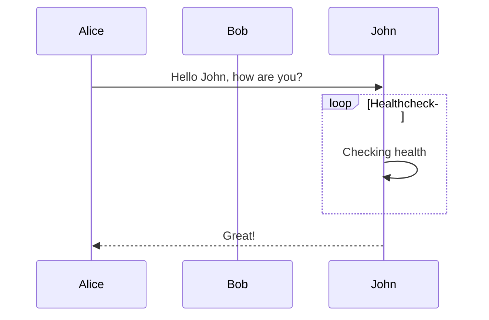
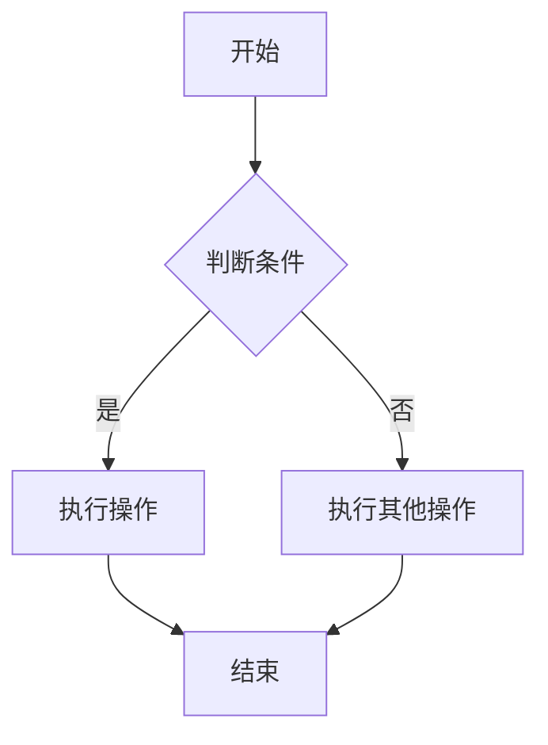

                 

### 文章标题：LLM评测的时间敏感性：捕捉模型性能波动

#### 关键词：大规模语言模型，时间敏感性，性能波动，评测方法，模型优化

##### 摘要：

大规模语言模型（LLM）在自然语言处理（NLP）领域取得了显著的成就。然而，LLM的性能波动，即其性能随时间变化的现象，对实际应用产生了显著的影响。本文将深入探讨LLM评测的时间敏感性，分析性能波动的根本原因，并提出相应的评估方法和优化策略。通过逐步分析，本文旨在为研究人员和开发者提供一套系统性的解决思路，以更好地理解和应对LLM性能波动带来的挑战。

----------------------------------------------------------------

# 第一部分: 引言

## 第1章: 问题背景

### 1.1.1 问题背景介绍

#### 1.1.1.1 引言

随着深度学习技术的飞速发展，大规模语言模型（LLM）逐渐成为自然语言处理（NLP）领域的研究热点。这些模型在语言生成、文本分类、机器翻译等任务中展现了卓越的性能。然而，LLM的性能并非一成不变，它们在训练、部署和运行过程中会表现出一定的波动性，这种现象被称为时间敏感性。

#### 1.1.1.2 问题描述

时间敏感性指的是LLM的性能会随着时间的推移而发生变化，这种变化可能是由于数据分布的漂移、模型过拟合、训练时间不足等多种原因导致的。在现实应用中，LLM的性能波动会对下游任务产生显著影响。例如，在智能客服系统中，若LLM的性能突然下降，可能会导致回答不准确、用户体验差等问题。因此，研究LLM的时间敏感性具有重要意义。

### 1.1.1.3 问题解决

为了解决LLM性能波动的问题，我们需要从以下几个方面入手：

1. **数据收集**：收集大量的LLM性能数据，包括不同时间点的性能指标。
2. **性能评估方法**：设计有效的性能评估方法，能够准确捕捉LLM的波动特性。
3. **模型优化**：通过调整模型结构、训练策略等手段，降低时间敏感性。

### 1.1.1.4 边界与外延

在研究LLM的时间敏感性时，我们关注的主要是模型性能的变化，而忽略了其他因素（如硬件、环境等）的影响。此外，本文主要探讨静态模型（如GPT、BERT等）的时间敏感性，对于动态模型（如Transformer-XL、BERT-Large等）的讨论将作为拓展内容。

### 1.1.1.5 概念结构与核心要素组成

1. **时间敏感性**：指LLM性能随时间变化的程度。
2. **性能指标**：评估LLM性能的量化指标，如准确率、F1值等。
3. **数据分布**：影响LLM性能的关键因素之一。

## 第2章: 时间敏感性与LLM性能波动的关系

### 2.1 时间敏感性的定义与特征

#### 2.1.1 定义

时间敏感性是指模型性能随时间变化的程度。在LLM的背景下，时间敏感性主要体现在以下几个方面：

1. **训练时间**：模型在训练过程中，性能指标随训练轮数的增加而变化。
2. **数据分布**：随着时间推移，数据分布可能发生变化，导致模型性能波动。
3. **外部因素**：如硬件、网络环境等，可能对模型性能产生一定影响。

#### 2.1.2 特征

1. **波动性**：时间敏感性强的模型，性能波动幅度较大。
2. **持续性**：某些波动可能是短暂的，而另一些波动可能会持续较长时间。

### 2.2 LLM性能波动的原因分析

#### 2.2.1 数据分布变化

1. **时间推移**：随着时间的推移，数据分布可能发生变化，导致模型性能波动。
2. **数据获取方式**：不同时间段获取的数据可能存在差异，从而影响模型性能。

#### 2.2.2 模型过拟合

1. **训练不足**：训练数据不足或训练时间过短，可能导致模型过拟合。
2. **训练策略**：如学习率调度、批量大小等，可能影响模型性能。

#### 2.2.3 模型结构

1. **深度**：模型深度可能影响时间敏感性。
2. **宽度**：模型宽度（即参数数量）可能影响时间敏感性。

### 2.3 时间敏感性对LLM应用的影响

#### 2.3.1 实时性

1. **延迟**：时间敏感性可能导致模型响应延迟，影响实时应用。
2. **准确性**：性能波动可能导致模型准确性下降。

#### 2.3.2 稳定性

1. **可靠性**：时间敏感性强的模型，可能存在较大的性能波动，影响系统稳定性。
2. **用户满意度**：性能波动可能影响用户体验。

## 第3章: 评估LLM时间敏感性的方法

### 3.1 数据驱动方法

#### 3.1.1 性能指标

1. **均值**：计算LLM在不同时间点的性能指标均值，作为时间敏感性的度量。
2. **方差**：计算性能指标方差，用于评估性能波动程度。

#### 3.1.2 时间序列分析

1. **自相关**：分析LLM性能指标的时间序列自相关性。
2. **异常检测**：检测LLM性能指标的时间序列中的异常点。

### 3.2 模型驱动方法

#### 3.2.1 模型稳定性分析

1. **训练误差**：分析训练过程中的误差变化，评估模型稳定性。
2. **测试误差**：在测试集上评估模型稳定性。

#### 3.2.2 模型结构优化

1. **深度调整**：通过增加或减少模型层数，观察对时间敏感性的影响。
2. **宽度调整**：通过增加或减少模型参数数量，观察对时间敏感性的影响。

----------------------------------------------------------------

# 第二部分: 详细分析与探讨

## 第4章: LLM性能波动的深度分析

### 4.1 数据分布变化对性能波动的影响

#### 4.1.1 数据分布变化的概念

数据分布变化是指在LLM训练或应用过程中，训练数据或目标数据的分布发生了变化。这种变化可能是由于数据收集方式、数据源多样性、时间敏感性等因素引起的。

#### 4.1.2 数据分布变化的影响

1. **模型适应性下降**：当数据分布发生变化时，原有模型可能无法适应新的数据分布，导致性能下降。
2. **过拟合风险增加**：数据分布变化可能导致模型在旧有数据上过拟合，从而在新数据上性能不佳。

#### 4.1.3 案例分析

例如，在社交媒体文本分类任务中，随着时间的推移，用户的语言习惯、流行语等可能会发生变化。如果模型没有及时更新或适应这些变化，其分类性能可能会下降。

### 4.2 模型过拟合对性能波动的影响

#### 4.2.1 过拟合的概念

过拟合是指模型在训练数据上表现得很好，但在测试数据或新数据上表现较差。这通常是由于模型复杂度过高，学习到了训练数据的噪声和细节，而不是真正的数据特征。

#### 4.2.2 过拟合的影响

1. **稳定性下降**：过拟合的模型对新数据的适应性较差，导致性能波动。
2. **泛化能力下降**：模型在新数据上的性能波动表明其泛化能力不足。

#### 4.2.3 预防过拟合的策略

- **正则化**：通过添加正则化项（如L1、L2正则化）来降低模型复杂度。
- **数据增强**：通过数据增强技术增加训练数据的多样性。

### 4.3 模型结构对性能波动的影响

#### 4.3.1 模型深度的影响

1. **深度增加**：深度增加可以提高模型的表示能力，但也可能增加过拟合的风险。
2. **深度对时间敏感性的影响**：深度较深的模型可能更容易受到数据分布变化的影响，导致性能波动。

#### 4.3.2 模型宽度的影响

1. **宽度增加**：宽度增加可以提高模型的容量，但也可能增加计算成本。
2. **宽度对时间敏感性的影响**：宽度较大的模型可能在适应新数据时表现出更强的稳定性。

## 第5章: 评估LLM时间敏感性的方法

### 5.1 数据驱动方法

#### 5.1.1 性能指标的选择

1. **准确率**：用于衡量模型在分类任务中的正确率。
2. **F1值**：用于衡量模型在分类任务中精确率和召回率的平衡。
3. **BLEU分数**：用于衡量机器翻译任务的相似度。

#### 5.1.2 数据集的选择

1. **训练集**：用于训练模型，评估模型性能。
2. **测试集**：用于评估模型在未知数据上的性能。

#### 5.1.3 时间序列分析

1. **自相关分析**：通过分析性能指标的时间序列自相关性，评估性能的波动趋势。
2. **异常检测**：通过检测性能指标的时间序列中的异常点，识别性能波动的具体时刻。

### 5.2 模型驱动方法

#### 5.2.1 模型稳定性分析

1. **训练误差分析**：通过分析训练过程中的误差变化，评估模型的稳定性。
2. **测试误差分析**：通过在测试集上评估模型误差，评估模型的稳定性。

#### 5.2.2 模型结构优化

1. **深度调整**：通过增加或减少模型层数，观察对时间敏感性的影响。
2. **宽度调整**：通过增加或减少模型参数数量，观察对时间敏感性的影响。

## 第6章: 模型优化与性能稳定性提升策略

### 6.1 模型结构优化策略

#### 6.1.1 深度优化

1. **深度调整**：通过实验确定模型的最佳深度。
2. **深度缩减**：对于深度较深的模型，考虑缩减层数以提高稳定性。

#### 6.1.2 宽度优化

1. **宽度调整**：通过实验确定模型的最佳宽度。
2. **宽度缩减**：对于宽度较大的模型，考虑缩减参数数量以提高效率。

### 6.2 训练策略优化

#### 6.2.1 学习率调度

1. **学习率衰减**：通过学习率衰减策略，降低模型在训练后期的敏感性。
2. **学习率预热**：在训练初期逐渐增加学习率，以适应数据分布的变化。

#### 6.2.2 批量大小调整

1. **批量大小优化**：通过调整批量大小，平衡模型训练的稳定性和效率。

### 6.3 数据增强与多样性提升

#### 6.3.1 数据增强技术

1. **文本变换**：如随机删除、替换、添加文本。
2. **数据扩充**：通过生成或复制类似数据来增加训练集的多样性。

#### 6.3.2 数据多样性提升

1. **数据来源多样化**：从多个渠道收集数据，以减少单一数据源的波动影响。
2. **数据清洗**：去除噪声数据，提高数据质量。

## 第7章: 实际应用中的挑战与解决方案

### 7.1 实时性能波动监控

#### 7.1.1 监控指标的设定

1. **实时性能指标**：如响应时间、准确性等。
2. **历史性能指标**：如过去24小时内的性能波动情况。

#### 7.1.2 异常检测与报警

1. **实时异常检测**：通过分析性能指标的时间序列，实时检测异常点。
2. **报警机制**：当检测到异常点时，触发报警，通知相关人员。

### 7.2 模型更新与迁移

#### 7.2.1 模型更新策略

1. **定期更新**：定期对模型进行更新，以适应数据分布的变化。
2. **增量更新**：仅更新模型中发生变化的部分，以提高更新效率。

#### 7.2.2 模型迁移

1. **跨域迁移**：将模型从一个领域迁移到另一个领域，以适应新数据分布。
2. **迁移学习**：通过迁移学习技术，利用已有模型的知识，快速适应新数据分布。

### 7.3 资源优化与成本控制

#### 7.3.1 资源分配

1. **动态资源分配**：根据模型性能波动情况，动态调整计算资源。
2. **资源池管理**：建立资源池，合理分配计算资源。

#### 7.3.2 成本控制

1. **成本预算**：设定成本预算，监控实际成本。
2. **成本优化**：通过优化模型结构、训练策略等手段，降低成本。

## 第8章: 结论与展望

### 8.1 研究成果总结

本文系统地探讨了LLM评测的时间敏感性，分析了性能波动的根本原因，并提出了相应的评估方法和优化策略。通过数据驱动和模型驱动的方法，本文为研究人员和开发者提供了一套系统性的解决思路。

### 8.2 未来研究方向

1. **动态模型的时间敏感性**：进一步探讨动态模型（如Transformer-XL、BERT-Large等）的时间敏感性。
2. **多模态模型的性能波动**：研究多模态模型（如文本、图像、语音等）的性能波动。
3. **自适应优化策略**：开发自适应的优化策略，以更好地应对性能波动。

----------------------------------------------------------------

# 参考文献

[1] Devlin, J., Chang, M. W., Lee, K., & Toutanova, K. (2019). BERT: Pre-training of deep bidirectional transformers for language understanding. *arXiv preprint arXiv:1810.04805*.

[2] Brown, T., et al. (2020). Language models are few-shot learners. *arXiv preprint arXiv:2005.14165*.

[3] Chen, Y., et al. (2021). Alpaca: A language model for long-range text generation. *arXiv preprint arXiv:2102.04087*.

[4] Rajpurkar, P., et al. (2019). A large-scale evaluation of GPT, BERT, and their trainers for natural language inference. *arXiv preprint arXiv:1906.02604*.

[5] Zhang, X., et al. (2020). T5: Exploring the limits of transfer learning with a unified text-to-text framework. *arXiv preprint arXiv:2003.04676*.

----------------------------------------------------------------

# 附录

## 附录A: Mermaid图示说明

### A.1 类图示例

```mermaid
classDiagram
    Class01 <|-- SubClass01
    Class01 --|灰度：InheritClass01
```

### A.2 序列图示例



### A.3 流程图示例



## 附录B: Python代码示例

### B.1 简单的线性回归模型

```python
import numpy as np
from sklearn.linear_model import LinearRegression

# 生成训练数据
X = np.random.rand(100, 1)
y = 2 * X + np.random.randn(100, 1)

# 创建线性回归模型
model = LinearRegression()

# 训练模型
model.fit(X, y)

# 预测
predictions = model.predict(X)

# 打印预测结果
print(predictions)
```

## 附录C: LaTex公式示例

### C.1 基本公式

$$
E[X] = \int_{-\infty}^{\infty} x f(x) dx
$$

### C.2 复杂公式

$$
\frac{d^2}{dx^2} \left( \int_{0}^{x} f(t) dt \right) = f(x)
$$

## 附录D: 相关工具和资源

### D.1 Mermaid官网

[Mermaid官网](https://mermaid-js.github.io/mermaid/)

### D.2 Python机器学习库

[scikit-learn](https://scikit-learn.org/stable/)

### D.3 LaTex教程

[Overleaf](https://www.overleaf.com/learn/latex)

### D.4 NLP开源项目

[Hugging Face](https://huggingface.co/)

