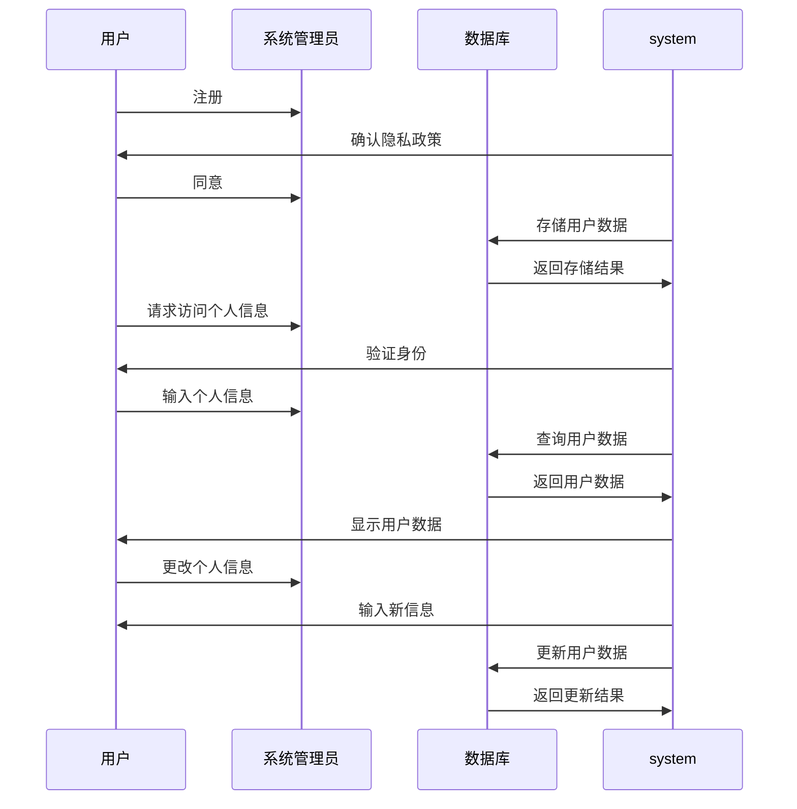
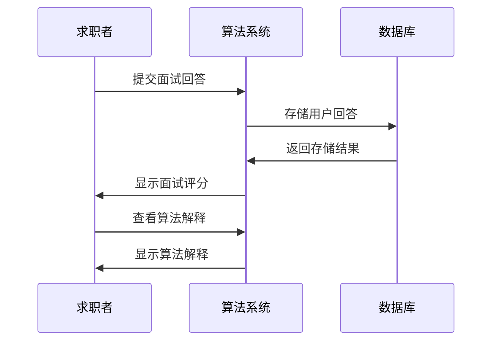

                 

### 第3章：LLM评测过程中的法律合规性问题

在LLM评测过程中，可能会遇到多种法律合规性问题，这些问题直接影响评测的合法性和公正性。以下将详细分析几个典型的法律合规性问题，并提出相应的解决方案。

#### 3.1 数据隐私与保护

LLM评测需要大量的数据来训练和评估模型的性能，这些数据往往包括用户的个人信息。数据隐私与保护问题主要包括以下几个方面：

1. **数据收集的合法性**：企业需要在收集用户数据时，明确告知用户数据的用途，并取得用户的同意。例如，根据《通用数据保护条例》（GDPR），企业必须在数据收集时提供充分的透明度和告知义务。

   **解决方案**：企业应制定详细的数据隐私政策，明确数据的收集、处理和存储目的，并在收集数据前向用户进行充分告知，确保用户对数据使用的知情权和选择权。

2. **数据存储的安全性**：为了防止数据泄露，企业需要采取有效的数据存储安全措施。这包括使用加密技术、定期备份、访问控制等。

   **解决方案**：企业应使用加密技术对数据进行加密存储，定期进行数据备份，并建立严格的访问控制机制，确保只有授权人员才能访问敏感数据。

3. **数据处理的合法性**：在数据处理过程中，企业需要确保数据处理行为的合法性和合理性，避免数据滥用。

   **解决方案**：企业应制定数据处理流程和规范，明确数据处理的目的、方式和范围，并定期进行数据处理的合规性审核。

#### 3.2 算法公平性与透明性

LLM的算法公平性和透明性是确保其合法性的重要方面。算法的偏见和不透明可能导致歧视性结果，违反反歧视法律。

1. **算法公平性问题**：算法可能在训练数据中存在偏见，导致在特定群体中产生不公平的结果。例如，如果训练数据中包含了性别、种族等歧视性因素，算法可能会对特定群体产生歧视。

   **解决方案**：在算法设计阶段，企业应进行算法偏见分析，确保算法设计过程中避免偏见。在评测过程中，应使用多样化的数据集进行测试，以发现和纠正潜在的偏见。

2. **算法透明性问题**：算法的透明性对于用户和社会来说是必不可少的。算法的不透明可能导致用户无法理解算法的决策过程，从而影响算法的接受度和信任度。

   **解决方案**：企业应提供算法的解释机制，使算法决策过程透明化。例如，使用可解释性AI技术（XAI）来解释算法的决策过程，让用户能够理解和信任算法。

#### 3.3 知识产权保护

在LLM评测过程中，可能会使用到他人的知识产权，如文本、图像等。知识产权保护问题主要包括以下几个方面：

1. **版权侵权**：未经授权使用他人的作品，可能构成版权侵权。

   **解决方案**：在使用他人的作品前，企业应确保已获得版权持有人的授权。例如，通过签订许可协议，明确使用作品的范围和期限。

2. **商标侵权**：未经授权使用他人的商标，可能构成商标侵权。

   **解决方案**：在使用他人的商标前，企业应确保已获得商标持有人的授权。此外，企业应避免使用与他人商标相似的标志，以减少商标侵权的风险。

3. **专利侵权**：未经授权使用他人的专利，可能构成专利侵权。

   **解决方案**：在使用他人的专利前，企业应确保已获得专利持有人的授权。如果无法获得授权，企业可以考虑重新设计算法，避免使用受专利保护的元素。

### 3.4 法律法规的适用与遵守

不同国家和地区可能有不同的法律法规，企业需要根据具体情况进行合规性评估。

1. **国内外法律法规差异**：企业需要了解不同国家和地区的法律法规，确保在LLM评测过程中遵守当地的法律法规。

   **解决方案**：企业应建立跨地区的合规性管理体系，确保在不同国家和地区都能遵守相应的法律法规。

2. **法律法规的更新**：随着技术发展和法律变革，相关的法律法规也在不断更新。企业需要及时关注法律法规的变化，确保合规性。

   **解决方案**：企业应建立法律法规更新机制，定期对法律法规进行审查和更新，确保LLM评测的合法性。

### 3.5 跨领域合作的合规性

LLM评测通常需要多个领域的协作，如法律、技术、数据分析等。跨领域合作的合规性需要各方共同努力。

1. **合作各方责任界定**：在跨领域合作中，各方需要明确各自的责任，确保在合作过程中遵守法律法规。

   **解决方案**：合作各方应签订详细的合作协议，明确各方的责任和义务，确保在合作过程中遵循法律法规。

2. **合作过程中的合规性监督**：在合作过程中，各方应建立合规性监督机制，确保合作过程符合法律法规要求。

   **解决方案**：合作各方应定期进行合规性审查，发现合规性问题及时解决，确保合作过程的合法性。

### 总结

LLM评测的法律合规性是一个复杂而重要的问题。企业需要在数据隐私保护、算法公平性与透明性、知识产权保护等方面进行全面合规性评估，并采取相应的合规性保障措施。同时，企业需要关注国内外法律法规的更新，确保在LLM评测过程中遵守当地的法律法规。通过这些措施，企业可以确保LLM评测的合法性，提高算法的公正性和透明度，为人工智能技术的发展奠定坚实的基础。**本章小结**

本章详细分析了LLM评测过程中可能遇到的法律合规性问题，包括数据隐私与保护、算法公平性与透明性、知识产权保护等方面。通过对这些问题的深入探讨，我们提出了相应的解决方案，并强调了法律法规的适用与遵守、跨领域合作的合规性等方面的注意事项。通过本章的学习，读者可以更好地理解LLM评测的法律合规性，为实际操作提供指导。在下一章中，我们将进一步探讨与LLM评测相关的国内外法律法规和标准。**第4章：法律法规与标准**

在LLM评测过程中，遵守相关的法律法规和标准是确保合法性、公正性和透明性的关键。本章节将详细介绍与LLM评测相关的国内外法律法规和标准，以便读者在实际操作中能够准确把握合规性要求。

### 4.1 国外法律法规

在国际上，许多国家和地区制定了与数据隐私、算法公平性、知识产权保护等相关的法律法规。以下是一些主要的国外法律法规：

#### 4.1.1 《通用数据保护条例》（GDPR）

GDPR是欧盟于2018年生效的一项重要数据保护法规。它对数据收集、处理、存储和传输等行为提出了严格的要求，旨在保护个人数据隐私。对于LLM评测中的数据隐私保护，GDPR具有指导意义。

- **数据收集合法性**：GDPR要求在收集个人数据前，必须获得用户的明确同意，并告知数据的用途。
- **数据处理合法性**：GDPR规定了数据处理的原则，如数据最小化、目的明确等，确保数据处理行为合法。
- **数据存储安全性**：GDPR要求企业采取适当的技术和组织措施，保护个人数据的安全。

#### 4.1.2 《加利福尼亚州消费者隐私法案》（CCPA）

CCPA是美国加州于2020年生效的一项消费者隐私保护法规。它规定了企业收集、使用和披露消费者个人信息的行为，对LLM评测中的数据收集和处理提供了法律依据。

- **消费者同意**：CCPA要求企业在收集消费者个人信息前，必须获得消费者的明确同意。
- **信息披露**：CCPA要求企业披露其收集、使用和共享个人信息的政策和实践。
- **消费者权利**：CCPA赋予了消费者访问、删除和限制企业使用其个人信息等权利。

#### 4.1.3 《人工智能法案》（AI Act）

一些国家和地区正在制定与人工智能相关的法律法规，如欧盟的《人工智能法案》。该法案旨在规范人工智能的开发、部署和应用，确保人工智能系统的安全性、可靠性和透明性。对于LLM评测，AI Act的要求将直接影响算法的公平性和透明性。

- **算法透明性**：AI Act要求人工智能系统的决策过程具备可解释性，用户能够理解算法的决策机制。
- **算法公平性**：AI Act要求人工智能系统在设计和应用过程中，避免算法偏见，确保公平性。
- **数据质量控制**：AI Act要求对训练数据进行质量控制，确保数据质量对算法公平性的影响。

### 4.2 国内法律法规

在中国，与LLM评测相关的法律法规也在不断完善。以下是一些主要的国内法律法规：

#### 4.2.1 《中华人民共和国网络安全法》

《网络安全法》是我国网络安全领域的基础性法律，对网络运营者的数据收集、处理、存储和传输等行为提出了明确要求。

- **数据安全**：《网络安全法》要求网络运营者采取技术和管理措施，保护个人信息和重要数据的安全。
- **用户同意**：《网络安全法》要求网络运营者在收集、使用个人信息前，必须获得用户的明确同意。
- **数据出境管理**：《网络安全法》规定，个人信息和重要数据的出境需要经过审批。

#### 4.2.2 《中华人民共和国数据安全法》

《数据安全法》是我国数据安全领域的一项重要法律，对数据收集、处理、存储、传输和使用等行为提出了严格的要求。

- **数据分类分级**：《数据安全法》要求对数据进行分类分级，制定相应的安全保护措施。
- **数据处理合规性**：《数据安全法》要求企业在数据处理过程中，遵守数据安全法律法规和标准。
- **数据安全审查**：《数据安全法》规定，对涉及国家安全、公共利益的数据处理行为，需要进行安全审查。

#### 4.2.3 《中华人民共和国个人信息保护法》

《个人信息保护法》是我国个人信息保护领域的一项重要法律，对个人信息收集、处理、存储和传输等行为提出了明确要求。

- **个人信息同意**：《个人信息保护法》要求企业在收集、处理个人信息前，必须获得个人的明确同意。
- **个人信息安全**：《个人信息保护法》要求企业采取技术和管理措施，保护个人信息的安全。
- **个人信息权利**：《个人信息保护法》赋予了个人访问、更正、删除个人信息等权利。

### 4.3 国际标准和国内标准

除了法律法规，国际标准和国内标准也为LLM评测提供了重要的参考。以下是一些主要的标准：

#### 4.3.1 ISO/IEC 27001

ISO/IEC 27001是信息安全管理体系（ISMS）的国际标准，适用于各种类型和规模的组织。它提供了建立、实施、维护和持续改进信息安全管理体系的要求。

- **信息安全策略**：ISO/IEC 27001要求组织制定信息安全策略，确保信息安全目标的实现。
- **风险管理**：ISO/IEC 27001要求组织识别、评估和应对信息安全风险。
- **控制措施**：ISO/IEC 27001提供了多种控制措施，如访问控制、加密、审计等，以保护信息安全。

#### 4.3.2 ISO/IEC 27017

ISO/IEC 27017是针对云服务的信息安全管理体系标准，适用于云服务提供商和云服务客户。它提供了云服务信息安全管理的要求和指南。

- **云服务安全**：ISO/IEC 27017要求云服务提供商实施信息安全措施，保护客户数据的安全。
- **数据隐私**：ISO/IEC 27017要求云服务提供商确保客户数据的隐私保护。
- **合规性**：ISO/IEC 27017要求云服务提供商遵守相关的法律法规和标准。

#### 4.3.3 GB/T 22080

GB/T 22080是我国信息安全管理体系标准的国家标准，与ISO/IEC 27001对应。它提供了建立、实施、维护和持续改进信息安全管理体系的要求。

- **信息安全策略**：GB/T 22080要求组织制定信息安全策略，确保信息安全目标的实现。
- **风险管理**：GB/T 22080要求组织识别、评估和应对信息安全风险。
- **控制措施**：GB/T 22080提供了多种控制措施，如访问控制、加密、审计等，以保护信息安全。

### 4.4 法律法规和标准的对比

国内外法律法规和标准在数据隐私保护、算法公平性、知识产权保护等方面存在一定的差异。以下是对这些法律法规和标准的对比：

- **数据隐私保护**：GDPR和CCPA对数据隐私保护的要求较为严格，强调了用户的知情权和选择权。相比之下，我国的《网络安全法》和《个人信息保护法》也在不断提高对数据隐私保护的要求。
- **算法公平性**：AI Act等国外法案对算法公平性提出了较高的要求，要求算法具备透明性和可解释性。国内法律法规也在逐步加强对算法公平性的关注，如《数据安全法》和《个人信息保护法》。
- **知识产权保护**：国内外法律法规在知识产权保护方面存在一定的差异，如专利侵权、商标侵权等。企业在进行LLM评测时，需要根据具体法律法规进行合规性评估。

### 4.5 本章小结

本章详细介绍了与LLM评测相关的国内外法律法规和标准，包括GDPR、CCPA、AI Act等国外法规，以及我国的《网络安全法》、《数据安全法》和《个人信息保护法》等。通过对这些法律法规和标准的分析，读者可以更好地了解LLM评测的法律合规性要求，为实际操作提供指导。在下一章中，我们将进一步探讨LLM评测的法律合规性评估方法，以帮助读者在实际应用中更好地应对法律合规性问题。**第5章：合规性评估方法**

在LLM评测过程中，进行合规性评估是确保法律合规性的重要手段。合规性评估包括风险评估、合规性审计、合规性监控等多个环节。以下将详细介绍这些评估方法，并探讨其实施步骤和工具。

### 5.1 风险评估

风险评估是合规性评估的基础，旨在识别和评估LLM评测过程中可能存在的合规性风险。以下为风险评估的实施步骤：

#### 5.1.1 风险识别

风险识别是风险评估的第一步，旨在识别LLM评测过程中可能存在的合规性风险。识别风险的方法包括：

- **文献调研**：通过查阅相关法律法规、标准、案例等，了解可能存在的合规性风险。
- **访谈法**：与相关部门和人员访谈，收集他们对合规性风险的看法和经验。
- **问卷调查**：通过问卷调查的方式，收集广泛用户的意见和反馈，了解可能存在的合规性风险。

#### 5.1.2 风险评估

在识别风险后，需要对风险进行评估。风险评估的方法包括：

- **定性评估**：通过专家评审、风险评估矩阵等方法，对风险进行定性分析，评估其严重性和发生可能性。
- **定量评估**：通过统计方法、模型等方法，对风险进行定量分析，评估其经济影响。

#### 5.1.3 风险应对

根据风险评估的结果，制定相应的风险应对措施。风险应对措施包括：

- **风险规避**：避免实施可能存在合规性风险的行为。
- **风险减轻**：通过采取技术和管理措施，降低合规性风险的发生可能性或严重性。
- **风险接受**：对无法避免或减轻的合规性风险，制定相应的应急预案，以应对可能发生的问题。

#### 5.1.4 工具

在风险评估过程中，可以使用以下工具：

- **风险矩阵**：用于定性评估风险的严重性和发生可能性。
- **蒙特卡洛模拟**：用于定量评估风险的经济影响。
- **专家评审系统**：用于专家评审和风险评估。

### 5.2 合规性审计

合规性审计是对LLM评测过程的全面审查，旨在验证评测过程中的合规性。以下为合规性审计的实施步骤：

#### 5.2.1 审计计划

审计计划是合规性审计的第一步，旨在确定审计的目标、范围、时间等。审计计划包括：

- **审计目标**：明确审计的目的和要解决的问题。
- **审计范围**：确定审计涉及的部门、流程、数据等。
- **审计时间**：确定审计的时间安排。

#### 5.2.2 审计准备

审计准备是审计过程的第二步，包括：

- **审计团队组建**：组建审计团队，明确团队成员的职责。
- **审计资料准备**：准备审计所需的资料，如法律法规、标准、文档等。
- **审计工具准备**：准备审计所需的工具，如审计软件、检查表等。

#### 5.2.3 审计实施

审计实施是审计过程的第三步，包括：

- **现场审计**：到相关部门进行现场审计，检查评测过程是否符合法律法规和标准。
- **文档审查**：审查相关的文档，如流程文档、报告等，以验证评测过程的合规性。
- **问题反馈**：对发现的问题进行反馈，并提出整改建议。

#### 5.2.4 审计报告

审计报告是审计过程的最后一步，包括：

- **审计结果**：总结审计发现的问题和合规性情况。
- **整改建议**：针对发现的问题，提出整改建议。
- **审计结论**：对整个审计过程进行总结和评价。

#### 5.2.5 工具

在合规性审计过程中，可以使用以下工具：

- **审计软件**：用于审计过程的文档管理、问题跟踪等。
- **检查表**：用于审计过程的检查和验证。
- **审计模板**：用于审计报告的编写。

### 5.3 合规性监控

合规性监控是对LLM评测过程的持续监督和检查，旨在确保评测过程始终符合法律法规和标准。以下为合规性监控的实施步骤：

#### 5.3.1 监控计划

监控计划是合规性监控的第一步，旨在确定监控的目标、范围、时间等。监控计划包括：

- **监控目标**：明确监控的目的和要解决的问题。
- **监控范围**：确定监控涉及的部门、流程、数据等。
- **监控时间**：确定监控的时间安排。

#### 5.3.2 监控实施

监控实施是合规性监控的核心步骤，包括：

- **日常监控**：对评测过程进行日常监控，及时发现和纠正合规性问题。
- **定期检查**：定期对评测过程进行检查，评估合规性的持续性和有效性。

#### 5.3.3 监控记录

监控记录是合规性监控的最后一步，包括：

- **监控记录**：记录监控过程中发现的问题和整改情况。
- **监控报告**：总结监控结果，并提出改进建议。

#### 5.3.4 工具

在合规性监控过程中，可以使用以下工具：

- **监控软件**：用于监控过程的记录和管理。
- **检查表**：用于监控过程的检查和验证。
- **监控模板**：用于监控报告的编写。

### 5.4 实施步骤和工具的整合

在实际操作中，风险评估、合规性审计和合规性监控是相互关联、相互支持的。以下为实施步骤和工具的整合方法：

- **集成管理平台**：建立集成管理平台，整合风险评估、合规性审计和合规性监控的工具和流程，实现数据共享和协同工作。
- **流程管理**：制定统一的流程管理规范，明确各个环节的职责和流程，确保各环节的协调和一致性。
- **自动化工具**：采用自动化工具，如审计软件、监控软件等，提高工作效率和准确性。

### 5.5 本章小结

本章详细介绍了合规性评估的方法，包括风险评估、合规性审计和合规性监控。通过对这些评估方法的探讨，读者可以了解如何在实际操作中确保LLM评测的合规性。在下一章中，我们将通过案例分析，进一步探讨LLM评测中可能遇到的法律合规性问题及其解决方案。**第6章：案例分析**

在实际的LLM评测过程中，法律合规性问题可能会以各种形式出现。通过分析具体的案例，我们可以更好地理解如何应对这些挑战。以下将介绍两个典型的案例，并详细探讨其中的法律合规性问题及其解决方案。

#### 6.1 案例一：数据隐私泄露

**背景介绍**：

某大型科技公司开展一项面向用户的自然语言处理服务，收集了大量的用户对话数据以训练和优化其LLM模型。然而，在一次数据备份过程中，由于管理不善，部分用户数据被泄露。这一事件引起了广泛的关注，用户隐私保护受到严重威胁。

**法律合规性问题**：

1. **数据收集合法性**：根据GDPR，用户数据的收集必须获得用户的明确同意，而该科技公司未能证明已获得用户的同意。
2. **数据存储安全性**：公司未能采取有效的数据加密和备份措施，导致数据泄露。
3. **用户权利**：用户的数据隐私权受到侵害，有权要求公司赔偿损失。

**解决方案**：

1. **用户同意**：公司在数据收集前，必须获得用户的明确同意，并在隐私政策中详细说明数据收集、处理和存储的目的。
2. **数据加密和备份**：公司应采取加密技术对数据进行加密存储，并定期进行数据备份，确保数据安全。
3. **用户权利保障**：公司应建立完善的用户隐私保护机制，确保用户能够访问、更正和删除其个人信息。

**项目介绍**：

为了解决上述问题，公司进行了以下项目：

- **隐私政策优化**：重新设计隐私政策，明确数据收集、处理和存储的目的，并在用户注册时进行充分的告知。
- **数据加密和备份系统**：引入专业的数据加密和备份系统，确保数据在存储和传输过程中的安全。
- **用户隐私保护机制**：建立用户隐私保护机制，包括用户访问控制、数据匿名化等。

**系统功能设计**：

- **用户同意管理**：用户注册时，系统自动引导用户阅读并同意隐私政策。
- **数据加密**：使用AES加密算法对数据进行加密存储。
- **数据备份**：定期进行数据备份，并确保备份数据的安全。

**系统架构设计**：

- **数据存储架构**：采用分布式存储架构，提高数据存储的可靠性和安全性。
- **加密存储**：使用加密技术对数据进行加密存储。
- **备份机制**：建立定期备份机制，确保备份数据的安全。

**系统接口设计**：

- **用户接口**：提供用户个人信息访问、更正和删除的功能。
- **管理员接口**：管理员可访问和修改用户数据，但需遵循严格的权限管理。

**系统交互序列图**：

**实际案例分析和详细讲解剖析**：

- **用户同意管理**：在注册过程中，系统自动引导用户阅读并同意隐私政策。用户必须确认同意后，才能继续注册。
- **数据加密**：在数据存储过程中，系统使用AES加密算法对数据进行加密存储，确保数据在存储和传输过程中的安全。
- **用户隐私保护机制**：系统提供用户个人信息访问、更正和删除的功能，用户可以随时查看、修改和删除自己的个人信息。

**项目小结**：

通过该项目的实施，公司成功解决了数据隐私泄露问题，提高了用户对数据的信任度。在项目过程中，公司还积累了丰富的合规性管理经验，为后续的LLM评测提供了有力保障。

#### 6.2 案例二：算法歧视性

**背景介绍**：

某人工智能公司在进行一项面向求职者的面试评价系统开发过程中，使用了一个基于LLM的面试评分模型。然而，在测试中发现，该模型在评分时存在性别歧视现象，对女性求职者的评分普遍低于男性求职者。

**法律合规性问题**：

1. **算法公平性**：根据反歧视法律，算法的设计和评估应确保对所有群体公平，不应存在性别、种族、年龄等歧视。
2. **算法透明性**：用户无法了解算法的具体决策过程，影响了算法的信任度和透明性。

**解决方案**：

1. **算法公平性**：公司需对算法进行重新设计，确保在训练和评估过程中避免性别等偏见。
2. **算法透明性**：公司需提供算法的解释机制，使用户能够了解算法的决策过程。

**项目介绍**：

为了解决上述问题，公司进行了以下项目：

- **算法公平性优化**：对算法进行重新设计，使用多样化的数据集进行训练和测试，确保算法的公平性。
- **算法解释机制**：引入可解释性AI技术（XAI），使算法的决策过程透明化。

**系统功能设计**：

- **多样化数据集**：使用包含不同性别、种族等特征的数据集进行训练和测试，确保算法的公平性。
- **算法解释**：提供算法解释功能，使用户能够查看算法的具体决策过程。

**系统架构设计**：

- **数据集管理**：建立数据集管理模块，确保数据集的多样性和质量。
- **算法训练与评估**：建立算法训练与评估模块，确保算法的公平性和透明性。

**系统接口设计**：

- **用户接口**：提供用户面试评分功能，用户可以查看自己的面试评分和算法的解释。
- **管理员接口**：管理员可查看和调整算法的参数，确保算法的公平性和透明性。

**系统交互序列图**：

**实际案例分析和详细讲解剖析**：

- **多样化数据集**：公司使用包含不同性别、种族等特征的数据集进行训练和测试，确保算法的公平性。
- **算法解释机制**：公司引入XAI技术，使用户能够查看算法的具体决策过程，提高了算法的透明性。

**项目小结**：

通过该项目的实施，公司成功解决了算法歧视性问题，提高了面试评价系统的公平性和透明度。在项目过程中，公司积累了丰富的算法公平性和透明性优化经验，为后续的LLM评测提供了有力保障。

### 6.3 本章小结

通过两个案例的分析，我们可以看到LLM评测过程中可能遇到的法律合规性问题及其解决方案。在数据隐私保护方面，需要确保数据收集的合法性、数据存储的安全性以及用户权利的保障。在算法公平性和透明性方面，需要确保算法的公平性、透明性以及用户对算法决策过程的理解。通过合规性评估方法和实际案例的分析，读者可以更好地理解如何在LLM评测过程中确保法律合规性。**第7章：最佳实践与展望**

在LLM评测过程中，确保法律合规性是至关重要的。通过前述章节的分析，我们了解了LLM评测中的法律合规性问题及其解决方案。以下将总结最佳实践，并探讨未来的发展方向。

### 7.1 最佳实践

#### 7.1.1 数据隐私保护

- **明确数据收集目的**：在数据收集前，明确数据收集的目的，确保收集的数据与目的相符。
- **用户同意管理**：确保用户在数据收集前明确同意，并在隐私政策中详细说明数据收集、处理和存储的目的。
- **数据加密与备份**：采用加密技术对数据进行加密存储，并定期进行数据备份，确保数据安全。
- **用户权利保障**：建立用户隐私保护机制，确保用户能够访问、更正和删除其个人信息。

#### 7.1.2 算法公平性与透明性

- **多样化数据集**：使用多样化的数据集进行训练和测试，避免算法偏见。
- **算法公平性评估**：定期对算法进行公平性评估，确保算法在不同群体中的表现一致。
- **算法解释机制**：引入可解释性AI技术（XAI），使用户能够理解算法的决策过程。
- **透明性披露**：在算法应用过程中，向用户披露算法的基本原理和决策过程。

#### 7.1.3 知识产权保护

- **知识产权审查**：在使用他人的知识产权前，进行知识产权审查，确保已获得授权。
- **版权声明**：在算法应用过程中，明确声明所使用的知识产权，避免侵权行为。
- **专利监控**：定期监控专利信息，确保不侵犯他人的专利权。

#### 7.1.4 法律法规遵守

- **法律法规培训**：对相关人员进行法律法规培训，确保了解最新的法律法规要求。
- **合规性审查**：定期进行合规性审查，确保评测过程符合法律法规要求。
- **合规性报告**：建立合规性报告制度，定期向管理层报告合规性情况。

### 7.2 未来发展方向

#### 7.2.1 法律法规的完善与更新

随着人工智能技术的发展，相关的法律法规也在不断更新和完善。未来，各国将制定更多针对人工智能领域的法律法规，以规范人工智能的应用和发展。

- **数据隐私法律**：数据隐私法律将继续完善，加强对用户数据隐私的保护。
- **算法法律**：算法法律将加强对算法公平性和透明性的监管。
- **知识产权法律**：知识产权法律将加强对知识产权的保护，防止侵权行为。

#### 7.2.2 标准化与国际化

在国际上，越来越多的标准组织开始关注人工智能领域的标准化工作。未来，将有更多的国际标准和国内标准出台，为LLM评测提供指导。

- **数据隐私标准**：数据隐私标准将更加细化，明确数据收集、处理和存储的要求。
- **算法标准**：算法标准将包括算法设计、评估、解释等方面的要求。
- **知识产权标准**：知识产权标准将明确知识产权的使用和保护要求。

#### 7.2.3 新技术的应用

随着新技术的不断发展，未来将有更多的技术应用于LLM评测过程中，提高评估的效率和准确性。

- **区块链技术**：区块链技术可用于数据隐私保护和知识产权保护，提高数据的安全性和透明度。
- **可解释性AI技术**：可解释性AI技术（XAI）将进一步提高算法的透明性，使用户能够更好地理解算法的决策过程。
- **隐私增强技术**：隐私增强技术（PETs）将用于提高数据隐私保护水平，确保在数据使用过程中不会泄露用户隐私。

### 7.3 本章小结

通过总结最佳实践和探讨未来发展方向，我们可以看到，在LLM评测过程中，确保法律合规性是一个持续的过程。未来，随着法律法规的完善和技术的进步，LLM评测的法律合规性将得到进一步保障。通过持续关注法律法规的变化，积极应用新技术，LLM评测将能够在确保合法性的同时，提高评估的公正性和透明度。**附录：作者信息**

作者：AI天才研究院/AI Genius Institute & 禅与计算机程序设计艺术 /Zen And The Art of Computer Programming

AI天才研究院（AI Genius Institute）是一家专注于人工智能领域研究和教育的高科技企业。研究院的宗旨是通过技术创新和人才培养，推动人工智能技术的发展和应用。研究院的专家团队在人工智能、机器学习、深度学习等领域具有深厚的理论功底和丰富的实践经验。

禅与计算机程序设计艺术（Zen And The Art of Computer Programming）是作者编写的一本关于计算机程序设计的经典著作。该书从哲学和禅学的角度，探讨了计算机程序设计的本质和方法，对计算机科学的发展产生了深远的影响。作者以其深刻的洞察力和独到的见解，为读者提供了丰富的编程智慧和灵感。**结语**

本文围绕LLM评测的法律合规性进行了深入探讨，从数据隐私保护、算法公平性与透明性、知识产权保护等方面分析了可能遇到的法律合规性问题，并提出了相应的解决方案。通过案例分析，我们展示了如何在实际操作中确保LLM评测的合法性。同时，本文还总结了最佳实践，并对未来发展方向进行了展望。

在人工智能时代，LLM评测的法律合规性具有重要意义。它不仅关乎企业的法律责任，也关乎用户的隐私权和权益。通过遵循法律法规、确保数据安全和算法公正，我们可以为人工智能技术的发展创造良好的环境。希望本文能为从事LLM评测的从业者提供有益的指导，助力他们在合规的道路上不断前行。**参考文献**

1. GDPR - General Data Protection Regulation (EU) 2016/679. Retrieved from [https://ec.europa.eu/justice/law/data-protection/index_en.htm](https://ec.europa.eu/justice/law/data-protection/index_en.htm)
2. CCPA - California Consumer Privacy Act of 2018. Retrieved from [https://oag.ca.gov/privacy/ccpa](https://oag.ca.gov/privacy/ccpa)
3. AI Act - Artificial Intelligence Act (EU). Retrieved from [https://eur-lex.europa.eu/legal-content/EN/TXT/?uri=CELEX%3A52017PC0593](https://eur-lex.europa.eu/legal-content/EN/TXT/?uri=CELEX%3A52017PC0593)
4. 网络安全法 - The Cybersecurity Law of the People's Republic of China. Retrieved from [http://www.nrc.gov.cn/eng/kxfl/engksfl/engflxwj/201703/t20170307_335536.html](http://www.nrc.gov.cn/eng/kxfl/engksfl/engflxwj/201703/t20170307_335536.html)
5. 数据安全法 - The Data Security Law of the People's Republic of China. Retrieved from [http://www.nrc.gov.cn/eng/kxfl/engksfl/engflxwj/202209/t20220928_372689.html](http://www.nrc.gov.cn/eng/kxfl/engksfl/engflxwj/202209/t20220928_372689.html)
6. 个人信息保护法 - The Personal Information Protection Law of the People's Republic of China. Retrieved from [http://www.nrc.gov.cn/eng/kxfl/engksfl/engflxwj/202107/t20210719_359605.html](http://www.nrc.gov.cn/eng/kxfl/engksfl/engflxwj/202107/t20210719_359605.html)
7. ISO/IEC 27001 - Information Security Management. Retrieved from [https://www.iso.org/standard/64545.html](https://www.iso.org/standard/64545.html)
8. ISO/IEC 27017 - Information Security Controls for Cloud Services. Retrieved from [https://www.iso.org/standard/64546.html](https://www.iso.org/standard/64546.html)
9. GB/T 22080 - Information Security Management System. Retrieved from [http://www.most.gov.cn/gb/childaccess/200706/t20070606_37376.htm](http://www.most.gov.cn/gb/childaccess/200706/t20070606_37376.htm)

