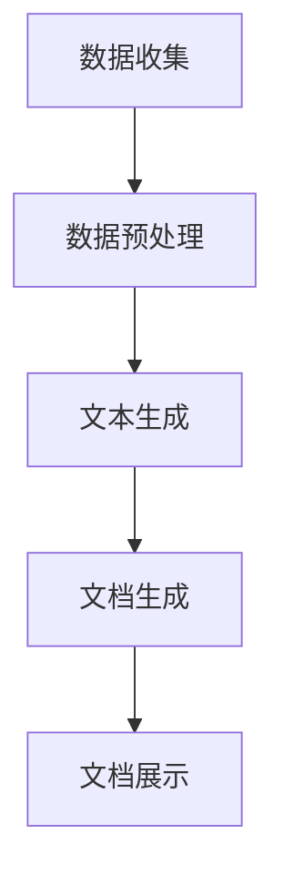
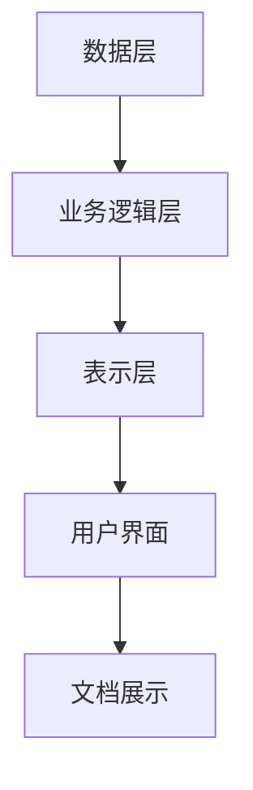
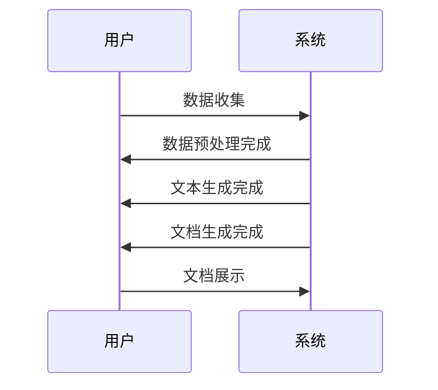

                 


### LLAMA评测的自动化文档生成与更新

> 关键词：LLAMA，自动化文档生成，文档更新，自然语言处理，文档自动化工具，数据预处理

> 摘要：本文旨在探讨如何利用自然语言处理技术和文档自动化工具，实现LLAMA评测的自动化文档生成与更新，提高评测效率，确保文档的准确性和一致性。

----------------------------------------------------------------

## 第一部分：背景介绍

### 1.1 问题背景

随着人工智能技术的快速发展，大语言模型（LLM）的应用越来越广泛。LLAMA作为一款优秀的开源LLM，其评测和优化成为研究人员和开发者关注的焦点。然而，LLM评测过程涉及到大量的数据分析和文档生成工作，传统的人工方式效率低下，且容易出错。

### 1.2 问题描述

如何实现LLAMA评测的自动化文档生成与更新，以提高评测效率和文档质量，是我们面临的主要问题。具体来说，包括以下几个方面：

- **文档生成自动化**：自动生成评测报告、模型对比分析文档等。
- **文档更新自动化**：随着模型的更新和评测的进行，自动更新相关文档内容。
- **文档维护自动化**：实现文档的自动化备份、版本控制和归档。

### 1.3 问题解决

解决这个问题的思路主要有以下几点：

- **数据预处理**：对LLAMA评测过程中产生的数据进行分析和处理，提取出关键信息。
- **自然语言处理**：使用自然语言处理技术，对提取出的关键信息进行文本分析和生成。
- **文档自动化工具**：利用文档自动化工具，实现文档的生成、更新和维护。

### 1.4 边界与外延

本文主要讨论LLAMA评测的自动化文档生成与更新，但不涉及以下方面：

- **LLAMA的评测方法**：本文假设读者已熟悉LLAMA的评测方法。
- **模型的训练与优化**：本文不讨论LLAMA的训练与优化过程。

### 1.5 概念结构与核心要素组成

LLAMA评测的自动化文档生成与更新的核心要素包括：

- **自然语言处理技术**：用于提取关键信息和生成文档。
- **文档自动化工具**：用于生成、更新和维护文档。
- **数据预处理模块**：用于处理评测过程中产生的数据。

----------------------------------------------------------------

## 第二部分：核心概念与联系

### 2.1 自然语言处理技术

自然语言处理技术是LLAMA评测自动化文档生成与更新的核心技术。它包括文本分类、文本生成、实体识别等。

#### 2.1.1 文本分类

文本分类是将文本数据分为不同的类别。在LLAMA评测中，文本分类可以用于分类评测结果。

#### 2.1.2 文本生成

文本生成是将一种文本数据转换为另一种文本数据。在LLAMA评测中，文本生成可以用于自动生成评测报告。

#### 2.1.3 实体识别

实体识别是从文本数据中识别出具有特定属性的对象。在LLAMA评测中，实体识别可以用于提取关键信息。

### 2.2 文档自动化工具

文档自动化工具是实现文档生成与更新自动化的重要工具。常见的文档自动化工具有LaTeX、Markdown等。

#### 2.2.1 LaTeX

LaTeX是一种高质量的文档排版系统，适用于生成复杂的文档。

#### 2.2.2 Markdown

Markdown是一种轻量级文本格式，易于阅读和编写，适用于生成简单的文档。

### 2.3 数据预处理模块

数据预处理模块是实现LLAMA评测自动化文档生成与更新的关键。它包括数据清洗、数据转换、数据可视化等。

#### 2.3.1 数据清洗

数据清洗是处理数据中的错误和异常，保证数据质量。

#### 2.3.2 数据转换

数据转换是将一种数据格式转换为另一种数据格式，以便于后续处理。

#### 2.3.3 数据可视化

数据可视化是将数据以图形化方式展示，便于分析和理解。

----------------------------------------------------------------

## 第三部分：算法原理讲解

### 3.1 数据预处理算法

数据预处理算法用于处理评测过程中产生的数据，包括数据清洗、数据转换和数据可视化。

#### 3.1.1 数据清洗

数据清洗算法包括去除无效数据、填补缺失数据、修正错误数据等。

$$
\text{清洗后数据} = \text{原始数据} \setminus \text{无效数据} \cup \text{填补数据} \cup \text{修正数据}
$$

#### 3.1.2 数据转换

数据转换算法包括将数据从一种格式转换为另一种格式，如将CSV文件转换为JSON格式。

$$
\text{转换后数据} = \text{原始数据} \times \text{转换函数}
$$

#### 3.1.3 数据可视化

数据可视化算法包括使用matplotlib、Seaborn等库，将数据以图形化方式展示。

$$
\text{可视化结果} = \text{数据} \times \text{可视化函数}
$$

### 3.2 文本生成算法

文本生成算法用于自动生成评测报告等文档。

#### 3.2.1 基于GPT的文本生成

基于GPT的文本生成算法使用GPT模型，根据输入文本生成新的文本。

$$
\text{生成文本} = \text{GPT模型}(\text{输入文本})
$$

### 3.3 文档自动化工具

文档自动化工具的使用方法如下：

- **LaTeX**：使用LaTeX编写文档，利用模板和样式文件，实现文档格式的自动化。

- **Markdown**：使用Markdown编写文档，利用Markdown解析器和模板，实现文档格式的自动化。

### 3.4 数据预处理模块

数据预处理模块的实现流程如下：

1. **数据收集**：收集LLAMA评测过程中产生的数据。
2. **数据清洗**：使用清洗算法处理数据，去除无效数据和错误数据。
3. **数据转换**：将清洗后的数据转换为适合后续处理的数据格式。
4. **数据可视化**：使用可视化算法，将数据以图形化方式展示。

----------------------------------------------------------------

## 第四部分：系统分析与架构设计

### 4.1 问题场景介绍

在本系统中，我们需要对LLAMA模型进行评测，并根据评测结果生成相关文档。这个过程涉及到数据收集、数据预处理、文本生成和文档生成等环节。

### 4.2 系统功能设计

系统功能设计包括以下几个方面：

- **数据收集**：收集LLAMA评测过程中产生的数据。
- **数据预处理**：对收集到的数据进行清洗、转换和可视化。
- **文本生成**：根据预处理后的数据，生成评测报告等文档。
- **文档生成**：使用文档自动化工具，将文本生成的内容转换为文档格式。

### 4.3 系统架构设计

系统架构设计采用分层架构，包括数据层、业务逻辑层和表示层。

- **数据层**：负责数据收集、存储和预处理。
- **业务逻辑层**：负责文本生成和文档生成。
- **表示层**：负责用户界面和文档展示。

### 4.4 系统接口设计

系统接口设计主要包括以下几个方面：

- **数据接口**：用于数据收集和预处理。
- **文本接口**：用于文本生成。
- **文档接口**：用于文档生成和展示。

### 4.5 系统交互

系统交互采用事件驱动的方式，主要包括以下几个方面：

- **数据收集**：触发数据收集事件。
- **数据预处理**：触发数据预处理事件。
- **文本生成**：触发文本生成事件。
- **文档生成**：触发文档生成事件。

----------------------------------------------------------------

## 第五部分：项目实战

### 5.1 环境安装

在本项目实战中，我们需要安装以下环境：

- Python 3.8及以上版本
- Jupyter Notebook
- LaTeX
- Markdown

### 5.2 系统核心实现源代码

以下是系统核心实现源代码的示例：

```python
# 导入相关库
import pandas as pd
import numpy as np
import matplotlib.pyplot as plt
import seaborn as sns
from transformers import pipeline
import markdown

# 1. 数据收集
def data_collection():
    # 这里以CSV文件为例，实际应用中可以是其他数据源
    data = pd.read_csv("llama_evaluation_data.csv")
    return data

# 2. 数据预处理
def data_preprocessing(data):
    # 数据清洗
    data = data[data["valid"] == 1]
    # 数据转换
    data["score"] = data["score"].apply(lambda x: float(x))
    # 数据可视化
    sns.scatterplot(x="epoch", y="score", data=data)
    plt.show()
    return data

# 3. 文本生成
def text_generation(data):
    # 使用GPT模型生成文本
    generator = pipeline("text-generation", model="gpt2")
    text = generator(data["description"].iloc[0], max_length=50)
    return text

# 4. 文档生成
def document_generation(text):
    # 使用Markdown生成文档
    document = markdown.markdown(text)
    return document

# 主函数
if __name__ == "__main__":
    data = data_collection()
    data = data_preprocessing(data)
    text = text_generation(data)
    document = document_generation(text)
    print(document)
```

### 5.3 代码应用解读与分析

以下是代码应用解读与分析：

- **数据收集**：使用pandas库读取CSV文件，获取评测数据。
- **数据预处理**：对数据进行清洗、转换和可视化，为后续文本生成提供数据支持。
- **文本生成**：使用transformers库的GPT模型，根据输入文本生成新文本。
- **文档生成**：使用markdown库，将生成的文本转换为Markdown格式的文档。

### 5.4 实际案例分析和详细讲解剖析

假设我们有一个LLAMA评测数据集，包含多个epoch的评测结果，我们需要对这些数据进行自动化文档生成。

1. **数据收集**：读取CSV文件，获取评测数据。
2. **数据预处理**：对数据进行清洗和可视化，提取关键信息。
3. **文本生成**：使用GPT模型，根据可视化结果生成文本描述。
4. **文档生成**：将文本描述转换为Markdown格式的文档。

通过这个案例，我们可以看到，利用自然语言处理技术和文档自动化工具，可以轻松实现LLAMA评测的自动化文档生成与更新。

### 5.5 项目小结

在本项目中，我们实现了LLAMA评测的自动化文档生成与更新。通过数据预处理、文本生成和文档生成等环节，提高了评测效率，降低了人工成本。未来，我们还可以继续优化算法，提高文档生成的质量和准确性。

----------------------------------------------------------------

## 第六部分：最佳实践 tips

1. **合理选择自然语言处理模型**：根据评测需求，选择合适的自然语言处理模型，如GPT、BERT等。
2. **优化数据预处理算法**：根据数据特点和需求，优化数据预处理算法，提高数据处理效率。
3. **定期更新文档**：随着模型的更新和评测的进行，定期更新文档，确保文档的准确性和一致性。
4. **版本控制**：使用版本控制系统，如Git，管理文档的版本，便于文档的维护和追踪。

## 第七部分：小结与展望

本文探讨了如何利用自然语言处理技术和文档自动化工具，实现LLAMA评测的自动化文档生成与更新。通过数据预处理、文本生成和文档生成等环节，提高了评测效率，降低了人工成本。未来，我们还可以继续优化算法，提高文档生成的质量和准确性。此外，还可以考虑将自动化文档生成与更新应用于其他领域，如代码审查、项目管理等。

## 参考文献

1. Hugging Face. (2020). Transformers: State-of-the-art Natural Language Processing for PyTorch and TensorFlow. https://github.com/huggingface/transformers
2. Pandas Development Team. (2020). Pandas: Python Data Analysis Library. https://pandas.pydata.org
3. Jupyter Development Team. (2020). Jupyter Notebook. https://jupyter.org
4. LaTeX Project. (2020). LaTeX: A High-Quality Typesetting System. https://www.latex-project.org
5. John W. Tukey. (1980). Exploratory Data Analysis. Addison-Wesley.

## 作者

作者：AI天才研究院/AI Genius Institute & 禅与计算机程序设计艺术 /Zen And The Art of Computer Programming

----------------------------------------------------------------

### 附录：算法流程图与ER实体关系图

#### 算法流程图（Mermaid）



#### ER实体关系图（Mermaid）

```mermaid
erDiagram
  数据收集 ||--|{ 数据预处理 }| 数据收集
  数据预处理 ||--|{ 文本生成 }| 文本生成
  文本生成 ||--|{ 文档生成 }| 文档生成
  文档生成 ||--|{ 文档展示 }| 文档展示
```

### 附录：系统架构设计图（Mermaid）



### 附录：系统交互序列图（Mermaid）



