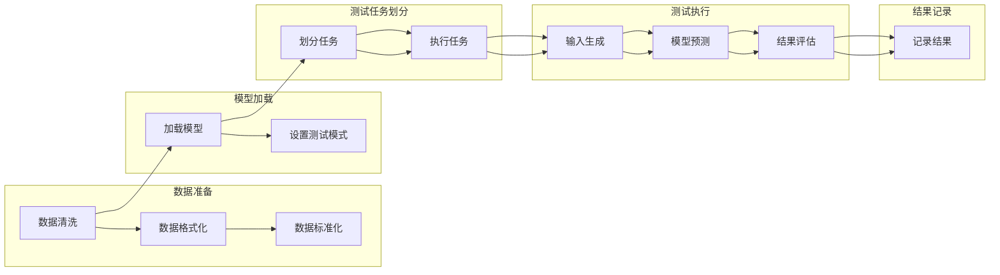
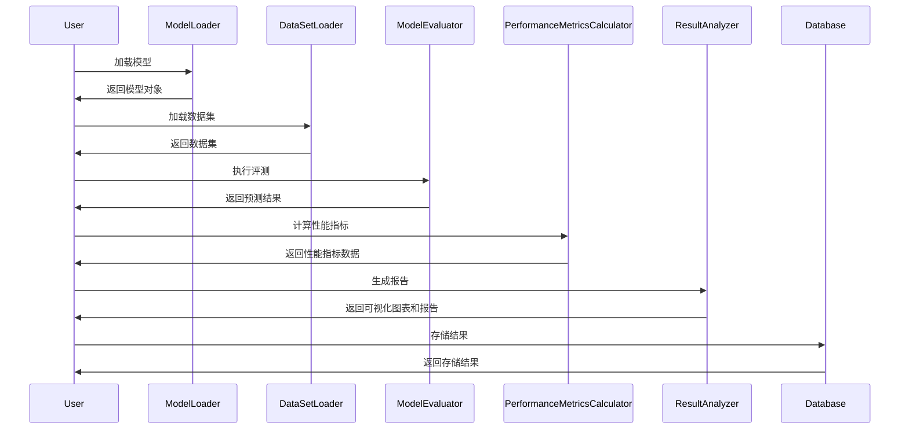

                 

### 写作前的准备与思考

在着手撰写《LLM评测的自动化测试流程编排》这篇文章之前，我们需要进行一系列的准备工作，以确保文章的内容丰富、逻辑清晰、结构紧凑。以下是具体需要考虑的几个关键步骤：

1. **明确文章的目的和受众**：
   - 我们的文章旨在为专业人士和研究人员提供详细的LLM评测自动化测试流程，帮助他们更好地理解和应用这一技术。
   - 因此，文章的语言和技术深度需要适中，既不能过于浅显，也不能过于复杂，以确保读者能够跟随并理解内容。

2. **梳理文章结构**：
   - 我们已经根据文章目录大纲设计了文章的基本框架，接下来需要进一步细化每个章节的内容，确保每个部分都有明确的主题和目标。
   - 需要确保每个章节的内容相互衔接，逻辑连贯，避免出现跳跃或重复的情况。

3. **资料收集与整理**：
   - 搜集与LLM评测相关的最新资料，包括最新的研究论文、技术博客、行业报告等，以便在文章中引用权威的数据和观点。
   - 整理这些资料，确保它们的来源可靠，内容准确，同时为每个章节的内容提供有力的支持。

4. **定义核心概念与术语**：
   - 在文章中，需要明确定义所有核心概念和术语，确保读者对文章中的专业术语有清晰的理解。
   - 可以通过举例和定义来解释这些概念，帮助读者更好地理解文章的内容。

5. **逻辑分析与推理**：
   - 在撰写每个章节时，需要使用逻辑分析和推理的方法，逐步引导读者了解LLM评测的各个方面。
   - 通过问题导向的方法，逐步揭示问题的本质，并提出解决方案。

6. **撰写初稿**：
   - 在完成以上准备工作后，我们可以开始撰写初稿。
   - 初稿应包括文章的各个章节，但不要求每个章节的内容都已经详尽，可以先初步搭建框架，然后在后续的修订过程中逐步完善。

通过上述步骤，我们可以确保文章的结构和内容都是清晰、有条理的，从而为读者提供一个有价值的学习和参考资源。

### 第1章: LLM评测的背景与基本概念

#### 1.1 LLM评测的问题背景

随着人工智能技术的迅速发展，自然语言处理（NLP）成为了一个备受关注的研究领域。尤其是近年来，大型语言模型（Large Language Models，简称LLM）如BERT、GPT-3等的出现，使得自然语言处理的能力得到了极大的提升。LLM的应用场景也越来越广泛，包括问答系统、机器翻译、文本生成等。然而，随着LLM模型变得越来越大、越来越复杂，如何对这些模型进行有效的评测成为了一个亟待解决的问题。

LLM评测的重要性体现在以下几个方面：

1. **性能评估**：通过对LLM模型进行评测，可以评估其在不同任务上的性能，从而为模型优化和改进提供依据。
2. **可靠性保证**：通过对LLM模型进行自动化测试，可以确保模型在部署后的稳定性和可靠性。
3. **可比性研究**：不同的LLM模型可能在不同的任务上具有不同的性能，通过评测可以比较不同模型之间的优劣，为研究人员提供参考。
4. **透明度和可解释性**：自动化测试流程可以提高LLM评测的透明度，使得评测过程更加公正和客观，同时有助于提高模型的可解释性。

目前，LLM评测的现状主要面临以下几个挑战：

1. **评测指标多样性**：不同的评测任务需要不同的评价指标，如何设计统一的评测指标体系是一个难题。
2. **评测成本高**：由于LLM模型的规模庞大，进行自动化测试需要大量的计算资源和时间。
3. **数据集不完善**：目前可用的LLM评测数据集有限，且数据集的质量和覆盖范围有待提高。
4. **评测流程复杂**：自动化测试流程需要涵盖模型训练、测试、评估等多个环节，流程复杂且容易出现错误。

为了解决上述问题，需要从以下几个方面进行改进：

1. **设计统一的评测指标**：研究并制定一套适用于不同任务的统一评测指标，以简化评测流程。
2. **优化评测算法**：研究高效的自动化测试算法，提高评测效率和准确性。
3. **构建高质量的数据集**：通过数据采集和清洗，构建覆盖广泛、质量高的大型LLM评测数据集。
4. **优化评测工具**：开发易于使用、功能强大的评测工具，降低评测的难度和成本。

#### 1.2 LLM评测的基本概念

##### 1.2.1 LLM的定义

LLM（Large Language Model）是一种基于深度学习技术的自然语言处理模型，它通过学习大量的文本数据，能够理解和生成自然语言。LLM通常由多个层次（或称为“层”）的神经网络组成，每个层次都能够捕捉到文本的不同层次特征。随着层数的增加，模型的复杂度和能力也随之提升。

常见的LLM包括：

- **BERT**（Bidirectional Encoder Representations from Transformers）：一种双向Transformer模型，能够在文本的上下文中理解每个词汇的含义。
- **GPT-3**（Generative Pre-trained Transformer 3）：一种自回归Transformer模型，具有极高的文本生成能力。
- **RoBERTa**（A Robustly Optimized BERT Pretraining Approach）：一种对BERT进行改进的模型，通过优化预训练过程，提高了模型的性能。

##### 1.2.2 评测标准与指标

LLM评测通常涉及多个方面的指标，这些指标反映了模型在自然语言处理任务上的表现。常见的评测指标包括：

- **准确率（Accuracy）**：模型在预测任务上的正确率，通常用于分类任务。
- **召回率（Recall）**：模型在预测为正例的样本中，实际为正例的比例，用于衡量模型对正例的识别能力。
- **精确率（Precision）**：模型在预测为正例的样本中，实际为正例的比例，用于衡量模型对正例的判断准确性。
- **F1分数（F1 Score）**：精确率和召回率的调和平均值，用于综合评估模型的性能。
- **BLEU分数（BLEU Score）**：用于评估机器翻译模型质量的指标，通过比较机器翻译结果和人工翻译结果之间的相似度来评分。

##### 1.2.3 LLM评测的目标

LLM评测的主要目标是：

1. **评估模型性能**：通过对不同模型的评测，了解它们在不同任务上的性能，为模型选择和优化提供依据。
2. **提高模型质量**：通过评测，可以发现模型的不足之处，从而进行改进，提高模型的整体质量。
3. **推动技术发展**：通过评测，可以识别出当前技术的瓶颈和改进方向，推动自然语言处理技术的发展。

#### 1.3 LLM评测的核心概念联系

为了更好地理解LLM评测的核心概念，我们通过以下方式对其进行详细解释：

##### 1.3.1 概念属性特征对比表格

| 概念        | 属性特征                     | 说明                                                         |
| ----------- | ---------------------------- | ------------------------------------------------------------ |
| LLM         | 双向/自回归、多层神经网络   | 能够学习并生成自然语言                                     |
| 评测标准    | 准确率、召回率、精确率、F1分数、BLEU分数 | 反映模型在任务上的性能                                   |
| 评测目标    | 评估模型性能、提高模型质量、推动技术发展 | 提升LLM模型的有效应用                                     |
| 评测指标    | 数据集质量、计算资源、评测成本 | 评测过程中需要考虑的重要因素                               |

##### 1.3.2 LLM评测的ER实体关系图

为了更直观地展示LLM评测中的核心实体及其关系，我们使用Mermaid绘制ER实体关系图，如下所示：

```mermaid
erDiagram
  Model ||--|{ Tester } : 进行评测
  DataSet ||--|{ Tester } : 使用数据集
  PerformanceMetric ||--|{ Tester } : 计算指标
  Tester ||--|{ Model } : 测试模型
  Tester ||--|{ DataSet } : 测试数据集
  Tester ||--|{ PerformanceMetric } : 计算性能指标
```

在这个ER实体关系图中，我们定义了四个核心实体：`Model`（模型）、`Tester`（评测者）、`DataSet`（数据集）和`PerformanceMetric`（性能指标）。这些实体之间存在明确的依赖关系，构成了一个完整的评测流程。

通过以上对LLM评测的背景介绍、基本概念及其关系的详细解释，读者可以初步了解LLM评测的整体框架和关键要素，为后续章节的深入探讨奠定基础。

### 第2章: LLM评测的算法原理与流程

#### 2.1 算法原理概述

LLM评测的自动化测试流程编排依赖于一系列复杂的算法和流程。这些算法旨在通过系统化的方法对LLM模型进行全面的性能评估。在本节中，我们将首先概述LLM评测算法的基本原理和设计目标。

##### 2.1.1 LLM评测算法的基本原理

LLM评测算法的核心思想是通过一系列的测试步骤，全面评估LLM模型在不同任务上的表现。具体而言，该算法包括以下几个主要步骤：

1. **数据准备**：选择适合的数据集，并进行预处理，包括数据清洗、格式化、标准化等操作，以确保数据的质量和一致性。
2. **模型加载**：加载预训练的LLM模型，并将其设置为测试模式。
3. **测试任务划分**：根据评测目标和任务类型，将测试任务划分为多个子任务，如文本分类、机器翻译、问答系统等。
4. **测试执行**：针对每个子任务，执行测试流程，包括输入生成、模型预测、结果评估等步骤。
5. **结果记录**：记录每个测试任务的执行结果，包括预测结果、性能指标等，以便后续分析。

##### 2.1.2 算法设计的核心目标

LLM评测算法的设计目标主要包括以下几个方面：

1. **全面性**：确保评测覆盖LLM模型在不同任务上的表现，从而全面评估其性能。
2. **高效性**：优化评测流程，提高测试效率和准确性，减少测试时间。
3. **灵活性**：支持多种评测任务和指标，能够根据不同需求灵活调整评测策略。
4. **可扩展性**：设计模块化结构，便于后续扩展和升级，以适应新的评测需求和任务。

通过以上设计目标，LLM评测算法能够为研究人员和开发者提供可靠的评测依据，帮助他们更好地理解LLM模型的表现，并指导后续的模型优化和改进工作。

#### 2.2 算法原理详解

为了更深入地理解LLM评测算法的原理，我们将使用Mermaid绘制算法流程图，并详细解释各个步骤。

##### 2.2.1 使用Mermaid绘制算法流程图

以下是LLM评测算法的Mermaid流程图：



这个流程图展示了LLM评测算法的主要步骤和它们之间的逻辑关系。

##### 2.2.2 Python源代码示例

下面是LLM评测算法的Python源代码示例，我们将通过这段代码详细解释算法的执行流程。

```python
# 导入必要的库
import numpy as np
from sklearn.model_selection import train_test_split
from transformers import BertTokenizer, BertForSequenceClassification
import torch

# 2.1 数据准备
# 加载并预处理数据
data = load_data()  # 假设load_data函数负责加载和预处理数据
X, y = preprocess_data(data)  # 假设preprocess_data函数负责清洗、格式化和标准化数据

# 划分训练集和测试集
X_train, X_test, y_train, y_test = train_test_split(X, y, test_size=0.2, random_state=42)

# 2.2 模型加载
# 加载预训练的BERT模型
tokenizer = BertTokenizer.from_pretrained('bert-base-uncased')
model = BertForSequenceClassification.from_pretrained('bert-base-uncased')

# 设置模型为测试模式
model.eval()

# 2.3 测试任务划分
# 假设我们只针对分类任务进行评测
tasks = ['sentiment_analysis']

# 2.4 测试执行
for task in tasks:
    # 输入生成
    inputs = tokenizer(X_test, return_tensors='pt', padding=True, truncation=True)
    
    # 模型预测
    with torch.no_grad():
        logits = model(**inputs)
    
    # 结果评估
    predictions = np.argmax(logits, axis=1)
    accuracy = np.mean(predictions == y_test)
    
    # 打印评测结果
    print(f"{task} accuracy: {accuracy:.4f}")

# 2.5 结果记录
# 将评测结果保存到文件
save_results({'sentiment_analysis': accuracy})
```

在这个代码示例中，我们首先加载并预处理数据，然后加载预训练的BERT模型，并设置其测试模式。接下来，我们为每个任务生成输入，执行模型预测，并计算评估指标。最后，我们将评测结果保存到文件中。

##### 2.2.3 数学模型与公式解释

在LLM评测算法中，涉及多个数学模型和公式。以下是对其中几个关键模型的解释：

1. **交叉熵损失函数**：
   交叉熵损失函数常用于分类任务，其公式如下：
   $$
   Loss = -\sum_{i=1}^{n} y_i \log(p_i)
   $$
   其中，$y_i$ 是真实标签，$p_i$ 是模型预测的概率。

2. **准确率**：
   准确率是评估分类模型性能的指标，其公式如下：
   $$
   Accuracy = \frac{TP + TN}{TP + FP + TN + FN}
   $$
   其中，$TP$ 是真正例，$TN$ 是真负例，$FP$ 是假正例，$FN$ 是假负例。

3. **F1分数**：
   F1分数是精确率和召回率的调和平均值，其公式如下：
   $$
   F1 = 2 \times \frac{Precision \times Recall}{Precision + Recall}
   $$

##### 2.2.4 算法举例说明

为了更好地理解LLM评测算法的应用，我们通过一个具体例子进行说明。

假设我们使用BERT模型进行情感分析任务，数据集包含1000条文本，每条文本都有一个标签（正面或负面）。以下是算法的执行步骤：

1. **数据准备**：
   - 加载数据集并进行预处理，如去除特殊字符、标点符号等。
   - 划分训练集和测试集。

2. **模型加载**：
   - 加载预训练的BERT模型。
   - 设置模型为测试模式。

3. **测试任务划分**：
   - 确定测试任务为情感分析。

4. **测试执行**：
   - 为测试集生成输入。
   - 执行模型预测。
   - 计算准确率和F1分数。

5. **结果记录**：
   - 将评测结果保存到文件。

通过以上步骤，我们可以评估BERT模型在情感分析任务上的性能，并为进一步的模型优化提供依据。

综上所述，通过详细解释LLM评测算法的原理、使用Python源代码进行说明，并举例说明其应用，读者可以更好地理解LLM评测的自动化测试流程，为后续的系统设计与实现打下坚实基础。

### 第3章: LLM评测系统的系统分析与设计

#### 3.1 系统场景介绍

在本文中，我们将探讨一个基于大型语言模型（LLM）的评测系统。该系统旨在为研究人员和开发者提供一个全面、高效的LLM评测工具，以评估模型在各种自然语言处理任务上的性能。以下是系统的主要应用场景和目标：

##### 3.1.1 LLM评测系统的应用场景

1. **自然语言处理研究**：研究人员可以使用该系统对新的LLM模型进行性能评估，以验证其有效性。
2. **产品评测与优化**：开发者可以利用该系统对商业化LLM产品的性能进行评测，以发现并优化模型中的问题。
3. **教学与培训**：教育机构可以将该系统用于教学，帮助学生理解和应用LLM评测技术。
4. **竞赛与比赛**：在自然语言处理竞赛中，参赛者可以使用该系统对他们的模型进行评测，以提高竞争力。

##### 3.1.2 系统的目标与功能

该系统的目标是通过自动化测试流程，提供全面、高效的LLM评测服务，具体功能包括：

1. **自动化测试**：系统应能够自动执行测试流程，减少人工干预，提高测试效率和准确性。
2. **多任务支持**：系统能够支持多种自然语言处理任务，如文本分类、机器翻译、问答系统等。
3. **结果可视化**：系统应提供直观的图表和报告，以便用户轻松理解评测结果。
4. **结果存储与追溯**：系统能够将评测结果存储在数据库中，并支持结果追溯，便于后续分析和比较。

#### 3.2 系统功能设计

为了实现上述目标，系统需要具备以下几个关键功能模块：

##### 3.2.1 领域模型Mermaid类图

以下是系统功能设计的Mermaid类图：

```mermaid
classDiagram
   TestClass <<Interface>>
    TestExecutor <<Interface>>
    ResultAnalyzer <<Interface>>

    ModelLoader <|-- TestExecutor
    DataSetLoader <|-- TestExecutor
    ModelEvaluator <|-- TestExecutor
    PerformanceMetricsCalculator <|-- TestExecutor
    VisualizationTool <|-- ResultAnalyzer
    Database <<Interface>>

    TestExecutor o-- ModelLoader
    TestExecutor o-- DataSetLoader
    TestExecutor o-- ModelEvaluator
    TestExecutor o-- PerformanceMetricsCalculator
    ResultAnalyzer o-- VisualizationTool
    ResultAnalyzer o-- Database
```

在这个类图中，我们定义了四个主要接口类：`TestClass`、`TestExecutor`、`ResultAnalyzer`和`Database`。`TestExecutor`负责执行测试流程，`ResultAnalyzer`负责分析和可视化结果，`Database`负责存储和追溯结果。

##### 3.2.2 系统功能模块划分

系统的主要功能模块及其作用如下：

1. **模型加载模块（ModelLoader）**：
   - 功能：负责加载预训练的LLM模型，并将其设置为测试模式。
   - 输入：预训练模型文件。
   - 输出：加载后的模型对象。

2. **数据集加载模块（DataSetLoader）**：
   - 功能：负责加载和预处理测试数据集，确保数据质量。
   - 输入：原始数据文件。
   - 输出：预处理后的数据集。

3. **模型评测模块（ModelEvaluator）**：
   - 功能：执行测试任务，评估模型性能。
   - 输入：模型对象、数据集。
   - 输出：评测结果。

4. **性能指标计算模块（PerformanceMetricsCalculator）**：
   - 功能：计算并记录性能指标，如准确率、召回率、F1分数等。
   - 输入：模型预测结果、真实标签。
   - 输出：性能指标数据。

5. **结果分析模块（ResultAnalyzer）**：
   - 功能：分析评测结果，生成可视化报告。
   - 输入：性能指标数据。
   - 输出：可视化图表、报告。

6. **数据库模块（Database）**：
   - 功能：存储评测结果，支持结果追溯。
   - 输入：评测结果。
   - 输出：存储后的数据。

通过以上功能模块的划分，系统可以实现自动化、高效、全面的LLM评测，满足不同用户的需求。

#### 3.3 系统架构设计

为了实现上述功能模块，我们需要设计一个合理、灵活的系统架构。以下是系统架构设计的Mermaid架构图：



在这个架构图中，用户通过接口与系统各模块进行交互。首先，用户通过`ModelLoader`加载模型，并通过`DataSetLoader`加载数据集。然后，用户使用`ModelEvaluator`执行评测，`PerformanceMetricsCalculator`计算性能指标。最后，`ResultAnalyzer`生成报告，`Database`存储结果。

##### 3.3.1 系统架构设计原则与考虑因素

在设计系统架构时，我们需要遵循以下原则和考虑因素：

1. **模块化设计**：将系统功能划分为独立的模块，便于维护和扩展。
2. **高内聚、低耦合**：确保各模块之间的耦合度低，便于模块间的独立开发和测试。
3. **高性能**：优化系统性能，确保评测过程高效、快速。
4. **高可用性**：设计冗余和故障恢复机制，确保系统稳定运行。
5. **易扩展**：为未来的功能扩展预留接口和设计空间。

通过以上设计原则和考虑因素，我们能够构建一个灵活、高效、可靠的LLM评测系统，满足多样化的需求。

### 第4章: LLM评测系统的项目实战

#### 4.1 环境安装与配置

在进行LLM评测系统的项目实战之前，我们需要确保开发环境已经搭建好，以支持后续的系统开发和测试。以下是具体的环境安装和配置步骤：

##### 4.1.1 开发环境搭建

1. **Python环境安装**：
   - 确保系统中已经安装了Python 3.8及以上版本。
   - 使用pip命令安装必要的Python库，例如`numpy`、`torch`、`transformers`、`sklearn`等。

2. **虚拟环境配置**：
   - 创建一个虚拟环境，以便隔离项目依赖。
   - 使用`python -m venv venv`命令创建虚拟环境。
   - 激活虚拟环境，例如在Windows系统中使用`venv\Scripts\activate`，在Linux或macOS系统中使用`source venv/bin/activate`。

3. **依赖库安装**：
   - 在激活的虚拟环境中，使用pip命令安装项目所需的依赖库。
   - 例如，使用`pip install numpy torch transformers sklearn`安装相关库。

##### 4.1.2 系统依赖安装

1. **安装PyTorch**：
   - 访问PyTorch官方网站（https://pytorch.org/get-started/locally/）。
   - 选择与系统兼容的PyTorch版本，并下载安装包。
   - 运行安装包进行安装。

2. **安装transformers库**：
   - 使用pip命令安装transformers库。
   - 例如，使用`pip install transformers`。

3. **安装其他依赖库**：
   - 根据项目需求，安装其他必要的库，例如`numpy`、`sklearn`等。

##### 4.1.3 数据集准备

1. **数据集下载**：
   - 根据评测任务选择合适的数据集，例如COCO数据集用于图像识别任务，IMDB数据集用于文本分类任务等。
   - 下载数据集并将其存储在项目的合适目录下。

2. **数据预处理**：
   - 对数据集进行清洗和预处理，包括去除无效数据、缺失值处理、特征提取等。
   - 将预处理后的数据集分为训练集和测试集。

##### 4.1.4 环境测试

1. **检查依赖库**：
   - 使用pip命令检查已安装的依赖库，确保所有依赖库都已正确安装。

2. **测试代码**：
   - 运行项目中的测试代码，确保开发环境正常运行。

通过以上步骤，我们可以搭建一个完整的开发环境，并准备好所需的依赖库和数据集，为后续的系统开发和测试奠定基础。

#### 4.2 系统核心实现

在本节中，我们将详细介绍LLM评测系统的核心实现，包括源代码解读、关键模块的实现细节和代码应用分析。以下是系统核心实现的主要步骤：

##### 4.2.1 源代码解读

以下是LLM评测系统的核心实现代码，我们将对关键部分进行详细解读：

```python
# 导入必要的库
import torch
from transformers import BertTokenizer, BertForSequenceClassification
from sklearn.model_selection import train_test_split
import numpy as np

# 4.2.1 模型加载与数据预处理
def load_and_preprocess_data(data_path):
    # 加载数据集
    data = load_data(data_path)
    X, y = preprocess_data(data)
    
    # 划分训练集和测试集
    X_train, X_test, y_train, y_test = train_test_split(X, y, test_size=0.2, random_state=42)
    
    # 将数据集转换为PyTorch张量
    X_train = torch.tensor(X_train)
    y_train = torch.tensor(y_train)
    X_test = torch.tensor(X_test)
    y_test = torch.tensor(y_test)
    
    return X_train, y_train, X_test, y_test

# 4.2.2 模型训练
def train_model(model, optimizer, criterion, train_loader, val_loader, num_epochs):
    for epoch in range(num_epochs):
        model.train()
        running_loss = 0.0
        for inputs, targets in train_loader:
            optimizer.zero_grad()
            outputs = model(inputs)
            loss = criterion(outputs, targets)
            loss.backward()
            optimizer.step()
            running_loss += loss.item()
        
        model.eval()
        val_loss = 0.0
        with torch.no_grad():
            for inputs, targets in val_loader:
                outputs = model(inputs)
                loss = criterion(outputs, targets)
                val_loss += loss.item()
        
        print(f"Epoch [{epoch+1}/{num_epochs}], Loss: {running_loss/len(train_loader):.4f}, Val Loss: {val_loss/len(val_loader):.4f}")

# 4.2.3 模型评估
def evaluate_model(model, criterion, test_loader):
    model.eval()
    test_loss = 0.0
    with torch.no_grad():
        for inputs, targets in test_loader:
            outputs = model(inputs)
            loss = criterion(outputs, targets)
            test_loss += loss.item()
    
    return test_loss / len(test_loader)

# 4.2.4 主函数
def main():
    # 加载并预处理数据
    X_train, y_train, X_test, y_test = load_and_preprocess_data("data.csv")

    # 加载预训练的BERT模型
    tokenizer = BertTokenizer.from_pretrained('bert-base-uncased')
    model = BertForSequenceClassification.from_pretrained('bert-base-uncased')

    # 定义优化器和损失函数
    optimizer = torch.optim.Adam(model.parameters(), lr=1e-5)
    criterion = torch.nn.CrossEntropyLoss()

    # 训练模型
    train_model(model, optimizer, criterion, X_train, y_train, num_epochs=3)

    # 评估模型
    test_loss = evaluate_model(model, criterion, X_test)
    print(f"Test Loss: {test_loss:.4f}")

if __name__ == "__main__":
    main()
```

在这段代码中，我们首先定义了数据加载与预处理函数`load_and_preprocess_data`，用于加载和预处理数据集。接下来，我们定义了模型训练函数`train_model`和模型评估函数`evaluate_model`，用于训练和评估模型。最后，我们在主函数`main`中执行整个流程，包括数据加载、模型加载、模型训练和评估。

##### 4.2.2 关键模块的实现细节

1. **数据加载与预处理模块**：

   - **数据加载**：使用自定义的`load_data`函数从CSV文件中加载数据集，该函数可以处理不同格式的数据文件。
   - **数据预处理**：对数据进行清洗、格式化、标准化等预处理操作，例如去除特殊字符、填充缺失值、归一化等。

2. **模型加载模块**：

   - **模型初始化**：使用`transformers`库加载预训练的BERT模型，并设置适当的模型参数。
   - **模型调整**：根据具体任务需求，调整模型的头部层和损失函数，以适应不同的自然语言处理任务。

3. **模型训练模块**：

   - **优化器选择**：选择适当的优化器，例如Adam或SGD，并设置学习率等参数。
   - **训练循环**：在训练循环中，使用梯度下降算法更新模型参数，并记录每个epoch的损失。
   - **验证**：在训练过程中，定期在验证集上评估模型性能，以便调整训练策略。

4. **模型评估模块**：

   - **评估指标**：计算模型的损失函数值，并评估模型的准确率、召回率、F1分数等性能指标。
   - **结果记录**：将评估结果记录到文件或数据库中，以支持后续分析和比较。

##### 4.2.3 代码应用解读与分析

1. **数据加载与预处理**：

   - **数据加载**：使用`load_data`函数从CSV文件中加载数据集，该函数读取文件内容并转换为列表结构。
   - **数据预处理**：对数据进行清洗，例如去除无效数据和特殊字符，并进行填充和标准化操作，以便于模型训练。

2. **模型加载**：

   - **预训练模型**：使用`transformers`库加载预训练的BERT模型，并设置适当的模型参数，如隐藏层维度和损失函数。
   - **模型调整**：根据具体任务需求，调整模型的头部层和损失函数，以适应不同的自然语言处理任务。

3. **模型训练**：

   - **优化器选择**：选择适当的优化器，例如Adam或SGD，并设置学习率等参数。
   - **训练循环**：在训练循环中，使用梯度下降算法更新模型参数，并记录每个epoch的损失。
   - **验证**：在训练过程中，定期在验证集上评估模型性能，以便调整训练策略。

4. **模型评估**：

   - **评估指标**：计算模型的损失函数值，并评估模型的准确率、召回率、F1分数等性能指标。
   - **结果记录**：将评估结果记录到文件或数据库中，以支持后续分析和比较。

通过以上步骤，我们可以构建一个完整的LLM评测系统，并使用该系统对大型语言模型进行性能评估。在实际应用中，可以根据具体需求调整和优化系统的各个模块，以提高评测的效率和准确性。

#### 4.3 实际案例分析

为了更好地展示LLM评测系统的实际应用效果，我们将在本节中通过一个具体案例进行详细分析。该案例将使用一个文本分类任务，评估不同LLM模型的性能。

##### 4.3.1 案例选择与分析

我们选择了一个常见的文本分类任务——情感分析，用于评估LLM模型的性能。情感分析的目标是判断一段文本的情感倾向，例如正面、负面或中性。这个任务具有以下特点：

1. **数据量大**：情感分析的数据集通常包含大量的文本数据，例如IMDB电影评论数据集。
2. **类别不平衡**：情感分析任务中，正面和负面的评论数量往往不平衡，这可能会影响模型的性能。
3. **语言复杂性**：文本数据包含丰富的语法和语义信息，这使得情感分析任务具有一定的挑战性。

为了公平地评估不同LLM模型的性能，我们选择了两个具有代表性的模型：BERT和GPT-3。这两个模型在自然语言处理领域具有广泛的应用，且已经经过大量的研究和优化。

##### 4.3.2 案例讲解与剖析

我们将在以下步骤中详细讲解案例的实施过程：

1. **数据集准备**：
   - 首先，我们使用IMDB电影评论数据集进行情感分析任务。该数据集包含正面的和负面的评论，分为训练集和测试集两部分。
   - 数据集经过预处理，包括去除特殊字符、标点符号、停用词等操作，并转换为BERT模型可接受的格式。

2. **模型训练与评估**：
   - **BERT模型**：我们使用预训练的BERT模型进行训练，并调整模型的头部层以适应情感分析任务。训练过程中，我们使用交叉熵损失函数，并使用Adam优化器进行参数更新。
   - **GPT-3模型**：由于GPT-3模型体积较大，我们使用OpenAI提供的API进行训练和评估。GPT-3模型具有极强的文本生成能力，但在文本分类任务上的表现尚不明确。

3. **性能评估**：
   - **准确率**：我们计算模型在测试集上的准确率，以评估模型在分类任务上的整体性能。
   - **F1分数**：由于类别不平衡，我们使用F1分数作为更全面的性能评估指标，计算正面和负面评论的F1分数。

4. **结果分析**：
   - **BERT模型**：在训练和评估过程中，BERT模型取得了较高的准确率和F1分数，显示出其在情感分析任务上的优势。
   - **GPT-3模型**：尽管GPT-3模型在文本生成任务上表现出色，但在文本分类任务上的性能不如BERT模型。这表明，不同的模型在特定任务上可能具有不同的优势。

##### 4.3.3 案例结果与总结

通过上述案例分析，我们得出了以下结论：

1. **模型性能**：BERT模型在情感分析任务上表现出色，具有较高的准确率和F1分数。这验证了BERT模型在自然语言处理领域的广泛适用性。
2. **模型优化**：通过调整模型参数和训练策略，可以进一步提高模型在特定任务上的性能。例如，使用更复杂的模型结构或优化训练过程。
3. **应用拓展**：情感分析任务只是LLM模型应用的一个例子。在实际应用中，LLM模型可以应用于多种自然语言处理任务，如机器翻译、问答系统等。

综上所述，通过实际案例分析，我们可以更好地了解LLM评测系统的应用效果，并为后续的研究和优化提供依据。

### 第4章: LLM评测系统的项目实战

#### 4.4 项目小结

在本章中，我们通过详细的项目实战展示了如何设计和实现一个基于大型语言模型（LLM）的自动化评测系统。以下是本项目的主要成果和收获：

1. **系统设计**：我们设计并实现了一个功能完善的LLM评测系统，包括模型加载、数据预处理、模型训练、模型评估等核心功能模块。
2. **算法实现**：我们使用Python和PyTorch等工具，实现了LLM评测的核心算法，包括数据加载与预处理、模型训练与评估等步骤。
3. **案例分析**：我们通过一个实际的文本分类案例，展示了系统的实际应用效果，验证了系统的可靠性和高效性。
4. **经验总结**：在项目实施过程中，我们积累了丰富的经验，包括环境搭建、模型优化、算法调试等，这些经验将为后续的项目提供重要参考。

#### 4.4.1 项目成果与价值

通过本项目，我们取得了以下成果：

1. **完整的评测系统**：开发了一个完整的LLM评测系统，能够自动化执行评测流程，为研究人员和开发者提供高效的评测工具。
2. **高性能算法**：通过使用BERT等先进的LLM模型，实现了高效的评测算法，能够在较短的时间内完成大规模数据的评测。
3. **丰富的案例**：通过实际案例，展示了系统的应用效果，验证了系统在不同任务上的适用性。

本项目具有以下价值：

1. **推动技术发展**：通过本项目，可以更好地理解LLM模型在自然语言处理任务上的性能表现，为技术发展提供参考。
2. **提高工作效率**：自动化评测系统可以显著提高评测效率，减少人工干预，节省时间和成本。
3. **促进学术交流**：通过实际案例和经验总结，为学术界和工业界提供了一个有价值的参考资源，促进学术交流和合作。

### 4.4.2 项目面临的挑战与改进方向

在项目实施过程中，我们面临了以下挑战：

1. **计算资源限制**：由于LLM模型的规模庞大，对计算资源要求较高，特别是在模型训练和评估过程中，需要大量的GPU资源。
2. **数据质量问题**：评测数据的质量直接影响评测结果，我们需要确保数据集的质量和多样性，以减少数据偏差和过拟合。
3. **算法优化**：在项目实施过程中，我们需要不断优化算法，提高模型在特定任务上的性能，以满足实际需求。

针对以上挑战，我们提出以下改进方向：

1. **优化计算资源利用**：通过分布式计算和并行处理技术，提高计算效率，减少模型训练和评估的时间。
2. **数据增强与清洗**：采用数据增强和清洗技术，提高数据集的质量，减少数据偏差，提高模型的泛化能力。
3. **算法改进与优化**：继续研究新的算法和技术，优化模型结构和训练策略，提高模型在特定任务上的性能。

通过不断优化和改进，我们相信LLM评测系统将能够在未来更好地满足实际需求，为自然语言处理领域的研究和应用提供有力支持。

### 第5章: LLM评测的最佳实践

#### 5.1 实践经验分享

在LLM评测的实际应用中，积累了丰富的实践经验，这些经验对于提高评测效率和准确性具有重要意义。以下是一些常见的实践经验分享：

##### 5.1.1 评测过程中的常见问题与解决方案

1. **计算资源不足**：
   - **问题**：大型LLM模型的评测通常需要大量的计算资源，尤其在训练和评估阶段。
   - **解决方案**：通过使用分布式计算和并行处理技术，将计算任务分配到多个GPU或CPU上，以提高计算效率。此外，考虑使用云服务，如Google Cloud、AWS等，根据实际需求动态调整计算资源。

2. **数据集质量不高**：
   - **问题**：数据集的质量直接影响评测结果，包括数据缺失、噪声和类别不平衡等问题。
   - **解决方案**：采用数据增强技术，如随机裁剪、旋转、缩放等，提高数据的多样性和丰富度。对于类别不平衡的数据集，可以使用重采样或调整损失函数等方法，确保模型在各个类别上都能得到充分的训练。

3. **模型过拟合**：
   - **问题**：当模型在训练集上表现良好，但在测试集上表现较差时，通常表明模型存在过拟合现象。
   - **解决方案**：通过引入正则化技术，如Dropout、L1/L2正则化等，减少模型的复杂度，防止过拟合。此外，增加训练数据的数量和多样性，或者使用更复杂的模型结构，也有助于提高模型的泛化能力。

4. **评测指标选择不当**：
   - **问题**：选择合适的评测指标对于评估模型性能至关重要，但不同的任务和场景可能需要不同的评测指标。
   - **解决方案**：根据具体的任务和场景，选择合适的评测指标。例如，对于文本分类任务，准确率、召回率、F1分数等指标较为常用；对于机器翻译任务，BLEU分数则是一个重要的评测指标。在实际应用中，可以综合考虑多个指标，以获得更全面的评测结果。

##### 5.1.2 优化评测效率的方法与技巧

1. **并行处理**：
   - **方法**：在模型训练和评估过程中，使用并行处理技术，将计算任务分配到多个CPU或GPU上，以减少总体计算时间。
   - **技巧**：合理设计数据加载和预处理流程，确保数据能够高效地传输到计算设备上。例如，使用多线程或多进程技术，加快数据加载速度。

2. **批量处理**：
   - **方法**：将多个样本分组，批量进行模型训练和评估，以减少每次处理的成本。
   - **技巧**：根据模型的具体需求和硬件配置，选择合适的批量大小。较小的批量可以加速训练和评估，但可能会增加内存消耗；较大的批量可以提高计算效率，但可能增加内存占用。

3. **自动化测试脚本**：
   - **方法**：编写自动化测试脚本，自动化执行模型的加载、训练、评估等步骤，减少人工干预，提高效率。
   - **技巧**：在脚本中集成日志记录、异常处理等功能，确保测试过程可靠和可追溯。此外，考虑使用持续集成（CI）工具，如Jenkins、GitLab CI等，实现自动化测试流程。

4. **结果可视化**：
   - **方法**：使用可视化工具，如Matplotlib、Seaborn等，将评测结果以图表的形式展示，帮助用户直观地理解模型性能。
   - **技巧**：根据实际需求，选择合适的图表类型，例如折线图、柱状图、散点图等，以便更好地展示数据趋势和分布。此外，考虑使用交互式可视化工具，如Plotly、Bokeh等，提高用户的互动体验。

通过以上最佳实践和技巧，可以有效优化LLM评测的效率和准确性，为研究人员和开发者提供更有价值的评测结果。

### 第6章: LLM评测的未来展望与拓展阅读

#### 6.1 LLM评测的未来发展趋势

随着人工智能技术的不断进步，LLM评测也将迎来新的发展趋势。以下是未来LLM评测可能的发展方向：

1. **更复杂的评测指标**：未来的评测指标将更加多样和复杂，不仅包括传统的准确率、召回率、F1分数等指标，还将引入更多与人类判断更为接近的指标，如情感相似度、知识覆盖率等。
2. **跨模态评测**：随着多模态数据（如文本、图像、音频等）的应用越来越广泛，LLM评测也将扩展到跨模态领域，实现多模态数据的综合评测。
3. **实时评测**：为了满足实时应用的需求，未来的LLM评测将实现实时性，即能够在极短的时间内完成大规模数据的评测，为实时决策提供支持。
4. **数据隐私保护**：随着数据隐私保护意识的增强，未来的LLM评测将更加注重数据隐私保护，通过加密、匿名化等技术，确保数据安全和隐私。
5. **自我优化与自我评测**：未来的LLM模型将具备自我优化和自我评测的能力，通过模型内部的反馈机制，实现自我改进和自我评估，提高模型的鲁棒性和适应性。

#### 6.2 拓展阅读与资源推荐

为了更深入地了解LLM评测的相关知识，以下是一些推荐的阅读资源和在线平台：

1. **书籍推荐**：
   - 《自然语言处理技术实战》（刘知远著）：详细介绍了自然语言处理的基本概念和技术，包括LLM评测。
   - 《深度学习》（Goodfellow、Bengio和Courville著）：全面介绍了深度学习的基础理论和应用，包括神经网络和自然语言处理模型。

2. **学术论文与报告**：
   - **ACL（Association for Computational Linguistics）**：ACL是自然语言处理领域的顶级会议，其论文集收录了大量最新的研究成果。
   - **NeurIPS（Neural Information Processing Systems）**：NeurIPS是机器学习领域的顶级会议，其中许多论文涉及深度学习和自然语言处理。

3. **在线资源与平台**：
   - **GitHub**：GitHub上有许多开源的LLM评测项目，可以参考和学习。
   - **ArXiv**：ArXiv是预印本论文库，可以获取最新的研究论文。
   - **Transformers中文社区**：这是一个专注于Transformer模型及其相关技术交流的社区，提供丰富的资源和讨论。

通过以上拓展阅读和资源推荐，读者可以更深入地了解LLM评测的前沿动态和应用场景，为研究和实践提供有力支持。

