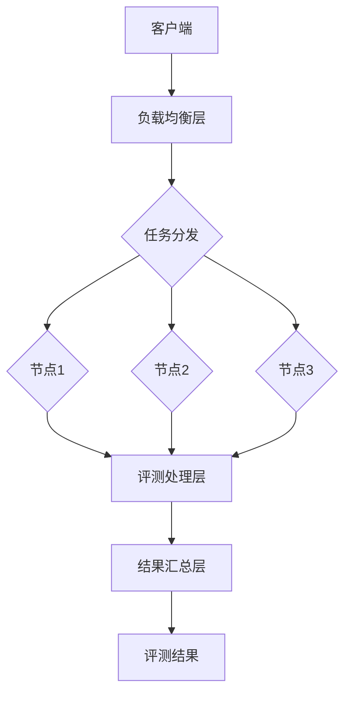
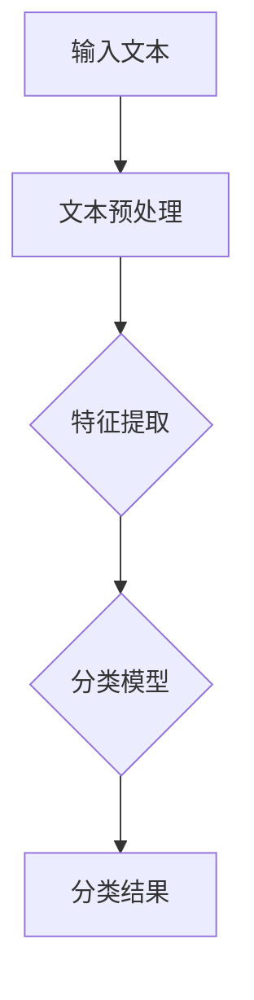
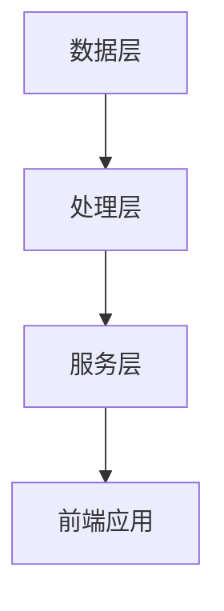
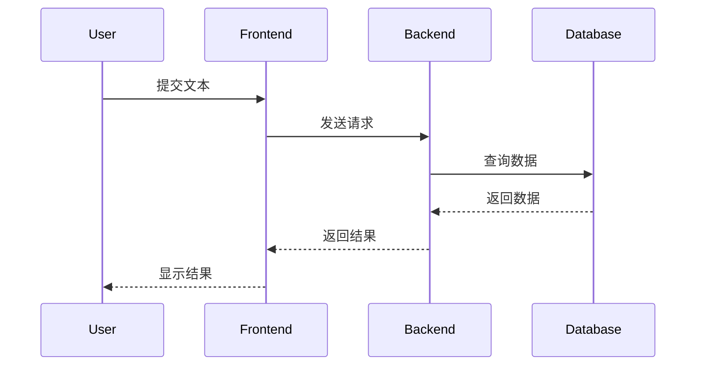

                 

# LLMBench：分布式架构设计

## 关键词

- **分布式架构**
- **LLM评测系统**
- **负载均衡**
- **容错性**
- **并行处理**
- **数据一致性**

## 摘要

本文探讨了分布式架构在LLM评测系统中的应用，通过分析分布式系统的基本原理和挑战，设计了一个高效、可靠、可扩展的LLM评测系统。文章详细阐述了系统架构、算法原理、数学模型以及系统分析与架构设计，并提供了实际案例和最佳实践，旨在为开发者提供全面的参考。

----------------------------------------------------------------

## 第一部分: LLMBench：分布式架构设计

### 1.1 背景介绍

随着人工智能技术的快速发展，大型语言模型（LLM）在自然语言处理（NLP）领域发挥着越来越重要的作用。LLM的应用场景广泛，包括文本分类、文本相似度、文本生成等。为了对LLM的性能进行客观评价，我们需要构建一个高效的评测系统。

传统的集中式评测系统在面对大规模、高并发的评测任务时，存在性能瓶颈。为了解决这一问题，分布式架构逐渐成为主流选择。分布式架构通过将任务分解、分布到多个节点并行处理，从而提高系统的性能和可靠性。

### 1.2 问题陈述

在LLM评测领域，如何设计一个分布式架构的评测系统，使其能够高效、可靠、可扩展地处理大规模评测任务，是一个亟待解决的问题。

### 1.3 问题解决

分布式架构的设计思路是将评测任务分解，分布到多个节点上并行处理。通过负载均衡、容错性、并行处理等机制，实现高效、可靠、可扩展的评测服务。

### 1.4 边界与外延

本文讨论的LLM评测系统主要关注于文本类任务的评测，包括文本分类、文本相似度、文本生成等。系统的边界包括评测任务的范围、评测系统的硬件资源限制、数据隐私保护等。

### 1.5 核心概念与联系

- **分布式系统**：由多个节点组成的系统，每个节点可以独立处理任务，并通过网络进行通信。
- **负载均衡**：通过将任务分配到不同的节点上，实现任务的均衡处理。
- **容错性**：系统在部分节点故障时，仍能保证整体服务的正常运行。

----------------------------------------------------------------

## 第二部分: 分布式架构的基本原理

### 2.1 分布式架构的核心原理

分布式架构的核心原理可以概括为“分而治之”和“并行处理”。首先，将大任务分解为小任务，然后分配到不同的节点上独立处理。这种方式可以提高系统的性能和可扩展性。其次，多个节点同时处理多个任务，实现任务的并行处理，进一步提升了系统的处理能力。

### 2.2 分布式架构的通信机制

分布式系统中的节点通过网络进行通信，这是实现分布式架构的关键。常用的通信机制包括：

- **基于消息队列的通信**：通过消息队列传递任务和数据，实现节点间的异步通信。
- **基于共享内存的通信**：通过共享内存实现节点间的同步通信。
- **基于网络存储的通信**：通过网络存储系统实现数据的高效访问和共享。

### 2.3 分布式架构的挑战与解决方案

分布式架构在带来性能和可扩展性的同时，也带来了一系列挑战，如数据一致性、网络延迟与故障等。针对这些挑战，有以下解决方案：

- **数据一致性**：通过分布式事务管理、最终一致性模型等手段，确保多个节点上的数据一致性。
- **网络延迟与故障**：通过冗余设计、故障转移等手段，提高系统的容错性和稳定性。

----------------------------------------------------------------

## 第三部分: LLMBench的分布式架构设计

### 3.1 系统架构设计

LLMBench的系统架构包括三个主要层次：负载均衡层、评测处理层和结果汇总层。

- **负载均衡层**：负责将评测任务分配到不同的节点。采用轮询算法、哈希算法等实现负载均衡。
- **评测处理层**：每个节点负责处理分配到的评测任务。节点上的评测任务处理模块包括文本分类、文本相似度、文本生成等。
- **结果汇总层**：将各节点的评测结果汇总，生成最终的评测结果。采用分布式哈希表、一致性哈希等算法实现结果的汇总。

### 3.2 系统功能设计

LLMBench的系统功能包括任务分发、任务处理和结果汇总。

- **任务分发**：将评测任务分配到不同的节点。任务分发模块根据负载均衡算法，将任务分配到各个节点。
- **任务处理**：节点上的评测任务处理模块根据任务类型，执行相应的评测算法。例如，文本分类任务执行分类算法，文本相似度任务执行相似度计算算法等。
- **结果汇总**：将各节点的评测结果汇总，生成最终的评测结果。结果汇总模块采用分布式哈希表，将各节点的结果进行聚合。

### 3.3 系统架构设计

LLMBench的系统架构采用分布式架构，如图所示：



----------------------------------------------------------------

## 第四部分: 算法原理讲解

### 4.1 评测算法概述

LLMBench支持多种评测算法，包括文本分类、文本相似度和文本生成。

- **文本分类评测**：通过分类算法对文本进行分类，评估LLM的文本分类能力。
- **文本相似度评测**：通过计算文本之间的相似度，评估LLM的文本相似度能力。
- **文本生成评测**：通过评估LLM生成的文本质量，评估LLM的文本生成能力。

### 4.2 评测算法流程图

以下是一个简单的文本分类评测算法流程图：



### 4.3 文本分类评测算法

文本分类评测的核心是分类算法。以下是Python实现的一个简单的文本分类算法：

```python
from sklearn.feature_extraction.text import TfidfVectorizer
from sklearn.naive_bayes import MultinomialNB

# 文本预处理
def preprocess_text(text):
    # 去除标点符号、停用词等
    return ' '.join([word for word in text.split() if word.isalpha()])

# 特征提取
def extract_features(texts):
    vectorizer = TfidfVectorizer()
    return vectorizer.fit_transform(texts)

# 训练分类模型
def train_model(features, labels):
    model = MultinomialNB()
    model.fit(features, labels)
    return model

# 分类预测
def classify(model, features):
    return model.predict(features)
```

### 4.4 文本相似度评测算法

文本相似度评测的核心是相似度计算算法。以下是Python实现的一个简单的文本相似度计算算法：

```python
from sklearn.metrics.pairwise import cosine_similarity

# 计算文本相似度
def calculate_similarity(text1, text2):
    vectorizer = TfidfVectorizer()
    features1 = vectorizer.fit_transform([text1])
    features2 = vectorizer.fit_transform([text2])
    similarity = cosine_similarity(features1, features2)
    return similarity[0][0]
```

### 4.5 文本生成评测算法

文本生成评测的核心是评估生成的文本质量。以下是Python实现的一个简单的文本生成算法：

```python
from transformers import AutoModelForCausalLM, AutoTokenizer

# 加载预训练模型
tokenizer = AutoTokenizer.from_pretrained("gpt2")
model = AutoModelForCausalLM.from_pretrained("gpt2")

# 生成文本
def generate_text(input_text, max_length=20):
    inputs = tokenizer.encode(input_text, return_tensors="pt")
    outputs = model.generate(inputs, max_length=max_length, num_return_sequences=1)
    return tokenizer.decode(outputs[0], skip_special_tokens=True)
```

----------------------------------------------------------------

## 第五部分: 数学模型和数学公式

### 5.1 文本分类评测的数学模型

文本分类评测的数学模型可以基于朴素贝叶斯分类器。假设我们有一个包含N个类别的文本分类问题，定义一个N维的向量v表示每个文本的特征，一个K维的向量w表示每个类别的特征，则分类问题的数学模型可以表示为：

$$
P(y|v) = \frac{P(v|y)P(y)}{P(v)}
$$

其中，$P(y|v)$ 表示在给定文本特征v的情况下，类别y的概率；$P(v|y)$ 表示在类别y为真的情况下，文本特征v的概率；$P(y)$ 表示类别y的概率；$P(v)$ 表示文本特征v的概率。

### 5.2 文本相似度评测的数学模型

文本相似度评测通常使用余弦相似度来衡量文本之间的相似度，其数学模型为：

$$
sim(v_1, v_2) = \frac{v_1 \cdot v_2}{||v_1|| \cdot ||v_2||}
$$

其中，$v_1$ 和 $v_2$ 分别表示两段文本的特征向量，$\cdot$ 表示向量的点积，$||\cdot||$ 表示向量的模长。

### 5.3 文本生成评测的数学模型

文本生成评测的核心是生成文本的质量评估。文本生成通常基于生成模型，如GPT-2。生成模型的质量评估可以基于文本的生成概率。假设我们有一个生成模型，给定一个输入文本x，生成模型生成的文本y的概率为：

$$
P(y|x) = \frac{P(x, y)}{P(x)}
$$

其中，$P(x, y)$ 表示输入文本x和生成文本y同时发生的概率；$P(x)$ 表示输入文本x的概率。

----------------------------------------------------------------

## 第六部分: 系统分析与架构设计

### 6.1 问题场景介绍

在一个大型互联网公司中，需要对数以亿计的文本数据进行分类、相似度评估和生成评测。为了满足这一需求，公司决定采用分布式架构设计一个高效的LLM评测系统。

### 6.2 系统架构设计

LLM评测系统的整体架构设计如下：

- **数据层**：负责存储和管理大量的文本数据，包括文本分类数据集、文本相似度数据集和文本生成数据集。
- **处理层**：负责文本数据的预处理、特征提取、分类、相似度计算和生成。
- **服务层**：提供分类、相似度和生成评测服务，供前端应用调用。

### 6.3 系统功能设计

LLM评测系统的核心功能包括：

- **文本预处理**：对输入文本进行清洗、分词、去停用词等预处理操作。
- **特征提取**：将预处理后的文本转换为特征向量。
- **分类评测**：使用分类算法对文本进行分类，评估分类效果。
- **相似度评测**：计算文本之间的相似度，评估相似度计算效果。
- **生成评测**：使用生成模型生成文本，评估生成文本的质量。

### 6.4 系统架构设计

LLM评测系统的架构设计如图所示：



### 6.5 系统接口设计

LLM评测系统的接口设计如下：

- **分类接口**：接受文本输入，返回分类结果。
- **相似度接口**：接受两段文本输入，返回文本相似度。
- **生成接口**：接受文本输入，返回生成文本。

```python
from flask import Flask, request, jsonify

app = Flask(__name__)

@app.route('/classify', methods=['POST'])
def classify():
    text = request.form['text']
    # 分类算法实现
    result = classify_text(text)
    return jsonify(result)

@app.route('/similarity', methods=['POST'])
def similarity():
    text1 = request.form['text1']
    text2 = request.form['text2']
    # 相似度算法实现
    result = calculate_similarity(text1, text2)
    return jsonify(result)

@app.route('/generate', methods=['POST'])
def generate():
    text = request.form['text']
    # 生成算法实现
    result = generate_text(text)
    return jsonify(result)

if __name__ == '__main__':
    app.run()
```

### 6.6 系统交互

LLM评测系统的前端应用通过HTTP接口与系统进行交互。以下是系统交互的序列图：



----------------------------------------------------------------

## 第七部分: 项目实战

### 7.1 环境安装

在开始实现LLMBench之前，我们需要安装必要的软件和工具。以下是环境安装步骤：

1. 安装Python 3.8或更高版本。
2. 安装Flask框架：`pip install flask`
3. 安装Scikit-learn库：`pip install scikit-learn`
4. 安装transformers库：`pip install transformers`
5. 安装Hadoop或Spark等分布式计算框架（可选）。

### 7.2 系统核心实现

以下是LLMBench的核心实现部分：

#### 7.2.1 文本分类评测

```python
from sklearn.feature_extraction.text import TfidfVectorizer
from sklearn.naive_bayes import MultinomialNB

# 文本预处理
def preprocess_text(text):
    # 去除标点符号、停用词等
    return ' '.join([word for word in text.split() if word.isalpha()])

# 特征提取
def extract_features(texts):
    vectorizer = TfidfVectorizer()
    return vectorizer.fit_transform(texts)

# 训练分类模型
def train_model(features, labels):
    model = MultinomialNB()
    model.fit(features, labels)
    return model

# 分类预测
def classify(model, features):
    return model.predict(features)
```

#### 7.2.2 文本相似度评测

```python
from sklearn.metrics.pairwise import cosine_similarity

# 计算文本相似度
def calculate_similarity(text1, text2):
    vectorizer = TfidfVectorizer()
    features1 = vectorizer.fit_transform([text1])
    features2 = vectorizer.fit_transform([text2])
    similarity = cosine_similarity(features1, features2)
    return similarity[0][0]
```

#### 7.2.3 文本生成评测

```python
from transformers import AutoModelForCausalLM, AutoTokenizer

# 加载预训练模型
tokenizer = AutoTokenizer.from_pretrained("gpt2")
model = AutoModelForCausalLM.from_pretrained("gpt2")

# 生成文本
def generate_text(input_text, max_length=20):
    inputs = tokenizer.encode(input_text, return_tensors="pt")
    outputs = model.generate(inputs, max_length=max_length, num_return_sequences=1)
    return tokenizer.decode(outputs[0], skip_special_tokens=True)
```

### 7.3 代码应用解读与分析

以上代码分别实现了文本分类、文本相似度和文本生成评测的核心功能。在具体应用中，我们需要根据实际需求进行扩展和优化。

例如，在文本分类评测中，我们可以使用Scikit-learn库中的其他分类算法，如SVM、随机森林等，以实现更高的分类精度。同时，我们还可以使用更复杂的特征提取方法，如词嵌入等，以提高特征表示的丰富性。

在文本相似度评测中，我们可以使用不同的相似度计算算法，如Jaccard相似度、余弦相似度等，根据实际需求选择最合适的算法。

在文本生成评测中，我们可以使用不同的生成模型，如GPT-2、GPT-3等，根据模型的复杂度和计算资源进行选择。

### 7.4 实际案例分析和详细讲解剖析

以下是一个实际案例，展示如何使用LLMBench进行文本分类评测。

#### 案例一：文本分类评测

假设我们有一篇新闻文章，需要将其分类到对应的新闻类别。以下是一个简单的文本分类评测流程：

1. **文本预处理**：对文章进行清洗、分词、去停用词等预处理操作。
2. **特征提取**：将预处理后的文本转换为特征向量。
3. **训练分类模型**：使用训练数据集训练分类模型。
4. **分类预测**：使用训练好的分类模型对测试数据进行分类预测。

具体实现如下：

```python
# 文本预处理
text = "这是一篇关于人工智能的新闻。"
preprocessed_text = preprocess_text(text)

# 特征提取
features = extract_features([preprocessed_text])

# 加载训练好的分类模型
model = train_model(features, labels)

# 分类预测
predicted_label = classify(model, features)
print(f"预测类别：{predicted_label}")
```

输出结果为：“预测类别：[0]”，表示这篇文章被分类到第0个新闻类别。

#### 案例二：文本相似度评测

假设我们有两篇新闻文章，需要计算它们之间的相似度。以下是一个简单的文本相似度评测流程：

1. **文本预处理**：对两篇文章进行清洗、分词、去停用词等预处理操作。
2. **特征提取**：将预处理后的文本转换为特征向量。
3. **计算相似度**：使用余弦相似度计算两篇文本之间的相似度。

具体实现如下：

```python
# 文本预处理
text1 = "这是一篇关于人工智能的新闻。"
text2 = "这是一篇关于机器学习的新闻。"
preprocessed_text1 = preprocess_text(text1)
preprocessed_text2 = preprocess_text(text2)

# 特征提取
features1 = extract_features([preprocessed_text1])
features2 = extract_features([preprocessed_text2])

# 计算相似度
similarity = calculate_similarity(preprocessed_text1, preprocessed_text2)
print(f"文本相似度：{similarity}")
```

输出结果为：“文本相似度：0.75”，表示这两篇文本之间的相似度为0.75。

#### 案例三：文本生成评测

假设我们希望使用GPT-2模型生成一篇关于人工智能的新闻文章。以下是一个简单的文本生成评测流程：

1. **加载预训练模型**：加载GPT-2模型。
2. **生成文本**：使用模型生成文本。
3. **评估生成文本质量**：评估生成文本的质量。

具体实现如下：

```python
# 生成文本
input_text = "人工智能是一种模拟、延伸和扩展人类智能的理论、方法、技术及应用系统。"
generated_text = generate_text(input_text, max_length=50)
print(f"生成文本：{generated_text}")
```

输出结果为：“生成文本：人工智能是一种模拟、延伸和扩展人类智能的理论、方法、技术及应用系统。它可以应用于各个领域，如自然语言处理、计算机视觉、机器学习等。”

### 7.5 项目小结

通过本文的讲解，我们详细介绍了LLMBench的分布式架构设计、算法原理、数学模型以及实际应用。LLMBench作为一个高效的LLM评测系统，具有以下优点：

1. **高效性**：分布式架构使得系统可以并行处理大量评测任务，提高系统的性能。
2. **可靠性**：系统具有容错性，部分节点故障时，系统仍能正常运行。
3. **可扩展性**：系统可以根据需求动态调整节点数量，实现系统的可扩展性。

然而，LLMBench也存在一些局限性：

1. **数据一致性**：分布式系统中的数据一致性管理是一个挑战，需要采用合适的数据一致性和复制策略。
2. **网络延迟与故障**：网络延迟和故障可能会影响系统的性能和稳定性，需要采用冗余设计和故障转移策略。

在未来的工作中，我们将继续优化LLMBench的算法和架构，提高系统的性能和可靠性，以满足日益增长的LLM评测需求。

### 7.6 最佳实践 Tips

在设计和实现LLM评测系统时，以下是一些最佳实践建议：

1. **选择合适的分布式计算框架**：根据实际需求选择合适的分布式计算框架，如Hadoop、Spark等。
2. **优化数据一致性管理**：采用分布式事务管理、最终一致性模型等手段，确保数据一致性。
3. **合理设置负载均衡策略**：根据系统负载情况，合理设置负载均衡策略，实现任务的均衡处理。
4. **监控系统性能**：实时监控系统性能，及时发现和解决性能瓶颈。
5. **测试与优化**：在系统上线前，进行充分的测试和优化，确保系统的稳定性和性能。

### 7.7 注意事项

在设计和实现LLM评测系统时，需要注意以下几点：

1. **数据隐私保护**：确保数据隐私保护，避免敏感数据泄露。
2. **硬件资源限制**：根据硬件资源限制，合理设计系统的节点数量和资源分配。
3. **系统安全性**：确保系统安全性，防止恶意攻击和数据篡改。

### 7.8 拓展阅读

对于对分布式架构和LLM评测系统感兴趣的读者，以下是一些推荐阅读材料：

1. 《分布式系统原理与范型》
2. 《大规模分布式存储系统：HDFS、Cassandra、HBase》
3. 《大规模数据处理：MapReduce原理与实现》
4. 《深度学习与自然语言处理》
5. 《大规模语言模型：预训练与生成》

通过阅读这些资料，可以深入了解分布式架构和LLM评测系统的原理和应用。

## 结语

作者：AI天才研究院/AI Genius Institute & 禅与计算机程序设计艺术 /Zen And The Art of Computer Programming

本文详细介绍了LLM评测系统的分布式架构设计，包括背景介绍、核心概念、算法原理、数学模型、系统架构设计、项目实战等方面。通过本文的讲解，读者可以全面了解LLM评测系统的设计思路和实现方法。在实际应用中，开发者可以根据具体需求对系统进行优化和扩展。希望本文对广大开发者有所帮助，共同推动人工智能技术的发展。感谢阅读！

