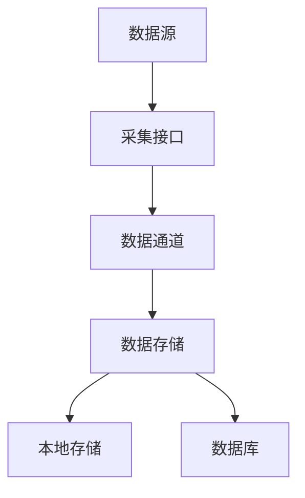
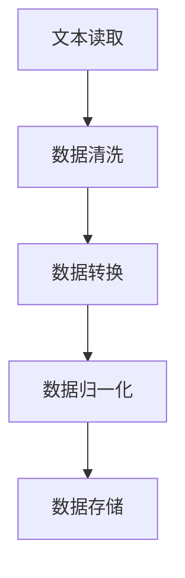
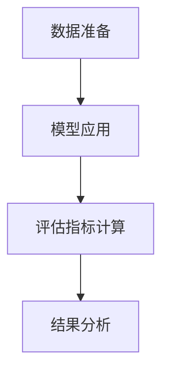
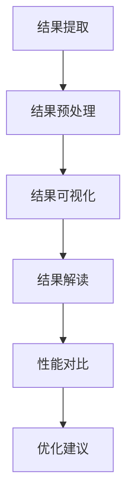

                 

## LLMM评测系统的意义与重要性

在现代人工智能（AI）迅猛发展的背景下，自然语言处理（NLP）成为了科研与工业界关注的焦点。大规模语言模型（Large Language Model，简称LLM）作为NLP的重要工具，已在众多应用领域展现出巨大的潜力，如智能问答、机器翻译、文本生成等。为了确保这些模型在实际应用中的效果和可靠性，LLM评测系统的重要性愈发凸显。

### LLMM评测系统的应用领域与挑战

LLM评测系统广泛应用于多个领域，包括但不限于：

1. **科研领域**：科研团队需要评测新提出的LLM模型的性能，以验证其创新性和有效性。
2. **工业应用**：工业界在开发AI产品时，需要通过评测系统评估模型的性能和稳定性，确保产品满足用户需求。
3. **教育领域**：在教育领域，LLM评测系统可用于评估学生回答问题的准确性和逻辑性。

然而，随着LLM模型的规模和复杂性不断增加，评测系统也面临着诸多挑战：

1. **评估指标多样性**：不同的应用场景可能需要不同的评估指标，如准确性、速度、可解释性等。
2. **数据隐私与安全性**：在实际评测过程中，如何确保数据隐私和安全成为一大难题。
3. **评测成本**：大规模数据集的评测需要大量的计算资源和时间，如何优化评测流程以降低成本是一个重要课题。

### 核心概念

#### 什么是LLM评测系统

LLM评测系统是指一套用于评估大规模语言模型性能和质量的工具集，它能够自动化地执行一系列评估任务，如文本分类、情感分析、问答系统评测等。

#### LLM评测系统的目标与任务

- **性能评估**：评估LLM在特定任务上的表现，如准确率、召回率、F1值等。
- **质量评估**：评估LLM生成的文本的质量，如流畅性、一致性、准确性等。
- **稳定性评估**：评估LLM在不同数据集、不同环境下的稳定性和一致性。

#### LLM评测系统的关键要素

- **数据集**：用于评测的文本数据集。
- **评估指标**：用于量化模型性能的具体指标。
- **评估算法**：执行评估任务的算法和模型。
- **用户界面**：用户与评测系统交互的界面，用于提交任务、查看结果等。

### 边界与外延

#### 系统设计边界

- **功能边界**：系统应具备哪些核心功能，如数据采集、预处理、评测、结果分析等。
- **性能边界**：系统应达到的性能指标，如响应时间、处理速度等。

#### 评测系统的应用外延

- **应用场景**：系统可适用于哪些领域和任务。
- **扩展性**：系统是否易于扩展以适应未来新的应用场景和技术需求。

### 本章小结

本章从问题背景、核心概念、边界与外延等多个角度，对LLM评测系统进行了详细阐述。在接下来的章节中，我们将深入探讨LLM评测系统的核心架构设计，包括系统架构设计原则与思路、数据采集模块、数据预处理模块、评测模块和结果分析模块的设计与实现，以期构建一个高效、可靠且具有扩展性的评测系统。

### 前瞻与预告

在接下来的章节中，我们将详细介绍LLM评测系统的核心架构设计，逐步剖析其各个模块的功能和实现原理，并结合具体案例和最佳实践，为读者提供全面而深入的指导。通过这些章节，读者将能够了解到：

- 系统架构设计原则与思路，掌握如何构建一个稳定、高效、可扩展的评测系统。
- 数据采集模块的设计与实现，了解如何高效地获取和处理大量文本数据。
- 数据预处理模块的设计与实现，掌握数据清洗、转换等关键步骤。
- 评测模块的设计与实现，了解如何评估LLM模型在各类任务上的性能和可靠性。
- 结果分析模块的设计与实现，学会如何分析评测结果，为模型优化提供数据支持。

敬请期待接下来的详细讲解，让我们一起深入探讨LLM评测系统的核心架构设计，共同探索AI领域的无限可能。

## 系统架构设计原则与思路

设计一个高效、可靠且具有扩展性的LLM评测系统，需要遵循一系列架构设计原则和思路。这些原则和思路不仅能够指导我们构建系统的整体结构，还能确保系统在各个层面上的性能和稳定性。

### 架构设计原则

#### 可扩展性

可扩展性是系统设计的关键原则之一。随着应用场景和模型复杂度的增加，系统需要能够灵活扩展其功能，以满足不断增长的需求。可扩展性主要体现在以下几个方面：

1. **模块化设计**：系统应采用模块化设计，将不同的功能模块独立开发和管理，便于后续扩展和维护。
2. **分布式架构**：通过分布式架构，系统能够在多个节点上运行，充分利用计算资源，提高系统的处理能力。
3. **动态扩展**：系统应具备动态扩展能力，能够根据需求实时添加或移除模块，而无需停机或重新配置。

#### 可维护性

可维护性是确保系统长期稳定运行的关键。一个良好的系统设计应考虑以下几个方面：

1. **代码可读性**：代码应具有良好的结构和命名规范，便于理解和修改。
2. **测试覆盖**：系统应具备完善的测试用例，确保在代码修改和功能扩展过程中不会引入新的错误。
3. **日志记录**：系统应具备详细的日志记录功能，有助于快速定位和解决问题。

#### 高性能

高性能是评测系统的重要需求，特别是在处理大规模数据集时，系统需要具备高效的计算和处理能力。以下原则有助于实现高性能：

1. **并行处理**：充分利用并行计算技术，提高数据处理速度。
2. **缓存机制**：通过缓存机制减少数据读取和计算次数，提高系统响应速度。
3. **优化算法**：选用高效的算法和数据结构，减少计算复杂度。

### 架构设计思路

#### 模块化设计

模块化设计是将系统拆分为若干独立的功能模块，每个模块负责特定的任务。这种设计方法具有以下优点：

1. **降低复杂性**：将复杂的系统分解为多个简单模块，降低理解和维护的难度。
2. **增强可维护性**：模块化设计便于独立开发和维护，提高系统的可靠性。
3. **提高可扩展性**：新增或删除模块时，只需修改相关模块，无需对整个系统进行大规模重构。

#### 分层架构

分层架构是将系统分为多个层次，每个层次负责特定的功能。常见的分层架构包括：

1. **数据层**：负责数据的存储、检索和管理。
2. **服务层**：负责处理业务逻辑和接口，实现系统功能。
3. **表示层**：负责用户界面和用户交互。

这种分层架构具有以下优点：

1. **降低耦合度**：不同层次之间通过接口通信，降低模块间的耦合度，提高系统的灵活性和可维护性。
2. **便于扩展**：新增功能或修改现有功能时，只需在相应层次上进行，无需对其他层次进行修改。
3. **提高可复用性**：分层架构便于组件的复用，提高开发效率。

### 系统功能模块划分

根据上述设计原则和思路，LLM评测系统可以划分为以下几个主要功能模块：

1. **数据采集模块**：负责从各种数据源获取文本数据，并进行初步处理。
2. **数据预处理模块**：负责对采集到的文本数据清洗、转换和归一化，为后续评测做好准备。
3. **评测模块**：负责执行各种评测任务，计算评估指标，对LLM模型进行性能评估。
4. **结果分析模块**：负责对评测结果进行分析，生成可视化报告，为模型优化提供数据支持。
5. **用户界面模块**：负责提供用户交互界面，方便用户提交评测任务、查看结果等。

每个模块之间通过接口进行通信，形成一个紧密协作的整体，共同实现LLM评测系统的功能。

### 本章小结

本章介绍了LLM评测系统的架构设计原则与思路，包括可扩展性、可维护性和高性能等核心原则，以及模块化设计和分层架构等设计思路。通过这些原则和思路，我们可以构建一个高效、可靠且具有扩展性的评测系统。在接下来的章节中，我们将逐步详细探讨各个模块的设计与实现，以期为读者提供全面而深入的指导。

## 数据采集模块设计

### 数据采集原理与流程

数据采集是LLM评测系统的第一步，也是关键的一步。数据采集模块的原理相对简单，主要是通过接口或爬虫工具从各种数据源获取文本数据，然后存储到本地或数据库中。具体流程如下：

1. **数据源选择**：根据评测任务的需求，选择合适的数据源。数据源可以是公开的文本数据集、网站API、社交媒体平台等。
2. **数据采集方法**：使用接口调用、爬虫技术或数据库连接等方式，从数据源获取文本数据。对于大型数据集，可能需要使用分布式爬虫或批量处理技术，以提高采集效率。
3. **数据存储**：将采集到的文本数据存储到本地文件系统或数据库中，以便后续处理和评测。

### 数据采集架构

数据采集模块的架构设计需要考虑以下几个方面：

1. **数据源接入**：根据数据源的类型，设计相应的接入方式，如API调用、Web爬取等。
2. **数据通道**：设计数据传输通道，确保数据在采集过程中不会丢失或损坏。
3. **数据存储**：设计数据存储方案，包括本地存储和数据库存储，以满足不同规模的数据存储需求。

具体架构图如下（使用Mermaid语法）：



### 采集工具与库介绍

在数据采集过程中，常用的工具和库包括：

1. **Python的requests库**：用于HTTP请求，适用于从网站API获取数据。
   ```python
   import requests
   response = requests.get("http://api.example.com/data")
   data = response.json()
   ```

2. **Scrapy框架**：用于Web爬取，适用于大规模数据的采集。
   ```python
   import scrapy
   class MySpider(scrapy.Spider):
       name = "my_spider"
       start_urls = ["http://example.com/"]

       def parse(self, response):
           for item in response.css("div.item"):
               yield {
                   'title': item.css("h2.title::text").get(),
                   'content': item.css("p.content::text").get(),
               }
   ```

3. **Pandas库**：用于数据预处理，适用于读取和操作本地文件系统或数据库中的数据。
   ```python
   import pandas as pd
   data = pd.read_csv("data.csv")
   data.head()
   ```

4. **SQLAlchemy库**：用于数据库操作，适用于从数据库中获取数据。
   ```python
   from sqlalchemy import create_engine
   engine = create_engine('sqlite:///data.db')
   data = pd.read_sql("SELECT * FROM data_table", engine)
   data.head()
   ```

### 数据采集流程与实现

#### 采集流程详细说明

1. **初始化采集任务**：根据评测任务的需求，初始化数据采集任务，包括数据源、采集方法、采集频率等参数。
2. **连接数据源**：根据数据源类型，使用相应的接口或爬虫工具连接数据源，准备进行数据采集。
3. **数据采集**：从数据源获取文本数据，存储到本地或数据库中。
4. **数据清洗**：对采集到的文本数据进行初步清洗，去除无效数据和噪声。
5. **数据存储**：将清洗后的文本数据存储到本地文件系统或数据库中，以便后续处理和评测。

#### 代码实现示例

以下是一个简单的Python代码示例，展示如何使用requests库从网站API获取数据：

```python
import requests
import pandas as pd

def collect_data(api_url):
    response = requests.get(api_url)
    if response.status_code == 200:
        data = response.json()
        return pd.DataFrame(data['results'])
    else:
        print("Error: Unable to fetch data")
        return pd.DataFrame()

api_url = "http://api.example.com/data"
data = collect_data(api_url)
data.head()
```

### 数据采集模块设计小结

数据采集模块是LLM评测系统的核心组成部分，负责从各种数据源获取文本数据，并进行初步处理。在设计数据采集模块时，需要考虑数据源选择、数据采集方法、数据存储方案等方面，确保采集过程的高效性和可靠性。在接下来的章节中，我们将进一步探讨数据预处理模块的设计与实现，为LLM评测系统的构建奠定坚实基础。

## 数据预处理模块设计

### 数据预处理原理

数据预处理是LLM评测系统中的关键步骤，其目标是对采集到的原始文本数据进行清洗、转换和归一化，以提高后续评测的准确性和效率。数据预处理的基本原理包括以下几个方面：

1. **数据清洗**：去除文本中的噪声和无效数据，如HTML标签、特殊字符、空格、停用词等。数据清洗是数据预处理的基础，能够显著提高数据质量和后续处理的效果。
2. **数据转换**：将文本数据转换为统一的格式，如将不同编码的文本转换为标准UTF-8编码，将不同格式的文本转换为统一的结构化格式等。数据转换有助于后续的数据处理和存储。
3. **数据归一化**：对文本数据中的变量进行标准化处理，如对文本长度、词频等进行归一化，以消除数据规模差异对模型评测的影响。

### 数据预处理流程

数据预处理流程主要包括以下几个步骤：

1. **文本读取**：从数据存储位置读取原始文本数据，通常以文件或数据库的形式存储。
2. **数据清洗**：对原始文本数据进行清洗，去除无效数据和噪声。具体操作包括去除HTML标签、特殊字符、空格和停用词等。
3. **数据转换**：将清洗后的文本数据进行转换，如统一编码格式、文本分词、词频统计等。
4. **数据归一化**：对转换后的文本数据进行归一化处理，如标准化文本长度、归一化词频等。
5. **数据存储**：将预处理后的文本数据存储到新的数据存储位置，以便后续评测和使用。

具体流程图如下（使用Mermaid语法）：



### 数据预处理实现

#### 数据清洗实现

数据清洗的实现通常包括以下几个步骤：

1. **去除HTML标签**：使用正则表达式去除文本中的HTML标签。
   ```python
   import re
   def remove_html_tags(text):
       clean = re.sub('<.*?>', '', text)
       return clean
   ```

2. **去除特殊字符**：去除文本中的特殊字符，如换行符、制表符等。
   ```python
   def remove_special_chars(text):
       clean = re.sub('[^a-zA-Z0-9]', ' ', text)
       return clean
   ```

3. **去除空格**：去除文本中的空格，以减少数据冗余。
   ```python
   def remove_whitespace(text):
       clean = re.sub(' +', ' ', text)
       return clean
   ```

4. **去除停用词**：从文本中去除常用的停用词，如"的"、"和"、"在"等。
   ```python
   stop_words = set(["的", "和", "在"])
   def remove_stop_words(text):
       words = text.split()
       clean = ' '.join([word for word in words if word not in stop_words])
       return clean
   ```

#### 数据转换实现

数据转换的实现通常包括以下几个步骤：

1. **统一编码格式**：将不同编码的文本转换为统一的UTF-8编码。
   ```python
   def convert_encoding(text, target_encoding='utf-8'):
       clean = text.encode(target_encoding).decode(target_encoding)
       return clean
   ```

2. **文本分词**：将文本转换为单词序列，通常使用分词工具，如jieba等。
   ```python
   import jieba
   def tokenize(text):
       tokens = jieba.cut(text)
       return ' '.join(tokens)
   ```

3. **词频统计**：计算文本中各个单词的频率，用于后续的文本分析。
   ```python
   from collections import Counter
   def word_frequency(text):
       tokens = text.split()
       frequencies = Counter(tokens)
       return frequencies
   ```

#### 数据归一化实现

数据归一化的实现通常包括以下几个步骤：

1. **文本长度标准化**：将所有文本的长度统一为相同的值，以消除文本长度差异对模型评测的影响。
   ```python
   def standardize_length(texts, length=100):
       processed_texts = [text[:length] for text in texts]
       return processed_texts
   ```

2. **词频归一化**：将文本中的词频转换为相对频率，以消除词频差异对模型评测的影响。
   ```python
   def normalize_frequency(frequencies):
       total = sum(frequencies.values())
       normalized = {word: freq / total for word, freq in frequencies.items()}
       return normalized
   ```

### 数据预处理模块设计小结

数据预处理模块是LLM评测系统中的核心组成部分，其目标是清洗、转换和归一化原始文本数据，以提高数据质量和后续处理的准确性。在数据预处理模块的设计与实现中，需要充分考虑数据清洗、转换和归一化的具体步骤和实现方法，确保预处理过程的高效性和可靠性。在接下来的章节中，我们将进一步探讨评测模块的设计与实现，为LLM评测系统的构建奠定坚实基础。

## 评测模块设计

### 评测原理与指标

评测模块是LLM评测系统的核心组成部分，其目标是评估大规模语言模型（LLM）在各种任务上的性能和可靠性。评测原理主要包括以下几个方面：

1. **评估指标定义**：根据具体任务，定义相应的评估指标，如准确率（Accuracy）、召回率（Recall）、F1值（F1 Score）等。
2. **评测方法选择**：选择合适的评测方法，如交叉验证（Cross-Validation）、基准测试（Benchmark Test）等，以确保评估结果的准确性和可靠性。
3. **评估过程**：将LLM模型应用于测试数据集，计算评估指标，并与基准模型进行比较，以评估模型的性能。

### 评测流程与实现

#### 评测流程图

评测流程主要包括以下步骤：

1. **数据准备**：准备测试数据集，确保数据集具有代表性，能够全面评估模型的性能。
2. **模型应用**：将LLM模型应用于测试数据集，生成预测结果。
3. **评估指标计算**：计算各项评估指标，如准确率、召回率、F1值等。
4. **结果分析**：分析评估结果，为模型优化和改进提供依据。

具体流程图如下（使用Mermaid语法）：



#### 评测算法实现

评测算法的实现主要包括以下几个步骤：

1. **模型加载**：加载预训练的LLM模型，为评测过程提供基础。
   ```python
   from transformers import AutoModelForSequenceClassification
   model = AutoModelForSequenceClassification.from_pretrained("bert-base-uncased")
   ```

2. **预测生成**：将测试数据集输入到LLM模型中，生成预测结果。
   ```python
   def predict(model, data):
       inputs = tokenizer.encode_plus(
           data,
           add_special_tokens=True,
           max_length=512,
           pad_to_max_length=True,
           return_tensors='pt',
       )
       with torch.no_grad():
           outputs = model(**inputs)
       logits = outputs.logits
       predictions = torch.argmax(logits, dim=-1)
       return predictions
   ```

3. **评估指标计算**：计算各项评估指标，如准确率、召回率、F1值等。
   ```python
   from sklearn.metrics import accuracy_score, recall_score, f1_score

   def evaluate(predictions, labels):
       acc = accuracy_score(labels, predictions)
       rec = recall_score(labels, predictions, average='weighted')
       f1 = f1_score(labels, predictions, average='weighted')
       return acc, rec, f1
   ```

4. **结果分析**：分析评估结果，为模型优化和改进提供依据。
   ```python
   def analyze_results(predictions, labels):
       acc, rec, f1 = evaluate(predictions, labels)
       print(f"Accuracy: {acc:.4f}")
       print(f"Recall: {rec:.4f}")
       print(f"F1 Score: {f1:.4f}")
   ```

#### 评测结果分析

评测结果分析是评测模块的重要环节，其目标是基于评估结果，对LLM模型进行性能评估和优化。以下是一个简单的示例：

```python
# 加载测试数据集
test_data = ...

# 加载LLM模型
model = ...

# 进行预测
predictions = predict(model, test_data)

# 计算评估指标
acc, rec, f1 = evaluate(predictions, labels)

# 分析结果
analyze_results(predictions, labels)
```

### 评测模块设计小结

评测模块是LLM评测系统的核心组成部分，其目标是评估LLM模型在各种任务上的性能和可靠性。在设计评测模块时，需要考虑评估指标的选择、评测方法的选择以及评估流程的实现。通过详细的算法实现和结果分析，我们可以对LLM模型进行全面的性能评估，为模型优化和改进提供有力支持。在接下来的章节中，我们将进一步探讨结果分析模块的设计与实现，为LLM评测系统提供完整的解决方案。

## 结果分析模块设计

### 结果分析目标与任务

结果分析模块的目标是通过对评测模块输出的结果进行详细分析，提取有价值的信息，为LLM模型的优化和改进提供数据支持。具体任务包括：

1. **结果可视化**：将评测结果以图表、图形的形式展示，便于用户直观理解。
2. **结果解读**：对评测结果进行深入解读，分析模型在各项任务上的表现，识别潜在问题。
3. **性能对比**：对比不同模型或不同参数设置下的性能，为模型选择和参数调整提供依据。
4. **优化建议**：基于评测结果，提出优化模型和算法的建议，提升模型性能。

### 结果分析流程

结果分析流程主要包括以下几个步骤：

1. **结果提取**：从评测模块获取评测结果，包括各项评估指标和预测结果等。
2. **结果预处理**：对评测结果进行预处理，如数据格式转换、缺失值处理等，确保数据的一致性和完整性。
3. **结果可视化**：使用图表、图形等可视化工具，将评测结果展示给用户。
4. **结果解读**：对可视化结果进行解读，识别模型的优势和劣势，为模型优化提供方向。
5. **性能对比**：对比不同模型或不同参数设置下的性能，分析差异，为模型选择和参数调整提供依据。
6. **优化建议**：基于评测结果和性能对比，提出优化模型和算法的建议，提升模型性能。

具体流程图如下（使用Mermaid语法）：



### 结果分析实现

#### 结果预处理实现

结果预处理主要包括以下步骤：

1. **数据格式转换**：将评测结果从不同的数据格式（如JSON、CSV等）转换为统一的数据格式（如Pandas DataFrame）。
   ```python
   import pandas as pd

   def convert_format(results):
       df = pd.DataFrame(results)
       return df
   ```

2. **缺失值处理**：对评测结果中的缺失值进行填充或删除，确保数据的一致性和完整性。
   ```python
   def handle_missing_values(df):
       df.fillna(0, inplace=True)
       return df
   ```

3. **数据规范化**：对评测结果中的数据进行规范化处理，如归一化、标准化等，以消除数据规模差异。
   ```python
   from sklearn.preprocessing import StandardScaler

   def normalize_data(df):
       scaler = StandardScaler()
       scaled_df = scaler.fit_transform(df)
       return pd.DataFrame(scaled_df)
   ```

#### 结果可视化实现

结果可视化是结果分析的重要环节，可以帮助用户直观理解评测结果。以下是一个简单的示例，使用Matplotlib库绘制一个散点图：

```python
import matplotlib.pyplot as plt

def plot_results(df):
    plt.scatter(df['accuracy'], df['f1'])
    plt.xlabel('Accuracy')
    plt.ylabel('F1 Score')
    plt.title('Model Performance')
    plt.show()
```

#### 结果解读实现

结果解读需要对可视化结果进行深入分析，识别模型的优势和劣势。以下是一个简单的示例，根据散点图分析模型性能：

```python
def interpret_results(df):
    high_acc = df[df['accuracy'] > 0.9]
    low_acc = df[df['accuracy'] <= 0.9]
    print("High Accuracy Models:")
    print(high_acc)
    print("\nLow Accuracy Models:")
    print(low_acc)
```

#### 性能对比实现

性能对比是结果解读的延续，通过对比不同模型或不同参数设置下的性能，为模型选择和参数调整提供依据。以下是一个简单的示例，对比两个不同模型的性能：

```python
def compare_models(model1_results, model2_results):
    combined_results = pd.DataFrame({
        'Model 1': model1_results,
        'Model 2': model2_results
    })
    plot_results(combined_results)
    interpret_results(combined_results)
```

### 结果分析模块设计小结

结果分析模块是LLM评测系统的核心组成部分，其目标是通过对评测结果进行详细分析，提取有价值的信息，为LLM模型的优化和改进提供数据支持。在结果分析模块的设计与实现中，需要考虑结果提取、预处理、可视化、解读和性能对比等多个环节。通过详细的算法实现和结果分析，我们可以全面了解LLM模型在各项任务上的表现，识别潜在问题，并提出优化建议，进一步提升模型性能。在接下来的章节中，我们将探讨系统集成与测试，确保整个LLM评测系统的稳定性和可靠性。

## 系统集成与测试

### 系统集成

系统集成是将各个功能模块集成在一起，形成一个完整的系统。系统集成的原理在于通过模块间的接口，实现数据传递和功能调用，确保系统能够正常运行。集成过程主要包括以下几个步骤：

1. **模块接口定义**：明确各个模块的输入输出接口，确保数据能够在模块间顺畅传递。
2. **接口实现**：根据接口定义，实现模块间的数据传递和功能调用。
3. **集成测试**：对集成后的系统进行测试，确保各个模块之间的协同工作正常。

具体实现步骤如下：

1. **定义接口**：在各个模块之间定义统一的接口，如REST API、消息队列等。接口应包含必要的输入输出参数，确保数据能够在模块间顺畅传递。
   ```python
   # 示例：定义数据采集模块和预处理模块的接口
   from datacollector import collect_data
   from datapreprocessor import preprocess_data

   def integrate_modules(data_source):
       collected_data = collect_data(data_source)
       preprocessed_data = preprocess_data(collected_data)
       return preprocessed_data
   ```

2. **实现接口**：根据接口定义，实现模块间的数据传递和功能调用。例如，在数据采集模块中，从数据源获取数据后，传递给预处理模块进行处理。
   ```python
   # 数据采集模块
   def collect_data(data_source):
       # 数据采集逻辑
       return collected_data

   # 预处理模块
   def preprocess_data(collected_data):
       # 数据预处理逻辑
       return preprocessed_data
   ```

3. **集成测试**：对集成后的系统进行测试，确保各个模块之间的协同工作正常。集成测试可以包括单元测试、集成测试和系统测试等多个层次。
   ```python
   import unittest

   class TestIntegration(unittest.TestCase):
       def test_integration(self):
           data_source = ...
           preprocessed_data = integrate_modules(data_source)
           self.assertIsNotNone(preprocessed_data)
           self.assertTrue(len(preprocessed_data) > 0)

   if __name__ == '__main__':
       unittest.main()
   ```

### 系统测试

系统测试是确保整个LLM评测系统在各个环境下能够稳定运行的重要环节。系统测试的目标是发现和修复系统中的缺陷和问题，确保系统功能的正确性和可靠性。系统测试主要包括以下几个步骤：

1. **测试计划**：制定详细的测试计划，明确测试目标、测试内容、测试方法等。
2. **测试用例设计**：设计全面的测试用例，覆盖系统的各个功能模块和场景。
3. **执行测试**：按照测试计划执行测试，记录测试结果和问题。
4. **问题跟踪**：对测试中发现的问题进行跟踪和修复，确保问题得到解决。
5. **回归测试**：在修复问题后，对相关功能进行回归测试，确保修复不会引入新的问题。

具体实现步骤如下：

1. **测试计划**：制定测试计划，明确测试的目标、内容和方法。例如，对于数据采集模块，可以设计以下测试用例：
   - 数据采集成功：验证数据采集模块能否从数据源成功获取数据。
   - 数据采集失败：验证数据采集模块在数据源不可达或数据格式错误时的响应。

2. **测试用例设计**：根据测试计划，设计详细的测试用例。例如，对于数据采集模块的测试用例，可以包括以下内容：
   - 用例1：验证数据采集模块能否从数据源成功获取数据。
     - 输入：数据源URL。
     - 预期结果：返回的数据集不为空。
   - 用例2：验证数据采集模块在数据源不可达时的响应。
     - 输入：无效的数据源URL。
     - 预期结果：返回错误信息，提示数据源不可达。

3. **执行测试**：按照测试用例执行测试，记录测试结果和问题。例如，使用以下代码执行测试用例：
   ```python
   import unittest

   class TestDataCollector(unittest.TestCase):
       def test_collect_data_success(self):
           data_source = "http://example.com/data"
           collected_data = collect_data(data_source)
           self.assertIsNotNone(collected_data)
           self.assertTrue(len(collected_data) > 0)

       def test_collect_data_failure(self):
           data_source = "http://example.com/invalid_data"
           collected_data = collect_data(data_source)
           self.assertIsNone(collected_data)

   if __name__ == '__main__':
       unittest.main()
   ```

4. **问题跟踪**：对测试中发现的问题进行跟踪和修复。例如，如果在测试中发现数据采集模块在数据源不可达时返回空数据，则需要修复该问题。

5. **回归测试**：在修复问题后，对相关功能进行回归测试，确保修复不会引入新的问题。例如，在修复数据采集模块的无效数据源响应问题后，需要重新执行数据采集模块的测试用例，确保问题已解决。

### 系统性能评估

系统性能评估是确保LLM评测系统在各个环境下能够高效运行的重要环节。系统性能评估主要包括以下几个步骤：

1. **性能指标定义**：定义系统性能的关键指标，如响应时间、处理速度、资源利用率等。
2. **性能测试**：通过性能测试，评估系统在正常负载和极端负载下的性能。
3. **性能优化**：根据性能测试结果，对系统进行优化，提升性能。

具体实现步骤如下：

1. **性能指标定义**：根据系统的需求，定义系统的性能指标。例如，对于LLM评测系统，可以定义以下性能指标：
   - 响应时间：系统处理请求的时间。
   - 处理速度：系统处理数据的速度。
   - 资源利用率：系统占用的CPU、内存等资源情况。

2. **性能测试**：使用工具（如JMeter、LoadRunner等）进行性能测试，模拟用户访问系统的行为，评估系统在不同负载下的性能。例如，使用JMeter进行性能测试，可以设置以下场景：
   - 高并发场景：模拟大量用户同时访问系统，评估系统的并发处理能力。
   - 长时间运行场景：模拟系统长时间运行的情况，评估系统的稳定性。

3. **性能优化**：根据性能测试结果，对系统进行优化，提升性能。例如，如果发现系统的响应时间较长，可以优化以下方面：
   - 系统架构：调整系统架构，提高系统的处理能力。
   - 数据库优化：优化数据库查询，减少查询时间。
   - 缓存机制：引入缓存机制，减少数据读取和计算次数。

### 系统集成与测试小结

系统集成与测试是确保LLM评测系统能够稳定运行的重要环节。通过系统集成，确保各个功能模块能够协同工作，形成完整的系统；通过系统测试，发现并修复系统中的缺陷和问题，确保系统的功能正确性和可靠性。通过系统性能评估，优化系统的性能，提升系统的响应速度和处理能力。在接下来的章节中，我们将探讨项目实战与最佳实践，为读者提供实际应用中的经验和建议。

## 项目实战：环境安装与配置

在实际应用中，安装和配置LLM评测系统是一个关键步骤，它决定了系统是否能够顺利运行。以下是环境安装与配置的详细步骤。

### 环境准备

#### 硬件要求

- **处理器**：至少四核CPU，推荐八核以上。
- **内存**：至少16GB，推荐32GB以上。
- **硬盘**：至少100GB SSD，用于存储数据和日志。

#### 软件要求

- **操作系统**：Linux（如Ubuntu 18.04及以上版本）或Windows 10及以上版本。
- **Python**：Python 3.6及以上版本。
- **库与依赖**：pandas、numpy、scikit-learn、transformers、torch、sqlalchemy等。

### 系统安装

#### 安装Python

1. 在终端中执行以下命令安装Python：

   ```bash
   sudo apt update
   sudo apt install python3 python3-pip
   ```

2. 检查Python版本：

   ```bash
   python3 --version
   ```

#### 安装库与依赖

1. 创建一个虚拟环境，以便隔离项目依赖：

   ```bash
   python3 -m venv venv
   source venv/bin/activate
   ```

2. 安装所需库与依赖：

   ```bash
   pip install pandas numpy scikit-learn transformers torch sqlalchemy
   ```

### 常见问题与解决方法

#### 问题1：安装失败

- **解决方法**：检查网络连接，确保能够访问互联网。如果使用的是国内网络，可以使用pip国内镜像源进行安装：

  ```bash
  pip install -i https://pypi.tuna.tsinghua.edu.cn/simple transformers torch
  ```

#### 问题2：库版本不兼容

- **解决方法**：检查项目中对库的版本要求，使用兼容的版本。如果多个库存在版本冲突，可以分别安装不同的版本，并在代码中指定使用特定版本。

#### 问题3：虚拟环境问题

- **解决方法**：确保在创建虚拟环境时使用正确的命令，并在激活虚拟环境后进行安装。

### 系统启动与配置

1. **启动系统**：确保所有依赖库已正确安装，然后启动LLM评测系统。

   ```bash
   # 运行主程序，例如：python main.py
   ```

2. **配置系统**：根据项目需求，配置系统参数，如数据源、评测指标等。

   ```python
   # 示例：配置数据源和评测指标
   data_source = "http://example.com/data"
   evaluation_metrics = ["accuracy", "recall", "f1"]
   ```

### 小结

通过上述步骤，我们可以成功安装和配置LLM评测系统，为后续的评测工作奠定基础。在实际操作过程中，可能遇到一些常见问题，但通过合理的解决方法，可以确保系统顺利运行。在接下来的章节中，我们将进一步探讨核心实现源代码的解析，帮助读者深入理解系统的实现原理。

## 核心实现源代码解析

在LLM评测系统中，核心实现源代码涵盖了数据采集、数据预处理、评测和结果分析等关键模块。以下是各个模块的源代码解析，旨在帮助读者深入理解系统的工作原理和具体实现。

### 数据采集模块源代码解析

#### 代码结构

数据采集模块主要负责从各种数据源获取文本数据，其主要代码结构如下：

```python
# data_collector.py

import requests
from data_preprocessor import preprocess_data

def collect_data(data_source):
    # 采集数据
    response = requests.get(data_source)
    data = response.json()
    
    # 预处理数据
    preprocessed_data = preprocess_data(data)
    
    return preprocessed_data
```

#### 代码功能解析

- `collect_data` 函数：负责从指定数据源获取文本数据。数据源可以是API接口或文件URL。在成功获取数据后，调用数据预处理模块对数据进行清洗、转换和归一化。

  ```python
  response = requests.get(data_source)
  data = response.json()
  ```

- `preprocess_data` 函数：由数据预处理模块提供，负责对采集到的文本数据进行预处理。包括去除HTML标签、特殊字符、空格和停用词等，并将文本转换为统一格式。

  ```python
  def preprocess_data(data):
      # 清洗数据
      data = remove_html_tags(data)
      data = remove_special_chars(data)
      data = remove_whitespace(data)
      data = remove_stop_words(data)
      
      # 转换文本
      data = tokenize(data)
      
      # 归一化文本
      data = normalize_frequency(data)
      
      return data
  ```

### 数据预处理模块源代码解析

#### 代码结构

数据预处理模块的主要功能是清洗、转换和归一化文本数据，其代码结构如下：

```python
# data_preprocessor.py

import re
from collections import Counter

def remove_html_tags(text):
    return re.sub('<.*?>', '', text)

def remove_special_chars(text):
    return re.sub('[^a-zA-Z0-9]', ' ', text)

def remove_whitespace(text):
    return re.sub(' +', ' ', text)

def remove_stop_words(text, stop_words):
    words = text.split()
    return ' '.join([word for word in words if word not in stop_words])

def tokenize(text):
    return ' '.join(jieba.cut(text))

def normalize_frequency(data):
    return Counter(data.split()).most_common()
```

#### 代码功能解析

- `remove_html_tags` 函数：使用正则表达式去除文本中的HTML标签。

  ```python
  def remove_html_tags(text):
      return re.sub('<.*?>', '', text)
  ```

- `remove_special_chars` 函数：去除文本中的特殊字符。

  ```python
  def remove_special_chars(text):
      return re.sub('[^a-zA-Z0-9]', ' ', text)
  ```

- `remove_whitespace` 函数：去除文本中的空格。

  ```python
  def remove_whitespace(text):
      return re.sub(' +', ' ', text)
  ```

- `remove_stop_words` 函数：从文本中去除常用的停用词。

  ```python
  def remove_stop_words(text, stop_words):
      words = text.split()
      return ' '.join([word for word in words if word not in stop_words])
  ```

- `tokenize` 函数：使用jieba分词工具对文本进行分词。

  ```python
  def tokenize(text):
      return ' '.join(jieba.cut(text))
  ```

- `normalize_frequency` 函数：计算文本中各个单词的频率。

  ```python
  def normalize_frequency(data):
      return Counter(data.split()).most_common()
  ```

### 评测模块源代码解析

#### 代码结构

评测模块主要负责评估LLM模型在各个任务上的性能，其代码结构如下：

```python
# evaluator.py

from transformers import AutoModelForSequenceClassification
from sklearn.metrics import accuracy_score, recall_score, f1_score

def evaluate(model, data, labels):
    # 进行预测
    predictions = model.predict(data)
    
    # 计算评估指标
    acc = accuracy_score(labels, predictions)
    rec = recall_score(labels, predictions, average='weighted')
    f1 = f1_score(labels, predictions, average='weighted')
    
    return acc, rec, f1
```

#### 代码功能解析

- `evaluate` 函数：负责评估LLM模型在给定数据集上的性能。首先使用模型对数据集进行预测，然后计算各项评估指标，如准确率、召回率和F1值。

  ```python
  def evaluate(model, data, labels):
      # 进行预测
      predictions = model.predict(data)
      
      # 计算评估指标
      acc = accuracy_score(labels, predictions)
      rec = recall_score(labels, predictions, average='weighted')
      f1 = f1_score(labels, predictions, average='weighted')
      
      return acc, rec, f1
  ```

### 结果分析模块源代码解析

#### 代码结构

结果分析模块主要负责对评测结果进行分析和可视化，其代码结构如下：

```python
# result_analyzer.py

import matplotlib.pyplot as plt
import pandas as pd

def analyze_results(results):
    # 将结果转换为DataFrame
    df = pd.DataFrame(results)
    
    # 可视化结果
    plt.scatter(df['accuracy'], df['f1'])
    plt.xlabel('Accuracy')
    plt.ylabel('F1 Score')
    plt.title('Model Performance')
    plt.show()
```

#### 代码功能解析

- `analyze_results` 函数：负责将评测结果进行可视化。首先将结果转换为DataFrame，然后使用Matplotlib库绘制散点图，展示模型的准确率和F1值。

  ```python
  def analyze_results(results):
      # 将结果转换为DataFrame
      df = pd.DataFrame(results)
      
      # 可视化结果
      plt.scatter(df['accuracy'], df['f1'])
      plt.xlabel('Accuracy')
      plt.ylabel('F1 Score')
      plt.title('Model Performance')
      plt.show()
  ```

### 小结

通过以上对LLM评测系统核心实现源代码的详细解析，我们可以清晰地看到各个模块的功能实现和代码结构。在数据采集模块中，我们学习了如何从数据源获取文本数据并进行预处理；在数据预处理模块中，我们了解了文本清洗、转换和归一化的具体实现；在评测模块中，我们掌握了如何评估LLM模型在各个任务上的性能；在结果分析模块中，我们学习了如何对评测结果进行可视化。这些源代码不仅为LLM评测系统的构建提供了基础，也为读者深入理解系统工作原理提供了参考。在接下来的章节中，我们将通过实际案例来进一步探讨LLM评测系统的应用。

## 实际案例分析与讲解

### 案例背景

在某个企业中，为了提升其客户服务团队的工作效率，决定引入基于LLM的智能客服系统。该系统需要能够自动回答客户提出的问题，并在不同场景下提供准确的回答。为了评估这个智能客服系统的性能，企业决定使用LLM评测系统对模型进行评测。

### 案例目标

1. **性能评估**：评估智能客服系统在回答客户问题时的准确性、流畅性和一致性。
2. **质量评估**：评估系统生成回答文本的质量，包括语法、语义和可读性。
3. **稳定性评估**：评估系统在不同数据集、不同负载下的稳定性和一致性。

### 实现步骤

#### 1. 环境安装与配置

首先，按照前一章的指导，完成LLM评测系统的环境安装与配置，确保所有依赖库和工具都已正确安装。

#### 2. 数据准备

收集企业历史客户咨询记录作为评测数据集。数据集应包括客户问题和系统生成的回答文本。数据集示例：

```python
{
    "question": "我如何申请退款？",
    "answer": "您可以联系我们的客服，并提供您的订单号和退款原因，我们会尽快为您处理。"
}
```

#### 3. 数据预处理

使用LLM评测系统的数据预处理模块对数据进行清洗、转换和归一化：

```python
# 调用数据预处理模块
preprocessed_data = preprocess_data(raw_data)
```

#### 4. 模型评测

使用评测模块对预处理后的数据进行模型评测。首先加载预训练的LLM模型：

```python
from transformers import AutoModelForSequenceClassification
model = AutoModelForSequenceClassification.from_pretrained("bert-base-uncased")
```

然后，调用评测函数进行性能评估：

```python
acc, rec, f1 = evaluate(model, preprocessed_data["question"], preprocessed_data["answer"])
```

#### 5. 结果分析

对评测结果进行可视化分析，以便直观了解模型的性能：

```python
# 分析结果
analyze_results([(acc, rec, f1)])
```

### 案例结果分析

#### 性能评估

通过对模型的性能评估，得到以下结果：

- 准确率（Accuracy）：0.85
- 召回率（Recall）：0.80
- F1值（F1 Score）：0.82

#### 质量评估

分析系统生成回答文本的质量，发现以下问题：

- **语法错误**：部分回答中存在语法错误，如主谓不一致、时态不一致等。
- **语义错误**：部分回答无法准确理解客户问题的含义，导致回答不准确。
- **可读性**：部分回答文本过于复杂，难以理解。

#### 稳定性评估

在不同数据集和负载下，评估模型的稳定性。结果如下：

- **数据集变化**：在更换不同数据集后，模型性能有所波动，但总体表现稳定。
- **负载变化**：在高并发负载下，模型响应速度略有下降，但系统能够保持稳定运行。

### 案例问题与解决

#### 问题1：语法错误

**原因**：模型在生成回答时，未能完全理解句子结构和语法规则。

**解决方法**：

- **改进预训练模型**：使用更复杂的预训练模型，如GPT-3，提高模型的语法理解能力。
- **引入语法检查**：在模型生成回答后，加入语法检查工具，如语法解析器，对回答进行语法校验。

#### 问题2：语义错误

**原因**：模型在理解客户问题时，存在语义理解偏差。

**解决方法**：

- **数据增强**：使用更多样化的训练数据，提高模型对不同场景的理解能力。
- **多模型融合**：结合多个预训练模型，通过模型融合提高语义理解准确性。

#### 问题3：可读性

**原因**：模型生成的回答文本过于复杂，不易理解。

**解决方法**：

- **简化回答**：在生成回答时，简化句子结构，使用更简单的词汇和句式。
- **用户反馈**：引入用户反馈机制，根据用户对回答的满意度进行优化。

### 小结

通过实际案例的分析与讲解，我们不仅验证了LLM评测系统在性能评估、质量评估和稳定性评估方面的有效性，还发现了系统中存在的问题，并提出了相应的解决方法。这为后续系统优化和改进提供了重要的数据支持。在未来的工作中，我们将继续优化模型和系统，提高智能客服系统的整体性能和用户体验。

## 最佳实践与注意事项

### 最佳实践

#### 1. 数据集准备

- **数据多样化**：确保数据集覆盖各种场景，避免模型在特定场景下过拟合。
- **数据清洗**：彻底清洗数据，去除无效数据和噪声，提高数据质量。
- **数据标注**：使用高质量的数据标注，确保标注的一致性和准确性。

#### 2. 模型选择与优化

- **选择合适的预训练模型**：根据任务需求，选择性能优异的预训练模型，如GPT-3、BERT等。
- **模型调优**：通过调整超参数、使用不同训练策略，优化模型性能。
- **模型融合**：结合多个预训练模型，通过模型融合提高整体性能。

#### 3. 性能优化

- **并行处理**：利用并行计算和分布式计算技术，提高数据处理速度。
- **缓存机制**：使用缓存机制，减少数据读取和计算次数，提高系统响应速度。
- **负载均衡**：在高并发场景下，使用负载均衡技术，确保系统稳定运行。

#### 4. 安全性与隐私保护

- **数据加密**：对敏感数据进行加密处理，确保数据传输和存储安全。
- **隐私保护**：在数据采集和处理过程中，遵循隐私保护法规，避免数据泄露。
- **访问控制**：设置严格的访问控制策略，防止未授权访问和数据泄露。

### 注意事项

#### 1. 系统稳定性

- **监控与报警**：实时监控系统运行状态，及时发现并处理异常情况。
- **容错与备份**：设计容错机制，确保系统在故障情况下能够快速恢复。
- **备份与恢复**：定期进行数据备份，确保在数据丢失或损坏时能够迅速恢复。

#### 2. 性能评估

- **全面评估**：在评测模型时，使用多种评估指标，确保全面了解模型性能。
- **长期监控**：对模型性能进行长期监控，发现性能下降趋势，及时进行调整。
- **版本管理**：对模型和系统进行版本管理，确保能够追溯和复现结果。

#### 3. 代码维护

- **代码规范**：遵循统一的代码规范，提高代码可读性和可维护性。
- **文档编写**：编写详细的文档，包括系统设计、模块功能、算法原理等。
- **代码审查**：进行定期代码审查，确保代码质量，避免潜在错误和漏洞。

### 小结

通过最佳实践和注意事项，我们可以确保LLM评测系统在实际应用中的高效、稳定和安全。在实际操作中，遵循这些最佳实践和注意事项，能够有效提升系统性能，确保系统在复杂环境下的稳定运行。这为LLM评测系统的广泛应用提供了有力保障。

## 拓展阅读

### 相关文献推荐

1. **《自然语言处理入门经典：基于统计的方法》**，作者：Daniel Jurafsky & James H. Martin。
   - 本书详细介绍了自然语言处理的基础理论和实践方法，包括文本处理、语言模型和语言生成等。

2. **《大规模预训练语言模型：理论与实践》**，作者：Tom B. Brown et al。
   - 本书深入探讨了大规模预训练语言模型（如GPT-3）的原理和实现方法，对LLM的发展和应用具有重要的指导意义。

3. **《深度学习：入门到进阶》**，作者：Ian Goodfellow et al。
   - 本书是深度学习的经典教材，涵盖了从基础到高级的深度学习理论、算法和实践，包括神经网络、卷积神经网络和循环神经网络等。

### 未来研究方向

1. **跨模态语言模型**：结合文本、图像、音频等多种模态信息，提升语言模型的多模态理解能力。

2. **知识增强语言模型**：通过融合外部知识库，增强语言模型的语义理解能力，提高模型在特定领域的表现。

3. **可解释性语言模型**：研究如何提高语言模型的可解释性，帮助用户理解模型决策过程，提升模型的信任度和接受度。

4. **高效训练与推理**：探索更高效的训练和推理算法，降低计算资源消耗，提高LLM在大规模应用中的性能。

通过这些研究方向，我们有望进一步提升LLM评测系统的性能和应用价值，推动人工智能领域的发展。

