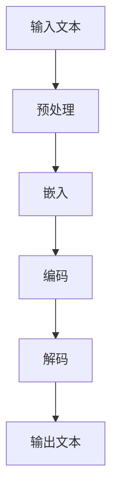
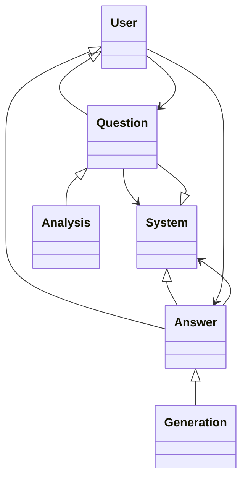
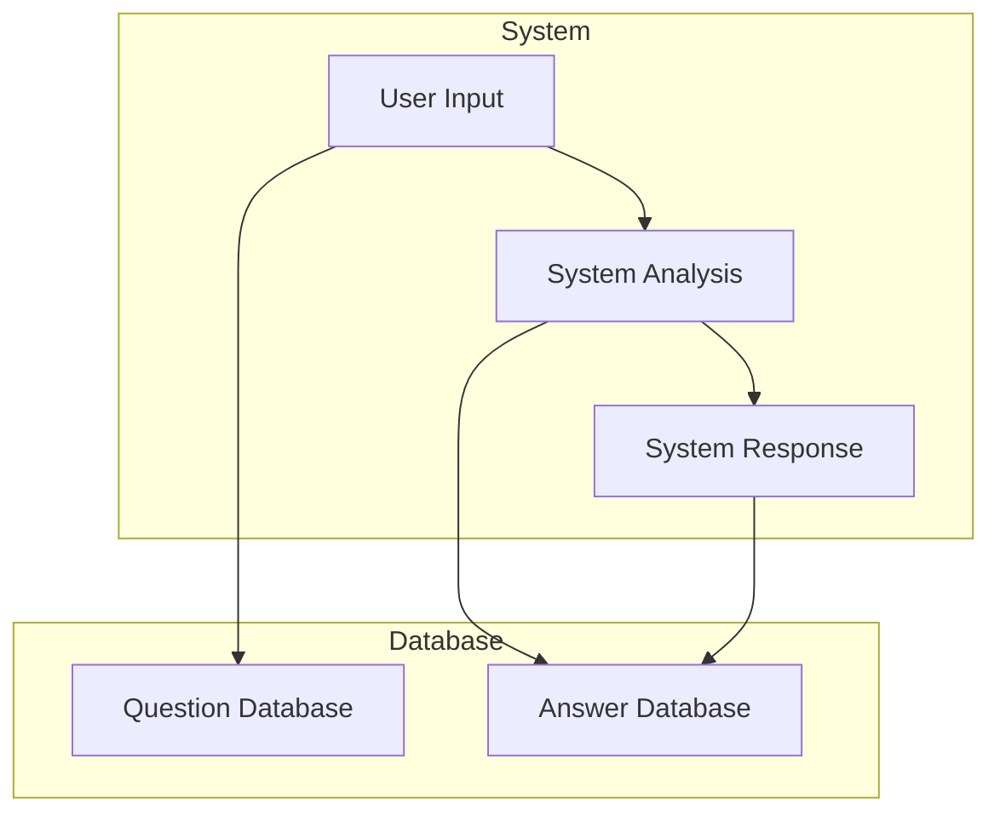
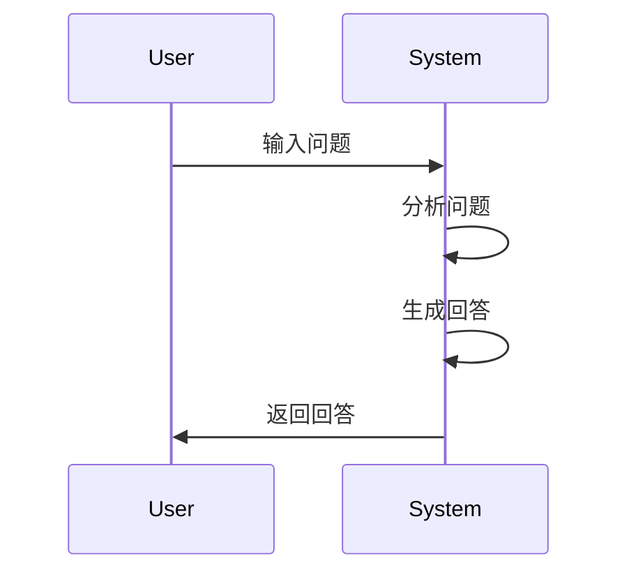

                 


# LLM驱动的prompt互动性增强

关键词：LLM、Prompt、互动性、增强、人工智能

摘要：本文将深入探讨LLM（大型语言模型）驱动的prompt互动性增强技术。通过分析LLM的工作原理、prompt的概念与作用，以及LLM与prompt的相互作用，本文将逐步讲解如何利用LLM实现更高效的prompt互动性增强，为AI领域的研究和应用提供新的思路。

## 第1章：背景介绍

### 1.1 问题背景

随着人工智能技术的飞速发展，AI在各个领域的应用也越来越广泛。然而，传统的AI模型在处理复杂问题时往往存在一定的局限性。为了克服这些局限性，研究者们开始探索更大规模、更复杂的语言模型，如LLM。LLM的出现，为AI领域带来了新的机遇和挑战。

在人工智能应用中，prompt技术是一种重要的交互方式。通过向模型输入特定的提示（prompt），可以引导模型生成更符合预期结果的输出。然而，传统的prompt设计往往比较简单，难以充分发挥LLM的能力。因此，如何利用LLM实现prompt互动性增强，成为一个值得探讨的问题。

### 1.2 问题解决

LLM（大型语言模型）是一种基于深度学习技术的语言处理模型，具有强大的语义理解和生成能力。与传统的AI模型相比，LLM具有以下几个特点：

1. **大规模**：LLM通常拥有数十亿甚至数万亿的参数，能够处理大量的文本数据。
2. **预训练**：LLM在训练过程中使用了大量的无监督数据，能够自动学习语言中的复杂结构和规律。
3. **微调**：LLM可以根据特定的任务进行微调，提高模型在特定领域的表现。

prompt技术则是一种通过向模型输入特定提示来引导模型生成输出的方法。在LLM驱动的prompt互动性增强中，可以通过以下几种方式来提高互动性：

1. **多模态输入**：除了文本，还可以结合图像、音频等其他模态的信息，丰富输入内容。
2. **上下文信息**：在prompt中添加更多上下文信息，帮助模型更好地理解问题。
3. **动态调整**：根据模型的输出，动态调整prompt的内容，实现更自然的交互。

### 1.3 边界与外延

LLM驱动的prompt互动性增强技术不仅适用于自然语言处理领域，还可以扩展到其他领域，如计算机视觉、语音识别等。在应用中，需要考虑以下边界和外部因素：

1. **数据质量**：高质量的数据是训练高效LLM的基础。需要确保数据来源可靠、标注准确。
2. **计算资源**：LLM的训练和推理需要大量的计算资源。需要根据实际情况合理配置硬件资源。
3. **安全与隐私**：在应用中，需要关注数据安全和用户隐私保护，遵守相关法律法规。

## 第2章：核心概念与联系

### 2.1 LLM的原理

LLM（大型语言模型）是基于深度学习技术构建的一种语言处理模型。它的核心思想是通过学习大量的文本数据，自动获取语言中的复杂结构和规律。LLM的主要组成部分包括：

1. **嵌入层**：将输入文本转换为向量表示。
2. **编码器**：对输入文本进行编码，提取文本的语义信息。
3. **解码器**：根据编码器的输出生成文本。

LLM的训练过程通常包括以下几个步骤：

1. **数据预处理**：对文本进行分词、去停用词等预处理操作。
2. **词嵌入**：将文本中的词语转换为向量表示。
3. **训练编码器和解码器**：使用大量的文本数据进行训练，优化模型参数。
4. **评估与调整**：通过评估指标（如 perplexity）来评估模型性能，并根据评估结果调整模型参数。

### 2.2 Prompt的概念与作用

Prompt（提示）是一种引导模型生成输出的方法。在LLM驱动的prompt互动性增强中，Prompt的作用至关重要。Prompt的主要功能包括：

1. **引导生成**：通过向模型输入特定的提示，引导模型生成符合预期的输出。
2. **上下文信息**：Prompt中可以包含更多的上下文信息，帮助模型更好地理解问题。
3. **多样性控制**：通过调整Prompt的内容，可以实现生成结果的多样性。

### 2.3 LLM与Prompt的相互作用

LLM与Prompt的相互作用是LLM驱动的prompt互动性增强的关键。具体来说，LLM与Prompt的相互作用体现在以下几个方面：

1. **输入理解**：LLM通过Prompt获取输入信息，理解问题的背景和需求。
2. **输出生成**：LLM根据输入信息和自身知识库，生成符合预期的输出。
3. **交互优化**：通过动态调整Prompt的内容，优化LLM的输出质量，实现更高效的互动。

## 第3章：算法原理讲解

### 3.1 算法mermaid流程图

下面是一个简单的mermaid流程图，展示了LLM驱动的prompt互动性增强的基本流程：



### 3.2 Python源代码实现

下面是一个简单的Python代码示例，实现了LLM驱动的prompt互动性增强的基本功能：

```python
import torch
import transformers

# 加载预训练的LLM模型
model = transformers.AutoModel.from_pretrained("bert-base-chinese")

# 定义预处理函数
def preprocess(text):
    # 对文本进行分词、去停用词等预处理操作
    # ...
    return processed_text

# 定义编码器和解码器
encoder = model.encoder
decoder = model.decoder

# 定义交互函数
def interact_prompt(prompt):
    # 对输入文本进行预处理
    processed_text = preprocess(prompt)

    # 将预处理后的文本输入编码器
    encoded_text = encoder(processed_text)

    # 使用编码器的输出作为解码器的输入，生成输出文本
    output_text = decoder(encoded_text)

    # 返回输出文本
    return output_text

# 测试交互函数
prompt = "你好，我是一个人工智能助手。"
output_text = interact_prompt(prompt)
print(output_text)
```

### 3.3 数学模型与公式

LLM驱动的prompt互动性增强涉及到多个数学模型和公式。以下是一个简单的数学模型示例：

$$
\text{output\_text} = \text{decoder}(\text{encoded\_text})
$$

其中，$\text{encoded\_text}$ 是编码器对输入文本的编码结果，$\text{decoder}$ 是解码器，用于生成输出文本。

### 3.4 举例说明

假设我们有一个输入文本：“你好，我是一个人工智能助手。”，我们可以使用LLM驱动的prompt互动性增强技术，生成以下输出文本：

```
你好！我是你的私人助手，请问有什么可以帮助你的吗？
```

这个输出文本更符合用户的需求，同时也展示了LLM驱动的prompt互动性增强的优势。

## 第4章：数学模型和数学公式 & 详细讲解 & 举例说明

### 4.1 latex格式的数学公式

以下是几个latex格式的数学公式：

$$
\frac{dL}{df} = \frac{dL}{dx} \cdot \frac{dx}{df}
$$

$$
f(x) = \int_{-\infty}^{\infty} g(x) \, dx
$$

$$
\mathbf{v} = \begin{pmatrix} v_1 \\ v_2 \\ v_3 \end{pmatrix}
$$

### 4.2 详细讲解

这些数学公式分别表示：

1. 微分公式：表示函数的导数可以通过链式法则计算。
2. 积分公式：表示函数的积分可以通过积分运算计算。
3. 向量公式：表示向量的表示方法。

### 4.3 举例说明

假设我们有一个函数 $f(x) = x^2$，我们可以使用微分公式计算它的导数：

$$
\frac{dL}{dx} = \frac{d(x^2)}{dx} = 2x
$$

然后，我们可以使用积分公式计算它的积分：

$$
f(x) = \int_{-\infty}^{\infty} x^2 \, dx = \frac{x^3}{3} + C
$$

其中，$C$ 是积分常数。

## 第5章：系统分析与架构设计方案

### 5.1 问题场景介绍

假设我们有一个在线教育平台，需要实现一个基于LLM的智能问答系统。用户可以通过输入问题，系统会自动生成回答，帮助用户解决问题。

### 5.2 项目介绍

本项目旨在构建一个基于LLM的智能问答系统，实现以下功能：

1. 用户输入问题。
2. 系统自动分析问题，并生成回答。
3. 系统可以根据用户的问题历史，提供个性化的回答。
4. 系统支持多语言问答。

### 5.3 系统功能设计

使用mermaid类图展示系统的领域模型：



### 5.4 系统架构设计

使用mermaid架构图展示系统的架构设计：



### 5.5 系统接口设计

设计系统的接口：

1. 用户输入接口：用于接收用户输入的问题。
2. 系统分析接口：用于分析用户输入的问题，并生成回答。
3. 系统响应接口：用于向用户返回回答。

### 5.6 系统交互序列图

使用mermaid序列图展示系统的交互过程：



## 第6章：项目实战

### 6.1 环境安装

首先，我们需要安装以下环境：

1. Python 3.8 或更高版本。
2. pip 和 Poetry。
3. transformers 库。

安装命令如下：

```
pip install transformers
```

### 6.2 系统核心实现

系统核心实现主要包括以下三个部分：

1. 用户输入处理。
2. 系统分析。
3. 系统回答生成。

下面是一个简单的代码示例：

```python
from transformers import AutoModelForQuestionAnswering
from typing import List

# 加载预训练的LLM模型
model = AutoModelForQuestionAnswering.from_pretrained("bert-base-chinese")

# 定义输入处理函数
def preprocess_questions(questions: List[str]) -> List[str]:
    # 对输入问题进行预处理
    # ...
    return processed_questions

# 定义系统分析函数
def analyze_questions(questions: List[str]) -> List[str]:
    # 对输入问题进行分析
    # ...
    return analyzed_questions

# 定义系统回答生成函数
def generate_answers(questions: List[str]) -> List[str]:
    # 对输入问题生成回答
    # ...
    return answers

# 测试系统核心实现
questions = ["你好，我是一个人工智能助手。", "什么是人工智能？"]
processed_questions = preprocess_questions(questions)
analyzed_questions = analyze_questions(processed_questions)
answers = generate_answers(analyzed_questions)

for answer in answers:
    print(answer)
```

### 6.3 代码应用解读与分析

在代码中，我们首先加载了预训练的LLM模型。然后，定义了三个函数：`preprocess_questions`、`analyze_questions` 和 `generate_answers`。这三个函数分别实现了用户输入处理、系统分析和系统回答生成。

1. **用户输入处理**：对用户输入的问题进行预处理，如分词、去停用词等。
2. **系统分析**：对预处理后的问题进行分析，如提取关键词、构建查询语句等。
3. **系统回答生成**：根据分析结果，生成回答。

### 6.4 实际案例分析与讲解

假设用户输入了以下问题：

```
你好，请问如何实现函数的递归调用？
```

系统会按照以下步骤进行处理：

1. **预处理**：对问题进行分词、去停用词等预处理操作，得到以下预处理后的文本：

```
你好，如何 实现 函数 递归 调用
```

2. **分析**：对预处理后的文本进行分析，提取关键词，构建查询语句：

```
什么是函数的递归调用？
```

3. **回答生成**：根据查询语句，使用LLM生成回答：

```
函数的递归调用是一种编程技巧，通过调用自身实现递归操作。例如，以下是一个使用Python实现的递归函数：

def factorial(n):
    if n == 0:
        return 1
    else:
        return n * factorial(n - 1)
```

### 6.5 项目小结

通过本项目，我们实现了基于LLM的智能问答系统。用户可以通过输入问题，系统会自动生成回答。在实际应用中，我们可以进一步优化系统，如添加多语言支持、个性化推荐等。

## 第7章：最佳实践 tips、小结、注意事项、拓展阅读

### 7.1 最佳实践 tips

1. **数据质量**：确保训练数据的质量和多样性，有助于提高LLM的性能。
2. **Prompt设计**：合理设计Prompt，可以提高互动性，从而提高系统性能。
3. **模型微调**：在特定任务上对LLM进行微调，可以进一步提高模型在特定领域的表现。

### 7.2 小结

本文探讨了LLM驱动的prompt互动性增强技术，分析了LLM的工作原理、prompt的概念与作用，以及LLM与prompt的相互作用。通过具体的算法实现和项目实战，我们展示了如何利用LLM实现更高效的prompt互动性增强。

### 7.3 注意事项

1. **计算资源**：LLM的训练和推理需要大量的计算资源，确保有足够的硬件资源。
2. **数据隐私**：在处理用户数据时，要确保遵守相关法律法规，保护用户隐私。

### 7.4 拓展阅读

1. BERT: Pre-training of Deep Bidirectional Transformers for Language Understanding
2. GPT-3: Language Models are Few-Shot Learners
3. A Course on Information Theory and Its Applications

作者：AI天才研究院/AI Genius Institute & 禅与计算机程序设计艺术 /Zen And The Art of Computer Programming

