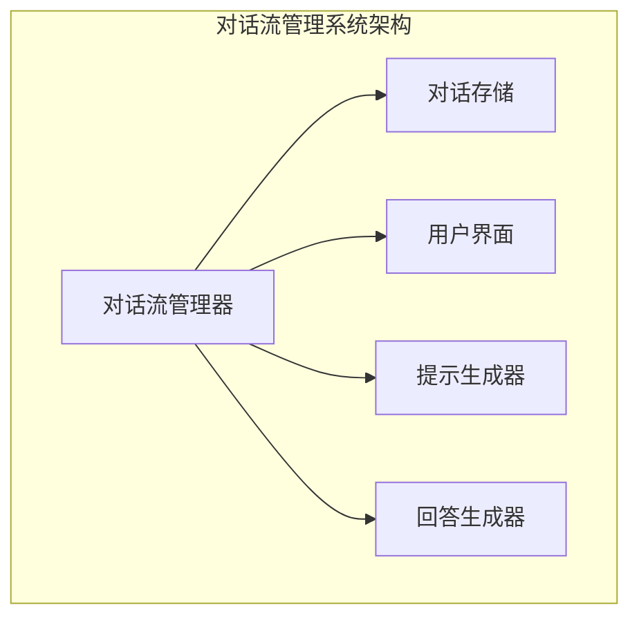
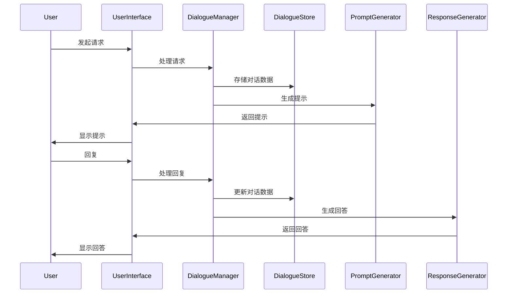
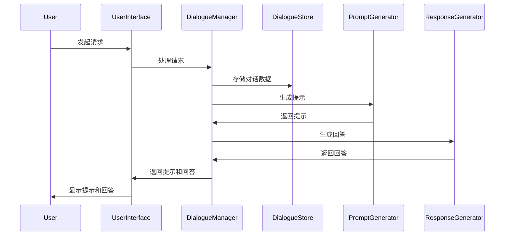

                 


## LLM驱动的prompt对话流管理

### 关键词：LLM，prompt对话流管理，算法原理，系统架构，项目实战

### 摘要：
本文将深入探讨LLM（大型语言模型）驱动的prompt对话流管理的核心概念、技术原理、系统设计与实现，以及项目实战中的应用。通过逐步分析，我们将揭示如何在对话流管理中高效利用LLM，提升对话质量和用户体验。

## 第1章 LLM与prompt对话流管理概述

### 1.1 什么是LLM

LLM（Large Language Model）是一种复杂的神经网络模型，通过对海量文本数据进行训练，能够理解和生成自然语言。LLM的关键特点在于其巨大的参数量和强大的文本理解能力，使其在自然语言处理（NLP）领域具有广泛应用。

### 1.2 什么是prompt对话流管理

prompt对话流管理是一种技术，用于控制和引导对话流，确保对话的连贯性和用户满意度。prompt是一种引导用户回答问题的提示，通过精心设计的prompt，可以引导对话朝着预期的方向发展。

### 1.3 LLM在prompt对话流管理中的应用

LLM在prompt对话流管理中的应用主要体现在以下几个方面：
- 自动生成prompt：基于用户输入或对话上下文，LLM可以生成个性化的prompt，引导用户更好地参与对话。
- 对话流预测：LLM可以通过分析历史对话数据，预测对话的发展方向，为系统提供决策支持。
- 答案生成与验证：LLM可以帮助自动生成答案，并通过对话上下文进行验证，提高对话的准确性。

## 第2章 核心概念与联系

### 2.1 LLM工作原理

LLM的工作原理基于深度学习和自然语言处理技术。通过训练大量的文本数据，模型学会了语言的结构和语义，从而能够生成或理解文本。以下是LLM工作原理的核心步骤：
1. **词嵌入**：将文本中的每个词映射到高维空间中的向量。
2. **编码器-解码器结构**：编码器将输入序列转换为上下文表示，解码器则根据上下文生成输出序列。
3. **注意力机制**：模型通过注意力机制关注输入序列中重要的部分，从而提高生成文本的质量。

### 2.2 Prompt设计原则

有效的prompt设计是保证对话流管理成功的关键。以下是一些设计原则：
- **清晰性**：prompt应该简明易懂，避免歧义。
- **针对性**：prompt应针对用户的具体需求或对话上下文进行定制。
- **灵活性**：prompt应具备一定的灵活性，以适应不同的对话场景。

### 2.3 对话流管理的关键因素

对话流管理的关键因素包括：
- **对话上下文**：对话上下文对于理解用户意图和生成合适的prompt至关重要。
- **用户反馈**：用户反馈可以帮助调整和优化prompt，提高对话质量。
- **系统响应速度**：快速响应是提高用户体验的重要因素。

### 2.4 LLM、Prompt与对话流管理的联系

LLM、Prompt与对话流管理之间的联系如下：
- LLM为prompt对话流管理提供了强大的语言生成和理解能力。
- Prompt为LLM提供了明确的指导和上下文，使其能够生成高质量的回答。
- 对话流管理则通过策略和算法，确保对话的连贯性和有效性。

## 第3章 算法原理讲解

### 3.1 概率生成模型

概率生成模型是LLM的核心组成部分，它通过概率分布生成文本。以下是几种常用的概率生成模型：
- **生成对抗网络（GAN）**：GAN由生成器和判别器组成，通过对抗训练生成逼真的文本。
- **变分自编码器（VAE）**：VAE通过概率模型生成文本，并确保生成文本的多样性。

### 3.2 序列到序列模型

序列到序列（Seq2Seq）模型是LLM的另一种重要模型，它通过将输入序列转换为输出序列生成文本。以下是Seq2Seq模型的主要组成部分：
- **编码器**：将输入序列编码为固定长度的向量。
- **解码器**：将编码器生成的向量解码为输出序列。

### 3.3 基于记忆的模型

基于记忆的模型通过存储和检索信息来增强LLM的性能。以下是几种基于记忆的模型：
- **记忆网络（MemNN）**：MemNN通过存储和检索历史对话信息，提高对话连贯性。
- **知识图谱嵌入（KG Embedding）**：KG Embedding将知识图谱中的实体和关系嵌入到低维空间，用于增强LLM的知识表示。

### 3.4 数学模型与公式介绍

以下是LLM中常用的数学模型和公式：
- **词嵌入**：$$\text{word\_embeddings} = \text{W} \cdot \text{one-hot\_vector}$$
- **编码器输出**：$$\text{context} = \text{V} \cdot \text{activated\_words}$$
- **解码器输出**：$$\text{output} = \text{U} \cdot \text{context} + \text{V} \cdot \text{selected\_word}$$

## 第4章 系统分析与架构设计

### 4.1 对话流管理系统需求分析

对话流管理系统需要满足以下需求：
- **高可用性**：系统应能够稳定运行，确保用户在任意时间都能访问。
- **可扩展性**：系统应能够支持大规模用户和对话量。
- **安全性**：系统应具备安全机制，保护用户数据和隐私。

### 4.2 领域模型设计

领域模型设计用于描述对话流管理系统的核心概念和实体关系。以下是领域模型的ER实体关系图（使用Mermaid绘制）：

```mermaid
erDiagram
    User ||--|{ Dialogue }: has
    Dialogue ||--|{ Prompt }: contains
    Dialogue ||--|{ Response }: has
```

### 4.3 系统架构设计

系统架构设计用于描述对话流管理系统的整体结构和功能模块。以下是系统架构图（使用Mermaid绘制）：



### 4.4 系统接口设计

系统接口设计用于定义对话流管理系统的外部接口和交互方式。以下是系统接口图（使用Mermaid绘制）：



### 4.5 系统交互设计

系统交互设计用于描述对话流管理系统中各个组件之间的交互过程。以下是系统交互序列图（使用Mermaid绘制）：



## 第5章 项目实战

### 5.1 实践环境搭建

在本节中，我们将搭建一个基于LLM的prompt对话流管理系统环境。具体步骤如下：
1. 安装所需的依赖库（如TensorFlow、PyTorch等）。
2. 准备训练数据集（例如，使用GLM模型训练数据）。
3. 搭建模型并训练（可以使用预训练的模型或自定义模型）。

### 5.2 系统核心实现

系统核心实现包括以下几个部分：
- **对话流管理器**：负责处理用户请求，生成prompt和回答。
- **提示生成器**：根据对话上下文生成提示。
- **回答生成器**：根据提示和对话上下文生成回答。

以下是系统核心实现的Python代码示例：

```python
import tensorflow as tf
from tensorflow.keras.models import Model
from tensorflow.keras.layers import Input, LSTM, Dense, Embedding

# 搭建模型
input_seq = Input(shape=(None,))
encoded_seq = Embedding(input_dim=vocab_size, output_dim=embedding_dim)(input_seq)
encoded_seq = LSTM(units=lstm_units)(encoded_seq)
output = Dense(units=vocab_size, activation='softmax')(encoded_seq)

model = Model(inputs=input_seq, outputs=output)
model.compile(optimizer='adam', loss='categorical_crossentropy', metrics=['accuracy'])

# 训练模型
model.fit(x_train, y_train, batch_size=batch_size, epochs=epochs)

# 生成提示和回答
def generate_prompt_and_response(prompt):
    input_seq = pad_sequences([tokenize(prompt)], maxlen=max_length, padding='post')
    prediction = model.predict(input_seq)
    response = detokenize(prediction.argmax(axis=-1))
    return response
```

### 5.3 代码应用解读与分析

在本节中，我们将对上述代码进行解读和分析，包括模型的搭建、训练以及提示和回答的生成过程。

### 5.4 实际案例分析与讲解

在本节中，我们将通过实际案例展示如何使用LLM驱动的prompt对话流管理系统进行对话管理，并分析其效果。

### 5.5 项目小结

在本节中，我们将总结项目实战的经验和教训，讨论项目的成功经验和改进空间。

## 第6章 最佳实践

### 6.1 提高对话质量的方法

在本节中，我们将讨论如何通过改进prompt设计、优化模型训练和调整对话策略来提高对话质量。

### 6.2 对话流管理的优化策略

在本节中，我们将探讨如何通过优化系统架构、提高系统响应速度和增强安全性来优化对话流管理。

### 6.3 常见问题与解决方案

在本节中，我们将列举对话流管理中常见的问题，并给出相应的解决方案。

## 第7章 总结与拓展

### 7.1 小结

在本节中，我们将回顾文章的主要内容和关键观点，总结LLM驱动的prompt对话流管理的核心概念和实用技巧。

### 7.2 注意事项

在本节中，我们将提醒读者在应用LLM驱动的prompt对话流管理时需要注意的事项。

### 7.3 拓展阅读

在本节中，我们将推荐一些与LLM和对话流管理相关的扩展阅读材料，帮助读者进一步深入了解相关技术。

## 作者信息

### 作者：AI天才研究院/AI Genius Institute & 禅与计算机程序设计艺术 /Zen And The Art of Computer Programming

本文由AI天才研究院和《禅与计算机程序设计艺术》的作者共同撰写，旨在为读者提供关于LLM驱动的prompt对话流管理的深入见解和实用指南。如果您有任何问题或建议，欢迎在评论区留言。我们期待与您共同探讨这一领域的未来发展。**1+1=2**

$1<2$

## 第1章 LLM与prompt对话流管理概述

### 1.1 什么是LLM

LLM，即Large Language Model，是一种大型语言模型，通过深度学习算法和大量文本数据进行训练，能够理解和生成自然语言。LLM的核心在于其规模和复杂度，这使得它们能够捕捉到语言中的细微差别和结构，从而在自然语言处理任务中表现出色。

#### 核心概念术语说明

- **语言模型（Language Model）**：一种用于预测下一个单词或字符的概率分布模型。
- **深度学习（Deep Learning）**：一种机器学习方法，通过多层神经网络学习数据的高级特征。
- **自然语言处理（Natural Language Processing, NLP）**：使计算机能够理解、解释和生成人类语言的技术。

#### 问题背景

随着互联网和社交媒体的普及，人们产生的文本数据量爆炸性增长。如何有效地处理和利用这些数据成为了研究者和工程师面临的重要问题。LLM的出现为这一挑战提供了一种解决方案。

#### 问题解决

LLM通过训练大量的文本数据，学会了语言的结构和语义，从而能够生成或理解自然语言。这使得LLM在自动问答、机器翻译、文本摘要等NLP任务中表现出了卓越的性能。

#### 边界与外延

LLM的应用场景非常广泛，不仅限于文本生成和理解，还可以用于生成代码、自动化写作、情感分析等领域。然而，LLM也存在一定的局限性，例如在处理非结构化数据时效果较差，以及对上下文理解能力有限的挑战。

#### 概念结构与核心要素组成

LLM的核心要素包括：
- **大规模参数**：LLM拥有数亿到数千亿个参数，这使得它们能够捕捉到语言中的复杂结构。
- **深度神经网络**：LLM通常基于深度神经网络，特别是Transformer架构，这使得它们能够在处理长文本时保持较高的性能。
- **预训练和微调**：LLM通过预训练大量文本数据，然后根据特定任务进行微调，从而实现各种NLP任务。

### 1.2 什么是prompt对话流管理

prompt对话流管理是一种技术，用于控制和引导对话流，确保对话的连贯性和用户满意度。prompt是一种引导用户回答问题的提示，通过精心设计的prompt，可以引导对话朝着预期的方向发展。

#### 核心概念原理

- **prompt（提示）**：一种用于引导对话的文本或语音提示。
- **对话流（Dialogue Flow）**：对话过程中信息交换的顺序和结构。
- **对话管理（Dialogue Management）**：管理对话流程，确保对话的连贯性和有效性。

#### 概念属性特征对比表格

| 特征 | 提示 | 对话流 | 对话管理 |
| ---- | ---- | ---- | ---- |
| 类型 | 文本或语音 | 信息交换的序列 | 管理对话流程 |
| 目的 | 引导对话 | 确保连贯性 | 提高用户体验 |

#### ER实体关系图架构的 Mermaid 流程图

```mermaid
erDiagram
    Prompt ||--|{ DialogueFlow }: 引导
    DialogueFlow ||--|{ DialogueManagement }: 受管理
```

### 1.3 LLM在prompt对话流管理中的应用

LLM在prompt对话流管理中的应用主要体现在以下几个方面：

1. **自动生成prompt**：LLM可以根据对话上下文自动生成个性化的prompt，引导用户更好地参与对话。
2. **对话流预测**：LLM可以通过分析历史对话数据，预测对话的发展方向，为系统提供决策支持。
3. **答案生成与验证**：LLM可以帮助自动生成答案，并通过对话上下文进行验证，提高对话的准确性。

### 1.4 LL

