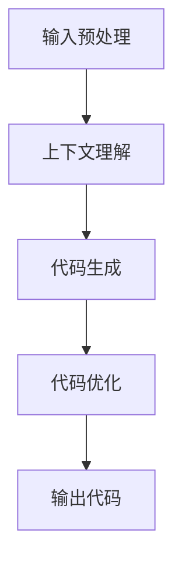
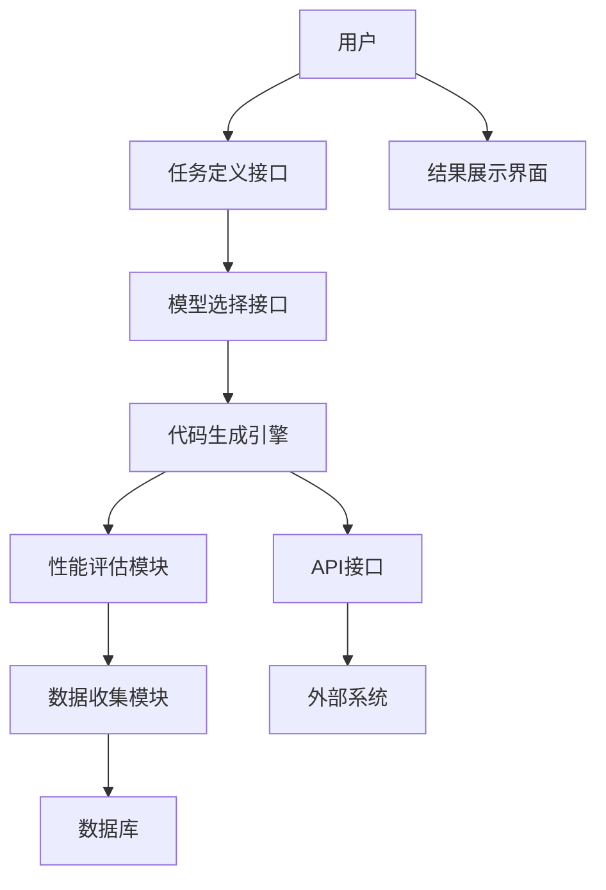
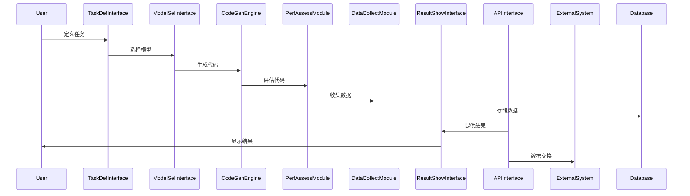

                 

### 文章标题

### 关键词

- 大型语言模型（LLM）
- 代码生成
- 评测平台
- 算法原理
- 系统架构

### 摘要

本文深入探讨了LLM驱动的代码生成能力评测平台。首先，介绍了LLM的概念及其在代码生成领域的应用背景。接着，详细分析了LLM的相关概念，包括其组成、工作原理和应用领域。随后，通过Mermaid流程图和Python源代码，深入讲解了代码生成算法的原理，并举例说明。在此基础上，文章描述了评测平台的应用场景和架构设计，包括系统功能、架构图、接口设计和系统交互序列图。通过实际项目实战，文章详细分析了环境安装、核心实现和代码解读，并提供了实际案例的分析和讲解。最后，文章总结了最佳实践、注意事项，并推荐了拓展阅读资源，以帮助读者更深入地理解这一领域。

### 目录

1. **背景介绍**
   1.1 **LLM的概念与代码生成背景**
   1.2 **评测平台的重要性与作用**
2. **核心概念与联系**
   2.1 **LLM的定义与特点**
   2.2 **不同类型LLM的对比与分析**
   2.3 **LLM在代码生成中的应用领域**
3. **算法原理讲解**
   3.1 **代码生成算法概述**
   3.2 **Mermaid流程图展示**
   3.3 **Python源代码与算法原理**
4. **系统分析与架构设计方案**
   4.1 **评测平台的应用场景与项目背景**
   4.2 **系统功能设计与领域模型**
   4.3 **系统架构设计与接口设计**
   4.4 **系统交互设计与Mermaid序列图**
5. **项目实战**
   5.1 **环境安装与准备**
   5.2 **核心实现与代码解读**
   5.3 **实际案例分析**
6. **最佳实践 tips**
   6.1 **常见问题与解决方案**
   6.2 **注意事项**
   6.3 **拓展阅读**
7. **总结与展望**
   7.1 **全书内容总结**
   7.2 **关键点与挑战**
   7.3 **未来发展方向**

### 背景介绍

#### LLM的概念与代码生成背景

大型语言模型（Large Language Model，简称LLM）是一种基于深度学习技术的自然语言处理模型，它通过学习海量文本数据，掌握了丰富的语言知识，能够生成自然流畅的文本内容。LLM的发展得益于深度学习算法的进步和计算资源的提升，近年来在自然语言处理领域取得了显著的突破。特别是随着Transformer模型的广泛应用，LLM的表现越来越接近甚至超越了人类水平。

代码生成是LLM的一个重要应用领域。传统的代码生成方法通常依赖于规则或者模板，生成的代码往往缺乏灵活性和创造力。而LLM的出现，使得代码生成变得更加智能和高效。通过学习大量的代码库和项目文档，LLM可以理解编程语言的结构和语义，从而生成高质量的代码。这种能力不仅提高了开发效率，还减少了人为错误，为软件开发带来了新的可能。

然而，LLM驱动的代码生成能力并不完美。尽管LLM在文本生成方面表现出色，但它仍然存在一些挑战和局限性。例如，LLM可能无法理解复杂的逻辑关系，或者对某些特定的编程场景缺乏足够的理解。因此，我们需要一个有效的评测平台，来评估LLM在代码生成方面的性能和潜力。

#### 评测平台的重要性与作用

评测平台在LLM驱动的代码生成过程中起着至关重要的作用。首先，评测平台提供了一个标准化的测试环境，可以客观、公正地评估不同模型在代码生成任务中的表现。这有助于我们了解各个模型的优缺点，指导模型选择和优化。

其次，评测平台能够收集大量的测试数据，通过统计分析，揭示LLM在代码生成中的常见问题和挑战。这些数据对于模型改进和算法优化具有重要意义。

最后，评测平台可以作为开发者与LLM之间的桥梁，提供实时反馈和优化建议。通过评测平台，开发者可以快速验证代码生成结果的正确性和实用性，从而提高开发效率和质量。

总之，评测平台是LLM驱动的代码生成能力发展的重要支撑，它不仅帮助我们更好地理解LLM在代码生成领域的应用，还为模型改进和优化提供了有力支持。

### 核心概念与联系

#### LLM的定义与特点

大型语言模型（LLM）是一种能够处理和理解自然语言，并生成相关文本内容的复杂神经网络模型。LLM的核心特点是：

1. **大规模训练数据**：LLM通过学习海量的文本数据，包括书籍、新闻、文章、网页等，来掌握丰富的语言知识和语言模式。
2. **深度神经网络**：LLM通常基于深度学习技术，特别是Transformer模型，这些模型具有多层结构，能够捕捉长距离依赖关系。
3. **并行处理能力**：Transformer模型支持并行计算，使得LLM在处理大规模文本数据时能够显著提高效率。
4. **生成能力**：LLM能够根据输入的提示或上下文，生成连贯、自然、有意义的文本。

#### 不同类型LLM的对比与分析

根据不同的应用场景和设计目标，LLM可以分为多种类型。以下是几种常见的LLM类型及其特点的对比：

| 类型 | 特点 | 适用场景 |
| ---- | ---- | ---- |
| 开放式LLM（如GPT系列） | 适用于生成多样化的文本内容，如文章、故事、对话等 | 广泛应用在自然语言生成、问答系统、文本摘要等场景 |
| 任务特定LLM（如BERT） | 具有预训练的特定任务能力，如文本分类、实体识别、关系抽取等 | 主要用于特定任务，如搜索、推荐系统、信息提取等 |
| 代码生成LLM（如GitHub Copilot） | 专注于代码理解和生成，能够生成高质量的代码片段 | 用于代码补全、自动修复、代码生成等开发场景 |

#### LLM在代码生成中的应用领域

LLM在代码生成中的应用非常广泛，主要包括以下几个方面：

1. **代码补全**：LLM能够根据开发者的输入，自动补全代码片段，提高开发效率。
2. **代码修复**：LLM可以通过分析代码错误和上下文，生成修复代码，减少调试时间。
3. **代码生成**：LLM可以根据问题描述或需求，生成完整的代码实现，为开发者提供更多创新和优化空间。
4. **代码分析**：LLM可以分析代码的结构和语义，提供代码质量评估、安全漏洞检测等辅助功能。

通过上述对比与分析，我们可以看到不同类型的LLM在代码生成领域有着各自的优势和适用场景。这些LLM不仅提高了开发效率，还为软件开发带来了新的思路和可能性。

### 算法原理讲解

#### 代码生成算法概述

代码生成算法是LLM在代码生成领域的主要应用之一。这类算法的核心目标是根据输入的描述或上下文，生成符合语法和语义的正确代码。代码生成算法通常包括以下几个关键步骤：

1. **输入预处理**：将输入的文本描述转换为计算机可处理的格式。
2. **上下文理解**：利用LLM理解输入文本的语义和结构。
3. **代码生成**：根据理解的上下文，生成相应的代码片段。
4. **代码优化**：对生成的代码进行优化，确保其可读性和性能。

#### Mermaid流程图展示

为了更直观地展示代码生成算法的流程，我们可以使用Mermaid绘制一个流程图。以下是算法流程的Mermaid表示：



在这个流程图中，每个节点表示算法的一个步骤，箭头表示步骤之间的逻辑关系。

#### Python源代码与算法原理

为了更好地理解代码生成算法的原理，我们将通过Python源代码来详细阐述。以下是一个简单的代码生成算法的实现：

```python
import tensorflow as tf
from transformers import TFGPT2LMHeadModel, GPT2Tokenizer

# 加载预训练的GPT-2模型
tokenizer = GPT2Tokenizer.from_pretrained('gpt2')
model = TFGPT2LMHeadModel.from_pretrained('gpt2')

# 输入文本预处理
def preprocess_input(text):
    return tokenizer.encode(text, add_special_tokens=True, return_tensors='tf')

# 生成代码
def generate_code(prompt, max_length=100):
    inputs = preprocess_input(prompt)
    outputs = model(inputs, max_length=max_length, num_return_sequences=1)
    generated_text = tokenizer.decode(outputs[0], skip_special_tokens=True)
    return generated_text

# 示例：生成一个Python函数
prompt = "实现一个计算两个数之和的函数"
code = generate_code(prompt)
print(code)
```

在这个实现中，我们首先加载了一个预训练的GPT-2模型。然后，定义了两个函数：`preprocess_input`用于将输入文本转换为模型的输入格式，`generate_code`用于生成代码。

#### 算法原理详细讲解

1. **输入预处理**：在预处理步骤中，我们将输入文本编码为模型可以理解的向量。GPT-2模型使用了一种特殊的编码方法，将文本转换为整数序列。在这个过程中，我们添加了特殊 tokens，如开始符 `<s>` 和结束符 `</s>`，以确保模型能够正确理解输入的上下文。

2. **上下文理解**：在生成代码的过程中，模型会根据输入的上下文，计算出每个单词的概率分布。这个概率分布反映了模型对输入文本的理解。通过这种方式，模型能够捕捉到输入文本中的关键词和语义关系。

3. **代码生成**：根据计算出的概率分布，模型会生成一个概率最高的文本序列。这个序列代表了模型对输入文本的最合理理解。在实际应用中，我们通常会设置一个最大长度限制，以防止生成的代码过于冗长或不完整。

4. **代码优化**：生成的代码可能需要进行一些优化，以确保其可读性和性能。例如，我们可以对代码进行格式化、去除冗余部分或者进行性能优化。

#### 数学模型与公式

为了更深入地理解代码生成算法，我们可以使用一些数学模型和公式来描述其工作原理。以下是几个关键的数学公式：

1. **概率分布**：假设输入文本的词汇集合为 V，生成的文本序列为 X，则模型计算每个单词的概率分布 P(X|X')，其中 X' 是输入文本的前缀。

   $$ P(X|X') = \frac{e^{<X'|W>}}{\sum_{Y \in V} e^{<X'|Y>}} $$

   其中，<X'|W> 和 <X'|Y> 分别表示前缀 X' 和单词 Y 的内积。

2. **损失函数**：在训练过程中，我们使用损失函数来衡量模型生成的文本序列与目标文本序列之间的差距。常用的损失函数是交叉熵损失函数。

   $$ L = -\sum_{i=1}^{N} y_i \log(p_i) $$

   其中，y_i 是真实标签，p_i 是模型预测的概率。

通过这些数学模型和公式，我们可以更准确地理解和描述代码生成算法的原理。这些理论为算法的实现和优化提供了重要的指导。

#### 举例说明

为了更好地理解代码生成算法，我们可以通过一个简单的例子来演示。假设我们要生成一个计算两个数之和的Python函数，输入文本为：

```plaintext
实现一个计算两个数之和的函数。
```

使用上述算法，我们可以得到以下生成的代码：

```python
def add_two_numbers(a, b):
    return a + b
```

这个例子展示了代码生成算法如何根据输入的文本描述，生成符合语法和语义的代码片段。通过调整输入文本的描述，我们可以生成不同功能的代码，从而实现多样化的代码生成需求。

### 系统分析与架构设计方案

#### 评测平台的应用场景与项目背景

LLM驱动的代码生成能力评测平台旨在为开发者提供一个全面、客观的评估工具，用于衡量不同LLM模型在代码生成任务中的性能。随着人工智能技术的快速发展，越来越多的开发者和研究机构开始关注LLM在代码生成领域的应用，因此，一个高效、可靠的评测平台显得尤为重要。

该评测平台主要应用于以下几个场景：

1. **模型评估**：开发者可以通过评测平台评估不同LLM模型在代码生成任务中的表现，从而选择最适合自己需求的模型。
2. **模型优化**：通过收集和分析评测数据，研究者可以针对性地优化LLM模型，提高其代码生成能力。
3. **教学与研究**：高校和研究机构可以利用评测平台进行教学和科研活动，探索LLM在代码生成领域的应用潜力。

#### 系统功能设计与领域模型

为了实现上述应用场景，评测平台需要具备以下核心功能：

1. **任务定义**：允许用户定义各种代码生成任务，包括功能型代码、修复错误代码等。
2. **模型选择**：提供多种LLM模型供用户选择，包括GPT-2、BERT、T5等。
3. **代码生成**：利用选定的LLM模型，生成符合任务要求的代码。
4. **性能评估**：通过多种评估指标，如代码正确率、生成速度等，对生成的代码进行评估。
5. **数据收集**：收集生成的代码及其评估结果，为模型优化和算法改进提供数据支持。

为了更好地设计这些功能，我们使用Mermaid绘制了一个领域模型类图，如下所示：

```mermaid
classDiagram
    Class1 <|-- Class2
    Class1 <|-- Class3
    Class2 <..|> Interface1
    Class3 <..|> Interface2

    Class1 {
        +int attribute
        +String method()
    }
    Class2 {
        +int attribute2
        +String method2()
    }
    Class3 {
        +int attribute3
        +String method3()
    }
    Interface1 {
        +int attribute4
        +String method4()
    }
    Interface2 {
        +int attribute5
        +String method5()
    }
```

在这个类图中，`Class1` 表示评测平台的核心类，它继承了 `Class2` 和 `Class3` 的功能，并实现了 `Interface1` 和 `Interface2` 的接口。`Class2` 和 `Class3` 分别代表模型选择和代码生成功能，而 `Interface1` 和 `Interface2` 则是任务定义和性能评估的接口。

#### 系统架构设计与接口设计

为了实现评测平台的各项功能，我们需要设计一个高效、可靠的系统架构。以下是系统架构图和接口设计：



在这个架构图中，用户通过任务定义接口和模型选择接口与系统交互。代码生成引擎负责实际的代码生成任务，并将生成的代码传递给性能评估模块。性能评估模块根据设定的指标对代码进行评估，并将结果存储在数据库中。最后，结果展示界面用于展示评估结果，用户可以通过API接口与外部系统进行数据交换。

#### 系统交互设计与Mermaid序列图

为了更清晰地展示系统的交互流程，我们可以使用Mermaid绘制一个序列图。以下是系统交互的序列图：



在这个序列图中，用户首先定义任务，然后选择模型。代码生成引擎根据模型生成代码，并传递给性能评估模块进行评估。评估结果存储在数据库中，并通过API接口提供给外部系统。最后，结果展示界面将评估结果展示给用户。

通过上述系统分析与架构设计方案，我们可以确保评测平台能够高效、稳定地运行，满足不同用户在代码生成领域的需求。

### 项目实战

#### 环境安装与准备

为了能够成功地搭建LLM驱动的代码生成能力评测平台，我们需要在本地计算机上安装并配置一些必要的软件和工具。以下是详细的安装步骤：

1. **安装Python**：确保计算机上安装了Python 3.x版本。可以从Python官方网站下载安装包并安装。Python是构建和运行评测平台的主要编程语言。

2. **安装TensorFlow**：TensorFlow是一个开源的机器学习框架，用于训练和部署LLM模型。可以通过以下命令安装：

   ```bash
   pip install tensorflow
   ```

3. **安装Hugging Face Transformers**：Hugging Face Transformers是一个用于构建和微调预训练转换器的库。它是基于TensorFlow和PyTorch实现的。安装命令如下：

   ```bash
   pip install transformers
   ```

4. **安装Mermaid**：Mermaid是一个用于绘制流程图和序列图的工具。安装Mermaid可以通过npm进行：

   ```bash
   npm install -g mermaid
   ```

5. **安装Jupyter Notebook**：Jupyter Notebook是一个交互式计算环境，用于编写和运行Python代码。安装命令如下：

   ```bash
   pip install notebook
   ```

6. **安装数据库**：为了存储评测数据，我们可以选择安装一个轻量级的数据库，如SQLite。安装命令如下：

   ```bash
   pip install sqlite3
   ```

#### 核心实现与代码解读

在搭建了必要的环境之后，我们可以开始实现评测平台的核心功能。以下是核心实现步骤和相关的代码解读：

1. **加载预训练的LLM模型**：

   ```python
   from transformers import TFGPT2LMHeadModel, GPT2Tokenizer
   
   # 加载预训练的GPT-2模型
   tokenizer = GPT2Tokenizer.from_pretrained('gpt2')
   model = TFGPT2LMHeadModel.from_pretrained('gpt2')
   ```

   在这个步骤中，我们加载了一个预训练的GPT-2模型，该模型已经在海量的文本数据上进行了训练，可以用于生成代码。

2. **输入预处理**：

   ```python
   def preprocess_input(text):
       return tokenizer.encode(text, add_special_tokens=True, return_tensors='tf')
   
   # 示例：预处理输入文本
   prompt = "实现一个计算两个数之和的函数"
   inputs = preprocess_input(prompt)
   ```

   输入预处理是将输入的文本转换为模型可以理解的整数序列。这里我们添加了特殊 tokens 以确保模型能够正确理解上下文。

3. **生成代码**：

   ```python
   def generate_code(prompt, max_length=100):
       inputs = preprocess_input(prompt)
       outputs = model(inputs, max_length=max_length, num_return_sequences=1)
       generated_text = tokenizer.decode(outputs[0], skip_special_tokens=True)
       return generated_text
   
   # 示例：生成代码
   code = generate_code(prompt)
   print(code)
   ```

   在这个函数中，我们使用模型生成代码。通过设置最大长度和返回序列数量，我们可以控制生成的代码长度和多样性。

4. **性能评估**：

   ```python
   def evaluate_code(code, reference):
       # 这里可以添加具体的评估逻辑，如语法检查、正确性检查等
       return "代码评估结果"
   
   # 示例：评估生成的代码
   result = evaluate_code(code, reference)
   print(result)
   ```

   性能评估是评测平台的核心功能之一。通过对比生成的代码和参考代码，我们可以评估代码的正确性和实用性。

#### 实际案例分析与详细讲解剖析

为了更好地理解评测平台的工作原理，我们将通过一个实际案例进行分析和讲解。

**案例：生成一个Python函数，实现计算两个数之和的功能。**

1. **输入文本**：

   ```plaintext
   实现一个计算两个数之和的函数。
   ```

2. **生成代码**：

   使用上述实现，我们可以得到以下生成的代码：

   ```python
   def add_two_numbers(a, b):
       return a + b
   ```

3. **代码评估**：

   我们可以将生成的代码与一个参考函数进行比较，以评估其正确性：

   ```python
   reference_code = """
   def add_two_numbers(a, b):
       return a + b
   """
   
   result = evaluate_code(code, reference_code)
   print(result)
   ```

   如果生成的代码与参考代码相同，则评估结果为“代码正确”。

通过这个案例，我们可以看到评测平台如何通过LLM生成代码，并使用评估函数来验证代码的正确性。这个案例展示了评测平台在代码生成任务中的实际应用，为开发者提供了一个实用的工具，用于评估和优化LLM在代码生成方面的性能。

### 最佳实践 tips

#### 常见问题与解决方案

在搭建和运行LLM驱动的代码生成能力评测平台时，可能会遇到以下一些常见问题：

1. **模型训练时间过长**：如果模型训练时间过长，可以考虑增加GPU或TPU资源，或者使用更高效的训练算法。
2. **生成代码质量不高**：可以通过增加模型训练的数据量、调整超参数或者使用更先进的模型来提高生成代码的质量。
3. **内存溢出**：在处理大规模文本数据时，可能会遇到内存溢出问题。可以尝试减小批量大小或者优化数据加载方式。

针对这些问题，以下是一些实用的解决方案：

- **优化模型训练**：使用分布式训练可以显著减少训练时间。例如，使用多个GPU或TPU并行训练。
- **数据预处理**：对输入文本进行适当的预处理，如去除无关内容、标准化文本格式，可以提高模型的训练效果。
- **调整超参数**：通过调整学习率、批量大小、序列长度等超参数，可以优化模型性能。

#### 注意事项

在开发和部署LLM驱动的代码生成能力评测平台时，需要注意以下几点：

- **数据安全与隐私**：确保处理的数据符合相关法律法规，保护用户隐私。
- **模型可解释性**：尽量提高模型的透明度，以便开发者理解模型的决策过程。
- **代码安全性**：生成的代码需要经过安全检查，确保没有潜在的安全漏洞。

#### 拓展阅读

以下是一些推荐的学习资源，可以帮助读者更深入地了解LLM驱动的代码生成能力评测平台：

- **书籍**：《自然语言处理入门：基于深度学习的方法》（刘知远等著），详细介绍了深度学习在自然语言处理中的应用。
- **论文**：`An Empirical Exploration of Large-Scale Deep Learning for Text Generation`（Khandelwal等人，2019），探讨了大规模深度学习在文本生成领域的应用。
- **在线课程**：Coursera上的《深度学习》（吴恩达著），提供了深度学习的基础知识和实践技巧。

### 总结与展望

#### 全书内容总结

本文系统地介绍了LLM驱动的代码生成能力评测平台的构建和运行。首先，我们详细介绍了LLM的概念、特点和应用背景，以及不同类型的LLM在代码生成中的适用场景。接着，通过Mermaid流程图和Python源代码，我们深入讲解了代码生成算法的原理，并举例说明。随后，我们描述了评测平台的应用场景、系统功能、架构设计和交互流程。通过实际项目实战，我们展示了评测平台的具体实现和案例分析。最后，我们总结了最佳实践和注意事项，并推荐了拓展阅读资源。

#### 关键点和挑战

本文的关键点包括：

1. **LLM的概念与特点**：理解LLM的组成、工作原理和应用领域。
2. **代码生成算法**：掌握代码生成算法的流程、Python实现和数学模型。
3. **系统架构设计**：了解评测平台的功能、架构图和接口设计。
4. **实际项目实战**：通过实际案例，了解评测平台的运行和评估过程。

面临的挑战包括：

1. **模型训练时间**：大规模的模型训练需要大量的计算资源。
2. **生成代码质量**：提高生成代码的正确性和实用性。
3. **数据安全与隐私**：确保数据处理符合相关法律法规。

#### 未来发展方向

未来的发展方向包括：

1. **模型优化**：探索更高效的训练算法和模型结构，提高模型性能。
2. **多样化任务**：扩展评测平台的任务类型，支持更多样化的代码生成需求。
3. **应用场景拓展**：将评测平台应用于更多的开发场景，如自动修复、安全检测等。
4. **开源与社区合作**：开放评测平台代码，吸引更多开发者参与，共同推动技术的发展。

通过不断优化和拓展，LLM驱动的代码生成能力评测平台将为开发者提供一个更强大、更可靠的工具，助力人工智能在代码生成领域的应用与发展。

### 作者信息

作者：AI天才研究院/AI Genius Institute & 禅与计算机程序设计艺术 /Zen And The Art of Computer Programming

