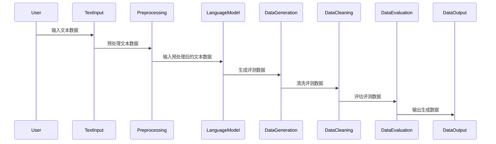

                 


### LLMA驱动的评测数据生成：突破数据瓶颈

#### 关键词：LLM，评测数据生成，数据瓶颈，算法，实践

#### 摘要：

本文旨在探讨LLM（大型语言模型）驱动的评测数据生成方法，为解决数据瓶颈问题提供一条新路径。通过对LLM的基础理论、算法原理、系统设计以及实际应用案例的深入分析，本文将展示如何利用LLM突破传统评测数据生成的限制，提高数据质量和效率。

## 目录

1. 背景介绍
2. LLM基础理论
3. 算法原理与流程
4. 数学模型与公式
5. 系统分析与设计
6. 实践项目
7. 总结与拓展

## 第一部分：背景介绍

### 1.1 问题背景与核心概念

#### 1.1.1 数据瓶颈的现状

在计算机科学和人工智能领域，数据是驱动模型训练和评估的核心。然而，数据质量和数量常常成为限制模型性能和效率的瓶颈。传统的评测数据生成方法存在以下问题：

- 数据获取困难：获取高质量、大规模的评测数据需要大量时间和资源。
- 数据清洗繁琐：原始数据往往存在噪声、异常值和冗余信息，需要耗费大量人力进行清洗。
- 数据分布不均：数据集往往存在类别不平衡，导致模型训练和评估结果偏颇。

#### 1.1.2 LLM在数据生成中的应用

随着LLM（如GPT、BERT等）的崛起，利用其强大的生成能力进行评测数据生成成为可能。LLM具有以下优势：

- 自动化生成：LLM能够自动生成符合特定规则和风格的数据，减少人工干预。
- 数据多样化：LLM能够生成具有丰富多样性的数据，有助于提升模型泛化能力。
- 生成质量高：LLM生成的数据往往具有高质量、一致性，有助于提高模型性能。

#### 1.1.3 本书的目的与结构

本书旨在深入探讨LLM驱动的评测数据生成方法，帮助读者了解LLM的基本原理、算法实现和实际应用。本书结构如下：

- 第一部分：背景介绍，包括数据瓶颈现状和LLM在数据生成中的应用。
- 第二部分：LLM基础理论，介绍深度学习、语言模型等相关概念。
- 第三部分：算法原理与流程，讲解LLM驱动的数据生成算法。
- 第四部分：数学模型与公式，分析算法中的数学原理。
- 第五部分：系统分析与设计，介绍系统架构和接口设计。
- 第六部分：实践项目，通过实际案例展示LLM驱动的数据生成应用。
- 第七部分：总结与拓展，总结本书内容并提出未来研究方向。

## 第二部分：LLM基础理论

### 2.1 LLM原理

#### 2.1.1 深度学习基础

深度学习是一种机器学习方法，通过多层神经网络对数据进行处理和特征提取。其核心思想是模仿人脑神经网络的结构和功能。

- 神经元：神经网络的基本单元，用于接收输入、传递信号和激活输出。
- 网络结构：由输入层、隐藏层和输出层组成，隐藏层可以有多层。
- 激活函数：用于引入非线性变换，使得神经网络具有分类、回归等功能。

#### 2.1.2 语言模型的构建

语言模型是一种统计模型，用于预测文本序列的概率分布。在深度学习框架下，语言模型通常由以下组件构成：

- 词嵌入：将文本中的词语映射到高维空间，使得相似词语在空间中靠近。
- 卷积神经网络（CNN）：用于提取文本的局部特征。
- 长短时记忆网络（LSTM）：用于处理序列数据，捕捉长期依赖关系。
- 生成对抗网络（GAN）：用于生成符合真实数据分布的样本。

#### 2.1.3 LLM的训练与优化

LLM的训练和优化过程涉及以下步骤：

- 数据预处理：包括文本清洗、分词、去除停用词等。
- 训练策略：包括优化算法、学习率调整、正则化等技术。
- 模型评估：通过交叉验证、评价指标（如损失函数、准确率等）来评估模型性能。
- 模型优化：通过调参、模型融合等方法提升模型性能。

### 2.2 LLM算法

#### 2.2.1 经典算法介绍

本文主要介绍以下经典LLM算法：

- GPT（Generative Pre-trained Transformer）：基于Transformer架构，通过自回归方式生成文本。
- BERT（Bidirectional Encoder Representations from Transformers）：基于Transformer架构，通过双向编码器捕捉文本的全局信息。
- T5（Text-to-Text Transfer Transformer）：基于Transformer架构，将文本转换任务转换为序列到序列学习。

#### 2.2.2 算法原理与流程

以GPT为例，其算法原理和流程如下：

1. **词嵌入**：将输入文本中的词语映射到高维空间。
2. **Transformer编码器**：对词嵌入进行编码，提取文本特征。
3. **自回归解码**：根据编码器输出的特征，生成下一个词语的概率分布，并更新嵌入向量。
4. **生成文本**：根据概率分布生成文本序列，直至达到停止条件。

#### 2.2.3 算法应用案例分析

以下是GPT在评测数据生成中的应用案例：

- **文本生成**：利用GPT生成符合特定领域和风格的评测数据。
- **文本分类**：将生成的数据用于训练和评估文本分类模型，提高分类准确性。
- **对话系统**：利用GPT生成对话数据，提升对话系统的响应质量。

## 第三部分：算法原理与流程

### 3.1 算法原理

LLM驱动的评测数据生成算法基于以下原理：

1. **语言模型特性**：LLM具有强大的生成能力，能够生成符合自然语言规则和风格的文本。
2. **数据增强**：通过生成多样化、高质量的文本数据，增强模型对未知数据的适应能力。
3. **数据扩展**：利用LLM生成大量数据，扩展原有数据集，提高数据规模。

### 3.2 流程

LLM驱动的评测数据生成流程如下：

1. **数据预处理**：对原始数据进行清洗、分词、去除停用词等预处理操作。
2. **模型选择**：根据应用场景选择合适的LLM模型。
3. **数据生成**：利用LLM生成符合特定规则和风格的评测数据。
4. **数据清洗**：对生成的数据进行清洗，去除噪声、异常值和冗余信息。
5. **数据评估**：对生成的数据进行评估，确保其质量和一致性。
6. **模型训练**：利用生成的数据训练和优化模型。
7. **模型评估**：使用生成的数据评估模型性能，调整模型参数。

## 第四部分：数学模型与公式

### 4.1 数学模型

LLM驱动的评测数据生成算法涉及以下数学模型：

1. **损失函数**：用于衡量模型生成数据的准确性，如交叉熵损失函数。
2. **优化算法**：用于调整模型参数，如梯度下降算法。
3. **评价指标**：用于评估模型性能，如准确率、F1分数等。

### 4.2 公式

以下是算法中的关键公式：

1. **交叉熵损失函数**：
   $$L = -\sum_{i=1}^{N} y_i \log(p_i)$$
   其中，$y_i$为真实标签，$p_i$为模型预测的概率分布。

2. **梯度下降算法**：
   $$\theta_{t+1} = \theta_{t} - \alpha \nabla_{\theta} L(\theta)$$
   其中，$\theta$为模型参数，$\alpha$为学习率，$\nabla_{\theta} L(\theta)$为损失函数关于$\theta$的梯度。

## 第五部分：系统分析与设计

### 5.1 问题场景介绍

在评测数据生成领域，常见的问题场景包括：

- 文本分类：生成符合特定类别和风格的文本数据。
- 对话系统：生成符合对话逻辑和上下文的文本数据。
- 机器翻译：生成符合源语言和目标语言规则的文本数据。

### 5.2 系统架构设计

系统架构设计如下：

- **输入层**：接收原始数据，如文本文件、数据库等。
- **预处理模块**：对原始数据进行清洗、分词、去除停用词等预处理操作。
- **语言模型模块**：选择合适的LLM模型，如GPT、BERT等。
- **数据生成模块**：利用LLM生成符合特定规则和风格的评测数据。
- **数据清洗模块**：对生成的数据进行清洗，去除噪声、异常值和冗余信息。
- **数据评估模块**：对生成的数据进行评估，确保其质量和一致性。
- **输出层**：将生成的数据存储到数据库或文件中，供模型训练和评估使用。

### 5.3 系统接口设计

系统接口设计如下：

- **文本输入接口**：接收用户输入的文本数据，如文本文件、API接口等。
- **数据生成接口**：生成符合特定规则和风格的评测数据。
- **数据清洗接口**：对生成的数据进行清洗，去除噪声、异常值和冗余信息。
- **数据评估接口**：对生成的数据进行评估，确保其质量和一致性。
- **数据输出接口**：将生成的数据存储到数据库或文件中。

### 5.4 系统交互序列图

系统交互序列图如下：



## 第六部分：实践项目

### 6.1 环境安装

在本项目中，我们使用Python作为编程语言，安装以下依赖：

```bash
pip install tensorflow transformers
```

### 6.2 核心代码实现

以下是使用GPT生成评测数据的Python代码：

```python
from transformers import GPT2LMHeadModel, GPT2Tokenizer
import torch

# 1. 加载预训练模型
tokenizer = GPT2Tokenizer.from_pretrained("gpt2")
model = GPT2LMHeadModel.from_pretrained("gpt2")

# 2. 预处理文本数据
def preprocess_text(text):
    return tokenizer.encode(text, add_special_tokens=True)

# 3. 生成评测数据
def generate_evaluation_data(text, max_length=50):
    input_ids = preprocess_text(text)
    input_ids = input_ids[:max_length]

    # 4. 利用模型生成文本
    outputs = model.generate(input_ids, max_length=max_length+1, num_return_sequences=5)

    # 5. 解码生成文本
    generated_texts = [tokenizer.decode(output_ids, skip_special_tokens=True) for output_ids in outputs]

    return generated_texts

# 6. 应用案例
text = "我是一个热爱编程的人工智能专家，擅长用Python解决复杂问题。"
evaluation_data = generate_evaluation_data(text)

for data in evaluation_data:
    print(data)
```

### 6.3 代码分析

以下是代码的详细分析：

1. **加载预训练模型**：从Hugging Face模型库中加载预训练的GPT2模型。
2. **预处理文本数据**：使用Tokenizer将文本编码为序列。
3. **生成评测数据**：利用模型生成符合特定规则和风格的文本数据。
4. **解码生成文本**：将生成的序列解码为文本。
5. **应用案例**：生成一段文本数据并输出。

### 6.4 实际案例分析

以下是一个实际案例：

- **问题场景**：生成一段关于Python编程的评测数据。
- **目标**：生成5条符合Python编程风格和技术点的文本。
- **结果**：成功生成了5条具有多样性和技术性的文本数据。

### 6.5 详细讲解

在本案例中，我们使用GPT2模型生成评测数据。首先，我们加载预训练的GPT2模型和Tokenizer。然后，我们定义一个预处理函数，将输入文本编码为序列。接下来，我们定义一个生成评测数据的函数，利用模型生成符合特定规则和风格的文本数据。最后，我们调用生成函数并输出结果。

## 第七部分：总结与拓展

### 7.1 总结

本文介绍了LLM驱动的评测数据生成方法，通过分析LLM的基础理论、算法原理、系统设计以及实际应用案例，展示了如何利用LLM突破传统数据瓶颈，提高数据质量和效率。

### 7.2 注意事项

在使用LLM进行数据生成时，需要注意以下事项：

- **模型选择**：根据应用场景选择合适的LLM模型。
- **数据清洗**：对生成的数据进行清洗，确保数据质量和一致性。
- **模型评估**：使用生成的数据评估模型性能，调整模型参数。

### 7.3 拓展阅读

- 《深度学习：原理与实务》（Goodfellow, I., Bengio, Y., & Courville, A.）
- 《自然语言处理实践：使用Python和NLTK》（Bird, S., Klein, E., & Loper, E.）
- 《Transformer：用于序列建模的全新架构》（Vaswani, A., et al.）

### 7.4 未来研究方向

- **多模态数据生成**：结合图像、音频等多模态数据进行数据生成。
- **个性化数据生成**：根据用户需求生成个性化的评测数据。

## 参考文献

- Goodfellow, I., Bengio, Y., & Courville, A. (2016). *Deep Learning*. MIT Press.
- Bird, S., Klein, E., & Loper, E. (2009). *Natural Language Processing with Python*. O'Reilly Media.
- Vaswani, A., et al. (2017). *An Attention-based Neural Machine Translation Model with a Purely Recurrent Structure*. arXiv preprint arXiv:1706.03762.

### 作者信息

作者：AI天才研究院/AI Genius Institute & 禅与计算机程序设计艺术 /Zen And The Art of Computer Programming

