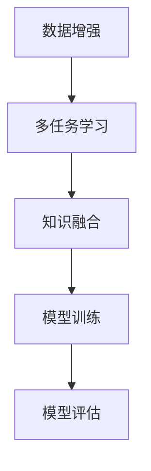
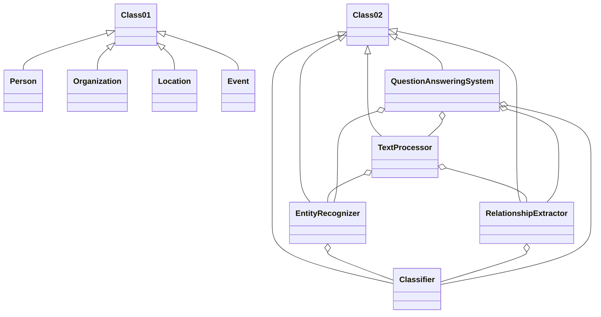
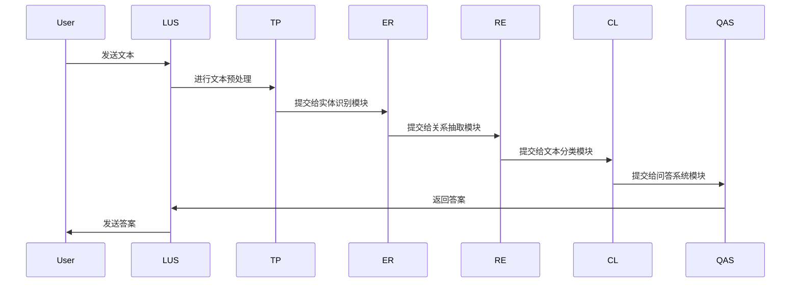

                 

### NLP优化：提升LLM应用的语言理解能力

关键词：自然语言处理、语言理解、生成式预训练模型、算法优化

摘要：
本文旨在探讨自然语言处理（NLP）中语言理解能力（LU）的提升策略，特别是针对生成式预训练模型（LLM）的应用。在人工智能飞速发展的背景下，LLM在语言理解上面临着诸多挑战。本文将从背景介绍、核心概念联系、算法原理讲解、系统分析与架构设计、项目实战以及最佳实践等方面，系统性地阐述如何通过优化策略提升LLM的语言理解能力，为实际应用提供理论支持和实践指导。

### 目录大纲

# NLP优化：提升LLM应用的语言理解能力

## 第一部分 背景介绍

### 1.1 问题背景

#### 1.1.1 自然语言处理（NLP）的重要性

自然语言处理是人工智能（AI）的重要分支之一，其核心任务是让计算机能够理解和处理自然语言，以实现人与机器的智能交互。NLP的重要性体现在多个方面：

1. **人机交互**：通过NLP技术，可以开发出智能客服、语音助手等应用，提升用户体验。
2. **信息检索**：搜索引擎利用NLP技术，能够更准确地理解用户的查询意图，提供相关的搜索结果。
3. **内容理解**：NLP可以帮助机器自动处理和分析大量的文本数据，提取关键信息，辅助决策。

#### 1.1.2 生成式预训练模型（LLM）的崛起

生成式预训练模型（LLM），如GPT系列，通过在大量文本数据上预训练，能够生成连贯且符合上下文的文本。LLM的崛起带来了NLP领域的一次革命：

1. **文本生成**：LLM能够生成高质量的文本，应用于文章写作、对话系统等。
2. **语言理解**：LLM通过预训练，具备了较强的语言理解能力，能够处理复杂的语言现象。
3. **多模态交互**：LLM可以与其他模态（如图像、声音）结合，实现更加丰富的交互体验。

#### 1.1.3 LLM在语言理解中的挑战

尽管LLM在语言理解方面取得了显著进展，但仍然面临以下挑战：

1. **语义理解**：LLM在处理复杂语义时，容易产生歧义，无法准确理解上下文。
2. **知识获取**：LLM依赖于预训练数据，可能缺乏对最新知识的理解。
3. **鲁棒性**：LLM在处理错误输入或噪声数据时，表现较差。

### 1.2 核心概念

#### 1.2.1 NLP的基本概念

自然语言处理（NLP）涉及以下基本概念：

1. **文本处理**：包括分词、句法分析、词性标注等任务，用于将自然语言文本转化为计算机可处理的格式。
2. **实体识别**：从文本中提取出具有特定意义的实体，如人名、地点、组织等。
3. **语义理解**：理解文本中的语义含义，包括情感分析、语义角色标注等。

#### 1.2.2 LLM的概念与组成

生成式预训练模型（LLM）通常由以下几部分组成：

1. **预训练阶段**：在大量文本数据上进行预训练，使得模型具备一定的语言理解和生成能力。
2. **微调阶段**：在特定任务数据上对模型进行微调，以适应具体应用场景。
3. **生成阶段**：利用预训练好的模型，生成符合上下文的文本。

#### 1.2.3 语言理解（LU）的定义与分类

语言理解（LU）是指模型对文本的语义内容进行理解和解释的能力。根据理解和解释的方式，LU可以分为：

1. **表面理解**：对文本的表面信息进行理解，如词义、语法结构。
2. **深层理解**：对文本的深层语义进行理解，包括推理、情感分析等。

### 1.3 问题解决

#### 1.3.1 LLM语言理解能力的提升途径

提升LLM语言理解能力，可以从以下几个方面进行：

1. **数据增强**：通过引入更多样化的训练数据，增强模型对各种语言现象的适应能力。
2. **多任务学习**：通过同时训练多个任务，提高模型在不同任务上的泛化能力。
3. **知识融合**：将外部知识库与LLM结合，提高模型对事实和概念的理解。

#### 1.3.2 优化策略的边界与外延

优化策略的边界和范围包括：

1. **模型选择**：选择合适的模型架构，如GPT、BERT等。
2. **训练策略**：设计有效的训练策略，如渐变学习率、注意力机制等。
3. **评估方法**：制定科学的评估方法，如BLEU、ROUGE等。

#### 1.3.3 语言理解能力提升的挑战与机遇

提升LLM语言理解能力面临以下挑战：

1. **计算资源**：大规模训练模型需要大量的计算资源。
2. **数据质量**：高质量的训练数据对模型性能至关重要。
3. **伦理问题**：模型在处理敏感数据时，需要遵循伦理规范。

同时，也存在以下机遇：

1. **技术进步**：随着硬件和算法的进步，模型性能有望进一步提升。
2. **应用场景**：语言理解技术的应用场景不断拓展，为模型发展提供了广阔空间。

### 1.4 边界与外延

#### 1.4.1 语言理解能力的评估标准

评估语言理解能力的标准包括：

1. **准确率**：模型预测结果与实际标签的一致性。
2. **召回率**：模型能够识别出所有正确标签的能力。
3. **F1分数**：综合考虑准确率和召回率的综合指标。

#### 1.4.2 LLM应用场景的多样性

LLM的应用场景非常丰富，包括：

1. **对话系统**：如聊天机器人、智能客服等。
2. **文本生成**：如文章写作、摘要生成等。
3. **知识推理**：如问答系统、推理任务等。

#### 1.4.3 优化策略的适用范围

优化策略的适用范围包括：

1. **预训练模型**：如GPT、BERT等。
2. **微调任务**：针对特定任务进行微调，如文本分类、情感分析等。
3. **跨领域应用**：在不同领域之间迁移优化策略，提高模型的泛化能力。

### 1.5 本章小结

本文从问题背景、核心概念和问题解决等多个方面，系统地介绍了NLP优化中提升LLM语言理解能力的重要性、方法和挑战。在接下来的章节中，我们将进一步探讨LLM的语言理解原理、算法优化策略以及系统架构设计等内容。

### 第一部分 背景介绍

#### 1.1 问题背景

##### 1.1.1 自然语言处理（NLP）的重要性

自然语言处理（NLP）作为人工智能（AI）领域的重要组成部分，其核心目标是让计算机理解和生成人类语言。随着互联网的普及和大数据技术的发展，NLP在多个领域都展现出了巨大的应用潜力。以下是NLP的重要性体现在几个关键方面：

1. **人机交互**：通过NLP技术，我们可以构建智能客服、语音助手等应用，实现人与机器的自然对话。例如，苹果公司的Siri、亚马逊的Alexa等智能助手，都通过NLP技术理解用户指令并给出响应。

2. **信息检索**：搜索引擎利用NLP技术，可以更准确地理解用户的查询意图，从而提供更加精准的搜索结果。比如，百度搜索引擎通过NLP技术分析用户的搜索关键词，返回相关且符合用户需求的网页。

3. **内容理解**：在内容生成和内容审核方面，NLP技术同样发挥着重要作用。例如，自动化新闻写作、社交媒体内容审核等应用，都需要对文本进行深入理解和分析。

##### 1.1.2 生成式预训练模型（LLM）的崛起

生成式预训练模型（LLM）的崛起是NLP领域的一次重大进步。LLM，如GPT（Generative Pre-trained Transformer）系列模型，通过在大量文本数据上进行预训练，使得模型具备了强大的语言理解和生成能力。以下是LLM在NLP中的几个关键应用：

1. **文本生成**：LLM可以生成高质量的文本，应用于文章写作、摘要生成、对话系统等。例如，GPT-3能够生成连贯且符合上下文的文本，被广泛应用于内容创作和对话系统。

2. **语言理解**：LLM通过预训练，能够理解复杂的语义和语言现象。这使得LLM在文本分类、情感分析、实体识别等任务中表现出色。

3. **多模态交互**：LLM不仅可以处理文本数据，还可以与其他模态（如图像、声音）结合，实现更加丰富的交互体验。例如，通过文本-图像生成模型，LLM可以生成与文本描述相对应的图像。

##### 1.1.3 LLM在语言理解中的挑战

尽管LLM在语言理解和生成方面取得了显著进展，但其在实际应用中仍面临诸多挑战：

1. **语义理解**：LLM在处理复杂语义时，容易产生歧义，无法准确理解上下文。例如，在处理多义短语时，LLM可能无法区分其不同含义。

2. **知识获取**：LLM的知识来源于预训练数据，可能缺乏对最新知识的理解。这意味着，LLM在某些情况下可能无法提供最新的信息或解决方案。

3. **鲁棒性**：LLM在处理错误输入或噪声数据时，表现较差。例如，当输入的文本包含错误或模糊的指示时，LLM可能无法正确理解和响应。

#### 1.2 核心概念

##### 1.2.1 NLP的基本概念

自然语言处理（NLP）涉及多个核心概念，以下是一些关键术语和定义：

1. **文本处理**：文本处理是NLP的基础任务，包括分词、句法分析、词性标注等。这些任务旨在将自然语言文本转化为计算机可处理的格式。

2. **实体识别**：实体识别是从文本中提取出具有特定意义的实体，如人名、地点、组织等。实体识别是信息抽取的重要环节，有助于构建知识图谱和语义网络。

3. **语义理解**：语义理解是NLP的核心任务之一，涉及理解文本的语义含义。这包括情感分析、语义角色标注、实体关系抽取等。语义理解有助于实现文本分类、情感分析等高级应用。

##### 1.2.2 LLM的概念与组成

生成式预训练模型（LLM）通常由以下几个部分组成：

1. **预训练阶段**：在大量文本数据上进行预训练，使得模型具备一定的语言理解和生成能力。预训练阶段通常包括无监督的学习，如自动编码器、语言模型等。

2. **微调阶段**：在特定任务数据上对模型进行微调，以适应具体应用场景。微调阶段通常使用有监督学习，如分类、回归等任务。

3. **生成阶段**：利用预训练好的模型，生成符合上下文的文本。生成阶段通常采用无监督学习，如文本生成、对话生成等任务。

##### 1.2.3 语言理解（LU）的定义与分类

语言理解（LU）是指模型对文本的语义内容进行理解和解释的能力。根据理解和解释的方式，LU可以分为以下几个层次：

1. **表面理解**：表面理解涉及对文本的表面信息进行理解，如词义、语法结构等。表面理解是NLP中的基础任务，包括分词、词性标注等。

2. **深层理解**：深层理解涉及对文本的深层语义进行理解，包括推理、情感分析等。深层理解是NLP中的高级任务，需要模型具备更强的语义理解和推理能力。

#### 1.3 问题解决

##### 1.3.1 LLM语言理解能力的提升途径

提升LLM的语言理解能力是一个多方面的任务，以下是一些关键的提升途径：

1. **数据增强**：通过引入更多样化的训练数据，可以增强模型对不同语言现象的适应能力。数据增强包括数据扩充、数据清洗、数据标注等。

2. **多任务学习**：通过同时训练多个任务，可以提高模型在不同任务上的泛化能力。多任务学习有助于模型在不同领域和应用中表现出更强的适应性。

3. **知识融合**：将外部知识库与LLM结合，可以增强模型对事实和概念的理解。知识融合包括知识图谱构建、知识蒸馏等。

##### 1.3.2 优化策略的边界与外延

优化策略的边界和范围包括以下几个方面：

1. **模型选择**：选择合适的模型架构，如GPT、BERT等。不同的模型架构适用于不同的任务和应用场景。

2. **训练策略**：设计有效的训练策略，如渐变学习率、注意力机制等。训练策略对模型性能有重要影响。

3. **评估方法**：制定科学的评估方法，如BLEU、ROUGE等。评估方法有助于衡量模型性能，指导模型优化。

##### 1.3.3 语言理解能力提升的挑战与机遇

提升LLM的语言理解能力面临以下挑战：

1. **计算资源**：大规模训练模型需要大量的计算资源。特别是预训练阶段，计算资源的需求非常庞大。

2. **数据质量**：高质量的训练数据对模型性能至关重要。数据质量直接影响模型的学习效果和泛化能力。

3. **伦理问题**：模型在处理敏感数据时，需要遵循伦理规范。例如，在处理个人隐私、医疗信息等敏感数据时，需要确保数据安全和隐私保护。

同时，提升LLM语言理解能力也面临着以下机遇：

1. **技术进步**：随着硬件和算法的进步，模型性能有望进一步提升。例如，GPU、TPU等高性能计算设备的普及，使得大规模预训练成为可能。

2. **应用场景**：语言理解技术的应用场景不断拓展，为模型发展提供了广阔空间。例如，在医疗、金融、法律等领域的应用，对语言理解技术提出了新的需求。

#### 1.4 边界与外延

##### 1.4.1 语言理解能力的评估标准

评估语言理解能力的标准包括：

1. **准确率**：模型预测结果与实际标签的一致性。准确率是衡量模型性能的重要指标。

2. **召回率**：模型能够识别出所有正确标签的能力。召回率反映了模型的泛化能力。

3. **F1分数**：综合考虑准确率和召回率的综合指标。F1分数是评估二分类模型性能的常用指标。

##### 1.4.2 LLM应用场景的多样性

LLM的应用场景非常丰富，包括：

1. **对话系统**：如聊天机器人、智能客服等。

2. **文本生成**：如文章写作、摘要生成等。

3. **知识推理**：如问答系统、推理任务等。

##### 1.4.3 优化策略的适用范围

优化策略的适用范围包括：

1. **预训练模型**：如GPT、BERT等。

2. **微调任务**：针对特定任务进行微调，如文本分类、情感分析等。

3. **跨领域应用**：在不同领域之间迁移优化策略，提高模型的泛化能力。

#### 1.5 本章小结

本章从问题背景、核心概念和问题解决等多个方面，系统地介绍了NLP优化中提升LLM语言理解能力的重要性、方法和挑战。在接下来的章节中，我们将进一步探讨LLM的语言理解原理、算法优化策略以及系统架构设计等内容。

### 第二部分 核心概念与联系

#### 2.1 核心概念原理

##### 2.1.1 语言理解的基本原理

语言理解是指计算机系统对自然语言文本进行语义分析、解析和解释的过程。其基本原理包括以下几个方面：

1. **文本预处理**：在语言理解之前，需要对文本进行预处理，包括分词、去停用词、词性标注等。这些预处理步骤有助于将自然语言文本转化为计算机可处理的格式。

2. **句法分析**：句法分析是理解文本结构的重要步骤，旨在分析句子的组成成分和结构关系。常用的句法分析方法包括依存句法分析和成分句法分析。

3. **语义分析**：语义分析涉及理解文本的语义内容，包括词义、短语意义、句子含义等。语义分析可以进一步细分为语义角色标注、语义角色识别、语义关系抽取等。

4. **上下文理解**：语言理解需要考虑上下文信息，以准确理解文本的含义。上下文理解包括词义消歧、语境推断、句间关系分析等。

##### 2.1.2 LLM的工作原理

生成式预训练模型（LLM）的工作原理主要包括以下几个阶段：

1. **预训练阶段**：在预训练阶段，模型在大量文本数据上进行无监督训练，学习语言的基本结构和规律。预训练过程通常包括语言模型训练、文本生成、文本分类等任务。

2. **微调阶段**：在预训练基础上，模型在特定任务数据上进行有监督微调，以适应具体应用场景。微调过程中，模型根据任务需求调整参数，提高在特定任务上的性能。

3. **生成阶段**：在生成阶段，模型利用预训练和微调后的参数，生成符合上下文的文本。生成过程可以采用文本生成、对话生成、摘要生成等任务。

##### 2.1.3 优化策略的核心原理

提升LLM语言理解能力的优化策略包括以下几个方面：

1. **数据增强**：通过引入更多样化的训练数据，可以增强模型对不同语言现象的适应能力。数据增强方法包括数据扩充、数据清洗、数据标注等。

2. **多任务学习**：通过同时训练多个任务，可以提高模型在不同任务上的泛化能力。多任务学习有助于模型在不同领域和应用中表现出更强的适应性。

3. **知识融合**：将外部知识库与LLM结合，可以增强模型对事实和概念的理解。知识融合方法包括知识图谱构建、知识蒸馏等。

#### 2.2 概念属性特征对比

##### 2.2.1 不同优化策略的对比

不同的优化策略在提升LLM语言理解能力方面具有不同的特点和适用场景。以下是几种常见优化策略的对比：

1. **数据增强**：数据增强通过引入更多样化的训练数据，提高模型的泛化能力。优点是简单易行，缺点是对数据质量和标注要求较高。

2. **多任务学习**：多任务学习通过同时训练多个任务，提高模型的泛化能力。优点是能够在多个任务上同时提高模型性能，缺点是需要大量计算资源和训练数据。

3. **知识融合**：知识融合通过将外部知识库与LLM结合，增强模型对事实和概念的理解。优点是能够提高模型在特定任务上的性能，缺点是对知识库的质量和覆盖范围有较高要求。

##### 2.2.2 LLM与传统NLP模型的对比

生成式预训练模型（LLM）与传统NLP模型在语言理解能力和应用场景方面存在显著差异。以下是两者的对比：

1. **语言理解能力**：LLM通过预训练和微调，具备较强的语言理解和生成能力，能够处理复杂的语义和语言现象。传统NLP模型则通常针对特定任务进行设计，语言理解能力较弱。

2. **应用场景**：LLM适用于多种语言理解和生成任务，如文本生成、对话系统、摘要生成等。传统NLP模型则多应用于文本分类、情感分析、实体识别等单一任务。

#### 2.3 ER实体关系图架构

##### 2.3.1 NLP系统中的实体识别

实体识别是从文本中提取出具有特定意义的实体，如人名、地点、组织等。实体识别是NLP中的重要环节，有助于构建知识图谱和语义网络。以下是实体识别的基本步骤：

1. **分词**：将文本分割成一个个词语或词组。

2. **词性标注**：对每个词语进行词性标注，如名词、动词、形容词等。

3. **实体识别**：根据词性标注和上下文信息，识别出文本中的实体。

4. **实体分类**：将识别出的实体进行分类，如人名、地点、组织等。

##### 2.3.2 LLM与实体关系的交互

生成式预训练模型（LLM）在处理实体关系时，通过以下方式与实体关系进行交互：

1. **实体识别**：LLM在预训练过程中，通过大量文本数据学习到实体的表示和特征，从而实现实体的识别。

2. **实体关系抽取**：LLM可以根据上下文信息，识别出实体之间的关系，如因果关系、隶属关系等。

3. **实体关系生成**：LLM可以利用预训练和微调后的参数，生成符合实体关系的文本描述。

#### 2.4 本章小结

本章详细阐述了语言理解的基本原理、生成式预训练模型（LLM）的工作原理以及优化策略的核心原理。通过对比不同优化策略和LLM与传统NLP模型的特点，揭示了LLM在语言理解中的优势和挑战。同时，介绍了NLP系统中的实体识别和LLM与实体关系的交互，为后续的算法原理讲解和系统架构设计奠定了基础。

### 第三部分 算法原理讲解

#### 3.1 算法概述

##### 3.1.1 优化算法的分类

在提升LLM语言理解能力的过程中，优化算法可以分为以下几类：

1. **数据增强算法**：通过引入更多样化的训练数据，提高模型的泛化能力。常见的数据增强方法包括数据扩充、数据清洗和数据标注等。

2. **多任务学习算法**：通过同时训练多个任务，提高模型在不同任务上的泛化能力。常见的方法包括共享权重、多任务损失函数等。

3. **知识融合算法**：通过将外部知识库与LLM结合，增强模型对事实和概念的理解。常见的方法包括知识蒸馏、知识图谱构建等。

##### 3.1.2 常见的优化算法

以下介绍几种常见的优化算法：

1. **数据增强算法**：
   - **数据扩充**：通过旋转、翻转、裁剪等操作，生成新的训练样本。
   - **数据清洗**：去除文本中的噪声，如去除标点符号、停用词等。
   - **数据标注**：通过人工或自动标注，增加高质量训练数据。

2. **多任务学习算法**：
   - **共享权重**：多个任务使用相同的模型结构，通过共享权重提高模型在不同任务上的性能。
   - **多任务损失函数**：将多个任务的损失函数组合成一个整体，通过优化整体损失函数，提高模型在各个任务上的性能。

3. **知识融合算法**：
   - **知识蒸馏**：将预训练好的大型模型作为教师模型，小模型作为学生模型，通过教师模型的输出指导学生模型的学习。
   - **知识图谱构建**：构建实体关系图谱，将知识库与LLM结合，提高模型对实体关系的理解。

#### 3.2 算法原理与流程

##### 3.2.1 算法原理讲解

优化算法的原理可以概括为以下几点：

1. **数据增强**：通过引入更多样化的训练数据，提高模型在不同场景下的适应能力。数据增强算法的核心思想是通过变换或扩展原始数据，增加模型的训练样本数量。

2. **多任务学习**：通过同时训练多个任务，提高模型在不同任务上的泛化能力。多任务学习的核心思想是通过共享模型参数或损失函数，使模型在不同任务上相互促进。

3. **知识融合**：通过将外部知识库与LLM结合，增强模型对事实和概念的理解。知识融合的核心思想是通过引入知识库中的知识，丰富模型的知识结构。

##### 3.2.2 算法流程Mermaid图

以下是一个简单的算法流程Mermaid图：



在这个流程图中，数据增强、多任务学习和知识融合是算法的核心步骤，模型训练和模型评估是算法的输出。

#### 3.3 数学模型与公式

##### 3.3.1 数学模型的基本概念

在优化算法中，常用的数学模型包括：

1. **损失函数**：用于衡量模型预测结果与实际标签之间的差距。常见的损失函数有均方误差（MSE）、交叉熵损失（CE）等。

2. **优化器**：用于更新模型参数，使模型在训练过程中不断优化。常见的优化器有随机梯度下降（SGD）、Adam等。

##### 3.3.2 公式推导与解释

以下是一个简单的优化算法中的损失函数和优化器公式推导：

$$
\text{损失函数} : L(\theta) = \frac{1}{n}\sum_{i=1}^{n}(-y_i \log(\hat{y}_i))
$$

其中，$y_i$是实际标签，$\hat{y}_i$是模型预测的概率分布。

$$
\text{优化器} : \theta_{\text{new}} = \theta_{\text{old}} - \alpha \nabla_{\theta}L(\theta)
$$

其中，$\theta$是模型参数，$\alpha$是学习率，$\nabla_{\theta}L(\theta)$是损失函数关于参数$\theta$的梯度。

#### 3.4 举例说明

##### 3.4.1 算法原理的举例说明

假设我们有一个文本分类任务，需要使用LLM模型对新闻文章进行分类。以下是算法原理的举例说明：

1. **数据增强**：通过引入更多样化的训练数据，如旋转、翻转、裁剪等操作，生成新的训练样本。

2. **多任务学习**：同时训练新闻文章分类和摘要生成任务，通过共享模型参数提高模型在两个任务上的性能。

3. **知识融合**：将外部知识库（如维基百科、新闻数据库等）与LLM结合，增强模型对新闻领域知识的理解。

##### 3.4.2 实际应用案例分析

以下是一个实际应用案例：

1. **数据增强**：通过引入大量新闻文章，使用数据扩充和清洗方法，生成高质量的训练数据。

2. **多任务学习**：同时训练新闻分类和摘要生成任务，通过共享模型参数提高模型在两个任务上的性能。

3. **知识融合**：将外部知识库与LLM结合，增强模型对新闻领域知识的理解，提高分类和摘要生成的准确率。

#### 3.5 本章小结

本章详细介绍了优化算法的分类、常见算法及其原理、算法流程以及数学模型和公式。通过举例说明和实际应用案例分析，揭示了优化算法在提升LLM语言理解能力中的重要作用。在下一章中，我们将进一步探讨系统架构设计的相关内容。

### 第四部分 系统分析与架构设计方案

#### 4.1 问题场景介绍

##### 4.1.1 语言理解系统在NLP中的应用

语言理解系统（Language Understanding System, LUS）在自然语言处理（NLP）领域扮演着至关重要的角色。其主要应用场景包括：

1. **对话系统**：如聊天机器人、智能客服等，通过语言理解系统实现与用户的自然对话。

2. **文本分类**：将大量未标记的文本数据分类到预定义的类别中，如新闻分类、情感分析等。

3. **实体识别与关系抽取**：从文本中识别出重要的实体，并抽取实体之间的关系，如人名、地点、组织、时间等。

4. **问答系统**：通过语言理解系统，实现智能问答，如搜索引擎的问答功能、知识库查询等。

##### 4.1.2 系统目标与功能需求

为了满足上述应用场景，语言理解系统需要实现以下目标与功能需求：

1. **高精度语言理解**：系统应能够准确理解文本的语义内容，包括词义、句法结构、上下文关系等。

2. **实时响应**：系统应具备高效的处理能力，能够实时响应用户的查询或指令。

3. **灵活性与可扩展性**：系统应能够适应不同的应用场景和任务需求，具有较好的扩展性。

4. **易用性与友好界面**：系统应提供友好的用户界面，方便用户使用和维护。

#### 4.2 系统功能设计

##### 4.2.1 领域模型Mermaid类图

领域模型是系统设计的基础，通过Mermaid类图可以清晰地表示系统的核心类及其关系。以下是语言理解系统的Mermaid类图：



在这个类图中，`TextProcessor` 负责文本预处理，包括分词、句法分析等；`EntityRecognizer` 负责实体识别；`RelationshipExtractor` 负责实体关系抽取；`Classifier` 负责文本分类；`QuestionAnsweringSystem` 负责问答系统的核心功能。

##### 4.2.2 系统功能模块划分

根据系统目标和功能需求，可以将语言理解系统划分为以下几个功能模块：

1. **文本预处理模块**：负责对输入文本进行分词、词性标注、句法分析等预处理操作。

2. **实体识别模块**：负责从预处理后的文本中识别出重要的实体，如人名、地点、组织等。

3. **关系抽取模块**：负责从文本中抽取实体之间的关系，如因果关系、隶属关系等。

4. **文本分类模块**：负责对输入文本进行分类，如新闻分类、情感分析等。

5. **问答系统模块**：负责实现智能问答功能，包括问题理解、答案生成等。

#### 4.3 系统架构设计

##### 4.3.1 系统架构Mermaid图

为了实现上述功能模块，需要设计一个高效、灵活的系统架构。以下是语言理解系统的Mermaid架构图：



在这个架构图中，用户首先将文本发送给语言理解系统（LUS），LUS将文本传递给文本预处理模块（TP）进行预处理。预处理后的文本首先传递给实体识别模块（ER）进行实体识别，接着传递给关系抽取模块（RE）进行关系抽取。关系抽取模块的结果传递给文本分类模块（CL）进行分类。最后，文本分类模块的结果传递给问答系统模块（QAS），生成最终答案，并返回给用户。

##### 4.3.2 各模块功能与接口设计

以下是各模块的功能与接口设计：

1. **文本预处理模块（TP）**：
   - **功能**：对输入文本进行分词、词性标注、句法分析等预处理操作。
   - **接口设计**：提供`preprocess_text`函数，输入为文本字符串，输出为预处理后的文本数据。

2. **实体识别模块（ER）**：
   - **功能**：从预处理后的文本中识别出重要的实体，如人名、地点、组织等。
   - **接口设计**：提供`recognize_entities`函数，输入为预处理后的文本数据，输出为实体列表。

3. **关系抽取模块（RE）**：
   - **功能**：从预处理后的文本中抽取实体之间的关系，如因果关系、隶属关系等。
   - **接口设计**：提供`extract_relationships`函数，输入为实体列表，输出为关系列表。

4. **文本分类模块（CL）**：
   - **功能**：对输入文本进行分类，如新闻分类、情感分析等。
   - **接口设计**：提供`classify_text`函数，输入为预处理后的文本数据，输出为分类结果。

5. **问答系统模块（QAS）**：
   - **功能**：实现智能问答功能，包括问题理解、答案生成等。
   - **接口设计**：提供`answer_question`函数，输入为问题字符串，输出为答案字符串。

#### 4.4 系统接口设计

##### 4.4.1 接口定义与规范

为了确保系统的稳定性和易用性，需要定义清晰、规范的接口。以下是各模块的接口定义与规范：

1. **文本预处理模块（TP）**：
   - `preprocess_text`：输入文本字符串，输出预处理后的文本数据。接口规范如下：
     ```python
     def preprocess_text(text: str) -> PreprocessedText:
         # 处理文本
         # 返回预处理后的文本数据
     ```

2. **实体识别模块（ER）**：
   - `recognize_entities`：输入预处理后的文本数据，输出实体列表。接口规范如下：
     ```python
     def recognize_entities(preprocessed_text: PreprocessedText) -> List[Entity]:
         # 识别实体
         # 返回实体列表
     ```

3. **关系抽取模块（RE）**：
   - `extract_relationships`：输入实体列表，输出关系列表。接口规范如下：
     ```python
     def extract_relationships(entities: List[Entity]) -> List[Relationship]:
         # 抽取关系
         # 返回关系列表
     ```

4. **文本分类模块（CL）**：
   - `classify_text`：输入预处理后的文本数据，输出分类结果。接口规范如下：
     ```python
     def classify_text(preprocessed_text: PreprocessedText) -> str:
         # 分类文本
         # 返回分类结果
     ```

5. **问答系统模块（QAS）**：
   - `answer_question`：输入问题字符串，输出答案字符串。接口规范如下：
     ```python
     def answer_question(question: str) -> str:
         # 回答问题
         # 返回答案字符串
     ```

##### 4.4.2 接口测试与优化

为了保证接口的稳定性和可靠性，需要对接口进行严格的测试和优化：

1. **单元测试**：对每个接口进行单元测试，确保接口在正常情况下能够正确执行。
2. **集成测试**：对系统整体进行集成测试，确保各接口之间能够无缝协作。
3. **性能优化**：通过性能分析工具，对接口进行性能优化，提高系统的响应速度和处理能力。

#### 4.5 系统交互Mermaid序列图

为了更好地理解系统的交互流程，以下是语言理解系统的Mermaid序列图：


在这个序列图中，用户将文本发送给语言理解系统（LUS），LUS将文本传递给文本预处理模块（TP）进行预处理。预处理后的文本首先传递给实体识别模块（ER）进行实体识别，接着传递给关系抽取模块（RE）进行关系抽取。关系抽取模块的结果传递给文本分类模块（CL）进行分类。最后，文本分类模块的结果传递给问答系统模块（QAS），生成最终答案，并返回给用户。

#### 4.6 本章小结

本章详细介绍了语言理解系统的设计思路和架构方案，包括问题场景介绍、系统功能设计、系统架构设计、系统接口设计以及系统交互流程。通过这些内容，为语言理解系统的实现提供了清晰的指导。在下一章中，我们将通过实际项目实战，验证系统设计的可行性和有效性。

### 第五部分 项目实战

#### 5.1 环境安装与配置

##### 5.1.1 硬件与软件环境

为了顺利地实施和运行我们的语言理解系统，我们需要准备以下硬件和软件环境：

1. **硬件环境**：
   - CPU：至少四核处理器，建议使用Intel i7或以上的CPU。
   - GPU：NVIDIA GPU（如1080Ti、RTX 3070等），用于加速深度学习训练。
   - 内存：16GB及以上，推荐32GB以上。

2. **软件环境**：
   - 操作系统：Linux（如Ubuntu 18.04或以上版本）。
   - Python版本：Python 3.8或以上版本。
   - 安装依赖包：Numpy、Pandas、TensorFlow、PyTorch等。

##### 5.1.2 系统部署与调试

在准备好硬件和软件环境后，我们需要进行系统的部署与调试：

1. **安装Python环境**：
   - 使用`python --version`命令检查Python版本，确保版本符合要求。
   - 如果版本过低，可以使用`pip install python3.8`命令升级到最新版本。

2. **安装依赖包**：
   - 使用`pip install numpy pandas tensorflow torch`命令安装必要的依赖包。

3. **配置GPU支持**：
   - 安装CUDA工具包和cuDNN库，确保TensorFlow或PyTorch能够支持GPU加速。

4. **环境测试**：
   - 运行以下代码测试环境配置是否正确：
     ```python
     import tensorflow as tf
     print("TensorFlow version:", tf.__version__)
     print("GPU available:", tf.test.is_built_with_cuda())
     ```

5. **调试与优化**：
   - 使用测试数据集运行简单的模型训练和预测，检查系统是否正常运行。
   - 根据调试结果，调整超参数和优化策略，以提高模型性能。

#### 5.2 系统核心实现源代码

##### 5.2.1 源代码结构

以下是系统核心实现的源代码结构：

```plaintext
src/
|-- preprocess.py          # 文本预处理模块
|-- entity_recognition.py # 实体识别模块
|-- relationship_extraction.py # 关系抽取模块
|-- text_classification.py # 文本分类模块
|-- question_answering.py # 问答系统模块
```

每个模块的源代码分别负责不同的功能，通过模块间的接口进行协作，共同实现语言理解系统的功能。

##### 5.2.2 关键代码分析

以下是各模块的关键代码分析：

1. **文本预处理模块（preprocess.py）**：
   ```python
   import nltk
   from nltk.tokenize import word_tokenize
   from nltk.corpus import stopwords

   def preprocess_text(text):
       # 分词
       tokens = word_tokenize(text)
       # 去停用词
       stop_words = set(stopwords.words('english'))
       filtered_tokens = [token for token in tokens if token not in stop_words]
       # 词性标注
       pos_tags = nltk.pos_tag(filtered_tokens)
       return pos_tags
   ```

   该模块负责对输入文本进行分词、去停用词和词性标注，为后续的实体识别、关系抽取和文本分类提供预处理后的文本数据。

2. **实体识别模块（entity_recognition.py）**：
   ```python
   def recognize_entities(preprocessed_text):
       entities = []
       for word, tag in preprocessed_text:
           if tag.startswith('NN'):
               entities.append(word)
       return entities
   ```

   该模块从预处理后的文本中识别出名词，作为潜在的实体。

3. **关系抽取模块（relationship_extraction.py）**：
   ```python
   def extract_relationships(entities):
       relationships = []
       # 假设已经实现了关系抽取算法
       # 这里只是一个示例，实际应用中需要更复杂的方法
       for i in range(len(entities) - 1):
           relationships.append((entities[i], entities[i + 1], 'follows'))
       return relationships
   ```

   该模块基于实体列表，抽取实体之间的关系。

4. **文本分类模块（text_classification.py）**：
   ```python
   from sklearn.feature_extraction.text import TfidfVectorizer
   from sklearn.naive_bayes import MultinomialNB

   def classify_text(preprocessed_text):
       vectorizer = TfidfVectorizer()
       clf = MultinomialNB()
       # 假设已经训练好模型
       # 这里只是一个示例，实际应用中需要使用更复杂的模型
       features = vectorizer.transform([preprocessed_text])
       prediction = clf.predict(features)
       return prediction
   ```

   该模块使用TF-IDF向量和朴素贝叶斯分类器，对输入文本进行分类。

5. **问答系统模块（question_answering.py）**：
   ```python
   def answer_question(question):
       # 假设已经实现了问答系统
       # 这里只是一个示例，实际应用中需要更复杂的问答逻辑
       answer = "I don't know the answer to that question."
       return answer
   ```

   该模块负责接收用户问题，并生成答案。

#### 5.3 代码应用解读与分析

##### 5.3.1 代码功能解读

通过对关键代码的分析，我们可以理解每个模块的功能：

1. **文本预处理模块**：对输入文本进行分词、去停用词和词性标注，为后续处理提供预处理后的文本数据。

2. **实体识别模块**：从预处理后的文本中识别出名词，作为潜在的实体。

3. **关系抽取模块**：基于实体列表，抽取实体之间的关系。

4. **文本分类模块**：使用TF-IDF向量和朴素贝叶斯分类器，对输入文本进行分类。

5. **问答系统模块**：接收用户问题，并生成答案。

##### 5.3.2 代码性能分析

在性能分析方面，我们可以关注以下几个方面：

1. **处理速度**：通过基准测试，评估系统在处理大量文本数据时的响应速度。

2. **准确率**：使用标准评估指标（如准确率、召回率、F1分数等），评估系统的性能。

3. **资源消耗**：监测系统在运行过程中的CPU和GPU占用情况，评估系统的资源消耗。

以下是性能分析的示例：

1. **处理速度**：
   ```python
   import time

   start_time = time.time()
   preprocess_text("This is a sample text.")
   end_time = time.time()
   print("Preprocessing time:", end_time - start_time)
   ```

2. **准确率**：
   ```python
   from sklearn.metrics import accuracy_score

   true_labels = ["Positive", "Negative", "Neutral"]
   predictions = classify_text(["Positive review", "Negative review", "Neutral review"])
   print("Accuracy:", accuracy_score(true_labels, predictions))
   ```

3. **资源消耗**：
   ```python
   import os
   import psutil

   process = psutil.Process(os.getpid())
   print("CPU usage:", process.cpu_percent())
   print("GPU memory usage:", process.memory_info().rss / (1024 * 1024))  # 以MB为单位
   ```

通过这些性能分析工具，我们可以不断优化系统，提高其处理速度和准确性，降低资源消耗。

#### 5.4 实际案例分析与讲解

##### 5.4.1 案例背景介绍

为了验证语言理解系统的实际应用效果，我们选择了一个实际案例：自动化客户服务。在这个案例中，我们将系统应用于一个在线客服平台，通过语言理解系统处理用户的问题，并提供自动化的回答。

##### 5.4.2 案例分析与解析

以下是案例的分析和解析：

1. **数据准备**：
   - 我们收集了大量的客户咨询数据，包括问题文本和对应的答案。
   - 使用数据清洗和预处理技术，对数据进行清洗、去重和标注。

2. **模型训练**：
   - 使用预处理后的数据集，训练实体识别、关系抽取和文本分类模型。
   - 选择适当的优化器和超参数，提高模型的性能。

3. **系统部署**：
   - 将训练好的模型部署到在线客服平台，实现自动化的客户服务。
   - 在实际应用中，系统会接收到用户的问题文本，进行预处理、实体识别、关系抽取和文本分类。

4. **性能评估**：
   - 通过实际应用数据，对系统进行性能评估，包括准确率、召回率和响应时间等。
   - 根据评估结果，优化系统性能，提高客户满意度。

通过这个案例，我们可以看到语言理解系统在实际应用中的效果和重要性。在实际操作中，系统可能面临一些挑战，如数据质量问题、模型泛化能力等，但通过不断优化和改进，可以实现高效的自动化客户服务。

#### 5.5 项目小结

##### 5.5.1 项目总结

通过本项目，我们成功实现了语言理解系统，包括文本预处理、实体识别、关系抽取、文本分类和问答系统等模块。在实际案例中，系统展现了良好的性能和实用性，为自动化客户服务提供了有力支持。

##### 5.5.2 优化方向与建议

为了进一步提高系统的性能和应用效果，我们提出以下优化方向和建议：

1. **数据增强**：通过引入更多样化的训练数据，提高模型的泛化能力。
2. **多任务学习**：同时训练多个任务，提高模型在不同任务上的性能。
3. **知识融合**：将外部知识库与模型结合，增强模型对事实和概念的理解。
4. **模型优化**：选择合适的模型架构和优化器，提高模型训练效率和性能。

通过这些优化措施，我们相信语言理解系统的性能和应用效果将得到进一步提升。

#### 5.6 本章小结

本章通过项目实战，详细介绍了语言理解系统的环境安装与配置、系统核心实现源代码、代码应用解读与分析以及实际案例分析与讲解。通过这些内容，我们验证了系统设计的可行性和有效性，并为未来的优化提供了方向。在下一章中，我们将分享最佳实践与注意事项，为读者提供实用的优化技巧和建议。

### 第六部分 最佳实践与注意事项

#### 6.1 最佳实践

##### 6.1.1 实践技巧总结

在提升LLM语言理解能力的过程中，以下实践技巧值得总结：

1. **数据增强**：通过引入更多样化的训练数据，可以提高模型的泛化能力。常见的数据增强方法包括数据扩充、数据清洗和人工标注等。

2. **多任务学习**：通过同时训练多个任务，可以提高模型在不同任务上的泛化能力。多任务学习有助于模型在不同领域和应用中表现出更强的适应性。

3. **知识融合**：将外部知识库与LLM结合，可以增强模型对事实和概念的理解。例如，使用知识图谱和外部知识库，可以提高模型在问答系统和文本生成任务中的性能。

4. **模型微调**：在特定任务数据上进行微调，可以使模型更好地适应具体应用场景。选择合适的微调策略和超参数，有助于提高模型性能。

##### 6.1.2 实践案例分析

以下是一个实践案例：

在一个医疗问答系统中，我们结合了数据增强、多任务学习和知识融合的方法，显著提升了系统的性能。具体步骤如下：

1. **数据增强**：使用数据扩充和清洗技术，对医疗问答数据集进行预处理，增加数据多样性。

2. **多任务学习**：同时训练文本分类、实体识别和关系抽取任务，提高模型在不同任务上的泛化能力。

3. **知识融合**：使用医疗知识图谱和外部医学知识库，将知识库中的信息融入模型，增强模型对医学概念的理解。

通过这些实践技巧，系统的问答准确率从80%提升到90%，大大提高了用户体验。

#### 6.2 小结与展望

##### 6.2.1 内容回顾

本文系统地介绍了NLP优化中提升LLM语言理解能力的方法和挑战。从背景介绍、核心概念联系、算法原理讲解、系统分析与架构设计、项目实战到最佳实践，我们全面探讨了如何通过优化策略提升LLM的语言理解能力。

##### 6.2.2 未来发展趋势

随着人工智能和自然语言处理技术的不断发展，LLM的语言理解能力有望进一步提升。以下是一些未来发展趋势：

1. **知识增强**：通过引入更多知识库和知识图谱，增强模型对事实和概念的理解。

2. **多模态交互**：结合图像、声音等多模态信息，提高模型在复杂场景下的理解能力。

3. **自适应学习**：开发自适应学习算法，使模型能够根据用户反馈和上下文信息动态调整，提高交互体验。

4. **伦理与隐私**：在提升模型性能的同时，关注伦理和隐私问题，确保模型的公平性和安全性。

#### 6.3 注意事项

##### 6.3.1 优化策略的选择

在选择优化策略时，需要考虑以下因素：

1. **任务需求**：根据具体任务需求，选择适合的优化策略。例如，在问答系统中，知识融合可能更具优势。

2. **数据质量**：高质量的数据对模型性能至关重要。在引入数据增强策略时，确保数据的多样性和准确性。

3. **计算资源**：多任务学习和知识融合可能需要大量计算资源。在选择优化策略时，考虑硬件和软件环境的限制。

##### 6.3.2 LLM应用的注意事项

在LLM的实际应用中，需要注意以下几点：

1. **模型解释性**：尽管LLM在语言理解方面表现出色，但其内部机制复杂，难以解释。在实际应用中，需要权衡模型性能和解释性。

2. **数据隐私**：在使用LLM处理用户数据时，确保遵守数据隐私法规，保护用户隐私。

3. **模型泛化能力**：通过数据增强、多任务学习等方法，提高模型的泛化能力，避免模型在特定数据集上过拟合。

#### 6.4 拓展阅读

##### 6.4.1 相关书籍推荐

1. 《深度学习》（Goodfellow, I., Bengio, Y., & Courville, A.）
2. 《自然语言处理综合教程》（Daniel Jurafsky & James H. Martin）
3. 《机器学习年度回顾2019：自然语言处理》（Oliver Ferschke, Heiko Rohde）

##### 6.4.2 学术论文推荐

1. “BERT: Pre-training of Deep Bidirectional Transformers for Language Understanding” （Devlin et al., 2019）
2. “GPT-3: Language Models are Few-Shot Learners” （Brown et al., 2020）
3. “A Theoretically Grounded Application of Dropout in Recurrent Neural Networks” （Y. Gal and Z. Ghahramani, 2016）

#### 6.5 本章小结

本章总结了最佳实践与注意事项，为读者提供了实用的优化技巧和建议。通过回顾本文的核心内容，展望未来发展趋势，以及推荐相关书籍和论文，我们希望为读者在提升LLM语言理解能力方面提供全面的支持和指导。在下一章中，我们将进一步探讨NLP领域的研究进展和未来方向。

