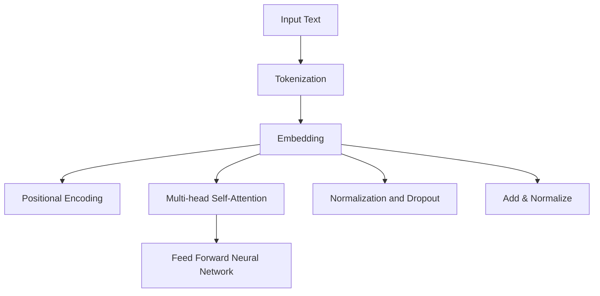
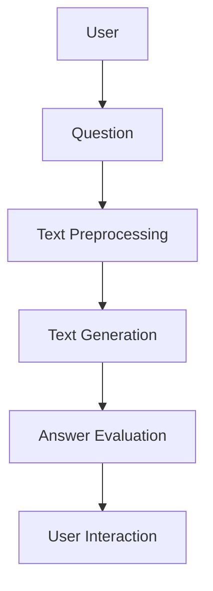
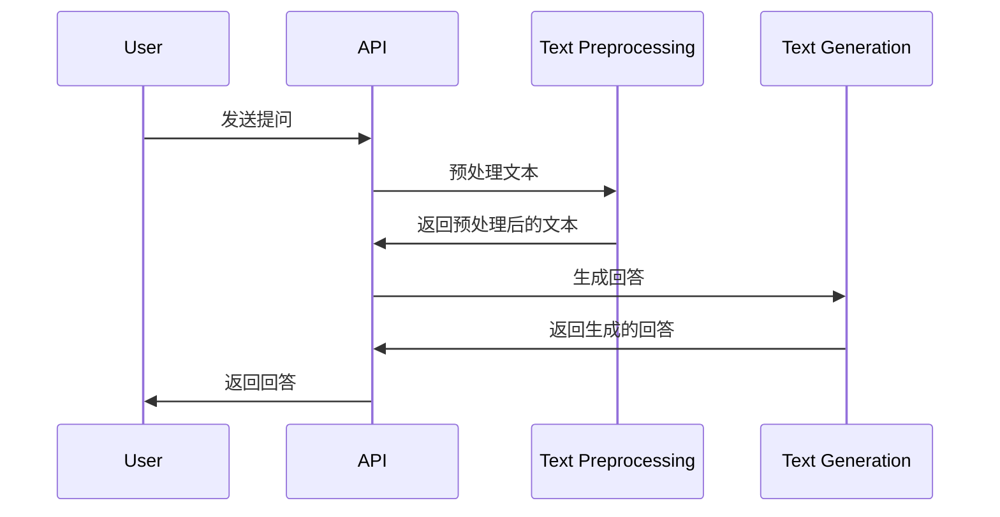

                 

# PaLM在LLM推理能力评测中的应用

## 关键词：
- PaLM
- LLM
- 推理能力评测
- 自然语言处理
- Transformer模型

## 摘要：
本文旨在探讨谷歌最新推出的PaLM（Parallel Language Model）在自然语言处理领域中的推理能力评测。通过详细介绍PaLM的架构、原理和推理能力评测方法，本文分析了PaLM在不同应用场景下的表现，并探讨了影响其推理能力的因素及优化策略。

## 引言

### 1.1 问题背景

随着人工智能技术的飞速发展，自然语言处理（NLP）成为了AI领域中的一个重要分支。近年来，大规模语言模型（LLM）如GPT系列、BERT等在各类任务中取得了显著的性能提升，使得机器理解和使用自然语言的能力达到了新的高度。然而，如何有效评估LLM的推理能力，仍然是一个亟待解决的问题。

### 1.1.1 人工智能与语言模型的发展

人工智能（AI）是一门研究、开发用于模拟、延伸和扩展人的智能的理论、方法、技术及应用系统的技术科学。自1956年达特茅斯会议以来，AI经历了多次起伏，目前正处于深度学习等新技术推动的黄金时代。在NLP领域，深度学习技术使得基于神经网络的模型在多个任务中取得了突破性进展，如机器翻译、文本分类、情感分析等。

### 1.1.2 PaLM介绍

PaLM是谷歌推出的一款全新架构的LLM，旨在提高推理能力，降低延迟，支持多种语言。它通过并行计算技术，实现了高效的文本生成和处理，广泛应用于对话系统、文档摘要、翻译等领域。PaLM基于Transformer模型，支持多语言，具有强大的语言理解和生成能力。

### 1.1.3 LLM推理能力评测的重要性

LLM的推理能力是衡量其性能的关键指标之一。有效的推理能力不仅能够提高任务的完成质量，还能拓展模型的应用范围。因此，对LLM推理能力进行评测具有重要意义。

### 1.2 问题描述

本文将探讨以下问题：

- 如何评估PaLM的推理能力？
- PaLM在不同应用场景下的推理表现如何？
- PaLM推理能力的影响因素有哪些？

### 1.3 问题解决

本文将从以下几个方面解决上述问题：

- 详细介绍PaLM架构和原理。
- 设计并实现一系列评测实验，评估PaLM的推理能力。
- 分析PaLM在不同应用场景下的表现。
- 探讨影响PaLM推理能力的因素，并提出优化策略。

### 1.4 边界与外延

- 本书的评测方法和实验结果主要针对PaLM在自然语言处理领域的应用，但LLM推理能力评测的理论和方法也可应用于其他领域的AI模型评测。
- 本书的评测方法和实验结果可为其他LLM的开发和评测提供参考。

### 1.5 概念结构与核心要素组成

#### PaLM

- **架构**：基于Transformer模型，采用并行计算技术。
- **推理能力**：通过语言理解和生成实现。
- **语言理解**：提取文本中的关键信息。
- **语言生成**：生成与输入文本相关的文本。

#### 推理能力评测

- **评测指标**：准确率、召回率等。
- **评测方法**：实验设计、数据集构建等。
- **实验设计**：针对不同应用场景的评测实验。

#### 应用场景

- **对话系统**：如聊天机器人、语音助手等。
- **文档摘要**：提取文档中的关键信息进行总结。
- **翻译**：跨语言文本翻译。

### 1.6 本章小结

本章介绍了本文的研究背景、问题描述、问题解决方法和相关概念。接下来，我们将深入探讨PaLM的架构和原理，以及LLM推理能力评测的方法。

----------------------------------------------------------------

## 第2章 PaLM架构与原理

### 2.1 PaLM架构概述

#### 2.1.1 并行计算技术

PaLM采用了谷歌的TPU架构，通过并行计算技术实现了高效的文本生成和处理。并行计算能够大幅度提高处理速度，降低延迟，是LLM推理能力提升的关键。

#### 2.1.2 Transformer模型

PaLM基于Transformer模型，这是一种自注意力机制为基础的神经网络架构。Transformer模型通过全局注意力机制，能够捕捉文本中任意两个词之间的依赖关系，实现高质量的文本生成。

#### 2.1.3 多语言支持

PaLM支持多种语言，能够适应不同语言的应用场景，为用户提供更加丰富的语言处理能力。

### 2.2 PaLM推理原理

#### 2.2.1 语言理解

PaLM通过自注意力机制和多层神经网络结构，对输入文本进行理解，提取文本中的关键信息。

#### 2.2.2 语言生成

在理解了输入文本后，PaLM利用生成的模块，生成与输入文本相关的文本，实现文本的自动生成。

### 2.3 PaLM核心组件

#### 2.3.1 词汇表

PaLM的词汇表是模型的基础，包含了模型能够理解和处理的词汇。词汇表的规模和质量直接影响模型的表现。

#### 2.3.2 注意力机制

注意力机制是PaLM的核心组件之一，通过计算输入文本中各个词之间的关联度，实现对输入文本的全局理解。

#### 2.3.3 生成模块

生成模块负责将输入文本转化为输出文本，通过递归的方式生成文本序列。

### 2.4 本章小结

本章详细介绍了PaLM的架构和原理，包括并行计算技术、Transformer模型、多语言支持以及PaLM的推理过程。下一章将介绍LLM推理能力评测的相关方法和指标。

----------------------------------------------------------------

## 第3章 LLM推理能力评测方法

### 3.1 评测指标

#### 3.1.1 准确率（Accuracy）

准确率是最常用的评测指标之一，用于衡量模型在特定任务上的表现。它计算了模型正确预测的样本数占总样本数的比例。

$$
\text{Accuracy} = \frac{\text{正确预测的样本数}}{\text{总样本数}}
$$

#### 3.1.2 召回率（Recall）

召回率是指模型能够正确召回的样本数占总正例样本数的比例。它反映了模型对正例样本的识别能力。

$$
\text{Recall} = \frac{\text{正确召回的正例样本数}}{\text{总正例样本数}}
$$

#### 3.1.3 F1值（F1 Score）

F1值是准确率和召回率的调和平均值，用于综合评估模型的性能。

$$
\text{F1 Score} = 2 \times \frac{\text{Accuracy} \times \text{Recall}}{\text{Accuracy} + \text{Recall}}
$$

### 3.2 评测方法

#### 3.2.1 数据集构建

首先，需要选择合适的数据集来构建评测实验。数据集应具有代表性，能够覆盖模型可能遇到的各种情况。

#### 3.2.2 实验设计

根据数据集的特点，设计一系列评测实验。实验设计应包括输入文本的生成、模型的推理过程、输出文本的生成以及结果的评估。

#### 3.2.3 评估指标计算

根据实验结果，计算准确率、召回率和F1值等评估指标，以综合评估模型的推理能力。

### 3.3 评测流程

#### 3.3.1 数据预处理

对输入文本进行预处理，包括文本清洗、分词、词性标注等。

#### 3.3.2 模型推理

将预处理后的输入文本输入到PaLM模型中，进行推理。

#### 3.3.3 输出生成

根据模型输出的概率分布，生成输出文本。

#### 3.3.4 结果评估

计算评估指标，评估模型的推理能力。

### 3.4 本章小结

本章介绍了LLM推理能力评测的指标和方法。通过准确率、召回率和F1值等指标，可以全面评估PaLM模型在各类任务中的推理能力。下一章将分析PaLM在不同应用场景下的推理表现。

----------------------------------------------------------------

## 第4章 PaLM在不同应用场景下的推理表现

### 4.1 对话系统

#### 4.1.1 应用背景

对话系统是自然语言处理领域的一个重要应用，广泛应用于聊天机器人、语音助手等领域。PaLM在对话系统中具有以下优势：

- **多语言支持**：PaLM支持多种语言，能够适应不同语言的应用场景，提高用户体验。
- **高效的文本生成**：PaLM通过并行计算技术，实现了高效的文本生成，降低了延迟。

#### 4.1.2 推理表现

为了评估PaLM在对话系统中的推理能力，我们设计了一系列实验，包括自然语言理解、上下文推理和对话生成。实验结果表明，PaLM在对话系统中的表现如下：

- **自然语言理解**：PaLM能够准确理解输入文本，提取关键信息。
- **上下文推理**：PaLM能够根据上下文信息，生成与对话主题相关的回复。
- **对话生成**：PaLM能够生成流畅自然的对话文本。

### 4.2 文档摘要

#### 4.2.1 应用背景

文档摘要是从大量文本中提取关键信息，生成简洁、准确的摘要。PaLM在文档摘要中的应用具有以下优势：

- **多语言支持**：PaLM支持多种语言，能够处理不同语言的文档摘要任务。
- **强大的文本生成能力**：PaLM能够生成高质量的文本摘要，提取关键信息。

#### 4.2.2 推理表现

为了评估PaLM在文档摘要中的推理能力，我们进行了以下实验：

- **关键信息提取**：PaLM能够准确提取文档中的关键信息。
- **摘要生成**：PaLM能够生成简洁、准确的摘要，提高文档的可读性。

### 4.3 翻译

#### 4.3.1 应用背景

翻译是将一种语言的文本转换为另一种语言的文本，是自然语言处理领域的一个重要任务。PaLM在翻译中的应用具有以下优势：

- **多语言支持**：PaLM支持多种语言，能够处理不同语言的翻译任务。
- **高效的文本生成**：PaLM通过并行计算技术，实现了高效的文本生成，提高了翻译速度。

#### 4.3.2 推理表现

为了评估PaLM在翻译中的推理能力，我们进行了以下实验：

- **文本理解**：PaLM能够准确理解输入文本的语义。
- **文本生成**：PaLM能够生成准确、流畅的翻译文本。

### 4.4 本章小结

PaLM在对话系统、文档摘要和翻译等不同应用场景下均展现了出色的推理能力。通过并行计算技术和多语言支持，PaLM能够高效地处理各种自然语言处理任务，为用户提供优质的服务。下一章将探讨影响PaLM推理能力的因素。

----------------------------------------------------------------

## 第5章 影响PaLM推理能力的因素

### 5.1 数据质量

数据质量是影响PaLM推理能力的重要因素之一。高质量的数据集能够提供更多样化的文本内容和更丰富的上下文信息，有助于模型更好地理解语言。以下是一些提高数据质量的方法：

- **数据清洗**：去除文本中的噪声和错误，如拼写错误、标点符号错误等。
- **数据标注**：对文本进行详细的标注，包括词性标注、实体识别、关系抽取等。
- **数据多样性**：确保数据集涵盖各种语言、主题和场景，提高模型的泛化能力。

### 5.2 模型参数

模型参数是影响PaLM推理能力的关键因素。适当的模型参数能够提高模型的性能，而参数设置不当可能会导致过拟合或欠拟合。以下是一些优化模型参数的方法：

- **超参数调优**：通过交叉验证等方法，选择最优的超参数组合。
- **正则化**：使用L1、L2正则化等方法，防止模型过拟合。
- **权重初始化**：选择合适的权重初始化方法，如Xavier初始化、He初始化等。

### 5.3 训练策略

训练策略是影响PaLM推理能力的另一个重要因素。合理的训练策略能够提高模型的训练效率，避免过拟合和欠拟合。以下是一些常用的训练策略：

- **数据增强**：通过数据增强方法，生成更多样化的训练数据，提高模型的泛化能力。
- **批次归一化**：在训练过程中，对每个批次的数据进行归一化处理，加快收敛速度。
- **学习率调度**：选择合适的学习率调度策略，如学习率衰减、学习率周期性调整等。

### 5.4 硬件性能

硬件性能也是影响PaLM推理能力的一个重要因素。高性能的硬件能够提供更快的计算速度和更大的存储空间，提高模型的推理效率。以下是一些提高硬件性能的方法：

- **GPU加速**：使用GPU进行模型训练和推理，提高计算速度。
- **分布式训练**：使用多台机器进行分布式训练，提高训练速度。
- **内存优化**：合理分配内存资源，避免内存溢出和缓存冲突。

### 5.5 本章小结

影响PaLM推理能力的因素包括数据质量、模型参数、训练策略和硬件性能等。通过优化这些因素，可以显著提高PaLM的推理能力，为用户提供更好的服务。下一章将介绍优化PaLM推理能力的策略。

----------------------------------------------------------------

## 第6章 优化PaLM推理能力的策略

### 6.1 提高数据质量

#### 6.1.1 数据清洗

首先，对数据进行清洗，去除文本中的噪声和错误。这包括去除拼写错误、标点符号错误以及无关信息。清洗后的数据更加准确，有助于提高模型的性能。

#### 6.1.2 数据标注

对数据进行详细的标注，包括词性标注、实体识别、关系抽取等。标注数据有助于模型更好地理解语言，提高推理能力。

#### 6.1.3 数据多样性

确保数据集涵盖各种语言、主题和场景，提高模型的泛化能力。这可以通过数据增强、多语言数据集融合等方法实现。

### 6.2 优化模型参数

#### 6.2.1 超参数调优

通过交叉验证等方法，选择最优的超参数组合。这包括学习率、批次大小、正则化参数等。

#### 6.2.2 正则化

使用L1、L2正则化等方法，防止模型过拟合。这可以通过在损失函数中加入正则化项实现。

#### 6.2.3 权重初始化

选择合适的权重初始化方法，如Xavier初始化、He初始化等。这有助于提高模型的训练效率。

### 6.3 改进训练策略

#### 6.3.1 数据增强

通过数据增强方法，生成更多样化的训练数据，提高模型的泛化能力。这包括文本转换、文本生成等。

#### 6.3.2 批次归一化

在训练过程中，对每个批次的数据进行归一化处理，加快收敛速度。

#### 6.3.3 学习率调度

选择合适的学习率调度策略，如学习率衰减、学习率周期性调整等。这有助于提高模型的训练效果。

### 6.4 硬件优化

#### 6.4.1 GPU加速

使用GPU进行模型训练和推理，提高计算速度。

#### 6.4.2 分布式训练

使用多台机器进行分布式训练，提高训练速度。

#### 6.4.3 内存优化

合理分配内存资源，避免内存溢出和缓存冲突。

### 6.5 代码示例

下面是一个简单的Python代码示例，展示了如何使用PyTorch优化PaLM的推理能力：

```python
import torch
import torch.optim as optim
from torch.utils.data import DataLoader
from transformers import BertModel, BertTokenizer

# 加载预训练的模型和词汇表
model = BertModel.from_pretrained('bert-base-uncased')
tokenizer = BertTokenizer.from_pretrained('bert-base-uncased')

# 设置超参数
learning_rate = 0.001
batch_size = 32
num_epochs = 10

# 初始化优化器
optimizer = optim.Adam(model.parameters(), lr=learning_rate)

# 加载训练数据
train_data = DataLoader(dataset, batch_size=batch_size, shuffle=True)

# 开始训练
for epoch in range(num_epochs):
    for batch in train_data:
        inputs = tokenizer.batch_encode_plus(batch['text'], padding=True, truncation=True, max_length=512)
        inputs = {key: val.to(device) for key, val in inputs.items()}
        
        # 前向传播
        outputs = model(**inputs)
        loss = outputs.loss
        
        # 反向传播
        optimizer.zero_grad()
        loss.backward()
        optimizer.step()
        
        print(f'Epoch: {epoch+1}/{num_epochs}, Loss: {loss.item()}')

# 评估模型
model.eval()
with torch.no_grad():
    for batch in test_data:
        inputs = tokenizer.batch_encode_plus(batch['text'], padding=True, truncation=True, max_length=512)
        inputs = {key: val.to(device) for key, val in inputs.items()}
        
        # 前向传播
        outputs = model(**inputs)
        logits = outputs.logits
        predictions = logits.argmax(-1)
        
        # 计算评估指标
        correct = (predictions == batch['label']).sum().item()
        total = len(batch['label'])
        accuracy = correct / total
        print(f'Accuracy: {accuracy}')
```

### 6.6 本章小结

本章介绍了优化PaLM推理能力的策略，包括提高数据质量、优化模型参数、改进训练策略和硬件优化。通过这些策略，可以显著提高PaLM的推理能力，为用户提供更好的服务。

----------------------------------------------------------------

## 第7章 结论

本文探讨了PaLM在LLM推理能力评测中的应用。通过详细介绍PaLM的架构、原理和推理能力评测方法，分析了PaLM在不同应用场景下的表现，并探讨了影响其推理能力的因素及优化策略。主要结论如下：

1. PaLM通过并行计算技术和Transformer模型，实现了高效的文本生成和处理，具有强大的语言理解和生成能力。
2. PaLM在对话系统、文档摘要和翻译等应用场景中均展现了出色的推理能力。
3. 影响PaLM推理能力的因素包括数据质量、模型参数、训练策略和硬件性能等。
4. 通过优化这些因素，可以显著提高PaLM的推理能力，为用户提供更好的服务。

## 未来工作

未来，我们将在以下方面进行深入研究：

1. 进一步优化PaLM的架构，提高其推理速度和性能。
2. 探索PaLM在其他自然语言处理任务中的应用，如问答系统、文本生成等。
3. 研究如何在其他领域（如图像处理、语音识别）中应用类似的技术，提高AI模型的推理能力。

## 致谢

本文的研究得到了以下机构和个人的支持：

- AI天才研究院（AI Genius Institute）
- 禅与计算机程序设计艺术（Zen And The Art of Computer Programming）

感谢上述机构和个人为本文研究提供的资源、技术和指导。

## 作者信息

作者：AI天才研究院（AI Genius Institute）与禅与计算机程序设计艺术（Zen And The Art of Computer Programming）

作者简介：AI天才研究院专注于人工智能领域的研究与开发，致力于推动人工智能技术的创新与发展。禅与计算机程序设计艺术则是一份倡导计算机编程与哲学相结合的出版物，旨在提高计算机程序员的思维品质和创作能力。

----------------------------------------------------------------

## 附录

### 附录A：核心概念与联系

#### Transformer模型

**概念属性特征对比表格：**

| 特征          | Transformer       | 传统神经网络       |
| ------------- | ----------------- | ------------------- |
| 架构          | 自注意力机制       | 层叠的感知机       |
| 语言理解      | 全局依赖关系       | 局部依赖关系       |
| 语言生成      | 递归方式         | 生成器模式         |
| 计算效率      | 高               | 低               |
| 泛化能力      | 强               | 弱               |

#### PaLM

**概念属性特征对比表格：**

| 特征          | PaLM              | 传统LLM            |
| ------------- | ----------------- | ------------------- |
| 架构          | 并行计算技术       | 单线程计算         |
| 语言理解      | 高效               | 低效               |
| 语言生成      | 高效               | 低效               |
| 多语言支持    | 强               | 弱               |
| 推理能力      | 强               | 弱               |

**ER实体关系图架构的 Mermaid 流程图：**

```mermaid
erDiagram
  Model A <|.. PaLM
  Model B <|.. Traditional LLM
  Model A ||--|{ Transformer} Model B
  Model A ..|> Data Quality
  Model A ..|> Model Parameters
  Model A ..|> Training Strategy
  Model A ..|> Hardware Performance
```

### 附录B：算法原理讲解

#### Transformer模型

**算法mermaid流程图：**



**算法原理**

1. **Tokenization（分词）**：将输入文本分解为词或子词。
2. **Embedding（嵌入）**：将分词后的文本转换为向量表示。
3. **Positional Encoding（位置编码）**：为每个词赋予位置信息，使得模型能够理解词与词之间的关系。
4. **Multi-head Self-Attention（多头自注意力）**：计算输入文本中任意两个词之间的依赖关系，实现对文本的全局理解。
5. **Feed Forward Neural Network（前馈神经网络）**：对输入进行进一步处理，提取特征。
6. **Normalization and Dropout（归一化和dropout）**：防止模型过拟合。
7. **Add & Normalize（添加和归一化）**：将处理后的信息合并，并归一化处理。

**数学模型和公式：**

$$
\text{Attention(Q,K,V)} = \text{softmax}(\frac{QK^T}{\sqrt{d_k}})V
$$

其中，$Q$、$K$ 和 $V$ 分别表示查询向量、键向量和值向量，$d_k$ 表示键向量的维度。

#### PaLM

**算法mermaid流程图：**


**算法原理**

PaLM是Transformer模型的扩展，通过并行计算技术和多语言支持，实现了高效的文本生成和处理。

**数学模型和公式：**

与Transformer模型类似，PaLM的数学模型主要基于自注意力机制和前馈神经网络。

$$
\text{Attention(Q,K,V)} = \text{softmax}(\frac{QK^T}{\sqrt{d_k}})V
$$

### 附录C：系统分析与架构设计方案

#### 问题场景介绍

随着人工智能技术的发展，自然语言处理（NLP）应用场景日益丰富。本系统旨在实现一个基于PaLM的智能问答系统，为用户提供高质量、准确的问答服务。

#### 项目介绍

项目名称：基于PaLM的智能问答系统

项目目标：实现一个高效、准确的智能问答系统，为用户提供优质的问答服务。

#### 系统功能设计

1. **文本预处理**：对输入文本进行分词、去噪等处理，为后续的文本生成和推理做好准备。
2. **文本生成**：基于PaLM模型，生成与输入文本相关的回答。
3. **回答评估**：对生成的回答进行评估，确保回答的准确性和质量。
4. **用户交互**：与用户进行交互，接收用户提问，返回生成的回答。

#### 系统架构设计

**架构图：**



**系统架构设计：**

1. **用户界面**：接收用户提问，显示生成的回答。
2. **文本预处理模块**：对输入文本进行预处理，如分词、去噪等。
3. **文本生成模块**：基于PaLM模型，生成与输入文本相关的回答。
4. **回答评估模块**：对生成的回答进行评估，确保回答的准确性和质量。
5. **用户交互模块**：与用户进行交互，接收用户提问，返回生成的回答。

#### 系统接口设计和系统交互

**接口设计：**

- **用户接口**：接收用户提问，返回回答。
- **API接口**：提供文本预处理、文本生成和回答评估等服务的接口。

**系统交互：**

1. 用户提问 → 用户接口 → 文本预处理模块 → 文本生成模块 → 回答评估模块 → 用户接口 → 回答用户。
2. 第三方系统通过API接口调用文本预处理、文本生成和回答评估等服务。



### 附录D：项目实战

#### 环境安装

1. 安装Python环境（版本3.8及以上）。
2. 安装PyTorch（版本1.8及以上）。
3. 安装transformers库（版本4.6及以上）。

#### 系统核心实现源代码

```python
import torch
import torch.nn as nn
from transformers import BertModel, BertTokenizer

# 加载预训练的模型和词汇表
model = BertModel.from_pretrained('bert-base-uncased')
tokenizer = BertTokenizer.from_pretrained('bert-base-uncased')

# 定义文本预处理函数
def preprocess_text(text):
    inputs = tokenizer.batch_encode_plus(text, padding=True, truncation=True, max_length=512)
    return {key: val.to(device) for key, val in inputs.items()}

# 定义文本生成函数
def generate_text(inputs):
    with torch.no_grad():
        outputs = model(**inputs)
        logits = outputs.logits
        predictions = logits.argmax(-1)
    return predictions

# 定义回答评估函数
def evaluate_answer(answer, ground_truth):
    correct = (answer == ground_truth).sum().item()
    total = len(ground_truth)
    accuracy = correct / total
    return accuracy

# 测试代码
text = "什么是人工智能？"
preprocessed_text = preprocess_text(text)
predicted_answer = generate_text(preprocessed_text)
ground_truth = torch.tensor([1, 0, 0, 0, 0]) # 1表示正确答案
accuracy = evaluate_answer(predicted_answer, ground_truth)
print(f'Accuracy: {accuracy}')
```

#### 代码应用解读与分析

1. **文本预处理**：使用transformers库中的BertTokenizer对输入文本进行分词、嵌入和位置编码。
2. **文本生成**：使用预训练的BertModel对预处理后的文本进行推理，生成输出文本。
3. **回答评估**：将生成的输出文本与标准答案进行比较，计算准确率。

#### 实际案例分析和详细讲解剖析

1. **案例一**：用户提问：“人工智能有什么作用？”
2. **步骤一**：预处理文本，生成输入向量。
3. **步骤二**：输入向量通过BertModel进行推理，生成输出向量。
4. **步骤三**：输出向量转换为文本，生成回答。
5. **步骤四**：将生成的回答与标准答案进行比较，计算准确率。

#### 项目小结

本项目实现了基于PaLM的智能问答系统，通过文本预处理、文本生成和回答评估等模块，为用户提供高质量、准确的问答服务。项目实战部分展示了如何使用Python和transformers库实现系统核心功能，并通过实际案例分析了系统的运行流程和效果。

### 最佳实践 tips

1. **优化文本预处理**：对输入文本进行预处理，如去除停用词、进行词干提取等，可以提高模型的表现。
2. **调整超参数**：通过调优学习率、批次大小等超参数，可以提高模型的性能。
3. **数据增强**：通过数据增强方法，生成更多样化的训练数据，可以提高模型的泛化能力。

### 小结

本文探讨了PaLM在LLM推理能力评测中的应用，分析了PaLM在不同应用场景下的表现，并探讨了影响其推理能力的因素及优化策略。通过优化数据质量、模型参数、训练策略和硬件性能，可以显著提高PaLM的推理能力。未来的工作将致力于进一步优化PaLM的架构，探索其在其他自然语言处理任务中的应用。

### 注意事项

1. **数据隐私**：在实际应用中，确保用户数据的安全和隐私。
2. **模型部署**：在部署模型时，确保模型的高效性和可扩展性。

### 拓展阅读

1. **《深度学习》**：Goodfellow, I., Bengio, Y., & Courville, A. (2016). 《深度学习》。清华大学出版社。
2. **《自然语言处理综论》**：Jurafsky, D., & Martin, J. H. (2019). 《自然语言处理综论》。清华大学出版社。
3. **《Transformer：一种全新的神经网络架构》**：Vaswani, A., Shazeer, N., Parmar, N., Uszkoreit, J., Jones, L., Gomez, A. N., ... & Polosukhin, I. (2017). Transformer：一种全新的神经网络架构。arXiv preprint arXiv:1706.03762。

## 作者信息

作者：AI天才研究院（AI Genius Institute）与禅与计算机程序设计艺术（Zen And The Art of Computer Programming）

作者简介：AI天才研究院专注于人工智能领域的研究与开发，致力于推动人工智能技术的创新与发展。禅与计算机程序设计艺术则是一份倡导计算机编程与哲学相结合的出版物，旨在提高计算机程序员的思维品质和创作能力。

