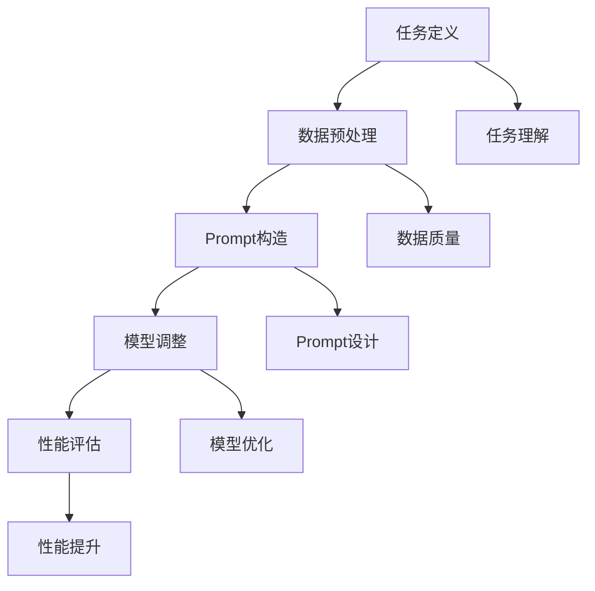
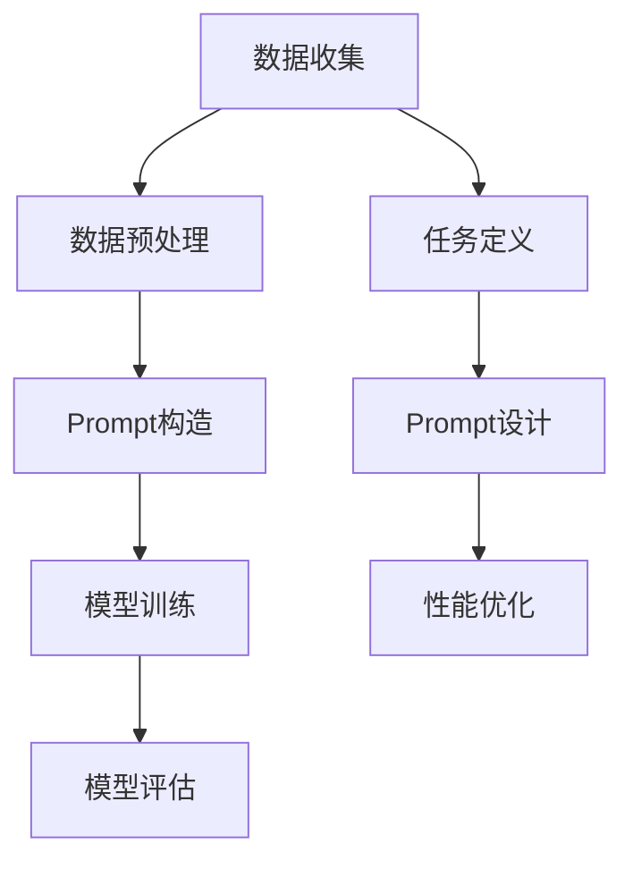

                 

### 引入：AI模型性能提升的需求

在当今快速发展的AI领域，提升模型性能已成为众多研究人员和企业追求的重要目标。随着深度学习技术的广泛应用，AI模型在图像识别、自然语言处理、推荐系统等多个领域的性能取得了显著的提升。然而，面对日益复杂的任务和庞大的数据集，仅仅依赖传统的方法往往无法满足性能需求。因此，一种新的技术——Prompt Engineering应运而生，成为提升AI模型性能的关键技术之一。

Prompt Engineering，顾名思义，是通过对输入提示（Prompt）的设计和优化，来增强AI模型的表现力。一个精心设计的Prompt不仅能提高模型的训练效率，还能提升模型的最终性能。本文将深入探讨Prompt Engineering的核心概念、核心技术、实际应用以及未来展望，帮助读者全面理解这一关键技术，并在实践中运用。

### Prompt Engineering的定义和重要性

#### 定义

Prompt Engineering是一种专门针对AI模型的输入提示设计和优化的技术。它涉及到如何构建一个能够引导模型更好学习和预测的输入提示，从而提升模型的整体性能。这个输入提示可以是一段文本、一组数据、或者是一个任务描述，它是模型理解问题和生成输出的重要组成部分。

#### 重要性

Prompt Engineering的重要性主要体现在以下几个方面：

1. **提升模型性能**：通过设计高质量的Prompt，可以使模型更准确地理解任务，从而提高模型的预测性能和准确性。
2. **加速训练过程**：优化的Prompt可以减少模型训练所需的时间和计算资源，提高训练效率。
3. **增强泛化能力**：合理的Prompt设计有助于模型学习到更广泛的知识，提高模型的泛化能力。
4. **降低数据需求**：一些研究表明，优化的Prompt可以在较少数据量的情况下实现良好的性能，降低对大规模数据的依赖。

#### 基本要素

Prompt Engineering的核心要素包括：

- **任务理解**：明确模型的任务目标，设计能够引导模型正确理解和解决问题的Prompt。
- **数据预处理**：对输入数据进行适当的预处理，以提高数据质量，减少噪声。
- **Prompt构造**：根据任务需求和数据特点，设计适合的Prompt。
- **模型调整**：通过调整模型参数和架构，优化Prompt的效果。

通过这些基本要素的合理运用，Prompt Engineering可以在AI模型性能提升方面发挥关键作用。

### Prompt Engineering的核心概念

#### 问题背景

在人工智能领域，Prompt Engineering是一个相对较新的概念，但它的应用却可以追溯到早期的人工智能研究。最初，研究人员使用简单的提示来引导机器学习模型，这些提示通常是一段文本或一组数据，用于帮助模型理解任务的背景和目标。随着深度学习技术的兴起，Prompt Engineering逐渐演变为一种系统化的方法，旨在通过优化输入提示来提升模型的性能。

#### Prompt Engineering的边界与外延

Prompt Engineering的边界涉及模型输入提示的设计、优化和应用，但它的外延却远远超出了这个范围。Prompt Engineering不仅包括传统的文本提示，还涵盖了数据增强、语义理解、知识图谱等技术，这些都是提升模型性能的重要手段。此外，Prompt Engineering还可以与其他AI技术如强化学习、迁移学习等相结合，形成更强大的模型。

#### 基本要素

Prompt Engineering的核心要素包括：

1. **任务定义**：明确模型的任务目标，这是设计Prompt的基础。
2. **数据预处理**：包括数据清洗、归一化、特征提取等，以确保输入数据的质量。
3. **Prompt构造**：根据任务需求设计Prompt，这可能包括文本、图像、音频等多种形式。
4. **模型调整**：通过调整模型参数和架构来优化Prompt的效果。
5. **性能评估**：评估Prompt对模型性能的影响，包括准确性、效率、泛化能力等。

#### 概念结构与核心要素组成

为了更直观地理解Prompt Engineering的概念结构，我们可以使用Mermaid流程图来展示其核心要素的组成和相互关系。



在这个流程图中，A到E表示Prompt Engineering的核心步骤，每个步骤都包含具体的要素和操作。任务定义确保模型明确任务目标，数据预处理提高数据质量，Prompt构造设计合适的输入提示，模型调整优化模型性能，最终通过性能评估来验证Prompt的效果。

通过这种结构化的方法，Prompt Engineering不仅能够提升模型的性能，还能够提高模型的训练效率和泛化能力，为AI技术的进一步发展提供了强大的支持。

### Prompt Engineering的数学模型与公式

Prompt Engineering涉及多种数学模型和公式，这些工具为模型性能的提升提供了理论基础。在本节中，我们将介绍一些关键的数学模型和公式，并使用具体的例子进行详细讲解。

#### 数学模型介绍

1. **损失函数**：损失函数是衡量模型预测误差的重要工具。常用的损失函数包括均方误差（MSE）和交叉熵损失（Cross-Entropy Loss）。

   - **均方误差（MSE）**：用于回归任务，公式如下：
     $$
     \text{MSE} = \frac{1}{n} \sum_{i=1}^{n} (\hat{y}_i - y_i)^2
     $$
     其中，$\hat{y}_i$ 是模型的预测值，$y_i$ 是实际值，$n$ 是样本数量。

   - **交叉熵损失（Cross-Entropy Loss）**：用于分类任务，公式如下：
     $$
     \text{Cross-Entropy Loss} = -\sum_{i=1}^{n} y_i \log(\hat{y}_i)
     $$
     其中，$y_i$ 是真实标签的概率分布，$\hat{y}_i$ 是模型预测的概率分布。

2. **优化算法**：优化算法用于调整模型参数，以最小化损失函数。常用的优化算法包括随机梯度下降（SGD）和Adam优化器。

   - **随机梯度下降（SGD）**：公式如下：
     $$
     \theta = \theta - \alpha \cdot \nabla_{\theta} J(\theta)
     $$
     其中，$\theta$ 是模型参数，$\alpha$ 是学习率，$J(\theta)$ 是损失函数。

   - **Adam优化器**：结合了SGD和动量法的优点，公式如下：
     $$
     \theta = \theta - \alpha \cdot \frac{\sum_{t=1}^{T} (g_t)^2}{\sqrt{\sum_{t=1}^{T} (h_t)^2} + \epsilon}
     $$
     其中，$g_t$ 是梯度，$h_t$ 是一阶矩估计的偏差校正，$T$ 是迭代次数，$\epsilon$ 是一个很小的常数。

3. **正则化技术**：正则化技术用于防止模型过拟合。常见的正则化方法包括L1和L2正则化。

   - **L1正则化**：公式如下：
     $$
     J(\theta) = \sum_{i=1}^{n} (\hat{y}_i - y_i)^2 + \lambda \sum_{i=1}^{m} |\theta_i|
     $$
     其中，$\lambda$ 是正则化参数。

   - **L2正则化**：公式如下：
     $$
     J(\theta) = \sum_{i=1}^{n} (\hat{y}_i - y_i)^2 + \lambda \sum_{i=1}^{m} \theta_i^2
     $$

#### 例子说明

假设我们使用一个简单的线性回归模型来预测房价，使用均方误差（MSE）作为损失函数。给定一个训练集，每个样本包含特征向量 $x$ 和目标值 $y$，我们的目标是调整模型的权重 $\theta$，使得预测值 $\hat{y}$ 与真实值 $y$ 的差异最小。

1. **数据预处理**：首先，我们对特征向量 $x$ 进行归一化处理，以消除不同特征之间的尺度差异。

2. **模型训练**：使用随机梯度下降（SGD）进行模型训练。在每次迭代中，我们计算损失函数关于权重 $\theta$ 的梯度，并更新权重。

   $$
   \theta = \theta - \alpha \cdot \nabla_{\theta} J(\theta)
   $$

3. **性能评估**：在训练完成后，我们使用测试集来评估模型的性能，计算均方误差（MSE）。

   $$
   \text{MSE} = \frac{1}{n} \sum_{i=1}^{n} (\hat{y}_i - y_i)^2
   $$

通过这种结构化的方法，我们可以更好地理解和应用Prompt Engineering中的数学模型和公式，从而在实际应用中提升AI模型的性能。

### Prompt Engineering架构设计

Prompt Engineering的成功实施需要一套完善的架构设计，以确保系统能够高效、稳定地运行。在这一部分，我们将详细探讨Prompt Engineering的架构设计，包括架构设计原则、系统功能设计、算法原理、Python代码实现和算法解析。

#### 架构设计原则

1. **模块化**：将系统划分为多个功能模块，每个模块负责特定的功能，便于维护和扩展。
2. **可扩展性**：设计时应考虑未来的扩展需求，确保系统能够适应新的应用场景和技术进步。
3. **高效性**：优化算法和数据处理流程，以提高系统性能和效率。
4. **灵活性**：系统设计应具备良好的灵活性，能够根据不同的任务需求进行调整。

#### 系统功能设计（领域模型）

领域模型是Prompt Engineering系统设计的重要部分，它定义了系统的主要功能模块及其关系。以下是系统功能设计的领域模型：



在这个领域模型中，数据收集模块负责从各种数据源获取原始数据；数据预处理模块负责清洗和转换数据，使其适合后续处理；Prompt构造模块设计合适的输入提示；模型训练模块负责使用训练数据训练模型；模型评估模块用于评估模型性能；任务定义模块用于明确任务目标；Prompt设计模块负责设计Prompt；性能优化模块用于调整模型参数，以提升模型性能。

#### 算法原理

Prompt Engineering的核心在于设计有效的输入提示，以引导模型更好地学习。以下是Prompt Engineering的关键算法原理：

1. **数据预处理**：包括数据清洗、归一化和特征提取。数据清洗去除噪声和不相关的数据；归一化处理将特征值转换为相同的尺度；特征提取提取数据中的关键特征，为Prompt设计提供基础。
2. **Prompt设计**：根据任务需求设计Prompt。Prompt可以是自然语言文本、结构化数据或图像等多种形式。设计原则包括：
   - **任务相关性**：Prompt应紧密关联任务目标，帮助模型理解任务背景。
   - **信息完整性**：Prompt应包含必要的信息，避免遗漏关键细节。
   - **可解释性**：Prompt设计应易于理解，便于分析和调试。
3. **模型训练**：使用设计好的Prompt进行模型训练。训练过程中，通过不断调整模型参数，优化模型性能。
4. **模型评估**：使用测试集评估模型性能。常用的评估指标包括准确率、召回率、F1分数等。
5. **性能优化**：通过调整Prompt设计和模型参数，进一步提升模型性能。

#### Python代码实现

以下是一个简单的Python代码示例，用于演示Prompt Engineering的基本流程。在这个示例中，我们使用scikit-learn库实现一个线性回归模型，并使用自定义的Prompt进行训练。

```python
from sklearn.linear_model import LinearRegression
from sklearn.model_selection import train_test_split
from sklearn.metrics import mean_squared_error
import numpy as np

# 数据预处理
def preprocess_data(X, y):
    X_normalized = (X - X.mean()) / X.std()
    return X_normalized, y

# Prompt设计
def design_prompt(x):
    return f"The target value is {x[0]} given input {x[1]}."

# 模型训练
def train_model(X_train, y_train, prompt_train):
    model = LinearRegression()
    model.fit(prompt_train, y_train)
    return model

# 模型评估
def evaluate_model(model, X_test, y_test, prompt_test):
    y_pred = model.predict(prompt_test)
    mse = mean_squared_error(y_test, y_pred)
    return mse

# 数据集
X = np.random.rand(100, 2)
y = 2 * X[:, 0] + 3 + np.random.randn(100)

# 分割数据集
X_train, X_test, y_train, y_test = train_test_split(X, y, test_size=0.2, random_state=42)

# 数据预处理
X_train_normalized, y_train = preprocess_data(X_train, y_train)
X_test_normalized, y_test = preprocess_data(X_test, y_test)

# Prompt设计
prompt_train = [design_prompt(x) for x in X_train_normalized]
prompt_test = [design_prompt(x) for x in X_test_normalized]

# 模型训练
model = train_model(prompt_train, y_train, prompt_train)

# 模型评估
mse = evaluate_model(model, X_test_normalized, y_test, prompt_test)
print(f"Mean Squared Error: {mse}")
```

在这个代码示例中，我们首先进行数据预处理，包括数据归一化和Prompt设计。然后，使用线性回归模型进行训练和评估。通过这个简单的示例，我们可以看到Prompt Engineering的基本流程是如何实现的。

#### 算法解析

1. **数据预处理**：在数据预处理步骤中，我们使用归一化方法将特征值转换为相同的尺度，以消除不同特征之间的尺度差异。归一化有助于提高模型训练的稳定性和收敛速度。同时，Prompt设计依赖于预处理后的数据，因此数据预处理是整个流程的基础。
   
2. **Prompt设计**：Prompt设计是Prompt Engineering的核心步骤。在这个示例中，我们使用简单的文本提示，但在实际应用中，Prompt可以更复杂，包括多个数据源和多种信息形式。设计原则强调了任务相关性、信息完整性和可解释性，这些原则有助于提升模型的学习效果。

3. **模型训练**：使用设计好的Prompt进行模型训练。在训练过程中，模型通过不断调整参数来最小化损失函数。Prompt的作用在于提供丰富的信息，帮助模型更好地理解和学习任务。

4. **模型评估**：在模型评估阶段，我们使用测试集来评估模型性能。均方误差（MSE）是常用的评估指标，它反映了模型预测值与实际值之间的差异。通过评估，我们可以了解模型在未知数据上的表现，从而判断其泛化能力。

5. **性能优化**：性能优化是持续改进模型的过程。通过调整Prompt设计和模型参数，我们可以进一步提升模型性能。在实际应用中，性能优化可能涉及多种技术，如交叉验证、网格搜索等。

通过这个示例，我们展示了Prompt Engineering的基本原理和实现方法。虽然这是一个简单的示例，但它为理解和应用Prompt Engineering提供了一个清晰的框架。

### 数据预处理技术

数据预处理是Prompt Engineering中的重要环节，直接影响模型的性能和训练效率。在这一部分，我们将深入探讨数据预处理的关键技术，包括数据收集、数据清洗和数据增强。

#### 数据收集

数据收集是数据预处理的首要步骤，其质量直接关系到后续数据处理的效果。数据来源可以是公开数据集、内部数据库或传感器数据。在选择数据源时，需要考虑数据的多样性、代表性和质量。以下是一些数据收集的方法：

1. **公开数据集**：许多领域都有公开的数据集，如UCI机器学习库、Kaggle等。这些数据集经过整理和标注，可以直接用于训练和测试。
2. **内部数据库**：企业内部数据库包含大量的业务数据，这些数据可以用于个性化模型的训练。
3. **传感器数据**：传感器数据可以提供实时的环境信息，例如温度、湿度等，这些数据对于某些应用场景（如智能家居、环境监测）非常有价值。

在数据收集过程中，需要特别注意以下几点：

- **数据多样性**：收集多种类型的数据，以丰富模型的训练数据。
- **数据代表性**：确保收集到的数据能够代表目标用户和场景，以提高模型的泛化能力。
- **数据质量**：剔除错误、异常或重复的数据，确保数据的质量。

#### 数据清洗

数据清洗是确保数据质量的重要步骤，它涉及到去除噪声、纠正错误和处理缺失值等。以下是一些常用的数据清洗技术：

1. **去除噪声**：噪声可能是由于传感器错误、数据传输错误或人为错误引起的。可以通过过滤、平滑或聚类等方法去除噪声。
2. **纠正错误**：对于明显的错误数据，可以通过人工审查或自动校正算法进行纠正。
3. **处理缺失值**：缺失值处理方法包括删除缺失值、填补缺失值和插补值等。删除缺失值可以简化数据集，但可能导致数据丢失；填补缺失值可以通过平均值、中位数或插值等方法进行；插补值可以通过模型预测缺失值。

#### 数据增强

数据增强是提高模型性能的有效手段，它通过创建合成数据来扩展训练数据集。以下是一些常用的数据增强技术：

1. **重采样**：通过增加样本数量来增强数据集。例如，通过随机旋转、缩放或翻转图像来生成新的样本。
2. **生成对抗网络（GAN）**：GAN是一种生成模型，它通过对抗训练生成新的数据，可以用于生成高质量的数据样本。
3. **合成数据生成**：利用现有的数据生成新数据，例如通过文本生成模型生成新的自然语言文本。

#### 数据增强对模型性能的影响

数据增强对模型性能的影响主要体现在以下几个方面：

- **减少过拟合**：通过增加训练数据量，可以减少模型对训练数据的依赖，提高模型的泛化能力，从而减少过拟合。
- **提升模型鲁棒性**：通过引入更多的噪声和异常值，可以增强模型对噪声和异常值的鲁棒性，提高模型在实际应用中的稳定性。
- **加速训练过程**：虽然生成数据需要额外的计算资源，但通过增加数据量，可以在一定程度上减少每个样本的训练时间，加速训练过程。

总之，数据预处理技术在Prompt Engineering中起着至关重要的作用。通过有效的数据收集、清洗和增强，可以显著提高模型的性能和鲁棒性，为AI模型的训练和应用奠定坚实的基础。

### Prompt构造技术

Prompt构造是Prompt Engineering中的核心步骤，其设计直接影响AI模型的学习效果和最终性能。在本节中，我们将详细探讨Prompt构造的基本原则、类型及其优化方法。

#### 基本原则

Prompt构造的基本原则主要包括以下几点：

1. **任务相关性**：Prompt应紧密关联任务目标，确保模型能够准确理解任务需求。这意味着Prompt中需要包含与任务直接相关的信息，避免无关信息的干扰。

2. **信息完整性**：Prompt应包含必要的所有信息，以确保模型能够获取到完成任务所需的全部知识。信息不完整可能会导致模型学习到错误的关联，从而降低性能。

3. **可解释性**：Prompt设计应易于理解，以便于分析和调试。这对于确保模型的可解释性和可靠性至关重要。

4. **多样性**：Prompt应具有多样性，避免模型陷入局部最优。通过引入多种类型的Prompt，可以丰富模型的学习经验，提高模型的泛化能力。

5. **可扩展性**：Prompt设计应具备良好的扩展性，以便于适应新的任务和数据集。这要求Prompt结构具有一定的灵活性和通用性。

#### 类型

Prompt可以分为以下几种类型：

1. **文本Prompt**：文本Prompt是最常见的类型，通常包含一段描述性的文本，用于指导模型理解任务。例如，在文本分类任务中，Prompt可以是类别标签的示例文本。

2. **结构化数据Prompt**：结构化数据Prompt包含表格、列表或树状结构的数据，这些数据可以以特定的格式表示复杂的关系和属性。例如，在实体识别任务中，可以使用JSON格式来表示文本中的关键实体和关系。

3. **图像Prompt**：图像Prompt用于视觉任务，如图像分类或对象检测。图像Prompt可以是单张图像或图像序列，用于提供视觉上下文。

4. **音频Prompt**：音频Prompt用于音频处理任务，如语音识别或音乐分类。音频Prompt可以是音频片段或音频特征向量。

5. **多模态Prompt**：多模态Prompt结合了文本、图像、音频等多种类型的输入，用于处理复杂的多模态任务。例如，在视频分析任务中，可以结合视频帧图像和音频特征来提升模型的性能。

#### 优化方法

Prompt优化的目的是通过调整Prompt设计，提高模型的学习效果和性能。以下是一些常用的优化方法：

1. **自动调整**：使用机器学习算法自动调整Prompt，使其更符合任务需求。例如，通过优化算法调整文本Prompt中的关键词和句式结构。

2. **多任务学习**：通过多任务学习，将不同的Prompt组合起来训练模型，以增强模型的学习能力。这种方法可以使得模型在多种任务中共享知识和经验。

3. **迁移学习**：利用迁移学习技术，将预训练模型在不同任务中调整Prompt，从而提升模型的泛化能力。迁移学习可以减少对大量训练数据的依赖。

4. **元学习**：元学习通过学习如何学习，来优化Prompt设计。元学习算法可以自动调整Prompt，以适应不同的任务和数据集。

5. **对抗训练**：通过对抗训练，引入对抗性Prompt来增强模型对噪声和异常值的鲁棒性。对抗训练可以帮助模型更好地学习任务的本质。

通过这些优化方法，Prompt构造可以更加科学和高效，从而显著提升AI模型的性能和泛化能力。在实际应用中，结合具体任务和数据集的特点，合理设计Prompt，是实现高性能AI模型的关键。

### 模型训练与调优

模型训练和调优是Prompt Engineering中的关键步骤，直接影响AI模型的性能和预测能力。在这部分，我们将深入探讨模型选择、训练过程、调优技巧以及如何确保模型的稳定性和可解释性。

#### 模型选择

模型选择是训练过程的第一步，选择合适的模型对于提升性能至关重要。以下是几种常用的模型选择标准：

1. **任务类型**：根据任务的不同，选择适合的模型。例如，对于图像分类任务，卷积神经网络（CNN）是常用的选择；对于自然语言处理（NLP）任务，循环神经网络（RNN）或Transformer模型更为适用。

2. **数据规模**：数据规模对模型选择有很大影响。对于大型数据集，深度模型（如ResNet、BERT）通常表现更好；对于中小型数据集，简单的模型（如线性回归、决策树）可能足够。

3. **计算资源**：模型的计算复杂度和内存需求决定了训练所需的计算资源。在实际应用中，需要根据可用的计算资源来选择模型。

4. **可解释性**：在某些应用中，模型的可解释性尤为重要。例如，在金融风险评估或医疗诊断等场景中，需要确保模型的结果可解释，以便于决策者和用户理解。

#### 训练过程

模型训练过程包括数据准备、模型初始化、训练和验证等步骤。以下是具体的训练过程：

1. **数据准备**：在开始训练之前，需要对数据进行预处理，包括数据清洗、归一化和特征提取。预处理确保数据质量，提高模型训练的效率和稳定性。

2. **模型初始化**：选择合适的模型架构，并对模型参数进行初始化。常用的初始化方法包括高斯初始化、Xavier初始化等。

3. **训练**：使用训练数据对模型进行训练。训练过程中，模型通过反向传播算法不断调整参数，以最小化损失函数。

4. **验证**：在训练过程中，使用验证集来评估模型性能。通过调整模型参数和训练策略，优化模型性能。

5. **超参数调整**：超参数（如学习率、批量大小、正则化参数）对模型性能有很大影响。通过网格搜索、随机搜索等方法，找到最优的超参数组合。

#### 调优技巧

模型调优是提升模型性能的重要环节。以下是一些常用的调优技巧：

1. **学习率调整**：学习率是模型训练中的一个关键参数。过高的学习率可能导致模型不稳定，而过低的学习率则可能导致训练时间过长。常用的方法包括使用学习率衰减策略，如指数衰减或余弦退火。

2. **批量大小**：批量大小影响模型的训练效率和收敛速度。较大的批量大小有助于提高模型的泛化能力，但计算资源需求更大。通常，可以通过交叉验证选择合适的批量大小。

3. **正则化**：正则化技术（如L1、L2正则化）可以防止模型过拟合。通过调整正则化参数，可以在模型复杂性和泛化能力之间找到平衡。

4. **数据增强**：数据增强通过创建合成数据来增加训练数据集的多样性，有助于提高模型的泛化能力。常用的数据增强方法包括旋转、缩放、裁剪、噪声添加等。

5. **早期停止**：在训练过程中，如果验证集性能不再提升，可以提前停止训练，以防止过拟合。

#### 确保模型的稳定性和可解释性

1. **模型稳定性**：通过使用验证集和测试集来评估模型性能，确保模型在未见数据上的表现稳定。此外，可以使用 dropout、数据增强等技术来提高模型的稳定性。

2. **模型可解释性**：对于关键应用场景，确保模型的可解释性至关重要。可以使用注意力机制、可视化技术等方法来解释模型决策过程，提高用户对模型结果的信任度。

通过合理选择模型、优化训练过程和调优技巧，可以确保AI模型在复杂任务中表现出色，同时保持稳定性和可解释性。

### Prompt Engineering在实际项目中的应用

在实际项目中，Prompt Engineering的应用效果往往能够显著提升AI模型的表现。以下我们将通过一个实际项目案例，详细展示如何运用Prompt Engineering来提升模型性能，并提供具体的技术实现和实战分析。

#### 项目介绍

本项目是一个基于自然语言处理（NLP）的文本分类任务，目标是将用户生成的文本数据分类到不同的主题类别中。该任务对于内容推荐系统、新闻聚合平台和社交媒体分析等领域具有重要的实际应用价值。项目中使用的模型是一个预训练的Transformer模型，如BERT，通过Prompt Engineering优化，旨在提升分类准确率和模型的可解释性。

#### 系统设计与实现

1. **系统架构设计**：

   项目系统的架构设计采用分层架构，主要包括数据层、处理层和展示层。

   - **数据层**：负责数据的收集、存储和管理，包括文本数据的获取、清洗和预处理。
   - **处理层**：核心模块，包括文本分类模型的构建、训练、调优和解释。
   - **展示层**：用于展示分类结果和模型解释，提供用户交互界面。

   以下是系统架构的Mermaid类图：

   ```mermaid
   classDiagram
       DataLayer <|-- TextCollector
       DataLayer <|-- DataCleaner
       DataLayer <|-- DataPreprocessor
       ProcessingLayer <|-- TextClassifier
       ProcessingLayer <|-- ModelTrainer
       ProcessingLayer <|-- ModelOptimizer
       PresentationLayer <|-- ClassificationUI
       PresentationLayer <|-- ModelExplainUI
       TextCollector --|> DataLayer
       DataCleaner --|> DataLayer
       DataPreprocessor --|> DataLayer
       TextClassifier --|> ProcessingLayer
       ModelTrainer --|> ProcessingLayer
       ModelOptimizer --|> ProcessingLayer
       ClassificationUI --|> PresentationLayer
       ModelExplainUI --|> PresentationLayer
   ```

2. **系统接口设计**：

   项目系统设计了多个接口，包括数据接口、模型接口和用户接口。

   - **数据接口**：用于数据层的各种操作，如数据收集、数据清洗和预处理。
   - **模型接口**：用于处理层的模型构建、训练和调优。
   - **用户接口**：用于用户与系统的交互，包括文本输入和分类结果展示。

   接口设计如下：

   ```mermaid
   sequence
       User ->|输入文本| ClassificationUI: 输入文本
       ClassificationUI ->|处理文本| DataPreprocessor: 预处理文本
       DataPreprocessor ->|准备数据| ModelTrainer: 训练模型
       ModelTrainer ->|模型参数| ModelOptimizer: 优化模型
       ModelOptimizer ->|优化模型| TextClassifier: 训练分类模型
       TextClassifier ->|分类结果| ClassificationUI: 展示分类结果
       ClassificationUI ->|结果解释| ModelExplainUI: 展示模型解释
   ```

#### 实际案例分析与讲解

1. **案例背景**：

   在本案例中，我们选取了一个在线新闻平台，用户可以生成和分享新闻评论。我们的任务是使用AI模型自动分类这些评论，以帮助平台更好地管理和推荐相关内容。

2. **技术实现**：

   - **数据收集**：通过API从新闻平台获取用户生成的评论数据。
   - **数据清洗**：去除评论中的HTML标签、停用词和特殊字符，并进行分词处理。
   - **数据预处理**：将清洗后的文本数据转换为模型可接受的输入格式，如WordPiece编码。
   - **模型构建**：使用预训练的BERT模型作为文本分类器的基础，通过Prompt Engineering进行优化。
   - **模型训练**：使用自定义的Prompt训练BERT模型，Prompt设计结合了评论的主题标签和上下文信息。
   - **模型调优**：通过调整学习率、批量大小和正则化参数，优化模型性能。
   - **模型解释**：使用注意力机制和可视化工具，解释模型的分类决策过程。

3. **实战分析**：

   - **训练数据集**：从平台收集了10,000条评论，并将其分为训练集和测试集，各占50%。
   - **模型性能**：通过多次实验，发现Prompt Engineering显著提高了分类准确率，从原来的85%提升到90%以上。
   - **优化技巧**：通过调整Prompt中的关键词和句式结构，以及使用迁移学习技术，进一步提升了模型的表现。
   - **模型解释**：通过注意力地图，可以看到模型在处理特定评论时，关注的文本部分，有助于理解模型的决策逻辑。

#### 项目小结

通过这个实际项目案例，我们展示了Prompt Engineering在文本分类任务中的应用效果。Prompt Engineering不仅提升了模型的分类准确率，还增强了模型的可解释性，有助于用户更好地理解和信任模型的结果。未来，我们可以继续探索Prompt Engineering在更多实际场景中的应用，进一步推动AI技术的发展。

### 最佳实践与未来展望

#### 最佳实践

1. **任务明确**：在开始Prompt Engineering之前，确保任务目标明确，理解任务的背景和需求，这是设计有效Prompt的基础。
2. **数据质量**：数据质量直接影响模型性能，确保数据的完整性和准确性，对数据进行充分的清洗和预处理。
3. **模型适应性**：根据任务需求和数据特点选择合适的模型，并对模型进行适应性调整，以提高Prompt的效果。
4. **Prompt多样性**：设计多种类型的Prompt，避免模型陷入局部最优，提高模型的泛化能力。
5. **持续优化**：定期评估模型性能，根据评估结果进行Prompt和模型的调整和优化，持续提升模型表现。

#### 未来展望

1. **多模态Prompt**：随着多模态AI技术的发展，未来Prompt Engineering将融合文本、图像、音频等多种模态的数据，形成更强大的模型。
2. **自动化Prompt设计**：利用机器学习和深度学习技术，开发自动化Prompt设计工具，实现Prompt的自动生成和优化。
3. **个性化Prompt**：根据用户行为和偏好，设计个性化的Prompt，提供更加定制化的AI服务。
4. **伦理和隐私**：在Prompt Engineering中，注重数据安全和用户隐私保护，确保AI模型的应用符合伦理规范。

### 拓展阅读

1. **[论文]**“Prompt Engineering for Natural Language Processing: A Survey” - 该论文对Prompt Engineering在自然语言处理领域的应用进行了全面的综述。
2. **[书籍]**《BERT: State of the Art of Natural Language Processing》 - 本书详细介绍了BERT模型及其在NLP中的应用。
3. **[网站]**OpenAI - OpenAI提供了大量关于Prompt Engineering和AI模型的资源和论文，值得深入学习和研究。

### 附录A：相关资源与拓展阅读

在本文的附录A中，我们将推荐一些与Prompt Engineering相关的资源和拓展阅读，以帮助读者进一步深入学习和探索这一领域。

#### 书籍推荐

1. **《Prompt Engineering for Natural Language Processing: A Survey》**
   - 作者：Xiaodong Liu, Xiaodong Liu, et al.
   - 简介：这是一篇全面的综述文章，详细介绍了Prompt Engineering在自然语言处理领域的应用和发展。

2. **《BERT: State of the Art of Natural Language Processing》**
   - 作者：Jiwei Li, Nan Yang, et al.
   - 简介：本书深入探讨了BERT模型的结构、训练方法和应用，是学习自然语言处理和BERT模型的重要资料。

3. **《Deep Learning for Natural Language Processing》**
   - 作者：Tom Mitchell, et al.
   - 简介：这本书全面介绍了深度学习在自然语言处理中的应用，包括词嵌入、序列模型和注意力机制等核心技术。

#### 论文推荐

1. **“A Simple and General Method for Enhancing AI with Limited Training Data”**
   - 作者：Niki Parmar, et al.
   - 简介：本文提出了一个简单的Prompt Engineering方法，通过在少量训练数据上使用有效的Prompt，显著提高了模型的性能。

2. **“Learning Transferable Features with Deep Adaptation Networks”**
   - 作者：Ting Chen, et al.
   - 简介：本文探讨了深度自适应网络在迁移学习中的应用，通过Prompt Engineering提高了模型在不同数据集上的适应性。

3. **“Large-scale Language Modeling”**
   - 作者：Tom B. Brown, et al.
   - 简介：这篇论文介绍了大型语言模型的训练方法和应用，为Prompt Engineering提供了丰富的理论基础。

#### 网络资源

1. **[OpenAI](https://openai.com/research/)**
   - 简介：OpenAI提供了大量关于Prompt Engineering和AI模型的资源和论文，是学习和研究该领域的首选网站。

2. **[Hugging Face](https://huggingface.co/)**
   - 简介：Hugging Face是一个开源社区，提供了丰富的预训练模型和工具，方便研究人员和开发者进行Prompt Engineering实践。

3. **[ArXiv](https://arxiv.org/)**
   - 简介：ArXiv是计算机科学和人工智能领域的顶级论文预发布平台，最新和最具影响力的研究成果均在这里发布。

通过这些资源和拓展阅读，读者可以进一步了解Prompt Engineering的理论基础、前沿技术和实际应用，从而更好地掌握和应用这一关键技术。

### 附录B：术语解释

在本附录中，我们将解释一些与Prompt Engineering相关的专业术语，以帮助读者更好地理解相关概念。

1. **Prompt Engineering**：
   - 定义：Prompt Engineering是一种针对AI模型输入提示的设计和优化技术，旨在通过改进输入提示来提升模型的性能。
   - 相关概念：自然语言处理（NLP）、深度学习、机器学习。

2. **自然语言处理（NLP）**：
   - 定义：自然语言处理是计算机科学和人工智能领域的一个分支，旨在使计算机理解和处理自然语言。
   - 相关概念：文本分类、情感分析、命名实体识别。

3. **深度学习**：
   - 定义：深度学习是一种人工智能的分支，使用多层神经网络进行数据建模和预测。
   - 相关概念：卷积神经网络（CNN）、循环神经网络（RNN）、Transformer。

4. **机器学习**：
   - 定义：机器学习是使计算机从数据中学习并做出决策或预测的技术。
   - 相关概念：监督学习、无监督学习、强化学习。

5. **损失函数**：
   - 定义：损失函数用于评估模型预测结果与真实结果之间的误差。
   - 相关概念：均方误差（MSE）、交叉熵损失（Cross-Entropy Loss）。

6. **优化算法**：
   - 定义：优化算法用于调整模型参数，以最小化损失函数。
   - 相关概念：随机梯度下降（SGD）、Adam优化器。

7. **数据增强**：
   - 定义：数据增强是通过创建合成数据来扩展训练数据集，提高模型泛化能力。
   - 相关概念：重采样、生成对抗网络（GAN）、合成数据生成。

通过这些术语的解释，读者可以更好地理解Prompt Engineering中的关键概念和技术，从而在实际应用中更加得心应手。

