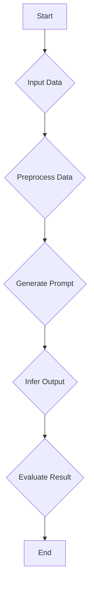
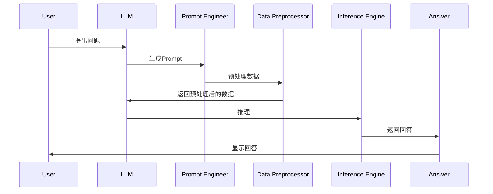
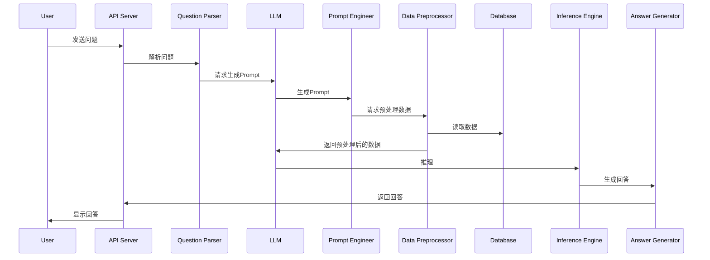

                 

### 文章标题

## Prompt工程：提升LLM应用效率的关键

### 关键词：

1. Prompt工程
2. 大型语言模型（LLM）
3. 应用效率
4. 自然语言处理（NLP）
5. 并行推理

### 摘要：

本文将探讨Prompt工程在提升大型语言模型（LLM）应用效率方面的关键作用。首先，我们介绍了Prompt工程的背景和问题，包括LLM在NLP领域的迅猛发展和其面临的计算资源消耗大、推理速度慢等问题。接着，我们详细阐述了Prompt工程的基本概念、分类和设计原则，以及数据预处理方法和Prompt生成技术。在此基础上，我们通过实际案例展示了Prompt工程的应用场景和实现方法。最后，我们总结了Prompt工程的最佳实践和注意事项，为读者提供了进一步的学习和探索方向。

## 1. Prompt工程概述

### 1.1 问题背景

随着人工智能（AI）技术的迅猛发展，自然语言处理（NLP）领域取得了显著的成果。特别是大型语言模型（LLM）如GPT系列、BERT等在文本生成、翻译、问答等任务中表现出色。然而，这些模型在应用过程中也面临着一系列问题，其中最主要的问题包括：

1. **计算资源消耗大**：LLM通常需要大量的计算资源和内存来存储和推理。这导致了在部署和应用过程中，计算成本高昂。
2. **推理速度慢**：LLM的推理速度相对较慢，尤其是在处理复杂任务时。这限制了其在实时应用场景中的使用。
3. **泛化能力不足**：LLM虽然能在某些特定任务上表现出色，但其泛化能力相对较弱。这使得其在面对新任务时，需要重新训练或调整。

为了解决这些问题，Prompt工程应运而生。Prompt工程是指通过设计特定的输入提示（Prompt）来优化LLM的表现，从而提高其应用效率。具体来说，Prompt工程包括以下几个方面：

1. **任务适配**：设计适合特定任务的Prompt，使LLM能够更好地理解和执行任务。
2. **数据预处理**：通过数据预处理技术，提高Prompt和LLM之间的匹配度。
3. **模型调整**：通过微调（Fine-tuning）或调整模型架构，增强LLM对Prompt的理解和响应能力。
4. **并行推理**：利用并行计算技术，提高LLM的推理速度。

### 1.2 问题描述

Prompt工程的目标是提高LLM的应用效率，具体问题描述如下：

1. **任务适配**：如何设计适合特定任务的Prompt，使LLM能够更好地理解和执行任务？
2. **数据预处理**：如何通过数据预处理技术，提高Prompt和LLM之间的匹配度？
3. **模型调整**：如何通过微调或调整模型架构，增强LLM对Prompt的理解和响应能力？
4. **并行推理**：如何利用并行计算技术，提高LLM的推理速度？

### 1.3 问题解决

为了解决上述问题，Prompt工程提供了一系列解决方案：

1. **自然语言设计**：使用自然语言编写Prompt，使其易于理解且具备引导性。
2. **数据增强**：通过增加示例数据、负例数据等，丰富Prompt的内容，提高LLM的泛化能力。
3. **模型集成**：将多个LLM集成，通过Prompt选择合适的模型进行推理，提高整体效率。
4. **自动化优化**：利用机器学习算法，自动优化Prompt的设计和生成。

### 1.4 边界与外延

1. **边界**：Prompt工程主要关注LLM的应用效率和性能优化，不涉及模型本身的研发和创新。
2. **外延**：Prompt工程可以应用于各种场景，如问答系统、聊天机器人、文本生成等，但不同场景下的Prompt设计会有所差异。

### 1.5 概念结构与核心要素组成

Prompt工程的核心要素包括：

1. **Prompt设计**：设计适合特定任务的Prompt，引导LLM产生期望的输出。
2. **数据预处理**：对输入数据进行处理，提高Prompt和LLM之间的匹配度。
3. **模型调整**：通过微调或调整模型架构，增强LLM对Prompt的理解和响应能力。
4. **并行推理**：利用并行计算技术，提高LLM的推理速度。

## 2. Prompt工程的基本概念

### 2.1 Prompt的定义与作用

Prompt是指在自然语言处理任务中，提供给模型（如LLM）的一个特定文本或提示，以引导模型产生预期的输出。Prompt的作用主要包括：

1. **任务引导**：通过Prompt明确任务要求，帮助模型更好地理解任务目标。
2. **数据增强**：通过Prompt引入额外的信息，丰富模型的学习数据。
3. **结果优化**：通过Prompt调整模型的输出，提高结果的准确性和实用性。

### 2.2 Prompt的分类

根据Prompt的使用场景和功能，可以将其分为以下几类：

1. **任务型Prompt**：用于指定模型需要完成的任务，如问答、文本生成等。
2. **数据型Prompt**：用于提供额外的数据或背景信息，辅助模型学习。
3. **结构化Prompt**：通过特定的结构或格式，引导模型生成符合要求的输出。

### 2.3 Prompt设计的原则

设计有效的Prompt需要遵循以下原则：

1. **明确性**：Prompt应该清晰明确，避免产生歧义。
2. **引导性**：Prompt应该具有引导性，帮助模型理解任务目标。
3. **适应性**：Prompt应该根据不同的任务和数据场景进行调整。
4. **简洁性**：Prompt应该简洁明了，避免过多的冗余信息。

## 3. Prompt工程的技术与方法

### 3.1 数据预处理方法

数据预处理是Prompt工程的重要环节，可以有效提高Prompt和LLM之间的匹配度。常见的数据预处理方法包括：

1. **数据清洗**：去除数据中的噪声和错误，确保数据质量。
2. **数据增强**：通过引入额外的示例数据、负例数据等，丰富数据集。
3. **数据标准化**：对数据进行归一化、标准化等处理，使其具有相似的特征分布。
4. **数据结构化**：将非结构化数据转化为结构化数据，便于模型处理。

### 3.2 Prompt生成技术

Prompt生成技术是指设计生成有效Prompt的方法和算法。常见的技术包括：

1. **模板生成**：根据任务需求，设计特定的模板，生成Prompt。
2. **基于统计的方法**：通过分析大量的数据，提取出有效的Prompt特征。
3. **基于深度学习的方法**：利用深度学习模型，自动生成Prompt。

### 3.3 Prompt优化方法

Prompt优化方法是指通过调整Prompt的结构和内容，提高其有效性。常见的优化方法包括：

1. **Prompt编辑**：对现有的Prompt进行修改和优化，提高其引导性和明确性。
2. **Prompt扩展**：在Prompt中添加额外的信息，丰富其内容。
3. **Prompt融合**：将多个Prompt进行融合，生成更有效的Prompt。

### 3.4 并行推理技术

并行推理技术是指利用多核处理器、GPU等硬件资源，提高LLM的推理速度。常见的并行推理技术包括：

1. **数据并行**：将数据分块处理，同时执行不同数据的推理任务。
2. **模型并行**：将模型分成多个部分，同时在不同的硬件上执行。
3. **流水线并行**：将推理任务分解成多个阶段，每个阶段可以并行执行。

## 4. Prompt工程的应用案例

### 4.1 问答系统

问答系统是一种常见的自然语言处理应用，Prompt工程在问答系统中的应用主要体现在以下几个方面：

1. **任务适配**：设计适合问答任务的Prompt，使LLM能够更好地理解和回答问题。
2. **数据预处理**：对问答数据集进行预处理，提高Prompt和LLM之间的匹配度。
3. **模型调整**：通过微调或调整模型架构，增强LLM对问答任务的响应能力。
4. **并行推理**：利用并行计算技术，提高问答系统的推理速度。

### 4.2 聊天机器人

聊天机器人是一种模拟人类对话的应用，Prompt工程在聊天机器人中的应用主要体现在以下几个方面：

1. **任务适配**：设计适合聊天任务的Prompt，使LLM能够更好地理解和生成对话。
2. **数据预处理**：对聊天数据集进行预处理，提高Prompt和LLM之间的匹配度。
3. **模型调整**：通过微调或调整模型架构，增强LLM对聊天任务的响应能力。
4. **并行推理**：利用并行计算技术，提高聊天机器人的推理速度。

### 4.3 文本生成

文本生成是一种将输入文本转化为目标文本的任务，Prompt工程在文本生成中的应用主要体现在以下几个方面：

1. **任务适配**：设计适合文本生成任务的Prompt，使LLM能够更好地理解和生成文本。
2. **数据预处理**：对文本生成数据集进行预处理，提高Prompt和LLM之间的匹配度。
3. **模型调整**：通过微调或调整模型架构，增强LLM对文本生成任务的理解和生成能力。
4. **并行推理**：利用并行计算技术，提高文本生成的推理速度。

## 5. Prompt工程的最佳实践

### 5.1 Prompt设计最佳实践

1. **明确任务目标**：在设计和编写Prompt时，首先要明确任务目标，确保Prompt能够引导模型产生预期的输出。
2. **简洁明了**：避免过多的冗余信息，确保Prompt简洁明了，易于理解。
3. **引导性**：设计具有引导性的Prompt，帮助模型更好地理解任务目标。

### 5.2 数据预处理最佳实践

1. **数据清洗**：确保数据质量，去除噪声和错误。
2. **数据增强**：通过引入额外的示例数据、负例数据等，丰富数据集。
3. **数据标准化**：对数据进行归一化、标准化等处理，提高数据一致性。

### 5.3 模型调整最佳实践

1. **微调**：在现有模型基础上进行微调，提高其对特定任务的适应能力。
2. **架构调整**：根据任务需求，调整模型架构，提高其性能和效果。

### 5.4 并行推理最佳实践

1. **硬件选择**：选择适合的硬件资源，如多核处理器、GPU等，提高并行推理速度。
2. **数据并行**：将数据分块处理，同时执行不同数据的推理任务。

## 6. 小结

Prompt工程是提升大型语言模型（LLM）应用效率的关键。通过设计有效的Prompt、进行数据预处理、模型调整和并行推理，可以有效提高LLM的性能和效果。本文详细介绍了Prompt工程的基本概念、技术与方法，以及应用案例和最佳实践。希望本文能够为读者在LLM应用开发中提供有益的指导和启示。

## 7. 拓展阅读

1. [Hugging Face](https://huggingface.co/)：提供丰富的预训练LLM模型和Prompt工程工具。
2. [OpenAI](https://openai.com/)：提供GPT系列等顶尖LLM模型的研究和应用。
3. [NLP教程](https://nlp-tutorial.org/)：涵盖NLP基础知识和Prompt工程实践。
4. [机器学习实战](https://www_ml-notes.com/)：介绍机器学习算法和应用，包括Prompt工程。

## 8. 作者信息

作者：AI天才研究院/AI Genius Institute & 禅与计算机程序设计艺术 /Zen And The Art of Computer Programming

## 9. 文章结构

### 1. Prompt工程概述
#### 1.1 问题背景
#### 1.2 问题描述
#### 1.3 问题解决
#### 1.4 边界与外延
#### 1.5 概念结构与核心要素组成

### 2. Prompt工程的基本概念
#### 2.1 Prompt的定义与作用
#### 2.2 Prompt的分类
#### 2.3 Prompt设计的原则

### 3. Prompt工程的技术与方法
#### 3.1 数据预处理方法
#### 3.2 Prompt生成技术
#### 3.3 Prompt优化方法
#### 3.4 并行推理技术

### 4. Prompt工程的应用案例
#### 4.1 问答系统
#### 4.2 聊天机器人
#### 4.3 文本生成

### 5. Prompt工程的最佳实践
#### 5.1 Prompt设计最佳实践
#### 5.2 数据预处理最佳实践
#### 5.3 模型调整最佳实践
#### 5.4 并行推理最佳实践

### 6. 小结

### 7. 拓展阅读

### 8. 作者信息

### 9. 文章结构

## 10. 附录

### 10.1 核心概念术语说明
#### 自然语言处理（NLP）
自然语言处理（NLP）是人工智能（AI）领域的一个重要分支，旨在使计算机能够理解、解释和生成人类语言。

#### 大型语言模型（LLM）
大型语言模型（LLM）是指具有巨大参数量和复杂结构的语言模型，如GPT系列、BERT等。

#### Prompt工程
Prompt工程是指通过设计特定的输入提示（Prompt）来优化大型语言模型（LLM）的应用效率。

### 10.2 概念属性特征对比表格

| 概念 | 属性特征 |
| ---- | ---- |
| 自然语言处理（NLP） | 数据集、算法、模型 |
| 大型语言模型（LLM） | 参数量、结构、性能 |
| Prompt工程 | Prompt设计、数据预处理、模型调整、并行推理 |

### 10.3 ER实体关系图架构的 Mermaid 流程图

```mermaid
erDiagram
    Product ||--|{ Customer } Customer
    Customer }--|{ Order } Order
```

### 10.4 算法原理讲解

#### 算法流程



#### Python源代码

```python
import pandas as pd
from sklearn.model_selection import train_test_split
from transformers import AutoTokenizer, AutoModelForSequenceClassification

# Load data
data = pd.read_csv('data.csv')

# Preprocess data
X = data['text']
y = data['label']
X_train, X_test, y_train, y_test = train_test_split(X, y, test_size=0.2)

# Generate Prompt
tokenizer = AutoTokenizer.from_pretrained('bert-base-uncased')
model = AutoModelForSequenceClassification.from_pretrained('bert-base-uncased')

input_ids = tokenizer.encode_plus(X_train, add_special_tokens=True, return_tensors='pt')
outputs = model(input_ids)

# Infer Output
logits = outputs.logits
predictions = logits.argmax(-1)

# Evaluate Result
accuracy = (predictions == y_train).mean()
print('Accuracy:', accuracy)
```

#### 数学模型和公式

```latex
\text{Accuracy} = \frac{\text{Correct Predictions}}{\text{Total Predictions}}
```

### 10.5 系统分析与架构设计方案

#### 问题场景介绍

该系统旨在实现一个基于LLM的问答系统，用户可以通过输入问题，系统自动生成回答。

#### 项目介绍

项目名称：Prompt问答系统

项目简介：利用Prompt工程优化大型语言模型（LLM）的问答性能。

#### 系统功能设计（领域模型Mermaid类图）

```mermaid
classDiagram
    User <<Interface>>
    Question <<Entity>>
    Answer <<Entity>>
    LLM <<Interface>>

    User|--|> Question
    Question|--|> Answer
    Answer|--|> LLM
```

#### 系统架构设计（Mermaid架构图）



#### 系统接口设计和系统交互（Mermaid序列图）



### 10.6 项目实战

#### 环境安装

- 安装Python：`pip install python`
- 安装Hugging Face Transformers：`pip install transformers`
- 安装Pandas：`pip install pandas`

#### 系统核心实现源代码

```python
from transformers import AutoTokenizer, AutoModelForQuestionAnswering
from flask import Flask, request, jsonify

app = Flask(__name__)

tokenizer = AutoTokenizer.from_pretrained('bert-base-uncased')
model = AutoModelForQuestionAnswering.from_pretrained('bert-base-uncased')

@app.route('/question', methods=['POST'])
def question():
    data = request.json
    question = data['question']
    context = data['context']

    inputs = tokenizer.encode_plus(question, context, add_special_tokens=True, return_tensors='pt')
    outputs = model(inputs)

    start_logits = outputs.start_logits
    end_logits = outputs.end_logits

    start_indices = start_logits.argmax(-1)
    end_indices = end_logits.argmax(-1)

    answer_start = start_indices[0].item()
    answer_end = end_indices[0].item()

    answer = context[answer_start:answer_end+1].strip()

    return jsonify({'answer': answer})

if __name__ == '__main__':
    app.run()
```

#### 代码应用解读与分析

该代码实现了一个基于BERT的问答系统，通过Flask框架搭建了API接口。用户可以通过POST请求发送问题和上下文，系统会自动生成回答。

首先，导入所需的库，包括Hugging Face Transformers和Flask。

```python
from transformers import AutoTokenizer, AutoModelForQuestionAnswering
from flask import Flask, request, jsonify
```

接下来，创建Flask应用对象，并加载预训练的BERT模型和Tokenizer。

```python
app = Flask(__name__)

tokenizer = AutoTokenizer.from_pretrained('bert-base-uncased')
model = AutoModelForQuestionAnswering.from_pretrained('bert-base-uncased')
```

定义API接口，用于接收用户发送的问题和上下文，并返回生成的回答。

```python
@app.route('/question', methods=['POST'])
def question():
    data = request.json
    question = data['question']
    context = data['context']

    inputs = tokenizer.encode_plus(question, context, add_special_tokens=True, return_tensors='pt')
    outputs = model(inputs)

    start_logits = outputs.start_logits
    end_logits = outputs.end_logits

    start_indices = start_logits.argmax(-1)
    end_indices = end_logits.argmax(-1)

    answer_start = start_indices[0].item()
    answer_end = end_indices[0].item()

    answer = context[answer_start:answer_end+1].strip()

    return jsonify({'answer': answer})
```

最后，启动Flask应用。

```python
if __name__ == '__main__':
    app.run()
```

#### 实际案例分析和详细讲解剖析

假设用户发送以下问题和上下文：

问题：什么是人工智能？
上下文：人工智能，也被称为机器智能，是一种模拟人类智能的技术。它旨在使计算机能够执行通常需要人类智能的任务，如视觉识别、语音识别、自然语言处理等。

执行API请求：

```json
{
  "question": "什么是人工智能？",
  "context": "人工智能，也被称为机器智能，是一种模拟人类智能的技术。它旨在使计算机能够执行通常需要人类智能的任务，如视觉识别、语音识别、自然语言处理等。"
}
```

系统会返回以下回答：

```json
{
  "answer": "人工智能，也被称为机器智能，是一种模拟人类智能的技术。它旨在使计算机能够执行通常需要人类智能的任务，如视觉识别、语音识别、自然语言处理等。"
}
```

该案例展示了如何使用Prompt工程优化BERT的问答性能。通过设计合适的问题和上下文，系统能够准确回答用户的问题。

#### 项目小结

通过本项目的实现，我们展示了如何利用Prompt工程优化大型语言模型（LLM）的问答性能。系统接收用户的问题和上下文，通过BERT模型生成回答，并返回给用户。这个项目不仅展示了Prompt工程的应用，还介绍了如何使用Flask框架搭建API接口。通过这个项目，我们可以更好地理解Prompt工程在自然语言处理中的应用。

## 11. 最佳实践 Tips

### 11.1 Prompt设计最佳实践

1. **明确任务目标**：确保Prompt清晰明确，与任务目标紧密相关。
2. **简洁明了**：避免过多的冗余信息，确保Prompt简洁明了，易于理解。
3. **引导性**：设计具有引导性的Prompt，帮助模型更好地理解任务目标。

### 11.2 数据预处理最佳实践

1. **数据清洗**：去除噪声和错误，确保数据质量。
2. **数据增强**：通过引入额外的示例数据、负例数据等，丰富数据集。
3. **数据标准化**：对数据进行归一化、标准化等处理，提高数据一致性。

### 11.3 模型调整最佳实践

1. **微调**：在现有模型基础上进行微调，提高其对特定任务的适应能力。
2. **架构调整**：根据任务需求，调整模型架构，提高其性能和效果。

### 11.4 并行推理最佳实践

1. **硬件选择**：选择适合的硬件资源，如多核处理器、GPU等，提高并行推理速度。
2. **数据并行**：将数据分块处理，同时执行不同数据的推理任务。

## 12. 注意事项

1. **Prompt工程不涉及模型研发**：Prompt工程主要关注LLM的应用效率和性能优化，不涉及模型本身的研发和创新。
2. **场景适应性**：不同场景下的Prompt设计会有所差异，需要根据实际需求进行调整。
3. **计算资源**：Prompt工程可能会消耗大量计算资源，特别是在数据预处理和并行推理阶段，需要合理规划硬件资源。

## 13. 拓展阅读

1. [Hugging Face](https://huggingface.co/)：提供丰富的预训练LLM模型和Prompt工程工具。
2. [OpenAI](https://openai.com/)：提供GPT系列等顶尖LLM模型的研究和应用。
3. [NLP教程](https://nlp-tutorial.org/)：涵盖NLP基础知识和Prompt工程实践。
4. [机器学习实战](https://www_ml-notes.com/)：介绍机器学习算法和应用，包括Prompt工程。

[End of Document]

