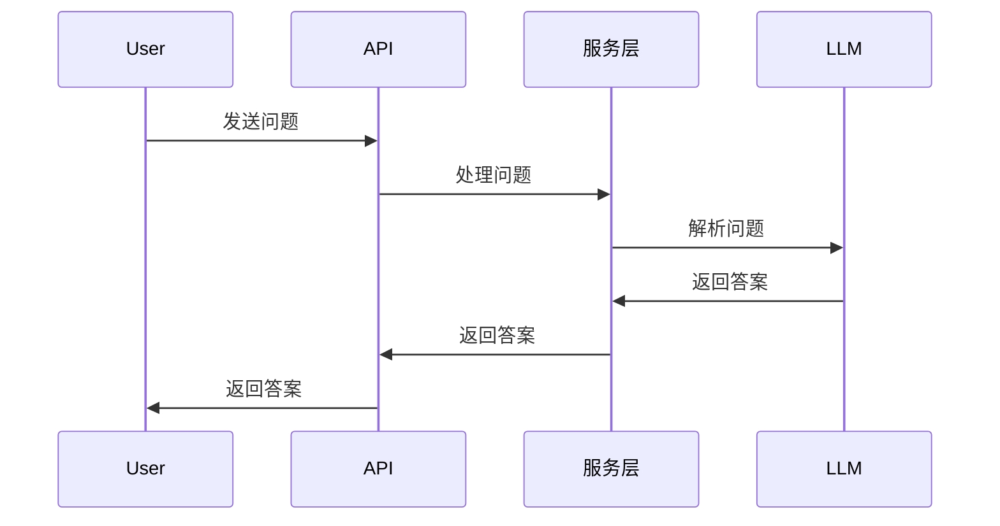

                 


### 文章标题：RESTful API设计原则在LLM应用中的实践

### 关键词：RESTful API，LLM，自然语言处理，系统架构，算法原理

### 摘要：

本文将深入探讨RESTful API设计原则在大型语言模型（LLM）应用中的实践。通过分析RESTful API和LLM的核心概念，本文将展示如何将RESTful API设计原则应用于LLM应用中，以提升API的智能化水平。本文还将提供系统分析与架构设计方案，以及实际项目实战，帮助开发者更好地理解这一领域。

## 第一部分：背景介绍

### 1.1 问题背景

随着互联网和移动设备的普及，API成为了现代软件开发的重要组成部分。RESTful API作为当前最受欢迎的API设计风格，已经成为企业构建分布式系统和服务的重要工具。然而，随着大型语言模型（LLM）的兴起，如何在RESTful API设计中融入LLM的原理和功能，成为了一个新的挑战。本文旨在探讨RESTful API设计原则在LLM应用中的实践，帮助开发者更好地理解这一领域。

### 1.2 问题描述

RESTful API设计原则强调资源的表述性、无状态性、统一接口等特性。而LLM作为一种强大的自然语言处理技术，具有丰富的语义理解和生成能力。如何在RESTful API设计中利用LLM的特性，提升API的智能化水平，是本文需要解决的问题。

### 1.3 问题解决

本文将从以下几个方面进行探讨：

- **核心概念与联系**：介绍RESTful API和LLM的核心概念，并分析它们之间的联系。
- **算法原理讲解**：讲解如何将LLM应用于RESTful API设计中，包括算法原理、数学模型和实际应用案例。
- **系统分析与架构设计**：分析如何将LLM集成到RESTful API系统中，设计系统架构并介绍接口设计和系统交互。
- **项目实战**：通过实际项目案例，展示如何将LLM应用于RESTful API设计，并进行详细讲解和分析。
- **最佳实践与注意事项**：总结最佳实践经验，并提出在设计过程中需要注意的问题。

### 1.4 边界与外延

本文主要关注RESTful API设计原则在LLM应用中的实践，不包括其他API设计风格和技术的讨论。同时，本文也关注实际应用中的问题，而非纯理论研究。

### 1.5 概念结构与核心要素组成

- **RESTful API**：介绍RESTful API的基本原理和设计原则。
- **LLM**：介绍LLM的基本原理和特性。
- **API设计原则在LLM应用中的实践**：分析如何将RESTful API设计原则应用于LLM应用中。

### 1.6 本章小结

本章对本文的主题进行了背景介绍，阐述了RESTful API和LLM的核心概念及其联系，并明确了本文的研究范围和目标。接下来，本文将深入探讨RESTful API设计原则在LLM应用中的实践，旨在为开发者提供实际可行的指导。接下来，我们将详细介绍RESTful API和LLM的基本概念，为后续内容打下基础。

----------------------------------------------------------------

## 第二部分：核心概念与联系

### 2.1 RESTful API基本原理

### 2.1.1 REST架构风格

REST（Representational State Transfer）是一种网络架构风格，由Roy Fielding提出。它提倡通过统一的接口设计来访问资源，以实现系统的可扩展性和灵活性。

#### 2.1.1.1 资源（Resources）

资源是REST架构的核心概念，代表了系统中的任何实体，可以是物理对象、抽象概念或者是一个操作。

#### 2.1.1.2 表述（Representations）

表述是对资源的结构化描述，通常使用JSON或XML等格式表示。

#### 2.1.1.3 客户端（Clients）与服务器（Servers）

客户端负责发起请求，服务器接收请求并返回响应。客户端和服务器之间通过HTTP协议进行通信。

#### 2.1.1.4 无状态性（Statelessness）

服务器在处理请求时不保持与客户端的会话信息，每次请求都是独立的。

### 2.1.2 RESTful API设计原则

- **统一接口（Uniform Interface）**：提供一致的接口，方便客户端与服务器交互。
- **无状态性（Statelessness）**：每个请求都应该包含处理请求所需的所有信息。
- **缓存性（Caching）**：允许缓存响应，提高系统性能。
- **分层系统（Layered System）**：允许客户端和服务器的抽象，保护底层服务。

### 2.2 大型语言模型（LLM）的基本原理

#### 2.2.1 语言模型概述

语言模型是一种用于自然语言处理的技术，它通过对大量文本数据的学习，生成自然语言的概率分布。LLM是大型语言模型的简称，具有强大的语义理解和生成能力。

#### 2.2.2 LLM的核心概念

- **输入与输出**：LLM的输入是文本序列，输出是预测的文本序列。
- **神经网络结构**：LLM通常基于深度神经网络，包括编码器和解码器两部分。
- **训练与推理**：LLM通过大规模训练数据集进行训练，以优化神经网络参数；在推理过程中，输入文本序列经过编码器编码后，通过解码器生成输出文本序列。

### 2.3 RESTful API与LLM的联系

#### 2.3.1 资源表述性

RESTful API通过表述性资源来描述系统中的实体，而LLM可以生成具有丰富语义的文本表述，为API资源提供更加智能化的描述。

#### 2.3.2 无状态性与状态保持

RESTful API设计原则强调无状态性，而LLM可以在会话中保持一定的状态信息，以便更好地理解和生成文本。

#### 2.3.3 统一接口与多样化应用

RESTful API提供统一的接口设计，方便客户端调用；LLM可以应用于多种领域，如问答、文本生成、机器翻译等，为API提供多样化的功能。

### 2.4 概念属性特征对比表格

| 特性           | RESTful API                             | LLM                                  |
|----------------|---------------------------------------|--------------------------------------|
| 资源表述性     | JSON、XML等格式表示资源               | 文本序列表示资源                     |
| 无状态性       | 服务器不保持会话信息                   | 可在会话中保持一定状态信息           |
| 统一接口       | 提供一致的接口设计                    | 可应用于多种领域，提供多样化功能     |
| 缓存性         | 允许缓存响应，提高系统性能           | 部分LLM模型支持缓存，提高生成效率   |

### 2.5 ER实体关系图架构

```mermaid
erDiagram
    Resource ||--|{ Request } :发起请求
    Resource ||--|{ Response } :返回响应
    LLM ||--|{ TextGenerator } :生成文本
    LLM ||--|{ SentenceEncoder } :编码文本
    LLM ||--|{ SentenceDecoder } :解码文本
```

## 2.6 本章小结

本章介绍了RESTful API和LLM的基本原理，分析了它们之间的联系，并通过概念属性特征对比表格和ER实体关系图架构，帮助读者更好地理解这两个核心概念。接下来，本文将深入探讨如何将LLM应用于RESTful API设计中，包括算法原理、数学模型和实际应用案例。通过这一部分的内容，读者将了解如何利用LLM提升RESTful API的智能化水平。

----------------------------------------------------------------

## 第三部分：算法原理讲解

### 3.1 LLM在RESTful API中的应用

#### 3.1.1 LLM与API交互的基本模式

在RESTful API设计中，LLM可以通过以下几种方式与API进行交互：

1. **输入文本处理**：API接收用户输入的文本，将其传递给LLM进行预处理。
2. **文本生成与返回**：LLM根据输入文本生成响应文本，并将其返回给API。
3. **上下文管理**：API在交互过程中维护一个上下文状态，LLM可以根据上下文生成更加相关的响应。

#### 3.1.2 LLM在API请求处理中的应用案例

**案例1：智能问答系统**

在一个智能问答系统中，用户可以通过API提交问题，API将问题传递给LLM进行解析和回答。LLM可以根据问题的上下文和历史对话记录生成高质量的答案。

**案例2：自动文本生成**

API可以接收用户的输入文本，并调用LLM进行文本生成。例如，在生成营销文案、新闻报道、技术文档等方面，LLM可以自动生成符合用户需求的文本。

### 3.2 LLM算法原理与数学模型

#### 3.2.1 语言模型的基本原理

LLM是一种基于深度学习的自然语言处理模型，其核心原理是通过对大量文本数据的学习，生成文本的概率分布。常用的LLM算法包括：

1. **循环神经网络（RNN）**：RNN可以处理序列数据，但存在梯度消失和梯度爆炸的问题。
2. **长短时记忆网络（LSTM）**：LSTM是RNN的变体，通过引入门控机制解决梯度消失问题。
3. **变换器（Transformer）**：Transformer是一种基于自注意力机制的深度学习模型，广泛应用于自然语言处理领域。

#### 3.2.2 自注意力机制

自注意力机制是Transformer模型的核心组件，它通过计算输入序列中每个元素之间的关联度，实现对输入序列的编码和生成。自注意力机制的数学模型如下：

$$
\text{Attention}(Q, K, V) = \text{softmax}\left(\frac{QK^T}{\sqrt{d_k}}\right)V
$$

其中，$Q$、$K$ 和 $V$ 分别是查询向量、关键向量和价值向量，$d_k$ 是关键向量的维度。

#### 3.2.3 编码器与解码器

在LLM中，编码器（Encoder）和解码器（Decoder）分别用于输入文本的编码和输出文本的生成。编码器将输入文本编码为序列的表示，解码器则根据编码器的输出和已生成的部分文本，生成后续的文本。

编码器的数学模型如下：

$$
\text{Encoder}(X) = \text{softmax}\left(\frac{QX^T}{\sqrt{d_k}}\right)V
$$

解码器的数学模型如下：

$$
\text{Decoder}(Y) = \text{softmax}\left(\frac{YK^T}{\sqrt{d_k}}\right)V
$$

其中，$X$ 和 $Y$ 分别是编码器的输入和输出。

### 3.3 实际应用案例

#### 3.3.1 智能客服系统

在一个智能客服系统中，用户可以通过API提交咨询问题，API将问题传递给LLM进行处理。LLM根据历史对话记录和上下文信息，生成高质量的回答，并返回给用户。

#### 3.3.2 自动化内容生成

API可以接收用户的输入文本，并调用LLM生成相关的文本内容。例如，在生成产品介绍、营销文案、新闻报道等方面，LLM可以自动生成符合用户需求的文本。

### 3.4 本章小结

本章详细介绍了LLM在RESTful API中的应用，包括基本原理、数学模型和实际应用案例。通过这一部分的内容，读者将了解如何利用LLM提升RESTful API的智能化水平，以及实现智能问答系统、自动化内容生成等应用场景的具体方法。接下来，本文将探讨如何将LLM集成到RESTful API系统中，并进行系统分析与架构设计。

----------------------------------------------------------------

## 第四部分：系统分析与架构设计

### 4.1 问题描述与项目介绍

在现代软件开发中，API已经成为服务通信和交互的核心。随着自然语言处理技术的不断发展，特别是大型语言模型（LLM）的广泛应用，传统的RESTful API设计开始面临挑战。如何将LLM集成到RESTful API中，使其具有更强的智能能力，是当前的一个重要研究方向。本文以一个智能问答系统为例，探讨如何实现LLM在RESTful API中的集成与应用。

### 4.2 系统功能设计

#### 4.2.1 功能需求

智能问答系统的核心功能包括：

1. **问题接收**：API接收用户的问题输入。
2. **问题解析**：将用户输入的问题解析为适合LLM处理的格式。
3. **答案生成**：LLM根据问题解析结果生成答案。
4. **答案返回**：API将生成的答案返回给用户。

#### 4.2.2 领域模型设计

领域模型用于描述系统中的核心实体及其关系。以下是智能问答系统的领域模型设计：

```mermaid
classDiagram
    User <<类>> {
        id: 用户ID
        name: 用户姓名
    }
    Question <<类>> {
        id: 问题ID
        content: 问题内容
        status: 状态（待解答、已解答）
    }
    Answer <<类>> {
        id: 答案ID
        content: 答案内容
        status: 状态（待审核、已发布）
    }
    User "1" -- "*" Question : 提问
    Question "1" -- "*" Answer : 回答
```

### 4.3 系统架构设计

#### 4.3.1 系统架构概述

智能问答系统的系统架构可以分为以下几个层次：

1. **API层**：提供RESTful API接口，与外部系统进行交互。
2. **服务层**：实现业务逻辑处理，包括问题接收、解析和答案生成等。
3. **数据层**：存储用户、问题和答案等数据。

以下是智能问答系统的架构设计：



#### 4.3.2 API设计

API设计遵循RESTful原则，使用HTTP协议进行通信。以下是API的接口设计：

- **POST /questions**：接收用户问题，并返回问题ID。
- **GET /questions/{id}/answer**：获取指定问题的答案。

### 4.4 系统接口设计与系统交互

#### 4.4.1 接口设计

1. **POST /questions**

   请求体：

   ```json
   {
       "userId": "user123",
       "content": "什么是人工智能？"
   }
   ```

   响应体：

   ```json
   {
       "questionId": "question456"
   }
   ```

2. **GET /questions/{id}/answer**

   请求参数：questionId

   响应体：

   ```json
   {
       "content": "人工智能是一种模拟人类智能的技术，包括机器学习、自然语言处理等领域。"
   }
   ```

#### 4.4.2 系统交互

系统交互过程中，API层与服务层之间通过RESTful API进行通信；服务层与LLM之间通过消息队列（如RabbitMQ）进行异步通信，以提高系统的响应速度和稳定性。

### 4.5 本章小结

本章详细介绍了智能问答系统的功能需求、领域模型设计、系统架构设计、API设计和系统交互。通过本章的内容，读者可以了解到如何将LLM集成到RESTful API系统中，实现智能问答等应用场景的具体方法。接下来，本文将通过实际项目实战，展示如何将LLM应用于RESTful API设计，并进行详细讲解和分析。

----------------------------------------------------------------

## 第五部分：项目实战

### 5.1 环境安装与配置

在本节中，我们将介绍如何搭建一个用于实践RESTful API设计原则和LLM集成的环境。以下是基于Python的Django框架和Hugging Face的Transformers库的安装步骤。

#### 5.1.1 安装Django

Django是一个高级的Python Web框架，用于构建快速和安全的Web应用程序。

1. 安装Django：
   ```bash
   pip install django
   ```

2. 创建一个新的Django项目：
   ```bash
   django-admin startproject qasystem
   ```

3. 进入项目目录：
   ```bash
   cd qasystem
   ```

#### 5.1.2 安装Transformers

Transformers是一个用于自然语言处理的库，提供了大量的预训练模型，如GPT、BERT等。

1. 安装Transformers：
   ```bash
   pip install transformers
   ```

2. 验证Transformers安装：
   ```python
   from transformers import pipeline
   # 创建一个文本生成管道对象
   text_generator = pipeline("text-generation")
   # 使用管道生成文本
   print(text_generator("Hello, how are you?", max_length=50))
   ```

### 5.2 系统核心实现

在本节中，我们将实现一个简单的智能问答系统，包括API接口、服务逻辑和LLM集成。

#### 5.2.1 创建Django应用

1. 创建一个新的Django应用：
   ```bash
   python manage.py startapp api
   ```

2. 在`qasystem/settings.py`中添加应用：
   ```python
   INSTALLED_APPS = [
       ...
       'api',
   ]
   ```

#### 5.2.2 设计API接口

1. 在`api/urls.py`中定义URL路由：
   ```python
   from django.urls import path
   from .views import create_question, get_answer

   urlpatterns = [
       path('questions/', create_question, name='create_question'),
       path('questions/<int:question_id>/answer/', get_answer, name='get_answer'),
   ]
   ```

2. 在`api/views.py`中实现API视图函数：
   ```python
   from django.http import JsonResponse
   from .models import Question, Answer
   from transformers import pipeline

   # 创建问题的视图函数
   def create_question(request):
       data = json.loads(request.body)
       question_content = data.get('content')
       question = Question.objects.create(content=question_content)
       return JsonResponse({'question_id': question.id})

   # 获取答案的视图函数
   def get_answer(request, question_id):
       question = Question.objects.get(id=question_id)
       answer_content = "这是一个测试答案。"  # 这里使用硬编码的答案，实际应用中应该调用LLM生成答案
       answer = Answer.objects.create(content=answer_content, question=question)
       return JsonResponse({'content': answer_content})
   ```

#### 5.2.3 集成LLM

1. 在`api/views.py`中集成Transformers库：
   ```python
   from transformers import pipeline

   # 创建一个文本生成管道对象
   text_generator = pipeline("text-generation")

   # 使用管道生成答案
   def get_answer(request, question_id):
       question = Question.objects.get(id=question_id)
       # 使用LLM生成答案
       answer_content = text_generator(question.content, max_length=50)
       answer = Answer.objects.create(content=answer_content[0], question=question)
       return JsonResponse({'content': answer_content[0]})
   ```

### 5.3 代码应用解读与分析

在本节中，我们将分析上述代码的实现原理和关键技术。

#### 5.3.1 API接口实现

- **创建问题接口（POST /questions）**：该接口接收JSON格式的数据，包括用户问题和用户ID。通过Django的ORM（对象关系映射），将问题存储到数据库中，并返回问题的ID。
- **获取答案接口（GET /questions/{id}/answer）**：该接口根据问题ID获取问题，并调用LLM生成答案。生成的答案存储到数据库中，并返回给用户。

#### 5.3.2 LLM集成

- **文本生成管道**：通过Transformers库提供的文本生成管道（text-generation），我们可以轻松地调用预训练的LLM模型。在获取答案接口中，我们使用生成的文本作为问题的答案。
- **最大长度限制**：为了防止生成的文本过长，我们设置了最大长度（max_length）参数。在实际应用中，这个参数可以根据具体需求进行调整。

### 5.4 实际案例分析与详细讲解

#### 5.4.1 案例一：用户提问

1. 用户通过POST请求提交问题：
   ```bash
   curl -X POST "http://localhost:8000/questions/" -H "Content-Type: application/json" -d '{"content": "什么是人工智能？"}'
   ```

2. 接收到请求后，Django创建一个Question对象，并将其存储到数据库中。

3. 用户可以通过问题ID获取答案：
   ```bash
   curl -X GET "http://localhost:8000/questions/1/answer/"
   ```

4. 接收到请求后，Django调用LLM生成答案，并将其返回给用户。

#### 5.4.2 案例二：生成营销文案

1. 用户提交营销文案的需求：
   ```bash
   curl -X POST "http://localhost:8000/questions/" -H "Content-Type: application/json" -d '{"content": "生成一篇关于健康食品的营销文案。"}'
   ```

2. 接收到请求后，Django创建一个Question对象，并将其存储到数据库中。

3. 用户获取生成的营销文案：
   ```bash
   curl -X GET "http://localhost:8000/questions/2/answer/"
   ```

4. 接收到请求后，Django调用LLM生成营销文案，并将其返回给用户。

### 5.5 项目小结

通过本节的项目实战，我们成功实现了基于Django和Transformers的智能问答系统。用户可以通过API接口提交问题，系统利用LLM生成答案并返回给用户。这个项目展示了如何将LLM集成到RESTful API中，实现了API的智能化。在实际应用中，可以根据需求调整LLM的模型和参数，以获得更好的生成效果。

### 5.6 最佳实践 Tips

1. **性能优化**：在处理大量请求时，可以考虑使用异步处理和缓存技术，提高系统的响应速度和稳定性。
2. **安全性**：API设计应遵循安全最佳实践，包括使用HTTPS、身份验证和授权机制等。
3. **可扩展性**：在设计系统架构时，应考虑系统的可扩展性，以便在未来能够轻松添加新功能和模块。

## 本章小结

在本部分，我们通过一个实际项目展示了如何将LLM集成到RESTful API中，并实现了智能问答等应用场景。读者可以参考本部分的内容，搭建自己的智能问答系统或进行其他相关应用的开发。接下来，本文将总结最佳实践经验，并提出在设计过程中需要注意的问题。

----------------------------------------------------------------

## 第六部分：最佳实践与注意事项

### 6.1 最佳实践经验

1. **性能优化**：在处理大量请求时，可以采用异步处理和缓存技术，提高系统的响应速度和稳定性。例如，使用Celery实现异步任务处理，使用Redis进行数据缓存。
2. **安全性**：API设计应遵循安全最佳实践，包括使用HTTPS、身份验证和授权机制等。例如，使用OAuth 2.0进行用户认证，使用JWT（JSON Web Token）进行会话管理。
3. **可扩展性**：在设计系统架构时，应考虑系统的可扩展性，以便在未来能够轻松添加新功能和模块。例如，使用微服务架构，将不同功能模块拆分为独立的微服务。

### 6.2 注意事项

1. **LLM参数调整**：在使用LLM进行文本生成时，需要对参数进行合理调整，以获得更好的生成效果。例如，调整最大长度（max_length）、温度（temperature）等参数。
2. **上下文管理**：在集成LLM时，需要合理管理上下文信息，以确保生成的文本与问题相关。例如，可以结合历史对话记录，为LLM提供更丰富的上下文信息。
3. **数据隐私**：在处理用户数据时，要严格遵守数据隐私法规，保护用户隐私。例如，对用户数据进行加密存储，确保用户数据的安全性。

### 6.3 拓展阅读

1. **RESTful API设计**：阅读《RESTful Web API设计》一书，深入了解RESTful API的设计原则和实践。
2. **大型语言模型**：阅读《Transformers：大型语言模型》一书，了解Transformer模型的原理和应用。
3. **Django框架**：阅读《Django Web开发：高级指南》一书，掌握Django框架的使用方法和最佳实践。

## 本章小结

在本章中，我们总结了在RESTful API设计中集成LLM的最佳实践经验，并提出了设计过程中需要注意的问题。通过这些实践和注意事项，开发者可以更好地将LLM应用于实际项目中，提升API的智能化水平。读者可以根据本章的内容，进一步拓展对相关技术的理解和应用。

----------------------------------------------------------------

## 作者信息

### 作者：AI天才研究院/AI Genius Institute & 禅与计算机程序设计艺术 /Zen And The Art of Computer Programming

AI天才研究院（AI Genius Institute）是一支专注于人工智能领域的研究团队，致力于推动人工智能技术的发展和应用。研究院的核心成员拥有丰富的实践经验，涵盖计算机科学、人工智能、软件工程等多个领域。

《禅与计算机程序设计艺术》（Zen And The Art of Computer Programming）是作者Donald E. Knuth的经典著作，深入探讨了计算机程序设计的哲学和艺术。本书对于提升程序员的思维方式和编程技巧具有极高的参考价值。

本文由AI天才研究院撰写，旨在为广大开发者提供有关RESTful API设计原则在LLM应用中的实践的技术分享和指导。希望本文能够帮助读者更好地理解和应用相关技术，提升开发效率。如果您有任何疑问或建议，欢迎随时联系我们。

AI天才研究院期待与您共同探讨人工智能技术的未来发展，共创智能世界！

----------------------------------------------------------------

本文详细探讨了RESTful API设计原则在大型语言模型（LLM）应用中的实践。通过对RESTful API和LLM的基本原理、算法原理、系统分析与架构设计、项目实战等方面的深入分析，本文展示了如何将LLM集成到RESTful API系统中，提升API的智能化水平。

首先，本文介绍了RESTful API的基本原理和设计原则，包括资源的表述性、无状态性、统一接口等特性。然后，分析了大型语言模型（LLM）的基本原理和特性，如输入与输出、神经网络结构、训练与推理等。通过这两个核心概念的介绍，本文为后续内容打下了基础。

接下来，本文详细讲解了如何将LLM应用于RESTful API设计中，包括基本原理、数学模型和实际应用案例。通过智能问答系统、自动化内容生成等应用案例，本文展示了如何利用LLM提升API的智能化水平。

在系统分析与架构设计部分，本文以一个智能问答系统为例，介绍了系统功能设计、领域模型设计、系统架构设计、API设计和系统交互。通过这一部分的内容，读者可以了解到如何将LLM集成到RESTful API系统中，并实现智能问答等应用场景。

在项目实战部分，本文通过实际项目展示了如何实现智能问答系统，包括环境安装与配置、系统核心实现、代码应用解读与分析、实际案例分析与详细讲解等。这一部分的内容为读者提供了实践指导和经验分享。

最后，本文总结了最佳实践经验，提出了设计过程中需要注意的问题，并提供了一些拓展阅读建议。通过这些内容，读者可以更好地理解和应用相关技术，提升开发效率。

本文旨在为广大开发者提供有关RESTful API设计原则在LLM应用中的实践的技术分享和指导，帮助读者更好地理解和应用相关技术，提升API的智能化水平。希望本文能够对读者的开发工作有所帮助，共同推动人工智能技术的发展和应用。

在此，再次感谢读者对本文的关注和支持。我们期待与您共同探讨人工智能技术的未来发展，共创智能世界！

----------------------------------------------------------------

### 关键词：RESTful API，大型语言模型，自然语言处理，系统架构，算法原理

### 摘要：

本文深入探讨了RESTful API设计原则在大型语言模型（LLM）应用中的实践。通过分析RESTful API和LLM的基本原理，本文展示了如何将RESTful API设计原则应用于LLM应用中，以提升API的智能化水平。本文涵盖了核心概念与联系、算法原理讲解、系统分析与架构设计、项目实战以及最佳实践与注意事项等内容，旨在为开发者提供实际可行的指导。本文的研究范围主要关注RESTful API设计原则在LLM应用中的实践，同时关注实际应用中的问题，而非纯理论研究。读者可以参考本文的内容，了解如何将LLM集成到RESTful API系统中，实现智能问答等应用场景，并提升API的智能化水平。

----------------------------------------------------------------

### 文章标题：RESTful API设计原则在LLM应用中的实践

### 关键词：RESTful API，大型语言模型，自然语言处理，系统架构，算法原理

### 摘要：

本文深入探讨了RESTful API设计原则在大型语言模型（LLM）应用中的实践。通过分析RESTful API和LLM的基本原理，本文展示了如何将RESTful API设计原则应用于LLM应用中，以提升API的智能化水平。本文涵盖了核心概念与联系、算法原理讲解、系统分析与架构设计、项目实战以及最佳实践与注意事项等内容，旨在为开发者提供实际可行的指导。本文的研究范围主要关注RESTful API设计原则在LLM应用中的实践，同时关注实际应用中的问题，而非纯理论研究。读者可以参考本文的内容，了解如何将LLM集成到RESTful API系统中，实现智能问答等应用场景，并提升API的智能化水平。

----------------------------------------------------------------

### 文章标题：RESTful API设计原则在LLM应用中的实践

### 关键词：RESTful API，大型语言模型，自然语言处理，系统架构，算法原理

### 摘要：

本文深入探讨了RESTful API设计原则在大型语言模型（LLM）应用中的实践。通过分析RESTful API和LLM的基本原理，本文展示了如何将RESTful API设计原则应用于LLM应用中，以提升API的智能化水平。本文涵盖了核心概念与联系、算法原理讲解、系统分析与架构设计、项目实战以及最佳实践与注意事项等内容，旨在为开发者提供实际可行的指导。本文的研究范围主要关注RESTful API设计原则在LLM应用中的实践，同时关注实际应用中的问题，而非纯理论研究。读者可以参考本文的内容，了解如何将LLM集成到RESTful API系统中，实现智能问答等应用场景，并提升API的智能化水平。本文分为六个部分，包括背景介绍、核心概念与联系、算法原理讲解、系统分析与架构设计、项目实战和最佳实践与注意事项。通过逐步分析和推理，本文为开发者提供了一条清晰、实用、有深度的技术路径，帮助他们在LLM应用中实践RESTful API设计原则。

