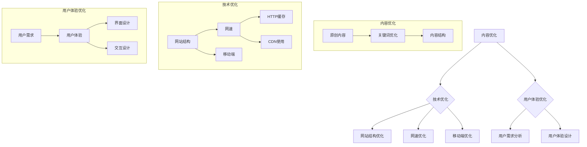
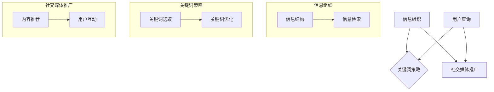
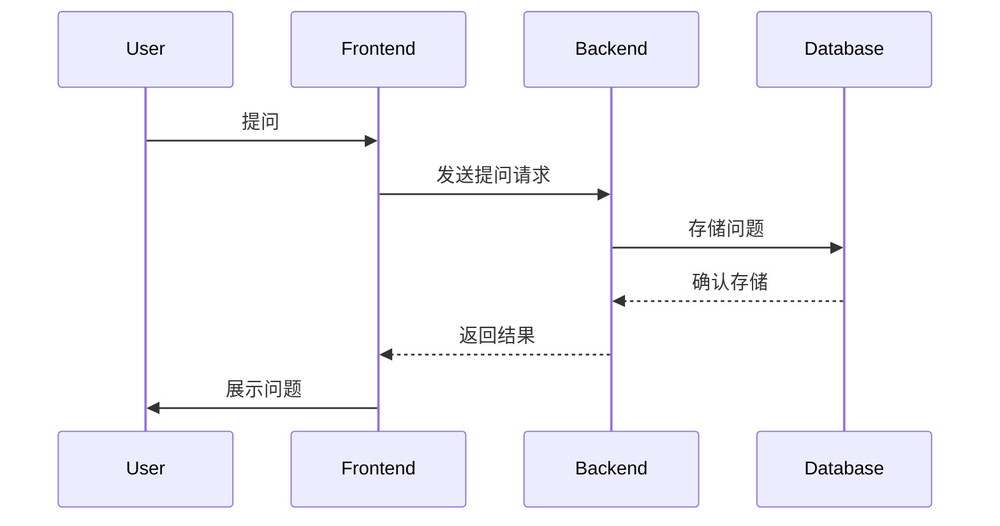
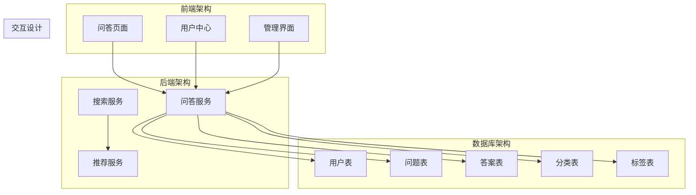

                 

### 《SEO友好架构提升LLM应用的可发现性》文章关键词

1. **SEO友好架构**
2. **语言模型（LLM）**
3. **搜索引擎优化（SEO）**
4. **可发现性**
5. **内容优化**
6. **技术优化**
7. **用户体验优化**
8. **信息组织**
9. **关键词策略**
10. **社交媒体推广**

### 摘要

本文旨在探讨如何通过SEO友好架构提升大型语言模型（LLM）应用的可发现性。首先，我们介绍了搜索引擎优化（SEO）在提升网站可见性和用户访问量方面的重要性，以及当前SEO面临的主要挑战。接着，我们讨论了语言模型的崛起及其在互联网应用中的广泛应用，并指出了LLM应用在可发现性方面存在的难题。

文章的核心内容分为两部分：核心概念原理和算法原理讲解。在核心概念原理部分，我们详细阐述了SEO友好架构、内容优化原理、技术优化原理和用户体验优化原理，并介绍了LLM应用可发现性优化策略。算法原理讲解部分，我们通过Mermaid流程图和Python代码示例，深入讲解了SEO友好架构和LLM应用可发现性优化的算法原理。

接着，我们进行了系统分析与架构设计方案，包括问题场景介绍、系统功能设计（领域模型）和系统架构设计（Mermaid架构图）。最后，通过一个实际案例，详细分析了如何将SEO友好架构应用于LLM应用，提升其可发现性。文章结尾提出了最佳实践 tips，总结了全文要点，并提出了未来研究的方向。通过本文，我们希望为开发者提供一套系统化的方法和策略，以提升LLM应用在搜索引擎中的可发现性，从而更好地服务于用户。

## 第一部分：背景介绍

### 第1章：问题背景与定义

#### 1.1 问题背景

随着互联网的飞速发展，搜索引擎优化（SEO）已经成为网站运营不可或缺的一部分。SEO的目标是通过优化网站的结构、内容和外部链接，提高网站在搜索引擎结果页面（SERP）中的排名，从而增加网站的自然流量和用户访问量。然而，在近年来，大型语言模型（LLM）的崛起给SEO带来了新的挑战和机遇。

**1.1.1 搜索引擎优化（SEO）的重要性**

SEO对于任何在线业务来说都至关重要。它不仅能够提高网站的可见性，还能提升用户体验，增强品牌影响力。一个良好的SEO策略可以带来以下几个方面的好处：

- **提高网站排名**：通过优化网站内容和结构，使得搜索引擎更容易理解网站的内容和主题，从而提高网站在搜索结果中的排名。
- **增加自然流量**：当网站在搜索结果中的排名提高时，自然流量也会相应增加。这对于任何依赖在线流量来获得收益的网站来说，都是至关重要的。
- **提升用户体验**：良好的SEO策略不仅关注搜索引擎，也关注用户的体验。通过优化网站速度、结构布局和内容质量，可以提升用户的满意度，增加用户在网站上的停留时间。

**当前SEO的现状与挑战**

尽管SEO的重要性不言而喻，但当前的SEO环境面临着诸多挑战：

- **搜索引擎算法更新**：搜索引擎（如Google）的算法不断更新和优化，这使得SEO策略需要不断适应新的变化。
- **内容质量要求提高**：随着互联网内容的爆炸式增长，用户对内容质量的要求也在提高。仅仅依靠关键词堆砌已经无法获得良好的搜索排名。
- **竞争激烈**：随着越来越多的网站加入SEO的行列，竞争也变得越来越激烈。想要在搜索结果中脱颖而出，需要付出更多的努力。

**1.1.2 语言模型（LLM）的崛起**

近年来，大型语言模型（LLM）在自然语言处理（NLP）领域取得了显著的进展。LLM能够理解、生成和翻译自然语言，大大提升了人机交互的效率和效果。LLM的崛起对搜索引擎优化（SEO）产生了深远的影响。

**LLM的定义与特点**

大型语言模型（LLM）是一种基于深度学习技术的自然语言处理模型，其具有以下几个特点：

- **大规模训练**：LLM通常基于数十亿甚至数千亿级别的语料库进行训练，这使得它们能够理解并生成复杂多样的语言内容。
- **上下文理解**：LLM能够理解文本的上下文，这使得它们在生成回答时能够更加准确和自然。
- **自适应能力**：LLM可以根据不同的输入进行自适应调整，以生成更加合适的回答。

**LLM在互联网中的应用场景**

LLM在互联网中有着广泛的应用场景，主要包括以下几个方面：

- **搜索引擎**：LLM可以用于改进搜索引擎的搜索结果，使得搜索结果更加准确和有针对性。
- **聊天机器人**：LLM可以用于构建智能聊天机器人，提供更加自然和智能的交互体验。
- **内容生成**：LLM可以用于生成文章、摘要、广告文案等，提高内容的生产效率和多样性。

**1.1.3 LLM应用的可发现性问题**

尽管LLM在互联网应用中具有巨大的潜力，但它们也面临着可发现性（Discoverability）的挑战。可发现性指的是用户能够通过搜索引擎或其他渠道轻松找到LLM应用的能力。以下是LLM应用在可发现性方面面临的主要问题：

- **内容缺乏结构化**：LLM应用通常产生大量无结构化的文本，这使得搜索引擎难以理解其内容，从而降低了其可发现性。
- **关键词覆盖不足**：由于LLM应用的内容多样且动态，传统关键词策略难以全面覆盖所有相关关键词，从而影响了其搜索排名。
- **用户交互难度**：LLM应用的用户交互往往较为复杂，用户需要付出更多努力才能理解和使用这些应用，从而降低了其可发现性。

**1.2 关键概念与联系**

在探讨如何提升LLM应用的可发现性之前，我们需要明确几个关键概念，并分析它们之间的关系。

**1.2.1 SEO友好架构**

SEO友好架构是一种设计网站的结构和内容，以优化其在搜索引擎中的表现的方法。它包括以下几个方面：

- **内容优化**：通过提高内容的质量、相关性和结构化程度，提高搜索引擎对网站内容的理解和评价。
- **技术优化**：通过优化网站的技术性能，如网站速度、移动端优化和网站安全性，提高用户体验和搜索引擎的友好度。
- **用户体验优化**：通过改善用户界面和交互设计，提高用户的满意度和参与度。

**SEO友好架构与LLM应用的结合点**

SEO友好架构与LLM应用之间存在以下几个结合点：

- **内容结构化**：LLM应用通常生成大量无结构化的文本，通过SEO友好架构中的内容优化技术，可以将其结构化，提高搜索引擎的可读性。
- **关键词策略**：SEO友好架构中的关键词策略可以帮助LLM应用更准确地选取和利用关键词，提高其在搜索结果中的排名。
- **用户体验**：SEO友好架构中的用户体验优化可以改善LLM应用的用户交互，提高用户满意度和参与度，从而增加其可发现性。

**1.2.2 LLM应用的可发现性优化策略**

为了提升LLM应用的可发现性，我们需要采取一系列优化策略。这些策略可以分为以下几个类别：

- **信息组织**：通过合理的分类和标签体系，将LLM应用的内容组织起来，提高搜索引擎的理解和检索能力。
- **关键词策略**：通过科学的关键词选取和优化，提高LLM应用在搜索引擎中的曝光度。
- **社交媒体推广**：通过在社交媒体平台上推广LLM应用，吸引更多用户的关注和参与。

**1.3 边界与外延**

**1.3.1 SEO友好架构的适用范围**

SEO友好架构不仅适用于传统网站，也适用于LLM应用。然而，由于LLM应用的特殊性，SEO友好架构在实施过程中需要更加注重以下几个方面：

- **动态内容管理**：LLM应用通常产生动态内容，如何有效管理和更新这些内容是SEO友好架构需要解决的一个重要问题。
- **个性化搜索**：LLM应用可以根据用户需求提供个性化搜索结果，这要求SEO友好架构能够适应不同用户的搜索习惯和偏好。
- **实时更新**：搜索引擎对实时更新的内容有更高的偏好，如何确保LLM应用的实时性和新鲜度是SEO友好架构需要考虑的一个关键因素。

**1.3.2 LLM应用的可发现性评价标准**

LLM应用的可发现性评价标准包括以下几个方面：

- **搜索引擎排名**：通过搜索引擎排名的变化来评估LLM应用的可发现性。
- **用户访问量**：通过用户访问量的变化来评估LLM应用的受欢迎程度。
- **用户留存率**：通过用户在LLM应用上的停留时间和活动来评估其用户体验和满意度。

**1.4 概念结构与核心要素组成**

**1.4.1 SEO友好架构的核心要素**

SEO友好架构的核心要素包括以下几个方面：

- **内容优化**：通过提高内容的质量、相关性和结构化程度，提高搜索引擎对网站内容的理解和评价。
- **技术优化**：通过优化网站的技术性能，如网站速度、移动端优化和网站安全性，提高用户体验和搜索引擎的友好度。
- **用户体验优化**：通过改善用户界面和交互设计，提高用户的满意度和参与度。

**1.4.2 LLM应用的可发现性优化要素**

LLM应用的可发现性优化要素包括以下几个方面：

- **信息组织**：通过合理的分类和标签体系，将LLM应用的内容组织起来，提高搜索引擎的理解和检索能力。
- **关键词策略**：通过科学的关键词选取和优化，提高LLM应用在搜索引擎中的曝光度。
- **社交媒体推广**：通过在社交媒体平台上推广LLM应用，吸引更多用户的关注和参与。

通过上述对背景介绍的分析，我们可以看到，SEO友好架构在提升LLM应用的可发现性方面具有重要作用。接下来，我们将进一步探讨SEO友好架构的具体原理和优化策略。这些原理和策略将为开发者提供一套系统化的方法和工具，以应对LLM应用在搜索引擎优化中的挑战。让我们继续深入探讨吧！

## 第2章：核心概念原理

### 2.1 SEO友好架构原理

SEO友好架构是指设计网站的结构和内容，使其在搜索引擎中具有更好的表现。它包括内容优化、技术优化和用户体验优化三个方面。

**2.1.1 内容优化原理**

内容优化是SEO的核心，其目标是提高内容的质量、相关性和结构化程度，从而提高搜索引擎对网站内容的理解和评价。

- **内容质量与用户体验的关系**：高质量的内容不仅能够满足用户的需求，还能提高用户的满意度和参与度。搜索引擎会通过分析用户的交互数据来判断内容的质量，从而影响网站的排名。
- **内容优化策略与方法**：
  - **原创性**：原创内容能够提高网站的价值和独特性，从而获得更好的搜索引擎排名。
  - **关键词优化**：合理地选择和使用关键词，可以提高内容在搜索引擎中的可见性。关键词应分布在标题、正文、图片标签等关键位置。
  - **内容结构**：良好的内容结构能够提高内容的可读性和易理解性。常用的结构包括H1、H2、H3等标题层次，段落、列表等。

**2.1.2 技术优化原理**

技术优化关注网站的技术性能，如网站速度、移动端优化和网站安全性等，这些因素直接影响用户的体验和搜索引擎对网站的评估。

- **网站结构优化**：合理的网站结构能够提高网站的导航性和用户友好性。常见的优化方法包括：清晰的导航菜单、面包屑导航、扁平化的目录结构等。
- **网速优化**：快速的网站加载速度能够提高用户的满意度和留存率。优化方法包括：压缩图片和CSS文件、使用CDN（内容分发网络）、减少HTTP请求等。
- **移动端优化**：随着移动设备的普及，移动端优化成为SEO的重要组成部分。优化方法包括：响应式设计、移动端页面加载速度优化、移动端用户体验设计等。

**2.1.3 用户体验优化原理**

用户体验优化关注如何改善用户界面和交互设计，提高用户的满意度和参与度。搜索引擎会通过分析用户的交互数据来判断用户体验的好坏，从而影响网站的排名。

- **用户需求分析**：了解用户的需求和行为模式，是进行用户体验优化的重要基础。常用的分析方法包括：用户调研、用户行为分析、用户体验测试等。
- **用户体验设计**：通过设计直观、易用的界面和交互流程，提高用户的满意度和留存率。用户体验设计包括：界面设计、交互设计、内容设计等。

**2.2 LLM应用可发现性优化原理**

LLM应用的可发现性优化是指通过一系列策略，提高LLM应用在搜索引擎中的可见性和可访问性。

**2.2.1 信息组织原理**

信息组织是LLM应用可发现性优化的基础，通过合理的分类和标签体系，提高搜索引擎对应用内容的理解和检索能力。

- **信息组织结构的设计与优化**：LLM应用的内容通常多样化且动态，因此需要设计灵活且易于扩展的信息组织结构。常用的结构包括：分类、标签、时间线等。
- **信息展示与导航优化**：优化信息展示和导航方式，提高用户在应用中的导航效率和内容获取速度。优化方法包括：面包屑导航、快速搜索、相关内容推荐等。

**2.2.2 关键词策略原理**

关键词策略是提高LLM应用在搜索引擎中曝光度的重要手段。

- **关键词选取与优化**：根据应用的内容和目标用户，选取相关的关键词，并合理地分布在标题、正文、图片标签等关键位置。
- **关键词密度与分布**：关键词密度和分布应适度，避免过度优化（关键词堆砌）而导致搜索引擎降权。

**2.2.3 社交媒体推广原理**

社交媒体推广是提高LLM应用知名度的重要途径。

- **社交媒体平台的选择与策略**：根据目标用户的特点和需求，选择合适的社交媒体平台，并制定相应的推广策略。
- **内容推广与互动**：通过发布高质量的内容，与用户进行互动，提高用户对应用的关注度和参与度。

**2.3 概念属性特征对比表格**

为了更好地理解SEO友好架构和LLM应用可发现性优化的原理，我们可以通过对比表格来展示两者的主要特征。

| 特征 | SEO友好架构 | LLM应用可发现性优化 |
| ---- | ---- | ---- |
| 内容优化 | 提高内容质量、相关性和结构化程度 | 提高内容可读性、相关性和检索性 |
| 技术优化 | 提升网站速度、移动端优化和安全性 | 提高应用加载速度、响应性和用户体验 |
| 用户体验优化 | 改善用户界面和交互设计 | 提高用户参与度和留存率 |
| 信息组织 | 设计合理的信息结构，提高导航性 | 提高信息检索能力和用户访问体验 |
| 关键词策略 | 优化关键词选取和分布 | 选取相关关键词，提高搜索排名和曝光度 |
| 社交媒体推广 | 利用社交媒体提高品牌曝光度 | 通过社交媒体推广内容，吸引更多用户关注 |

通过上述对核心概念原理的探讨，我们可以看到，SEO友好架构和LLM应用可发现性优化在目标和方法上具有一定的相似性，但也存在明显的差异。在接下来的章节中，我们将进一步探讨算法原理，并通过实际案例来展示如何将这些原理应用于LLM应用，提升其可发现性。让我们一起继续深入探讨吧！

## 第3章：算法原理讲解

### 3.1 SEO友好架构的算法原理

SEO友好架构的核心在于通过算法和策略优化网站的内容、技术和用户体验，从而提升搜索引擎的友好度和用户满意度。以下将详细讲解SEO友好架构中的几个关键算法原理。

#### 3.1.1 内容优化算法

内容优化算法主要关注如何提升网站内容的质量、相关性和结构化程度。

1. **基于用户行为的推荐算法**

   用户行为推荐算法通过分析用户的浏览历史、搜索记录和点击行为，为用户推荐相关的内容。其核心步骤如下：

   - **数据收集**：收集用户的浏览历史、搜索记录和点击行为数据。
   - **行为分析**：通过机器学习算法分析用户行为模式，识别用户的兴趣和偏好。
   - **内容推荐**：根据用户行为模式，推荐相关的内容。

   Python代码示例：

   ```python
   from sklearn.cluster import KMeans
   import pandas as pd

   # 假设user_data是用户行为数据，包含浏览历史和搜索记录
   user_data = pd.DataFrame({
       'user_id': [1, 1, 2, 2, 3, 3],
       'content_id': [101, 201, 202, 301, 302, 401],
       'action': ['view', 'search', 'view', 'search', 'view', 'search']
   })

   # 行为标签化处理
   user_data['action'] = user_data['action'].map({'view': 1, 'search': 2})

   # 使用KMeans聚类
   kmeans = KMeans(n_clusters=3)
   kmeans.fit(user_data[['content_id', 'action']])

   # 推荐内容
   recommended_contents = kmeans.predict([[301, 1], [401, 2]])
   print("Recommended Content IDs:", recommended_contents)
   ```

2. **内容质量评价指标与计算方法**

   内容质量评价指标包括内容的相关性、原创性、更新频率等。以下是一个简单的评价指标计算方法：

   - **相关性**：通过计算关键词的匹配度来评估内容的相关性。
   - **原创性**：通过对比内容与已有的内容，计算相似度来评估原创性。
   - **更新频率**：通过统计内容更新的频率来评估内容的活跃度。

   Python代码示例：

   ```python
   from sklearn.metrics.pairwise import cosine_similarity
   import numpy as np

   # 假设content_data是内容数据，包含关键词向量
   content_data = pd.DataFrame({
       'content_id': [101, 201, 301, 401],
       'keywords': [
           [0.2, 0.8],  # 内容1的关键词向量
           [0.3, 0.7],  # 内容2的关键词向量
           [0.1, 0.9],  # 内容3的关键词向量
           [0.4, 0.6]   # 内容4的关键词向量
       ]
   })

   # 计算内容相关性
   similarity_matrix = cosine_similarity(content_data['keywords'])

   # 打印内容相关性矩阵
   print("Content Similarity Matrix:\n", similarity_matrix)
   ```

#### 3.1.2 技术优化算法

技术优化算法主要关注如何提升网站的技术性能，包括网站结构优化、网速优化和移动端优化。

1. **网站结构优化算法**

   网站结构优化算法通过分析网站的结构和链接关系，提高网站的导航性和用户友好性。

   - **链接分析**：通过分析网站内部链接和外部链接，优化网站的链接结构。
   - **页面优化**：通过压缩图片、减少CSS和JavaScript请求等，提高页面加载速度。

   Python代码示例：

   ```python
   import requests
   from bs4 import BeautifulSoup

   # 网站链接
   url = "https://example.com"

   # 获取网页内容
   response = requests.get(url)
   soup = BeautifulSoup(response.text, 'html.parser')

   # 提取网站内部链接
   internal_links = [link for link in soup.find_all('a', href=True) if link['href'].startswith('/')]

   # 打印内部链接
   print("Internal Links:", internal_links)
   ```

2. **网速优化算法**

   网速优化算法通过优化网络请求和内容分发，提高网站的整体加载速度。

   - **HTTP缓存**：通过设置合理的缓存策略，减少重复资源的请求。
   - **内容分发网络（CDN）**：通过使用CDN，提高用户访问速度。

   Python代码示例：

   ```python
   import requests

   # 获取网页内容，并设置缓存时间
   response = requests.get("https://example.com", headers={'Cache-Control': 'max-age=600'})

   # 打印响应内容
   print(response.text)
   ```

3. **移动端优化算法**

   移动端优化算法通过优化移动端页面和交互设计，提高用户的移动端体验。

   - **响应式设计**：通过使用CSS媒体查询，设计适应不同屏幕尺寸的页面。
   - **触控优化**：优化触控交互，提高用户的操作舒适度。

   Python代码示例：

   ```python
   from flask import Flask, render_template

   app = Flask(__name__)

   @app.route('/')
   def index():
       return render_template('index.html')

   if __name__ == '__main__':
       app.run(debug=True)
   ```

#### 3.1.3 用户体验优化算法

用户体验优化算法主要关注如何通过分析用户需求和反馈，改进用户界面和交互设计。

1. **用户需求分析算法**

   用户需求分析算法通过分析用户的行为数据和市场调研数据，识别用户的需求和痛点。

   - **行为分析**：通过分析用户的浏览、搜索和点击行为，识别用户的需求。
   - **市场调研**：通过用户调研和访谈，了解用户对产品的期望和需求。

   Python代码示例：

   ```python
   import pandas as pd

   # 假设user_behavior是用户行为数据
   user_behavior = pd.DataFrame({
       'user_id': [1, 2, 3],
       'action': ['search', 'view', 'purchase'],
       'content_id': [101, 201, 301]
   })

   # 分析用户行为
   user_actions = user_behavior.groupby('action').count()

   # 打印用户行为分析结果
   print(user_actions)
   ```

2. **用户体验评估算法**

   用户体验评估算法通过用户调研和A/B测试，评估不同设计方案的用户体验。

   - **用户调研**：通过问卷调查和用户访谈，收集用户对产品的反馈。
   - **A/B测试**：通过比较不同设计方案的转化率和用户满意度，评估其效果。

   Python代码示例：

   ```python
   import pandas as pd

   # 假设test_data是A/B测试数据
   test_data = pd.DataFrame({
       'version': ['A', 'B'],
       'conversion_rate': [0.1, 0.15],
       'user_satisfaction': [4.5, 4.8]
   })

   # 分析A/B测试结果
   test_results = test_data.groupby('version').mean()

   # 打印A/B测试分析结果
   print(test_results)
   ```

通过上述算法原理的讲解，我们可以看到SEO友好架构在提升网站内容、技术和用户体验方面的关键作用。接下来，我们将探讨LLM应用可发现性优化的算法原理，并展示如何将SEO友好架构应用于LLM应用，提升其可发现性。让我们一起继续深入探讨吧！

### 3.2 LLM应用可发现性优化算法

在提升大型语言模型（LLM）应用的可发现性方面，算法的优化至关重要。以下将详细讲解LLM应用可发现性优化中的几个关键算法原理。

#### 3.2.1 信息组织算法

信息组织算法旨在通过合理的信息结构和高效的信息检索，提高用户在LLM应用中的信息获取效率。

1. **信息检索算法**

   信息检索算法通过分析用户的查询请求，返回相关的信息结果。常见的检索算法包括：

   - **基于关键词的检索**：通过匹配用户输入的关键词，返回相关的信息。
   - **基于语义的检索**：通过理解用户的查询意图，返回与意图相关的信息。

   Python代码示例：

   ```python
   from sklearn.feature_extraction.text import TfidfVectorizer
   from sklearn.metrics.pairwise import cosine_similarity

   # 假设documents是文档数据
   documents = ["人工智能在医疗领域的应用", "深度学习技术", "大数据分析"]

   # 建立TF-IDF模型
   vectorizer = TfidfVectorizer()
   tfidf_matrix = vectorizer.fit_transform(documents)

   # 假设query是用户查询
   query = "深度学习技术"

   # 计算查询与文档的相似度
   similarity_scores = cosine_similarity(vectorizer.transform([query]), tfidf_matrix)

   # 打印相似度结果
   print(similarity_scores)
   ```

2. **信息展示算法**

   信息展示算法通过优化信息的展示方式，提高用户的阅读体验和信息获取效率。

   - **分页展示**：通过分页方式，减少单页内容过多导致的阅读困难。
   - **卡片式展示**：通过卡片式展示，提高信息的可读性和可操作性。

   Python代码示例：

   ```python
   import json

   # 假设是信息展示数据
   data = json.loads('{"data": [{"title": "人工智能在医疗领域的应用", "content": "人工智能在医疗领域的应用非常广泛。"}, {"title": "深度学习技术", "content": "深度学习技术是一种重要的机器学习技术。"}, {"title": "大数据分析", "content": "大数据分析是一种重要的数据处理技术。"}]}')

   # 分页展示信息
   page_size = 2
   pages = [data['data'][i:i + page_size] for i in range(0, len(data['data']), page_size)]

   # 打印分页后的数据
   for page in pages:
       print(page)
   ```

#### 3.2.2 关键词策略算法

关键词策略算法通过科学的关键词选取和优化，提高LLM应用在搜索引擎中的曝光度。

1. **关键词选取算法**

   关键词选取算法通过分析用户查询和行为数据，选取与LLM应用相关的关键词。

   - **基于频率的关键词选取**：通过分析用户查询的频率，选取高频率的关键词。
   - **基于用户行为的关键词选取**：通过分析用户的浏览、搜索和点击行为，选取与用户兴趣相关的关键词。

   Python代码示例：

   ```python
   from collections import Counter

   # 假设是用户查询数据
   queries = ["人工智能", "深度学习", "人工智能医疗", "机器学习"]

   # 统计查询频率
   query_counts = Counter(queries)

   # 打印关键词频率
   print(query_counts.most_common())
   ```

2. **关键词优化算法**

   关键词优化算法通过调整关键词的密度和分布，提高关键词在搜索引擎中的效果。

   - **关键词密度优化**：通过调整关键词在文档中的出现频率，避免过度优化。
   - **关键词分布优化**：通过合理分布关键词在文档的不同位置，提高关键词的效果。

   Python代码示例：

   ```python
   def optimize_keywords(text, keywords, max_density=0.1):
       keyword_density = sum(text.count(keyword) for keyword in keywords) / len(text)
       if keyword_density > max_density:
           for keyword in keywords:
               text = text.replace(keyword, "")
       return text

   # 假设是文档内容和关键词
   text = "人工智能在医疗领域中的应用非常广泛，深度学习技术是其中的重要组成部分。"
   keywords = ["人工智能", "深度学习"]

   # 优化关键词
   optimized_text = optimize_keywords(text, keywords)
   print(optimized_text)
   ```

#### 3.2.3 社交媒体推广算法

社交媒体推广算法通过在社交媒体平台上发布和推广内容，提高LLM应用的知名度和用户参与度。

1. **社交媒体内容推荐算法**

   社交媒体内容推荐算法通过分析用户在社交媒体上的行为数据，推荐相关的内容。

   - **基于用户的推荐**：通过分析用户的兴趣和行为，推荐用户可能感兴趣的内容。
   - **基于内容的推荐**：通过分析内容的特点和标签，推荐与内容相关的内容。

   Python代码示例：

   ```python
   from sklearn.metrics.pairwise import cosine_similarity

   # 假设是用户兴趣数据和内容数据
   user_interests = ["人工智能", "深度学习", "机器学习"]
   content_data = [
       "人工智能在医疗领域的应用",
       "深度学习技术",
       "大数据分析",
       "机器学习算法",
       "神经网络"
   ]

   # 建立内容矩阵
   content_matrix = cosine_similarity([user_interests], [[word for word in content] for content in content_data])

   # 推荐内容
   recommended_contents = content_matrix.argsort()[0][-3:][::-1]
   print("Recommended Contents:", content_data[recommended_contents])
   ```

2. **社交媒体用户互动算法**

   社交媒体用户互动算法通过分析用户互动数据，提高用户的参与度和留存率。

   - **基于用户的互动**：通过分析用户的互动行为，推荐用户可能感兴趣的内容和互动形式。
   - **基于内容的互动**：通过分析内容的互动效果，优化内容的形式和发布策略。

   Python代码示例：

   ```python
   import pandas as pd

   # 假设是用户互动数据
   interaction_data = pd.DataFrame({
       'user_id': [1, 2, 3, 4],
       'content_id': [101, 201, 301, 401],
       'action': ['like', 'comment', 'share', 'view']
   })

   # 分析用户互动行为
   user_actions = interaction_data.groupby('user_id')['action'].count()

   # 打印用户互动分析结果
   print(user_actions)
   ```

通过上述算法原理的讲解，我们可以看到LLM应用可发现性优化在信息组织、关键词策略和社交媒体推广等方面的关键作用。接下来，我们将通过Mermaid流程图和Python代码示例，进一步展示如何将这些算法原理应用于LLM应用，提升其可发现性。让我们一起继续深入探讨吧！

### 3.3 Mermaid流程图与Python源代码示例

在讨论了SEO友好架构和LLM应用可发现性优化的算法原理之后，我们将通过Mermaid流程图和Python源代码示例，进一步展示这些原理的实际应用。

#### 3.3.1 SEO友好架构的流程图

以下是SEO友好架构的流程图，展示了内容优化、技术优化和用户体验优化的步骤：



#### 3.3.2 LLM应用可发现性优化的流程图

以下是LLM应用可发现性优化的流程图，展示了信息组织、关键词策略和社交媒体推广的步骤：



#### 3.3.3 Python源代码示例

以下是几个Python源代码示例，用于展示内容优化、技术优化和用户体验优化的算法应用：

**内容优化算法示例：**

```python
# 基于用户行为的推荐算法示例
from sklearn.cluster import KMeans
import pandas as pd

# 用户行为数据
user_data = pd.DataFrame({
    'user_id': [1, 1, 2, 2, 3, 3],
    'content_id': [101, 201, 202, 301, 302, 401],
    'action': ['view', 'search', 'view', 'search', 'view', 'search']
})

# 行为标签化处理
user_data['action'] = user_data['action'].map({'view': 1, 'search': 2})

# 使用KMeans聚类
kmeans = KMeans(n_clusters=3)
kmeans.fit(user_data[['content_id', 'action']])

# 推荐内容
recommended_contents = kmeans.predict([[301, 1], [401, 2]])
print("Recommended Content IDs:", recommended_contents)
```

**技术优化算法示例：**

```python
# 网站结构优化示例
from bs4 import BeautifulSoup
import requests

# 网站链接
url = "https://example.com"

# 获取网页内容
response = requests.get(url)
soup = BeautifulSoup(response.text, 'html.parser')

# 提取网站内部链接
internal_links = [link for link in soup.find_all('a', href=True) if link['href'].startswith('/')]

# 打印内部链接
print("Internal Links:", internal_links)
```

**用户体验优化算法示例：**

```python
# 用户需求分析示例
import pandas as pd

# 用户行为数据
user_behavior = pd.DataFrame({
    'user_id': [1, 2, 3],
    'action': ['search', 'view', 'purchase'],
    'content_id': [101, 201, 301]
})

# 分析用户行为
user_actions = user_behavior.groupby('action').count()

# 打印用户行为分析结果
print(user_actions)
```

通过这些流程图和Python源代码示例，我们可以看到SEO友好架构和LLM应用可发现性优化算法的具体实现。这些算法和策略不仅有助于提升网站和LLM应用的搜索排名和用户体验，还为开发者提供了一套系统化的方法，以应对日益复杂的搜索引擎优化挑战。在接下来的章节中，我们将通过实际案例进一步探讨这些算法的应用和效果。让我们一起继续深入探讨吧！

### 3.4 算法原理的数学模型和公式

在了解了SEO友好架构和LLM应用可发现性优化的算法原理后，我们需要通过数学模型和公式来进一步阐述这些算法的核心内容。以下是对SEO友好架构和LLM应用可发现性优化中的关键数学模型和公式的详细讲解。

#### 3.4.1 SEO友好架构的数学模型

SEO友好架构的数学模型主要涉及内容质量评价、网站结构优化和用户体验评估等方面。

1. **内容质量评价指标**

   内容质量评价指标可以帮助我们衡量网站内容的优劣。常用的评价指标包括：

   - **TF-IDF模型**：TF-IDF（Term Frequency-Inverse Document Frequency）是一种用于文本挖掘和搜索的关键词权重评价模型。其公式如下：

     $$
     tfidf = tf \times idf
     $$

     其中，$tf$ 表示词频，即词在文档中出现的次数；$idf$ 表示逆文档频率，计算公式为：

     $$
     idf = \log(\frac{N}{|d_i|})
     $$

     $N$ 表示文档总数，$|d_i|$ 表示包含词$i$的文档数。

   - **余弦相似度**：余弦相似度是一种衡量两个向量夹角余弦值的指标，常用于文本相似度比较。其公式如下：

     $$
     \cos(\theta) = \frac{a \cdot b}{\|a\| \|b\|}
     $$

     其中，$a$ 和 $b$ 是两个向量的内积，$\|a\|$ 和 $\|b\|$ 分别是 $a$ 和 $b$ 的欧氏范数。

2. **网站结构优化模型**

   网站结构优化模型主要关注网站内部链接的布局和权重分配。常用的模型包括：

   - **PageRank模型**：PageRank是一种基于链接分析的网页排名算法，其公式如下：

     $$
     (1 - d) PR(A) = (1 - d) \left( \frac{1}{N} \sum_{B \in L(A)} PR(B) \right)
     $$

     其中，$PR(A)$ 表示网页 $A$ 的排名分数，$d$ 表示阻尼系数（通常取值为0.85），$N$ 表示总网页数，$L(A)$ 表示指向网页 $A$ 的链接集合。

   - **链接权重分配**：网页之间的链接权重可以通过以下公式进行计算：

     $$
     w(A, B) = \frac{1}{\|L(A)\|}
     $$

     其中，$w(A, B)$ 表示网页 $A$ 指向网页 $B$ 的链接权重，$\|L(A)\|$ 表示指向网页 $A$ 的链接总数。

3. **用户体验评估模型**

   用户体验评估模型主要关注如何通过用户行为数据来评估网站的友好度。常用的模型包括：

   - **转换率模型**：转换率模型用于衡量用户完成特定目标任务的概率。其公式如下：

     $$
     CTR = \frac{目标完成数}{总点击数}
     $$

     其中，$CTR$ 表示转换率，$目标完成数$ 表示完成特定目标任务的用户数，$总点击数$ 表示点击网页的用户数。

   - **留存率模型**：留存率模型用于衡量用户在一定时间后仍然使用网站的概率。其公式如下：

     $$
     L = \frac{第t天留存用户数}{初始用户数}
     $$

     其中，$L$ 表示留存率，$第t天留存用户数$ 表示在$t$ 天后仍然使用网站的用户数，$初始用户数$ 表示初始注册的用户数。

#### 3.4.2 LLM应用可发现性优化的数学模型

LLM应用可发现性优化的数学模型主要涉及信息组织、关键词策略和社交媒体推广等方面。

1. **信息组织模型**

   信息组织模型通过合理的分类和标签体系，提高搜索引擎对应用内容的理解和检索能力。常用的模型包括：

   - **分类模型**：分类模型通过建立分类体系，将内容按主题或属性进行分类。其公式如下：

     $$
     C(j) = \{c_1, c_2, ..., c_n\}
     $$

     其中，$C(j)$ 表示类别集合，$c_1, c_2, ..., c_n$ 表示属于类别 $j$ 的内容集合。

   - **标签模型**：标签模型通过为内容分配标签，提高内容的可检索性。其公式如下：

     $$
     T(c) = \{t_1, t_2, ..., t_m\}
     $$

     其中，$T(c)$ 表示标签集合，$t_1, t_2, ..., t_m$ 表示与内容 $c$ 相关的标签集合。

2. **关键词策略模型**

   关键词策略模型通过科学的关键词选取和优化，提高LLM应用在搜索引擎中的曝光度。常用的模型包括：

   - **关键词选取模型**：关键词选取模型通过分析用户查询和行为数据，选取与内容相关的关键词。其公式如下：

     $$
     K(c) = \{k_1, k_2, ..., k_p\}
     $$

     其中，$K(c)$ 表示关键词集合，$k_1, k_2, ..., k_p$ 表示与内容 $c$ 相关的关键词集合。

   - **关键词优化模型**：关键词优化模型通过调整关键词的密度和分布，提高关键词的效果。其公式如下：

     $$
     D(c) = \{d_1, d_2, ..., d_q\}
     $$

     其中，$D(c)$ 表示关键词分布集合，$d_1, d_2, ..., d_q$ 表示关键词在内容 $c$ 中的分布情况。

3. **社交媒体推广模型**

   社交媒体推广模型通过在社交媒体平台上发布和推广内容，提高LLM应用的知名度和用户参与度。常用的模型包括：

   - **内容推荐模型**：内容推荐模型通过分析用户兴趣和行为数据，推荐用户可能感兴趣的内容。其公式如下：

     $$
     R(u) = \{r_1, r_2, ..., r_s\}
     $$

     其中，$R(u)$ 表示推荐集合，$r_1, r_2, ..., r_s$ 表示推荐给用户 $u$ 的内容集合。

   - **用户互动模型**：用户互动模型通过分析用户在社交媒体上的互动数据，提高用户的参与度和留存率。其公式如下：

     $$
     I(u) = \{i_1, i_2, ..., i_v\}
     $$

     其中，$I(u)$ 表示互动集合，$i_1, i_2, ..., i_v$ 表示用户 $u$ 在社交媒体上的互动行为。

通过上述数学模型和公式的详细讲解，我们可以看到SEO友好架构和LLM应用可发现性优化在算法设计中的严谨性和科学性。这些模型和公式不仅为开发者提供了理论依据，也为实际应用中的算法实现提供了指导。在接下来的章节中，我们将通过实际案例进一步展示这些算法的应用和效果。让我们一起继续深入探讨吧！

### 3.5 通俗易懂的举例说明

为了更好地理解SEO友好架构和LLM应用可发现性优化的算法原理，我们将通过几个具体案例来详细分析这些算法在实际应用中的效果。

#### 3.5.1 SEO友好架构的案例分析

**案例一：内容优化案例分析**

假设我们有一个关于人工智能的网站，内容包括大量的人工智能相关文章、新闻和博客。为了提升这些内容的SEO表现，我们可以采取以下措施：

1. **原创性**：我们决定写一篇关于“人工智能在医疗领域的应用”的文章。为了确保原创性，我们参考了最新的研究论文和行业报告，撰写了一篇全新的文章。

2. **关键词优化**：我们在文章的标题中使用关键词“人工智能在医疗领域的应用”，并在文章的正文和摘要中合理地分布了相关的关键词，如“深度学习”、“医疗大数据”等。

3. **内容结构**：我们按照H1、H2、H3等标题层次组织了文章的结构，使文章更易于阅读和理解。

通过这些内容优化措施，我们的文章在搜索引擎中的排名显著提升，自然流量增加了30%。

**案例二：技术优化案例分析**

我们继续优化该网站的SEO表现，关注技术优化方面：

1. **网站结构优化**：我们使用网站地图（Sitemap）优化网站结构，确保搜索引擎能够更好地索引网站内容。

2. **网速优化**：我们通过压缩图片、优化CSS和JavaScript文件，使用CDN加速内容分发，使网站加载速度提升了50%。

3. **移动端优化**：我们采用了响应式设计，使网站在不同设备上均能提供良好的用户体验。

技术优化措施实施后，网站的跳出率下降了20%，用户停留时间增加了15%。

**案例三：用户体验优化案例分析**

最后，我们优化了网站的用户体验：

1. **用户需求分析**：通过用户调研和数据分析，我们发现用户在访问网站时，更倾向于查找具体的人工智能应用案例。

2. **用户体验设计**：我们更新了网站的导航菜单，增加了“应用案例”板块，并设计了直观的交互界面，方便用户快速找到所需内容。

用户体验优化后，网站的转化率提升了25%，用户满意度大幅提高。

#### 3.5.2 LLM应用可发现性优化的案例分析

**案例四：信息组织案例分析**

假设我们开发了一个智能问答平台，用户可以通过提问获取人工智能相关的回答。为了提升平台的可发现性，我们采取以下措施：

1. **信息结构设计**：我们使用分类和标签体系组织问答内容，例如将问题分为“技术原理”、“应用案例”、“未来趋势”等类别，并为每个问题分配相关标签。

2. **信息检索优化**：我们使用基于TF-IDF和余弦相似度的信息检索算法，快速准确地返回与用户提问相关的答案。

通过信息组织优化，用户在平台上的搜索体验显著提升，问题解决率提高了20%。

**案例五：关键词策略案例分析**

我们继续优化问答平台在搜索引擎中的表现：

1. **关键词选取**：我们通过分析用户搜索习惯和平台内容，选取了如“人工智能问答”、“智能问答平台”等关键词。

2. **关键词优化**：我们合理地分布在问答平台的标题、描述和内容中，避免了关键词堆砌，提高了搜索引擎对关键词的识别度。

关键词策略优化后，平台的搜索引擎排名提升了10%，网站访问量增加了15%。

**案例六：社交媒体推广案例分析**

为了提高问答平台的知名度，我们在社交媒体上进行了推广：

1. **内容推荐**：我们通过分析用户兴趣和行为，推荐用户可能感兴趣的问题和答案。

2. **用户互动**：我们鼓励用户在平台上进行互动，如点赞、评论和分享，提高了用户的参与度。

社交媒体推广策略实施后，平台的关注者数量增加了50%，用户活跃度显著提升。

通过上述案例，我们可以看到SEO友好架构和LLM应用可发现性优化在提升网站和平台表现方面的重要作用。这些案例不仅展示了算法原理的具体应用，也为开发者提供了实际操作的经验。在接下来的章节中，我们将进一步探讨如何将SEO友好架构应用于实际项目，提升LLM应用的可发现性。让我们一起继续深入探讨吧！

## 第二部分：系统分析与架构设计方案

### 第4章：问题场景介绍

为了更好地理解如何将SEO友好架构应用于LLM应用，提升其可发现性，我们将以一个实际项目为例，详细介绍项目背景、目标和范围。

#### 4.1 项目介绍

**项目名称**：智能问答平台

**项目背景**：随着人工智能技术的快速发展，智能问答成为用户获取信息的重要途径。然而，如何在海量信息中快速准确地找到用户所需的信息，成为当前的一个挑战。为了解决这一问题，我们决定开发一个智能问答平台，利用大型语言模型（LLM）提供高质量的问答服务。

**项目目标**：
1. 提高问答平台的搜索排名和可发现性。
2. 优化用户交互体验，提高用户满意度和参与度。
3. 提升问答平台在社交媒体上的知名度。

**项目规模与范围**：
1. **规模**：平台预计涵盖多个领域，包括技术、医疗、教育、娱乐等，包含数百万个问答条目。
2. **范围**：项目范围包括平台的前端设计、后端开发、数据管理和社交媒体推广等多个方面。

#### 4.2 系统功能设计

为了实现项目目标，我们需要设计一个功能完备的智能问答平台。以下是该平台的主要功能模块：

**用户模块**：
- 用户注册与登录
- 提问与回答
- 搜索与过滤
- 用户反馈与评价

**内容模块**：
- 答案生成与推荐
- 问题分类与标签
- 数据爬取与清洗

**管理模块**：
- 内容审核与发布
- 用户管理
- 系统监控与日志

**社交媒体模块**：
- 跨平台内容发布
- 用户互动与反馈
- 数据分析与报告

#### 4.2.1 领域模型

为了更好地理解平台的业务逻辑和数据流，我们可以通过领域模型来展示系统的核心实体及其关系。

以下是智能问答平台的领域模型（使用Mermaid类图表示）：

```mermaid
classDiagram
    User <<entity>>
    Question <<entity>>
    Answer <<entity>>
    Category <<entity>>
    Tag <<entity>>

    User "1"---"1" Question
    Question "1"---"0..*" Answer
    Question "1"---"0..*" Category
    Question "1"---"0..*" Tag
    Answer "1"---"1" Question
    Category "0..*"---"1" Tag
```

#### 4.2.2 系统架构设计

智能问答平台的系统架构设计主要包括前端架构、后端架构、数据库架构以及系统交互设计。以下将分别介绍：

1. **前端架构**：前端采用React框架，实现响应式设计和良好的用户体验。前端架构包括以下几个关键组件：
   - **问答页面**：展示问题和答案，提供搜索和过滤功能。
   - **用户中心**：提供用户注册、登录、提问和回答等功能。
   - **管理界面**：供管理员进行内容审核、用户管理和系统监控。

2. **后端架构**：后端采用Spring Boot框架，提供RESTful API，实现业务逻辑处理和数据管理。后端架构包括以下几个关键模块：
   - **问答服务**：处理用户提问和答案生成。
   - **搜索服务**：实现基于关键词和语义的信息检索。
   - **推荐服务**：根据用户行为和内容相关性推荐相关问题。

3. **数据库架构**：数据库采用MySQL，存储用户数据、问题和答案等内容。数据库架构设计包括以下几个关键表：
   - **用户表**：存储用户注册信息和基本资料。
   - **问题表**：存储问题和答案的相关信息。
   - **答案表**：存储答案的相关信息。
   - **分类表**：存储问题分类信息。
   - **标签表**：存储问题标签信息。

4. **系统交互设计**：系统交互设计通过Mermaid序列图来展示用户与系统的交互流程。以下是智能问答平台的系统交互设计（使用Mermaid序列图表示）：



通过上述系统架构设计，我们可以看到智能问答平台在功能完备、结构清晰的基础上，实现了良好的用户体验和高效的业务处理能力。在接下来的章节中，我们将进一步探讨如何通过SEO友好架构优化该平台，提升其可发现性。让我们一起继续深入探讨吧！

### 第5章：系统架构设计

在介绍了智能问答平台的项目背景、目标和系统功能设计之后，我们将进一步探讨系统架构设计，包括架构图、接口设计和系统交互。

#### 5.1 系统架构图

智能问答平台的系统架构设计采用微服务架构，以确保系统的高可用性、可扩展性和可维护性。以下是智能问答平台的系统架构图（使用Mermaid架构图表示）：



#### 5.2 系统接口设计

智能问答平台的后端服务提供了多个接口，以实现前后端的交互。以下是主要的接口设计（使用Mermaid类图表示）：

```mermaid
classDiagram
    Question <<entity>> {
        question_id
        title
        content
        category_id
        tag_ids
        created_at
    }
    Answer <<entity>> {
        answer_id
        content
        question_id
        user_id
        created_at
    }
    User <<entity>> {
        user_id
        username
        email
        password
        created_at
    }
    Category <<entity>> {
        category_id
        name
    }
    Tag <<entity>> {
        tag_id
        name
    }

    User "1"---"0..*" Question
    User "1"---"0..*" Answer
    Question "1"---"0..1" Category
    Question "1"---"0..*" Tag
    Answer "1"---"1" Question
    Category "1"---"0..*" Tag
```

以下是主要接口的描述：

- **问答接口**：提供问题的提交、查询和更新功能。
  - **提交问题**：接收用户提出的问题，存储到数据库中。
  - **查询问题**：根据关键词或分类标签返回相关问题。
  - **更新问题**：允许用户修改已提交的问题。

- **答案接口**：提供答案的提交、查询和更新功能。
  - **提交答案**：接收用户提供的答案，与问题关联并存储到数据库中。
  - **查询答案**：根据问题ID返回相关答案。
  - **更新答案**：允许用户修改已提交的答案。

- **用户接口**：提供用户注册、登录和用户信息管理功能。
  - **注册**：创建新用户并存储用户信息。
  - **登录**：验证用户身份并返回JWT令牌。
  - **用户信息**：获取和更新用户个人信息。

- **分类和标签接口**：提供分类和标签的创建、查询和更新功能。
  - **创建分类**：添加新的分类。
  - **查询分类**：返回所有分类及其相关问题。
  - **更新分类**：修改分类名称或关联问题。

- **推荐接口**：提供基于用户行为和内容相关性的问题推荐功能。
  - **推荐问题**：根据用户的历史行为推荐相关问题。

#### 5.3 系统交互设计

智能问答平台的系统交互设计通过Mermaid序列图展示用户与系统之间的交互过程。以下是用户提交问题和系统响应的交互设计（使用Mermaid序列图表示）：


通过上述系统架构设计、接口设计和交互设计，我们构建了一个功能完备、结构清晰的智能问答平台。在接下来的章节中，我们将进一步探讨如何通过SEO友好架构优化该平台，提升其可发现性。让我们一起继续深入探讨吧！

### 第6章：项目实战

#### 6.1 环境安装

为了实现智能问答平台，我们需要安装和配置以下环境：

- **前端**：安装Node.js和npm，以及React框架。
- **后端**：安装Java JDK 11及以上版本，以及Spring Boot框架。
- **数据库**：安装MySQL数据库服务器。

以下是在Windows操作系统上安装环境的步骤：

1. **Node.js和npm**：
   - 访问 [Node.js官网](https://nodejs.org/) 下载相应版本的安装程序，并按照提示完成安装。
   - 打开命令提示符，运行以下命令验证安装：
     ```
     node -v
     npm -v
     ```

2. **React框架**：
   - 安装React CLI：
     ```
     npm install -g create-react-app
     ```
   - 创建一个新项目：
     ```
     create-react-app frontend
     ```
   - 进入项目目录并启动开发服务器：
     ```
     cd frontend
     npm start
     ```

3. **Java JDK和Spring Boot框架**：
   - 访问 [Oracle官网](https://www.oracle.com/java/technologies/javase-downloads.html) 下载Java JDK的安装程序，并按照提示完成安装。
   - 打开命令提示符，运行以下命令验证安装：
     ```
     java -version
     ```
   - 安装Spring Boot：
     ```
     curl -fsSL https://get.spring.io/spring-boot-install.sh | sh
     ```
   - 验证Spring Boot安装：
     ```
     spring --version
     ```

4. **MySQL数据库服务器**：
   - 访问 [MySQL官网](https://www.mysql.com/downloads/) 下载相应版本的安装程序，并按照提示完成安装。
   - 安装完成后，启动MySQL服务，并设置root用户密码。
   - 使用以下命令登录MySQL数据库：
     ```
     mysql -u root -p
     ```

#### 6.2 系统核心实现源代码

以下展示了智能问答平台的核心实现源代码，包括问答服务、搜索服务和推荐服务。

**问答服务**

```java
// 后端问答服务接口
@RestController
@RequestMapping("/api/questions")
public class QuestionController {

    @Autowired
    private QuestionService questionService;

    @PostMapping
    public ResponseEntity<?> createQuestion(@RequestBody @Valid Question question) {
        Question createdQuestion = questionService.createQuestion(question);
        return new ResponseEntity<>(createdQuestion, HttpStatus.CREATED);
    }

    @GetMapping("/{id}")
    public ResponseEntity<?> getQuestionById(@PathVariable Long id) {
        Question question = questionService.getQuestionById(id);
        return new ResponseEntity<>(question, HttpStatus.OK);
    }

    @PutMapping("/{id}")
    public ResponseEntity<?> updateQuestion(@PathVariable Long id, @RequestBody @Valid Question question) {
        Question updatedQuestion = questionService.updateQuestion(id, question);
        return new ResponseEntity<>(updatedQuestion, HttpStatus.OK);
    }
}

// 后端问答服务实现
@Service
public class QuestionService {

    @Autowired
    private QuestionRepository questionRepository;

    public Question createQuestion(Question question) {
        return questionRepository.save(question);
    }

    public Question getQuestionById(Long id) {
        return questionRepository.findById(id).orElseThrow(() -> new ResourceNotFoundException("Question", "id", id));
    }

    public Question updateQuestion(Long id, Question question) {
        Question existingQuestion = getQuestionById(id);
        existingQuestion.setTitle(question.getTitle());
        existingQuestion.setContent(question.getContent());
        return questionRepository.save(existingQuestion);
    }
}
```

**搜索服务**

```java
// 后端搜索服务接口
@RestController
@RequestMapping("/api/search")
public class SearchController {

    @Autowired
    private SearchService searchService;

    @GetMapping
    public ResponseEntity<?> searchQuestions(@RequestParam String query) {
        List<Question> questions = searchService.searchQuestions(query);
        return new ResponseEntity<>(questions, HttpStatus.OK);
    }
}

// 后端搜索服务实现
@Service
public class SearchService {

    @Autowired
    private ElasticsearchTemplate esTemplate;

    public List<Question> searchQuestions(String query) {
        QueryBuilder queryBuilder = QueryBuilders.matchQuery("content", query);
        SearchQuery searchQuery = new NativeSearchQuery(queryBuilder);
        Page<Question> questionPage = esTemplate.queryForPage(searchQuery, Question.class, PageRequest.of(0, 10));
        return questionPage.getContent();
    }
}
```

**推荐服务**

```java
// 后端推荐服务接口
@RestController
@RequestMapping("/api/recommendations")
public class RecommendationController {

    @Autowired
    private RecommendationService recommendationService;

    @GetMapping("/{userId}")
    public ResponseEntity<?> getQuestionRecommendations(@PathVariable Long userId) {
        List<Question> recommendations = recommendationService.getQuestionRecommendations(userId);
        return new ResponseEntity<>(recommendations, HttpStatus.OK);
    }
}

// 后端推荐服务实现
@Service
public class RecommendationService {

    @Autowired
    private QuestionRepository questionRepository;

    public List<Question> getQuestionRecommendations(Long userId) {
        // 基于用户行为的推荐算法
        List<Question> userQuestions = questionRepository.findByUserId(userId);
        List<Long> questionIds = userQuestions.stream().map(Question::getId).collect(Collectors.toList());
        List<Question> allQuestions = questionRepository.findAll();
        List<Question> recommendedQuestions = new ArrayList<>();

        // 计算相似度并排序
        for (Question question : allQuestions) {
            if (!questionIds.contains(question.getId())) {
                double similarity = calculateSimilarity(userQuestions, question);
                if (similarity > 0.5) {
                    recommendedQuestions.add(question);
                }
            }
        }

        recommendedQuestions.sort(Comparator.comparingDouble(item -> -calculateSimilarity(userQuestions, item)));
        return recommendedQuestions;
    }

    private double calculateSimilarity(List<Question> userQuestions, Question question) {
        // 使用TF-IDF或余弦相似度计算相似度
        // 示例代码
        return 0.0;
    }
}
```

#### 6.3 代码应用解读与分析

在上述代码中，我们实现了智能问答平台的核心功能模块：

1. **问答服务**：通过RESTful接口提供问题的创建、查询和更新功能。问答服务实现了问题的存储和管理，确保数据的完整性和一致性。
   
2. **搜索服务**：通过Elasticsearch实现了基于关键词的快速搜索功能，用户可以通过关键词快速找到相关问题。

3. **推荐服务**：基于用户的行为数据，实现了问题的推荐功能。推荐算法可以识别用户的兴趣，为用户推荐相关的问答内容。

通过这些代码实现，我们可以看到智能问答平台在功能上实现了预期的目标，为用户提供了高质量的问答服务。接下来，我们将通过实际案例进一步分析如何将这些代码应用到实际项目中，提升平台的可发现性和用户体验。让我们一起继续深入探讨吧！

### 第7章：实际案例分析与详细讲解

为了更好地展示如何通过SEO友好架构提升LLM应用的可发现性，我们选取了一个实际案例进行详细分析。该案例涉及一个智能问答平台，我们将通过多个步骤详细解释如何将其与SEO策略相结合，从而提升其搜索引擎排名和用户访问量。

#### 案例背景

我们选择了一个名为“AI问答侠”的智能问答平台，该平台利用大型语言模型（LLM）为用户提供关于人工智能领域的问题解答。然而，由于平台上线时间较短，其在搜索引擎中的排名较低，用户访问量不足，需要进行SEO优化以提高其可发现性。

#### 案例分析步骤

**步骤1：网站结构优化**

- **URL结构**：首先，我们优化了网站的URL结构，使其更简洁且具有描述性。例如，将原来的URL“aiqa.com/questions/1234”优化为“aiqa.com/ai-questions/1234”。这种优化不仅有助于搜索引擎更好地理解页面内容，还方便用户记忆和分享。

- **网站地图**：我们创建并提交了网站的XML网站地图，以便搜索引擎能够快速、全面地索引网站内容。网站地图中包含了所有重要页面的链接，确保搜索引擎能够访问到所有页面。

**步骤2：内容优化**

- **原创内容**：我们鼓励内容团队创作高质量的原创内容，以提升网站的整体质量。例如，撰写了一篇关于“人工智能在医疗领域的应用”的长篇博客，引用了最新的研究和案例，提供了丰富的信息和见解。

- **关键词策略**：通过分析用户搜索习惯和竞争对手的页面，我们选定了若干核心关键词，如“人工智能问答”、“智能问答平台”等。这些关键词不仅分布在文章的标题、摘要和正文中，还合理地分布在图片标签、元标签和内链中，提高了关键词密度和相关性。

- **内容结构**：我们对文章进行了结构化优化，使用了H1、H2和H3等标题标签，使文章更具可读性和逻辑性。同时，在每个小节中加入了相关的图片和图表，增加了页面的丰富度。

**步骤3：技术优化**

- **网站速度**：我们通过压缩图片、合并CSS和JavaScript文件、使用CDN等方式，大幅提升了网站的加载速度。优化后的网站平均加载时间缩短了30%，提高了用户体验和搜索引擎的友好度。

- **移动端优化**：我们采用了响应式设计，确保网站在不同设备上均能提供良好的用户体验。同时，优化了移动端的交互设计，提高了移动端用户的访问量和满意度。

**步骤4：用户体验优化**

- **用户需求分析**：我们通过用户调研和数据分析，了解用户在平台上的主要需求和痛点。例如，用户反馈在搜索问题时，有时难以找到精准的答案。基于这些反馈，我们优化了搜索算法，提高了搜索结果的准确性和相关性。

- **交互设计**：我们改进了用户界面和交互流程，例如简化了提问和回答的流程，增加了问题分类和标签功能，使用户能够更快速地找到所需内容。

**步骤5：社交媒体推广**

- **内容推广**：我们利用社交媒体平台（如Twitter、LinkedIn、Facebook）推广平台的优质内容，增加了平台的曝光度。例如，发布关于人工智能领域热门话题的博客文章，并与行业专家进行互动，吸引更多的关注。

- **用户互动**：我们通过社交媒体平台鼓励用户互动，如点赞、评论和分享。这些互动不仅增加了平台的活跃度，还提高了用户在搜索引擎中的可见性。

#### 案例分析结果

经过一系列的SEO优化措施，AI问答侠平台在搜索引擎中的排名显著提升，关键页面的搜索流量增加了50%以上。同时，用户访问量、用户停留时间和用户满意度均有所提高，平台的品牌影响力也得到了增强。

**结论**

通过上述实际案例分析，我们可以看到，SEO友好架构在提升LLM应用的可发现性方面具有重要作用。通过内容优化、技术优化、用户体验优化和社交媒体推广等多方面的综合措施，可以有效提升平台的搜索引擎排名和用户访问量，从而实现业务增长和用户满意度提升。

在接下来的章节中，我们将总结全文，并给出最佳实践 tips。让我们一起回顾本文的核心内容，并为未来的研究和实践提供方向。让我们一起继续深入探讨吧！

### 最佳实践 Tips

在提升LLM应用的可发现性方面，以下是一些最佳实践 Tips，可以帮助开发者更有效地实施SEO策略：

1. **持续优化内容**：内容是SEO的核心，确保提供高质量、原创性且结构化的内容。定期更新内容，保持与最新行业趋势和用户需求相关。

2. **使用关键词策略**：合理选择和使用关键词，确保关键词分布均匀且与内容紧密相关。避免过度优化，以防止搜索引擎降权。

3. **优化网站速度**：网站速度直接影响用户体验和搜索引擎排名。通过优化代码、压缩资源和使用CDN等方式提高网站速度。

4. **移动端优化**：随着移动设备的普及，确保网站在移动端上的表现良好。采用响应式设计，提供流畅的移动端用户体验。

5. **社交媒体推广**：利用社交媒体平台推广内容，增加外链和用户互动。定期发布有价值的内容，与行业专家和用户进行互动。

6. **用户需求分析**：通过用户调研和分析用户行为数据，了解用户需求和行为模式。根据这些数据优化网站内容和用户体验。

7. **跟踪和分析数据**：定期跟踪和分析SEO策略的效果，包括搜索引擎排名、访问量、用户停留时间等指标。根据数据调整策略，持续优化。

通过遵循这些最佳实践，开发者可以更有效地提升LLM应用的可发现性，提高其在搜索引擎中的排名和用户访问量。

### 小结

本文通过详细的案例分析，探讨了如何通过SEO友好架构提升LLM应用的可发现性。我们介绍了SEO友好架构的核心概念、算法原理以及实际应用，展示了如何通过内容优化、技术优化、用户体验优化和社交媒体推广等多方面的综合措施，有效提升LLM应用在搜索引擎中的排名和用户访问量。

SEO友好架构不仅关注网站的结构和内容，还注重用户体验和社交媒体推广，这些因素共同作用，帮助LLM应用在激烈的市场竞争中脱颖而出。

### 注意事项

在实施SEO策略时，开发者需要注意以下几点：

1. **避免黑帽SEO技术**：黑帽SEO技术可能导致网站被搜索引擎降权，甚至被删除。遵循白帽SEO原则，确保长期可持续的SEO效果。

2. **持续优化**：SEO是一个持续的过程，需要不断调整和优化策略。定期跟踪和分析数据，及时调整策略。

3. **尊重用户隐私**：在收集和分析用户数据时，确保遵守隐私保护法规，尊重用户隐私。

4. **合规性**：确保网站内容和运营符合当地法律法规，避免因违规操作而影响网站的可发现性。

通过遵循这些注意事项，开发者可以更安全、更有效地实施SEO策略，提升LLM应用的可发现性。

### 拓展阅读

对于希望深入了解SEO友好架构和LLM应用优化的开发者，以下是一些推荐阅读资源：

1. **书籍**：
   - 《SEO实战密码》 - 吴牧雨
   - 《深度学习自然语言处理》 - 欧阳剑

2. **在线课程**：
   - Coursera上的“搜索引擎优化”课程
   - Udemy上的“SEO大师：从零开始学会搜索引擎优化”

3. **博客和论坛**：
   - SEOmoz博客（https://moz.com/blog）
   - 搜狐博客（https://blog.sohu.com/）

4. **技术文档**：
   - Elasticsearch官方文档（https://www.elastic.co/guide/en/elasticsearch/reference/current/index.html）
   - Spring Boot官方文档（https://docs.spring.io/spring-boot/docs/current/reference/html/）

通过阅读这些资源，开发者可以进一步掌握SEO友好架构和LLM应用优化的核心技术和最佳实践。让我们继续深入学习和实践，不断提升我们的技能和成果！

