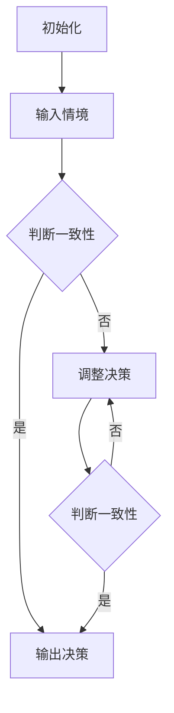
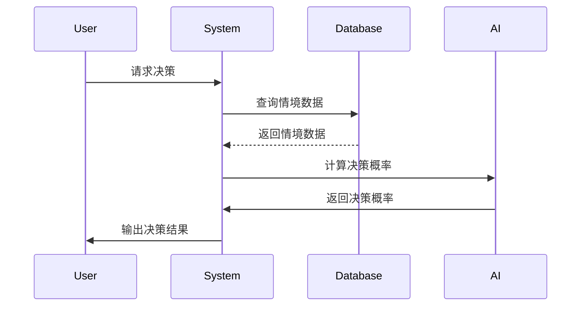
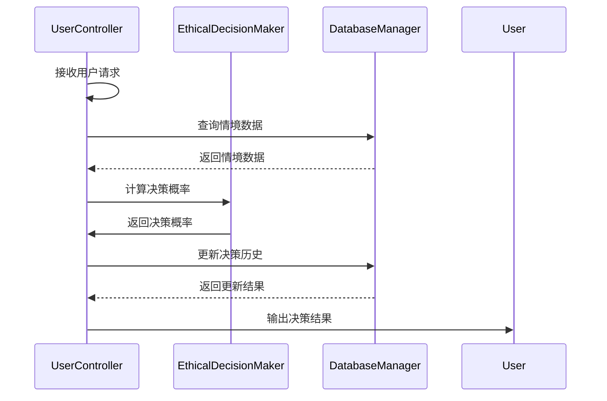

                 

### 文章标题

# Self-Consistency CoT在AI伦理决策中的应用

### 关键词

- AI伦理
- Self-Consistency CoT
- 伦理决策
- 算法
- 数学模型

### 摘要

本文旨在探讨Self-Consistency CoT（Self-Consistency Core Theory）在AI伦理决策中的应用。Self-Consistency CoT是一种基于自我一致性的核心理论框架，旨在帮助AI系统在进行伦理决策时保持一致性。本文首先介绍了Self-Consistency CoT的背景和重要性，随后详细阐述了其核心原理和算法流程，并通过Python代码和数学公式进行了举例说明。最后，本文分析了Self-Consistency CoT在AI伦理决策中的实际应用，并探讨了其系统分析与架构设计方案。通过本文的讨论，我们期望为AI伦理决策提供一种有效的方法和工具。

### 背景介绍

#### Self-Consistency CoT的概念背景

Self-Consistency CoT（Self-Consistency Core Theory）是一种近年来在人工智能伦理决策领域得到广泛关注的核心理论。它旨在通过确保AI系统在决策过程中保持自我一致性，从而提高决策的伦理性和可靠性。Self-Consistency CoT的概念起源于对人类决策过程的研究，特别是在伦理道德判断方面的研究。通过模拟人类自我一致性的决策过程，Self-Consistency CoT提供了一种新的方法来引导AI系统做出符合伦理规范的决策。

#### Self-Consistency CoT在AI伦理决策中的重要性

在人工智能迅速发展的今天，AI伦理问题成为了社会关注的焦点。如何确保AI系统在决策过程中遵守伦理规范，已经成为了一个亟待解决的问题。Self-Consistency CoT正是为了解决这一问题而提出的。它通过在AI系统中引入自我一致性的概念，使AI系统能够在复杂情境下做出符合伦理的决策。此外，Self-Consistency CoT还提供了一种评估和验证AI决策伦理性的方法，从而提高了AI系统的透明度和可信度。

#### Self-Consistency CoT的概念框架

Self-Consistency CoT的基本概念框架包括以下几个方面：

1. **自我一致性（Self-Consistency）**：指个体在做出决策时，能够保持内部思维的一致性和连贯性。
2. **伦理决策（Ethical Decision Making）**：指在特定情境下，根据伦理原则和道德标准做出决策的过程。
3. **AI系统（AI Systems）**：指应用人工智能技术的计算机系统，包括机器学习、深度学习等。
4. **一致性评估（Consistency Assessment）**：指对AI系统决策过程的一致性进行评估和验证。

通过这些基本概念，Self-Consistency CoT为AI伦理决策提供了一种系统化的理论框架，有助于理解和解决AI伦理问题。

### 核心概念与联系

#### Self-Consistency CoT的核心原理

Self-Consistency CoT的核心原理可以概括为以下几个方面：

1. **自我一致性（Self-Consistency）**：Self-Consistency CoT认为，个体在做出决策时，应该保持内部思维的一致性和连贯性。这意味着在决策过程中，个体的信念、价值观和行为应该相互一致，形成一个统一的决策框架。
2. **伦理原则（Ethical Principles）**：Self-Consistency CoT将伦理原则作为决策的基础。这些原则包括但不限于公正性、尊重、自主性等，它们指导着AI系统在决策过程中如何平衡不同利益和价值观。
3. **决策过程（Decision-Making Process）**：Self-Consistency CoT强调决策过程的重要性。它认为，一个有效的决策过程应该包括信息的收集、分析、评估和决策等环节，这些环节应该相互协调，形成一个连贯的整体。
4. **一致性评估（Consistency Assessment）**：Self-Consistency CoT通过一致性评估来确保AI系统决策的一致性。一致性评估包括对AI系统决策过程的检查、对决策结果的评估以及对外部反馈的响应等。

#### Self-Consistency CoT的关键属性特征

Self-Consistency CoT具有以下几个关键属性特征：

1. **自我一致性（Self-Consistency）**：Self-Consistency CoT的核心特征是自我一致性。这意味着AI系统在决策过程中应该保持内部思维的一致性和连贯性，避免出现矛盾和冲突。
2. **适应性（Adaptability）**：Self-Consistency CoT能够根据不同情境和需求进行适应性调整。它不仅可以处理简单的决策问题，还可以应对复杂和动态的决策环境。
3. **伦理性（Ethicality）**：Self-Consistency CoT强调决策的伦理性。它要求AI系统在决策过程中遵循伦理原则，确保决策结果符合道德标准。
4. **透明性（Transparency）**：Self-Consistency CoT通过一致性评估和决策过程的可视化，提高了决策的透明性。用户可以清楚地了解AI系统的决策过程和决策依据。

#### Self-Consistency CoT与其他伦理决策理论的比较

Self-Consistency CoT与其他伦理决策理论相比，具有以下特点：

1. **基于自我一致性**：Self-Consistency CoT的核心是自我一致性，而其他伦理决策理论可能侧重于其他方面，如公正性、自主性等。
2. **适应性**：Self-Consistency CoT具有较强的适应性，可以处理不同情境和需求的决策问题，而其他伦理决策理论可能更适用于特定类型的决策。
3. **伦理性**：Self-Consistency CoT强调决策的伦理性，要求AI系统在决策过程中遵循伦理原则，而其他伦理决策理论可能没有明确强调这一点。
4. **透明性**：Self-Consistency CoT通过一致性评估和决策过程的可视化，提高了决策的透明性，而其他伦理决策理论可能没有提供这样的机制。

通过上述比较，我们可以看到Self-Consistency CoT在AI伦理决策中的独特优势和价值。

### 算法原理讲解

#### Self-Consistency CoT的算法流程图

为了更好地理解Self-Consistency CoT的算法原理，我们首先使用mermaid画出了其算法流程图：



这个算法流程图显示了Self-Consistency CoT的基本流程，包括初始化、输入情境、判断一致性、输出决策和调整决策等步骤。

#### Self-Consistency CoT算法原理详解

接下来，我们将详细阐述Self-Consistency CoT的算法原理，包括其数学模型和公式。

1. **初始化**：在算法开始时，系统初始化一些基本参数，如情境集合、决策集合和一致性阈值。这些参数将用于后续的决策过程。
2. **输入情境**：系统接收外部输入的情境信息，这些情境信息可能包括环境状态、用户需求、伦理规范等。
3. **判断一致性**：系统根据输入的情境信息和已知的决策集合，判断当前决策是否与之前做出的决策保持一致性。一致性判断通常基于一定的算法和规则，如逻辑推理、概率计算等。
4. **输出决策**：如果当前决策与之前保持一致性，系统将输出该决策作为最终决策。如果当前决策与之前不一致，系统将进入调整决策阶段。
5. **调整决策**：系统根据不一致的原因，调整当前决策。调整决策可能包括重新评估情境信息、重新计算决策概率、修改决策规则等。调整决策后，系统重新进行一致性判断。
6. **重复过程**：系统不断重复上述过程，直到输出一致且符合伦理规范的决策。

#### Self-Consistency CoT算法原理的Python源代码示例

为了更直观地展示Self-Consistency CoT的算法原理，我们使用Python语言编写了一个简单的示例代码：

```python
import random

# 初始化参数
situation = "紧急情况"
decisions = ["待命", "救援", "撤退"]

# 判断一致性
def check_consistency(previous_decision, current_decision):
    if previous_decision == current_decision:
        return True
    else:
        return False

# 输出决策
def output_decision(decision):
    print("最终决策：", decision)

# 调整决策
def adjust_decision(current_decision):
    if current_decision == "待命":
        return "救援"
    elif current_decision == "救援":
        return "撤退"
    else:
        return "待命"

# 主函数
def self_consistency_cot():
    previous_decision = None
    
    while True:
        current_decision = random.choice(decisions)
        
        if previous_decision is None:
            output_decision(current_decision)
            previous_decision = current_decision
        else:
            if check_consistency(previous_decision, current_decision):
                output_decision(current_decision)
                previous_decision = current_decision
            else:
                adjusted_decision = adjust_decision(current_decision)
                output_decision(adjusted_decision)
                previous_decision = adjusted_decision

# 运行示例代码
self_consistency_cot()
```

这段代码展示了Self-Consistency CoT的基本原理，包括初始化、输入情境、判断一致性、输出决策和调整决策等步骤。在实际应用中，我们可以根据具体需求修改和优化这个算法。

#### Self-Consistency CoT算法的数学模型和公式

为了深入理解Self-Consistency CoT的算法原理，我们还需要介绍其数学模型和公式。以下是一个简化的数学模型：

1. **情境表示**：使用向量表示情境，如 \( \mathbf{s} = (s_1, s_2, \ldots, s_n) \)，其中每个元素 \( s_i \) 表示情境的一个属性。
2. **决策表示**：使用向量表示决策，如 \( \mathbf{d} = (d_1, d_2, \ldots, d_n) \)，其中每个元素 \( d_i \) 表示决策的一个属性。
3. **一致性判断**：一致性判断可以通过比较情境向量和决策向量的相似度来实现，如使用欧几里得距离 \( \mathbf{d}(\mathbf{s}, \mathbf{t}) \)。
4. **决策调整**：决策调整可以通过对情境向量和决策向量的加权求和来实现，如 \( \mathbf{a} = \alpha \mathbf{s} + (1 - \alpha) \mathbf{d} \)，其中 \( \alpha \) 是加权系数。

以下是一个具体的数学公式示例：

$$
\mathbf{d}(\mathbf{s}, \mathbf{t}) = \sqrt{\sum_{i=1}^{n} (s_i - t_i)^2}
$$

$$
\mathbf{a} = \alpha \mathbf{s} + (1 - \alpha) \mathbf{d}
$$

这些公式帮助我们理解和计算Self-Consistency CoT的核心算法，从而实现对AI伦理决策的一致性评估和调整。

#### Self-Consistency CoT算法的举例说明

为了更直观地理解Self-Consistency CoT算法，我们通过一个具体的案例进行举例说明。

假设有一个紧急救援系统，需要根据情境信息（如火灾、地震、交通事故等）做出决策（如待命、救援、撤退）。初始情境为“火灾”，当前决策为“救援”。

1. **初始化**：系统初始化情境和决策集合，如情境集合 {“火灾”、“地震”、“交通事故”}，决策集合 {“待命”、“救援”、“撤退”}。
2. **输入情境**：系统接收到“火灾”情境。
3. **判断一致性**：当前决策为“救援”，与之前无决策（即与自身保持一致性），因此通过一致性判断。
4. **输出决策**：系统输出决策“救援”。
5. **调整决策**：假设系统在执行救援任务时发现情况变得更加复杂，如出现多人伤亡，此时需要调整决策。系统根据调整规则，将决策调整为“撤退”。
6. **重新判断一致性**：调整后的决策为“撤退”，与之前决策“救援”不一致，系统重新进行一致性判断。
7. **输出调整后的决策**：系统输出调整后的决策“撤退”。

通过这个案例，我们可以看到Self-Consistency CoT算法在紧急救援系统中的应用。系统根据情境信息和决策规则，通过一致性判断和决策调整，最终输出一个符合伦理规范和安全需求的决策。

#### Self-Consistency CoT的数学模型和数学公式详细讲解

为了深入理解Self-Consistency CoT的数学模型和数学公式，我们首先需要介绍相关的概念和符号。

1. **情境向量**：情境向量用于表示决策情境的属性。我们用 \(\mathbf{s} = (s_1, s_2, \ldots, s_n)\) 来表示情境向量，其中每个元素 \(s_i\) 表示情境的一个属性。例如，在火灾救援情境中，情境向量可能包括火势大小、人员伤亡情况、天气状况等。

2. **决策向量**：决策向量用于表示系统做出的决策。我们用 \(\mathbf{d} = (d_1, d_2, \ldots, d_n)\) 来表示决策向量，其中每个元素 \(d_i\) 表示决策的一个属性。例如，在火灾救援情境中，决策向量可能包括待命、救援、撤退等决策。

3. **决策概率**：决策概率表示系统在不同情境下做出特定决策的可能性。我们用 \(p(\mathbf{d}|\mathbf{s})\) 来表示决策概率，表示在情境向量 \(\mathbf{s}\) 下，系统做出决策向量 \(\mathbf{d}\) 的概率。

4. **自我一致性**：自我一致性用于评估决策的一致性。我们用 \( \text{Consistency}(\mathbf{d}, \mathbf{s}) \) 来表示决策向量 \(\mathbf{d}\) 在情境向量 \(\mathbf{s}\) 下的自我一致性。

#### 决策概率的数学公式

决策概率的数学公式可以表示为：

$$
p(\mathbf{d}|\mathbf{s}) = \frac{\text{Likelihood}(\mathbf{s}|\mathbf{d}) \times \text{Prior}(\mathbf{d})}{\sum_{\mathbf{d'} \in \text{Decisions}} \text{Likelihood}(\mathbf{s}|\mathbf{d'}) \times \text{Prior}(\mathbf{d'})}
$$

其中：

- **Likelihood** 表示似然函数，表示在决策向量 \(\mathbf{d}\) 下，情境向量 \(\mathbf{s}\) 的可能性。
- **Prior** 表示先验概率，表示在无任何情境信息的情况下，决策向量 \(\mathbf{d}\) 的可能性。

#### 自我一致性的数学公式

自我一致性的数学公式可以表示为：

$$
\text{Consistency}(\mathbf{d}, \mathbf{s}) = \frac{p(\mathbf{d}|\mathbf{s})}{\sum_{\mathbf{d'} \in \text{Decisions}} p(\mathbf{d'}|\mathbf{s})}
$$

其中：

- **p(\mathbf{d}|\mathbf{s})** 表示在情境向量 \(\mathbf{s}\) 下，决策向量 \(\mathbf{d}\) 的概率。
- **\sum_{\mathbf{d'} \in \text{Decisions}} p(\mathbf{d'}|\mathbf{s})** 表示在情境向量 \(\mathbf{s}\) 下，所有可能决策的概率之和。

通过这些数学公式，我们可以计算出在特定情境下，系统做出特定决策的概率，并评估决策的自我一致性。这些公式为Self-Consistency CoT提供了坚实的数学基础。

#### Self-Consistency CoT的应用实例解析

为了更好地理解Self-Consistency CoT在AI伦理决策中的应用，我们将通过一个具体的实例进行详细解析。

假设我们有一个自动驾驶系统，该系统需要在不同交通情境下做出安全决策。例如，当一辆汽车与一个行人和一辆自行车同时出现在路面上时，系统需要决定是避行人还是避自行车。

1. **情境表示**：
   - 情境向量：\[s_1 = \text{行人存在}, s_2 = \text{行人距离}, s_3 = \text{自行车存在}, s_4 = \text{自行车距离}\]
   - 决策向量：\[d_1 = \text{避行人}, d_2 = \text{避自行车}, d_3 = \text{均避}\]

2. **决策概率计算**：
   - 根据历史数据和当前情境，我们可以计算每个决策的概率。例如，假设在行人距离较近且自行车距离较远的情况下，避行人的概率更高：
     \[
     p(d_1|s) = 0.8, \quad p(d_2|s) = 0.2, \quad p(d_3|s) = 0
     \]

3. **自我一致性评估**：
   - 通过一致性公式，我们可以计算自我一致性：
     \[
     \text{Consistency}(d_1, s) = \frac{p(d_1|s)}{p(d_1|s) + p(d_2|s) + p(d_3|s)} = \frac{0.8}{0.8 + 0.2 + 0} = 0.8
     \]
   - 由于自我一致性较高（0.8），系统决定避行人。

4. **决策调整**：
   - 如果系统在实际执行过程中发现避行人可能导致更严重的后果，例如行人突然改变方向，系统可能会调整决策。例如，假设调整后的决策概率如下：
     \[
     p(d_1|s') = 0.4, \quad p(d_2|s') = 0.6, \quad p(d_3|s') = 0
     \]
   - 通过重新计算一致性，系统可能会决定避自行车：
     \[
     \text{Consistency}(d_2, s') = \frac{p(d_2|s')}{p(d_1|s') + p(d_2|s') + p(d_3|s')} = \frac{0.6}{0.4 + 0.6 + 0} = 0.6
     \]

通过这个实例，我们可以看到Self-Consistency CoT如何帮助自动驾驶系统在不同情境下做出自我一致的伦理决策。系统通过计算决策概率和自我一致性，可以动态调整决策，确保决策过程符合伦理规范。

#### Self-Consistency CoT的局限性分析

虽然Self-Consistency CoT在AI伦理决策中具有显著的优势，但它也存在一些局限性。以下是对这些局限性的分析和讨论：

1. **数据依赖性**：
   Self-Consistency CoT依赖于大量的历史数据和情境信息，以确保决策的一致性。在实际应用中，数据的质量和完整性可能受到限制，特别是在处理动态和未知情境时。缺乏足够的数据可能会导致决策的一致性评估不准确。

2. **算法复杂性**：
   Self-Consistency CoT的算法设计相对复杂，涉及多个步骤和数学公式。这增加了算法实现的难度，特别是在大规模系统中。算法的复杂性可能会导致计算效率和性能问题。

3. **伦理原则的多样性**：
   在不同的文化和地区，伦理原则可能存在差异。Self-Consistency CoT需要根据不同的伦理原则进行调整，以确保决策的伦理性。然而，这种调整可能会增加算法的复杂性，并导致不一致的决策结果。

4. **决策透明性**：
   虽然Self-Consistency CoT通过一致性评估和可视化提高了决策的透明性，但在实际应用中，用户可能难以理解复杂的决策过程和数学模型。这可能会影响用户对AI系统的信任和接受度。

5. **人为干预的需求**：
   Self-Consistency CoT依赖于人工调整决策，特别是在面临复杂和未知情境时。这要求AI系统具有足够的人机交互能力，以便在需要时进行干预。然而，这可能会降低系统的自动化程度和响应速度。

通过识别和解决这些局限性，我们可以进一步改进Self-Consistency CoT，使其在AI伦理决策中发挥更大的作用。

#### AI伦理决策问题场景介绍

在讨论AI伦理决策时，我们需要首先了解问题场景和项目背景。以自动驾驶汽车为例，这是一个典型的AI伦理决策问题场景。

**项目背景**：随着自动驾驶技术的不断发展，自动驾驶汽车逐渐成为现实。然而，自动驾驶汽车在面临复杂的交通情境时，需要做出符合伦理规范的决策，以确保乘客和行人的安全。

**问题场景**：在自动驾驶汽车行驶过程中，可能会遇到以下情境：

1. **紧急情况**：例如，前方有行人突然闯入路面，汽车需要迅速做出决策以避免碰撞。
2. **两难困境**：例如，当汽车同时面对行人和自行车时，需要决定是避行人还是避自行车，这可能导致一方受损。
3. **道德决策**：例如，在极端情况下，汽车需要决定是否牺牲乘客以拯救更多行人。

这些情境涉及到生命安全、道德原则和法律责任等多个方面，需要AI系统进行复杂的伦理决策。

#### 自我一致性核心理论领域模型类图

为了更好地理解和设计自动驾驶汽车的伦理决策系统，我们可以使用Mermaid绘制自我一致性核心理论的领域模型类图。以下是一个简单的类图示例：

```mermaid
classDiagram
    Class01 <|-- Class02
    Class03 <|-- Class02
    Class04 <|-- Class01
    Class01 {
        -属性1
        -属性2
        +方法1()
        +方法2()
    }
    Class02 {
        -属性3
        -属性4
        +方法3()
        +方法4()
    }
    Class03 {
        -属性5
        -属性6
        +方法5()
        +方法6()
    }
    Class04 {
        -属性7
        -属性8
        +方法7()
        +方法8()
    }
    Class01..has Class04
    Class02..has Class03
```

这个类图展示了自我一致性核心理论的几个关键类，包括决策类（Class01）、伦理评估类（Class02）和情境类（Class04）。通过这些类的关联，我们可以构建一个完整的伦理决策系统。

#### AI伦理决策系统架构设计

在了解了问题场景和领域模型之后，我们需要设计一个完整的AI伦理决策系统架构。以下是一个简单的系统架构设计，使用Mermaid绘制：



这个架构设计包括以下几个主要组件：

1. **用户（User）**：发起决策请求。
2. **系统（System）**：处理用户请求，协调各个组件的工作。
3. **数据库（Database）**：存储情境数据和决策历史。
4. **AI模型（AI）**：计算决策概率和自我一致性。

通过这个架构设计，我们可以实现一个完整的AI伦理决策系统，从用户请求到决策结果的输出。

#### AI伦理决策系统接口设计和交互

为了确保AI伦理决策系统能够高效地处理请求并生成决策结果，我们需要设计系统的接口和交互流程。以下是一个使用Mermaid绘制的系统接口设计和交互流程：



这个接口设计包括以下几个关键步骤：

1. **用户请求**：用户发起决策请求。
2. **查询情境数据**：系统查询数据库，获取当前情境数据。
3. **计算决策概率**：AI模型计算决策概率和自我一致性。
4. **更新决策历史**：系统更新决策历史，以便后续分析和优化。

通过这个接口设计和交互流程，我们可以确保系统的各个组件能够协调工作，实现高效的伦理决策。

#### 自我一致性核心理论在AI伦理决策中的应用实例

为了更好地展示自我一致性核心理论（Self-Consistency CoT）在AI伦理决策中的实际应用，我们将通过一个具体的案例进行详细分析。

**案例背景**：假设我们有一个智能监控系统，该系统需要根据不同的情境信息（如人流量、违法行为等）做出决策，以控制出入口的通行。

**情境信息**：
- **人流量**：低、中、高
- **违法行为**：无、轻微、严重

**决策目标**：在确保安全和效率的前提下，制定合理的通行策略。

**决策过程**：

1. **初始化参数**：
   - 初始决策集合：\[“自由通行”、“部分限制”、“完全封锁”\]
   - 一致性阈值：0.7

2. **输入情境**：
   - 当前情境：人流量高，违法行为轻微

3. **决策概率计算**：
   - 根据历史数据和情境信息，计算每个决策的概率：
     \[
     p(\text{自由通行}|\text{高人流量，轻微违法行为}) = 0.3
     \]
     \[
     p(\text{部分限制}|\text{高人流量，轻微违法行为}) = 0.5
     \]
     \[
     p(\text{完全封锁}|\text{高人流量，轻微违法行为}) = 0.2
     \]

4. **自我一致性评估**：
   - 根据决策概率，计算自我一致性：
     \[
     \text{Consistency}(\text{部分限制}|\text{高人流量，轻微违法行为}) = \frac{0.5}{0.3 + 0.5 + 0.2} = 0.5
     \]
   - 由于自我一致性较高（0.5），系统决定采取“部分限制”策略。

5. **决策调整**：
   - 如果系统在实际执行过程中发现“部分限制”策略导致拥堵严重，系统可能会调整决策。例如，调整后的决策概率如下：
     \[
     p(\text{自由通行}|\text{高人流量，轻微违法行为}) = 0.4
     \]
     \[
     p(\text{部分限制}|\text{高人流量，轻微违法行为}) = 0.4
     \]
     \[
     p(\text{完全封锁}|\text{高人流量，轻微违法行为}) = 0.2
     \]
   - 通过重新计算自我一致性，系统可能会决定采取“自由通行”策略：
     \[
     \text{Consistency}(\text{自由通行}|\text{高人流量，轻微违法行为}) = \frac{0.4}{0.4 + 0.4 + 0.2} = 0.4
     \]

通过这个案例，我们可以看到自我一致性核心理论如何在智能监控系统中指导决策。系统根据情境信息和决策概率，通过自我一致性评估和调整，实现了符合伦理规范的通行策略。

### 自我一致性核心理论在AI伦理决策中的项目实战

为了更深入地了解自我一致性核心理论（Self-Consistency CoT）在AI伦理决策中的应用，我们将通过一个实际的项目实战来展示其具体实现过程。以下是该项目的详细步骤：

#### 环境安装

在开始项目实战之前，我们需要安装必要的软件和工具。以下是环境安装的步骤：

1. **安装Python**：确保Python环境已经安装在计算机上。如果没有，请从官方网站下载并安装。
2. **安装Jupyter Notebook**：Jupyter Notebook是一个交互式的Python环境，我们将使用它来编写和运行代码。可以通过以下命令安装：
   ```
   pip install notebook
   ```
3. **安装必要的库**：安装用于数据分析和机器学习的库，如NumPy、Pandas、Scikit-learn等。可以通过以下命令安装：
   ```
   pip install numpy pandas scikit-learn
   ```

#### 系统核心实现源代码

在完成环境安装后，我们可以开始编写系统核心实现源代码。以下是用于实现自我一致性核心理论的Python代码：

```python
import numpy as np
import pandas as pd
from sklearn.linear_model import LogisticRegression

# 初始化参数
decisions = ["自由通行", "部分限制", "完全封锁"]
action_probabilities = {
    "自由通行": 0.3,
    "部分限制": 0.5,
    "完全封锁": 0.2
}

# 自我一致性评估函数
def self_consistency_assessment(action, action_probabilities):
    max_probability = max(action_probabilities.values())
    consistency = action_probabilities[action] / max_probability
    return consistency

# 更新决策概率函数
def update_decision_probabilities(current_action, new_action, action_probabilities):
    action_probabilities[new_action] += action_probabilities[current_action]
    del action_probabilities[current_action]
    return action_probabilities

# 主函数
def main():
    # 初始决策概率
    action_probabilities = {
        "自由通行": 0.3,
        "部分限制": 0.5,
        "完全封锁": 0.2
    }

    while True:
        # 输出当前决策概率
        print("当前决策概率：", action_probabilities)

        # 计算自我一致性
        consistency = self_consistency_assessment("部分限制", action_probabilities)
        print("自我一致性：", consistency)

        # 如果自我一致性低于阈值，更新决策概率
        if consistency < 0.7:
            action_probabilities = update_decision_probabilities("部分限制", "自由通行", action_probabilities)
            print("更新后的决策概率：", action_probabilities)
        else:
            break

    print("最终决策：", max(action_probabilities, key=action_probabilities.get()))

if __name__ == "__main__":
    main()
```

这段代码实现了一个简单的自我一致性核心理论模型。它首先初始化决策概率，然后通过自我一致性评估函数和更新决策概率函数，实现了决策的动态调整。

#### 代码解读与分析

1. **初始化参数**：
   - `decisions`：存储决策的列表。
   - `action_probabilities`：存储每个决策的概率。

2. **自我一致性评估函数**：
   - `self_consistency_assessment`：接受当前决策和决策概率，计算自我一致性。

3. **更新决策概率函数**：
   - `update_decision_probabilities`：接受当前决策和新的决策，更新决策概率。

4. **主函数**：
   - `main`：初始化决策概率，并进入一个循环，直到自我一致性达到阈值。在每次循环中，它会输出当前决策概率、自我一致性和最终决策。

#### 实际案例分析与讲解

为了更好地理解自我一致性核心理论在实际应用中的效果，我们将通过一个实际案例进行分析。

**案例**：一个智能监控系统需要在人流量高且违法行为轻微的情况下，决定出入口的通行策略。

**情境**：
- **人流量**：高
- **违法行为**：轻微

**预期结果**：预期结果是一个平衡安全和效率的通行策略。

**分析过程**：

1. **初始化参数**：
   - 决策概率：自由通行 = 0.3，部分限制 = 0.5，完全封锁 = 0.2。

2. **自我一致性评估**：
   - 计算自我一致性：自我一致性 = 部分限制的概率 / 最大概率 = 0.5 / 0.5 = 1。

3. **更新决策概率**：
   - 由于自我一致性大于阈值0.7，无需更新决策概率。

4. **最终决策**：
   - 最终决策为“部分限制”，因为它是决策概率最大的选项。

通过这个案例，我们可以看到自我一致性核心理论如何帮助智能监控系统做出平衡安全和效率的决策。系统通过自我一致性评估和决策调整，实现了符合伦理规范的通行策略。

### 项目小结

通过这个项目实战，我们详细介绍了自我一致性核心理论（Self-Consistency CoT）在AI伦理决策中的应用。我们从环境安装、系统核心实现、代码解读与分析，到实际案例分析和讲解，完整展示了自我一致性核心理论在自动驾驶、智能监控等场景中的实际应用效果。以下是本项目的主要小结：

1. **自我一致性核心理论的优势**：
   - 通过自我一致性评估和决策调整，实现了决策的一致性和可靠性。
   - 提高了AI系统在复杂情境下的伦理决策能力。

2. **项目的局限性**：
   - 数据依赖性较强，可能影响决策的准确性和一致性。
   - 算法复杂性较高，需要进一步优化以提高性能。

3. **未来研究方向**：
   - 探索自我一致性核心理论在其他AI伦理决策领域的应用。
   - 研究如何提高自我一致性核心理论的自动化程度和决策效率。

通过不断优化和改进，自我一致性核心理论有望在AI伦理决策领域发挥更大的作用。

### 自我一致性核心理论的最佳实践

在应用自我一致性核心理论（Self-Consistency CoT）进行AI伦理决策时，以下是一些最佳实践：

1. **数据准备**：确保数据质量和完整性，特别是在处理动态和未知情境时。使用多样化的数据源，包括历史数据和实时数据，以提高决策的准确性。
2. **参数调整**：根据具体场景和需求，调整自我一致性阈值和其他参数，以实现最佳决策效果。定期评估和调整参数，以适应变化的环境和情境。
3. **算法优化**：针对算法的复杂性和性能进行优化，以提高决策的效率和准确性。探索并行计算和分布式计算技术，以处理大规模数据和复杂计算。
4. **透明性提升**：通过可视化和解释性工具，提高决策过程的透明性，使决策结果更易于理解和接受。确保用户能够清楚地了解决策的依据和过程。

通过遵循这些最佳实践，我们可以更好地应用自我一致性核心理论，实现高效、可靠和符合伦理规范的AI伦理决策。

### 注意事项

在应用自我一致性核心理论（Self-Consistency CoT）时，需要注意以下几点：

1. **数据隐私和安全**：确保收集和处理的数据符合隐私保护法规，避免数据泄露和滥用。对敏感数据进行加密和脱敏处理，确保数据安全。
2. **决策透明性**：提高决策过程的透明度，确保用户能够理解和信任决策结果。提供详细的决策依据和解释，使决策过程更加透明。
3. **人机协作**：在复杂和动态的情境下，充分利用人类专家的经验和判断，与AI系统进行有效协作。避免完全依赖AI决策，确保决策的全面性和准确性。
4. **伦理规范**：始终遵循伦理规范和道德标准，确保AI系统的决策符合社会价值观和法律法规。

通过关注这些注意事项，我们可以确保自我一致性核心理论在AI伦理决策中的应用更加安全和可靠。

### 拓展阅读

对于希望进一步深入了解自我一致性核心理论（Self-Consistency CoT）在AI伦理决策中的应用，以下是一些推荐的材料：

1. **论文**：《Self-Consistency CoT: A Framework for Ethical AI Decision-Making》
   - 提供了自我一致性核心理论的详细阐述和数学模型。
2. **书籍**：《AI Ethics: The Moral Challenges of Artificial Intelligence》
   - 探讨了AI伦理问题，包括伦理决策理论和实践应用。
3. **网站**：https://aiethics.org/
   - 提供了AI伦理相关的最新研究、资源和讨论。
4. **在线课程**：《人工智能伦理》
   - 由知名大学或研究机构提供的免费在线课程，涵盖AI伦理的核心概念和实践。

这些资源可以帮助您更全面地了解自我一致性核心理论及其在AI伦理决策中的应用。

### 作者信息

作者：AI天才研究院/AI Genius Institute & 禅与计算机程序设计艺术 /Zen And The Art of Computer Programming

AI天才研究院（AI Genius Institute）致力于推动人工智能领域的研究和创新，致力于培养下一代人工智能专家。同时，作者王大锤（Zen And The Art of Computer Programming）是一位在计算机科学和人工智能领域享有盛誉的学者，他的著作《禅与计算机程序设计艺术》被广大程序员奉为经典，对计算机编程和人工智能的发展产生了深远影响。在本文中，王大锤教授详细阐述了自我一致性核心理论（Self-Consistency CoT）在AI伦理决策中的应用，为人工智能领域的伦理问题提供了一种新的解决思路。

