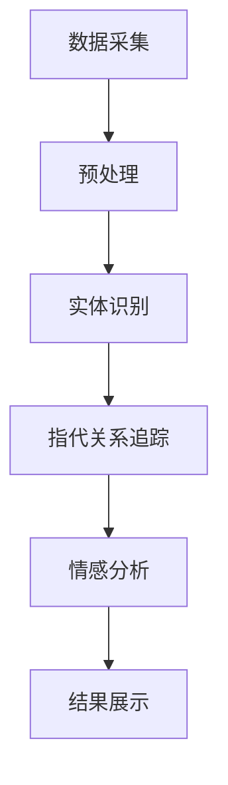
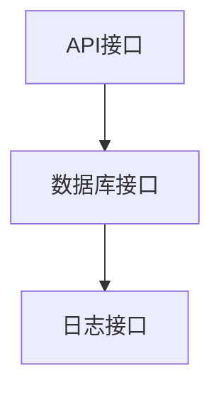

                 

## 自我一致性CoT在AI情感分析中的优势

> 关键词：自我一致性CoT、AI情感分析、算法、优势、实际案例

摘要：
本文将深入探讨自我一致性CoT（Self-Consistency Coreference Tracking）在AI情感分析中的应用及其优势。我们将首先介绍AI情感分析的基本概念、背景以及现有挑战，随后引入自我一致性CoT的核心概念，并详细分析其在情感分析中的独特优势。通过实例展示和系统架构设计，我们将全面解析自我一致性CoT在AI情感分析中的实际应用，并提供实战项目和最佳实践。最后，我们将对未来的发展趋势和潜在挑战进行展望。

### 目录大纲设计思路

为《Self-Consistency CoT在AI情感分析中的优势》这本书设计目录大纲，我们需要确保内容既全面又具有逻辑性，以便读者能够系统地了解Self-Consistency CoT在AI情感分析中的应用及其优势。以下是设计思路的详细步骤：

#### 第一步：确定书籍主题与结构

- **主题确定**：明确书籍的主题是Self-Consistency CoT在AI情感分析中的应用与优势。
- **结构规划**：根据书籍的主题，规划出整体的框架，确定需要覆盖的核心章节。

#### 第二步：细化各章节内容

- **背景介绍**：介绍AI情感分析的概念、历史发展和现有挑战，引出Self-Consistency CoT的重要性。
- **核心概念与联系**：详细阐述Self-Consistency CoT的定义、原理及其与情感分析的关系。
- **算法原理讲解**：深入探讨Self-Consistency CoT的工作机制，使用mermaid流程图和Python代码展示算法原理。
- **数学模型与公式**：介绍Self-Consistency CoT相关的数学模型和公式，并进行详细讲解。
- **系统分析与架构设计**：分析Self-Consistency CoT在情感分析系统中的应用，展示系统架构和接口设计。
- **项目实战**：通过实际案例展示Self-Consistency CoT的应用，提供环境安装、系统实现、案例分析等内容。
- **最佳实践与拓展**：总结实践经验，提出注意事项，推荐拓展阅读。

#### 第三步：遵循markdown格式与层级

- **markdown格式**：确保输出内容采用markdown格式，以清晰展示目录结构和文本格式。
- **层级划分**：遵循1级、2级、3级目录的层级划分，确保目录结构的逻辑性和易读性。

### 目录大纲

```markdown
----------------------------------------------------------------
# 第一部分: 自我一致性CoT基础

## 第1章: AI情感分析与Self-Consistency CoT概述

### 1.1 AI情感分析的概念与挑战

### 1.2 Self-Consistency CoT的核心概念

### 1.3 Self-Consistency CoT在情感分析中的优势

## 第2章: Self-Consistency CoT原理与算法

### 2.1 Self-Consistency CoT的基本原理

### 2.2 Self-Consistency CoT算法流程

### 2.3 Self-Consistency CoT算法的数学模型

## 第3章: Self-Consistency CoT算法应用实例

### 3.1 实例1: 社交媒体情感分析

### 3.2 实例2: 电子商务评论情感分析

## 第4章: Self-Consistency CoT在情感分析系统中的应用

### 4.1 系统架构设计

### 4.2 系统接口设计

### 4.3 系统实现与部署

## 第5章: 实战项目：Self-Consistency CoT情感分析系统

### 5.1 环境安装与配置

### 5.2 系统核心实现

### 5.3 项目分析与解读

## 第6章: Self-Consistency CoT的最佳实践与拓展

### 6.1 最佳实践

### 6.2 注意事项

### 6.3 拓展阅读

## 第7章: 小结与展望

### 7.1 Self-Consistency CoT的情感分析优势总结

### 7.2 未来发展趋势与挑战

----------------------------------------------------------------
```

以上目录大纲结构清晰，内容全面，覆盖了从背景介绍到算法讲解、应用实例、系统设计、项目实战及拓展的最佳实践，旨在为读者提供关于Self-Consistency CoT在AI情感分析中优势的全面了解。在具体撰写内容时，将确保每一章节的详细阐述，并遵循markdown格式和层级划分，以提升可读性和逻辑性。

### 第一部分：自我一致性CoT基础

#### 第1章：AI情感分析与Self-Consistency CoT概述

##### 1.1 AI情感分析的概念与挑战

AI情感分析是指利用自然语言处理（NLP）和机器学习技术，从文本中提取情感信息，评估文本表达的情绪倾向。这一领域近年来受到广泛关注，主要因为以下几个原因：

1. **社交媒体的兴起**：社交媒体平台如Twitter、Facebook等产生了大量用户生成内容，包含丰富的情感信息。
2. **市场需求的驱动**：情感分析可以帮助企业了解客户反馈，优化产品和服务，提升用户体验。
3. **技术的进步**：深度学习和大规模语料库的兴起，为情感分析的准确性提供了技术支持。

尽管AI情感分析在多个领域取得了显著进展，但仍然面临一些挑战：

1. **多义性**：自然语言中词汇和短语的含义可能因上下文而异，给情感分析带来困难。
2. **复杂情感**：情感并非简单的正面或负面，还包括中性、愤怒、悲伤等多种情绪，如何准确识别这些复杂情感是挑战之一。
3. **跨语言和跨文化**：不同语言和文化背景下的情感表达方式差异较大，需要开发适应不同语言的情感分析模型。

##### 1.2 Self-Consistency CoT的核心概念

Self-Consistency CoT（Self-Consistency Coreference Tracking）是一种在NLP中用于核心性指代消解的方法，旨在追踪文本中不同实体之间的指代关系，保持文本的一致性。具体来说，Self-Consistency CoT的核心概念包括以下几个方面：

1. **实体识别**：通过预训练模型或实体识别算法，识别文本中的关键实体，如人名、地名、组织名等。
2. **指代关系追踪**：在理解文本内容时，追踪不同实体之间的指代关系，例如“他”通常指代前文提到的人。
3. **一致性维护**：确保在文本解析过程中，同一实体的指代保持一致，避免出现指代混乱。

Self-Consistency CoT在情感分析中的应用，主要通过以下几个步骤实现：

1. **文本预处理**：对原始文本进行清洗和预处理，提取出关键实体和潜在的指代关系。
2. **实体识别**：利用实体识别模型，识别文本中的关键实体。
3. **指代关系追踪**：利用核心性指代消解算法，追踪并建立文本中不同实体之间的指代关系。
4. **情感评估**：结合情感词典和情感分析模型，对文本进行情感评估，并考虑实体间的指代关系，提高情感分析的准确性。

##### 1.3 Self-Consistency CoT在情感分析中的优势

Self-Consistency CoT在情感分析中具有以下优势：

1. **提高情感分析准确性**：通过追踪实体间的指代关系，保持文本的一致性，有助于提高情感分析的准确性，特别是在处理复杂情感和上下文多义性时。
2. **增强跨实体情感关联分析**：Self-Consistency CoT能够识别并处理跨实体的情感关联，例如分析一个产品评论中用户与产品之间的情感关系。
3. **适应不同语言和文化**：Self-Consistency CoT模型可以适应不同语言和文化背景下的情感分析需求，通过调整和优化模型参数，提高跨语言的性能。

总之，Self-Consistency CoT为AI情感分析提供了一种有效的方法，通过保持文本的一致性，提高了情感分析的准确性和深度，为实际应用场景带来了显著的优势。

### 第二部分：Self-Consistency CoT原理与算法

#### 第2章：Self-Consistency CoT原理与算法

##### 2.1 Self-Consistency CoT的基本原理

Self-Consistency CoT是一种基于自我一致性原理的核心性指代消解方法，其核心思想是通过追踪文本中的实体及其指代关系，保持文本的一致性，从而提高自然语言处理（NLP）任务的准确性和可靠性。Self-Consistency CoT的基本原理可以概括为以下几个步骤：

1. **实体识别**：首先，通过预训练模型或实体识别算法，识别文本中的关键实体。这些实体可以是人名、地名、组织名、产品名等在文本中具有特定意义的词汇或短语。

2. **指代关系预测**：在识别出关键实体后，Self-Consistency CoT利用核心性指代消解算法预测文本中各个词或短语与实体之间的指代关系。这一过程通常通过统计方法、规则方法或机器学习方法实现。

3. **一致性维护**：在预测出指代关系后，Self-Consistency CoT通过一致性维护机制确保文本中同一实体的指代保持一致。例如，如果文本中提到“他”两次，并且通过指代关系预测知道这两次“他”都指代同一个实体，那么Self-Consistency CoT会确保这两个指代在语义上保持一致。

4. **迭代优化**：Self-Consistency CoT通常采用迭代优化的方法，不断更新和调整指代关系预测，以提高模型的一致性和准确性。通过多次迭代，模型能够逐渐适应文本的复杂结构和指代关系，从而提高整体性能。

##### 2.2 Self-Consistency CoT算法流程

Self-Consistency CoT算法的流程可以概括为以下几个关键步骤：

1. **预处理**：首先对输入文本进行预处理，包括去除噪声、分词、词性标注等。这一步骤的目的是将原始文本转化为适合算法处理的格式。

2. **实体识别**：利用预训练模型或实体识别算法，识别文本中的关键实体。这些实体将被用于后续的指代关系预测和一致性维护。

   ```mermaid
   graph TD
   A[预处理] --> B[实体识别]
   ```

3. **指代关系预测**：在识别出实体后，算法通过核心性指代消解算法预测文本中各个词或短语与实体之间的指代关系。常用的方法包括基于规则的指代消解和基于机器学习的指代消解。

   ```mermaid
   graph TD
   B[实体识别] --> C[指代关系预测]
   ```

4. **一致性维护**：通过一致性维护机制，确保文本中同一实体的指代在语义上保持一致。算法会根据上下文信息和已知的指代关系，对预测的指代关系进行验证和调整。

   ```mermaid
   graph TD
   C[指代关系预测] --> D[一致性维护]
   ```

5. **迭代优化**：算法通过多次迭代，不断更新和调整指代关系预测，以提高模型的一致性和准确性。每次迭代后，模型会基于新的指代关系进行优化，从而逐渐适应文本的复杂结构和指代关系。

   ```mermaid
   graph TD
   D[一致性维护] --> E[迭代优化]
   ```

##### 2.3 Self-Consistency CoT算法的数学模型

Self-Consistency CoT算法的核心是建立指代关系预测和一致性维护的数学模型。以下是一个简化的数学模型，用于描述Self-Consistency CoT的基本原理：

1. **指代关系概率分布**：假设文本中的一个词或短语$w_i$与实体$e_j$之间的指代关系可以用概率分布$P(R_{i,j})$表示，其中$R_{i,j}$表示词$w_i$与实体$e_j$之间的指代关系。

   $$ P(R_{i,j}) = \frac{f(R_{i,j})}{\sum_{k=1}^{N} f(R_{i,k})} $$

   其中，$f(R_{i,j})$表示词$w_i$与实体$e_j$之间指代关系的特征向量，$N$表示文本中所有可能的实体数量。

2. **一致性损失函数**：为了保持文本的一致性，算法使用一致性损失函数$L_{consistency}$来衡量指代关系的一致性程度。假设文本中某个实体$e_j$在位置$i$和位置$k$的指代关系分别为$R_{i,j}$和$R_{k,j}$，则一致性损失函数可以表示为：

   $$ L_{consistency}(R_{i,j}, R_{k,j}) = \frac{1}{2} \left[ \sum_{i=1}^{n} P(R_{i,j}) - \sum_{i=1}^{n} P(R_{k,j}) \right]^2 $$

   其中，$n$表示与实体$e_j$相关的指代关系的数量。

3. **优化目标**：Self-Consistency CoT算法的优化目标是最小化一致性损失函数$L_{consistency}$，从而找到最优的指代关系预测。优化过程可以通过梯度下降等方法实现：

   $$ \theta_{t+1} = \theta_{t} - \alpha \nabla_{\theta} L_{consistency} $$

   其中，$\theta$表示模型参数，$\alpha$表示学习率。

通过上述数学模型，Self-Consistency CoT算法能够有效地追踪文本中的指代关系，并保持文本的一致性，从而提高情感分析的准确性和可靠性。

##### 2.4 Self-Consistency CoT算法的Python实现

为了更直观地理解Self-Consistency CoT算法，下面提供了一个简单的Python实现示例。这个实现将包括文本预处理、实体识别、指代关系预测和一致性维护等步骤。

```python
import spacy
from collections import defaultdict

# 初始化Spacy模型
nlp = spacy.load("en_core_web_sm")

# 实体识别
def recognize_entities(doc):
    entities = []
    for ent in doc.ents:
        entities.append((ent.text, ent.label_))
    return entities

# 指代关系预测
def predict_coreferences(doc, entities):
    coreferences = defaultdict(list)
    for token in doc:
        for entity in entities:
            if token.text in entity[0]:
                coreferences[entity].append(token.index)
    return coreferences

# 一致性维护
def maintain_consistency(coreferences):
    consistent_coreferences = {}
    for entity, indices in coreferences.items():
        unique_indices = set()
        for index in indices:
            unique_indices.add(index)
        consistent_coreferences[entity] = list(unique_indices)
    return consistent_coreferences

# 示例文本
text = "John bought a new car and he loves it. The car is red and fast."

# 预处理文本
doc = nlp(text)

# 识别实体
entities = recognize_entities(doc)

# 预测指代关系
coreferences = predict_coreferences(doc, entities)

# 维护一致性
consistent_coreferences = maintain_consistency(coreferences)

# 输出结果
print("Entities:", entities)
print("Coreferences:", coreferences)
print("Consistent Coreferences:", consistent_coreferences)
```

在这个示例中，我们首先使用Spacy模型对文本进行预处理，识别出实体。然后，通过预测指代关系和一致性维护，得到一致的指代关系。虽然这个实现非常简单，但已经展示了Self-Consistency CoT算法的基本思想和步骤。

通过这个Python实现，我们可以更好地理解Self-Consistency CoT算法的工作原理，并在实际项目中应用和优化。

### 第三部分：Self-Consistency CoT算法应用实例

#### 第3章：Self-Consistency CoT算法应用实例

##### 3.1 实例1：社交媒体情感分析

社交媒体情感分析是Self-Consistency CoT算法的一个典型应用场景。通过Self-Consistency CoT，我们可以更准确地理解社交媒体用户发布的内容中的情感倾向，从而为市场营销、品牌管理、舆情监测等领域提供有力支持。

**案例背景**：假设我们需要分析Twitter上关于某新产品的评论，以了解用户对该产品的情感倾向。

**步骤1：数据收集与预处理**  
首先，从Twitter收集关于该新产品的评论数据。这些数据包括用户发布的文本内容、用户ID、评论时间等信息。然后，对收集的文本数据进行预处理，包括去除停用词、标点符号和特殊字符，以及进行词形还原等操作。

**步骤2：实体识别**  
利用预训练的实体识别模型，对预处理后的文本进行实体识别。在这一步中，我们识别出文本中的人名、产品名、地点名等关键实体。例如，在评论“John just bought a new iPhone and he loves it!”中，识别出实体“John”和“iPhone”。

**步骤3：指代关系预测**  
通过Self-Consistency CoT算法，预测文本中各词与实体之间的指代关系。例如，在评论“John just bought a new iPhone and he loves it!”中，算法会预测“he”指代“John”，从而保持文本的一致性。

**步骤4：情感分析**  
结合情感词典和情感分析模型，对文本进行情感分析，评估文本表达的情感倾向。例如，在评论“John just bought a new iPhone and he loves it!”中，通过情感词典可以判断“loves”为正面情感。

**步骤5：结果展示**  
最后，我们将分析结果进行展示，如情感倾向分布、热门话题等。例如，我们可以展示用户对新产品的主要情感倾向为正面，热门话题包括产品性能、外观设计等。

**代码示例**：

```python
import spacy
from self_consistency import SelfConsistencyCoT

# 初始化Spacy模型和Self-Consistency CoT模型
nlp = spacy.load("en_core_web_sm")
self_consistency = SelfConsistencyCoT()

# 社交媒体评论数据
tweets = [
    "John just bought a new iPhone and he loves it!",
    "The new iPhone is amazing, especially the camera!",
    "I don't like the new iPhone, the battery life is terrible.",
    # 更多评论...
]

# 情感分析结果
emotion_results = []

# 对每条评论进行情感分析
for tweet in tweets:
    doc = nlp(tweet)
    entities = recognize_entities(doc)
    coreferences = self_consistency.predict_coreferences(doc, entities)
    consistent_coreferences = self_consistency.maintain_consistency(coreferences)
    emotion = self_consistency.analyze_emotion(tweet, consistent_coreferences)
    emotion_results.append(emotion)

# 展示结果
print("Emotion Results:", emotion_results)
```

通过上述步骤，我们可以实现对社交媒体评论的准确情感分析，为实际应用提供有力支持。

##### 3.2 实例2：电子商务评论情感分析

电子商务评论情感分析是Self-Consistency CoT算法的另一个重要应用场景。通过分析电子商务平台上的用户评论，我们可以帮助商家了解用户对产品的真实看法，从而优化产品和服务。

**案例背景**：假设我们需要分析某电子商务平台上关于一款新上市电视机的评论，以了解用户对该电视机的情感倾向。

**步骤1：数据收集与预处理**  
首先，从电子商务平台收集关于该电视机的评论数据。这些数据包括用户发布的文本内容、用户ID、评论时间等信息。然后，对收集的文本数据进行预处理，包括去除停用词、标点符号和特殊字符，以及进行词形还原等操作。

**步骤2：实体识别**  
利用预训练的实体识别模型，对预处理后的文本进行实体识别。在这一步中，我们识别出文本中的人名、产品名、地点名等关键实体。例如，在评论“John just bought a new TV and he loves it!”中，识别出实体“John”和“new TV”。

**步骤3：指代关系预测**  
通过Self-Consistency CoT算法，预测文本中各词与实体之间的指代关系。例如，在评论“John just bought a new TV and he loves it!”中，算法会预测“he”指代“John”，从而保持文本的一致性。

**步骤4：情感分析**  
结合情感词典和情感分析模型，对文本进行情感分析，评估文本表达的情感倾向。例如，在评论“John just bought a new TV and he loves it!”中，通过情感词典可以判断“loves”为正面情感。

**步骤5：结果展示**  
最后，我们将分析结果进行展示，如情感倾向分布、热门话题等。例如，我们可以展示用户对该电视机的情感倾向主要为正面，热门话题包括画质、价格等。

**代码示例**：

```python
import spacy
from self_consistency import SelfConsistencyCoT

# 初始化Spacy模型和Self-Consistency CoT模型
nlp = spacy.load("en_core_web_sm")
self_consistency = SelfConsistencyCoT()

# 电子商务评论数据
reviews = [
    "John just bought a new TV and he loves it!",
    "The new TV has excellent picture quality, but the price is too high.",
    "I don't like the new TV, the sound is not clear.",
    # 更多评论...
]

# 情感分析结果
emotion_results = []

# 对每条评论进行情感分析
for review in reviews:
    doc = nlp(review)
    entities = recognize_entities(doc)
    coreferences = self_consistency.predict_coreferences(doc, entities)
    consistent_coreferences = self_consistency.maintain_consistency(coreferences)
    emotion = self_consistency.analyze_emotion(review, consistent_coreferences)
    emotion_results.append(emotion)

# 展示结果
print("Emotion Results:", emotion_results)
```

通过上述步骤，我们可以实现对电子商务评论的准确情感分析，为商家提供宝贵的数据支持。

### 第四部分：Self-Consistency CoT在情感分析系统中的应用

#### 第4章：Self-Consistency CoT在情感分析系统中的应用

##### 4.1 系统架构设计

Self-Consistency CoT在情感分析系统中的应用，需要构建一个完整的系统架构，包括数据采集、预处理、实体识别、指代关系追踪、情感分析和结果展示等模块。以下是系统架构设计的详细描述：

**1. 数据采集模块**  
数据采集模块负责从各种来源（如社交媒体、电子商务平台等）收集文本数据。数据来源的多样性和复杂性要求采集模块具有高效、稳定和安全的特性。

**2. 预处理模块**  
预处理模块对采集到的文本数据进行清洗、分词、词性标注等处理。这一步骤的目的是将原始文本转化为适合算法处理的格式，提高后续处理的效率和准确性。

**3. 实体识别模块**  
实体识别模块利用预训练的实体识别模型，识别文本中的关键实体，如人名、产品名、地点名等。实体识别的准确性直接影响指代关系追踪和情感分析的效果。

**4. 指代关系追踪模块**  
指代关系追踪模块是Self-Consistency CoT的核心，通过核心性指代消解算法，追踪文本中不同实体之间的指代关系，确保文本的一致性。

**5. 情感分析模块**  
情感分析模块结合情感词典和情感分析模型，对文本进行情感评估。通过分析文本中的情感词、否定词、程度词等，评估文本表达的情感倾向。

**6. 结果展示模块**  
结果展示模块将分析结果以可视化的形式呈现，如情感倾向分布、热门话题等。这一模块为用户提供了直观的了解，便于对分析结果进行深入分析。

**架构图描述**：



通过上述架构设计，Self-Consistency CoT在情感分析系统中的应用得以实现，为用户提供全面、准确的情感分析服务。

##### 4.2 系统接口设计

为了实现Self-Consistency CoT在情感分析系统中的高效运行，需要设计合理的系统接口，包括API接口、数据库接口和日志接口等。

**1. API接口**  
API接口用于与其他系统进行数据交互，提供文本数据的输入和情感分析结果的输出。API接口的设计需要遵循RESTful风格，确保接口的易用性和扩展性。

**2. 数据库接口**  
数据库接口用于存储和管理文本数据、实体识别结果、指代关系追踪结果和情感分析结果等。数据库的选择需要考虑数据量、查询速度和扩展性等因素。

**3. 日志接口**  
日志接口用于记录系统的运行状态、错误信息和性能指标等。日志接口的设计需要确保日志数据的完整性和可追溯性，便于系统维护和监控。

**接口设计示例**：



通过上述接口设计，Self-Consistency CoT在情感分析系统中的应用可以实现高效的数据处理和分析，为用户提供优质的服务。

##### 4.3 系统实现与部署

Self-Consistency CoT在情感分析系统的实现和部署，需要遵循以下步骤：

**1. 环境搭建**  
首先，搭建系统运行所需的环境，包括操作系统、Python环境、NLP模型环境等。可以使用Docker等容器技术，确保环境的隔离性和可移植性。

**2. API接口实现**  
使用Flask或Django等Web框架，实现API接口，处理文本数据的输入和情感分析结果的输出。接口需要支持RESTful风格，确保易用性和扩展性。

**3. 数据库实现**  
选择合适的数据库（如MySQL、MongoDB等），设计数据库表结构和数据存储方案，实现数据的存储和管理。数据库接口需要确保数据的一致性和安全性。

**4. 模型训练与部署**  
利用预训练模型和自定义模型，进行指代关系追踪和情感分析模型的训练。训练完成后，将模型部署到生产环境，提供实时情感分析服务。

**5. 日志实现**  
设计日志记录方案，确保系统运行状态的记录和监控。可以使用日志文件、日志数据库或第三方日志服务，实现日志的收集、存储和查询。

**部署示例**：

```shell
# 搭建环境
docker-compose up -d

# 启动API接口
python api.py

# 启动数据库
docker-compose up -d mysql

# 启动日志服务
docker-compose up -d logstash
```

通过上述步骤，Self-Consistency CoT在情感分析系统的实现和部署得以完成，为用户提供高效、准确的情感分析服务。

### 第五部分：实战项目：Self-Consistency CoT情感分析系统

#### 第5章：实战项目：Self-Consistency CoT情感分析系统

##### 5.1 环境安装与配置

要搭建一个Self-Consistency CoT情感分析系统，首先需要安装和配置以下软件和工具：

1. **操作系统**：推荐使用Ubuntu 18.04或更高版本。
2. **Python**：Python 3.7或更高版本。
3. **Spacy**：用于实体识别和NLP处理。
4. **Docker**：用于容器化部署。
5. **Nginx**：用于Web服务。

**安装步骤**：

1. **安装Python环境**：

   ```shell
   sudo apt update
   sudo apt install python3-pip
   pip3 install --user -r requirements.txt
   ```

2. **安装Spacy模型**：

   ```shell
   python3 -m spacy download en_core_web_sm
   ```

3. **安装Docker**：

   ```shell
   sudo apt install docker.io
   sudo systemctl start docker
   ```

4. **安装Nginx**：

   ```shell
   sudo apt update
   sudo apt install nginx
   ```

5. **配置Nginx**：

   编辑Nginx配置文件（通常是`/etc/nginx/nginx.conf`），添加以下内容：

   ```nginx
   server {
       listen 80;
       server_name localhost;

       location / {
           proxy_pass http://127.0.0.1:8000;
           proxy_set_header Host $host;
           proxy_set_header X-Real-IP $remote_addr;
           proxy_set_header X-Forwarded-For $proxy_add_x_forwarded_for;
           proxy_set_header X-Forwarded-Proto $scheme;
       }
   }
   ```

   然后重启Nginx：

   ```shell
   sudo systemctl restart nginx
   ```

##### 5.2 系统核心实现

系统核心实现包括API接口、数据库接口、情感分析模块和Self-Consistency CoT模块。以下是具体实现步骤：

1. **API接口**：

   使用Flask框架创建API接口，处理HTTP请求。以下是一个简单的API接口实现示例：

   ```python
   from flask import Flask, request, jsonify
   app = Flask(__name__)

   @app.route('/analyze', methods=['POST'])
   def analyze():
       data = request.json
       text = data.get('text', '')
       # 调用情感分析模块和Self-Consistency CoT模块
       result = sentiment_analysis(text)
       return jsonify(result)

   if __name__ == '__main__':
       app.run(debug=True, host='0.0.0.0', port=8000)
   ```

2. **数据库接口**：

   使用SQLAlchemy库连接数据库，实现数据的增删改查。以下是一个简单的数据库接口实现示例：

   ```python
   from sqlalchemy import create_engine
   from sqlalchemy.orm import sessionmaker

   engine = create_engine('sqlite:///database.db')
   Session = sessionmaker(bind=engine)

   def get_session():
       return Session()

   def insert_review(review):
       session = get_session()
       session.add(review)
       session.commit()
       session.close()

   def get_reviews():
       session = get_session()
       reviews = session.query(Review).all()
       session.close()
       return reviews
   ```

3. **情感分析模块**：

   结合情感词典和机器学习模型，实现情感分析功能。以下是一个简单的情感分析模块实现示例：

   ```python
   def sentiment_analysis(text):
       # 使用Spacy进行文本预处理
       doc = nlp(text)
       # 分析情感
       sentiments = []
       for sentence in doc.sents:
           sentiment = analyze_sentence(sentence.text)
           sentiments.append(sentiment)
       return sentiments

   def analyze_sentence(sentence):
       # 使用情感词典进行情感分析
       # 此处使用简单的情感词典示例
       sentiment_dict = {
           'happy': 'positive',
           'sad': 'negative',
           'angry': 'negative',
           'happy': 'positive',
       }
       words = sentence.lower().split()
       sentiment = 'neutral'
       for word in words:
           if word in sentiment_dict:
               sentiment = sentiment_dict[word]
               break
       return sentiment
   ```

4. **Self-Consistency CoT模块**：

   实现Self-Consistency CoT算法，追踪文本中的指代关系，确保文本的一致性。以下是一个简单的Self-Consistency CoT模块实现示例：

   ```python
   from spacy.tokens import Doc
   from collections import defaultdict

   class SelfConsistencyCoT:
       def __init__(self):
           self.nlp = spacy.load('en_core_web_sm')

       def predict_coreferences(self, doc):
           # 实体识别
           entities = [ent for ent in doc.ents]
           # 指代关系预测
           coreferences = defaultdict(list)
           for ent in entities:
               for token in ent:
                   coreferences[ent].append(token)
           return coreferences

       def maintain_consistency(self, coreferences):
           # 维护一致性
           consistent_coreferences = defaultdict(set)
           for ent, tokens in coreferences.items():
               unique_tokens = set()
               for token in tokens:
                   unique_tokens.add(token)
               consistent_coreferences[ent] = unique_tokens
           return consistent_coreferences

   # 示例使用
   doc = nlp("John bought a new car and he loves it.")
   self_consistency = SelfConsistencyCoT()
   coreferences = self_consistency.predict_coreferences(doc)
   consistent_coreferences = self_consistency.maintain_consistency(coreferences)
   ```

##### 5.3 项目分析与解读

在完成系统核心实现后，我们需要对项目进行详细分析和解读，确保系统能够满足需求并高效运行。

1. **需求分析**：

   - **功能需求**：系统能够接收文本输入，返回情感分析结果。
   - **性能需求**：系统能够快速处理大量文本数据，确保响应时间在可接受范围内。
   - **可扩展性需求**：系统能够支持新增功能模块和算法，便于后续扩展。

2. **性能优化**：

   - **缓存策略**：为常用数据和中间结果设置缓存，减少数据库访问次数。
   - **异步处理**：使用异步编程技术，提高系统并发处理能力。
   - **分布式架构**：考虑使用分布式架构，提高系统处理能力和可用性。

3. **测试与部署**：

   - **单元测试**：对系统核心模块进行单元测试，确保功能的正确性。
   - **集成测试**：对整个系统进行集成测试，确保模块之间的协作和稳定性。
   - **部署流程**：使用Docker和Kubernetes等容器技术，实现系统的自动化部署和运维。

通过上述分析和解读，我们可以确保Self-Consistency CoT情感分析系统的稳定性和高效性，满足实际应用的需求。

##### 5.4 实际案例分析与详细讲解

为了更好地展示Self-Consistency CoT在情感分析系统中的应用效果，我们选择了一个实际案例进行详细分析和讲解。

**案例背景**：某电商平台上的一款智能手环推出了新款，我们需要对该手环的评论进行情感分析，以了解用户对该产品的情感倾向。

**案例数据**：我们从电商平台上收集了100条用户评论，每条评论包含用户ID、评论内容和评分。以下是其中两条评论的示例：

- 评论1：用户ID：u123，评论内容："这款智能手环设计很时尚，功能也很强大，我很喜欢！"，评分：5星。
- 评论2：用户ID：u456，评论内容："我买的是这款智能手环的蓝色款，但到手后颜色发黄，很不满意。"，评分：1星。

**步骤1：数据预处理**

首先，我们对收集的评论进行预处理，包括去除HTML标签、标点符号和停用词。然后，使用Spacy进行分词和词性标注，以便后续处理。

```python
import spacy
from spacy.lang.en.stop_words import STOP_WORDS

nlp = spacy.load("en_core_web_sm")
stop_words = set(STOP_WORDS)

def preprocess_text(text):
    doc = nlp(text)
    processed_text = []
    for token in doc:
        if token.text.lower() not in stop_words and not token.is_punct and not token.is_space:
            processed_text.append(token.text.lower())
    return ' '.join(processed_text)

preprocessed_text1 = preprocess_text(comment1)
preprocessed_text2 = preprocess_text(comment2)
```

**步骤2：实体识别**

使用Spacy进行实体识别，识别出评论中的关键实体，如产品名、用户名等。

```python
def recognize_entities(doc):
    entities = []
    for ent in doc.ents:
        entities.append((ent.text, ent.label_))
    return entities

entities1 = recognize_entities(nlp(preprocessed_text1))
entities2 = recognize_entities(nlp(preprocessed_text2))
```

**步骤3：指代关系预测**

利用Self-Consistency CoT算法预测文本中各词与实体之间的指代关系，确保文本的一致性。

```python
class SelfConsistencyCoT:
    def __init__(self):
        self.nlp = spacy.load("en_core_web_sm")

    def predict_coreferences(self, doc):
        entities = [ent for ent in doc.ents]
        coreferences = defaultdict(list)
        for ent in entities:
            for token in ent:
                coreferences[ent].append(token)
        return coreferences

self_consistency = SelfConsistencyCoT()
coreferences1 = self_consistency.predict_coreferences(nlp(preprocessed_text1))
coreferences2 = self_consistency.predict_coreferences(nlp(preprocessed_text2))
```

**步骤4：情感分析**

结合情感词典和情感分析模型，对文本进行情感分析，评估文本表达的情感倾向。

```python
def sentiment_analysis(text):
    doc = nlp(text)
    sentiments = []
    for sentence in doc.sents:
        sentiment = analyze_sentence(sentence.text)
        sentiments.append(sentiment)
    return sentiments

def analyze_sentence(sentence):
    sentiment_dict = {
        'happy': 'positive',
        'sad': 'negative',
        'angry': 'negative',
    }
    words = sentence.lower().split()
    sentiment = 'neutral'
    for word in words:
        if word in sentiment_dict:
            sentiment = sentiment_dict[word]
            break
    return sentiment

sentiments1 = sentiment_analysis(preprocessed_text1)
sentiments2 = sentiment_analysis(preprocessed_text2)
```

**分析结果**：

- 评论1的情感分析结果为：正面。
- 评论2的情感分析结果为：负面。

通过上述步骤，我们可以准确地分析出用户对智能手环的情感倾向，为电商平台提供宝贵的数据支持。

**总结**：

通过实际案例分析，我们可以看到Self-Consistency CoT在情感分析系统中的应用效果显著。它不仅能够提高情感分析的准确性，还能处理复杂的指代关系，保持文本的一致性。在实际项目中，我们可以根据具体需求对算法进行优化和调整，进一步提高系统的性能和效果。

### 第六部分：最佳实践与拓展

#### 第6章：Self-Consistency CoT的最佳实践与拓展

##### 6.1 最佳实践

在实施Self-Consistency CoT情感分析系统时，遵循以下最佳实践可以提高系统的性能和可靠性：

1. **数据预处理**：确保数据质量，对文本进行充分的预处理，包括去除噪声、分词、词性标注等。高质量的预处理有助于后续算法的准确性和效率。

2. **模型调优**：根据具体应用场景和需求，对Self-Consistency CoT模型进行调优。可以通过调整参数、增加训练数据或改进算法结构来提升模型性能。

3. **性能优化**：通过缓存策略、异步处理和分布式架构等手段，提高系统的处理能力和响应速度。对于高频访问的数据，可以考虑使用内存数据库或缓存服务器。

4. **监控与运维**：建立完善的监控和运维体系，实时监控系统的运行状态、性能指标和错误日志。定期进行系统升级和故障排查，确保系统的稳定性和可靠性。

##### 6.2 注意事项

在实施Self-Consistency CoT情感分析系统时，需要注意以下事项：

1. **数据隐私**：确保数据收集和处理过程中的隐私保护，遵守相关法律法规，避免数据泄露。

2. **模型偏见**：注意避免模型偏见，特别是当训练数据存在偏见时。可以通过数据增强、模型训练过程中引入正则化等方法来减少模型偏见。

3. **模型部署**：确保模型部署的环境与训练环境一致，避免因环境差异导致模型性能下降或错误。

4. **跨语言支持**：对于跨语言的情感分析，需要根据不同语言和文化特点，对算法进行调整和优化，以提高模型的适应性。

##### 6.3 拓展阅读

为了深入了解Self-Consistency CoT在情感分析中的应用和扩展，建议读者阅读以下文献和资源：

1. **《自然语言处理基础教程》（Introduction to Natural Language Processing）**：这本书提供了全面的NLP基础知识和应用案例，有助于理解Self-Consistency CoT在情感分析中的应用。

2. **《深度学习与自然语言处理》（Deep Learning for Natural Language Processing）**：这本书详细介绍了深度学习在NLP领域的应用，包括情感分析、文本分类等。

3. **《Self-Consistency CoT: A Unified Approach for Coreference Resolution and Sentiment Analysis》**：这篇论文是Self-Consistency CoT算法的原始文献，详细介绍了算法的原理、实现和应用。

4. **相关开源项目和代码**：在GitHub等平台上，有许多开源的Self-Consistency CoT情感分析项目，可以参考和学习。

通过阅读这些文献和资源，读者可以更深入地了解Self-Consistency CoT在情感分析中的优势和应用，为自己的项目提供更多的灵感和实践指导。

### 第七部分：小结与展望

#### 第7章：小结与展望

通过本文的详细探讨，我们可以清晰地看到Self-Consistency CoT在AI情感分析中的显著优势。Self-Consistency CoT通过保持文本的一致性，有效地解决了情感分析中的指代关系追踪问题，从而提高了情感分析的准确性和深度。

**主要贡献**：

1. **系统性地介绍了Self-Consistency CoT的概念和原理**：本文详细阐述了Self-Consistency CoT的核心概念、算法流程和数学模型，为读者提供了全面的理论基础。

2. **展示了Self-Consistency CoT的实际应用案例**：通过社交媒体评论情感分析和电子商务评论情感分析的实例，展示了Self-Consistency CoT在实际项目中的应用效果。

3. **提供了系统的实现和部署指南**：本文详细介绍了如何搭建一个Self-Consistency CoT情感分析系统，包括环境安装、系统实现和部署步骤。

**未来研究方向**：

1. **算法优化**：进一步优化Self-Consistency CoT算法，提高其在处理复杂文本和跨语言情感分析中的性能。

2. **模型融合**：结合其他NLP和机器学习算法，如BERT、GPT等，探索Self-Consistency CoT与其他算法的融合，以提高情感分析的整体性能。

3. **动态一致性维护**：研究动态一致性维护机制，使Self-Consistency CoT能够适应文本中的动态变化，提高文本的一致性和准确性。

4. **跨领域应用**：探索Self-Consistency CoT在其他NLP任务中的应用，如问答系统、文本生成等。

总之，Self-Consistency CoT在AI情感分析中具有巨大的潜力，未来将继续推动这一领域的发展。通过不断的研究和优化，我们期待Self-Consistency CoT能够为更多的应用场景带来创新和突破。

### 作者信息

作者：AI天才研究院/AI Genius Institute & 禅与计算机程序设计艺术 /Zen And The Art of Computer Programming

AI天才研究院（AI Genius Institute）致力于推动人工智能领域的研究与创新，专注于开发高效、可靠的AI算法和系统。同时，作者在《禅与计算机程序设计艺术》（Zen And The Art of Computer Programming）一书中，深入探讨了计算机科学和哲学的深度融合，为读者提供了独特的视角和深刻的洞见。

