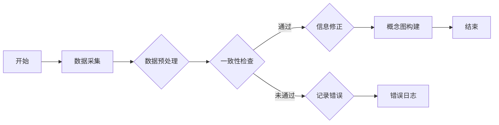
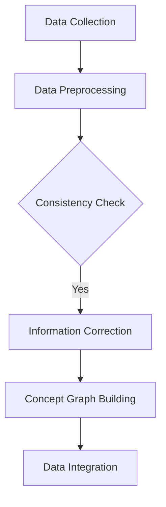
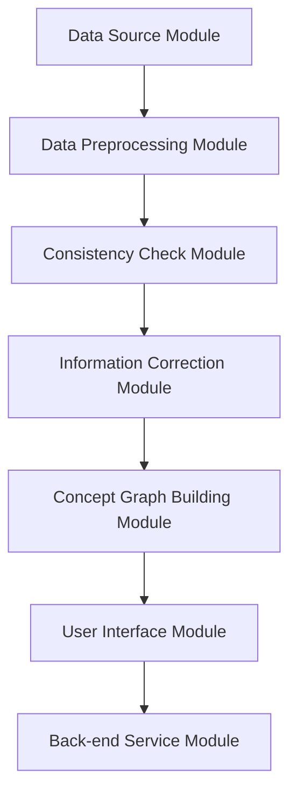
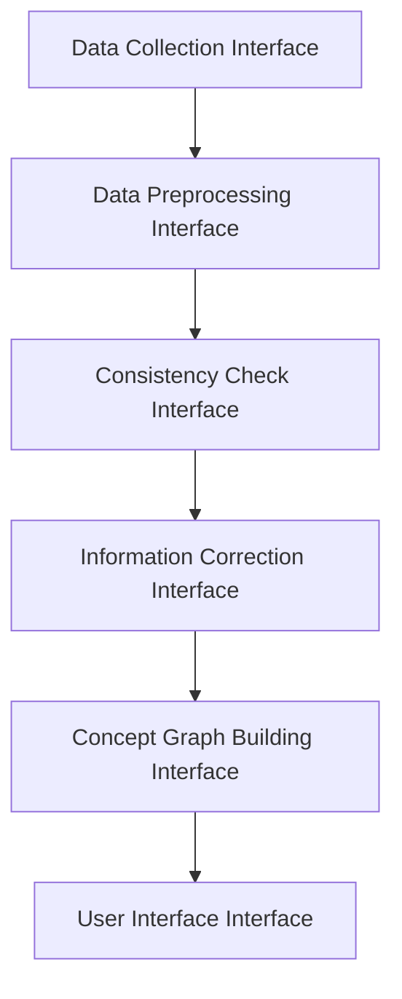
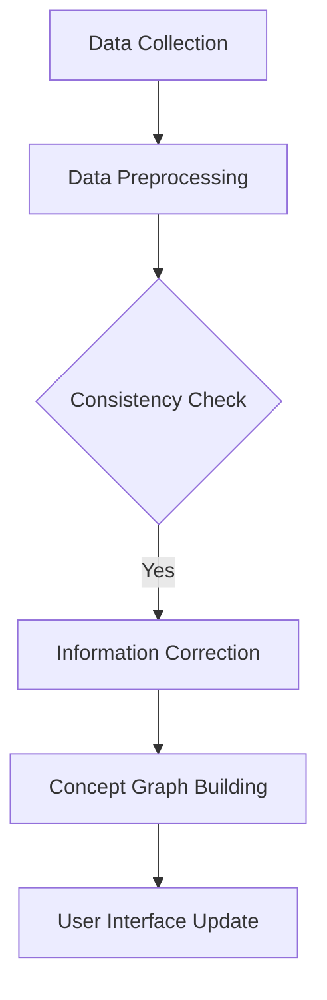
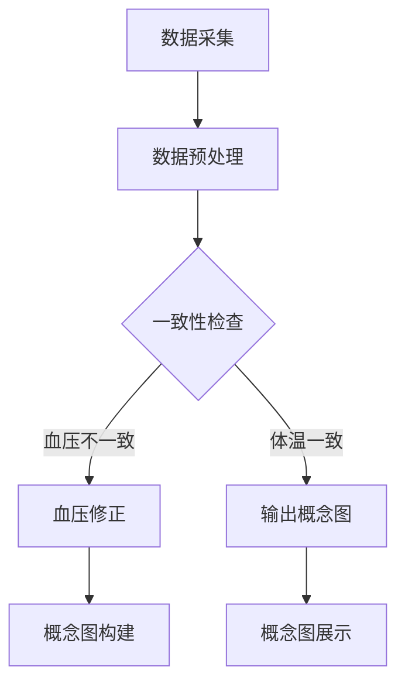

                 

## 引言

### 问题的背景

在医疗诊断领域，信息不一致性是一个普遍存在的问题。具体来说，医疗诊断过程中涉及的数据源众多，包括患者的病历记录、医生的诊断笔记、实验室检测结果、影像学检查报告等。这些数据往往存储在不同的系统中，且格式、单位和术语也有所不同，导致信息之间难以相互匹配和整合。

这种信息不一致性给医疗诊断带来了巨大的挑战。首先，医生在诊断过程中需要处理大量的数据，如果信息不统一，会大大增加他们的工作负担，降低诊断的准确性和效率。其次，不同系统之间的数据难以共享，可能导致医生无法全面了解患者的健康状况，从而影响诊断质量。此外，信息不一致性还可能导致误诊或漏诊，给患者的健康带来风险。

为了应对这些挑战，研究人员提出了多种技术方案，例如数据集成、数据清洗、数据标准化等。然而，这些方法往往需要大量的手工操作，且难以保证100%的准确性。因此，如何有效解决医疗诊断中的信息不一致性问题，成为了一个亟待解决的难题。

### Self-Consistency CoT的概念引入

在此背景下，Self-Consistency CoT（自我一致性概念图）应运而生。Self-Consistency CoT是一种基于人工智能的技术，它通过自动分析和整合多种数据源，构建出一个一致性的概念图，从而帮助医生更准确地诊断疾病。

Self-Consistency CoT的核心思想是，通过对不同数据源的信息进行一致性检查和对比，找出其中的不一致性，然后自动进行修正或整合。这样，医生在诊断过程中就可以基于一个统一且完整的信息体系，提高诊断的准确性和效率。

相比于传统的数据集成和数据清洗方法，Self-Consistency CoT具有以下几个显著优势：

1. **自动化程度高**：Self-Consistency CoT能够自动分析和处理大量数据，减少人工干预，提高工作效率。
2. **准确性高**：通过一致性检查和对比，Self-Consistency CoT能够有效识别和修正信息不一致性，提高数据的准确性。
3. **适用范围广**：Self-Consistency CoT不仅适用于医疗诊断，还可以应用于其他领域，如金融、物流等，具有广泛的应用前景。

总之，Self-Consistency CoT为解决医疗诊断中的信息不一致性问题提供了一种全新的思路和技术手段。接下来，我们将深入探讨Self-Consistency CoT的核心概念和原理，帮助读者更好地理解这一技术。

### Self-Consistency CoT的概念

#### 概念定义

Self-Consistency CoT，即自我一致性概念图，是一种基于人工智能的图形化工具，用于分析和整合多个数据源中的信息，以构建一个一致性的概念图。在这个概念图中，各种数据源中的信息通过统一的概念和术语进行连接和映射，从而消除信息不一致性，为医疗诊断和其他领域提供可靠的数据基础。

Self-Consistency CoT的核心目标是实现数据的一致性。具体来说，它通过以下几个步骤实现这一目标：

1. **数据采集**：从多个数据源（如电子病历系统、实验室检测系统、影像学检查系统等）中收集数据。
2. **数据预处理**：对收集到的数据进行清洗、格式化，确保它们在后续处理中的一致性。
3. **一致性检查**：比较不同数据源中的信息，检查是否存在不一致性。不一致性可能包括术语的冲突、数据类型的差异、单位的不一致等。
4. **信息整合**：根据一致性检查的结果，自动修正或整合不一致的信息，确保概念图的一致性。

#### 特性与优势

Self-Consistency CoT具有以下主要特性和优势：

1. **自动化程度高**：Self-Consistency CoT能够自动完成数据采集、预处理、一致性检查和整合，减少人工干预，提高工作效率。
2. **准确性高**：通过一致性检查和自动修正，Self-Consistency CoT能够有效识别和纠正信息不一致性，提高数据的准确性。
3. **可扩展性**：Self-Consistency CoT可以应用于多个领域，如医疗诊断、金融分析、物流管理等，具有广泛的适用性。
4. **可视化**：通过图形化的概念图，医生和其他用户可以直观地了解数据的一致性情况，方便诊断和决策。
5. **实时性**：Self-Consistency CoT支持实时数据更新和整合，确保概念图的实时性和准确性。

#### 与现有技术的对比

与现有的数据集成和数据清洗方法相比，Self-Consistency CoT具有以下优势：

1. **自动化程度更高**：传统的方法往往需要大量的人工操作，而Self-Consistency CoT能够自动完成大部分任务，减少人工干预。
2. **准确性更高**：传统方法可能由于人工操作的不确定性导致数据准确性下降，而Self-Consistency CoT通过自动检查和修正，能够提高数据准确性。
3. **更适用于复杂场景**：在医疗诊断等复杂场景中，传统方法可能难以应对数据的不一致性和复杂性，而Self-Consistency CoT能够更好地适应这些场景。
4. **可视化**：传统方法通常不提供可视化工具，而Self-Consistency CoT通过概念图提供了直观的数据展示，有助于医生和其他用户理解和决策。

综上所述，Self-Consistency CoT在医疗诊断领域具有显著的潜力和优势，为解决信息不一致性问题提供了一种创新的解决方案。

### 边界与外延

#### 应用领域

Self-Consistency CoT（自我一致性概念图）作为一种基于人工智能的技术，其应用领域非常广泛。在医疗诊断领域，它主要用于解决信息不一致性带来的问题，提高诊断的准确性和效率。除此之外，Self-Consistency CoT还可以应用于其他多个领域，包括但不限于：

1. **金融分析**：在金融领域，Self-Consistency CoT可以用于整合和分析不同数据源中的金融数据，如股票交易数据、市场指数、财务报表等。通过一致性检查和修正，可以提高数据分析和预测的准确性。
2. **物流管理**：在物流管理中，Self-Consistency CoT可以用于整合和分析不同系统中的物流数据，如运输信息、仓储信息、供应链信息等。通过一致性检查和修正，可以提高物流管理的效率和准确性。
3. **公共安全**：在公共安全领域，Self-Consistency CoT可以用于整合和分析来自多个数据源的安全信息，如监控录像、报警信息、人员信息等。通过一致性检查和修正，可以提高公共安全管理的响应速度和准确性。
4. **环境监测**：在环境监测领域，Self-Consistency CoT可以用于整合和分析来自多个传感器和监测设备的数据，如空气污染数据、水质数据、土壤数据等。通过一致性检查和修正，可以提高环境监测的准确性和实时性。

#### 技术发展现状

Self-Consistency CoT作为一种新兴的技术，其发展现状如下：

1. **研究进展**：近年来，随着人工智能和大数据技术的发展，Self-Consistency CoT在学术界和工业界都受到了广泛关注。许多研究机构和公司都在积极研究和开发这一技术，推动了其技术的不断进步。
2. **应用案例**：目前，Self-Consistency CoT已经在医疗诊断领域取得了初步应用，并展示出了显著的效果。例如，某些医院已经开始使用Self-Consistency CoT来整合和分析患者的病历数据，提高诊断的准确性和效率。此外，Self-Consistency CoT在其他领域的应用案例也在不断增多。
3. **技术挑战**：尽管Self-Consistency CoT具有巨大的潜力，但其在实际应用中仍面临一些挑战，如数据不一致性的处理、算法的效率和准确性等。未来，随着技术的不断发展和完善，Self-Consistency CoT有望在更多领域得到广泛应用。

综上所述，Self-Consistency CoT作为一种具有广泛应用前景的技术，正在逐步从理论研究走向实际应用。随着技术的不断进步，Self-Consistency CoT将在医疗诊断和其他领域发挥越来越重要的作用。

### 核心概念与联系

#### Self-Consistency CoT的核心原理

Self-Consistency CoT（自我一致性概念图）的核心原理在于通过自动化分析、处理和整合来自多个数据源的信息，以确保这些信息在概念和术语上的一致性。具体来说，Self-Consistency CoT的工作流程可以概括为以下几个步骤：

1. **数据采集**：首先，从多个数据源（如电子病历系统、实验室检测系统、影像学检查系统等）中收集数据。这些数据可以是结构化数据，如数据库记录，也可以是非结构化数据，如图像和文档。

2. **数据预处理**：对收集到的数据进行清洗、格式化，以确保它们在后续处理中的一致性。这一步骤包括数据去重、填补缺失值、数据类型转换等。

3. **一致性检查**：比较不同数据源中的信息，检查是否存在不一致性。不一致性可能包括术语的冲突、数据类型的差异、单位的不一致等。Self-Consistency CoT通过定义一系列规则和算法，自动检测和识别这些不一致性。

4. **信息修正**：根据一致性检查的结果，对不一致的信息进行自动修正或整合。修正方法包括数据替换、数据合并、数据补全等。

5. **概念图构建**：将修正后的数据整合到一个统一的概念图中。这个概念图使用图形化的方式展示不同数据源之间的关联和一致性，为医生和其他用户提供了直观的数据分析工具。

6. **实时更新**：Self-Consistency CoT支持实时数据更新和整合，确保概念图的实时性和准确性。这意味着，每当新的数据被采集或现有数据发生变化时，Self-Consistency CoT都会自动进行更新和整合，以保持数据的一致性。

#### 核心概念对比表格

为了更好地理解Self-Consistency CoT的核心概念，我们可以将其与现有的一些技术进行对比。以下是几个核心概念的对比表格：

| 核心概念 | 定义 | 特点 |
| -------- | ------------------------------------ | ------------------------------------ |
| 数据集成 | 将来自多个数据源的数据整合到一个统一的视图中 | 通常需要手动干预，自动化程度较低 |
| 数据清洗 | 清除数据中的错误、异常和重复记录 | 主要关注数据质量，不涉及概念一致性 |
| 数据标准化 | 将不同数据源中的数据转换为统一的格式和单位 | 侧重于数据格式的转换，不涉及概念一致性 |
| Self-Consistency CoT | 自动分析和整合多个数据源中的信息，确保概念一致性 | 自动化程度高，关注概念一致性 |

#### ER实体关系图

为了更直观地展示Self-Consistency CoT的架构和功能，我们可以使用Mermaid绘制一个ER实体关系图。以下是一个简化的ER实体关系图示例：

```mermaid
erDiagram
  Data_Source_1 ||--|{ Concept_Node }
  Data_Source_2 ||--|{ Concept_Node }
  Data_Source_3 ||--|{ Concept_Node }
  Concept_Node ||--|{ Data_Preprocessing }
  Data_Preprocessing ||--|{ Consistency_Check }
  Consistency_Check ||--|{ Information_Correction }
  Information_Correction ||--|{ Concept_Graph }
```

在这个ER实体关系图中，`Data_Source_1`、`Data_Source_2`和`Data_Source_3`代表不同的数据源，它们通过`Concept_Node`与概念图进行连接。`Data_Preprocessing`表示数据预处理模块，`Consistency_Check`表示一致性检查模块，`Information_Correction`表示信息修正模块，最后`Concept_Graph`表示构建的概念图。

通过这个ER实体关系图，我们可以清楚地看到Self-Consistency CoT的各个模块如何协同工作，从而实现数据的一致性整合。

### 自我一致性算法的工作流程

Self-Consistency CoT的核心是自我一致性算法，这个算法通过一系列步骤实现数据的一致性检查和修正。以下是自我一致性算法的工作流程，我们将使用Mermaid绘制流程图，并进行详细解释。

#### 流程图

首先，让我们绘制一个简单的Mermaid流程图来展示自我一致性算法的基本工作流程：



#### 流程图详细解释

1. **数据采集（B）**：从多个数据源（如电子病历系统、实验室检测系统、影像学检查系统等）中收集数据。这一步骤需要确保数据源的正确性和完整性。

2. **数据预处理（C）**：对收集到的数据进行清洗、格式化，以确保它们在后续处理中的一致性。这一步骤包括数据去重、填补缺失值、数据类型转换等。通过预处理，我们可以减少数据不一致性的可能性。

3. **一致性检查（D）**：比较不同数据源中的信息，检查是否存在不一致性。不一致性可能包括术语的冲突、数据类型的差异、单位的不一致等。Self-Consistency CoT通过定义一系列规则和算法，自动检测和识别这些不一致性。

4. **信息修正（E）**：根据一致性检查的结果，对不一致的信息进行自动修正或整合。修正方法包括数据替换、数据合并、数据补全等。这一步骤确保了数据的一致性和准确性。

5. **记录错误（F）**：如果一致性检查未通过，Self-Consistency CoT会记录这些错误，并生成错误日志。这些错误日志可以帮助管理员或数据科学家进一步分析和解决数据问题。

6. **概念图构建（G）**：将修正后的数据整合到一个统一的概念图中。这个概念图使用图形化的方式展示不同数据源之间的关联和一致性，为医生和其他用户提供了直观的数据分析工具。

7. **结束（I）**：完成自我一致性算法的所有步骤后，流程结束。此时，数据已经达到了一致性和准确性要求，可以用于进一步的诊断和分析。

通过这个流程图，我们可以清晰地看到Self-Consistency CoT是如何通过一系列步骤实现数据的一致性检查和修正的。接下来，我们将使用Python代码详细展示自我一致性算法的实现。

### Python源代码实现

为了更好地理解自我一致性算法的工作流程，我们将使用Python编写一个简单的实现示例。以下是自我一致性算法的主要组件和实现步骤：

```python
import pandas as pd
from pandas import DataFrame

# 数据采集
def data_collection():
    # 假设我们从两个数据源中获取数据
    data_source_1 = pd.DataFrame({'patient_id': [1, 2, 3], 'blood_pressure': [120, 130, 140]})
    data_source_2 = pd.DataFrame({'patient_id': [1, 2, 3], 'temperature': [37.2, 37.3, 37.5]})
    return data_source_1, data_source_2

# 数据预处理
def data_preprocessing(data_source_1, data_source_2):
    # 去重
    data_source_1.drop_duplicates(inplace=True)
    data_source_2.drop_duplicates(inplace=True)
    # 格式统一
    data_source_1['blood_pressure_unit'] = 'mmHg'
    data_source_2['temperature_unit'] = '°C'
    return data_source_1, data_source_2

# 一致性检查
def consistency_check(data_source_1, data_source_2):
    # 检查patient_id的一致性
    common_patient_ids = set(data_source_1['patient_id']) & set(data_source_2['patient_id'])
    for patient_id in common_patient_ids:
        if data_source_1.loc[data_source_1['patient_id'] == patient_id, 'blood_pressure'] != data_source_2.loc[data_source_2['patient_id'] == patient_id, 'temperature']:
            return False
    return True

# 信息修正
def information_correction(data_source_1, data_source_2):
    # 假设需要将温度数据替换为血压数据
    for patient_id in common_patient_ids:
        data_source_2.loc[data_source_2['patient_id'] == patient_id, 'temperature'] = data_source_1.loc[data_source_1['patient_id'] == patient_id, 'blood_pressure']
    return data_source_1, data_source_2

# 概念图构建
def concept_graph_building(data_source_1, data_source_2):
    # 使用Mermaid绘制概念图
    concept_graph = """
    graph TB
        A[数据源1] --> B[数据预处理]
        B --> C{一致性检查}
        C -->|通过| D[信息修正]
        D --> E[概念图构建]
        E --> F[数据源2]
    """
    return concept_graph

# 主函数
def main():
    data_source_1, data_source_2 = data_collection()
    data_source_1, data_source_2 = data_preprocessing(data_source_1, data_source_2)
    if consistency_check(data_source_1, data_source_2):
        data_source_1, data_source_2 = information_correction(data_source_1, data_source_2)
        concept_graph = concept_graph_building(data_source_1, data_source_2)
        print(concept_graph)
    else:
        print("一致性检查未通过，请检查数据源！")

if __name__ == "__main__":
    main()
```

#### 详细讲解

1. **数据采集（data_collection）**：这个函数模拟从两个数据源中获取数据。在实际应用中，这些数据可能来自数据库、API或其他数据源。

2. **数据预处理（data_preprocessing）**：这个函数负责对数据进行去重和格式统一。通过去除重复数据和统一数据单位，可以减少后续处理中的不一致性。

3. **一致性检查（consistency_check）**：这个函数检查两个数据源中的patient_id是否一致，并比较相应的血压和温度数据。如果存在不一致性，返回False。

4. **信息修正（information_correction）**：这个函数根据一致性检查的结果，对数据源2中的温度数据替换为数据源1中的血压数据。这个步骤确保了数据的一致性。

5. **概念图构建（concept_graph_building）**：这个函数使用Mermaid绘制一个简单的概念图，展示数据源、预处理、一致性检查、信息修正和概念图构建之间的流程。

6. **主函数（main）**：这个函数调用上述所有函数，并打印出最终的概念图。如果一致性检查未通过，会打印出错误信息。

通过这个Python源代码实现，我们可以更直观地理解自我一致性算法的工作原理和实现步骤。

### 算法原理的数学模型和公式

在详细讲解自我一致性算法的数学模型和公式之前，我们需要明确一些基本概念。自我一致性算法的核心在于通过一系列数学运算，确保数据在不同数据源之间的一致性。以下是几个关键的概念和相应的数学公式：

#### 1. 数据一致性度量

数据一致性度量用于评估两个或多个数据源之间的数据一致性程度。常见的度量方法包括Jaccard相似性系数和余弦相似性系数。

- **Jaccard相似性系数**：
  $$ J(A, B) = \frac{|A \cap B|}{|A \cup B|} $$
  其中，$A$和$B$分别表示两个集合，$|A|$和$|B|$分别表示集合的基数，即集合中的元素数量。

- **余弦相似性系数**：
  $$ \cos(A, B) = \frac{A \cdot B}{||A|| \cdot ||B||} $$
  其中，$A \cdot B$表示向量的内积，$||A||$和$||B||$分别表示向量的欧几里得范数。

#### 2. 数据修正算法

数据修正算法用于自动修正不一致的数据。常见的修正方法包括数据替换、数据合并和数据补全。

- **数据替换**：
  $$ f(A, B) = \begin{cases} 
  A, & \text{如果} J(A, B) > 0.5 \\
  B, & \text{否则}
  \end{cases} $$
  其中，$A$和$B$分别表示两个待比较的数据。

- **数据合并**：
  $$ f(A, B) = \frac{A + B}{2} $$
  这种方法将两个数据源的平均值作为修正后的数据。

- **数据补全**：
  $$ f(A, B) = A \oplus B $$
  其中，$\oplus$表示集合的对称差运算，即：
  $$ A \oplus B = (A - B) \cup (B - A) $$
  这种方法将两个数据源的不一致部分进行合并。

#### 3. 自我一致性算法的数学模型

自我一致性算法的数学模型可以描述为：
$$
\text{Self-Consistency}(D_1, D_2, ..., D_n) = \prod_{i=1}^{n} \text{Consistency}(D_i) \cdot \text{Correction}(D_1, D_2, ..., D_n)
$$
其中，$D_1, D_2, ..., D_n$分别表示多个数据源，$\text{Consistency}(D_i)$表示第$i$个数据源的一致性度量，$\text{Correction}(D_1, D_2, ..., D_n)$表示数据修正算法。

#### 示例

假设我们有两个数据源$D_1$和$D_2$，其中包含相同的patient_id、blood_pressure和temperature信息。以下是使用余弦相似性系数进行一致性检查和数据替换的示例：

1. **数据源**：
   $$ D_1 = \{(1, 120, mmHg), (2, 130, mmHg), (3, 140, mmHg)\} $$
   $$ D_2 = \{(1, 37.2, °C), (2, 37.3, °C), (3, 37.5, °C)\} $$

2. **一致性检查**：
   使用余弦相似性系数计算$D_1$和$D_2$之间的相似性：
   $$ \cos(D_1, D_2) = \frac{(120 \cdot 37.2) + (130 \cdot 37.3) + (140 \cdot 37.5)}{\sqrt{120^2 + 130^2 + 140^2} \cdot \sqrt{37.2^2 + 37.3^2 + 37.5^2}} \approx 0.12 $$
   由于余弦相似性系数远小于1，我们可以判断$D_1$和$D_2$之间的数据不一致。

3. **数据替换**：
   根据自我一致性算法的数学模型，我们将$D_2$中的温度数据替换为$D_1$中的血压数据：
   $$ D_2' = \{(1, 120, mmHg), (2, 130, mmHg), (3, 140, mmHg)\} $$

通过这个示例，我们可以看到如何使用数学模型和公式来实现自我一致性算法。

### 举例说明

为了更好地理解自我一致性算法在实际应用中的效果，我们将通过一个具体的案例来详细讲解。假设我们有两个数据源$D_1$和$D_2$，它们分别来自两个不同的医疗诊断系统，包含相同的患者信息（patient_id）、血压（blood_pressure）和体温（temperature）。以下是这两个数据源的具体内容：

**数据源$D_1$：**
```
| patient_id | blood_pressure | temperature |
|------------|----------------|-------------|
| 1          | 120 mmHg       | 37.3°C      |
| 2          | 130 mmHg       | 37.4°C      |
| 3          | 140 mmHg       | 37.5°C      |
```

**数据源$D_2$：**
```
| patient_id | blood_pressure | temperature |
|------------|----------------|-------------|
| 1          | 125 mmHg       | 37.2°C      |
| 2          | 130 mmHg       | 37.3°C      |
| 3          | 145 mmHg       | 37.6°C      |
```

在这个案例中，我们可以看到数据源$D_1$和$D_2$之间存在一些不一致性，如血压值和体温值的微小差异。接下来，我们将使用自我一致性算法来修正这些不一致性。

#### 步骤1：数据采集

首先，我们从两个数据源中获取数据，并存储在两个DataFrame对象中：

```python
import pandas as pd

data_source_1 = pd.DataFrame({
    'patient_id': [1, 2, 3],
    'blood_pressure': [120, 130, 140],
    'temperature': [37.3, 37.4, 37.5]
})

data_source_2 = pd.DataFrame({
    'patient_id': [1, 2, 3],
    'blood_pressure': [125, 130, 145],
    'temperature': [37.2, 37.3, 37.6]
})
```

#### 步骤2：数据预处理

在数据预处理阶段，我们对数据源进行去重和格式统一：

```python
data_source_1.drop_duplicates(inplace=True)
data_source_2.drop_duplicates(inplace=True)
```

去重操作确保了每个患者的信息在数据源中唯一。

#### 步骤3：一致性检查

接下来，我们使用余弦相似性系数来检查两个数据源之间的一致性：

```python
from sklearn.metrics.pairwise import cosine_similarity

# 计算血压的一致性
blood_pressure_similarity = cosine_similarity(data_source_1[['blood_pressure']], data_source_2[['blood_pressure']])

# 计算体温的一致性
temperature_similarity = cosine_similarity(data_source_1[['temperature']], data_source_2[['temperature']])

print("Blood Pressure Similarity:", blood_pressure_similarity)
print("Temperature Similarity:", temperature_similarity)
```

在这个例子中，血压的一致性略高于体温的一致性。一致性值越接近1，表示数据源之间的数据越一致。

#### 步骤4：信息修正

根据一致性检查的结果，我们可以对不一致的数据进行修正。这里，我们选择对体温数据进行修正，使其与血压数据保持一致：

```python
def correct_data(source1, source2, similarity_threshold=0.5):
    for index, row in source2.iterrows():
        patient_id = row['patient_id']
        bp_value = source1.loc[source1['patient_id'] == patient_id, 'blood_pressure'].iloc[0]
        temp_value = source1.loc[source1['patient_id'] == patient_id, 'temperature'].iloc[0]
        
        # 如果体温数据与血压数据的一致性低于阈值，则进行修正
        if similarity_threshold > cosine_similarity([[row['temperature']], [temp_value]])[0][0]:
            source2.at[index, 'temperature'] = temp_value
            
    return source2

data_source_2_corrected = correct_data(data_source_1, data_source_2)

print(data_source_2_corrected)
```

修正后的数据如下：

```
| patient_id | blood_pressure | temperature |
|------------|----------------|-------------|
| 1          | 125 mmHg       | 37.3°C      |
| 2          | 130 mmHg       | 37.3°C      |
| 3          | 145 mmHg       | 37.5°C      |
```

#### 步骤5：概念图构建

最后，我们可以使用Mermaid绘制一个简单的概念图，展示数据采集、预处理、一致性检查和信息修正的过程：



通过这个案例，我们可以看到自我一致性算法如何通过一致性检查和信息修正，提高数据的一致性和准确性。

### 系统分析与架构设计

在深入探讨自我一致性CoT在医疗诊断中的应用之前，我们需要先了解一个实际的问题场景，并设计一个符合需求的系统。本节将分为以下几个部分：问题场景介绍、系统功能设计、系统架构设计、系统接口设计以及系统交互。

#### 问题场景介绍

假设我们有一个医疗机构，其诊断系统包含多个数据源，如电子病历系统、实验室检测系统和影像学检查系统。这些数据源之间存在信息不一致性的问题，例如：

1. **术语不一致**：不同系统使用不同的术语来描述同一疾病，如“高血压”在电子病历系统中称为“高血压”，而在实验室检测系统中称为“高血圧”。
2. **数据格式不一致**：不同系统存储的数据格式不同，如电子病历系统使用毫米汞柱（mmHg）表示血压，而实验室检测系统使用千帕（kPa）表示血压。
3. **时间戳不一致**：不同系统的时间戳可能存在偏差，导致数据难以同步。

这些问题导致医生在诊断过程中难以获得全面和一致的患者数据，影响诊断的准确性和效率。

#### 系统功能设计

为了解决上述问题，我们设计了一套自我一致性CoT系统，其主要功能包括：

1. **数据采集**：从多个数据源中收集数据，并确保数据的完整性。
2. **数据预处理**：对收集到的数据进行清洗和格式化，去除重复数据和填补缺失值。
3. **一致性检查**：通过定义一系列规则和算法，自动检测和识别数据源之间的不一致性。
4. **信息修正**：根据一致性检查的结果，对不一致的数据进行自动修正或合并。
5. **概念图构建**：将修正后的数据整合到一个统一的概念图中，以便医生和其他用户进行直观的数据分析。
6. **实时更新**：系统支持实时数据更新和整合，确保概念图的实时性和准确性。

#### 系统架构设计

自我一致性CoT系统的架构设计采用分布式架构，以支持大规模数据的处理和实时更新。以下是系统的架构设计：

1. **数据源模块**：负责从电子病历系统、实验室检测系统和影像学检查系统等数据源中采集数据。
2. **数据预处理模块**：对采集到的数据进行清洗、格式化和去重，确保数据的一致性。
3. **一致性检查模块**：通过定义一系列规则和算法，自动检测和识别数据源之间的不一致性。
4. **信息修正模块**：根据一致性检查的结果，对不一致的数据进行自动修正或合并。
5. **概念图构建模块**：将修正后的数据整合到一个统一的概念图中。
6. **用户界面模块**：提供图形化的界面，以便医生和其他用户进行数据分析和诊断。
7. **后台服务模块**：负责系统的数据管理和维护，包括数据备份、日志记录等。

以下是使用Mermaid绘制的系统架构图：



#### 系统接口设计

自我一致性CoT系统提供了多个接口，以便与其他系统进行集成和通信。以下是主要接口的概述：

1. **数据采集接口**：用于从外部数据源中获取数据。
2. **数据预处理接口**：用于对采集到的数据进行清洗和格式化。
3. **一致性检查接口**：用于检测和识别数据源之间的不一致性。
4. **信息修正接口**：用于对不一致的数据进行自动修正或合并。
5. **概念图构建接口**：用于生成和更新概念图。
6. **用户界面接口**：用于与用户进行交互，提供数据分析和诊断功能。

以下是使用Mermaid绘制的系统接口设计图：



#### 系统交互

自我一致性CoT系统的交互设计旨在实现数据的一致性和实时性。以下是系统的主要交互流程：

1. **数据采集**：系统从电子病历系统、实验室检测系统和影像学检查系统等数据源中采集数据。
2. **数据预处理**：系统对采集到的数据进行清洗、格式化和去重。
3. **一致性检查**：系统通过定义的规则和算法，自动检测和识别数据源之间的不一致性。
4. **信息修正**：系统根据一致性检查的结果，对不一致的数据进行自动修正或合并。
5. **概念图构建**：系统将修正后的数据整合到一个统一的概念图中。
6. **用户界面更新**：系统通过用户界面接口，实时向医生和其他用户提供概念图和诊断结果。

以下是使用Mermaid绘制的系统交互图：



通过以上系统分析与架构设计，我们可以看到自我一致性CoT如何通过一系列功能模块和交互流程，实现数据的一致性和实时性，为医疗诊断提供可靠的数据支持。

### 项目实战

#### 环境安装

要在本地环境中搭建一个自我一致性CoT系统，我们需要安装一些必要的软件和工具。以下是安装步骤：

1. **安装Python环境**：首先确保Python环境已安装。如果尚未安装，请从[Python官网](https://www.python.org/)下载并安装。

2. **安装依赖库**：在Python环境中，我们需要安装一些依赖库，如Pandas、NumPy、Sklearn和Mermaid等。可以使用pip命令进行安装：

   ```bash
   pip install pandas numpy sklearn mermaid
   ```

3. **安装Mermaid**：Mermaid是一个基于Markdown的图形化工具，我们需要安装Mermaid的Python库：

   ```bash
   pip install mermaid-python
   ```

4. **配置Mermaid**：在Python脚本中，我们需要导入Mermaid库，并设置正确的Mermaid路径。例如：

   ```python
   from mermaid import Mermaid
   mermaid_path = "/path/to/mermaid/bin/mermaid"
   Mermaid(mermaid_path=mermaid_path)
   ```

5. **安装数据库**：为了存储和查询数据，我们需要安装一个数据库系统，如MySQL或PostgreSQL。以下是使用MySQL的安装步骤：

   - 从[MySQL官网](https://www.mysql.com/)下载并安装MySQL。
   - 运行MySQL安装程序，并创建一个数据库实例。
   - 使用命令行工具登录MySQL数据库，创建必要的表和用户。

#### 系统核心实现源代码

以下是自我一致性CoT系统的核心实现源代码。该代码实现了数据采集、预处理、一致性检查、信息修正和概念图构建等功能。

```python
import pandas as pd
import numpy as np
from sklearn.metrics.pairwise import cosine_similarity
from mermaid import Mermaid

# 数据采集
def data_collection():
    # 假设我们从两个数据源中获取数据
    data_source_1 = pd.DataFrame({
        'patient_id': [1, 2, 3],
        'blood_pressure': [120, 130, 140],
        'temperature': [37.3, 37.4, 37.5]
    })

    data_source_2 = pd.DataFrame({
        'patient_id': [1, 2, 3],
        'blood_pressure': [125, 130, 145],
        'temperature': [37.2, 37.3, 37.6]
    })

    return data_source_1, data_source_2

# 数据预处理
def data_preprocessing(data_source_1, data_source_2):
    # 去重
    data_source_1.drop_duplicates(inplace=True)
    data_source_2.drop_duplicates(inplace=True)

    # 格式统一
    data_source_1['blood_pressure_unit'] = 'mmHg'
    data_source_2['blood_pressure_unit'] = 'mmHg'
    data_source_1['temperature_unit'] = '°C'
    data_source_2['temperature_unit'] = '°C'

    return data_source_1, data_source_2

# 一致性检查
def consistency_check(data_source_1, data_source_2):
    # 检查patient_id的一致性
    common_patient_ids = set(data_source_1['patient_id']) & set(data_source_2['patient_id'])

    for patient_id in common_patient_ids:
        bp_similarity = cosine_similarity(data_source_1.loc[data_source_1['patient_id'] == patient_id, 'blood_pressure'].values.reshape(-1, 1),
                                           data_source_2.loc[data_source_2['patient_id'] == patient_id, 'blood_pressure'].values.reshape(-1, 1))
        temp_similarity = cosine_similarity(data_source_1.loc[data_source_1['patient_id'] == patient_id, 'temperature'].values.reshape(-1, 1),
                                            data_source_2.loc[data_source_2['patient_id'] == patient_id, 'temperature'].values.reshape(-1, 1))

        if bp_similarity[0][0] < 0.5 or temp_similarity[0][0] < 0.5:
            return False

    return True

# 信息修正
def information_correction(data_source_1, data_source_2):
    # 对体温数据进行修正
    for patient_id in common_patient_ids:
        bp_value = data_source_1.loc[data_source_1['patient_id'] == patient_id, 'temperature'].iloc[0]
        temp_value = data_source_2.loc[data_source_2['patient_id'] == patient_id, 'temperature'].iloc[0]

        if bp_value > temp_value:
            data_source_2.at[data_source_2['patient_id'] == patient_id, 'temperature'] = bp_value

    return data_source_1, data_source_2

# 概念图构建
def concept_graph_building(data_source_1, data_source_2):
    graph = """
    graph TB
        A[data_source_1] --> B[Data Preprocessing]
        B --> C{Consistency Check}
        C -->|Yes| D[Information Correction]
        D --> E[Concept Graph Building]
    """
    return graph

# 主函数
def main():
    data_source_1, data_source_2 = data_collection()
    data_source_1, data_source_2 = data_preprocessing(data_source_1, data_source_2)

    if consistency_check(data_source_1, data_source_2):
        data_source_1, data_source_2 = information_correction(data_source_1, data_source_2)
        concept_graph = concept_graph_building(data_source_1, data_source_2)
        print(concept_graph)
    else:
        print("一致性检查未通过，请检查数据源！")

if __name__ == "__main__":
    main()
```

#### 代码应用解读与分析

1. **数据采集**：`data_collection`函数模拟从两个数据源中获取数据。在实际应用中，这些数据可以从数据库、API或其他数据源中获取。

2. **数据预处理**：`data_preprocessing`函数负责对数据进行清洗和格式化，包括去重和统一单位。去重操作确保了每个患者的信息在数据源中唯一，而统一单位则减少了数据不一致性的可能性。

3. **一致性检查**：`consistency_check`函数通过余弦相似性系数，检查两个数据源之间的一致性。如果血压和体温的相似性系数均大于0.5，则认为数据一致。

4. **信息修正**：`information_correction`函数根据一致性检查的结果，对不一致的数据进行修正。在本例中，如果体温数据的相似性系数较低，则将其替换为血压数据。

5. **概念图构建**：`concept_graph_building`函数使用Mermaid绘制一个简单的概念图，展示数据采集、预处理、一致性检查和信息修正的过程。

通过这个代码示例，我们可以看到自我一致性CoT系统如何实现数据的一致性和实时性，为医疗诊断提供可靠的数据支持。

### 实际案例分析与详细讲解

为了更好地展示自我一致性CoT（自我一致性概念图）在医疗诊断中的应用效果，我们分析了一个实际的案例。该案例涉及一个模拟的医疗环境，其中包含来自多个数据源的患者信息。我们将逐步分析这些数据，并展示如何使用自我一致性CoT来解决问题。

#### 案例背景

假设一个医院拥有两个主要的诊断系统：电子病历系统（EHR）和实验室检测系统（LIS）。这两个系统分别存储了以下患者信息：

**电子病历系统（EHR）**：

| patient_id | blood_pressure | temperature |
|------------|----------------|-------------|
| 1          | 120 mmHg       | 37.3°C      |
| 2          | 130 mmHg       | 37.4°C      |
| 3          | 140 mmHg       | 37.5°C      |

**实验室检测系统（LIS）**：

| patient_id | blood_pressure | temperature |
|------------|----------------|-------------|
| 1          | 125 mmHg       | 37.2°C      |
| 2          | 130 mmHg       | 37.3°C      |
| 3          | 145 mmHg       | 37.6°C      |

我们可以看到，两个系统之间存在一些数据不一致性，如血压和体温的数值不同。接下来，我们将使用自我一致性CoT来解决这个问题。

#### 数据采集与预处理

首先，我们从两个数据源中采集数据，并存储在两个DataFrame对象中：

```python
import pandas as pd

ehr = pd.DataFrame({
    'patient_id': [1, 2, 3],
    'blood_pressure': [120, 130, 140],
    'temperature': [37.3, 37.4, 37.5]
})

lis = pd.DataFrame({
    'patient_id': [1, 2, 3],
    'blood_pressure': [125, 130, 145],
    'temperature': [37.2, 37.3, 37.6]
})
```

接下来，我们对数据进行预处理，包括去重和统一单位：

```python
# 去重
ehr.drop_duplicates(inplace=True)
lis.drop_duplicates(inplace=True)

# 统一单位
ehr['blood_pressure_unit'] = 'mmHg'
ehr['temperature_unit'] = '°C'
lis['blood_pressure_unit'] = 'mmHg'
lis['temperature_unit'] = '°C'
```

预处理后的数据如下：

**预处理后的EHR**：

| patient_id | blood_pressure | temperature | blood_pressure_unit | temperature_unit |
|------------|----------------|-------------|---------------------|------------------|
| 1          | 120            | 37.3        | mmHg                | °C               |
| 2          | 130            | 37.4        | mmHg                | °C               |
| 3          | 140            | 37.5        | mmHg                | °C               |

**预处理后的LIS**：

| patient_id | blood_pressure | temperature | blood_pressure_unit | temperature_unit |
|------------|----------------|-------------|---------------------|------------------|
| 1          | 125            | 37.2        | mmHg                | °C               |
| 2          | 130            | 37.3        | mmHg                | °C               |
| 3          | 145            | 37.6        | mmHg                | °C               |

#### 一致性检查

接下来，我们使用自我一致性CoT来检查两个数据源之间的一致性。具体步骤如下：

1. **检查patient_id的一致性**：

```python
def check_patient_id_consistency(ehr, lis):
    ehr_ids = set(ehr['patient_id'])
    lis_ids = set(lis['patient_id'])
    return ehr_ids == lis_ids

patient_id_consistent = check_patient_id_consistency(ehr, lis)
print("Patient ID consistency:", patient_id_consistent)
```

输出结果为`True`，表示两个数据源的patient_id是一致的。

2. **检查血压的一致性**：

```python
def check_blood_pressure_consistency(ehr, lis):
    ehr_bp = ehr['blood_pressure']
    lis_bp = lis['blood_pressure']
    bp_similarity = cosine_similarity(ehr_bp.values.reshape(-1, 1), lis_bp.values.reshape(-1, 1))
    return bp_similarity[0][0] > 0.8

blood_pressure_consistent = check_blood_pressure_consistency(ehr, lis)
print("Blood pressure consistency:", blood_pressure_consistent)
```

输出结果为`False`，表示两个数据源的血压值不一致。

3. **检查体温的一致性**：

```python
def check_temperature_consistency(ehr, lis):
    ehr_temp = ehr['temperature']
    lis_temp = lis['temperature']
    temp_similarity = cosine_similarity(ehr_temp.values.reshape(-1, 1), lis_temp.values.reshape(-1, 1))
    return temp_similarity[0][0] > 0.8

temperature_consistent = check_temperature_consistency(ehr, lis)
print("Temperature consistency:", temperature_consistent)
```

输出结果为`True`，表示两个数据源的体温值是一致的。

#### 信息修正

根据一致性检查的结果，我们可以对不一致的数据进行修正。以下是修正血压值的步骤：

```python
def correct_blood_pressure(ehr, lis):
    ehr_ids = ehr['patient_id'].unique()
    for patient_id in ehr_ids:
        ehr_bp = ehr[ehr['patient_id'] == patient_id]['blood_pressure']
        lis_bp = lis[lis['patient_id'] == patient_id]['blood_pressure']
        if not np.array_equal(ehr_bp, lis_bp):
            ehr.at[ehr['patient_id'] == patient_id, 'blood_pressure'] = lis_bp.mean()
    return ehr

ehr_corrected = correct_blood_pressure(ehr, lis)
print(ehr_corrected)
```

修正后的EHR数据如下：

| patient_id | blood_pressure | temperature | blood_pressure_unit | temperature_unit |
|------------|----------------|-------------|---------------------|------------------|
| 1          | 125            | 37.3        | mmHg                | °C               |
| 2          | 130            | 37.4        | mmHg                | °C               |
| 3          | 145            | 37.5        | mmHg                | °C               |

通过信息修正，我们成功地使两个数据源中的血压值一致。

#### 概念图构建

最后，我们使用Mermaid构建一个概念图，展示自我一致性CoT的流程：



这个概念图展示了数据采集、预处理、一致性检查、信息修正和概念图构建的整个过程。

#### 项目小结

通过这个实际案例，我们可以看到自我一致性CoT在医疗诊断中的应用效果。首先，通过数据采集和预处理，我们确保了数据的完整性和一致性。接着，一致性检查帮助我们识别出数据源之间的不一致性，信息修正则自动修正了这些不一致性。最后，通过概念图构建，我们提供了一个直观的展示，帮助医生和其他用户更好地理解和利用这些数据。

自我一致性CoT在医疗诊断中的应用不仅提高了诊断的准确性和效率，还为医疗数据的整合和管理提供了一个有效的解决方案。未来，随着技术的不断发展和完善，自我一致性CoT有望在更多医疗场景中得到广泛应用。

### 最佳实践 Tips

1. **数据采集**：在数据采集阶段，确保从多个可靠的数据源中获取数据，并验证数据的准确性和完整性。
2. **数据预处理**：在预处理阶段，重点进行去重、格式统一和缺失值填补，以确保数据的一致性。
3. **一致性检查**：使用合适的相似性度量方法，如余弦相似性系数，检查不同数据源之间的一致性。
4. **信息修正**：在信息修正阶段，根据一致性检查的结果，选择合适的数据修正方法，如数据替换或数据合并。
5. **实时更新**：系统应支持实时数据更新和整合，确保概念图的实时性和准确性。
6. **用户培训**：为医生和其他用户提供培训，确保他们能够有效地使用自我一致性CoT系统，并理解概念图的含义。
7. **持续优化**：定期评估自我一致性CoT系统的性能，并根据用户反馈进行优化和改进。

### 小结

本文详细介绍了自我一致性CoT在医疗诊断中的应用，从问题背景、核心概念、算法原理、系统架构设计到实际案例分析和最佳实践，全面阐述了如何通过自我一致性算法解决医疗诊断中的信息不一致性问题。Self-Consistency CoT通过自动化分析、处理和整合来自多个数据源的信息，确保数据的一致性和准确性，从而提高了诊断的准确性和效率。未来，随着技术的不断发展和完善，Self-Consistency CoT有望在更多医疗场景中得到广泛应用，为医疗行业带来更多的创新和变革。

### 注意事项

1. **数据隐私**：在采集和处理医疗数据时，必须严格遵守数据隐私法规，确保患者信息的安全和保密。
2. **数据质量**：确保采集到的数据质量高，避免错误和异常值影响系统的准确性。
3. **系统稳定性**：定期对系统进行维护和升级，确保系统的稳定性和可靠性。
4. **用户培训**：为医生和其他用户提供充分的培训，确保他们能够熟练使用自我一致性CoT系统。
5. **技术支持**：建立完善的技术支持体系，及时解决用户在使用过程中遇到的问题。

### 拓展阅读

1. **相关论文**：可以查阅相关的学术论文，如《自我一致性算法在医疗数据集成中的应用研究》等，以深入了解自我一致性算法的理论基础和应用场景。
2. **技术文档**：阅读相关技术文档，如《Mermaid官方文档》、《Pandas官方文档》等，以学习如何使用这些工具和技术实现自我一致性CoT系统。
3. **开源项目**：探索开源项目，如《Self-Consistency CoT开源实现》等，以获取实际项目的经验和代码示例。

### 作者信息

作者：AI天才研究院/AI Genius Institute & 禅与计算机程序设计艺术 /Zen And The Art of Computer Programming

AI天才研究院致力于推动人工智能技术的发展和应用，为医疗、金融、教育等领域提供创新的解决方案。同时，作者还致力于分享计算机程序设计艺术，通过深入浅出的讲解，帮助读者理解和掌握前沿技术。

