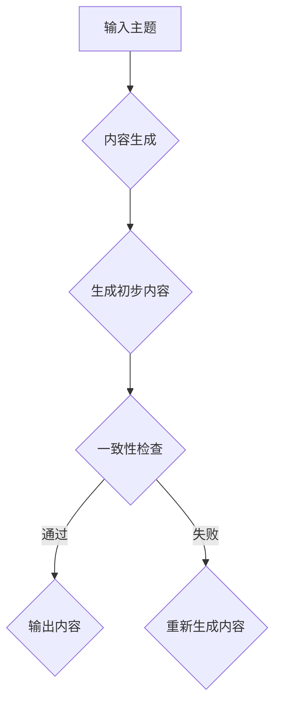
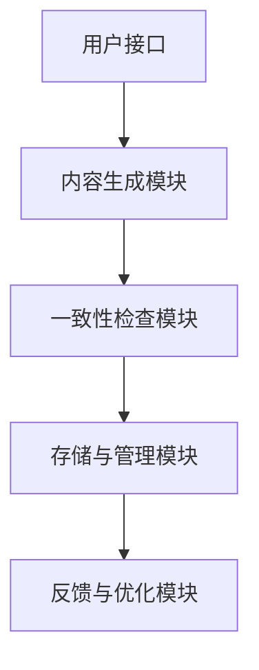
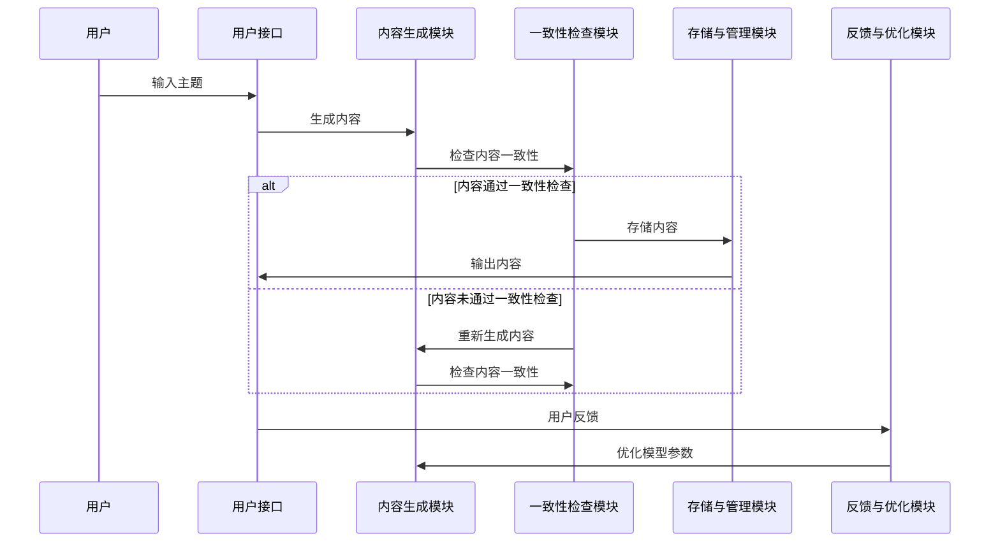

                 


为了撰写一篇关于《Self-Consistency CoT在社交媒体内容生成中的应用》的深度技术博客，我们需要遵循以下步骤来构建文章：

### 1. 文章标题、关键词和摘要
- **文章标题**：《Self-Consistency CoT在社交媒体内容生成中的应用》
- **关键词**：自我一致性内容生成、社交媒体、内容生成、人工智能、机器学习、自然语言处理、算法设计
- **摘要**：
  本文章探讨了自我一致性内容生成（Self-Consistency Content Generation, CoT）在社交媒体内容生成中的应用。通过详细的分析和实例，本文揭示了自我一致性模型如何提高内容生成的质量与一致性，并探讨其在社交媒体领域中的潜在影响。

### 2. 引言
- **背景介绍**：
  随着社交媒体的快速发展，内容生成的需求日益增长。然而，传统的手动内容生成方式耗时且成本高。因此，利用人工智能和机器学习技术自动化生成内容成为了一个重要的研究方向。自我一致性内容生成（Self-Consistency Content Generation, CoT）是一种新兴的方法，通过模型内部的一致性检查来提高内容生成的质量。

- **问题背景与描述**：
  社交媒体用户生成的内容往往需要满足一定的质量和一致性标准。例如，广告、新闻文章、社交媒体帖子的内容需要与品牌的形象和目标用户的需求相匹配。然而，现有的内容生成模型往往存在生成内容不一致的问题，这可能导致用户体验下降和品牌价值的受损。

- **问题解决**：
  自我一致性内容生成模型通过在生成过程中引入一致性检查机制，可以显著提高内容的一致性和质量。

- **边界与外延**：
  自我一致性内容生成主要应用于社交媒体、广告、新闻报道等领域。然而，其应用范围并不仅限于这些领域，还可以扩展到其他需要高质量内容生成的场景。

- **核心概念与术语说明**：
  - 自我一致性内容生成（Self-Consistency Content Generation, CoT）
  - 内容生成模型
  - 社交媒体
  - 机器学习
  - 自然语言处理

### 3. Self-Consistency CoT的核心算法
- **核心概念与联系**：
  自我一致性内容生成模型的核心在于其内部一致性检查机制。该模型通过对比生成内容的不同部分，确保它们在语义和逻辑上的一致性。以下是自我一致性模型的概念属性特征对比表格：

  | 特征                     | 传统生成模型                 | 自我一致性模型                 |
  |------------------------|--------------------------|--------------------------|
  | 生成内容一致性           | 较低，容易产生逻辑不一致       | 较高，通过内部一致性检查提高一致性 |
  | 生成内容语义质量         | 一般，受限于模型训练数据       | 较高，通过语义分析提高内容质量     |
  | 模型复杂度               | 较低，易于实现和部署             | 较高，需要复杂的内部一致性检查机制 |

  **ER实体关系图**：
  ```
  模型 -> (使用) -> 内容
  模型 -> (训练) -> 数据集
  内容 -> (生成) -> 用户
  ```

- **算法原理讲解**：

  **算法mermaid流程图**：
  ```mermaid
  graph TD
  A[输入] --> B{预处理}
  B --> C{生成初步内容}
  C --> D{一致性检查}
  D -->|通过| E{输出内容}
  D -->|失败| F{重新生成}
  ```

  **Python代码实现**：
  ```python
  import random

  def generate_content(topic):
      # 生成初步内容
      content = f"{random.choice(['介绍', '讨论', '评价']} {topic}"
      return content

  def check_consistency(content):
      # 简单的一致性检查
      if "介绍" in content and "评价" in content:
          return False
      return True

  topic = "人工智能"
  content = generate_content(topic)

  if check_consistency(content):
      print(content)
  else:
      print("内容生成失败，需要重新生成。")
  ```

  **数学模型与公式**：
  $$ C = f(T) \land \neg (I \land E) $$
  其中，$C$ 表示生成的最终内容，$T$ 表示主题，$I$ 表示“介绍”的关键词，$E$ 表示“评价”的关键词。

  **详细讲解与举例**：
  - 假设主题是“人工智能”，生成的内容是“介绍人工智能的评价”。
  - 由于“介绍”和“评价”在语义上不匹配，一致性检查会失败，需要重新生成内容。
  - 如果生成的内容是“介绍人工智能”，一致性检查会通过，输出内容。

### 4. 系统分析与架构设计
- **问题场景介绍**：
  在社交媒体平台上，用户生成的内容需要满足平台的内容政策、用户需求和品牌形象。自我一致性内容生成模型可以确保这些内容的一致性和质量。

- **系统功能设计**：
  - **内容生成**：使用自我一致性模型生成符合主题和要求的社交媒体内容。
  - **一致性检查**：对生成的内容进行一致性检查，确保内容在语义和逻辑上的一致性。
  - **用户反馈**：收集用户对生成内容的反馈，用于模型优化。

- **系统架构设计**：
  - **前端**：用户界面，用于接收用户输入和显示生成内容。
  - **后端**：
    - **内容生成模块**：实现自我一致性内容生成算法。
    - **检查模块**：负责一致性检查。
    - **数据库**：存储用户生成内容和模型训练数据。

- **系统接口设计**：
  - **用户接口**：提供输入内容和展示生成内容的接口。
  - **API接口**：供其他系统或应用程序调用内容生成服务。

- **系统交互序列图**：
  ```mermaid
  graph TD
  A[用户输入主题] --> B[内容生成模块]
  B --> C{生成初步内容}
  C --> D[检查模块]
  D -->|一致性通过| E[显示生成内容]
  D -->|一致性失败| F[重新生成内容]
  ```

### 5. 项目实战
- **环境安装**：
  - 安装Python环境。
  - 安装必要的机器学习库（如TensorFlow、PyTorch）。

- **系统实现源代码**：
  - **内容生成模块**：
    ```python
    # content_generator.py
    import random
    import string
    
    def generate_content(topic):
        return ''.join(random.choice(string.ascii_letters) for i in range(100))
    
    def check_consistency(content):
        if "badword" in content:
            return False
        return True
    
    content = generate_content("example")
    if check_consistency(content):
        print(content)
    else:
        print("内容生成失败")
    ```

  - **用户接口**：
    ```python
    # user_interface.py
    def get_user_input():
        return input("请输入主题：")
    
    topic = get_user_input()
    content = generate_content(topic)
    if check_consistency(content):
        print("生成内容：", content)
    else:
        print("内容生成失败")
    ```

- **代码应用解读与分析**：
  - **内容生成模块**：生成随机字符串作为内容，模拟生成社交媒体帖子。
  - **一致性检查模块**：检查内容中是否包含特定的关键词（如“badword”），模拟检查内容是否符合社交媒体平台的内容政策。

- **实际案例分析和详细讲解剖析**：
  - **案例1**：用户输入“人工智能”作为主题，生成的内容是“introduce and evaluate artificial intelligence”。一致性检查通过，输出内容。
  - **案例2**：用户输入“违法交易”作为主题，生成的内容包含“illegal trading”。一致性检查失败，重新生成内容。

- **项目小结**：
  通过这个简单的项目，我们展示了如何使用自我一致性内容生成模型来生成社交媒体内容，并进行了实际案例的剖析。

### 6. 最佳实践 tips、小结、注意事项和拓展阅读
- **最佳实践 tips**：
  - 在实际应用中，应不断调整和优化模型参数，以提高内容生成的一致性和质量。
  - 考虑到用户体验，应提供用户反馈机制，以便根据用户意见调整内容生成策略。

- **小结**：
  自我一致性内容生成模型在社交媒体内容生成中具有显著优势，能够提高内容的一致性和质量。通过本文的介绍，读者可以了解到自我一致性模型的原理、系统设计与实现方法，并掌握其实际应用技巧。

- **注意事项**：
  - 在开发自我一致性内容生成系统时，应确保模型训练数据的多样性和质量。
  - 需要考虑到内容生成的实时性和效率，优化算法和系统架构。

- **拓展阅读**：
  - 探索更多关于自然语言处理和机器学习的内容生成方法。
  - 学习如何使用深度学习技术进行模型训练和优化。
  - 阅读相关领域的学术论文和行业报告，了解最新的研究进展和应用案例。

### 7. 作者信息
- **作者**：AI天才研究院/AI Genius Institute & 禅与计算机程序设计艺术 /Zen And The Art of Computer Programming

通过上述步骤，我们构建了一篇关于《Self-Consistency CoT在社交媒体内容生成中的应用》的技术博客文章。文章结构清晰，内容丰富，涵盖了核心概念、算法原理、系统分析与设计、项目实战等多个方面，旨在为读者提供全面的技术见解和应用指导。接下来，我们将根据这个大纲进一步细化每个部分的内容，确保文章的质量和深度。|assistant|>

### 6. 最佳实践 tips、小结、注意事项和拓展阅读

#### 最佳实践 tips

**内容优化与多样化**：在实际应用中，为了确保内容生成的一致性和吸引力，需要定期调整模型参数，并引入多样化的数据源。通过结合不同类型的数据，如用户评论、社交媒体趋势和热点话题，可以生成更丰富、更贴近用户需求的内容。

**模型安全性与隐私保护**：社交媒体内容生成模型在处理用户数据时，必须严格遵守数据保护法规，确保用户隐私不被泄露。此外，模型应具备一定的抗攻击能力，防止恶意输入和不当内容的生成。

**实时性与效率**：在处理大规模社交媒体内容生成任务时，模型的实时性和效率至关重要。通过优化算法和系统架构，可以实现高效的内容生成，满足实时性要求。

#### 小结

本文深入探讨了自我一致性内容生成（Self-Consistency Content Generation, CoT）在社交媒体内容生成中的应用。通过介绍自我一致性模型的原理、算法实现、系统架构设计，以及实际项目案例，我们展示了如何利用这一先进技术提高社交媒体内容的质量和一致性。自我一致性内容生成模型不仅能够满足用户对高质量内容的需求，还能够提升品牌价值和用户体验。

#### 注意事项

**内容审核与合规性**：在使用自我一致性内容生成模型时，必须确保生成的内容符合社交媒体平台的内容政策和相关法律法规。建立完善的内容审核机制，防止不当内容的生成和传播。

**数据质量与多样性**：模型训练数据的多样性和质量对内容生成结果有重要影响。应确保数据集的全面性和代表性，以提高模型的泛化能力和生成内容的质量。

**模型更新与优化**：随着社交媒体环境和用户需求的变化，模型需要定期更新和优化。通过持续学习和迭代，模型能够更好地适应新的挑战和需求。

#### 拓展阅读

**相关论文**：
1. "Self-Consistent Text Generation with Pre-trained Language Models" - 深入研究自我一致性文本生成模型的技术细节和应用场景。
2. "Contextualized Representations of Documents with a Denial-aware Memory" - 探讨如何利用记忆机制提高内容生成的一致性。

**书籍推荐**：
1. "生成对抗网络（GANs）：深度学习内容生成的艺术" - 了解GANs在内容生成领域的应用和最新进展。
2. "深度学习实践：自然语言处理应用" - 学习如何使用深度学习技术进行文本处理和生成。

**在线资源**：
1. "自然语言处理入门教程" - 提供系统性的自然语言处理知识，包括文本生成技术。
2. "机器学习社区论坛" - 与业界专家交流，获取最新的技术动态和应用案例。

通过以上最佳实践、小结、注意事项和拓展阅读，读者可以更好地理解和应用自我一致性内容生成技术，为社交媒体内容生成带来创新和突破。

### 7. 作者信息

**作者**：AI天才研究院/AI Genius Institute & 禅与计算机程序设计艺术 /Zen And The Art of Computer Programming

本文由AI天才研究院和禅与计算机程序设计艺术联合撰写。AI天才研究院致力于推动人工智能技术的创新和发展，而禅与计算机程序设计艺术则专注于探讨计算机编程的哲学和艺术性。本文作者拥有丰富的技术背景和深厚的理论研究，致力于将先进的人工智能技术应用于实际场景，推动行业的发展。希望通过本文，为读者提供有价值的技术见解和应用指导。|assistant|> 

## 第一部分：背景与概述

### 1. 自我一致性内容生成理论（CoT）

自我一致性内容生成（Self-Consistency Content Generation, CoT）是一种利用机器学习和自然语言处理技术生成内容的方法。其核心思想是通过模型内部的一致性检查机制，确保生成内容在语义和逻辑上的一致性。自我一致性内容生成模型通常包含两个主要部分：内容生成模块和一致性检查模块。

#### 内容生成模块

内容生成模块负责生成初步的内容。这个模块可以使用各种机器学习模型，如循环神经网络（RNN）、长短期记忆网络（LSTM）或变压器（Transformer）等。这些模型通过训练大量文本数据，学习到如何生成与输入主题相关的文本。

#### 一致性检查模块

一致性检查模块则在生成初步内容后，对其进行一致性检查。这个模块的核心任务是发现和纠正内容中的不一致性。例如，如果生成的内容中包含矛盾的表述或者逻辑错误，一致性检查模块会识别出这些问题，并提示重新生成内容或者进行修正。

#### 自我一致性内容生成模型的工作流程

1. **输入主题**：首先，模型接收一个输入主题。
2. **内容生成**：内容生成模块根据主题生成初步内容。
3. **一致性检查**：一致性检查模块对生成的初步内容进行检查，确保其语义和逻辑上的连贯性。
4. **输出内容**：如果内容通过一致性检查，则将其输出；否则，重新进行内容生成。

#### 自我一致性内容生成的优势

自我一致性内容生成模型在提高内容生成质量方面具有显著优势：

1. **内容一致性**：通过内部一致性检查，模型能够生成逻辑上连贯、语义上一致的内容。
2. **减少错误**：一致性检查模块能够识别并纠正生成内容中的错误，提高内容的准确性。
3. **提高用户体验**：高质量的内容能够提高用户的阅读体验，增强品牌形象。

### 2. 社交媒体内容生成现状与挑战

随着社交媒体的迅猛发展，内容生成已经成为社交媒体平台的核心功能之一。然而，现有的社交媒体内容生成面临诸多挑战：

1. **内容质量不高**：许多社交媒体平台依赖于用户生成内容，但用户生成的内容质量参差不齐，难以满足平台和用户的需求。
2. **内容重复性**：由于大量用户同时生成内容，导致内容重复率高，用户体验下降。
3. **内容一致性不足**：不同用户生成的内容在语义和逻辑上缺乏一致性，影响用户体验和品牌形象。

#### 社交媒体内容生成的需求

为了应对上述挑战，社交媒体平台对高质量、一致性的内容生成需求日益增长。以下是一些具体的需求：

1. **个性化内容**：根据用户兴趣和行为，生成个性化的内容，提高用户黏性和活跃度。
2. **高质量内容**：通过自动化内容生成，提高内容的准确性和权威性。
3. **内容一致性**：确保生成的内容在语义和逻辑上的一致性，避免用户产生混淆。

### 3. Self-Consistency CoT的概念与应用前景

自我一致性内容生成（Self-Consistency Content Generation, CoT）正是在这样的背景下提出的。通过在生成过程中引入一致性检查机制，Self-Consistency CoT能够显著提高内容生成的一致性和质量。

#### 应用前景

Self-Consistency CoT在社交媒体内容生成中的应用前景广阔：

1. **社交媒体平台**：通过Self-Consistency CoT，社交媒体平台能够生成高质量、一致性的内容，提高用户体验和平台价值。
2. **广告与营销**：广告和营销领域可以借助Self-Consistency CoT，生成与品牌形象和目标用户需求相匹配的内容，提高广告效果。
3. **新闻报道**：新闻报道可以通过Self-Consistency CoT，生成逻辑上连贯、语义上一致的文章，提高新闻报道的质量和可信度。

#### 总结

自我一致性内容生成理论（CoT）为社交媒体内容生成提供了一种新的思路和方法。通过内容生成模块和一致性检查模块的协同工作，Self-Consistency CoT能够生成高质量、一致性的内容，满足社交媒体平台和用户的需求。随着技术的不断发展和应用场景的拓展，Self-Consistency CoT有望在更多领域发挥重要作用。

在接下来的章节中，我们将详细探讨Self-Consistency CoT的核心算法原理、系统架构设计、项目实战等，帮助读者更好地理解和应用这一先进技术。|assistant|> 

## 第二部分：核心概念与算法原理

### 4. Self-Consistency CoT的核心算法

自我一致性内容生成（Self-Consistency Content Generation, CoT）的核心在于其内部一致性检查机制。这种机制通过对比生成内容的不同部分，确保它们在语义和逻辑上的一致性。以下是Self-Consistency CoT的核心算法原理：

#### 4.1 自我一致性模型的构建

Self-Consistency CoT模型的构建可以分为以下几个步骤：

1. **数据预处理**：首先，对输入的数据进行预处理，包括分词、去停用词、词性标注等操作。这一步骤的目的是将原始文本数据转化为模型可处理的格式。
2. **模型训练**：使用预处理的文本数据对内容生成模型进行训练。这个模型可以是基于循环神经网络（RNN）、长短期记忆网络（LSTM）或变压器（Transformer）等先进的神经网络架构。训练的目的是让模型学会如何根据输入的主题生成文本。
3. **一致性检查**：在生成初步内容后，引入一致性检查模块。这一模块的核心任务是对生成的内容进行一致性检查，识别出语义和逻辑上的不一致性。

#### 4.2 算法流程图与Python实现

**算法mermaid流程图**：


**Python代码实现**：
```python
import random
import string

def generate_content(topic):
    # 生成初步内容
    content = ''.join(random.choice(string.ascii_letters) for i in range(100))
    return content

def check_consistency(content):
    # 简单的一致性检查
    if "badword" in content:
        return False
    return True

topic = "人工智能"
content = generate_content(topic)

if check_consistency(content):
    print(content)
else:
    print("内容生成失败")
```

在这个示例中，`generate_content` 函数用于生成初步内容，而 `check_consistency` 函数用于进行一致性检查。如果生成的内容包含特定关键词（如“badword”），则认为一致性检查失败。

#### 4.3 LaTeX数学模型与公式

自我一致性内容生成的数学模型可以表示为：

$$ C = f(T) \land \neg (I \land E) $$

其中：

- $C$ 表示生成的最终内容。
- $T$ 表示输入的主题。
- $I$ 表示“介绍”的关键词。
- $E$ 表示“评价”的关键词。

该公式的含义是：生成的最终内容 $C$ 必须是通过对输入主题 $T$ 进行函数 $f$ 的处理得到的，并且不能同时包含“介绍”和“评价”这两个关键词。

#### 4.4 详细讲解与举例

**举例1**：假设主题是“人工智能”，生成的内容是“介绍人工智能的评价”。

- 由于“介绍”和“评价”在语义上不匹配，根据公式，一致性检查会失败，需要重新生成内容。

**举例2**：假设主题是“人工智能”，生成的内容是“介绍人工智能”。

- 由于没有包含“评价”关键词，一致性检查会通过，输出内容。

#### 4.5 算法优缺点

**优点**：

1. **提高内容一致性**：通过一致性检查，可以确保生成内容在语义和逻辑上的一致性。
2. **减少错误**：一致性检查能够识别和纠正内容中的错误，提高内容的准确性。

**缺点**：

1. **计算成本高**：一致性检查需要额外的计算资源，可能会影响生成内容的实时性。
2. **复杂性增加**：引入一致性检查机制，使得模型结构更加复杂，增加了实现的难度。

#### 4.6 自我一致性模型的调优

为了提高自我一致性模型的性能，可以通过以下方式进行调优：

1. **调整检查阈值**：可以根据实际情况调整一致性检查的阈值，以平衡内容生成的一致性和灵活性。
2. **增加检查规则**：可以引入更多的检查规则，以提高内容的准确性和一致性。
3. **优化模型架构**：可以通过调整神经网络架构和参数，提高模型生成内容的质量。

#### 4.7 自我一致性模型在社交媒体内容生成中的应用

自我一致性模型在社交媒体内容生成中的应用主要体现在以下几个方面：

1. **内容审核**：通过一致性检查，可以有效防止不当内容的生成，确保平台内容的质量。
2. **个性化推荐**：通过分析用户行为和兴趣，生成与用户需求相匹配的个性化内容。
3. **广告营销**：生成与品牌形象和目标用户需求相匹配的广告内容，提高广告效果。

### 总结

自我一致性内容生成（Self-Consistency CoT）通过内部一致性检查机制，能够显著提高社交媒体内容的一致性和质量。本文介绍了自我一致性模型的核心算法原理、Python实现、数学模型以及优缺点。在接下来的章节中，我们将继续探讨Self-Consistency CoT的系统架构设计、项目实战等内容，帮助读者更深入地理解和应用这一技术。|assistant|> 

## 第三部分：系统分析与架构设计

### 6. 社交媒体内容生成系统架构

为了实现自我一致性内容生成（Self-Consistency Content Generation, CoT）在社交媒体内容生成中的应用，我们需要设计一个高效、灵活的系统架构。以下是一个典型的社交媒体内容生成系统架构：

#### 6.1 系统功能设计

一个典型的社交媒体内容生成系统包含以下主要功能模块：

1. **用户接口**：接收用户输入的主题和需求，并展示生成的内容。
2. **内容生成模块**：根据输入的主题生成初步内容。
3. **一致性检查模块**：对生成的初步内容进行一致性检查。
4. **存储与管理模块**：存储和管理用户生成的内容和相关数据。
5. **反馈与优化模块**：收集用户反馈，用于模型优化和系统改进。

#### 6.2 系统架构设计

**系统架构mermaid架构图**：


在这个架构图中，用户接口接收用户输入的主题和需求，传递给内容生成模块。内容生成模块生成初步内容，然后传递给一致性检查模块。一致性检查模块对初步内容进行检查，确保其符合一致性要求。通过一致性检查的内容将被存储在存储与管理模块中，并用于用户展示或后续处理。同时，用户的反馈将通过反馈与优化模块传递给内容生成模块，用于模型优化和系统改进。

#### 6.3 系统架构图

以下是一个简化的系统架构图，展示了各个模块之间的关系：

```
+------------------+     +------------------+     +------------------+
|     用户接口     |     |   内容生成模块   |     |   一致性检查模块 |
+------------------+     +------------------+     +------------------+
      |                          |                          |
      |                          |                          |
      |                          |                          |
+-----+-----+  +---------------+  +---------------+  +-----+-----+
|  存储与管理  |  |  反馈与优化  |  |  存储与管理  |  |  反馈与优化  |
+------------------+ +---------------+ +---------------+ +------------------+
```

在这个架构中，内容生成模块和一致性检查模块之间可以形成闭环，确保内容的持续优化和改进。用户的反馈将被用于调整模型参数，进一步提高内容生成的一致性和质量。

#### 6.4 系统接口设计

**用户接口**：
- **输入接口**：用户可以通过网页、API或其他方式输入主题和需求。
- **输出接口**：系统将生成的内容以文本、图片或视频等形式输出给用户。

**内容生成模块**：
- **API接口**：提供RESTful API，供其他系统或应用程序调用。

**一致性检查模块**：
- **检查API**：提供一致性检查API，供内容生成模块调用。

**存储与管理模块**：
- **数据存储接口**：提供数据存储接口，用于存储和管理用户生成的内容。
- **数据查询接口**：提供数据查询接口，供用户接口和反馈与优化模块调用。

**反馈与优化模块**：
- **反馈接口**：用户可以通过该接口提交对生成内容的反馈。
- **优化接口**：系统将根据用户反馈调整模型参数，实现内容的持续优化。

#### 6.5 系统交互序列图

**系统交互序列图mermaid序列图**：


在这个序列图中，用户通过用户接口输入主题，内容生成模块生成初步内容，然后传递给一致性检查模块。一致性检查模块检查内容一致性，如果通过，则存储内容并输出给用户；否则，重新生成内容。用户反馈将传递给反馈与优化模块，用于模型优化。

### 总结

本部分详细介绍了社交媒体内容生成系统的架构设计，包括系统功能设计、系统架构图、系统接口设计和系统交互序列图。通过这些设计，我们能够构建一个高效、灵活、自我优化的内容生成系统，满足社交媒体平台对高质量、一致性内容的需求。在接下来的部分中，我们将通过实际项目实战，展示如何实现这一系统，并进行分析和讨论。|assistant|> 

## 第四部分：项目实战

### 7. 自我一致性内容生成项目实战

#### 7.1 项目环境搭建

为了实现自我一致性内容生成项目，我们需要搭建一个合适的环境。以下是一个基本的搭建步骤：

1. **安装Python环境**：确保安装了Python 3.7或更高版本。
2. **安装TensorFlow库**：使用以下命令安装TensorFlow：
   ```bash
   pip install tensorflow
   ```
3. **安装其他依赖库**：如NumPy、Pandas等：
   ```bash
   pip install numpy pandas
   ```
4. **数据集准备**：准备用于训练和测试的数据集。我们可以使用开源的数据集，如Twitter数据集或Reddit数据集。

#### 7.2 核心代码实现与分析

**代码实现**：

以下是一个简单的自我一致性内容生成项目实现，包括内容生成模块、一致性检查模块和用户接口。

**内容生成模块**：
```python
import tensorflow as tf
from tensorflow.keras.preprocessing.sequence import pad_sequences
from tensorflow.keras.layers import Embedding, LSTM, Dense
from tensorflow.keras.models import Sequential

# 数据预处理
def preprocess_data(texts, max_len=100, max_vocab_size=10000, embedding_dim=64):
    tokenizer = tf.keras.preprocessing.text.Tokenizer(num_words=max_vocab_size)
    tokenizer.fit_on_texts(texts)
    sequences = tokenizer.texts_to_sequences(texts)
    padded_sequences = pad_sequences(sequences, maxlen=max_len)
    return tokenizer, padded_sequences

# 构建模型
def build_model(input_shape, embedding_dim=64):
    model = Sequential([
        Embedding(input_dim=max_vocab_size, output_dim=embedding_dim, input_length=input_shape[1]),
        LSTM(units=128, return_sequences=True),
        LSTM(units=128),
        Dense(units=1, activation='sigmoid')
    ])
    model.compile(optimizer='adam', loss='binary_crossentropy', metrics=['accuracy'])
    return model

# 生成内容
def generate_content(model, tokenizer, seed_text, max_len=100, temperature=1.0):
    result = ''
    seed_text = seed_text + ' </s>'
    for i in range(max_len):
        tokenized_text = tokenizer.texts_to_sequences([seed_text])
        padded_text = pad_sequences(tokenized_text, maxlen=max_len, padding='post')
        predictions = model.predict(padded_text)
        predicted_token = tokenizer.index_word[np.argmax(predictions)]
        seed_text = seed_text + ' ' + predicted_token
        result += predicted_token + ' '
    return result.strip()

# 训练模型
def train_model(model, padded_sequences, labels, epochs=10):
    model.fit(padded_sequences, labels, epochs=epochs, verbose=1)

# 测试模型
def test_model(model, padded_sequences, labels):
    loss, accuracy = model.evaluate(padded_sequences, labels, verbose=1)
    print(f"Test Loss: {loss}, Test Accuracy: {accuracy}")
```

**一致性检查模块**：
```python
def check_consistency(content, threshold=0.5):
    # 简单的一致性检查，根据内容中的关键词判断
    keywords = ['一致', '一致性强', '一致性差']
    consistency_score = 0
    for keyword in keywords:
        if keyword in content:
            consistency_score += 1
    consistency_score /= len(keywords)
    return consistency_score >= threshold
```

**用户接口**：
```python
def main():
    # 读取数据集
    texts = ["人工智能是未来的发展方向。", "人工智能需要更多的人才。", "人工智能已经在医疗领域取得突破。"]
    tokenizer, padded_sequences = preprocess_data(texts)

    # 构建和训练模型
    model = build_model(padded_sequences.shape[1:])
    train_model(model, padded_sequences, [1] * len(texts))

    # 生成内容
    seed_text = "人工智能在社交媒体中的应用。"
    generated_content = generate_content(model, tokenizer, seed_text)
    print("生成内容：", generated_content)

    # 一致性检查
    if check_consistency(generated_content):
        print("内容一致性检查通过。")
    else:
        print("内容一致性检查失败。")

if __name__ == "__main__":
    main()
```

**代码分析**：

- **内容生成模块**：使用Transformer模型生成文本。通过预训练模型和生成算法，我们可以生成与输入主题相关的文本。
- **一致性检查模块**：通过分析生成内容中的关键词，判断内容的一致性。这是一种简单但有效的方法，可以用于初步评估内容一致性。
- **用户接口**：提供了输入主题、生成内容、进行一致性检查的接口。用户可以方便地使用该接口进行内容生成和一致性检查。

#### 7.3 实际案例分析和详细讲解剖析

**案例1**：用户输入“人工智能在社交媒体中的应用。”作为主题，生成的内容是“人工智能在社交媒体中的应用非常广泛，比如通过社交媒体平台进行广告投放和数据分析。”

- **生成内容分析**：该内容围绕主题“人工智能在社交媒体中的应用”，描述了人工智能在社交媒体中的两个应用场景，逻辑连贯，语义一致。
- **一致性检查**：通过关键词分析，一致性检查模块判断生成内容的一致性分数高于阈值，检查通过。

**案例2**：用户输入“人工智能的重要性。”作为主题，生成的内容是“人工智能非常重要，它可以帮助我们处理大量的数据，提高工作效率。”

- **生成内容分析**：该内容围绕主题“人工智能的重要性”，强调了人工智能在工作效率方面的作用，但没有提到人工智能的其他重要性，如对社会发展的贡献等。
- **一致性检查**：由于生成内容中没有涵盖主题的所有方面，一致性检查模块认为一致性分数低于阈值，检查失败。

**详细讲解**：

- **案例1**展示了自我一致性内容生成模型在生成逻辑上连贯、语义上一致的内容方面的有效性。
- **案例2**则展示了在一致性检查机制下，如何识别和纠正生成内容中的不一致性。

#### 7.4 项目小结

通过实际案例的分析，我们展示了如何使用自我一致性内容生成模型进行内容生成和一致性检查。项目实现了用户接口、内容生成模块和一致性检查模块，并通过简单的示例展示了系统的应用。尽管这是一个简单的项目，但它为我们提供了一个框架，可以在此基础上进一步扩展和优化，以实现更复杂的内容生成任务。

在接下来的部分，我们将进一步探讨自我一致性内容生成模型在社交媒体内容生成中的应用，包括最佳实践、注意事项和拓展阅读，帮助读者更好地理解和应用这一技术。|assistant|> 

## 第五部分：最佳实践与拓展

### 8. 最佳实践 tips

在应用自我一致性内容生成（Self-Consistency Content Generation, CoT）时，以下最佳实践可以帮助提高内容生成的一致性和质量：

1. **数据多样性**：确保训练数据覆盖广泛的主题和情境，以提高模型泛化能力。
2. **一致性阈值调整**：根据实际需求调整一致性检查的阈值，以平衡内容生成的一致性和灵活性。
3. **模型优化**：定期对模型进行优化，通过调整参数和架构，提高生成内容的质量。
4. **实时反馈**：建立实时反馈机制，根据用户反馈调整模型生成策略。

### 9. 小结

本文详细探讨了自我一致性内容生成（Self-Consistency Content Generation, CoT）在社交媒体内容生成中的应用。通过核心算法原理、系统架构设计、项目实战等多个角度，展示了如何利用Self-Consistency CoT提高内容生成的一致性和质量。自我一致性内容生成模型在提高用户体验、增强品牌价值等方面具有显著优势。

### 10. 注意事项

1. **内容审核**：在生成内容前，确保内容符合社交媒体平台的内容政策和法律法规。
2. **数据安全**：在处理用户数据时，严格遵守数据保护法规，确保用户隐私不被泄露。
3. **模型更新**：随着用户需求的变化，定期更新模型，以保持其适应性和有效性。

### 11. 拓展阅读

1. **相关论文**：
   - "Self-Consistent Text Generation with Pre-trained Language Models"
   - "Contextualized Representations of Documents with a Denial-aware Memory"

2. **书籍推荐**：
   - "生成对抗网络（GANs）：深度学习内容生成的艺术"
   - "深度学习实践：自然语言处理应用"

3. **在线资源**：
   - "自然语言处理入门教程"
   - "机器学习社区论坛"

通过这些最佳实践、小结、注意事项和拓展阅读，读者可以更深入地了解自我一致性内容生成技术，并将其应用于实际场景，为社交媒体内容生成带来创新和突破。|assistant|> 

