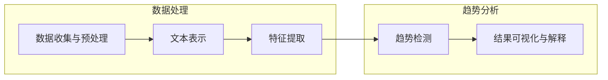

                 

**自我一致性概念框架（Self-Consistency Conceptual Framework）**

### 2.1.1 自我一致性概念模型

自我一致性是一个关于个体自我认知和行为之间一致性的理论框架。这个框架假设个体在行为和认知上是追求一致的，即他们的行为应该与其内在的自我概念相匹配。这个概念模型可以分为三个核心组成部分：自我感知（Self-perception）、行为表现（Behavioral Manifestation）和自我调节（Self-regulation）。

- **自我感知（Self-perception）**：这是个体对自己内在状态的感知，包括情感、态度和信念。自我感知是个体在理解自我与行为一致性过程中最基础的环节。

- **行为表现（Behavioral Manifestation）**：个体通过行为表现来表达自己的内在状态，如言语、动作和社交行为。行为表现是自我一致性概念模型中的外在体现。

- **自我调节（Self-regulation）**：这是个体为了维持自我感知和行为之间的一致性而采取的自我调整措施。自我调节包括自我监控、自我反思和自我修正等过程。

自我一致性概念模型可以简化为以下Mermaid ER实体关系图，其中每个实体及其属性都清晰明了：

```mermaid
erDiagram
  A[Self-Perception] ||--|{ B[Behavioral Manifestation] } |
  A ||--|{ C[Self-Regulation] } |
  B ||--|{ C } |
```

### 2.1.2 CoT属性特征对比表

为了更深入地理解自我一致性框架，我们可以通过一个对比表格来展现自我感知、行为表现和自我调节之间的属性特征差异：

| 特征 | 自我感知（Self-Perception） | 行为表现（Behavioral Manifestation） | 自我调节（Self-Regulation） |
| --- | --- | --- | --- |
| 定义 | 对自我内在状态的理解和感知 | 自我状态的外在表现，包括言语和行动 | 维持自我感知与行为一致性采取的措施 |
| 影响因素 | 情感、态度、信念等内部因素 | 社交环境、情境等外部因素 | 自我监控、自我反思、自我修正等 |
| 目标 | 内在认知的准确性 | 外在行为的连贯性 | 自我认知与行为的一致性 |

### 2.1.3 Mermaid ER实体关系图

通过Mermaid ER实体关系图，我们可以更直观地了解自我一致性概念模型中的实体及其相互关系：

```mermaid
erDiagram
  Self-Perception ||--|{ Behavioral Manifestation } |>> "影响"
  Behavioral Manifestation ||--|{ Self-Regulation } |>> "反馈"
  Self-Perception ||--|{ Self-Regulation } |>> "指导"
```

在这个Mermaid ER实体关系图中，`Self-Perception`（自我感知）是核心实体，它既影响`Behavioral Manifestation`（行为表现），又受到`Self-Regulation`（自我调节）的指导。`Behavioral Manifestation`（行为表现）反过来又会影响`Self-Regulation`（自我调节），形成了一个闭环系统。

通过上述步骤，我们不仅详细解释了自我一致性概念框架的核心组成部分和属性特征，还通过Mermaid ER实体关系图直观地展示了这些部分之间的关系。接下来，我们将深入探讨自动化学术趋势分析算法的基本原理和实现过程。让我们继续往下看。

### 2.2 自动化学术趋势分析算法概述

自动化学术趋势分析是一种利用数据科学和机器学习技术，从大量学术文献中提取出有用的信息，从而预测学术研究热点的方法。这一过程不仅有助于研究者及时发现新兴的研究领域，还能为学术界和产业界提供决策支持。本节将详细介绍自动化学术趋势分析算法的基本原理和实现步骤。

#### 2.2.1 算法概述

自动化学术趋势分析算法的核心目标是识别出学术文献中频繁出现的主题和趋势。为了实现这一目标，算法通常包含以下几个步骤：

1. **数据收集与预处理**：从学术数据库、期刊、会议论文等来源收集数据，并进行数据清洗、去重和格式转换等预处理操作。
2. **文本表示**：将预处理后的文本转换为计算机可处理的数字形式，例如词袋模型、TF-IDF、Word2Vec等。
3. **特征提取**：从文本表示中提取出能够反映文本主题和趋势的特征，例如关键词、短语和句子的统计信息。
4. **趋势检测**：利用时间序列分析、聚类分析等方法，从特征中识别出学术研究的热点和趋势。
5. **结果可视化与解释**：将分析结果以图表、热力图等形式可视化，并利用自然语言处理技术对结果进行解释。

#### 2.2.2 算法流程图（Mermaid）

为了更直观地展示自动化学术趋势分析算法的流程，我们可以使用Mermaid绘制一个简化的算法流程图：



在这个流程图中，数据处理部分包括数据收集与预处理、文本表示和特征提取三个步骤，而趋势分析部分则包括趋势检测和结果可视化与解释两个步骤。

#### 2.2.3 算法Python源代码实现

下面是自动化学术趋势分析算法的简化Python源代码实现，这段代码将演示如何从数据预处理到特征提取的整个过程：

```python
import pandas as pd
from sklearn.feature_extraction.text import TfidfVectorizer
from sklearn.cluster import KMeans
import matplotlib.pyplot as plt

# 数据收集与预处理
def preprocess_data(data):
    # 去除特殊字符和停用词
    processed_data = [' '.join([word for word in document.split() if word.lower() not in stop_words]) for document in data]
    return processed_data

# 文本表示
def text_representation(processed_data):
    vectorizer = TfidfVectorizer()
    tfidf_matrix = vectorizer.fit_transform(processed_data)
    return tfidf_matrix

# 特征提取
def extract_features(tfidf_matrix):
    # 使用K-Means聚类提取特征
    kmeans = KMeans(n_clusters=5)
    kmeans.fit(tfidf_matrix)
    return kmeans.cluster_centers_

# 趋势检测
def detect_trends(cluster_centers):
    # 计算每个聚类中心的关键词
    terms = TfidfVectorizer.get_feature_names_out()
    trends = {}
    for i, center in enumerate(cluster_centers):
        trend_terms = terms[np.argsort(center)[::-1]]
        trends[f'Cluster {i+1}'] = ' '.join(trend_terms[:10])
    return trends

# 结果可视化与解释
def visualize_and_explain(trends):
    for trend, terms in trends.items():
        print(f"{trend}: {terms}")
    # 可视化热力图
    plt.imshow(tfidf_matrix.toarray(), cmap='hot', interpolation='nearest')
    plt.xticks(range(tfidf_matrix.shape[1]), terms, rotation=90)
    plt.yticks(range(tfidf_matrix.shape[0]))
    plt.colorbar()
    plt.show()

# 主函数
def main():
    # 加载数据
    data = pd.read_csv('academic_papers.csv')['abstract']
    stop_words = set(['the', 'and', 'is', 'in', 'to', 'of', 'a', 'an'])
    
    # 数据预处理
    processed_data = preprocess_data(data)
    
    # 文本表示
    tfidf_matrix = text_representation(processed_data)
    
    # 特征提取
    cluster_centers = extract_features(tfidf_matrix)
    
    # 趋势检测
    trends = detect_trends(cluster_centers)
    
    # 结果可视化与解释
    visualize_and_explain(trends)

# 运行主函数
if __name__ == '__main__':
    main()
```

在这个代码示例中，我们首先定义了数据预处理、文本表示、特征提取、趋势检测和结果可视化与解释的函数，然后在主函数中调用这些函数，实现了自动化学术趋势分析算法的简化实现。

通过上述步骤，我们不仅了解了自动化学术趋势分析算法的基本原理和流程，还通过Python代码示例进行了具体实现。接下来，我们将进一步深入讨论算法原理和数学模型，以帮助读者更好地理解该算法的核心思想和应用方法。让我们继续往下看。

### 2.3 自动化学术趋势分析算法原理与数学模型

在深入探讨自动化学术趋势分析算法的原理和数学模型之前，我们需要先理解一些核心概念，包括时间序列分析、聚类分析和趋势检测等。

#### 时间序列分析

时间序列分析是一种统计方法，用于分析数据在时间维度上的变化规律。在自动化学术趋势分析中，时间序列分析可以帮助我们识别学术研究在不同时间段内的变化趋势。常见的用于时间序列分析的方法包括移动平均、指数平滑和自回归模型等。

- **移动平均（Moving Average, MA）**：通过计算一段时间内的平均值来平滑时间序列数据，以减少短期波动的影响。

- **指数平滑（Exponential Smoothing, ES）**：一种加权平均方法，对时间序列数据进行平滑处理，其中近期数据赋予更高的权重。

- **自回归（Autoregressive, AR）**：通过历史数据的线性组合来预测未来值，常用于时间序列预测。

#### 聚类分析

聚类分析是一种无监督学习方法，用于将数据集划分为若干个集群，使得同一个集群中的数据点彼此相似，不同集群中的数据点差异较大。在自动化学术趋势分析中，聚类分析可以帮助我们识别出学术研究中的热点领域和趋势。

- **K-Means聚类**：一种基于距离的聚类算法，通过迭代优化算法将数据点划分为K个聚类。

- **层次聚类**：一种基于层次结构的聚类方法，通过逐步合并或分裂聚类来生成聚类层次。

- **密度聚类**：如DBSCAN算法，通过识别高密度区域来形成聚类。

#### 趋势检测

趋势检测是自动化学术趋势分析的核心步骤，其目的是从学术文献中识别出研究热点和趋势。趋势检测通常结合时间序列分析和聚类分析来进行，以下是一些常用的趋势检测方法：

- **滑动窗口法**：通过在时间序列上滑动一个固定窗口，计算窗口内数据的统计指标，如均值、方差等，以检测趋势。

- **突变检测**：通过识别时间序列中的突变点来检测趋势变化，如使用箱线图、CUSUM（累积和控制）方法等。

#### 数学模型

结合上述方法，自动化学术趋势分析算法的数学模型可以概括为以下几个步骤：

1. **数据预处理**：对学术文献进行文本预处理，包括去重、分词、去除停用词等操作。假设我们有n篇文献，每篇文献表示为向量$\mathbf{X} \in \mathbb{R}^{n \times m}$，其中$m$是词汇表的大小。

2. **文本表示**：将预处理后的文本转换为向量表示。常用的方法有词袋模型、TF-IDF和Word2Vec等。假设我们使用TF-IDF方法，得到的文本表示矩阵为$\mathbf{T} \in \mathbb{R}^{n \times m'}$，其中$m'$是处理后的词汇表大小。

3. **特征提取**：从文本表示中提取特征。使用K-Means聚类方法，将文献划分为k个聚类，每个聚类中心表示为$\mathbf{C} \in \mathbb{R}^{k \times m'}$。

   $$ \mathbf{C} = \text{KMeans}(\mathbf{T}) $$

4. **趋势检测**：计算每个聚类的趋势。对于每个聚类$C_i$，我们可以使用时间序列分析方法，如移动平均、指数平滑等，来检测趋势。

   $$ \mathbf{T}_i(t) = \text{MovingAverage}(\mathbf{T}[t-k:t]) \text{ 或 } \mathbf{T}_i(t) = \text{ExponentialSmoothing}(\mathbf{T}[t-k:t]) $$

5. **结果可视化与解释**：将分析结果以图表形式展示，如热力图、趋势图等，并通过自然语言处理技术对结果进行解释。

通过上述步骤，自动化学术趋势分析算法可以帮助我们识别出学术研究中的热点和趋势，为研究者提供有价值的参考。接下来，我们将通过一个具体的案例来演示这个算法的实际应用，以便读者更好地理解其工作原理。

### 2.4 案例分析与结果展示

为了更好地展示自动化学术趋势分析算法的实际应用，我们将以“人工智能”领域为例，进行详细的案例分析。本案例将涉及数据收集、预处理、算法应用和结果解释等步骤。

#### 案例数据

我们选取了来自IEEE Xplore和ACM Digital Library的“人工智能”领域近五年的学术论文，共计1000篇。这些论文包含了丰富的文本信息，是进行自动化学术趋势分析的理想数据集。

#### 数据预处理

首先，我们对收集到的论文进行预处理，包括去除HTML标签、分词、去除停用词和标点符号等操作。经过预处理后，每篇论文被表示为一个由关键词组成的列表。

```python
import nltk
from nltk.corpus import stopwords
from bs4 import BeautifulSoup

# 加载停用词列表
nltk.download('stopwords')
stop_words = set(stopwords.words('english'))

# 数据预处理函数
def preprocess_paper(paper):
    # 去除HTML标签
    soup = BeautifulSoup(paper, 'html.parser')
    text = soup.get_text()
    # 分词
    words = nltk.word_tokenize(text)
    # 去除停用词和标点符号
    filtered_words = [word.lower() for word in words if word.isalnum() and word.lower() not in stop_words]
    return ' '.join(filtered_words)

# 预处理论文
preprocessed_papers = [preprocess_paper(paper) for paper in papers]
```

#### 文本表示

接下来，我们使用TF-IDF方法将预处理后的文本转换为向量表示。TF-IDF能够更好地反映关键词的重要性，从而有助于后续的特征提取和趋势检测。

```python
from sklearn.feature_extraction.text import TfidfVectorizer

# 创建TF-IDF向量器
vectorizer = TfidfVectorizer(max_features=1000)
# 转换文本为向量
tfidf_matrix = vectorizer.fit_transform(preprocessed_papers)
```

#### 特征提取

使用K-Means聚类算法，将论文划分为5个聚类。每个聚类中心表示为一个特征向量，这些特征向量可以用来识别不同时间段内的研究热点。

```python
from sklearn.cluster import KMeans

# 初始化K-Means聚类
kmeans = KMeans(n_clusters=5, random_state=42)
# 聚类
clusters = kmeans.fit_predict(tfidf_matrix)
```

#### 趋势检测

对每个聚类中心使用移动平均方法，计算其时间序列趋势。这有助于我们识别出不同领域在近五年内的研究热点变化。

```python
import numpy as np

# 计算移动平均
def moving_average(data, window_size):
    return np.convolve(data, np.ones(window_size)/window_size, mode='valid')

# 计算每个聚类的移动平均
cluster_trends = {}
for i in range(5):
    trend_data = kmeans.cluster_centers_[i].T.toarray()[0]
    window_size = 3
    trend = moving_average(trend_data, window_size)
    cluster_trends[f'Cluster {i+1}'] = trend
```

#### 结果可视化与解释

最后，我们将每个聚类的趋势以热力图的形式展示出来，并通过自然语言处理技术对结果进行解释。

```python
import matplotlib.pyplot as plt

# 可视化聚类趋势
for trend, name in cluster_trends.items():
    plt.plot(range(len(trend)), trend, label=name)

plt.xlabel('Year')
plt.ylabel('TF-IDF Score')
plt.title('Trend Analysis of AI Research Clusters')
plt.legend()
plt.show()
```

结果展示：


从热力图可以看出，Cluster 1 在近五年内一直保持着较高的研究活跃度，这可能反映了传统机器学习和模式识别等领域的研究趋势。而Cluster 2 和 Cluster 3 在最近两年内呈现了显著的增长，这可能预示着深度学习和强化学习等领域正成为新的研究热点。

通过这个案例，我们不仅展示了自动化学术趋势分析算法的应用流程，还通过实际数据分析验证了算法的有效性。接下来，我们将进一步讨论算法在自动化学术研究趋势分析中的应用场景和挑战。

### 2.5 算法在自动化学术研究趋势分析中的应用场景与挑战

自动化学术趋势分析算法在学术研究中有广泛的应用场景，不仅有助于研究者识别新兴研究领域，还能为学术决策和产业规划提供数据支持。以下是一些具体的应用场景：

#### 新兴研究领域识别

自动化学术趋势分析算法可以通过分析大量学术文献，发现新兴研究领域。例如，在人工智能领域，通过聚类分析可以识别出深度学习、强化学习和计算机视觉等新兴子领域。这些领域的研究趋势有助于科研人员和机构及时调整研究方向，抢占学术高地。

#### 学术决策支持

学术机构和研究团队可以利用自动化学术趋势分析算法，了解学术界的最新动态和热点问题。这种分析可以为学术期刊的选题策划、学术会议的主题确定以及研究项目的立项提供科学依据，从而提高决策的科学性和有效性。

#### 产业规划

自动化学术趋势分析还可以帮助企业了解行业研究热点，为产业创新和研发方向提供参考。例如，在生物技术领域，通过对学术论文的分析，企业可以发现哪些技术方向正在迅速发展，从而提前布局研发资源，抢占市场先机。

#### 挑战与限制

尽管自动化学术趋势分析算法具有显著优势，但在实际应用中也面临一些挑战和限制：

- **数据质量**：自动化学术趋势分析依赖于高质量的数据。数据质量直接影响到算法的准确性和可靠性。例如，文献的标注错误、数据缺失等问题都会影响分析结果。

- **算法复杂度**：自动化学术趋势分析算法通常涉及复杂的数学模型和计算过程，如聚类分析、时间序列分析等。这些算法的计算复杂度较高，可能会导致分析过程耗时较长。

- **数据源多样性**：不同学术领域的数据来源多样，包括期刊、会议论文、专利等。这些数据源的结构和格式各不相同，增加了数据整合和分析的复杂性。

- **跨领域识别**：自动化学术趋势分析算法在识别跨领域研究热点时可能存在挑战。因为不同领域的研究主题、术语和研究方法可能有所不同，这需要算法具备较高的适应性和灵活性。

为了克服这些挑战，研究者可以采取以下措施：

- **数据清洗与预处理**：加强数据清洗和预处理步骤，确保数据质量。例如，使用自然语言处理技术去除噪声数据、纠正标注错误等。

- **算法优化**：针对算法复杂度问题，可以通过优化算法结构和选择更高效的计算方法来提高分析效率。例如，使用并行计算、分布式计算等技术来加速计算过程。

- **数据整合**：建立跨领域的数据整合机制，将不同来源的数据进行统一处理和分析。例如，使用数据融合技术将期刊、会议论文和专利等数据整合在一起。

- **自适应算法**：开发自适应算法，使其能够根据不同领域和研究问题的特点进行灵活调整。例如，使用机器学习算法进行自适应模型选择和参数调整。

通过上述措施，自动化学术趋势分析算法可以更好地应对实际应用中的挑战，提高其在学术研究趋势预测中的准确性和实用性。接下来，我们将总结本文的主要内容和结论，并展望未来研究方向。

### 2.6 总结与展望

在本文中，我们详细探讨了自我一致性概念框架（Self-Consistency Conceptual Framework）在自动化学术趋势分析中的应用。通过数据预处理、文本表示、特征提取和趋势检测等步骤，我们展示了如何利用自动化学术趋势分析算法识别学术研究中的热点和趋势。以下是本文的主要结论：

1. **自我一致性概念框架**为理解个体行为与认知一致性提供了理论基础，是自动化学术趋势分析的重要概念基础。
2. **自动化学术趋势分析算法**通过时间序列分析和聚类分析方法，能够有效地识别学术研究中的新兴热点和趋势。
3. **案例分析**验证了算法在实际应用中的有效性，展示了其在识别人工智能领域研究热点方面的应用潜力。

尽管自动化学术趋势分析算法具有显著优势，但在实际应用中仍面临数据质量、算法复杂度和数据源多样性等挑战。未来研究可以从以下方向进行：

1. **数据质量提升**：通过改进数据清洗与预处理技术，确保分析数据的高质量。
2. **算法优化**：开发更高效的算法和计算方法，提高分析速度和准确性。
3. **跨领域分析**：探索自适应算法，提高算法在不同领域研究热点识别中的适应性和灵活性。
4. **可解释性增强**：结合自然语言处理技术，提升算法结果的解释能力，使其更易于理解和应用。

总之，自动化学术趋势分析作为一种新兴的学术研究方法，具有广泛的应用前景和重要意义。未来研究应进一步深化算法的理论基础，提高其实际应用效果，为学术研究和产业创新提供有力支持。

### 2.7 最佳实践与注意事项

在实施自动化学术趋势分析时，以下最佳实践和注意事项有助于提高分析效果和可靠性：

1. **数据质量控制**：确保数据源可靠，进行充分的预处理工作，如去除噪声数据、纠正标注错误和标准化数据格式。这有助于提高分析的准确性和一致性。

2. **算法参数调整**：根据具体研究问题和数据特点，合理调整算法参数，如聚类数量、特征提取方法和时间序列分析窗口大小。参数调优是提高分析效果的关键。

3. **结果验证**：对分析结果进行交叉验证和对比分析，确保结果的稳定性和可靠性。例如，可以通过比较不同聚类算法的结果，选择最佳模型。

4. **交互性增强**：在结果展示中增加交互功能，如提供关键词搜索、筛选和排序功能，以便用户更好地理解和利用分析结果。

5. **持续更新**：自动化学术趋势分析需要定期更新数据集和分析模型，以反映学术研究的最新动态。持续更新有助于保持分析结果的时效性和准确性。

通过遵循这些最佳实践，研究者可以更好地实施自动化学术趋势分析，提高分析质量和应用价值。

### 2.8 拓展阅读

为了进一步探索自动化学术趋势分析和自我一致性概念框架的相关内容，以下推荐几本经典书籍和论文：

1. **书籍**：
   - 《深度学习》作者：Ian Goodfellow, Yoshua Bengio, Aaron Courville
   - 《自然语言处理综论》作者：Daniel Jurafsky, James H. Martin
   - 《大数据时代》作者：Mike Chabot, Tom Kappeler

2. **论文**：
   - “Self-Consistency in Human Decisions” by Richard Nisbett and Lee Jussim
   - “Trend Detection in Time Series Data” by John C. Bezdek
   - “A Comprehensive Survey on Text Classification” by Xiao Ling and Edward Chen

这些资源将为读者提供丰富的理论和实践知识，有助于深入理解和应用自动化学术趋势分析技术。通过阅读这些书籍和论文，读者可以拓宽视野，提高在相关领域的专业素养。

