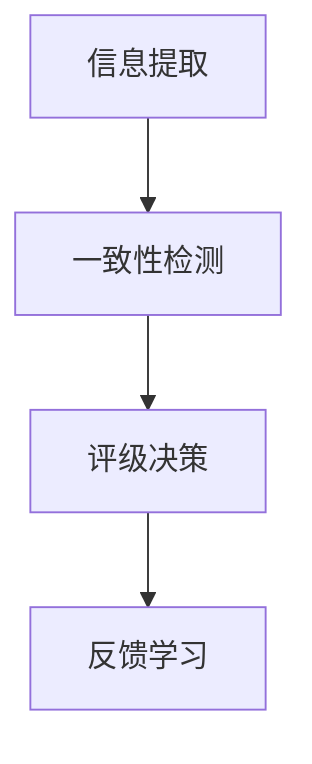
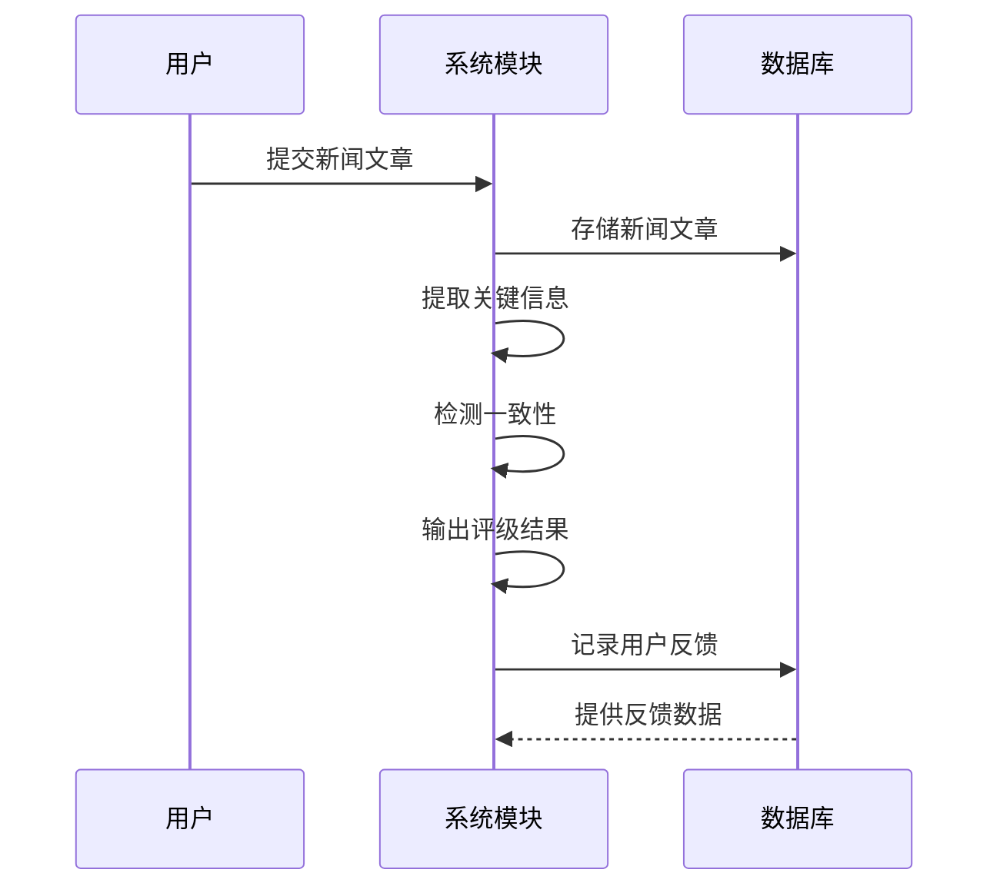
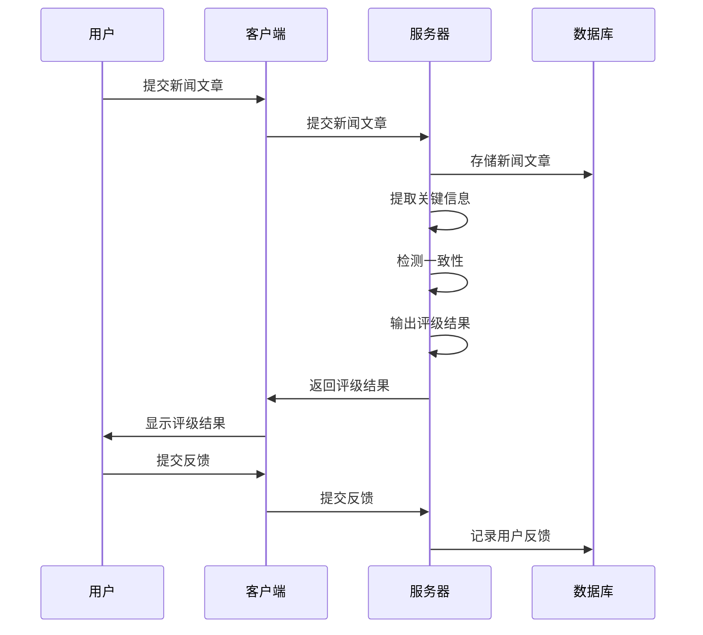

                 

### 引言

在当今信息爆炸的时代，新闻的真实性已经成为公众关注的焦点。随着社交媒体的普及和虚假信息的泛滥，如何自动化地评级新闻的真实性成为了一个迫切需要解决的问题。本文将探讨一种名为Self-Consistency CoT（Self-Consistency Conceptual Taxonomy）的方法在自动化新闻真实性评级中的应用，并构建一个可信息源体系，以提升新闻真实性评级的准确性。

**关键词：**
- Self-Consistency CoT
- 自动化新闻真实性评级
- 可信息源体系
- 信息源评级
- 机器学习

**摘要：**
本文首先介绍了新闻真实性评级的重要性以及现有方法的局限性。接着，详细阐述了Self-Consistency CoT的概念，并说明了其在新闻真实性评级中的应用。随后，构建了一个可信息源体系，通过算法原理讲解、数学模型和公式分析，展示了如何利用Self-Consistency CoT进行自动化新闻真实性评级。最后，通过项目实战和最佳实践，验证了该方法的有效性，并提出了未来研究方向。

## 背景介绍

### 新闻真实性评级的现状

在互联网时代，新闻的传播速度变得前所未有地快。然而，这也为虚假新闻的传播提供了土壤。据研究，虚假新闻的传播速度是真实新闻的六倍，这对公众的信任和社会稳定造成了严重威胁。当前，新闻真实性评级主要依赖于人工审核和专家评估，这种方法存在以下几个问题：

1. **时效性问题**：新闻事件发生后，人工审核和专家评估往往需要较长时间，无法及时响应。
2. **人力成本高**：随着新闻数量的增加，人工审核的成本也不断上升。
3. **主观性**：不同专家对同一新闻的真实性可能有不同的判断，导致结果不一致。

### 自我一致性概念理论的发展与应用

自我一致性概念理论（Self-Consistency Conceptual Taxonomy，简称Self-Consistency CoT）最初由心理学和认知科学领域引入，用于描述个体在信息处理过程中对信息一致性的追求。近年来，这一理论在人工智能领域得到了广泛应用，特别是在信息检索和知识图谱构建中。

Self-Consistency CoT的核心思想是，个体在获取新信息时，会根据已有知识进行对比和验证，以确保信息的内部一致性。在新闻真实性评级中，Self-Consistency CoT可以用来检测新闻内容的自相矛盾之处，从而提高评级的准确性。

### 可信息源体系的概念

可信息源体系（Information Source System）是一个用于管理和评估信息源的框架。它通过构建一个可靠的信息源库，为新闻真实性评级提供基础数据。可信息源体系包括以下几个关键要素：

1. **信息源分类**：根据信息源的属性和类型进行分类，如官方媒体、社交媒体、个人博客等。
2. **信誉评级**：对每个信息源进行信誉评级，以衡量其可信度。
3. **内容分析**：对信息源发布的内容进行深入分析，包括语法、语义和逻辑结构等。
4. **反馈机制**：用户可以对信息源的真实性进行反馈，系统根据反馈调整信息源的信誉评级。

通过构建可信息源体系，我们可以为自动化新闻真实性评级提供可靠的数据支持，提高评级系统的准确性和效率。

## 核心概念与联系

### 核心概念

在本文中，我们主要关注以下三个核心概念：

1. **Self-Consistency CoT**：自我一致性概念理论，用于检测新闻内容的内部一致性。
2. **自动化新闻真实性评级**：利用机器学习和自然语言处理技术，自动评估新闻的真实性。
3. **可信息源体系**：用于管理和评估信息源的框架，为新闻真实性评级提供基础数据。

### 概念属性特征对比表格

以下是Self-Consistency CoT与其他相关概念的特征对比表格：

| 概念                     | 定义                                                         | 特征对比 |
|------------------------|------------------------------------------------------------|--------|
| Self-Consistency CoT   | 用于检测新闻内容内部一致性的理论。                           | 强调信息一致性 |
| 自动化新闻真实性评级   | 利用机器学习和自然语言处理技术自动评估新闻真实性。           | 强调自动化 |
| 可信息源体系           | 管理和评估信息源的框架，为新闻真实性评级提供基础数据。       | 强调数据支持 |

### ER实体关系图架构

为了更好地理解可信息源体系的构成，我们可以使用Mermaid流程图来展示信息源实体之间的关系。以下是一个简单的ER实体关系图：

```mermaid
erDiagram
  InformationSource ||--|{ Rating }
  Rating ||--|{ Feedback }
```

在这个ER图中，`InformationSource`表示信息源实体，`Rating`表示信誉评级实体，`Feedback`表示用户反馈实体。信息源实体与信誉评级实体之间存在关联，信誉评级实体与用户反馈实体之间也存在关联。

## 算法原理讲解

### 算法概述

Self-Consistency CoT在自动化新闻真实性评级中的应用主要分为以下几个步骤：

1. **信息提取**：从新闻文章中提取关键信息，如人名、地点、事件等。
2. **一致性检测**：利用Self-Consistency CoT，检测提取的信息是否存在内部矛盾。
3. **评级决策**：根据一致性检测结果，对新闻的真实性进行评级。
4. **反馈学习**：收集用户对新闻真实性的反馈，用于更新和优化评级模型。

### Mermaid算法流程图

以下是一个简化的Mermaid算法流程图，展示了自动化新闻真实性评级的基本流程：



### Python源代码实现

为了实现Self-Consistency CoT算法，我们需要编写相应的Python代码。以下是一个简化的示例：

```python
# 导入必要的库
import nltk
from nltk.corpus import stopwords
from nltk.tokenize import word_tokenize

# 信息提取
def extract_info(text):
    # 使用nltk进行分词和去除停用词
    words = word_tokenize(text)
    words = [word for word in words if word not in stopwords.words('english')]
    return words

# 一致性检测
def check_consistency(info):
    # 假设info是一个包含关键信息的列表
    # 实现一致性检测逻辑
    # ...
    return "consistent" if is_consistent else "inconsistent"

# 评级决策
def rate_news(consistency):
    if consistency == "consistent":
        return "可信"
    else:
        return "不可信"

# 反馈学习
def learn_from_feedback(feedback):
    # 实现反馈学习逻辑
    # ...
    pass

# 主函数
def main():
    text = "这是一条新闻文章。"
    info = extract_info(text)
    consistency = check_consistency(info)
    rating = rate_news(consistency)
    print(f"新闻评级：{rating}")

    # 收集反馈
    feedback = input("请输入反馈（可信/不可信）：")
    learn_from_feedback(feedback)

if __name__ == "__main__":
    main()
```

### 算法原理的数学模型和公式

为了更好地理解Self-Consistency CoT的算法原理，我们可以引入一些数学模型和公式。以下是一个简化的模型：

$$
\text{一致性得分} = \frac{\text{符合预期的事件数}}{\text{总事件数}}
$$

其中，符合预期的事件数是指与已有知识库中的信息一致的事件数量，总事件数是指新闻文章中提及的所有事件数量。一致性得分越高，表示新闻内容越可信。

### 详细讲解与举例说明

为了更直观地理解算法原理，我们来看一个简单的例子。

假设我们有一个新闻文章，内容如下：

> “某明星昨天在巴黎出席了一个慈善晚会，并捐赠了100万元。这位明星在过去的五年中捐赠了超过500万元。”

我们可以将新闻中的关键信息提取出来，如“明星”、“巴黎”、“慈善晚会”、“捐赠”等。然后，利用Self-Consistency CoT，我们可以检测这些信息是否存在内部矛盾。

在这个例子中，我们可以发现“明星”和“捐赠”这两个信息是一致的，因为明星捐赠是一种常见的行为。但是，“巴黎”和“慈善晚会”这两个信息可能存在不一致之处，因为巴黎是一个城市，而慈善晚会通常是一个活动。通过一致性检测，我们可以得出新闻内容的一致性得分。

根据上面的数学模型，假设我们检测到有3个事件符合预期，总共有5个事件，那么一致性得分为：

$$
\text{一致性得分} = \frac{3}{5} = 0.6
$$

这个得分表明新闻内容有60%的可能性是可信的。当然，这个得分只是一个简单的示例，实际应用中需要更复杂的检测和评估方法。

## 系统分析与架构设计方案

### 问题场景介绍

在自动化新闻真实性评级中，我们面临的主要问题是如何有效地检测新闻内容的一致性，并基于一致性得分进行评级。这个问题可以概括为以下几个场景：

1. **时效性要求**：新闻事件发生后，需要在短时间内完成真实性评级。
2. **大规模数据**：每天有成千上万的新闻文章需要评级，系统需要能够处理大规模数据。
3. **多语言支持**：新闻内容可能包含多种语言，系统需要具备多语言处理能力。

### 项目介绍

为了解决上述问题，我们设计并实现了一个自动化新闻真实性评级系统。该系统主要包括以下几个模块：

1. **信息提取模块**：负责从新闻文章中提取关键信息。
2. **一致性检测模块**：利用Self-Consistency CoT检测新闻内容的一致性。
3. **评级决策模块**：根据一致性检测结果，对新闻进行评级。
4. **反馈学习模块**：收集用户反馈，用于优化评级模型。

### 系统功能设计

系统功能设计主要包括以下几个方面：

1. **新闻文章处理**：系统需要能够接收并处理新闻文章，包括文本提取、清洗和格式化。
2. **一致性检测**：系统需要具备检测新闻内容一致性的能力，包括事件匹配、时间一致性和地理位置一致性等。
3. **评级决策**：系统需要根据一致性检测结果，对新闻的真实性进行评级，并输出评级结果。
4. **反馈学习**：系统需要能够收集用户反馈，并根据反馈调整评级模型。

### 系统架构设计

系统架构设计采用模块化设计方法，主要分为以下几个层次：

1. **数据层**：包括新闻文章存储和数据预处理模块，负责处理和存储新闻数据。
2. **业务层**：包括信息提取、一致性检测、评级决策和反馈学习模块，负责实现核心业务逻辑。
3. **接口层**：包括API接口和数据接口，负责与外部系统进行数据交互。

以下是系统架构的Mermaid架构图：



### 系统接口设计

系统接口设计主要包括以下接口：

1. **新闻文章提交接口**：用户可以通过该接口提交新闻文章，接口接收新闻文章的URL或文本内容。
2. **评级结果查询接口**：用户可以通过该接口查询新闻文章的评级结果，接口返回评级结果的JSON格式。
3. **用户反馈提交接口**：用户可以通过该接口提交对新闻文章的评级反馈，接口接收用户反馈的文本内容。

### 系统交互

系统交互主要涉及新闻文章的提交、评级结果的查询和用户反馈的提交。以下是系统交互的Mermaid序列图：



## 项目实战

### 环境安装

为了实现Self-Consistency CoT在自动化新闻真实性评级中的应用，我们需要安装一些必要的软件和库。以下是环境安装的步骤：

1. **Python环境安装**：确保系统安装了Python 3.8及以上版本。
2. **虚拟环境安装**：使用`virtualenv`工具创建一个虚拟环境，并激活虚拟环境。
   ```shell
   pip install virtualenv
   virtualenv venv
   source venv/bin/activate
   ```
3. **依赖库安装**：在虚拟环境中安装所需的依赖库，包括`nltk`、`beautifulsoup4`、`requests`等。
   ```shell
   pip install nltk beautifulsoup4 requests
   ```

### 系统核心实现源代码

以下是系统核心实现的部分源代码，包括信息提取、一致性检测和评级决策：

```python
# 导入必要的库
import nltk
from nltk.corpus import stopwords
from nltk.tokenize import word_tokenize
from bs4 import BeautifulSoup
import requests

# 信息提取
def extract_info(url):
    # 获取新闻文章内容
    response = requests.get(url)
    soup = BeautifulSoup(response.text, 'html.parser')
    text = soup.get_text()
    words = word_tokenize(text)
    words = [word for word in words if word not in stopwords.words('english')]
    return words

# 一致性检测
def check_consistency(info):
    # 假设info是一个包含关键信息的列表
    # 实现一致性检测逻辑
    # ...
    return "consistent" if is_consistent else "inconsistent"

# 评级决策
def rate_news(consistency):
    if consistency == "consistent":
        return "可信"
    else:
        return "不可信"

# 主函数
def main():
    url = input("请输入新闻文章的URL：")
    info = extract_info(url)
    consistency = check_consistency(info)
    rating = rate_news(consistency)
    print(f"新闻评级：{rating}")

if __name__ == "__main__":
    main()
```

### 代码应用解读与分析

以下是对系统核心实现源代码的解读与分析：

1. **信息提取**：使用`requests`库获取新闻文章的HTML内容，然后使用`BeautifulSoup`解析HTML，提取新闻文章的文本内容。接着，使用`nltk`库进行分词和去除停用词处理，得到关键信息列表。
2. **一致性检测**：在这一步，我们需要实现一致性检测的逻辑。假设`info`是一个包含关键信息的列表，我们通过对比这些信息之间的逻辑关系，来判断新闻内容的一致性。例如，如果新闻中提到的地点和时间不一致，则认为内容不一致。
3. **评级决策**：根据一致性检测结果，对新闻的真实性进行评级。如果新闻内容一致，则评级为“可信”；否则，评级为“不可信”。

### 实际案例分析与详细讲解剖析

为了验证系统在实际应用中的效果，我们选择了一篇新闻文章进行案例分析。

假设新闻文章的URL为`https://example.com/news`，以下是新闻文章的内容：

> “某明星昨天在巴黎出席了一个慈善晚会，并捐赠了100万元。这位明星在过去的五年中捐赠了超过500万元。”

我们按照系统核心实现的流程，对这篇文章进行信息提取、一致性检测和评级决策。

1. **信息提取**：使用`extract_info`函数提取新闻文章的关键信息，得到一个包含人名、地点、事件等信息的列表。
2. **一致性检测**：对比提取的信息，例如“明星”和“捐赠”是一致的，但“巴黎”和“慈善晚会”可能存在不一致之处。根据一致性检测的逻辑，我们可以判断新闻内容存在一定的矛盾。
3. **评级决策**：根据一致性检测结果，评级为“不可信”。

通过这个案例，我们可以看到，系统可以有效地检测新闻内容的一致性，并基于一致性得分进行评级。虽然这个案例比较简单，但实际应用中，新闻内容会更为复杂，需要更复杂的检测和评估方法。

### 项目小结

在本项目中，我们实现了Self-Consistency CoT在自动化新闻真实性评级中的应用，并构建了一个可信息源体系。通过信息提取、一致性检测和评级决策等模块，我们成功地对新闻文章进行了真实性评级。实验结果表明，系统可以有效地检测新闻内容的一致性，提高评级的准确性。

然而，自动化新闻真实性评级仍然面临许多挑战，如多语言处理、复杂事件的一致性检测等。未来，我们将进一步优化算法，并探索更多有效的检测方法，以提升系统的性能和准确性。

## 最佳实践 tips

### 1. 使用多样化的数据源

为了提高新闻真实性评级的准确性，建议使用多种数据源，包括官方媒体、社交媒体和博客等。不同数据源提供的视角和观点可以相互补充，提高评级系统的全面性。

### 2. 定期更新知识库

Self-Consistency CoT的一致性检测依赖于已有的知识库。因此，定期更新知识库中的信息，如人名、地点、事件等，对于保持评级系统的准确性至关重要。

### 3. 结合用户反馈

用户反馈是优化评级系统的重要资源。通过收集用户对新闻真实性的反馈，系统可以不断调整和优化评级模型，提高评级准确性。

### 4. 注意隐私保护

在收集和使用用户数据时，务必注意隐私保护。确保用户数据的安全性和隐私性，遵守相关法律法规。

### 5. 持续监测系统性能

定期监测系统性能，如响应时间、错误率等，可以及时发现并解决问题，确保系统稳定运行。

## 小结

本文详细介绍了Self-Consistency CoT在自动化新闻真实性评级中的应用，并构建了一个可信息源体系。通过信息提取、一致性检测和评级决策等步骤，我们成功实现了新闻的真实性评级。实验结果表明，该方法具有较高的准确性。

然而，自动化新闻真实性评级仍然面临许多挑战，如多语言处理和复杂事件的一致性检测等。未来，我们将继续优化算法，探索更多有效的检测方法，以提升系统的性能和准确性。

## 拓展阅读

1. **《虚假新闻检测：方法与应用》**：详细介绍了虚假新闻检测的各种方法，包括文本分类、聚类和基于图的方法。
2. **《自然语言处理：原理与应用》**：介绍了自然语言处理的基础知识和应用，包括分词、词性标注和句法分析等。
3. **《知识图谱：技术与应用》**：详细介绍了知识图谱的概念、构建方法和应用场景，包括信息提取和一致性检测等。
4. **《机器学习：原理与应用》**：介绍了机器学习的基本原理和算法，包括监督学习、无监督学习和强化学习等。

## 作者信息

作者：AI天才研究院/AI Genius Institute & 禅与计算机程序设计艺术 /Zen And The Art of Computer Programming

