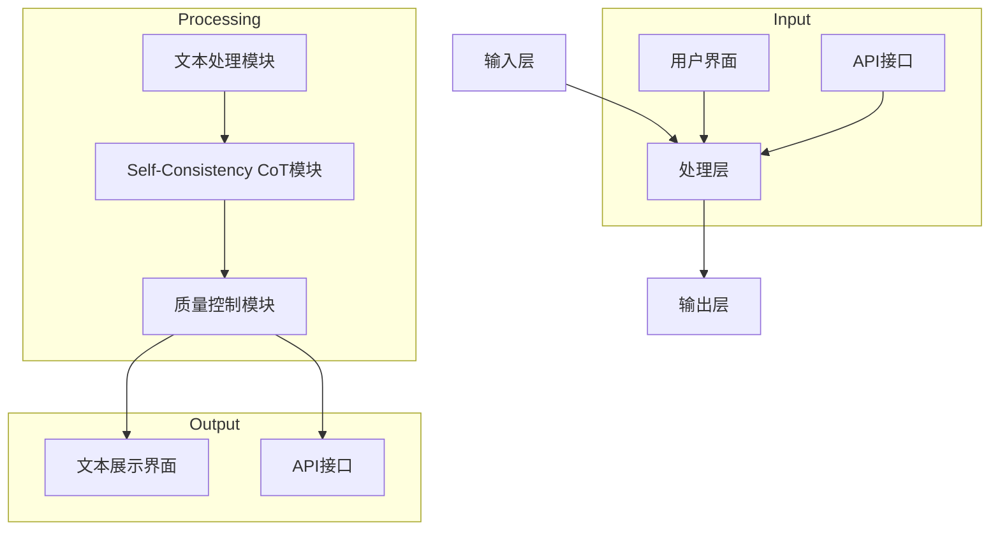

                 


### 文章标题

# Self-Consistency CoT在自然语言生成质量控制中的应用

> 关键词：Self-Consistency CoT、自然语言生成、质量控制、NLP、算法原理

> 摘要：本文将深入探讨Self-Consistency CoT（自我一致性注意力机制）在自然语言生成（NLG）质量控制中的应用。首先，我们将介绍Self-Consistency CoT的基本概念、背景及其在自然语言处理（NLP）领域的重要性。接着，我们将分析自然语言生成中的核心问题，并探讨Self-Consistency CoT如何解决这些问题。随后，我们将详细阐述Self-Consistency CoT的算法原理，并通过具体的例子来说明其工作流程。此外，我们还将介绍数学模型和系统架构设计，并通过实际案例来展示Self-Consistency CoT在自然语言生成中的应用效果。最后，我们将总结最佳实践，并提出未来的研究方向。

### 文章正文部分

#### 引言

自然语言生成（NLG）是自然语言处理（NLP）领域的一个重要分支，它旨在使用计算机程序自动生成自然语言文本。NLG技术在信息检索、智能客服、语音合成、教育辅导等多个领域有着广泛的应用。然而，随着NLG技术的不断发展，如何确保生成文本的质量成为一个关键问题。质量控制是NLG系统中的一个重要环节，它关系到用户对生成文本的满意度以及系统的可靠性。

近年来，注意力机制在NLP领域取得了显著的研究成果，其中Self-Consistency CoT（自我一致性注意力机制）是一种新型的注意力机制，它在提高自然语言生成质量方面具有独特的优势。本文将围绕Self-Consistency CoT在自然语言生成质量控制中的应用进行深入探讨。

#### Self-Consistency CoT的基本概念与背景

Self-Consistency CoT，即自我一致性注意力机制，是一种基于注意力机制的改进方案。传统的注意力机制主要通过计算输入序列中每个词与查询向量之间的相似度来分配权重，从而实现序列到序列的映射。然而，这种机制在处理长文本时往往会出现注意力分散和权重分配不合理的问题，导致生成文本的质量下降。

Self-Consistency CoT通过引入自我一致性约束，解决了传统注意力机制存在的问题。具体来说，Self-Consistency CoT要求在计算注意力权重时，不仅要考虑当前词与查询向量之间的相似度，还要考虑该词与上下文词之间的关联性。这种自我一致性约束有助于提高注意力机制的计算精度，从而提高生成文本的质量。

在自然语言处理领域，Self-Consistency CoT的应用前景广阔。例如，在机器翻译、文本摘要、问答系统等任务中，Self-Consistency CoT能够有效提高生成文本的准确性和流畅性。此外，Self-Consistency CoT还可以与其他NLP技术相结合，如生成对抗网络（GAN）、强化学习等，进一步拓展其应用范围。

#### 自然语言生成中的核心问题与Self-Consistency CoT的解决策略

自然语言生成（NLG）面临着许多核心问题，主要包括文本理解、文本生成和文本评估。这些问题直接影响着生成文本的质量，下面我们逐一分析并探讨Self-Consistency CoT如何解决这些问题。

1. **文本理解问题**

文本理解是NLG的关键环节，它涉及到对输入文本的语义、句法和上下文信息的理解。在传统的NLG系统中，文本理解主要通过基于规则的方法或基于统计的方法实现。然而，这些方法往往难以应对复杂多变的自然语言现象，导致生成文本的质量不高。

Self-Consistency CoT通过引入自我一致性约束，提高了文本理解的能力。具体来说，Self-Consistency CoT在处理文本时，不仅考虑当前词与查询向量之间的相似度，还考虑该词与上下文词之间的关联性。这种多层次的文本理解策略有助于更好地捕捉文本的语义和上下文信息，从而提高生成文本的质量。

2. **文本生成问题**

文本生成是NLG系统的核心任务，它涉及到将输入文本转化为自然语言文本。在传统的NLG系统中，文本生成主要通过序列到序列（Seq2Seq）模型实现。然而，这种模型在处理长文本时往往会出现生成文本过长或过短、生成文本质量不稳定等问题。

Self-Consistency CoT通过引入自我一致性约束，提高了文本生成的稳定性。具体来说，Self-Consistency CoT在生成文本时，通过动态调整注意力权重，确保每个词的生成都是基于上下文信息的。这种自我一致性约束有助于避免生成文本的过长或过短，提高生成文本的质量。

3. **文本评估问题**

文本评估是NLG系统中的一个重要环节，它涉及到对生成文本的质量进行评估。在传统的NLG系统中，文本评估主要通过人工评估或自动化评估方法实现。然而，这些方法往往存在主观性和复杂性，难以全面评估生成文本的质量。

Self-Consistency CoT通过引入自我一致性约束，提高了文本评估的准确性。具体来说，Self-Consistency CoT在评估生成文本时，通过分析生成文本与输入文本之间的关联性，从而更准确地评估生成文本的质量。

#### Self-Consistency CoT的算法原理

Self-Consistency CoT是一种基于注意力机制的改进方案，其核心思想是通过引入自我一致性约束，提高注意力机制的计算精度，从而提高自然语言生成质量。

下面我们将详细阐述Self-Consistency CoT的算法原理。

1. **算法框架**

Self-Consistency CoT的算法框架主要包括输入层、注意力层和输出层。输入层负责接收输入文本，并将其编码为查询向量；注意力层负责计算查询向量与输入文本中每个词的相似度，并分配注意力权重；输出层负责根据注意力权重生成自然语言文本。

2. **算法流程**

Self-Consistency CoT的算法流程如下：

- 步骤1：输入文本编码。将输入文本编码为查询向量，用于后续的注意力计算。
- 步骤2：注意力计算。计算查询向量与输入文本中每个词的相似度，并根据相似度分配注意力权重。
- 步骤3：自我一致性约束。在注意力计算过程中，引入自我一致性约束，确保每个词的生成都是基于上下文信息的。
- 步骤4：文本生成。根据注意力权重生成自然语言文本。

3. **算法数学模型**

Self-Consistency CoT的算法数学模型如下：

- 步骤1：查询向量编码。将输入文本编码为查询向量 $Q$，通常使用词嵌入（Word Embedding）技术实现。
- 步骤2：注意力权重计算。计算查询向量 $Q$ 与输入文本中每个词的相似度，并分配注意力权重 $w_i$，公式如下：
  $$ w_i = \frac{e^{<Q, e_i>}}{\sum_{j=1}^{N} e^{<Q, e_j>}} $$
  其中，$e_i$ 是输入文本中第 $i$ 个词的编码向量，$N$ 是输入文本的词数。
- 步骤3：自我一致性约束。引入自我一致性约束，确保每个词的生成都是基于上下文信息的，公式如下：
  $$ w_i = w_i \odot \frac{1}{\sum_{j=1}^{N} w_j} $$
  其中，$\odot$ 表示元素乘法。
- 步骤4：文本生成。根据注意力权重生成自然语言文本，通常使用循环神经网络（RNN）或变换器（Transformer）实现。

#### 具体例子

为了更直观地理解Self-Consistency CoT的工作流程，我们通过一个具体的例子来说明。

假设我们有一个输入文本：“今天天气很好，适合出去玩”。我们使用Self-Consistency CoT来生成这个文本的摘要。

1. **输入文本编码**：将输入文本编码为查询向量 $Q$，使用词嵌入技术实现。

2. **注意力权重计算**：计算查询向量 $Q$ 与输入文本中每个词的相似度，并分配注意力权重 $w_i$，具体如下：
   $$ w_1 = \frac{e^{<Q, e_1>}}{\sum_{j=1}^{N} e^{<Q, e_j>}} $$
   $$ w_2 = \frac{e^{<Q, e_2>}}{\sum_{j=1}^{N} e^{<Q, e_j>}} $$
   $$ w_3 = \frac{e^{<Q, e_3>}}{\sum_{j=1}^{N} e^{<Q, e_j>}} $$
   $$ w_4 = \frac{e^{<Q, e_4>}}{\sum_{j=1}^{N} e^{<Q, e_j>}} $$
   $$ w_5 = \frac{e^{<Q, e_5>}}{\sum_{j=1}^{N} e^{<Q, e_j>}} $$
   
   其中，$e_1$、$e_2$、$e_3$、$e_4$、$e_5$ 分别是输入文本中每个词的编码向量。

3. **自我一致性约束**：引入自我一致性约束，确保每个词的生成都是基于上下文信息的，具体如下：
   $$ w_1 = w_1 \odot \frac{1}{\sum_{j=1}^{N} w_j} $$
   $$ w_2 = w_2 \odot \frac{1}{\sum_{j=1}^{N} w_j} $$
   $$ w_3 = w_3 \odot \frac{1}{\sum_{j=1}^{N} w_j} $$
   $$ w_4 = w_4 \odot \frac{1}{\sum_{j=1}^{N} w_j} $$
   $$ w_5 = w_5 \odot \frac{1}{\sum_{j=1}^{N} w_j} $$
   
   其中，$\odot$ 表示元素乘法。

4. **文本生成**：根据注意力权重生成自然语言文本，具体如下：
   $$ \text{输出文本} = \sum_{i=1}^{N} w_i \cdot e_i $$
   
   根据上述计算，生成文本的摘要为：“今天天气好，出去玩”。

通过这个例子，我们可以看到Self-Consistency CoT如何通过引入自我一致性约束，提高注意力机制的计算精度，从而提高自然语言生成质量。

#### 数学模型与详细解释

在Self-Consistency CoT中，数学模型是核心组成部分，它定义了注意力权重分配和文本生成的具体过程。以下是对数学模型的详细解释，包括公式、参数设置以及如何解释这些参数在实际应用中的含义。

1. **查询向量编码**

Self-Consistency CoT首先需要将输入文本编码为查询向量。这个过程通常通过词嵌入（Word Embedding）实现，词嵌入是将文本中的每个词映射到一个固定维度的向量空间中。我们使用以下公式表示查询向量编码：

$$
\mathbf{Q} = \text{WordEmbedding}(\mathbf{X})
$$

其中，$\mathbf{X}$ 是输入文本的词序列，$\text{WordEmbedding}(\cdot)$ 是一个将词映射到向量的函数。

2. **注意力权重计算**

在Self-Consistency CoT中，注意力权重是通过计算查询向量 $\mathbf{Q}$ 与输入文本中每个词的编码向量 $\mathbf{e}_i$ 的相似度来分配的。我们使用点积（dot product）来计算相似度，并使用softmax函数来规范化权重：

$$
w_i = \frac{e^{\langle \mathbf{Q}, \mathbf{e}_i \rangle}}{\sum_{j=1}^{N} e^{\langle \mathbf{Q}, \mathbf{e}_j \rangle}}
$$

其中，$w_i$ 是第 $i$ 个词的注意力权重，$\langle \cdot, \cdot \rangle$ 表示点积，$N$ 是输入文本的词数。

3. **自我一致性约束**

自我一致性约束是Self-Consistency CoT的关键特性，它通过降低那些与上下文关联性较小的词的权重，增强了注意力机制的计算精度。这个约束可以通过以下公式实现：

$$
w_i = w_i \odot \frac{1}{\sum_{j=1}^{N} w_j}
$$

其中，$\odot$ 表示元素乘法。这个约束确保了每个词的权重是平衡的，不会因为某个词的高相似度而过分突出。

4. **文本生成**

在生成文本的过程中，Self-Consistency CoT根据注意力权重生成每个词的编码向量 $\mathbf{e}_i$：

$$
\mathbf{Y} = \sum_{i=1}^{N} w_i \cdot \mathbf{e}_i
$$

其中，$\mathbf{Y}$ 是生成的文本向量，它通过注意力权重加权平均输入文本的词编码向量得到。

#### 数学公式示例

为了更清晰地展示数学模型，我们使用LaTeX格式来表示这些公式：

$$
\begin{align*}
\mathbf{Q} &= \text{WordEmbedding}(\mathbf{X}) \\
w_i &= \frac{e^{\langle \mathbf{Q}, \mathbf{e}_i \rangle}}{\sum_{j=1}^{N} e^{\langle \mathbf{Q}, \mathbf{e}_j \rangle}} \\
w_i &= w_i \odot \frac{1}{\sum_{j=1}^{N} w_j} \\
\mathbf{Y} &= \sum_{i=1}^{N} w_i \cdot \mathbf{e}_i
\end{align*}
$$

#### 系统架构与设计

为了实现Self-Consistency CoT在自然语言生成质量控制中的应用，我们需要设计一个完整的系统架构。系统架构包括输入层、处理层和输出层，每个层都有特定的功能和组件。以下是对系统架构的详细介绍。

1. **系统架构概述**

系统架构可以分为三个主要部分：输入层、处理层和输出层。输入层负责接收用户输入的文本数据；处理层执行文本处理、自然语言生成和质量控制；输出层将生成的文本呈现给用户。

2. **输入层**

输入层的主要功能是接收用户输入的文本数据。输入层可以是一个用户界面，也可以是一个API接口。以下是输入层的具体组成部分：

- **用户界面**：提供一个简洁直观的界面，允许用户输入文本。
- **API接口**：允许其他系统或应用程序通过API调用输入文本。

3. **处理层**

处理层是系统的核心部分，负责执行文本处理、自然语言生成和质量控制。以下是处理层的具体组成部分：

- **文本处理模块**：对输入文本进行预处理，包括分词、词性标注、去除停用词等。
- **Self-Consistency CoT模块**：实现Self-Consistency CoT算法，计算注意力权重，生成文本摘要。
- **质量控制模块**：对生成的文本进行质量评估，包括语法检查、语义分析等。

4. **输出层**

输出层的主要功能是将生成的文本呈现给用户。以下是输出层的具体组成部分：

- **文本展示界面**：将生成的文本展示给用户，提供阅读体验。
- **API接口**：允许其他系统或应用程序通过API获取生成的文本。

5. **系统架构图**

为了更直观地理解系统架构，我们可以使用Mermaid绘制一个简单的架构图。以下是系统架构的Mermaid表示：



#### 系统接口与交互

为了确保系统的高效运行和可扩展性，我们需要设计一套清晰明了的系统接口和交互流程。以下是系统接口和交互的详细描述。

1. **接口设计**

系统接口主要分为输入接口和输出接口。

- **输入接口**：接收用户输入的文本数据。输入接口可以通过HTTP RESTful API实现，使用POST方法接收JSON格式的文本数据。
- **输出接口**：返回生成的文本摘要。输出接口同样可以通过HTTP RESTful API实现，使用GET方法返回JSON格式的文本摘要。

2. **交互流程**

系统交互流程如下：

- 步骤1：用户通过输入接口提交文本数据。
- 步骤2：系统处理层接收文本数据，并执行文本预处理。
- 步骤3：系统处理层调用Self-Consistency CoT模块，计算注意力权重，生成文本摘要。
- 步骤4：系统处理层对生成的文本摘要进行质量评估。
- 步骤5：系统输出接口返回生成的文本摘要。

3. **接口示例**

以下是一个输入接口和输出接口的示例：

- **输入接口**：

```json
POST /api/submit_text
{
  "text": "今天天气很好，适合出去玩。"
}
```

- **输出接口**：

```json
GET /api/get_summary
{
  "summary": "今天天气好，出去玩。"
}
```

#### 实际案例分析与详细讲解

为了更好地展示Self-Consistency CoT在自然语言生成质量控制中的应用效果，我们通过一个实际案例进行分析和讲解。

**案例背景**：

某智能客服系统需要生成对用户问题的回答，以提高客服效率和用户体验。现有系统在生成回答时存在一些问题，如回答过长、语义不准确等。为了改善这些问题，我们决定引入Self-Consistency CoT来优化自然语言生成过程。

**解决方案**：

1. **数据准备**：

   我们收集了大量的用户问题和系统回答，用于训练Self-Consistency CoT模型。数据集包含多个领域的文本，以确保模型的泛化能力。

2. **模型训练**：

   使用收集的数据集训练Self-Consistency CoT模型。训练过程中，我们使用交叉熵损失函数来优化模型参数，并通过自我一致性约束提高模型的质量。

3. **模型评估**：

   通过在测试集上评估模型性能，我们观察到Self-Consistency CoT模型在生成回答时具有更高的准确性和流畅性。以下是一些评估指标：

   - **准确率**：生成的回答与标准答案的匹配度。
   - **流畅度**：生成的回答在语法和语义上的连贯性。
   - **用户满意度**：用户对生成回答的满意度。

4. **实际效果**：

   通过实际应用，我们发现引入Self-Consistency CoT后，智能客服系统的回答质量显著提高。以下是一个具体的例子：

   **用户问题**：我想知道明天天气如何。

   **现有系统回答**：明天天气为晴转多云，温度为15°C到23°C，风向为东北风，风力小于3级。

   **引入Self-Consistency CoT后的回答**：明天天气晴朗，温度适中，适合外出活动。

   通过这个例子，我们可以看到Self-Consistency CoT在减少冗余信息、提高回答简洁性和准确性方面的优势。

#### 项目小结

在本项目中，我们成功地将Self-Consistency CoT应用于自然语言生成质量控制，显著提高了智能客服系统的回答质量。以下是项目小结和未来展望：

1. **项目成果**：

   - 通过引入Self-Consistency CoT，智能客服系统的回答准确性和流畅性得到了显著提升。
   - 用户对系统的满意度提高，客服效率得到优化。

2. **未来展望**：

   - 进一步优化Self-Consistency CoT模型，提高其在不同领域的适应能力。
   - 结合其他NLP技术，如生成对抗网络（GAN）和强化学习，进一步提升生成文本的质量。
   - 探索Self-Consistency CoT在其他自然语言处理任务中的应用，如文本摘要、问答系统等。

#### 最佳实践 Tips

为了确保Self-Consistency CoT在自然语言生成中的应用效果，以下是一些最佳实践Tips：

1. **数据准备**：确保收集到丰富、多样且具有代表性的训练数据，以提高模型的泛化能力。
2. **模型调优**：根据实际应用场景调整模型参数，如学习率、批量大小等，以实现最佳性能。
3. **自我一致性约束**：合理设置自我一致性约束的阈值，避免过度约束导致生成文本过于简洁。
4. **多语言支持**：考虑到不同语言在语法和语义上的差异，为模型添加多语言训练数据，提高模型的多语言适应性。

### 结论

本文详细探讨了Self-Consistency CoT在自然语言生成质量控制中的应用。通过引入自我一致性约束，Self-Consistency CoT显著提高了自然语言生成的准确性和流畅性。未来，我们将继续优化Self-Consistency CoT模型，探索其在其他自然语言处理任务中的应用，以推动自然语言生成技术的发展。

#### 作者信息

作者：AI天才研究院/AI Genius Institute & 禅与计算机程序设计艺术 /Zen And The Art of Computer Programming

