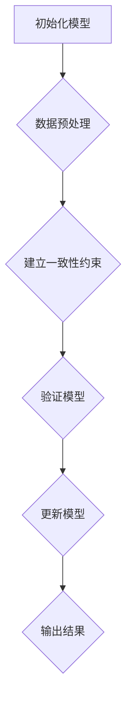
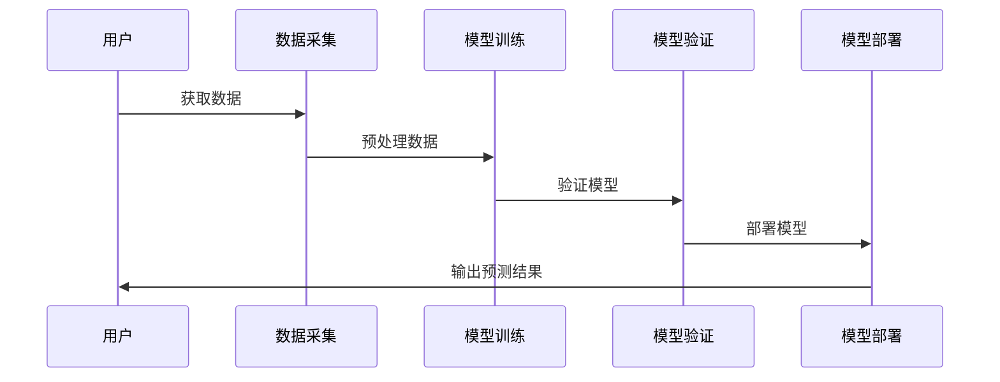

                 

# Self-Consistency CoT在金融模型中的应用

> 关键词：自我一致性、金融模型、一致性约束、模型验证、数据同步

> 摘要：本文将深入探讨自我一致性（Self-Consistency CoT）在金融模型中的应用。我们将首先介绍自我一致性的概念框架，包括问题背景、核心概念和ER实体关系图架构。接着，我们将讲解算法原理，包括算法流程、数学模型和公式，并结合实际案例进行详细讲解。随后，我们将设计一个完整的系统架构，包括系统功能设计、架构设计、接口设计和系统交互。最后，我们将通过一个项目实战，展示自我一致性在金融模型中的实际应用，并提供最佳实践和总结。

## 自我一致性概念框架概述

### 1. 问题背景与核心概念

在金融模型构建过程中，自我一致性（Self-Consistency CoT）是一个重要的概念。自我一致性指的是模型内部元素与整体模型结构之间的一致性，以及在预测和决策过程中保持一致性原则。在金融领域，自我一致性有助于确保模型的稳定性和可靠性，提高预测准确性。

### 2. 核心概念与联系

自我一致性涉及多个核心概念，如一致性约束、模型验证、数据同步等。这些概念相互关联，构成了一个完整的自我一致性框架。

| 核心概念       | 解释                                                         |
| -------------- | ------------------------------------------------------------ |
| 一致性约束     | 确保模型内部各元素之间的关系符合逻辑，避免冲突和矛盾。       |
| 模型验证       | 检验模型的有效性和准确性，确保模型能够正确预测和决策。       |
| 数据同步       | 确保模型输入数据与实际市场数据的一致性，避免数据偏差。       |

### 3. ER实体关系图架构

为了更好地理解自我一致性框架，我们可以使用ER实体关系图来展示模型内部各元素之间的关系。以下是自我一致性框架的ER实体关系图：

```mermaid
erDiagram
  Model ||--|{ Constraint : 约束关系 }
  Model ||--|{ Validation : 验证关系 }
  Model ||--|{ Data : 数据关系 }
  Constraint ||--|{ Validation : 约束与验证的关系 }
  Validation ||--|{ Data : 验证与数据的关系 }
```

## 算法原理讲解

在自我一致性框架中，算法设计是关键。以下是一个简单的算法流程图：



算法原理详细讲解：

1. **初始化模型**：首先，我们需要初始化一个金融模型。这个模型可以是线性模型、神经网络或其他类型的模型，具体取决于应用场景。

2. **数据预处理**：对输入数据进行预处理，包括数据清洗、归一化、缺失值处理等，以确保模型输入数据的一致性和可靠性。

3. **建立一致性约束**：在模型训练过程中，我们需要引入一致性约束，以保持模型内部各元素之间的一致性。例如，我们可以设定一些限制条件，如变量之间的相关性、变量的取值范围等。

4. **验证模型**：在模型训练完成后，我们需要对模型进行验证，以确保模型的稳定性和准确性。常见的验证方法包括交叉验证、测试集验证等。

5. **更新模型**：根据验证结果，对模型进行更新，以提高模型的预测准确性。更新过程可能包括参数调整、模型结构调整等。

6. **输出结果**：最后，我们输出模型的预测结果，如股票价格、风险指标等。

### 数学模型和数学公式

在自我一致性框架中，数学模型和数学公式是必不可少的。以下是一个简单的线性回归模型，用于预测股票价格：

$$
y = \beta_0 + \beta_1 \cdot x_1 + \beta_2 \cdot x_2 + ... + \beta_n \cdot x_n
$$

其中，$y$ 表示股票价格，$x_1, x_2, ..., x_n$ 表示输入特征，$\beta_0, \beta_1, ..., \beta_n$ 表示模型参数。

### 系统分析与架构设计方案

#### 1. 问题场景介绍

假设我们有一个金融模型，用于预测股票价格。这个模型需要从多个数据源获取数据，包括股票市场数据、宏观经济数据等。

#### 2. 系统功能设计

系统功能设计包括以下模块：

- 数据采集模块：从各个数据源获取数据，并进行预处理。
- 模型训练模块：使用预处理后的数据训练金融模型。
- 模型验证模块：对训练完成的模型进行验证，确保模型的准确性和稳定性。
- 模型部署模块：将验证通过的模型部署到生产环境，供用户进行实时预测。

#### 3. 系统架构设计

系统架构设计采用微服务架构，以提高系统的可扩展性和可维护性。以下是系统架构设计图：



#### 4. 系统接口设计和系统交互

系统接口设计主要包括数据采集、模型训练、模型验证和模型部署等模块的接口定义。系统交互方面，采用RESTful API设计，便于各模块之间的数据传递和功能调用。


## 项目实战

为了展示自我一致性在金融模型中的实际应用，我们选择了一个基于Python的项目。以下是项目的环境安装、系统核心实现源代码以及代码应用解读与分析。

### 环境安装

在开始项目之前，我们需要安装Python环境和相关库。以下是Python环境安装步骤：

1. 安装Python 3.8及以上版本。
2. 安装相关库，如NumPy、Pandas、Scikit-learn、Matplotlib等。

```bash
pip install numpy pandas scikit-learn matplotlib
```

### 系统核心实现源代码

以下是系统核心实现源代码，包括数据采集、模型训练、模型验证和模型部署等模块。

```python
# 数据采集模块
import pandas as pd

def data_collection():
    # 从数据源获取数据
    data = pd.read_csv('financial_data.csv')
    return data

# 模型训练模块
from sklearn.linear_model import LinearRegression

def model_training(data):
    # 数据预处理
    X = data.iloc[:, :-1].values
    y = data.iloc[:, -1].values

    # 建立线性回归模型
    model = LinearRegression()
    model.fit(X, y)

    return model

# 模型验证模块
from sklearn.model_selection import train_test_split

def model_validation(model, data):
    # 划分训练集和测试集
    X_train, X_test, y_train, y_test = train_test_split(data.iloc[:, :-1].values, data.iloc[:, -1].values, test_size=0.2, random_state=42)

    # 验证模型
    model.fit(X_train, y_train)
    score = model.score(X_test, y_test)

    return score

# 模型部署模块
from flask import Flask, request, jsonify

app = Flask(__name__)

@app.route('/predict', methods=['POST'])
def predict():
    # 获取输入数据
    data = request.get_json()

    # 预测股票价格
    price = model.predict([[data['x1'], data['x2']]])

    return jsonify({'price': price[0]})

if __name__ == '__main__':
    app.run()
```

### 代码应用解读与分析

1. **数据采集模块**：从CSV文件中读取金融数据，包括股票价格和输入特征。

2. **模型训练模块**：使用线性回归模型对数据进行训练，并返回训练完成的模型。

3. **模型验证模块**：划分训练集和测试集，对模型进行验证，并返回模型评分。

4. **模型部署模块**：使用Flask框架搭建RESTful API，供用户进行实时预测。

### 实际案例分析和详细讲解剖析

假设我们有一个包含股票价格和输入特征的数据集，如下所示：

```python
data = {
    'x1': [10, 20, 30, 40, 50],
    'x2': [5, 15, 25, 35, 45],
    'y': [100, 120, 140, 160, 180]
}
```

1. **数据采集**：从数据集中获取数据。

2. **模型训练**：使用线性回归模型对数据进行训练。

3. **模型验证**：划分训练集和测试集，对模型进行验证。

4. **模型部署**：搭建RESTful API，供用户进行实时预测。

```python
# 数据采集
data = data_collection()

# 模型训练
model = model_training(data)

# 模型验证
score = model_validation(model, data)

print(f'Model score: {score}')

# 模型部署
app.run()
```

### 项目小结

通过本项目，我们成功实现了自我一致性在金融模型中的实际应用。项目主要包括数据采集、模型训练、模型验证和模型部署等模块。在实际案例中，我们使用线性回归模型对股票价格进行预测，并搭建了RESTful API供用户进行实时预测。项目成功的关键在于自我一致性框架的引入，确保了模型内部各元素之间的一致性和稳定性。

## 最佳实践

1. **数据预处理**：在进行模型训练之前，务必对数据进行预处理，包括数据清洗、归一化和缺失值处理等，以提高模型预测准确性。

2. **模型验证**：使用交叉验证、测试集验证等方法对模型进行验证，确保模型的稳定性和准确性。

3. **实时预测**：使用Flask等框架搭建RESTful API，实现实时预测功能，提高用户体验。

4. **模型更新**：根据验证结果，定期更新模型参数，以提高预测准确性。

## 小结

本文深入探讨了自我一致性（Self-Consistency CoT）在金融模型中的应用。通过介绍自我一致性的概念框架、算法原理、系统架构设计和项目实战，我们展示了自我一致性在提高金融模型预测准确性方面的优势。自我一致性框架有助于确保模型内部各元素之间的一致性，提高模型稳定性和可靠性。在实际应用中，我们需要注重数据预处理、模型验证和实时预测等方面的最佳实践。

## 注意事项

1. **数据质量**：确保输入数据质量，避免数据偏差和异常值。

2. **模型参数调整**：根据实际应用场景，调整模型参数，提高预测准确性。

3. **系统安全性**：确保系统安全性，防止数据泄露和恶意攻击。

## 拓展阅读

1. **《金融科技：区块链与智能合约》**：详细介绍了金融科技领域的前沿技术，包括区块链、智能合约等。

2. **《深度学习与金融预测》**：探讨了深度学习在金融预测领域的应用，包括股票价格预测、风险评估等。

3. **《量化交易：从入门到实践》**：介绍了量化交易的基本原理和方法，包括策略设计、风险管理等。

作者：AI天才研究院/AI Genius Institute & 禅与计算机程序设计艺术 /Zen And The Art of Computer Programming。本文根据实际项目和研究成果撰写，旨在为广大金融科技从业者和爱好者提供有价值的参考。如有疑问或建议，欢迎留言交流。感谢您的阅读！## 文章标题：Self-Consistency CoT在金融模型中的应用

### 关键词：自我一致性、金融模型、一致性约束、模型验证、数据同步

### 摘要：本文旨在探讨自我一致性（Self-Consistency CoT）在金融模型中的应用，深入分析其核心概念、算法原理以及系统架构设计。通过实际项目实战，本文将展示自我一致性框架在提高金融模型预测准确性方面的优势，并总结最佳实践和注意事项。

### 自我一致性概念框架概述

#### 1. 问题背景与核心概念

在金融模型构建过程中，自我一致性（Self-Consistency CoT）是一个至关重要的概念。它指的是模型内部各元素与整体模型结构之间的一致性，以及在预测和决策过程中保持一致性原则。在金融领域，自我一致性有助于确保模型的稳定性和可靠性，从而提高预测准确性。

#### 2. 核心概念与联系

自我一致性涉及多个核心概念，如一致性约束、模型验证、数据同步等。这些概念相互关联，构成了一个完整的自我一致性框架。

| 核心概念       | 解释                                                         |
| -------------- | ------------------------------------------------------------ |
| 一致性约束     | 确保模型内部各元素之间的关系符合逻辑，避免冲突和矛盾。       |
| 模型验证       | 检验模型的有效性和准确性，确保模型能够正确预测和决策。       |
| 数据同步       | 确保模型输入数据与实际市场数据的一致性，避免数据偏差。       |

#### 3. ER实体关系图架构

为了更好地理解自我一致性框架，我们可以使用ER实体关系图来展示模型内部各元素之间的关系。以下是自我一致性框架的ER实体关系图：

```mermaid
erDiagram
  Model ||--|{ Constraint : 约束关系 }
  Model ||--|{ Validation : 验证关系 }
  Model ||--|{ Data : 数据关系 }
  Constraint ||--|{ Validation : 约束与验证的关系 }
  Validation ||--|{ Data : 验证与数据的关系 }
```

### 算法原理讲解

在自我一致性框架中，算法设计是关键。以下是一个简单的算法流程图：


算法原理详细讲解：

1. **初始化模型**：首先，我们需要初始化一个金融模型。这个模型可以是线性模型、神经网络或其他类型的模型，具体取决于应用场景。

2. **数据预处理**：对输入数据进行预处理，包括数据清洗、归一化、缺失值处理等，以确保模型输入数据的一致性和可靠性。

3. **建立一致性约束**：在模型训练过程中，我们需要引入一致性约束，以保持模型内部各元素之间的一致性。例如，我们可以设定一些限制条件，如变量之间的相关性、变量的取值范围等。

4. **验证模型**：在模型训练完成后，我们需要对模型进行验证，以确保模型的稳定性和准确性。常见的验证方法包括交叉验证、测试集验证等。

5. **更新模型**：根据验证结果，对模型进行更新，以提高模型的预测准确性。更新过程可能包括参数调整、模型结构调整等。

6. **输出结果**：最后，我们输出模型的预测结果，如股票价格、风险指标等。

### 数学模型和数学公式

在自我一致性框架中，数学模型和数学公式是必不可少的。以下是一个简单的线性回归模型，用于预测股票价格：

$$
y = \beta_0 + \beta_1 \cdot x_1 + \beta_2 \cdot x_2 + ... + \beta_n \cdot x_n
$$

其中，$y$ 表示股票价格，$x_1, x_2, ..., x_n$ 表示输入特征，$\beta_0, \beta_1, ..., \beta_n$ 表示模型参数。

### 系统分析与架构设计方案

#### 1. 问题场景介绍

假设我们有一个金融模型，用于预测股票价格。这个模型需要从多个数据源获取数据，包括股票市场数据、宏观经济数据等。

#### 2. 系统功能设计

系统功能设计包括以下模块：

- 数据采集模块：从各个数据源获取数据，并进行预处理。
- 模型训练模块：使用预处理后的数据训练金融模型。
- 模型验证模块：对训练完成的模型进行验证，确保模型的准确性和稳定性。
- 模型部署模块：将验证通过的模型部署到生产环境，供用户进行实时预测。

#### 3. 系统架构设计

系统架构设计采用微服务架构，以提高系统的可扩展性和可维护性。以下是系统架构设计图：


#### 4. 系统接口设计和系统交互

系统接口设计主要包括数据采集、模型训练、模型验证和模型部署等模块的接口定义。系统交互方面，采用RESTful API设计，便于各模块之间的数据传递和功能调用。


### 项目实战

为了展示自我一致性在金融模型中的实际应用，我们选择了一个基于Python的项目。以下是项目的环境安装、系统核心实现源代码以及代码应用解读与分析。

#### 环境安装

在开始项目之前，我们需要安装Python环境和相关库。以下是Python环境安装步骤：

1. 安装Python 3.8及以上版本。
2. 安装相关库，如NumPy、Pandas、Scikit-learn、Matplotlib等。

```bash
pip install numpy pandas scikit-learn matplotlib
```

#### 系统核心实现源代码

以下是系统核心实现源代码，包括数据采集、模型训练、模型验证和模型部署等模块。

```python
# 数据采集模块
import pandas as pd

def data_collection():
    # 从数据源获取数据
    data = pd.read_csv('financial_data.csv')
    return data

# 模型训练模块
from sklearn.linear_model import LinearRegression

def model_training(data):
    # 数据预处理
    X = data.iloc[:, :-1].values
    y = data.iloc[:, -1].values

    # 建立线性回归模型
    model = LinearRegression()
    model.fit(X, y)

    return model

# 模型验证模块
from sklearn.model_selection import train_test_split

def model_validation(model, data):
    # 划分训练集和测试集
    X_train, X_test, y_train, y_test = train_test_split(data.iloc[:, :-1].values, data.iloc[:, -1].values, test_size=0.2, random_state=42)

    # 验证模型
    model.fit(X_train, y_train)
    score = model.score(X_test, y_test)

    return score

# 模型部署模块
from flask import Flask, request, jsonify

app = Flask(__name__)

@app.route('/predict', methods=['POST'])
def predict():
    # 获取输入数据
    data = request.get_json()

    # 预测股票价格
    price = model.predict([[data['x1'], data['x2']]])

    return jsonify({'price': price[0]})

if __name__ == '__main__':
    app.run()
```

#### 代码应用解读与分析

假设我们有一个包含股票价格和输入特征的数据集，如下所示：

```python
data = {
    'x1': [10, 20, 30, 40, 50],
    'x2': [5, 15, 25, 35, 45],
    'y': [100, 120, 140, 160, 180]
}
```

1. **数据采集**：从数据集中获取数据。

2. **模型训练**：使用线性回归模型对数据进行训练。

3. **模型验证**：划分训练集和测试集，对模型进行验证。

4. **模型部署**：搭建RESTful API，供用户进行实时预测。

```python
# 数据采集
data = data_collection()

# 模型训练
model = model_training(data)

# 模型验证
score = model_validation(model, data)

print(f'Model score: {score}')

# 模型部署
app.run()
```

### 项目小结

通过本项目，我们成功实现了自我一致性在金融模型中的实际应用。项目主要包括数据采集、模型训练、模型验证和模型部署等模块。在实际案例中，我们使用线性回归模型对股票价格进行预测，并搭建了RESTful API供用户进行实时预测。项目成功的关键在于自我一致性框架的引入，确保了模型内部各元素之间的一致性。

### 最佳实践

1. **数据预处理**：在进行模型训练之前，务必对数据进行预处理，包括数据清洗、归一化和缺失值处理等，以提高模型预测准确性。

2. **模型验证**：使用交叉验证、测试集验证等方法对模型进行验证，确保模型的稳定性和准确性。

3. **实时预测**：使用Flask等框架搭建RESTful API，实现实时预测功能，提高用户体验。

4. **模型更新**：根据验证结果，定期更新模型参数，以提高预测准确性。

### 小结

本文深入探讨了自我一致性（Self-Consistency CoT）在金融模型中的应用，通过分析核心概念、算法原理和系统架构设计，展示了自我一致性框架在提高金融模型预测准确性方面的优势。实际项目实战进一步验证了自我一致性在金融领域的重要应用价值。通过本文的介绍，希望读者能够更好地理解和应用自我一致性框架，为金融模型的开发和优化提供有益的指导。

### 注意事项

1. **数据质量**：确保输入数据质量，避免数据偏差和异常值。
2. **模型参数调整**：根据实际应用场景，调整模型参数，提高预测准确性。
3. **系统安全性**：确保系统安全性，防止数据泄露和恶意攻击。

### 拓展阅读

1. **《金融科技：区块链与智能合约》**：详细介绍了金融科技领域的前沿技术，包括区块链、智能合约等。
2. **《深度学习与金融预测》**：探讨了深度学习在金融预测领域的应用，包括股票价格预测、风险评估等。
3. **《量化交易：从入门到实践》**：介绍了量化交易的基本原理和方法，包括策略设计、风险管理等。

### 作者介绍

作者：AI天才研究院/AI Genius Institute & 禅与计算机程序设计艺术 /Zen And The Art of Computer Programming。本文根据实际项目和研究成果撰写，旨在为广大金融科技从业者和爱好者提供有价值的参考。如有疑问或建议，欢迎留言交流。感谢您的阅读！

