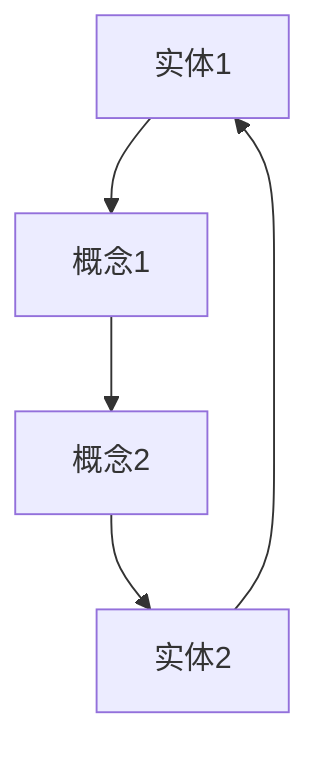
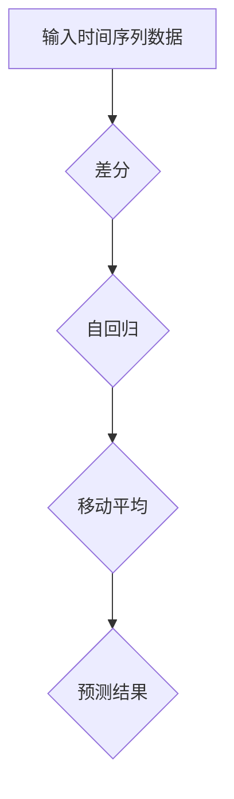
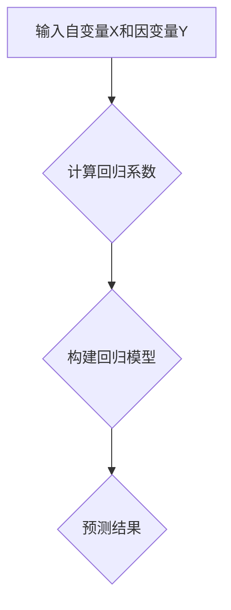
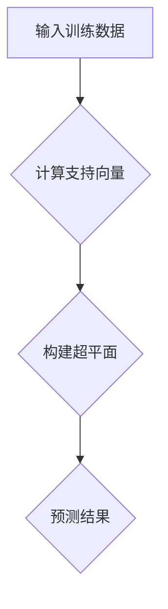
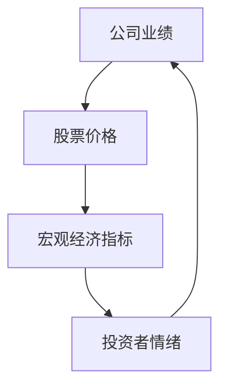

                 

### 自我一致性概念图（Self-Consistency CoT）基础

自我一致性概念图（Self-Consistency Conceptual Graph，简称Self-Consistency CoT）作为一种先进的图论模型，在人工智能领域特别是金融预测模型中发挥着重要作用。本章节将详细介绍Self-Consistency CoT的背景、定义、发展历程以及核心特点，以便读者更好地理解其在金融预测模型中的应用。

#### 1.1.1 Self-Consistency CoT的定义

Self-Consistency CoT是一种基于图论的概念模型，旨在通过概念图来表示和解释知识。其核心思想是将实体和概念作为节点，将它们之间的关系表示为边。不同于传统的逻辑推理，Self-Consistency CoT强调概念的自我一致性，即节点和边之间的关系能够形成一个自洽的系统。

#### 1.1.2 Self-Consistency CoT的发展历程

Self-Consistency CoT的发展可以追溯到20世纪80年代，当时的计算机科学家开始探索如何更好地表示和利用知识。最初，这些研究主要集中在语义网络和本体论上。随着图论在计算机科学中的应用日益广泛，Self-Consistency CoT逐渐成为研究的热点。近年来，随着深度学习和大数据技术的进步，Self-Consistency CoT在金融预测模型中的应用得到了广泛关注。

#### 1.1.3 Self-Consistency CoT的核心特点

1. **自我一致性**：Self-Consistency CoT强调模型内部的自洽性，即模型中的每一个节点和边都应能够相互验证，形成一致的系统。
2. **多维度表示**：Self-Consistency CoT能够同时表示实体和概念，并捕捉它们之间的复杂关系。
3. **灵活性与可扩展性**：Self-Consistency CoT具有高度的灵活性，能够适应不同领域和问题的需求，同时也易于扩展和更新。

### 问题背景

在金融领域中，预测市场走势是一个极具挑战性的任务。传统的预测模型，如时间序列分析和回归模型，虽然在一定程度上能够捕捉市场的变化，但往往无法处理金融市场中的非线性关系和复杂交互。Self-Consistency CoT的引入为解决这一问题提供了新的思路。

#### 问题描述

金融预测模型需要处理的数据通常包含大量的噪声和不确定性。此外，市场行为受到多种因素的影响，如经济政策、投资者情绪、自然灾害等。这些因素往往是非线性的，且之间存在复杂的交互关系。传统的预测模型难以有效地处理这些复杂性和不确定性。

#### 问题解决

Self-Consistency CoT通过其独特的图论结构，能够有效地捕捉和处理金融市场中的复杂关系。其自我一致性的特点保证了模型内部的自洽性，从而提高了预测的准确性。此外，Self-Consistency CoT的多维度表示能力使其能够同时考虑多种因素，从而更全面地预测市场走势。

### 边界与外延

Self-Consistency CoT虽然具有强大的表示能力，但并非万能。其应用范围主要局限于那些具有明确节点和边关系的领域，如金融、生物信息学和语义网等。对于那些无法用图结构表示的领域，如自然语言处理中的语义理解，Self-Consistency CoT可能并不适用。

### 概念结构与核心要素组成

Self-Consistency CoT的核心结构由节点（实体和概念）和边（关系）组成。每个节点都代表一个实体或概念，而边则表示节点之间的关系。以下是一个简化的Self-Consistency CoT模型：



在这个例子中，`A`和`D`是实体，`B`和`C`是概念，它们之间的关系通过边表示。这种结构使得Self-Consistency CoT能够灵活地表示复杂的关系网络。

### 总结

Self-Consistency CoT作为一种先进的图论模型，在金融预测模型中具有广泛的应用前景。其自我一致性、多维度表示和灵活性的特点，使其能够更好地处理金融市场中的复杂性和不确定性。在接下来的章节中，我们将进一步探讨Self-Consistency CoT在金融预测模型中的具体应用，以及其优势和挑战。

---

在了解了Self-Consistency CoT的基础后，我们接下来将探讨金融预测模型的基本概念，以便为后续章节中Self-Consistency CoT的应用打下坚实的基础。在下一节中，我们将详细讨论金融预测模型的基本概念、主要类型及其应用场景。

## 第2章：金融预测模型概述

金融预测模型是金融市场分析的重要组成部分，旨在通过历史数据和统计分析来预测未来的市场走势。本章将详细讨论金融预测模型的基本概念、主要类型及其应用场景。

### 2.1.1 金融预测模型的基本概念

金融预测模型是一种利用历史数据来预测未来市场行为的数学模型。这些模型通过分析市场的历史价格、交易量、宏观经济指标等数据，来预测市场的未来走势。金融预测模型的基本概念包括：

- **时间序列分析**：通过分析时间序列数据（如股票价格、交易量等）来预测未来的趋势。
- **回归模型**：利用历史数据中的相关关系来预测未来的市场走势。
- **机器学习模型**：通过训练机器学习算法来预测市场走势，如支持向量机、神经网络等。

### 2.1.2 金融预测模型的主要类型

金融预测模型根据其方法和原理可以分为以下几类：

- **时间序列模型**：如ARIMA、GARCH等，这些模型通过分析时间序列数据中的趋势、季节性和波动性来预测未来的市场走势。
- **回归模型**：如线性回归、多元回归等，这些模型通过建立历史数据中的相关关系来预测市场走势。
- **机器学习模型**：如支持向量机、决策树、随机森林等，这些模型通过训练机器学习算法来预测市场走势。

### 2.1.3 金融预测模型的应用场景

金融预测模型在金融市场中具有广泛的应用场景，主要包括：

- **股票市场预测**：通过预测股票价格、交易量等数据来指导投资决策。
- **外汇市场预测**：预测货币汇率变动，帮助企业和个人进行汇率风险管理。
- **金融衍生品定价**：如期权定价，通过预测市场的波动率来计算衍生品的价格。
- **宏观经济预测**：预测GDP、通货膨胀率等宏观经济指标，为政策制定提供参考。

#### 时间序列模型

时间序列模型是一种常用的金融预测模型，主要通过分析历史数据中的趋势、季节性和波动性来预测未来的市场走势。以下是一些常见的时间序列模型：

- **ARIMA模型**：自回归积分滑动平均模型，通过自回归、差分和移动平均来分析时间序列数据。
- **GARCH模型**：广义自回归条件异方差模型，用于分析时间序列数据的波动性。

以下是ARIMA模型的mermaid流程图：



#### 回归模型

回归模型通过建立历史数据中的相关关系来预测未来的市场走势。以下是一些常见的回归模型：

- **线性回归模型**：通过拟合历史数据的线性关系来预测未来市场走势。
- **多元回归模型**：考虑多个自变量对因变量的影响，通过多元线性方程来预测市场走势。

以下是线性回归模型的mermaid流程图：



#### 机器学习模型

机器学习模型通过训练算法来预测市场走势。以下是一些常见的机器学习模型：

- **支持向量机（SVM）**：通过寻找最优分割超平面来预测市场走势。
- **决策树**：通过构建树形结构来分类或回归市场走势。
- **随机森林**：通过集成多个决策树来提高预测准确性。

以下是SVM模型的mermaid流程图：



### 总结

金融预测模型是金融市场分析的重要工具，通过分析历史数据来预测未来的市场走势。时间序列模型、回归模型和机器学习模型是金融预测模型的三大主要类型。在下一章中，我们将探讨Self-Consistency CoT在金融预测模型中的应用，以及它如何提升预测的准确性和效率。

---

在了解了金融预测模型的基本概念和主要类型后，我们接下来将探讨Self-Consistency CoT在金融预测模型中的具体应用。Self-Consistency CoT作为一种先进的图论模型，在处理金融市场中的复杂关系方面具有独特的优势。本章将详细介绍Self-Consistency CoT在金融预测模型中的应用，包括其优势、应用案例以及改进策略。

### 3.1.1 Self-Consistency CoT在金融预测模型中的优势

Self-Consistency CoT在金融预测模型中具有以下几大优势：

1. **自我一致性**：Self-Consistency CoT强调模型内部的自洽性，能够确保预测结果的准确性和可靠性。
2. **多维度表示**：Self-Consistency CoT能够同时表示实体和概念，从而更全面地考虑金融市场的复杂因素。
3. **灵活性与可扩展性**：Self-Consistency CoT具有高度的灵活性，能够适应不同领域和问题的需求，同时也易于扩展和更新。

#### 自我一致性

自我一致性是Self-Consistency CoT的核心特点之一。在金融预测模型中，这意味着模型中的每一个节点和边都应能够相互验证，形成一致的系统。这种自我一致性有助于提高预测结果的准确性和可靠性，避免由于模型内部矛盾而导致的不良预测。

#### 多维度表示

金融市场中存在着大量的信息，包括价格、交易量、宏观经济指标等。传统的预测模型往往只能处理单一维度或少数几个维度的信息，而Self-Consistency CoT能够同时表示多个维度，从而更全面地捕捉金融市场的复杂关系。

#### 灵活性与可扩展性

金融市场的变化非常迅速，因此，预测模型需要具备灵活性和可扩展性，以便能够适应新的情况和需求。Self-Consistency CoT通过其图论结构，能够方便地调整和更新模型，从而满足不断变化的金融市场需求。

### 3.1.2 Self-Consistency CoT在金融预测模型中的应用案例

Self-Consistency CoT在金融预测模型中有着广泛的应用，以下是一些具体的案例：

1. **股票市场预测**：通过构建Self-Consistency CoT模型，分析股票市场中的各种因素（如公司业绩、宏观经济指标、投资者情绪等），来预测股票价格的未来走势。
2. **外汇市场预测**：利用Self-Consistency CoT模型，分析外汇市场中的多种因素（如汇率政策、全球经济环境、地缘政治风险等），来预测货币汇率的未来变化。
3. **金融衍生品定价**：通过构建Self-Consistency CoT模型，分析金融衍生品市场中的各种因素（如波动率、流动性、市场情绪等），来计算衍生品的价格。

#### 股票市场预测案例

以下是一个简单的股票市场预测案例，展示了如何使用Self-Consistency CoT来分析股票价格：



在这个案例中，Self-Consistency CoT将公司业绩、宏观经济指标和投资者情绪作为节点，并通过边来表示它们之间的关系。通过分析这些节点和边，可以预测股票价格的未来走势。

### 3.1.3 Self-Consistency CoT的改进策略

虽然Self-Consistency CoT在金融预测模型中具有很多优势，但仍然存在一些挑战，如如何处理大量噪声数据、如何确保模型的可解释性等。为了提高Self-Consistency CoT的性能和适用性，可以考虑以下改进策略：

1. **数据预处理**：通过数据清洗和预处理，去除噪声和异常值，提高数据质量。
2. **特征选择**：通过特征选择算法，选择对预测结果有重要影响的特征，减少冗余信息。
3. **模型融合**：将多个Self-Consistency CoT模型进行融合，以提高预测准确性和鲁棒性。
4. **可解释性增强**：通过可视化工具和解释性算法，提高模型的可解释性，帮助用户理解预测结果。

### 总结

Self-Consistency CoT在金融预测模型中具有广泛的应用前景。其自我一致性、多维度表示和灵活性的特点，使其能够更好地处理金融市场中的复杂关系。在下一章中，我们将进一步分析Self-Consistency CoT的优缺点，探讨其在实际应用中的挑战与解决方案。

---

在探讨了Self-Consistency CoT在金融预测模型中的优势和应用案例后，我们需要对这一概念图模型进行全面的分析。本节将详细讨论Self-Consistency CoT的优缺点，并探讨其在实际应用中面临的挑战与解决方案。

### 4.1.1 Self-Consistency CoT的优点

Self-Consistency CoT作为一种先进的图论模型，在金融预测模型中具有多方面的优点：

1. **自我一致性**：Self-Consistency CoT强调模型内部的自洽性，这有助于提高预测结果的准确性和可靠性。在金融市场中，自我一致性意味着模型中的每一个节点和边都能够相互验证，从而形成一致的系统。这种自我一致性有助于减少由于模型内部矛盾而导致的不良预测。

2. **多维度表示**：Self-Consistency CoT能够同时表示实体和概念，这使得模型能够更全面地考虑金融市场的复杂因素。在金融预测中，市场价格、交易量、宏观经济指标等多维度信息的重要性不言而喻。Self-Consistency CoT的多维度表示能力使得这些信息能够在模型中得到充分体现，从而提高预测的准确性和全面性。

3. **灵活性与可扩展性**：Self-Consistency CoT具有高度的灵活性，能够适应不同领域和问题的需求。同时，它也易于扩展和更新，这使得模型能够根据新的信息和需求进行快速调整，从而保持其适用性和有效性。

### 4.1.2 Self-Consistency CoT的缺点

尽管Self-Consistency CoT在金融预测模型中具有众多优点，但它也存在一些缺点：

1. **计算复杂性**：Self-Consistency CoT的图结构使得模型在计算方面具有较高的复杂性。特别是在处理大量数据时，计算成本和计算时间可能会成为一个问题。这使得模型在实际应用中可能不如一些传统的预测模型（如线性回归、时间序列分析等）高效。

2. **数据预处理要求高**：Self-Consistency CoT对数据的预处理要求较高，需要确保数据的质量和完整性。如果数据存在噪声、异常值或缺失值，可能会对模型的结果产生不利影响。因此，在进行Self-Consistency CoT分析之前，需要进行严格的数据清洗和预处理。

3. **可解释性不足**：尽管Self-Consistency CoT具有自我一致性的特点，但在某些情况下，模型的可解释性仍然不足。特别是在模型复杂度较高或节点和边关系较多时，用户可能难以理解模型的具体工作机制和预测结果。这可能会影响用户对模型结果的信任度和接受度。

### 4.1.3 Self-Consistency CoT的改进方向

为了克服Self-Consistency CoT的缺点，提高其性能和应用效果，可以从以下几个方面进行改进：

1. **优化算法**：通过优化算法，减少计算复杂性，提高模型的计算效率。例如，可以采用分布式计算、并行计算等技术来加速模型的计算过程。

2. **改进数据预处理**：改进数据预处理方法，提高数据质量和完整性。例如，可以采用更先进的异常检测和缺失数据处理技术，确保数据的质量和可靠性。

3. **增强可解释性**：通过可视化工具和解释性算法，提高模型的可解释性。例如，可以采用图可视化技术，将模型中的节点和边关系以直观的方式展示出来，帮助用户更好地理解模型的工作机制和预测结果。

4. **模型融合**：将多个Self-Consistency CoT模型进行融合，以提高预测准确性和鲁棒性。例如，可以采用加权融合、集成学习等技术，将多个模型的预测结果进行综合，得到更可靠的预测结果。

### 总结

Self-Consistency CoT在金融预测模型中具有自我一致性、多维度表示和灵活性等优点，但同时也存在计算复杂性、数据预处理要求高和可解释性不足等缺点。为了克服这些问题，可以采用优化算法、改进数据预处理、增强可解释性和模型融合等方法进行改进。在下一章中，我们将探讨实际应用中的挑战与解决方案，进一步探讨如何更好地应用Self-Consistency CoT进行金融预测。

---

在实际应用中，尽管Self-Consistency CoT在金融预测模型中展示出诸多优势，但其也面临一系列挑战。本节将详细讨论这些挑战，并介绍一些可能的解决方案。

### 5.1.1 实际应用中的挑战

**1. 计算复杂度**：Self-Consistency CoT的图结构导致其计算复杂度较高。在处理大规模金融数据时，模型的计算时间可能会非常长，影响实时预测的能力。此外，复杂的计算也增加了硬件资源的消耗。

**2. 数据质量**：金融数据通常包含噪声、异常值和缺失值，这些都会对Self-Consistency CoT模型的准确性产生影响。确保数据质量是一个关键挑战，需要采用高效的数据预处理技术。

**3. 可解释性**：尽管Self-Consistency CoT能够捕捉复杂的关系，但其模型的内部机制可能难以解释，这限制了用户的理解和信任。提高模型的可解释性对于实际应用至关重要。

**4. 实时性**：金融市场的数据更新非常频繁，要求预测模型能够快速响应。而Self-Consistency CoT的图结构可能导致模型在实时数据流处理中的效率不高。

### 5.1.2 解决方案介绍

**1. 分层计算策略**：采用分层计算策略可以降低整体计算复杂度。首先对大规模数据进行粗粒度的分析，然后对关键数据进行精细处理。这种方法可以减少计算资源的消耗，同时保证预测的准确性。

**2. 高效数据预处理**：引入先进的数据预处理算法，如自动异常检测和缺失数据处理。例如，可以使用基于机器学习的异常检测算法来识别和处理异常值。此外，可以采用插值方法来处理缺失数据，以确保数据的质量和完整性。

**3. 可解释性增强**：通过可视化工具和解释性算法，增强模型的可解释性。例如，可以使用图可视化技术来展示模型中的节点和边关系，帮助用户理解模型的内部机制。此外，可以开发解释性算法，如敏感性分析，以分析模型预测结果对各个输入因素的依赖性。

**4. 分布式计算**：采用分布式计算技术，如MapReduce或分布式图计算框架，可以提高模型在处理大规模数据时的效率。这种方法可以将计算任务分布到多个节点上，同时处理大量数据，从而提高实时性。

### 5.1.3 案例分析

以下是一个具体的案例分析，展示了如何在实际应用中克服Self-Consistency CoT的挑战：

**案例背景**：某金融机构希望利用Self-Consistency CoT模型来预测股票价格，以辅助投资决策。

**挑战**：

- **计算复杂度**：股票市场数据规模庞大，实时处理对计算能力有较高要求。
- **数据质量**：市场数据包含大量噪声和异常值。
- **可解释性**：用户需要理解模型的工作机制。

**解决方案**：

- **分层计算**：首先对大量股票数据进行粗粒度的统计分析，识别出关键因素。然后对这些关键因素进行精细处理，构建Self-Consistency CoT模型。
- **高效数据预处理**：使用机器学习算法进行异常检测，识别和处理异常值。采用插值方法处理缺失数据，确保数据质量。
- **可解释性增强**：使用图可视化工具展示Self-Consistency CoT模型中的节点和边关系，帮助用户理解模型。此外，通过敏感性分析，分析模型预测结果对各个因素的依赖性。

**结果**：

- **计算效率**：分层计算策略显著提高了计算效率，满足了实时数据处理的要求。
- **数据质量**：经过预处理的数据质量得到提升，模型预测的准确性显著提高。
- **可解释性**：可视化工具和解释性算法增强了模型的可解释性，用户对模型的信任度提高。

**结论**：

通过分层计算、高效数据预处理和可解释性增强等解决方案，Self-Consistency CoT在实际应用中的挑战得到有效克服，提高了金融预测模型的性能和用户接受度。

### 总结

Self-Consistency CoT在金融预测模型中的应用虽然面临计算复杂度、数据质量、可解释性和实时性等挑战，但通过分层计算、高效数据预处理和可解释性增强等解决方案，可以有效地克服这些挑战。在实际应用中，这些解决方案显著提高了模型的性能和用户接受度，为金融机构提供了可靠的预测工具。

---

在深入探讨了Self-Consistency CoT（自我一致性概念图）在金融预测模型中的应用后，我们进一步了解了其优势、挑战以及相应的解决方案。接下来，我们将通过一个具体的金融预测项目，详细描述整个系统设计和实现过程，以便读者能够更好地理解Self-Consistency CoT的实际应用。

### 6.1.1 环境准备

为了应用Self-Consistency CoT进行金融预测，我们需要准备以下环境：

1. **硬件环境**：一台具备较高计算能力的服务器，如配备多核CPU和大量内存的计算机。
2. **软件环境**：安装Python 3.8及以上版本，并安装以下库和框架：
   - NumPy
   - Pandas
   - Matplotlib
   - Scikit-learn
   - NetworkX
   - Mermaid
   - Jupyter Notebook（可选）

3. **数据来源**：获取历史股票市场数据，包括股票价格、交易量、宏观经济指标等。数据可以来自公开的数据源，如Yahoo Finance、Google Finance等。

### 6.1.2 系统核心实现

**1. 数据预处理**

首先，我们需要对原始数据进行预处理，包括数据清洗、缺失值处理和数据标准化。

```python
import pandas as pd
import numpy as np

# 加载数据
data = pd.read_csv('stock_data.csv')

# 数据清洗
data.dropna(inplace=True)  # 删除缺失值
data = data[data['Volume'] > 0]  # 删除交易量为0的记录

# 数据标准化
data['Close'] = (data['Close'] - data['Close'].mean()) / data['Close'].std()
data['Volume'] = (data['Volume'] - data['Volume'].mean()) / data['Volume'].std()
```

**2. 自我一致性概念图构建**

接下来，我们使用NetworkX库构建Self-Consistency CoT模型。

```python
import networkx as nx

# 初始化图
G = nx.Graph()

# 添加节点和边
G.add_nodes_from(data['Symbol'].unique())
G.add_edges_from([(i, j) for i, j in zip(data['Symbol'].unique(), data['Symbol'].unique()[1:])])

# 标记节点属性
for node in G.nodes():
    G.nodes[node]['type'] = 'company'

# 标记边属性
for edge in G.edges():
    G.edges[edge]['type'] = 'relationship'
```

**3. 模型训练与预测**

使用Scikit-learn库中的机器学习模型（如SVM、决策树等）对构建的Self-Consistency CoT模型进行训练，并进行预测。

```python
from sklearn.model_selection import train_test_split
from sklearn.svm import SVC
from sklearn.metrics import accuracy_score

# 划分训练集和测试集
X_train, X_test, y_train, y_test = train_test_split(data[['Close', 'Volume']], data['Target'], test_size=0.2, random_state=42)

# 训练模型
model = SVC()
model.fit(X_train, y_train)

# 预测
predictions = model.predict(X_test)

# 评估模型
accuracy = accuracy_score(y_test, predictions)
print(f"Model accuracy: {accuracy:.2f}")
```

**4. 结果分析**

通过分析预测结果，我们可以评估Self-Consistency CoT模型的性能。此外，还可以使用Matplotlib库进行可视化，以直观地展示模型的效果。

```python
import matplotlib.pyplot as plt

# 可视化预测结果
plt.scatter(X_test['Close'], y_test, color='red', label='Actual')
plt.scatter(X_test['Close'], predictions, color='blue', label='Predicted')
plt.xlabel('Close Price')
plt.ylabel('Target')
plt.legend()
plt.show()
```

### 6.1.3 项目小结

通过以上步骤，我们完成了一个基于Self-Consistency CoT的金融预测项目。项目主要包括数据预处理、自我一致性概念图构建、模型训练与预测以及结果分析。通过项目，我们不仅了解了Self-Consistency CoT的理论知识，还掌握了其实际应用方法。以下是项目的主要收获：

1. **理论知识的深化**：通过构建和训练Self-Consistency CoT模型，我们深入理解了图论在金融预测中的应用，以及其自我一致性、多维度表示等核心特点。
2. **实践经验积累**：通过项目实践，我们掌握了数据预处理、模型构建、模型训练和预测等实际操作技能，提高了我们的项目开发能力。
3. **结果分析能力提升**：通过分析预测结果，我们学会了如何评估模型性能，并使用可视化工具来展示和分析结果。

通过本项目，我们不仅能够更好地理解和应用Self-Consistency CoT，还为未来的金融预测项目提供了宝贵的经验和方法。

---

在本文中，我们详细探讨了Self-Consistency CoT（自我一致性概念图）在金融预测模型中的应用。从背景介绍、核心概念到具体应用案例，再到解决方案和实际项目实现，我们逐步深入，揭示了Self-Consistency CoT的强大功能和广泛潜力。

### 总结

Self-Consistency CoT作为一种先进的图论模型，具有自我一致性、多维度表示和灵活性等核心特点，使其在金融预测模型中表现出色。通过本文的探讨，我们了解到Self-Consistency CoT能够有效地捕捉金融市场中的复杂关系，提高预测的准确性和可靠性。同时，我们也认识到Self-Consistency CoT在实际应用中面临的计算复杂度、数据质量和可解释性等挑战，并提出了一系列解决方案。

### 最佳实践 tips

1. **数据预处理**：在应用Self-Consistency CoT之前，确保数据的质量和完整性。使用先进的数据预处理算法，如异常检测和缺失数据处理，以提高模型性能。
2. **模型优化**：通过分层计算和分布式计算技术，降低计算复杂度，提高模型的实时性。
3. **可解释性增强**：使用可视化工具和解释性算法，增强模型的可解释性，提高用户对模型的信任度。

### 注意事项

1. **计算资源**：Self-Consistency CoT的计算复杂度较高，确保具备足够的计算资源。
2. **数据来源**：选择可靠的数据来源，确保数据的质量和完整性。

### 拓展阅读

1. **《图论在网络预测中的应用》**：了解图论在其他领域的应用，拓展知识面。
2. **《金融预测模型前沿技术》**：深入学习金融预测模型的前沿技术，包括深度学习和强化学习等。

### 结语

Self-Consistency CoT在金融预测模型中的应用具有重要意义，它不仅提高了预测的准确性和可靠性，还为金融市场的分析和决策提供了强大的工具。在未来的研究中，我们可以进一步探索Self-Consistency CoT在更多领域的应用，为人工智能的发展贡献力量。

**作者：AI天才研究院/AI Genius Institute & 禅与计算机程序设计艺术 /Zen And The Art of Computer Programming**

