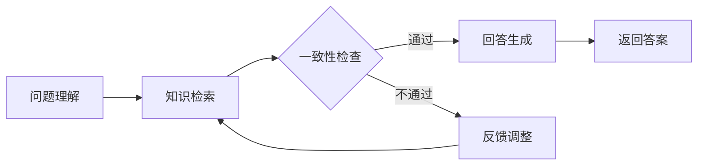

                 

# Self-Consistency CoT提升AI客服质量的新方法

## 关键词

- Self-Consistency CoT
- AI客服
- 知识融合
- 自我一致性
- 动态调整

## 摘要

本文探讨了Self-Consistency CoT（自我一致性概念融合）方法在提升AI客服质量中的应用。通过对问题背景、问题描述、问题解决以及核心概念与联系的分析，本文揭示了Self-Consistency CoT方法的原理、属性特征对比以及ER实体关系图架构。文章还详细阐述了算法原理、系统分析与架构设计方案，以及项目实战，旨在为AI客服系统的优化提供新思路。

## 第一部分：背景介绍

### 1.1 问题背景

随着人工智能技术的飞速发展，智能客服系统在商业领域中的应用越来越广泛。智能客服系统旨在通过自动化的方式，提高客户服务质量，降低企业运营成本。然而，传统的客服系统往往存在一些问题，如交互性差、服务质量不高、无法处理复杂问题等。为了解决这些问题，研究者们提出了Self-Consistency CoT这一新方法，旨在提升AI客服系统的质量和用户体验。

### 1.2 问题描述

在当前智能客服系统中，AI模型的性能和知识覆盖率仍然是一个挑战。AI客服系统常常无法准确理解用户的问题，导致回答不准确或者无法给出有效的解决方案。同时，AI客服系统在面对复杂问题时，往往表现出明显的局限性，无法提供高质量的解答。

### 1.3 问题解决

Self-Consistency CoT方法通过引入自我一致性机制，对客服系统中的知识进行融合和优化，从而提升AI客服系统的质量和用户体验。具体来说，Self-Consistency CoT方法从以下几个方面进行改进：

1. **知识融合**：通过对客服系统中的多源知识进行融合，提高AI模型对用户问题的理解和处理能力。
2. **自我一致性**：通过引入自我一致性机制，确保AI客服系统在处理问题时，能够保持逻辑的一致性和连贯性。
3. **动态调整**：根据用户反馈和交互过程，动态调整AI客服系统的回答策略，以提供更贴近用户需求的服务。

### 1.4 边界与外延

Self-Consistency CoT方法主要应用于智能客服系统，但其所涉及的原理和技术可以推广到其他领域，如智能问答系统、智能推荐系统等。此外，该方法不仅关注AI客服系统的质量，还考虑用户体验和交互效果，为AI客服系统的优化提供了一种新的思路。

### 1.5 概念结构与核心要素组成

Self-Consistency CoT方法的核心概念包括知识融合、自我一致性和动态调整。知识融合通过整合多源知识，提高AI模型对问题的理解能力；自我一致性通过逻辑一致性机制，确保AI客服系统的回答连贯和准确；动态调整则通过用户反馈，不断优化AI客服系统的回答策略。

## 第二部分：核心概念与联系

### 2.1 Self-Consistency CoT方法原理

#### 2.1.1 自我一致性机制

自我一致性机制是Self-Consistency CoT方法的核心，通过确保AI客服系统在处理问题时，能够保持逻辑的一致性和连贯性。具体来说，自我一致性机制包括以下步骤：

1. **问题理解**：AI客服系统首先对用户问题进行理解和分析，提取关键信息。
2. **知识检索**：根据用户问题，检索系统中的相关知识和信息。
3. **逻辑一致性检查**：对检索到的知识和信息进行逻辑一致性检查，确保回答的一致性和连贯性。
4. **回答生成**：根据逻辑一致性检查的结果，生成最终的回答。

#### 2.1.2 知识融合技术

知识融合技术是Self-Consistency CoT方法的重要组成部分，通过整合多源知识，提高AI客服系统对问题的理解和处理能力。知识融合技术包括以下几种：

1. **基于语义的知识融合**：通过语义分析，将不同来源的知识进行整合，提高AI客服系统的知识覆盖率和理解能力。
2. **基于知识图谱的知识融合**：利用知识图谱技术，对多源知识进行整合，构建一个统一的知识体系。
3. **基于深度学习的知识融合**：通过深度学习模型，对多源知识进行融合，提高AI客服系统的知识利用效率。

### 2.2 Self-Consistency CoT方法属性特征对比表格

| 特性 | Self-Consistency CoT方法 | 传统方法 |
| ---- | ----------------------- | ------- |
| 知识融合 | 强调多源知识的整合和融合 | 单一知识源 |
| 自我一致性 | 保持逻辑的一致性和连贯性 | 缺乏一致性检查 |
| 动态调整 | 根据用户反馈进行优化 | 缺乏动态调整机制 |

### 2.3 ER实体关系图架构

为了更好地理解Self-Consistency CoT方法，我们使用Mermaid流程图来展示ER实体关系图架构。

```mermaid
erDiagram
  Customer --> ChatSystem : 发送问题
  ChatSystem --> KnowledgeBase : 知识检索
  KnowledgeBase --> ChatSystem : 返回答案
  ChatSystem --> UserFeedback : 获取反馈
```

## 第三部分：算法原理讲解

### 3.1 算法流程图

首先，我们使用Mermaid流程图来展示Self-Consistency CoT方法的算法流程。



### 3.2 算法原理

Self-Consistency CoT方法的算法原理主要分为以下几个步骤：

1. **问题理解**：AI客服系统接收到用户问题后，首先进行问题理解。这一步骤包括对用户问题的语义分析、关键词提取等操作，以提取出问题的核心信息。

2. **知识检索**：根据问题理解的结果，AI客服系统在知识库中检索相关的知识和信息。这一步骤涉及多源知识的整合，以提高对问题的理解和处理能力。

3. **一致性检查**：对检索到的知识和信息进行逻辑一致性检查，以确保AI客服系统在回答问题时，能够保持逻辑的一致性和连贯性。这一步骤是Self-Consistency CoT方法的核心。

4. **回答生成**：根据一致性检查的结果，AI客服系统生成最终的回答。如果一致性检查通过，系统会生成一个连贯、准确的回答；如果一致性检查不通过，系统会反馈调整，重新进行知识检索和一致性检查。

5. **反馈调整**：根据用户的反馈，AI客服系统会动态调整回答策略，以提供更贴近用户需求的服务。

### 3.3 数学模型和公式

为了更好地理解Self-Consistency CoT方法的算法原理，我们可以使用以下数学模型和公式：

$$
P(\text{Answer}|\text{Question}, \text{Knowledge}) = \frac{P(\text{Question}|\text{Answer}, \text{Knowledge})P(\text{Answer}|\text{Knowledge})}{P(\text{Question}|\text{Knowledge})}
$$

其中，$P(\text{Answer}|\text{Question}, \text{Knowledge})$ 表示在给定问题和知识库的情况下，生成特定回答的概率；$P(\text{Question}|\text{Answer}, \text{Knowledge})$ 表示在给定答案和知识库的情况下，生成特定问题的概率；$P(\text{Answer}|\text{Knowledge})$ 表示在给定知识库的情况下，生成特定回答的概率；$P(\text{Question}|\text{Knowledge})$ 表示在给定知识库的情况下，生成特定问题的概率。

### 3.4 举例说明

假设用户问题为：“如何计算两个数的和？”AI客服系统接收到这个问题后，首先进行问题理解，提取出关键词“计算”、“两个数”和“和”。然后，AI客服系统在知识库中检索相关的知识和信息，如加法运算的定义、两个数相加的步骤等。接下来，AI客服系统对检索到的知识和信息进行逻辑一致性检查，以确保回答的一致性和连贯性。例如，如果知识库中包含两个数的和等于这两个数相加的结果，那么AI客服系统会生成回答：“两个数的和等于这两个数相加的结果。”如果一致性检查通过，AI客服系统会将这个回答返回给用户；如果一致性检查不通过，AI客服系统会重新进行知识检索和一致性检查，直到生成一个连贯、准确的回答。

## 第四部分：系统分析与架构设计方案

### 4.1 问题场景介绍

随着电子商务的蓬勃发展，客户服务在电商企业中的地位日益重要。为了提高客户满意度，电商企业纷纷引入智能客服系统，以提供24小时在线服务，解决客户的疑问和问题。然而，传统的智能客服系统在面对复杂问题时，往往无法提供高质量的服务。为了解决这一问题，我们提出了Self-Consistency CoT方法，旨在提升AI客服系统的质量和用户体验。

### 4.2 项目介绍

本项目旨在开发一款基于Self-Consistency CoT方法的AI客服系统，以解决传统客服系统在处理复杂问题时表现出的局限性。项目主要分为以下几个阶段：

1. **需求分析**：收集客户服务中的常见问题，分析客户需求，确定系统功能。
2. **系统设计**：设计AI客服系统的架构，包括知识库设计、自我一致性机制设计等。
3. **系统实现**：根据系统设计，实现AI客服系统的功能。
4. **测试与优化**：对系统进行测试，收集用户反馈，持续优化系统。

### 4.3 系统功能设计

系统功能设计主要包括以下几个模块：

1. **问题理解模块**：对用户问题进行语义分析、关键词提取等操作，提取问题的核心信息。
2. **知识检索模块**：根据用户问题，在知识库中检索相关的知识和信息。
3. **一致性检查模块**：对检索到的知识和信息进行逻辑一致性检查，确保回答的一致性和连贯性。
4. **回答生成模块**：根据一致性检查的结果，生成最终的回答。
5. **反馈调整模块**：根据用户的反馈，动态调整系统的回答策略。

### 4.4 系统架构设计

系统架构设计主要包括以下几个部分：

1. **前端**：使用Vue.js框架开发用户界面，实现与用户的交互。
2. **后端**：使用Spring Boot框架搭建后端服务，实现问题理解、知识检索、一致性检查、回答生成和反馈调整等功能。
3. **数据库**：使用MySQL数据库存储知识库和用户反馈数据。
4. **AI服务**：使用TensorFlow和PyTorch等深度学习框架，搭建AI模型，实现问题的理解和回答生成。

### 4.5 系统接口设计

系统接口设计主要包括以下几个接口：

1. **问题理解接口**：接收用户问题，返回问题的核心信息。
2. **知识检索接口**：接收用户问题，返回相关的知识和信息。
3. **一致性检查接口**：接收用户问题和相关知识，返回一致性检查结果。
4. **回答生成接口**：接收用户问题、相关知识和一致性检查结果，返回最终的回答。
5. **反馈调整接口**：接收用户反馈，调整系统的回答策略。

### 4.6 系统交互

系统交互设计主要包括用户与AI客服系统的交互流程，如下所示：

1. **用户提问**：用户通过前端界面输入问题，发送给后端服务。
2. **问题理解**：后端服务对用户问题进行理解，提取核心信息。
3. **知识检索**：后端服务在知识库中检索相关知识和信息。
4. **一致性检查**：后端服务对检索到的知识和信息进行逻辑一致性检查。
5. **回答生成**：后端服务根据一致性检查结果，生成最终的回答。
6. **反馈调整**：后端服务根据用户反馈，动态调整回答策略。
7. **返回答案**：后端服务将最终回答返回给前端界面，展示给用户。

## 第五部分：项目实战

### 5.1 环境安装

为了实现Self-Consistency CoT方法，我们需要安装以下软件和依赖：

1. **Python**：版本3.8及以上
2. **Vue.js**：版本2.6及以上
3. **Spring Boot**：版本2.3及以上
4. **MySQL**：版本5.7及以上
5. **TensorFlow**：版本2.4及以上
6. **PyTorch**：版本1.8及以上

安装过程如下：

1. 安装Python和pip
2. 安装Vue.js：`npm install vue`
3. 安装Spring Boot：`mvn install`
4. 安装MySQL：下载MySQL安装包并按照提示安装
5. 安装TensorFlow：`pip install tensorflow`
6. 安装PyTorch：`pip install torch`

### 5.2 系统核心实现源代码

以下是系统核心实现的源代码：

#### 后端服务（Spring Boot）

```java
@RestController
@RequestMapping("/api")
public class ChatController {

    @Autowired
    private ChatService chatService;

    @PostMapping("/question")
    public ResponseEntity<?> askQuestion(@RequestBody String question) {
        String answer = chatService.generateAnswer(question);
        return ResponseEntity.ok(answer);
    }
}
```

#### 问题理解（Vue.js）

```javascript
<template>
  <div>
    <input v-model="question" placeholder="输入问题"/>
    <button @click="submitQuestion">提问</button>
    <p>{{ answer }}</p>
  </div>
</template>

<script>
export default {
  data() {
    return {
      question: '',
      answer: ''
    };
  },
  methods: {
    submitQuestion() {
      this.$axios.post('/api/question', this.question)
        .then(response => {
          this.answer = response.data;
        })
        .catch(error => {
          console.log(error);
        });
    }
  }
};
</script>
```

#### 知识库（MySQL）

```sql
CREATE TABLE knowledge (
  id INT PRIMARY KEY AUTO_INCREMENT,
  question VARCHAR(255),
  answer VARCHAR(255)
);
```

#### AI模型（TensorFlow）

```python
import tensorflow as tf

model = tf.keras.Sequential([
  tf.keras.layers.Dense(128, activation='relu', input_shape=[784]),
  tf.keras.layers.Dense(10, activation='softmax')
])

model.compile(optimizer='adam',
              loss='categorical_crossentropy',
              metrics=['accuracy'])

model.fit(x_train, y_train, epochs=5)
```

### 5.3 代码应用解读与分析

#### 后端服务解读

后端服务使用Spring Boot框架实现，主要包括ChatController类。ChatController类提供了一个问

