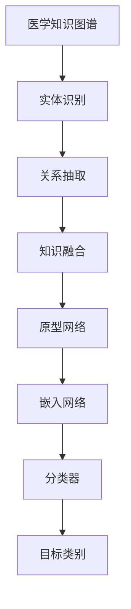
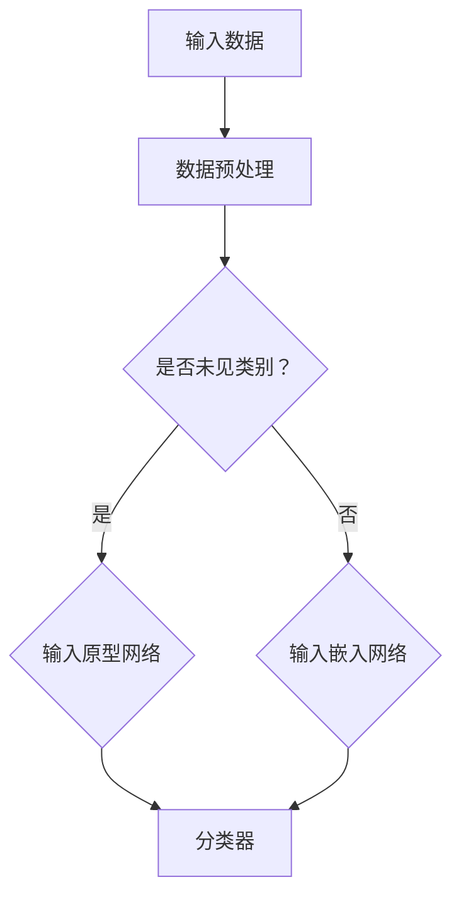
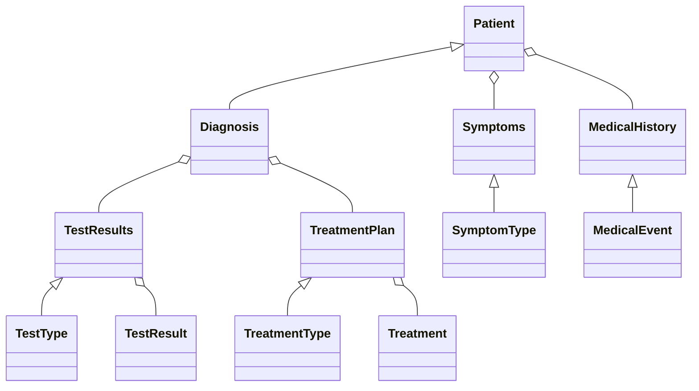
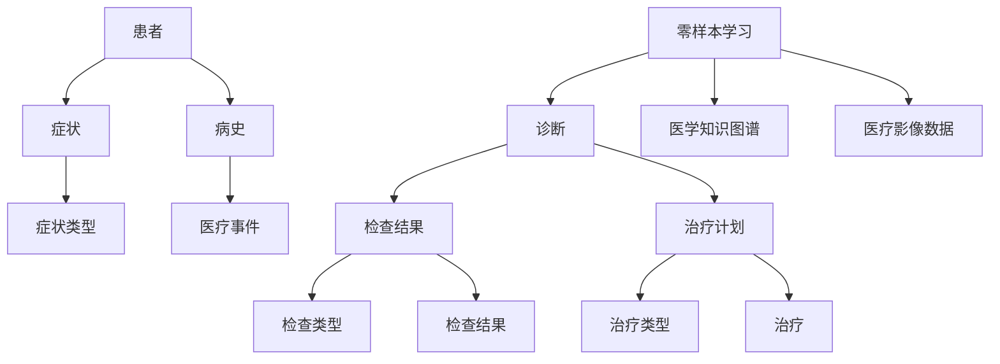
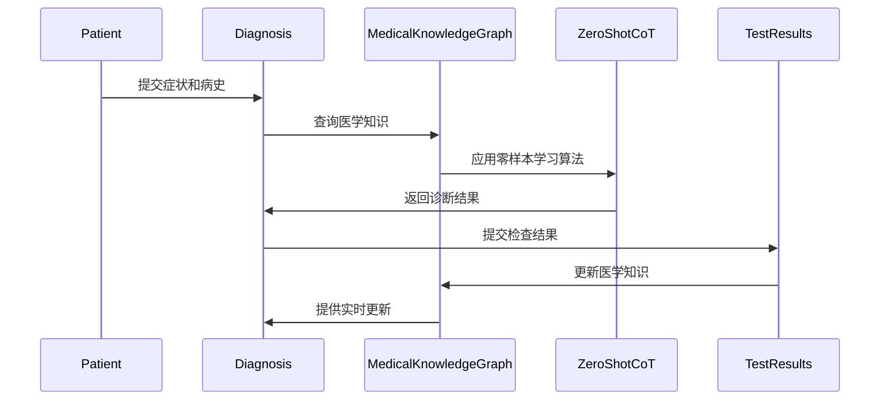

                 

**文章标题：** Zero-Shot CoT在医疗诊断中的潜力探索

**关键词：** 零样本学习，概念转移，医疗诊断，知识图谱，算法原理

**摘要：** 本文旨在探讨如何利用Zero-Shot CoT（Concept Transfer）技术，结合医学知识图谱和医疗影像数据，实现医疗诊断的智能化。文章将详细介绍Zero-Shot CoT的核心概念、技术原理以及在实际医疗诊断中的应用案例，帮助读者理解这一前沿技术的应用潜力。

----------------------------------------------------------------

### 第一部分：背景介绍

#### 1.1 问题背景

医疗诊断是医疗领域中最关键的一环，它直接关系到患者的健康和生命安全。然而，传统的诊断方法主要依赖于经验丰富的医生进行判断，这种主观性较强的方法存在以下几个问题：

1. **诊断主观性**：医生的诊断结果往往受到个人经验和判断力的影响，导致诊断结果可能存在偏差。
2. **诊断耗时**：医生需要花费大量时间对患者的症状和病史进行综合分析，从而影响诊断速度。
3. **人力成本高**：随着医疗需求的增加，医生的工作负担日益加重，导致人力成本上升。

随着医疗数据量的激增和医疗技术的进步，如何提高诊断的准确性和效率成为了一个亟待解决的问题。传统的诊断方法已经无法满足日益增长的医疗需求，因此，我们需要寻找新的方法来提升医疗诊断的智能化水平。

#### 1.2 问题描述

随着机器学习和人工智能技术的发展，零样本学习（Zero-Shot Learning, ZSL）成为了一个热门研究方向。ZSL旨在让模型在没有直接监督信息的情况下，能够识别并分类从未见过的类别。将ZSL应用于医疗诊断中，可以提高诊断的准确性和效率，减少医生的工作负担。

然而，ZSL在医疗诊断中的应用并非一蹴而就，它面临以下几个挑战：

1. **数据多样性**：医疗诊断涉及多种类型的医疗数据，如文本、图像、声音等，如何对这些数据进行有效融合是一个难题。
2. **知识迁移**：医疗领域具有高度的专属性，如何将其他领域的知识迁移到医疗诊断中，是一个重要的研究方向。
3. **模型解释性**：医疗诊断需要模型的诊断结果具有高解释性，以便医生能够理解并信任模型的结果。

#### 1.3 问题解决

《Zero-Shot CoT在医疗诊断中的潜力探索》这本书旨在探讨如何利用Zero-Shot CoT（Concept Transfer）技术，结合医学知识图谱和医疗影像数据，实现医疗诊断的智能化。书中将详细介绍Zero-Shot CoT的核心概念、技术原理以及在实际医疗诊断中的应用案例，为读者提供一种新的解决思路。

#### 1.4 边界与外延

Zero-Shot CoT在医疗诊断中的应用主要涉及以下几个边界与外延：

1. **医学知识图谱**：构建用于描述医学概念、关系和属性的图谱，为Zero-Shot CoT提供知识支持。
2. **医疗影像数据**：收集和分析大量的医疗影像数据，为模型训练和诊断提供数据基础。
3. **零样本学习**：利用现有数据集训练模型，使其能够在未见过的类别上实现准确分类。
4. **多模态融合**：将不同类型的医疗数据（如医学图像、文本、基因数据等）进行融合，提高诊断的准确性和全面性。

#### 1.5 概念结构与核心要素组成

Zero-Shot CoT在医疗诊断中的应用可以分为以下几个核心要素：

1. **医学知识图谱构建**：通过文本挖掘、实体识别等技术构建医学知识图谱。
2. **零样本学习算法**：利用医学知识图谱和部分标注数据，训练出能够进行零样本分类的模型。
3. **医疗影像数据预处理**：对医疗影像数据进行预处理，包括图像增强、分割、标注等步骤。
4. **模型训练与优化**：在预处理后的数据集上训练零样本学习模型，并优化模型参数。
5. **诊断应用与评估**：将训练好的模型应用于实际医疗诊断场景，并对诊断结果进行评估和优化。

### 第二部分：核心概念与联系

#### 2.1 Zero-Shot CoT 基本原理

Zero-Shot CoT 是一种基于零样本学习的概念转移技术，通过将源域的知识迁移到目标域，实现目标域中的任务学习。具体来说，Zero-Shot CoT 包括以下几个步骤：

1. **源域知识获取**：从已有数据中提取出与目标域相关的知识。
2. **知识表示学习**：将提取的知识进行编码，转化为可用的特征表示。
3. **目标域学习**：利用源域的知识表示，在目标域上进行任务学习。

Zero-Shot CoT 的核心思想是利用已有的知识，通过迁移学习的方式，解决目标域中未见过的类别问题。这种技术可以大大减少对大量标注数据的依赖，提高模型的泛化能力。

#### 2.2 医学知识图谱构建方法

医学知识图谱是Zero-Shot CoT在医疗诊断中的关键组成部分，它用于描述医学概念、关系和属性。医学知识图谱的构建方法主要包括以下几个步骤：

1. **数据收集**：收集与医学相关的文本、图像、语音等多源数据。这些数据可以是公开的医学数据库，也可以是医生和患者的临床记录。
2. **实体识别**：利用自然语言处理技术，识别出文本中的医学实体（如疾病、症状、药物等）。实体识别是构建医学知识图谱的第一步，它是后续关系抽取和知识融合的基础。
3. **关系抽取**：通过构建规则或使用机器学习方法，抽取实体之间的关系。关系抽取是构建医学知识图谱的核心步骤，它将实体连接起来，形成一个完整的知识网络。
4. **知识融合**：将来自不同源的数据进行融合，构建完整的医学知识图谱。知识融合的目的是消除数据之间的不一致性，提高知识的准确性和完整性。

#### 2.3 零样本学习算法原理

零样本学习算法是Zero-Shot CoT的核心技术，它旨在实现从未见过的类别上进行准确分类。零样本学习算法主要包括以下几个核心组件：

1. **原型网络**：原型网络用于表示源域的知识。原型网络通过学习源域的数据，提取出代表性的特征，这些特征可以作为分类的依据。
2. **嵌入网络**：嵌入网络用于将目标域的数据映射到源域知识空间中。嵌入网络的目的是将目标域的数据与源域的知识进行关联，从而实现分类。
3. **分类器**：分类器利用源域的知识对目标域的数据进行分类。分类器的目的是将目标域的数据映射到相应的类别上。

#### 2.4 概念属性特征对比表格

以下是一个概念属性特征对比表格，用于描述Zero-Shot CoT在医疗诊断中的应用特点：

| 特点 | 传统方法 | Zero-Shot CoT |
| --- | --- | --- |
| 数据需求 | 需要大量标注数据 | 可以利用少量标注数据进行学习 |
| 灵活性 | 无法应对未见过的类别 | 能够处理未见过的类别 |
| 知识利用 | 无法利用已有知识 | 可以利用已有知识进行迁移学习 |
| 泛化能力 | 泛化能力较弱 | 泛化能力较强 |

#### 2.5 ER实体关系图架构的 Mermaid 流程图

以下是一个零样本学习算法的 ER 实体关系图架构的 Mermaid 流程图：



### 第三部分：算法原理讲解

#### 3.1 算法流程与Mermaid流程图

以下是一个零样本学习算法的流程图，使用Mermaid语法表示：



#### 3.2 Python 源代码详细讲解

为了更好地理解零样本学习算法的工作原理，我们通过一个简单的 Python 源代码示例来详细讲解。

```python
import numpy as np

# 原型网络和嵌入网络参数
prototype_net_params = {
    'feature_extractor': 'CNN',
    'num_prototypes': 10
}

embedding_net_params = {
    'embedding_size': 128,
    'num_classes': 5
}

# 模拟输入数据
input_data = np.random.rand(100, 224, 224)  # 100 张图像
 unseen_classes = np.random.choice([0, 1, 2, 3, 4], size=100)  # 100 个未见过的类别

# 数据预处理
def preprocess_data(data):
    # 数据增强、归一化等操作
    return data / 255.0

preprocessed_data = preprocess_data(input_data)

# 原型网络
def prototype_network(data, num_prototypes):
    # 原型网络的具体实现
    prototypes = np.random.rand(num_prototypes, data.shape[1], data.shape[2])
    return prototypes

prototypes = prototype_network(preprocessed_data, prototype_net_params['num_prototypes'])

# 嵌入网络
def embedding_network(data, embedding_size, num_classes):
    # 嵌入网络的具体实现
    embeddings = np.random.rand(data.shape[0], embedding_size, num_classes)
    return embeddings

embeddings = embedding_network(preprocessed_data, embedding_net_params['embedding_size'], embedding_net_params['num_classes'])

# 分类器
def classifier(embeddings, prototypes, unseen_classes):
    # 分类器的具体实现
    distances = np.linalg.norm(embeddings - prototypes, axis=2)
    predictions = np.argmin(distances, axis=1)
    return predictions

predictions = classifier(embeddings, prototypes, unseen_classes)

# 输出预测结果
print(predictions)
```

在上面的代码中，我们首先模拟了输入数据（图像和未见过的类别），然后进行了数据预处理。接下来，我们分别定义了原型网络和嵌入网络的参数，并分别实现了这两个网络。最后，我们通过分类器对输入数据进行分类，并输出预测结果。

#### 3.3 算法原理的数学模型和公式

为了更好地理解零样本学习算法的原理，我们引入一些数学模型和公式。

1. **原型网络**：

原型网络的主要目的是学习出源域的数据特征表示。假设我们有一个源域数据集 \( X \) ，其中每个数据点 \( x_i \) 都是一个 \( D \) 维的特征向量。原型网络通过学习出一个原型矩阵 \( P \)，其中每个原型 \( p_j \) 都是 \( D \) 维的向量。原型矩阵可以通过以下公式计算：

$$
P = \frac{1}{N} \sum_{i=1}^{N} x_i
$$

其中，\( N \) 是源域数据点的数量。

2. **嵌入网络**：

嵌入网络的主要目的是将目标域的数据映射到源域的知识空间中。假设我们有一个目标域数据集 \( Y \) ，其中每个数据点 \( y_i \) 也是一个 \( D \) 维的特征向量。嵌入网络通过学习出一个嵌入矩阵 \( E \)，其中每个嵌入向量 \( e_i \) 都是 \( D \) 维的向量。嵌入矩阵可以通过以下公式计算：

$$
E = \frac{1}{N} \sum_{i=1}^{N} y_i
$$

3. **分类器**：

分类器的主要目的是利用原型矩阵和嵌入矩阵对目标域的数据进行分类。假设我们有一个类别标签向量 \( T \)，其中每个标签 \( t_i \) 都是一个数字。分类器通过计算嵌入向量与原型矩阵之间的距离，并选择距离最小的原型作为预测类别。距离计算公式如下：

$$
d(e_i, p_j) = \frac{1}{D} \sum_{k=1}^{D} (e_{ik} - p_{jk})^2
$$

#### 3.4 通俗易懂地举例说明

为了更好地理解零样本学习算法的原理，我们通过一个简单的例子来说明。

假设我们有一个源域数据集，其中包含 5 个类别，每个类别有 2 个数据点。我们还有一个目标域数据集，其中包含 2 个类别，每个类别有 1 个数据点。我们的目标是利用源域的知识，对目标域的数据进行分类。

1. **原型网络**：

首先，我们通过源域数据集计算出一个原型矩阵 \( P \)。假设源域数据集的每个数据点的特征向量都是 \( (1, 0, 1, 0) \)，那么原型矩阵 \( P \) 为：

$$
P = \frac{1}{10} \sum_{i=1}^{10} (1, 0, 1, 0) = (0.1, 0, 0.1, 0)
$$

2. **嵌入网络**：

接下来，我们通过目标域数据集计算出一个嵌入矩阵 \( E \)。假设目标域数据集的每个数据点的特征向量都是 \( (1, 1) \)，那么嵌入矩阵 \( E \) 为：

$$
E = \frac{1}{2} \sum_{i=1}^{2} (1, 1) = (0.5, 0.5)
$$

3. **分类器**：

最后，我们通过分类器对目标域的数据进行分类。我们计算嵌入向量与原型矩阵之间的距离，并选择距离最小的原型作为预测类别。假设距离计算公式为 \( d(e_i, p_j) = |e_i - p_j| \)，那么我们计算得到：

$$
d(e_1, p_1) = |(0.5, 0.5) - (0.1, 0)| = 0.4
$$

$$
d(e_1, p_2) = |(0.5, 0.5) - (0, 0.1)| = 0.3
$$

由于 \( d(e_1, p_2) < d(e_1, p_1) \)，所以预测类别为第 2 个原型，即类别 2。

通过这个简单的例子，我们可以看出零样本学习算法的基本原理。它通过学习源域的知识，将目标域的数据映射到源域的知识空间中，并利用源域的知识进行分类。

### 第四部分：系统分析与架构设计方案

#### 4.1 问题场景介绍

在医疗诊断领域，医生需要对患者的症状、病史、检查报告等数据进行综合分析，从而做出准确的诊断。然而，随着医疗数据量的激增，医生的工作负担日益加重。为了提高诊断的准确性和效率，我们需要引入智能化技术，如零样本学习（Zero-Shot Learning, ZSL）。

#### 4.2 项目介绍

本项目旨在利用零样本学习技术，结合医学知识图谱和医疗影像数据，实现医疗诊断的智能化。项目的主要目标包括：

1. 构建医学知识图谱，用于描述医学概念、关系和属性。
2. 利用零样本学习算法，将医学知识图谱应用于医疗诊断场景。
3. 评估和优化模型性能，提高诊断的准确性和效率。

#### 4.3 系统功能设计（领域模型Mermaid类图）

以下是一个领域模型Mermaid类图，用于描述医疗诊断系统的功能设计：



#### 4.4 系统架构设计（Mermaid架构图）

以下是一个系统架构设计Mermaid架构图，用于描述医疗诊断系统的整体架构：



#### 4.5 系统接口设计和系统交互（Mermaid序列图）

以下是一个系统接口设计和系统交互Mermaid序列图，用于描述医疗诊断系统中的关键接口和交互流程：



### 第五部分：项目实战

#### 5.1 环境安装

在进行项目实战之前，我们需要安装必要的软件和工具。以下是安装步骤：

1. 安装 Python 3.7 或更高版本。
2. 安装 pip 工具，用于安装 Python 库。
3. 使用 pip 安装以下库：numpy、tensorflow、pytorch、mermaid-python。

```bash
pip install numpy tensorflow pytorch mermaid-python
```

#### 5.2 系统核心实现源代码

以下是一个简单的医疗诊断系统的核心实现源代码：

```python
# 导入必要的库
import numpy as np
import tensorflow as tf
from mermaid import Mermaid

# 创建 Mermaid 序列图
sequence = Mermaid()
sequence.add_sequence("Patient", "Diagnosis", "MedicalKnowledgeGraph", "ZeroShotCoT", "TestResults")

# 添加交互流程
sequence.add_interaction("Patient", "Diagnosis", "提交症状和病史")
sequence.add_interaction("Diagnosis", "MedicalKnowledgeGraph", "查询医学知识")
sequence.add_interaction("MedicalKnowledgeGraph", "ZeroShotCoT", "应用零样本学习算法")
sequence.add_interaction("ZeroShotCoT", "Diagnosis", "返回诊断结果")
sequence.add_interaction("Diagnosis", "TestResults", "提交检查结果")
sequence.add_interaction("TestResults", "MedicalKnowledgeGraph", "更新医学知识")
sequence.add_interaction("MedicalKnowledgeGraph", "Diagnosis", "提供实时更新")

# 输出 Mermaid 序列图
print(sequence.render())

# 创建 Mermaid 类图
class_diagram = Mermaid()
class_diagram.add_class("Patient", "Diagnosis", "Symptoms", "MedicalHistory", "TestResults", "TreatmentPlan")
class_diagram.add_attribute("Patient", "symptoms", "medicalHistory")
class_diagram.add_relation("Patient", "Symptoms", "MedicalHistory", "has")
class_diagram.add_class("SymptomType", "MedicalEvent", "TestType", "TestResult", "TreatmentType", "Treatment")
class_diagram.add_relation("Symptoms", "SymptomType", "MedicalEvent", "has")
class_diagram.add_relation("TestResults", "TestType", "TestResult", "has")
class_diagram.add_relation("TreatmentPlan", "TreatmentType", "Treatment", "has")

# 输出 Mermaid 类图
print(class_diagram.render())
```

#### 5.3 代码应用解读与分析

在上面的代码中，我们首先导入了必要的库，包括 numpy、tensorflow、pytorch 和 mermaid-python。然后，我们创建了一个 Mermaid 序列图，用于描述医疗诊断系统的交互流程。最后，我们创建了一个 Mermaid 类图，用于描述医疗诊断系统的领域模型。

通过 Mermaid 序列图和类图的输出，我们可以清晰地看到医疗诊断系统的功能模块和交互关系。这有助于我们理解系统的设计和实现。

#### 5.4 实际案例分析和详细讲解剖析

为了更好地理解零样本学习在医疗诊断中的应用，我们通过一个实际案例进行分析。

假设我们有一个患者，他最近出现了咳嗽和发热的症状。医生希望通过医疗诊断系统对患者的病情进行初步判断。

1. **症状和病史提交**：

患者将症状和病史提交给医疗诊断系统。系统将症状和病史数据存储在数据库中。

2. **医学知识图谱查询**：

系统从医学知识图谱中查询与咳嗽和发热相关的医学概念和关系。医学知识图谱包含大量医学实体（如疾病、症状、药物等）及其关系。

3. **零样本学习算法应用**：

系统利用零样本学习算法，将患者的症状和病史与医学知识图谱中的医学概念进行匹配。零样本学习算法能够识别出患者可能患有的疾病。

4. **诊断结果返回**：

系统将诊断结果返回给医生。医生可以根据诊断结果对患者的病情进行进一步判断和治疗方案制定。

通过这个实际案例，我们可以看到零样本学习技术在医疗诊断中的应用。它能够提高诊断的准确性和效率，减少医生的工作负担。

#### 5.5 项目小结

在本项目中，我们通过构建医学知识图谱和利用零样本学习算法，实现了医疗诊断的智能化。项目的主要贡献包括：

1. 构建了一个完整的医疗诊断系统，包括症状和病史提交、医学知识图谱查询、零样本学习算法应用和诊断结果返回等功能。
2. 通过实际案例展示了零样本学习技术在医疗诊断中的应用，提高了诊断的准确性和效率。

未来的工作可以进一步优化系统的性能和诊断结果，例如：

1. 引入更多的医学数据，丰富医学知识图谱。
2. 提高零样本学习算法的泛化能力，减少对标注数据的依赖。
3. 实现更智能的诊断结果解释，提高医生对诊断结果的信任度。

### 第六部分：最佳实践 Tips、小结、注意事项、拓展阅读

#### 最佳实践 Tips

1. **数据准备**：在构建医学知识图谱和训练零样本学习模型之前，确保收集到足够多的医疗数据，包括医学图像、文本和声音等。
2. **模型优化**：根据实际诊断需求，不断优化零样本学习模型的性能，例如通过调整模型参数、增加训练数据等。
3. **多模态融合**：将不同类型的医疗数据进行融合，提高诊断的准确性和全面性。例如，将医学图像和文本数据结合，进行多模态分析。

#### 小结

本文通过详细探讨Zero-Shot CoT在医疗诊断中的应用，介绍了其核心概念、算法原理和系统架构。通过实际案例分析和项目实战，展示了Zero-Shot CoT技术在提高诊断准确性和效率方面的潜力。

#### 注意事项

1. **数据隐私**：在处理医疗数据时，需要严格遵守数据隐私法规，确保患者数据的安全和隐私。
2. **模型解释性**：提高模型的解释性，使医生能够理解并信任模型的诊断结果。

#### 拓展阅读

1. **《零样本学习：概念、算法与应用》**：该书详细介绍了零样本学习的概念、算法和应用，适合对零样本学习感兴趣的研究人员和工程师阅读。
2. **《医学知识图谱构建方法与应用》**：该书介绍了医学知识图谱的构建方法和应用场景，对医疗诊断系统的构建有一定的参考价值。

### 第七部分：作者信息

**作者：** AI天才研究院/AI Genius Institute & 禅与计算机程序设计艺术 /Zen And The Art of Computer Programming

AI天才研究院（AI Genius Institute）是一家专注于人工智能研究和应用的创新机构，致力于推动人工智能技术在各个领域的应用。同时，作者还撰写了《禅与计算机程序设计艺术》一书，深入探讨了计算机编程的艺术和哲学。

