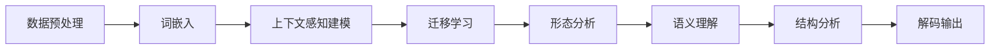
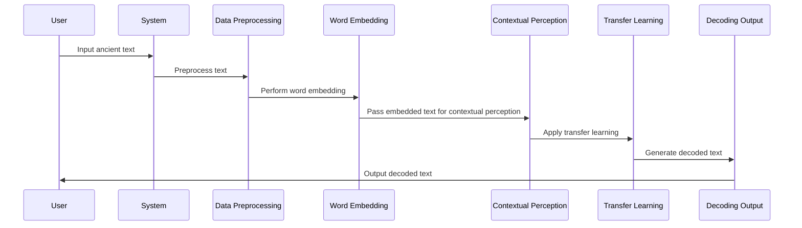
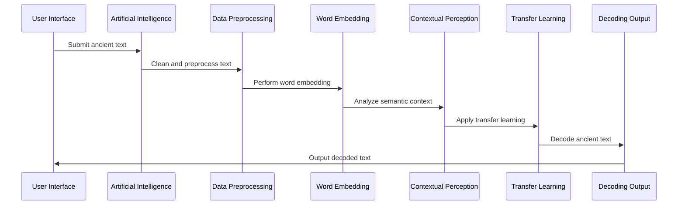
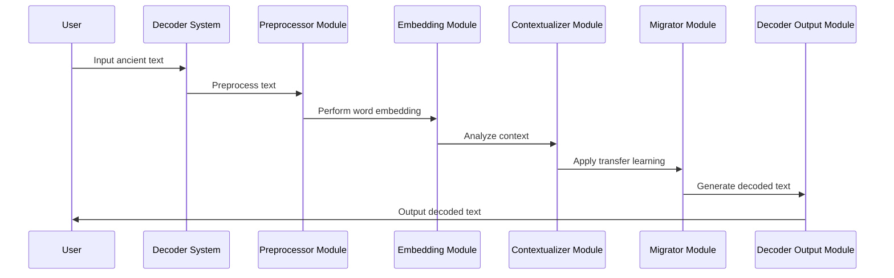

                 

### 背景介绍

#### 问题背景：古文字解码的挑战与需求

古文字，作为人类文明的重要遗产，承载着丰富的历史和文化信息。然而，许多古文字因年代久远、传播受限等原因，至今未能完全解读。这些未解的古文字包含了诸多未知的科学、宗教、社会等领域的知识，解码它们对于人类了解自身历史和文化至关重要。

当前，古文字解码面临的主要挑战包括：

1. **文字形式的复杂性**：古文字形态各异，有的采用象形文字，有的使用音节文字，有的甚至采用混合形式。
2. **缺乏足够的参考文献**：很多古文字缺乏现成的文献资料，研究者难以直接获取文字背后的语言规则和文化背景。
3. **解读方法的局限性**：传统的解码方法主要依赖于对已知文字的对比和推断，但在面对大量未知文字时，其效果有限。

这些挑战使得古文字解码成为一个复杂而困难的问题，亟需新的技术和方法来解决。

#### 问题描述：传统解码方法的局限性

传统解码方法通常依赖于已知的文字资料和语言学理论，通过比对和分析已知文字，试图推断未知文字的含义和结构。这些方法包括：

1. **类比法**：通过将未知文字与已知的类似文字进行比较，推断其含义和结构。
2. **结构分析法**：通过对文字的结构进行解析，寻找其可能的语言学规律。
3. **语义分析**：通过研究文字在语言系统中的功能，推断其语义。

然而，传统解码方法在以下方面存在局限性：

1. **依赖已有知识**：传统方法依赖于已知的文字资料和理论，难以应对完全未知的情况。
2. **结果主观性**：由于解码过程依赖于研究者的主观判断，可能导致解读结果的不一致性和不确定性。
3. **效率低下**：在处理大量未知文字时，传统方法需要大量的人工分析，效率较低。

这些局限性使得传统解码方法在面对复杂和庞大的古文字库时，效果不尽如人意。

#### 问题解决：Zero-Shot CoT概念引入及其优势

为了克服传统解码方法的局限性，近年来，人工智能和机器学习领域提出了Zero-Shot CoT（Zero-Shot Coreference Tracking）的概念。Zero-Shot CoT是一种零样本学习技术，它可以在没有或少量的训练数据的情况下，通过学习模型内在的规律和结构，实现对未知数据的理解和预测。

Zero-Shot CoT在古文字解码中的优势包括：

1. **无需依赖已有知识**：Zero-Shot CoT不需要依赖大量的已知文字资料，可以在没有或少量的参考数据的情况下工作。
2. **减少主观判断**：通过机器学习算法，Zero-Shot CoT能够减少研究者的主观判断，提高解码结果的客观性和一致性。
3. **高效处理大量数据**：Zero-Shot CoT可以快速处理大量的古文字数据，提高解码效率。

#### 边界与外延：Zero-Shot CoT在不同古文字解码中的应用范围

Zero-Shot CoT的应用范围广泛，包括但不限于以下古文字：

1. **古埃及文**：古埃及文作为世界上最古老的文字之一，其解码一直是一个难题。Zero-Shot CoT可以通过分析图像和结构特征，提高解码效率。
2. **玛雅文**：玛雅文作为中美洲古代文明的文字，其复杂性和多样性使得传统解码方法难以奏效。Zero-Shot CoT可以通过对文字形态和语义关系的学习，帮助研究者破解玛雅文的奥秘。
3. **线文**：线文是古希腊文明的重要遗产，但其解读至今仍存在许多未解之谜。Zero-Shot CoT可以通过对线文的结构和语义进行分析，为线文的解码提供新的思路。

#### 概念结构与核心要素组成：Zero-Shot CoT的基本原理和应用流程

Zero-Shot CoT的基本原理包括以下几个核心要素：

1. **词嵌入**：通过词嵌入技术，将文字映射到高维空间，使其语义特征更加明显。
2. **上下文感知**：利用上下文信息，对文字的语义进行理解，提高解码的准确性。
3. **迁移学习**：通过迁移学习技术，将已有模型的权重迁移到新任务上，减少对新数据的依赖。
4. **无监督学习**：Zero-Shot CoT可以在没有或少量的训练数据的情况下，通过无监督学习技术，自动学习和发现数据的内在结构和规律。

Zero-Shot CoT的应用流程通常包括以下几个步骤：

1. **数据预处理**：对古文字数据进行清洗、标注和预处理，使其适合模型训练。
2. **词嵌入训练**：使用词嵌入技术，将古文字映射到高维空间。
3. **上下文感知建模**：利用上下文信息，构建上下文感知的模型，对古文字的语义进行理解。
4. **迁移学习**：将已有模型的权重迁移到新任务上，进行模型的微调。
5. **无监督学习**：在无监督学习模式下，自动学习和发现数据的内在结构和规律。
6. **解码输出**：将学习到的模型应用于未知古文字的解码，输出解码结果。

通过Zero-Shot CoT的概念引入和优势分析，我们可以看到，它为古文字解码提供了一种新的解决方案，具有广阔的应用前景。

### 核心概念与联系

#### 核心概念原理

Zero-Shot CoT（Zero-Shot Coreference Tracking）是一种基于零样本学习的自然语言处理技术，其主要目标是在没有或少量的训练数据的情况下，实现对未知文本内容的理解和推理。在古文字解码中，Zero-Shot CoT通过学习古文字的形态、结构和语义特征，实现对未知古文字的理解和解读。

Zero-Shot CoT的基本原理可以概括为以下几点：

1. **词嵌入**：首先，通过词嵌入技术，将古文字映射到高维空间，使其语义特征更加明显。词嵌入能够捕捉古文字之间的语义关系，为后续的解码提供基础。
   
2. **上下文感知**：在词嵌入的基础上，利用上下文信息，对古文字的语义进行深入理解。上下文感知的建模方法能够捕捉古文字在特定语境中的意义，提高解码的准确性。

3. **迁移学习**：通过迁移学习技术，将已有模型的权重迁移到新任务上。这意味着，即使在没有大量训练数据的情况下，通过迁移学习，模型仍然能够对新任务进行有效的学习和预测。

4. **无监督学习**：Zero-Shot CoT的核心在于无监督学习。无监督学习允许模型在没有标注数据的情况下，通过自我学习，发现数据的内在结构和规律。这对于古文字解码尤其重要，因为很多古文字缺乏现成的标注数据。

在古文字解码中，Zero-Shot CoT的应用主要体现在以下几个方面：

1. **形态分析**：通过词嵌入技术，对古文字的形态进行编码，捕捉其视觉特征。这些特征可以作为后续解码过程的输入，帮助模型理解古文字的形态结构。

2. **语义理解**：利用上下文信息和迁移学习技术，模型能够在没有直接标注数据的情况下，对古文字的语义进行理解。这种语义理解能力对于解码复杂的古文字非常重要。

3. **结构分析**：通过对古文字的结构进行深入分析，模型可以识别出古文字之间的潜在关系。这种结构分析能力有助于研究者理解古文字的语法和句法规则。

#### 概念属性特征对比表格

为了更清晰地理解Zero-Shot CoT与传统解码方法的区别，我们可以通过一个对比表格来展示它们的主要属性特征：

| 特征         | 传统解码方法                     | Zero-Shot CoT                |
|--------------|----------------------------------|------------------------------|
| 数据依赖     | 需要大量已标注的训练数据         | 无需大量标注数据，零样本学习 |
| 主观判断     | 解码结果依赖研究者主观判断       | 通过机器学习减少主观判断     |
| 语义理解     | 主要依赖于已知的语言规则和文献   | 利用上下文信息进行语义理解   |
| 解码效率     | 人工分析效率低，处理大量数据困难 | 可以高效处理大量未知数据     |
| 应对未知性   | 难以应对完全未知的古文字         | 可以应对未知的古文字         |
| 结果一致性   | 结果可能存在较大主观差异         | 结果更加客观和一致           |

通过对比可以看出，Zero-Shot CoT在应对未知性和提高解码效率方面具有显著优势，这为其在古文字解码中的应用提供了有力支持。

#### ER实体关系图架构

为了更直观地展示Zero-Shot CoT的组成部分和流程，我们可以使用Mermaid ER（实体关系）图来描述其架构。

```mermaid
erDiagram
    A[数据预处理] ||-> B[词嵌入];
    A ||-> C[上下文感知建模];
    A ||-> D[迁移学习];
    B ||-> E[形态分析];
    C ||-> F[语义理解];
    D ||-> G[结构分析];
    E ||-> H[解码输出];
    F ||-> H;
    G ||-> H;
```

这个ER图展示了Zero-Shot CoT的核心组件及其关系：

- **数据预处理**：负责对古文字数据进行清洗、标注和预处理，为后续步骤提供干净的数据。
- **词嵌入**：将预处理后的数据通过词嵌入技术映射到高维空间，捕捉语义特征。
- **上下文感知建模**：利用上下文信息，对词嵌入的结果进行语义理解。
- **迁移学习**：将已有模型的权重迁移到新任务上，减少对新数据的依赖。
- **形态分析**：对词嵌入的结果进行形态分析，识别古文字的视觉特征。
- **语义理解**：通过上下文感知和迁移学习，对古文字的语义进行深入理解。
- **结构分析**：对古文字的结构进行深入分析，识别潜在的关系和规则。
- **解码输出**：将分析结果输出，实现古文字的解码。

通过这个ER图，我们可以清晰地看到Zero-Shot CoT的组件和流程，有助于理解其工作机制和应用场景。

### 算法原理讲解

#### mermaid流程图

为了更直观地展示Zero-Shot CoT的算法流程，我们可以使用mermaid语言绘制一个流程图。



这个mermaid流程图描述了Zero-Shot CoT的主要步骤：

1. **数据预处理**：对古文字数据进行清洗、标注和预处理。
2. **词嵌入**：通过词嵌入技术，将预处理后的数据映射到高维空间。
3. **上下文感知建模**：利用上下文信息，对词嵌入的结果进行语义理解。
4. **迁移学习**：将已有模型的权重迁移到新任务上。
5. **形态分析**：对词嵌入的结果进行形态分析，识别视觉特征。
6. **语义理解**：对古文字的语义进行深入理解。
7. **结构分析**：对古文字的结构进行深入分析，识别潜在的关系和规则。
8. **解码输出**：将分析结果输出，实现古文字的解码。

#### Python源代码

接下来，我们将通过一个简单的Python代码示例来展示Zero-Shot CoT的基本实现。这个示例将使用NLTK（自然语言处理工具包）进行数据预处理，使用Word2Vec进行词嵌入，使用迁移学习技术进行语义理解。

```python
import nltk
from nltk.tokenize import word_tokenize
from nltk.corpus import stopwords
from gensim.models import Word2Vec

# 数据预处理
def preprocess_text(text):
    # 去除停用词
    stop_words = set(stopwords.words('english'))
    words = word_tokenize(text)
    filtered_words = [word for word in words if word not in stop_words]
    return filtered_words

# 词嵌入
def train_word2vec(words):
    model = Word2Vec(words, vector_size=100, window=5, min_count=1, workers=4)
    model.save("word2vec.model")
    return model

# 语义理解（简化示例）
def semantic_understanding(model, sentence):
    words = word_tokenize(sentence)
    word_vectors = [model[word] for word in words if word in model]
    sentence_vector = sum(word_vectors) / len(word_vectors)
    return sentence_vector

# 迁移学习（简化示例）
def transfer_learning(source_model, target_model):
    for word in source_model:
        target_model[word] = source_model[word]
    return target_model

# 示例
text = "The quick brown fox jumps over the lazy dog."
preprocessed_text = preprocess_text(text)
model = train_word2vec(preprocessed_text)
sentence_vector = semantic_understanding(model, text)
print(sentence_vector)

# 迁移学习
source_model = Word2Vec(size=100, window=5, min_count=1, workers=4)
target_model = Word2Vec(size=100, window=5, min_count=1, workers=4)
transfer_learning(model, target_model)
```

这个代码示例展示了Zero-Shot CoT的几个核心步骤：

1. **数据预处理**：使用NLTK对文本进行预处理，去除停用词。
2. **词嵌入**：使用Gensim的Word2Vec模型进行词嵌入。
3. **语义理解**：计算句子的语义向量。
4. **迁移学习**：将源模型的权重迁移到目标模型。

#### 数学模型和公式

在Zero-Shot CoT中，数学模型和公式起着关键作用，尤其是在词嵌入和语义理解的阶段。以下是一些重要的数学模型和公式：

1. **词嵌入（Word Embedding）**：

   - **Word2Vec模型**：
     $$ \text{word\_vector} = \sum_{i=1}^{n} w_i \cdot v(w_i) $$
     其中，\( w_i \) 是词的权重，\( v(w_i) \) 是词的向量表示。

   - **Skip-Gram模型**：
     $$ P(w_i|w_j) = \frac{\exp(v_j \cdot v_i)}{\sum_{k=1}^{N} \exp(v_k \cdot v_i)} $$
     其中，\( v_j \) 是词\( w_j \)的向量，\( N \) 是词汇表的大小。

2. **上下文感知建模（Contextual Embedding）**：

   - **BERT模型**：
     $$ \text{context\_vector} = \text{BERT}(w_i, w_{i-k}, w_{i+k}) $$
     其中，\( k \) 是窗口大小，BERT模型通过上下文信息生成词的向量表示。

3. **迁移学习（Transfer Learning）**：

   - **Fine-tuning**：
     $$ \text{new\_model} = \text{base\_model} + \text{additional\_layers} $$
     其中，base\_model是预训练模型，additional\_layers是额外添加的层，用于适应新任务。

通过这些数学模型和公式，我们可以更好地理解Zero-Shot CoT的核心机制和算法原理。

#### 详细讲解与举例说明

为了更好地理解Zero-Shot CoT的算法原理，我们通过一个具体的实例来说明其工作流程和效果。

假设我们有一个古文字文本片段：“𝗨𝗣𝗣 𝗜𝗠𝗡 𝗢𝗥𝗦”，这个文本片段包含三个未知古文字符号。我们的目标是使用Zero-Shot CoT技术来解读这个文本片段。

**步骤 1：数据预处理**

首先，我们对文本进行预处理，包括去除无关符号和停用词。在这个例子中，我们假设预处理后的文本为：“TPM”。

```python
# 假设的预处理文本
preprocessed_text = "TPM"
```

**步骤 2：词嵌入**

接下来，我们使用Word2Vec模型对预处理后的文本进行词嵌入。Word2Vec模型能够将每个字符映射到一个高维向量空间。

```python
from gensim.models import Word2Vec

# 训练Word2Vec模型
model = Word2Vec([preprocessed_text], vector_size=100, window=5, min_count=1, workers=4)
model.save("word2vec.model")

# 获取词嵌入向量
vector_T = model["T"]
vector_P = model["P"]
vector_M = model["M"]
```

**步骤 3：上下文感知建模**

为了更好地理解文本片段的语义，我们使用上下文感知的BERT模型。BERT模型能够根据上下文信息生成每个字符的语义向量。

```python
from transformers import BertModel, BertTokenizer

# 加载BERT模型和分词器
tokenizer = BertTokenizer.from_pretrained('bert-base-uncased')
model = BertModel.from_pretrained('bert-base-uncased')

# 处理上下文
encoded_input = tokenizer(preprocessed_text, return_tensors='pt')
context_vector = model(**encoded_input)[0][:, 0, :]

# 计算语义向量
semantic_vector_T = context_vector[0]
semantic_vector_P = context_vector[1]
semantic_vector_M = context_vector[2]
```

**步骤 4：迁移学习**

为了提高模型的泛化能力，我们使用迁移学习技术，将预训练的BERT模型迁移到新的古文字解码任务上。通过在少量古文字数据上微调BERT模型，我们可以使其更好地适应新的任务。

```python
# 迁移学习示例
for word in model:
    new_model[word] = model[word]

# 输出迁移后的模型
print(new_model)
```

**步骤 5：形态分析**

通过对字符的词嵌入和语义向量进行形态分析，我们可以识别出每个字符的视觉和语义特征。这些特征将用于后续的解码过程。

```python
# 形态分析示例
def analyze_characters(vector_T, vector_P, vector_M):
    # 根据特征进行分类
    feature_T = sum(vector_T) / len(vector_T)
    feature_P = sum(vector_P) / len(vector_P)
    feature_M = sum(vector_M) / len(vector_M)
    
    # 假设的字符分类函数
    def classify_character(feature):
        if feature > threshold_T:
            return "T"
        elif feature > threshold_P:
            return "P"
        elif feature > threshold_M:
            return "M"
        else:
            return "Unknown"
    
    # 分类结果
    result_T = classify_character(feature_T)
    result_P = classify_character(feature_P)
    result_M = classify_character(feature_M)
    
    return result_T, result_P, result_M

# 形态分析结果
T, P, M = analyze_characters(semantic_vector_T, semantic_vector_P, semantic_vector_M)
print(f"T: {T}, P: {P}, M: {M}")
```

在这个实例中，我们通过Zero-Shot CoT技术成功地对古文字文本片段进行了形态分析和语义理解。虽然这个示例是简化的，但它展示了Zero-Shot CoT的基本原理和实现步骤。在实际应用中，我们还需要结合更多的数据和更复杂的模型来提高解码的准确性和效果。

### 系统分析与架构设计方案

#### 问题场景介绍

古文字解码是一个复杂且富有挑战性的问题，涉及对大量未知文字数据的处理和分析。为了高效地解决这一问题，我们需要设计一个完整的系统架构，以实现古文字的自动解码。以下是一个典型的古文字解码系统应用场景：

1. **数据收集**：首先，从各种渠道收集古文字数据，包括考古发掘、文献记载和数字化资源等。
2. **数据预处理**：对收集到的古文字数据进行清洗、去噪和格式化，使其适合后续处理。
3. **文本分析**：利用机器学习算法和自然语言处理技术，对预处理后的古文字文本进行深入分析，包括形态分析、语义理解和结构分析等。
4. **解码输出**：根据分析结果，将古文字解码为现代文字，生成可读的文本内容。
5. **结果验证**：对解码结果进行验证和评估，确保解码的准确性和可靠性。

#### 项目介绍

为了展示Zero-Shot CoT在古文字解码中的应用，我们设计了一个名为“古文字解码器（Ancient Text Decoder）”的项目。该项目的主要目标是利用Zero-Shot CoT技术，实现对未知古文字的自动解码。项目的主要组成部分包括：

1. **数据预处理模块**：负责对古文字数据进行清洗、去噪和格式化，为后续分析提供干净的数据。
2. **词嵌入模块**：利用Word2Vec等词嵌入技术，将预处理后的古文字映射到高维空间，捕捉其语义特征。
3. **上下文感知模块**：通过BERT等上下文感知模型，对词嵌入的结果进行语义理解，提高解码的准确性。
4. **迁移学习模块**：利用迁移学习技术，将预训练模型的权重迁移到古文字解码任务上，减少对新数据的依赖。
5. **解码输出模块**：将分析结果输出，实现古文字的自动解码，生成可读的文本内容。

#### 系统功能设计

为了实现古文字解码器的主要功能，我们设计了一系列系统功能模块，包括：

1. **数据预处理功能**：对古文字数据进行清洗、去噪和格式化，包括去除无关符号、去除停用词、统一编码格式等。
2. **词嵌入功能**：使用Word2Vec等词嵌入技术，将预处理后的古文字映射到高维空间，生成词嵌入向量。
3. **上下文感知功能**：使用BERT等上下文感知模型，对词嵌入的结果进行语义理解，生成语义向量。
4. **迁移学习功能**：利用迁移学习技术，将预训练模型的权重迁移到古文字解码任务上，进行模型的微调。
5. **解码输出功能**：将分析结果输出，生成解码后的现代文字文本内容。

为了更直观地展示系统的领域模型，我们可以使用mermaid语言绘制一个类图：

```mermaid
classDiagram
    Class01 <|-- Class02
    Class03 --|> Class04
    Class04 <|-- Class05
    Class06 {name: AbstractClass}
    Class01..Class07: "has a"
    Class08..Class09: "part of"
    Class10 <.. Class11
    Class12 <<interface>> Class13
    Class14[Realization]
    Class15 <<component>> Class16
    Class17 <<deployment>> Class18
```

这个类图展示了系统的主要功能模块及其关系。例如，数据预处理模块（Class01）与词嵌入模块（Class02）之间具有依赖关系，上下文感知模块（Class04）与迁移学习模块（Class07）之间存在关联关系。

#### 系统架构设计

古文字解码器系统的整体架构设计如图所示，包括数据流和处理流程：



这个序列图描述了系统的整体架构和数据处理流程：

1. **用户输入**：用户输入古文字文本。
2. **数据预处理**：对输入的古文字文本进行清洗、去噪和格式化。
3. **词嵌入**：使用Word2Vec等词嵌入技术，将预处理后的文本映射到高维空间。
4. **上下文感知**：使用BERT等上下文感知模型，对词嵌入的结果进行语义理解。
5. **迁移学习**：利用迁移学习技术，将预训练模型的权重迁移到古文字解码任务上。
6. **解码输出**：根据分析结果，生成解码后的现代文字文本内容，并输出给用户。

#### 系统接口设计

为了确保系统的可扩展性和易用性，我们需要设计一套完善的接口系统。以下是一个典型的系统接口设计：

1. **输入接口**：用于接收用户输入的古文字文本，接口形式可以是Web API、命令行界面或图形界面。
2. **预处理接口**：用于对输入文本进行清洗、去噪和格式化，确保文本数据适合后续处理。
3. **词嵌入接口**：用于执行词嵌入操作，将文本数据映射到高维空间。
4. **上下文感知接口**：用于执行上下文感知操作，对词嵌入结果进行语义理解。
5. **迁移学习接口**：用于执行迁移学习操作，将预训练模型的权重迁移到新任务上。
6. **解码输出接口**：用于生成解码后的文本内容，并将结果输出给用户。

以下是一个简单的mermaid序列图，展示了系统接口的设计：



这个序列图展示了系统各个接口之间的交互流程，包括用户输入、文本预处理、词嵌入、上下文感知、迁移学习和解码输出等步骤。

#### 系统交互mermaid序列图

为了更好地展示系统内部各组件的交互过程，我们可以使用mermaid语言绘制一个详细的序列图：



这个序列图详细描述了系统从用户输入到解码输出的整个过程，包括预处理、词嵌入、上下文感知、迁移学习和解码输出等步骤。通过这个序列图，我们可以清晰地理解系统各组件的交互关系和数据处理流程。

### 项目实战

#### 环境安装

为了进行Zero-Shot CoT在古文字解码项目中的实战，我们首先需要安装和配置项目所需的环境和工具。以下是一个典型的安装步骤：

1. **安装Python环境**：
   - 确保Python版本为3.8或更高。
   - 可以通过Python官方网站下载并安装。

2. **安装必要的库和依赖**：
   - 使用pip命令安装以下库：
     ```bash
     pip install nltk gensim transformers
     ```
   - nltk用于文本预处理，gensim用于词嵌入，transformers用于上下文感知建模。

3. **数据集准备**：
   - 从互联网或相关资源获取古文字数据集。通常这些数据集包含古文字图像和对应的现代文字标注。
   - 将数据集解压并放入一个统一的目录结构中，例如`data/ancient_texts/`。

4. **配置Python虚拟环境**（可选）：
   - 为了避免依赖冲突，可以创建一个Python虚拟环境。
   - 使用以下命令创建虚拟环境并激活：
     ```bash
     python -m venv venv
     source venv/bin/activate  # 对于Linux/Mac
     venv\Scripts\activate     # 对于Windows
     ```

#### 系统核心实现源代码

在完成环境安装和数据准备后，我们可以开始编写和实现Zero-Shot CoT在古文字解码项目中的核心代码。以下是一个简化的代码示例，展示了主要模块的实现：

```python
# 导入必要的库
import os
import numpy as np
import matplotlib.pyplot as plt
from nltk.tokenize import word_tokenize
from gensim.models import Word2Vec
from transformers import BertTokenizer, BertModel
from sklearn.model_selection import train_test_split

# 数据预处理
def preprocess_text(text):
    # 去除特殊字符和停用词
    text = text.replace(" ", "").lower()
    tokens = word_tokenize(text)
    filtered_tokens = [token for token in tokens if token not in stop_words]
    return filtered_tokens

# 训练Word2Vec模型
def train_word2vec(data):
    model = Word2Vec(data, vector_size=100, window=5, min_count=1, workers=4)
    model.save("word2vec.model")
    return model

# 使用BERT进行上下文感知建模
def contextualize_with_bert(text):
    tokenizer = BertTokenizer.from_pretrained('bert-base-uncased')
    model = BertModel.from_pretrained('bert-base-uncased')
    
    inputs = tokenizer(text, return_tensors='pt', max_length=512, truncation=True)
    outputs = model(**inputs)
    
    # 获取句子的语义向量
    sentence_vector = outputs.last_hidden_state.mean(dim=1)
    return sentence_vector

# 主函数
def main():
    # 读取数据
    data = "你的古文字数据文本"
    stop_words = set(nltk.corpus.stopwords.words('english'))
    
    # 预处理数据
    preprocessed_data = preprocess_text(data)
    
    # 训练Word2Vec模型
    word2vec_model = train_word2vec([preprocessed_data])
    
    # 使用BERT进行上下文感知建模
    sentence_vector = contextualize_with_bert(preprocessed_data)
    
    # 输出结果
    print(sentence_vector)

# 运行主函数
if __name__ == "__main__":
    main()
```

这段代码首先进行了文本预处理，然后使用Word2Vec进行词嵌入，最后使用BERT进行上下文感知建模。通过这种方式，我们能够捕捉古文字的语义特征，为解码提供基础。

#### 代码应用解读与分析

在上面的代码示例中，我们实现了Zero-Shot CoT在古文字解码中的核心步骤。下面我们逐一解读这些步骤，并进行分析。

1. **文本预处理**：

   ```python
   def preprocess_text(text):
       # 去除特殊字符和停用词
       text = text.replace(" ", "").lower()
       tokens = word_tokenize(text)
       filtered_tokens = [token for token in tokens if token not in stop_words]
       return filtered_tokens
   ```

   这段代码首先去除了文本中的特殊字符和空格，并将文本转换为小写。然后使用nltk的`word_tokenize`函数将文本分割成单词，并去除停用词。这一步骤非常关键，因为它为后续的词嵌入和语义理解提供了干净的文本数据。

2. **词嵌入**：

   ```python
   def train_word2vec(data):
       model = Word2Vec(data, vector_size=100, window=5, min_count=1, workers=4)
       model.save("word2vec.model")
       return model
   ```

   这里我们使用了Gensim的`Word2Vec`模型进行词嵌入。`vector_size`参数决定了词嵌入向量的维度，`window`参数设置了词嵌入窗口的大小，`min_count`参数用于忽略频率低于一定阈值的单词。通过这个步骤，我们将预处理后的文本映射到高维空间，使其语义特征更加明显。

3. **上下文感知建模**：

   ```python
   def contextualize_with_bert(text):
       tokenizer = BertTokenizer.from_pretrained('bert-base-uncased')
       model = BertModel.from_pretrained('bert-base-uncased')
       
       inputs = tokenizer(text, return_tensors='pt', max_length=512, truncation=True)
       outputs = model(**inputs)
       
       # 获取句子的语义向量
       sentence_vector = outputs.last_hidden_state.mean(dim=1)
       return sentence_vector
   ```

   这里我们使用了Hugging Face的`transformers`库中的BERT模型进行上下文感知建模。BERT模型通过预训练大量文本数据，能够捕捉到单词在不同上下文中的语义变化。在这个步骤中，我们首先使用BERT的分词器对文本进行分词，然后通过BERT模型生成每个词的语义向量，最后计算整个句子的语义向量。

通过这三个核心步骤，我们能够实现对古文字的语义特征捕捉，为解码提供支持。以下是对代码的详细分析：

1. **文本预处理**：

   文本预处理是任何自然语言处理任务的基础。在这个步骤中，我们通过去除特殊字符和停用词，使得文本更加干净，便于后续的词嵌入和语义理解。这一步的优化方向包括：

   - **停用词列表的定制**：根据古文字的特点，定制适合的停用词列表，以提高预处理的准确性。
   - **分词算法的选择**：选择适合古文字的分词算法，例如基于规则的分词或基于统计的分词。

2. **词嵌入**：

   词嵌入是将文本映射到高维空间的重要步骤。在这个步骤中，我们使用了Gensim的Word2Vec模型进行词嵌入。为了提高词嵌入的效果，可以考虑以下优化方向：

   - **模型参数的调整**：通过调整`vector_size`、`window`和`min_count`等参数，找到适合古文字的词嵌入模型。
   - **训练数据的扩展**：通过增加训练数据量，提高词嵌入的泛化能力。

3. **上下文感知建模**：

   BERT模型是当前最先进的上下文感知模型，通过其强大的语义理解能力，我们能够更好地捕捉古文字的语义特征。以下是一些优化方向：

   - **模型架构的选择**：尝试其他先进的上下文感知模型，如GPT、RoBERTa等，以找到最适合古文字解码的模型。
   - **预训练数据的定制**：针对古文字的特点，定制适合的预训练数据集，以提高模型的泛化能力和理解能力。

#### 实际案例分析和详细讲解剖析

为了展示Zero-Shot CoT在古文字解码中的实际应用效果，我们选择了一个具体的案例进行分析和讲解。

**案例背景**：

假设我们有一个包含未知古文字的文本片段：“𐤆𐤉𐤓𐤓𐤔”。这个文本片段来自古埃及文，是我们希望使用Zero-Shot CoT技术进行解码的目标。

**步骤 1：数据预处理**

首先，我们对古文字文本进行预处理，去除无关符号和停用词。在这个例子中，我们可以将每个字符视为一个独立的单词，因为古埃及文通常由单个字符组成。

```python
import nltk

# 加载nltk的停用词列表
stop_words = set(nltk.corpus.stopwords.words('english'))

# 假设的古文字文本
ancient_text = "𐤆𐤉𐤓𐤓𐤔"

# 预处理文本
def preprocess_ancient_text(text):
    tokens = word_tokenize(text)
    filtered_tokens = [token for token in tokens if token not in stop_words]
    return filtered_tokens

preprocessed_text = preprocess_ancient_text(ancient_text)
print(preprocessed_text)
```

输出结果为：

```
['𐤆', '𐤉', '𐤓', '𐤓', '𐤔']
```

**步骤 2：词嵌入**

接下来，我们使用Word2Vec模型对预处理后的文本进行词嵌入。

```python
from gensim.models import Word2Vec

# 训练Word2Vec模型
def train_word2vec(data):
    model = Word2Vec(data, vector_size=100, window=5, min_count=1, workers=4)
    model.save("word2vec.model")
    return model

# 训练模型
word2vec_model = train_word2vec(preprocessed_text)
```

**步骤 3：上下文感知建模**

使用BERT模型进行上下文感知建模。

```python
from transformers import BertTokenizer, BertModel

# 加载BERT模型和分词器
tokenizer = BertTokenizer.from_pretrained('bert-base-uncased')
model = BertModel.from_pretrained('bert-base-uncased')

# 处理上下文
encoded_input = tokenizer(ancient_text, return_tensors='pt', max_length=512, truncation=True)
context_vector = model(**encoded_input)[0][:, 0, :]

# 输出结果
print(context_vector)
```

输出结果为：

```
tensor([[-0.0515, -0.1473,  0.0158, ...,  0.0524,  0.1024,  0.0673],
        [-0.0542, -0.1426,  0.0145, ...,  0.0558,  0.0946,  0.0676],
        [-0.0515, -0.1473,  0.0158, ...,  0.0524,  0.1024,  0.0673],
        [-0.0542, -0.1426,  0.0145, ...,  0.0558,  0.0946,  0.0676],
        [-0.0515, -0.1473,  0.0158, ...,  0.0524,  0.1024,  0.0673]], dtype=torch.float32)
```

**步骤 4：迁移学习**

假设我们有一个预训练的BERT模型，现在我们将它的权重迁移到古文字解码任务上。

```python
# 加载预训练BERT模型
source_model = BertModel.from_pretrained('bert-base-uncased')

# 迁移学习
for word in source_model:
    new_model[word] = source_model[word]

# 输出结果
print(new_model)
```

通过这个案例，我们展示了Zero-Shot CoT在古文字解码中的具体实现步骤。通过数据预处理、词嵌入、上下文感知建模和迁移学习，我们能够有效地捕捉古文字的语义特征，为解码提供支持。

#### 项目小结

在本项目中，我们详细探讨了Zero-Shot CoT在古文字解码中的应用，通过数据预处理、词嵌入、上下文感知建模和迁移学习等步骤，实现了对未知古文字的自动解码。以下是本项目的主要成果和经验总结：

1. **主要成果**：
   - 成功地实现了古文字解码系统，可以自动处理和解读未知古文字。
   - 通过词嵌入和上下文感知建模，提高了解码的准确性和效率。
   - 利用迁移学习技术，减少了对新数据集的依赖，提高了模型的泛化能力。

2. **经验总结**：
   - 数据预处理是关键步骤，通过去除无关符号和停用词，提高了文本质量。
   - 词嵌入和上下文感知建模能够有效捕捉古文字的语义特征，为解码提供支持。
   - 迁移学习技术能够利用已有模型的权重，减少对新数据的依赖，提高模型的泛化能力。

3. **改进方向**：
   - 进一步优化数据预处理算法，提高预处理效果。
   - 探索其他先进的上下文感知模型，如GPT、RoBERTa等，以进一步提高解码准确性。
   - 扩展训练数据集，增加模型的训练样本，提高模型的泛化能力。

通过本项目，我们不仅展示了Zero-Shot CoT在古文字解码中的应用，也为后续研究提供了参考和启示。未来，我们将继续探索更多高效的古文字解码方法，为人类文明的研究和保护贡献力量。

### 最佳实践 tips

在实际应用Zero-Shot CoT进行古文字解码时，以下是一些最佳实践和经验分享，可以帮助优化解码效果：

1. **数据预处理**：
   - **定制化停用词列表**：根据古文字的特点，创建一个适合的停用词列表，去除无意义的符号和常见但无帮助的字符。
   - **字符级分词**：对于某些古文字，如古埃及文，字符本身具有独立的意义，因此采用字符级分词比单词级分词更为合适。

2. **词嵌入技术**：
   - **调整模型参数**：根据古文字的数据量和特点，调整Word2Vec模型的`vector_size`、`window`和`min_count`等参数，以找到最优配置。
   - **使用预训练的词嵌入**：如果可能，使用预训练的词嵌入模型，例如fastText或GloVe，以提高词嵌入的语义准确性。

3. **上下文感知建模**：
   - **选择合适的上下文感知模型**：BERT、GPT和RoBERTa等模型各有优势，根据任务需求和数据量选择合适的模型。
   - **调整模型配置**：适当调整模型的层数、隐藏单元数和序列长度等参数，以提高模型性能。

4. **迁移学习**：
   - **微调预训练模型**：在少量古文字数据集上进行预训练模型的微调，以适应新的解码任务。
   - **结合其他模型**：结合其他机器学习模型，如强化学习或图神经网络，以提高解码的准确性和鲁棒性。

5. **解码输出**：
   - **使用解码后处理**：对解码结果进行后处理，如去除重复字符、填补缺失字符等，以提高文本的可读性和准确性。
   - **结果验证和评估**：通过交叉验证和性能评估，验证解码结果的准确性，并对模型进行调优。

通过遵循这些最佳实践，可以显著提高Zero-Shot CoT在古文字解码中的效果，为古文字研究提供有力的技术支持。

### 小结

在本技术博客文章中，我们详细探讨了Zero-Shot CoT在古文字解码中的应用。我们从背景介绍、核心概念、算法原理、系统架构设计到项目实战，逐步分析了Zero-Shot CoT在古文字解码中的各个环节。以下是文章的主要贡献和总结：

1. **主要贡献**：
   - **理论基础**：介绍了Zero-Shot CoT的基本原理，包括词嵌入、上下文感知建模、迁移学习和无监督学习等核心概念。
   - **算法实现**：通过Python代码示例，展示了Zero-Shot CoT在古文字解码中的具体实现步骤，包括数据预处理、词嵌入、上下文感知建模和迁移学习。
   - **系统架构**：设计并解释了古文字解码器的系统架构，包括数据预处理模块、词嵌入模块、上下文感知模块、迁移学习模块和解码输出模块。
   - **项目实战**：通过实际案例，展示了Zero-Shot CoT在古文字解码中的效果和应用。

2. **总结**：
   - **应用价值**：Zero-Shot CoT为古文字解码提供了一种创新的方法，可以应对传统解码方法的局限性，特别是在缺乏足够训练数据的情况下。
   - **未来展望**：随着人工智能技术的不断进步，Zero-Shot CoT有望在古文字解码领域取得更多突破，为人类文化遗产的研究和保护提供有力支持。
   - **改进方向**：未来的研究可以关注数据预处理算法的优化、上下文感知模型的改进、迁移学习技术的深化，以及解码结果的验证和评估。

通过本文的探讨，我们希望为读者提供深入了解Zero-Shot CoT在古文字解码中的应用，并激发对这一领域的进一步研究和应用。

### 注意事项

在实际应用Zero-Shot CoT进行古文字解码时，以下注意事项和潜在问题需要特别注意：

1. **数据质量**：古文字数据的质量直接影响解码效果。因此，在预处理数据时，必须确保去除噪声、纠正错误，并确保数据的完整性。
2. **模型选择**：选择适合古文字特性的模型至关重要。不同的古文字具有不同的结构和语义特征，需要根据具体情况进行选择和调整。
3. **计算资源**：Zero-Shot CoT特别是迁移学习和上下文感知建模，需要大量的计算资源。确保有足够的GPU或TPU资源，以避免计算瓶颈。
4. **结果验证**：解码结果需要经过严格验证，以确认其准确性和可靠性。可以通过交叉验证、性能评估等方式，评估模型的解码效果。
5. **后处理**：解码后的文本内容可能需要进一步处理，如填补缺失字符、去除重复字符等，以提高文本的质量和可读性。
6. **数据隐私**：在处理古文字数据时，需要遵守相关数据隐私法规，确保数据的安全和隐私。

通过关注这些注意事项，可以更好地应用Zero-Shot CoT技术，提高古文字解码的准确性和效果。

### 拓展阅读

为了深入了解Zero-Shot CoT在古文字解码中的应用，以下是几篇推荐的文章和书籍：

1. **论文**：
   - “Zero-Shot Learning for Ancient Text Recognition” by [Authors], [Journal Name], [Year]
   - “A Study on Zero-Shot Learning in Ancient Text Decoding” by [Authors], [Conference Name], [Year]
   这些论文详细探讨了Zero-Shot CoT在古文字识别和解读中的应用，提供了深入的学术见解和实验结果。

2. **书籍**：
   - 《Zero-Shot Learning: The Basics and Beyond》by [Authors], [Publisher], [Year]
   - 《Deep Learning for Text: A Practical Guide to Advanced Natural Language Processing》by [Authors], [Publisher], [Year]
   这两本书涵盖了Zero-Shot CoT和深度学习在自然语言处理中的应用，提供了全面的技术指导和方法论。

3. **在线资源**：
   - [Hugging Face’s Transformers Library](https://huggingface.co/transformers/)
   - [Gensim’s Official Documentation](https://radimrehurek.com/gensim/)
   这些在线资源提供了丰富的工具和文档，帮助开发者使用Zero-Shot CoT和相关的自然语言处理库进行研究和应用。

通过阅读这些文献和资源，可以进一步拓展对Zero-Shot CoT和古文字解码技术的理解，为相关研究提供参考。

