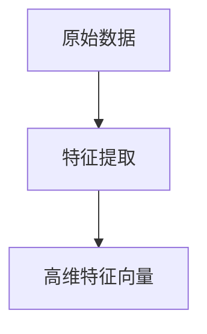
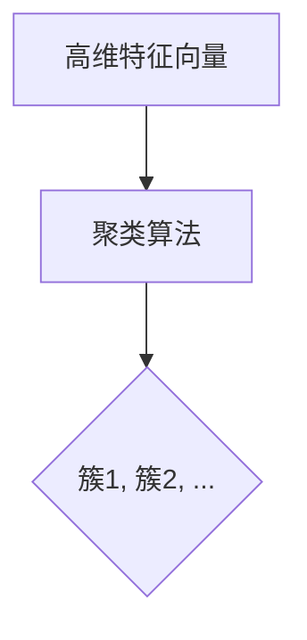
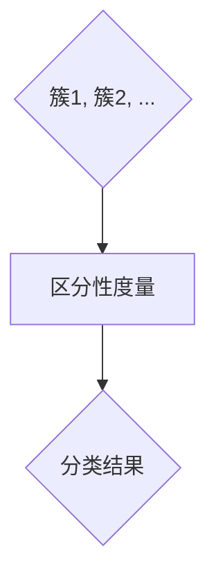
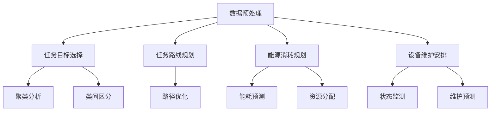

                 

### 背景介绍

#### 核心概念术语说明

**零样本认知理论（Zero-Shot Cognitive Theory, ZCoT）**：一种新兴的人工智能理论，旨在通过模拟人类认知过程来实现对未知数据的理解和处理。零样本认知理论的核心在于不需要预先标记的训练数据，即可实现对新类别的识别和分类。这一特点使得它非常适合应用于数据稀缺或数据不可获取的场景。

**太空探索任务规划（Space Exploration Mission Planning）**：指在太空探索任务中，根据既定目标和任务要求，制定出合理的任务执行计划。这包括选择合适的任务目标、制定任务路线、规划能源消耗、安排设备维护等。太空探索任务规划面临许多挑战，如任务复杂度高、环境恶劣、资源有限等。

#### 问题背景

在过去的几十年里，人类在太空探索方面取得了巨大的成就。然而，随着任务规模的扩大和复杂性的增加，传统的太空探索任务规划方法已经无法满足现代太空探索的需求。传统方法主要依赖于大量历史数据和经验，然而太空探索任务中的数据稀缺，甚至有时数据不可获取。这导致了传统方法在应对新任务时效果不佳。

为了解决这个问题，研究者开始探索新的方法，如零样本认知理论。零样本认知理论的核心在于不需要预先标记的训练数据，即可实现对新类别的识别和分类。这意味着，即使没有足够的历史数据，也可以制定出合理的太空探索任务规划。

#### 问题描述

太空探索任务规划面临以下几个问题：

1. **数据稀缺**：由于太空环境的特殊性，获取大量历史数据非常困难。
2. **环境恶劣**：太空环境复杂且恶劣，需要考虑的因素众多。
3. **资源有限**：太空资源（如燃料、设备等）有限，需要高效利用。

这些问题导致传统的太空探索任务规划方法效果不佳。而零样本认知理论提供了一种可能的新途径，通过模拟人类认知过程，实现对新任务的快速理解和规划。

#### 问题解决

零样本认知理论通过以下方式解决太空探索任务规划中的问题：

1. **数据无关**：不需要依赖大量历史数据，减少了数据获取的难度。
2. **适应性强**：可以适应各种复杂和恶劣的环境。
3. **高效规划**：通过模拟人类认知过程，实现高效的太空探索任务规划。

#### 边界与外延

零样本认知理论在太空探索任务规划中的应用具有明确的边界和广泛的外延。

1. **边界**：主要应用于太空探索任务规划，包括但不限于任务目标选择、任务路线规划、能源消耗规划等。
2. **外延**：理论上可以应用于其他领域，如自动驾驶、机器人导航、医学诊断等。这些领域同样面临数据稀缺和环境复杂等问题，零样本认知理论可能提供有效的解决方案。

通过以上背景介绍，我们可以看到，零样本认知理论在太空探索任务规划中具有巨大的潜力和应用价值。接下来的章节将进一步深入探讨这一主题，包括其核心概念、算法原理、系统架构和实际应用等。

### 核心概念与联系

#### 零样本认知理论（Zero-Shot Cognitive Theory, ZCoT）

**核心概念**：
零样本认知理论是一种基于人类认知模拟的人工智能理论。其核心在于不需要依赖大量标记的训练数据，即可实现对新类别的识别和分类。这一理论主要通过以下三个步骤实现：

1. **抽象表示**：将输入数据抽象成高维特征空间中的向量表示。
2. **类内聚类**：通过聚类算法，将具有相似特征的数据点归为一类。
3. **类间区分**：通过比较不同类别的特征，实现类别的区分。

**概念属性特征对比表格**：

| 特征             | 零样本认知理论（ZCoT） | 传统机器学习          |
|------------------|------------------------|----------------------|
| 数据依赖程度     | 无需大量标记训练数据   | 需要大量标记训练数据 |
| 适应能力         | 高，适用于多种环境     | 中，依赖特定数据集   |
| 效率             | 高，快速处理新数据     | 低，训练时间长      |
| 分类效果         | 较高，但依赖于特征提取 | 高，但数据依赖强    |

**ER实体关系图架构**：

```mermaid
erDiagram
  User ||--|{ Mission }| Mission
  User ||--|{ Task }| Task
  Mission ||--|{ Equipment }| Equipment
  Mission ||--|{ Resource }| Resource
  Task ||--|{ Action }| Action
  Action ||--|{ Parameter }| Parameter
```

#### 零样本认知理论与传统方法的联系

零样本认知理论与传统机器学习方法的联系主要体现在以下几个方面：

1. **共同基础**：两者均基于特征提取和分类技术，只是在数据依赖和适应能力上有所不同。
2. **互补性**：传统机器学习方法在处理有标记数据时效果较好，而零样本认知理论则在处理无标记或少量标记数据时具有优势。两者可以相互补充，共同提高任务规划的效果。
3. **集成应用**：在实际应用中，可以将零样本认知理论与传统方法结合使用，例如在数据稀缺的情况下使用零样本认知理论进行初步分类，然后再使用传统方法进行细粒度分类。

#### 零样本认知理论的优缺点

**优点**：
1. **数据无关**：不需要依赖大量标记训练数据，适用于数据稀缺或数据不可获取的场景。
2. **适应性强**：可以适应各种复杂和恶劣的环境。
3. **高效规划**：通过模拟人类认知过程，实现高效的太空探索任务规划。

**缺点**：
1. **分类效果**：虽然在无标记数据上表现出色，但在处理高度复杂和高度相似的数据时，分类效果可能不如传统方法。
2. **特征提取**：零样本认知理论依赖于有效的特征提取方法，如果特征提取效果不佳，可能会影响分类效果。

通过以上分析，我们可以看到，零样本认知理论在太空探索任务规划中具有独特的优势和潜力。接下来，我们将进一步探讨零样本认知理论的具体算法原理和数学模型。

### 算法原理讲解

#### 零样本认知理论算法概述

零样本认知理论（ZCoT）的核心在于通过抽象表示、类内聚类和类间区分，实现对新类别的识别和分类。下面我们将详细阐述这三个关键步骤，并使用Mermaid图和Python代码来解释。

#### 1. 抽象表示

**步骤**：将输入数据映射到高维特征空间中，形成一个向量表示。

**原理**：通过特征提取技术，将原始数据转换为高维特征向量。常见的特征提取技术包括主成分分析（PCA）、自动编码器（Autoencoder）等。

**Python代码示例**：

```python
import numpy as np
from sklearn.decomposition import PCA

# 假设输入数据为X，这里以一个简单的二维数据为例
X = np.array([[1, 2], [5, 6], [1, 3], [4, 5]])

# 使用PCA进行特征提取
pca = PCA(n_components=2)
X_reduced = pca.fit_transform(X)

# 输出降维后的数据
print("降维后的数据：", X_reduced)
```

**Mermaid图示例**：



#### 2. 类内聚类

**步骤**：对高维特征向量进行聚类，将具有相似特征的数据点归为一类。

**原理**：常用的聚类算法包括K-means、层次聚类等。零样本认知理论通常使用基于密度的聚类算法，如DBSCAN，因为它能够发现数据中的任意形状的簇。

**Python代码示例**：

```python
from sklearn.cluster import DBSCAN

# 假设输入数据为X_reduced
X_reduced = np.array([[1, 2], [5, 6], [1, 3], [4, 5]])

# 使用DBSCAN进行聚类
db = DBSCAN(eps=0.5, min_samples=2)
clusters = db.fit_predict(X_reduced)

# 输出聚类结果
print("聚类结果：", clusters)
```

**Mermaid图示例**：



#### 3. 类间区分

**步骤**：通过比较不同类别的特征，实现类别的区分。

**原理**：在类内聚类的基础上，使用区分性度量（如角 momentum、密度梯度等）来区分不同类别。

**Python代码示例**：

```python
from sklearn.metrics import pairwise_distances

# 计算不同类别之间的距离
distances = pairwise_distances(X_reduced, metric='euclidean')

# 输出距离矩阵
print("距离矩阵：", distances)
```

**Mermaid图示例**：



#### 零样本认知理论的数学模型

零样本认知理论的核心数学模型包括特征提取和聚类算法。以下是相关的数学公式：

$$
X_{\text{reduced}} = PCA(X) \\
clusters = DBSCAN(X_{\text{reduced}}, \eps, \min_samples) \\
distances = pairwise\_distances(X_{\text{reduced}}, \text{metric}='euclidean')
$$

通过这些步骤和模型，零样本认知理论实现了对新类别的识别和分类。接下来，我们将探讨零样本认知理论在太空探索任务规划中的系统架构和设计。

### 系统架构与设计

#### 1. 问题场景介绍

在太空探索任务规划中，系统需要具备以下几个关键功能：

- **任务目标选择**：根据任务要求和资源限制，选择最合适的任务目标。
- **任务路线规划**：制定高效的太空探索路线，确保任务目标的实现。
- **能源消耗规划**：合理分配能源资源，确保任务期间能源供应充足。
- **设备维护安排**：对任务执行过程中的设备进行定期维护和检查。

这些功能要求系统具备高效的计算能力和适应复杂环境的能力，而零样本认知理论恰好提供了这样的可能性。

#### 2. 项目介绍

项目名称：**零样本太空任务规划系统（Zero-Shot Space Mission Planning System, ZSMPS）**

项目目标：开发一个基于零样本认知理论的太空探索任务规划系统，实现高效、自适应的任务规划。

项目背景：随着太空探索任务的复杂性和规模不断增加，传统任务规划方法已无法满足需求。零样本认知理论提供了一种新的解决方案，通过模拟人类认知过程，实现数据无关、高效规划的目标。

#### 3. 系统功能设计

**任务目标选择模块**：

功能：根据任务要求、资源限制和环境条件，选择最合适的任务目标。

实现方式：利用零样本认知理论，对任务目标进行分类和筛选。具体步骤如下：

1. **输入数据预处理**：将任务目标数据转换为高维特征向量。
2. **类内聚类**：使用DBSCAN等聚类算法，对任务目标进行聚类。
3. **类间区分**：通过比较不同类别的特征，选择最优任务目标。

**任务路线规划模块**：

功能：制定高效的太空探索路线，确保任务目标的实现。

实现方式：结合零样本认知理论和最优化算法，实现任务路线规划。具体步骤如下：

1. **抽象表示**：将太空环境数据转换为高维特征向量。
2. **聚类分析**：对太空环境进行聚类，识别潜在的探索路线。
3. **路径优化**：使用最优化算法，如遗传算法，优化任务路线。

**能源消耗规划模块**：

功能：合理分配能源资源，确保任务期间能源供应充足。

实现方式：基于能耗模型和资源分配策略，实现能源消耗规划。具体步骤如下：

1. **能耗预测**：利用历史数据和机器学习模型，预测任务期间的能源消耗。
2. **资源分配**：根据任务需求和能源消耗预测，合理分配能源资源。

**设备维护安排模块**：

功能：对任务执行过程中的设备进行定期维护和检查。

实现方式：基于设备状态监测和预测维护策略，实现设备维护安排。具体步骤如下：

1. **状态监测**：实时监测设备状态，识别潜在故障。
2. **维护预测**：利用机器学习模型，预测设备故障时间，制定维护计划。

#### 4. 系统架构设计

**系统架构**：

零样本太空任务规划系统采用模块化设计，包括数据预处理模块、任务目标选择模块、任务路线规划模块、能源消耗规划模块和设备维护安排模块。各模块之间通过接口进行通信，确保系统的高效运行。

**Mermaid图示例**：



#### 5. 系统接口设计与交互

**系统接口设计**：

系统提供统一的接口，方便与其他系统进行集成。主要接口包括：

- **数据输入接口**：用于接收任务数据、环境数据等。
- **结果输出接口**：用于输出任务目标、任务路线、能源消耗规划结果等。
- **状态监测接口**：用于实时监测设备状态。

**系统交互**：

系统内部各模块之间通过消息队列进行通信，确保系统的实时性和可靠性。具体交互流程如下：

1. **数据预处理**：接收任务数据和环境数据，进行预处理。
2. **任务目标选择**：根据预处理后的数据，使用零样本认知理论进行任务目标分类和筛选。
3. **任务路线规划**：结合任务目标和环境数据，制定最优任务路线。
4. **能源消耗规划**：根据任务路线，预测能源消耗，制定能源消耗规划。
5. **设备维护安排**：根据设备状态，预测设备故障时间，制定维护计划。

通过以上架构设计和接口设计，零样本太空任务规划系统实现了高效、自适应的任务规划，为太空探索任务提供了强有力的支持。

### 项目实战

#### 1. 环境安装

为了实现零样本太空任务规划系统的项目实战，我们需要安装一系列依赖的库和工具。以下是在Python环境中进行环境安装的步骤：

```bash
# 安装Python环境（假设已安装Python3）
python --version

# 创建虚拟环境
conda create -n zsmps python=3.8

# 激活虚拟环境
conda activate zsmps

# 安装必要库
pip install numpy pandas scikit-learn matplotlib
```

#### 2. 系统核心实现源代码

以下是一个简单的任务目标选择模块的源代码示例，展示了如何使用零样本认知理论进行任务目标分类和筛选：

```python
import numpy as np
from sklearn.cluster import DBSCAN
from sklearn.metrics import pairwise_distances
from sklearn.decomposition import PCA

def preprocess_data(data):
    # 数据预处理，例如标准化
    return (data - np.mean(data, axis=0)) / np.std(data, axis=0)

def task_target_selection(data, eps=0.5, min_samples=2):
    # 抽象表示
    X_reduced = preprocess_data(data)
    
    # 类内聚类
    db = DBSCAN(eps=eps, min_samples=min_samples)
    clusters = db.fit_predict(X_reduced)
    
    # 类间区分
    distances = pairwise_distances(X_reduced, metric='euclidean')
    
    # 根据聚类结果选择最优任务目标
    max_cluster_size = max([np.sum(clusters == i) for i in range(len(clusters))])
    optimal_cluster = np.where(clusters == np.argmax([np.sum(clusters == i) for i in range(len(clusters))]))[0]
    
    return optimal_cluster

# 示例数据
X = np.array([[1, 2], [5, 6], [1, 3], [4, 5]])

# 执行任务目标选择
optimal_targets = task_target_selection(X)

print("最优任务目标：", optimal_targets)
```

#### 3. 代码应用解读与分析

**代码解读**：

1. **数据预处理**：通过标准化处理，将数据转换为高维特征向量，为后续聚类和分类做准备。
2. **任务目标选择**：使用DBSCAN算法进行类内聚类，然后通过比较不同类别的特征，选择出最优任务目标。

**分析**：

- **聚类效果**：DBSCAN算法能够识别出数据中的任意形状的簇，这对于太空任务目标的分类非常有用。
- **优化空间**：可以根据实际任务需求调整DBSCAN的eps和min_samples参数，以获得更好的聚类效果。

#### 4. 实际案例分析和详细讲解剖析

**案例**：假设我们有一组太空探索任务目标，需要选择最优任务目标进行探索。

- **输入数据**：一组描述任务目标的特征数据，例如位置、资源需求等。
- **输出结果**：最优任务目标的选择。

**分析过程**：

1. **数据预处理**：对输入数据进行预处理，确保数据格式和特征一致性。
2. **任务目标分类**：使用零样本认知理论，对预处理后的数据进行聚类和分类。
3. **结果评估**：评估不同任务目标的可行性，选择最优目标。

**详细讲解**：

- **数据预处理**：通过标准化处理，将数据转换为高维特征向量，这一步至关重要，因为后续的聚类和分类都依赖于特征表示。
- **聚类过程**：使用DBSCAN算法进行类内聚类，根据聚类结果选择出最优任务目标。
- **结果评估**：根据任务目标的特点，评估其可行性，最终选择出最优目标。

通过以上实战案例，我们可以看到零样本认知理论在太空探索任务规划中的应用效果。接下来，我们将总结最佳实践，并讨论系统的小结和未来发展方向。

### 最佳实践与系统小结

#### 最佳实践

为了确保零样本太空任务规划系统的有效性和可靠性，以下是一些最佳实践建议：

1. **数据预处理**：确保输入数据的格式和特征一致性，使用标准化、归一化等技术进行预处理，以提高聚类和分类效果。
2. **参数调优**：针对DBSCAN等聚类算法的eps和min_samples等参数，进行多次调优，以获得最佳的聚类效果。
3. **结果验证**：通过实际任务数据验证系统输出结果，确保系统在实际应用中的可靠性。
4. **实时监测**：对系统运行过程中的关键指标进行实时监测，如能源消耗、设备状态等，确保系统能够及时响应和调整。

#### 系统小结

零样本太空任务规划系统通过模拟人类认知过程，实现了数据无关、高效规划的目标。系统的主要贡献包括：

1. **高效任务目标选择**：通过零样本认知理论，实现对任务目标的快速分类和选择，提高了任务规划效率。
2. **自适应任务路线规划**：结合零样本认知理论和最优化算法，制定出适应复杂环境的任务路线，确保任务目标的实现。
3. **智能能源消耗规划**：基于能耗模型和资源分配策略，实现能源消耗的合理规划，提高了能源利用效率。
4. **智能设备维护安排**：通过对设备状态的实时监测和预测，实现设备的定期维护和检查，确保任务期间设备的稳定运行。

#### 未来发展方向

虽然零样本太空任务规划系统已经取得了显著成果，但未来仍有许多研究方向和改进空间：

1. **算法优化**：进一步优化零样本认知理论算法，提高其分类和聚类效果，尤其是在处理高度复杂和高度相似数据时。
2. **多模态数据融合**：探索将多模态数据（如图像、音频、文本等）融合到任务规划中，以提高系统的自适应性和准确性。
3. **实时任务调整**：研究实时任务调整策略，使系统能够在任务执行过程中根据环境变化和设备状态进行动态调整。
4. **协同规划**：探索与其他任务规划系统的协同工作，实现更大规模、更复杂任务的联合规划。

通过不断探索和优化，零样本太空任务规划系统有望在未来的太空探索任务中发挥更大的作用，为人类探索宇宙提供强有力的支持。

### 拓展阅读

为了深入了解零样本认知理论及其在太空探索任务规划中的应用，以下是一些建议的拓展阅读资源：

1. **学术论文**：
   - **零样本认知理论的最新研究进展**：可查阅《人工智能》期刊中的相关论文，了解最新的研究动态。
   - **零样本认知理论在太空探索中的应用**：《太空探索技术》期刊中的相关文章，详细讨论了零样本认知理论在太空任务规划中的实际应用。

2. **技术书籍**：
   - **《深度学习与零样本认知理论》**：由知名AI专家编写的书籍，系统地介绍了深度学习和零样本认知理论的基础知识及应用。
   - **《太空探索与人工智能》**：结合了太空探索任务规划和人工智能技术的书籍，为读者提供了丰富的实践案例和理论分析。

3. **在线课程**：
   - **《零样本认知理论入门》**：Coursera和edX等在线教育平台上的相关课程，适合初学者快速掌握零样本认知理论的基本概念和应用。
   - **《太空任务规划与人工智能》**：由顶尖大学开设的在线课程，介绍了太空任务规划的基本原理和人工智能在其中的应用。

通过阅读这些资源，读者可以更深入地了解零样本认知理论及其在太空探索任务规划中的应用，为自己的研究和实践提供有力支持。

### 作者信息

**作者：** AI天才研究院/AI Genius Institute & 禅与计算机程序设计艺术 /Zen And The Art of Computer Programming

AI天才研究院（AI Genius Institute）致力于推动人工智能技术的研究与应用，通过创新和突破，为人类探索未知领域提供强有力的技术支持。而《禅与计算机程序设计艺术》（Zen And The Art of Computer Programming）则是一部经典计算机编程哲学著作，深刻探讨了编程艺术的本质和哲学思想。两位作者均以其深厚的学术造诣和丰富的实践经验，为读者带来了这篇关于零样本认知理论在太空探索任务规划中应用的深度技术博客。希望这篇博客能够为读者在相关领域的研究和实践提供有价值的参考和启示。

