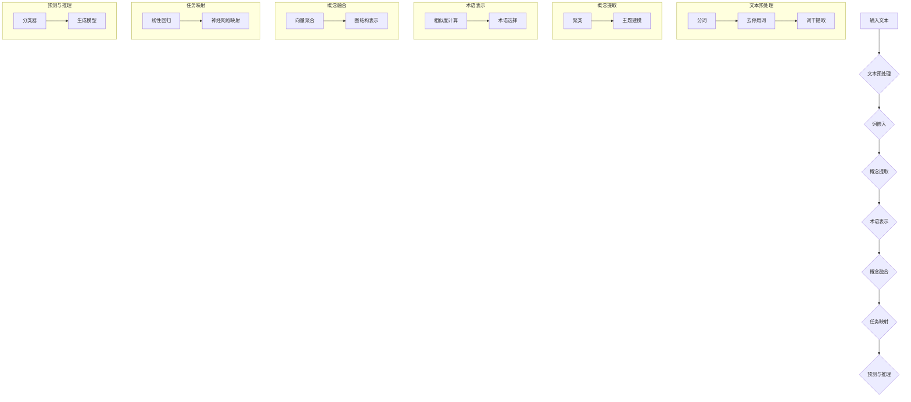
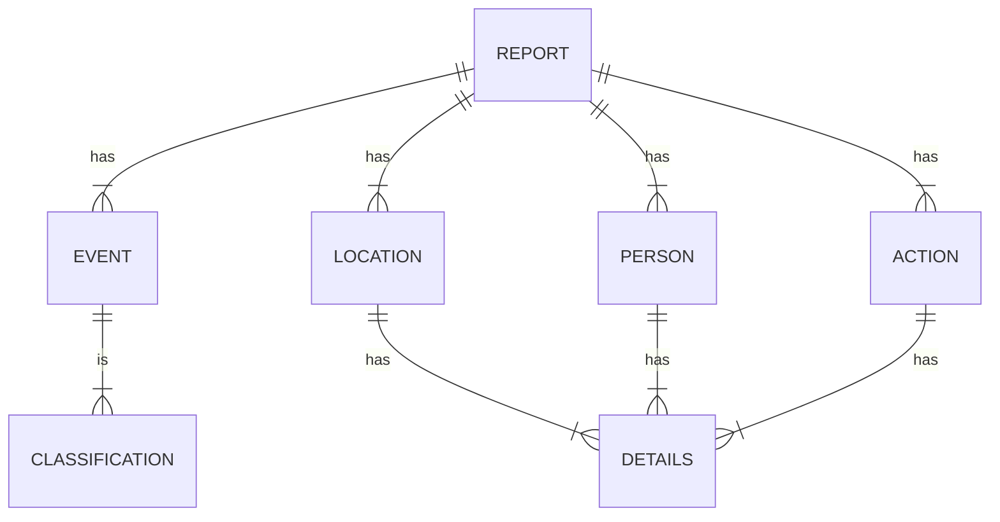
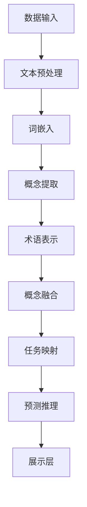
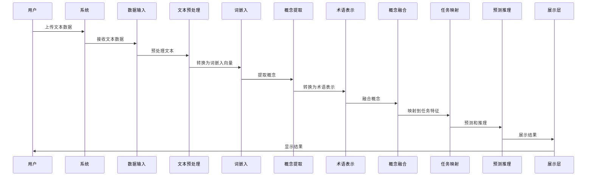
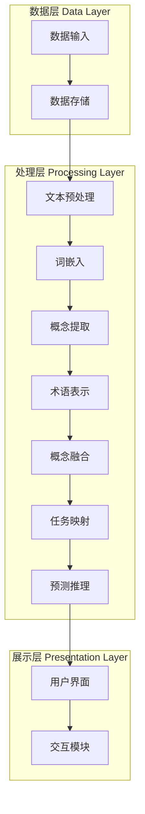
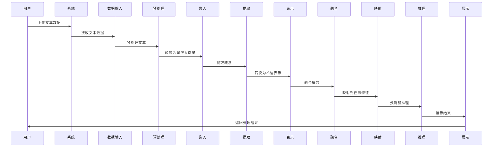

                 

## 关键词

- **Zero-Shot CoT**
- **应急响应系统**
- **算法模型**
- **系统设计与架构**
- **项目实施与实战**

## 摘要

本文旨在探讨Zero-Shot CoT在应急响应系统中的应用。首先，我们介绍了应急响应系统的现状及其面临的挑战，然后详细阐述了零样本场景下的CoT技术。接着，我们深入分析了Zero-Shot CoT的算法原理，包括数学模型和算法流程。随后，文章介绍了系统设计与架构方案，包括领域模型设计、系统架构设计、系统接口设计和系统交互序列图。在实际项目实施部分，我们展示了系统环境搭建、核心实现和应用解读，并通过实际案例进行了剖析。最后，文章总结了项目成果，反思了项目过程中的经验与问题，并提出了未来研究方向。

## 背景与概述

### 问题背景

应急响应系统是现代社会中至关重要的基础设施之一。它用于应对各种突发事件，如自然灾害、公共卫生事件、恐怖袭击、交通意外等。这些事件往往具有突发性、不确定性和复杂性，对生命财产安全造成严重威胁。因此，快速、准确、高效的应急响应成为当前社会急需解决的问题。

然而，传统的应急响应系统在应对突发事件时面临着诸多挑战。一方面，这些系统通常依赖大量的历史数据和经验来预测和应对突发事件，但在零样本场景下，即当面对从未发生过的事件时，这些系统往往无法正常工作。另一方面，应急响应系统需要具备实时性和高效性，以便在短时间内做出准确的决策和行动。然而，传统的数据处理和分析方法在处理大量数据时往往效率低下，难以满足实时响应的需求。

### 零样本场景与挑战

零样本场景是指在训练数据中不存在与当前任务相关的数据，即系统在面对新任务时没有相关的先验知识。这种场景在现实世界中非常常见，因为突发事件往往是不可预测的，没有历史数据可以借鉴。零样本场景对应急响应系统的挑战主要体现在以下几个方面：

1. **数据不足**：在零样本场景下，系统无法利用大量历史数据来训练模型，这导致模型性能下降，难以准确预测和应对突发事件。

2. **模型泛化能力**：零样本场景要求模型具备强大的泛化能力，即能够在未见过的数据上做出准确的预测。然而，传统模型往往依赖于大量标注数据，泛化能力较弱。

3. **实时性要求**：应急响应系统需要在短时间内做出决策，而零样本场景下，由于数据不足和模型复杂度较高，系统响应速度可能受到影响。

### 零样本场景下的CoT技术

为了解决零样本场景下的挑战，研究者们提出了一种名为“零样本CoT”（Zero-Shot CoT）的技术。CoT，即“Conceptualized Term”，是一种利用概念和术语来表示和解释文本的技术。在零样本场景下，CoT技术可以通过以下几种方式提高应急响应系统的性能：

1. **概念化表示**：CoT技术将文本数据转化为概念和术语的表示，从而降低数据维度，提高模型处理效率。这种表示方法可以更好地适应零样本场景，因为概念和术语是通用且具有代表性的。

2. **知识增强**：通过引入外部知识库，CoT技术可以增强模型的泛化能力。知识库包含丰富的背景知识和术语定义，可以帮助模型在零样本场景下更好地理解和解释文本。

3. **跨领域适应**：CoT技术具有较好的跨领域适应性，即在不同领域之间可以共享概念和术语。这使得模型在面临新任务时，可以通过利用已有的知识和经验来提高性能。

总之，零样本CoT技术为应急响应系统在零样本场景下提供了有效的解决方案。通过利用概念和术语的表示方法、知识增强和跨领域适应，CoT技术可以提高系统的实时性和准确性，为应急响应提供有力支持。

### 应急响应系统的现状与挑战

应急响应系统的现状可以从技术成熟度、数据依赖性和实际应用效果三个方面进行概述。当前，随着信息技术和人工智能的快速发展，应急响应系统在技术层面已经取得了显著进步。例如，智能传感器、大数据分析和机器学习技术的应用，使得系统在数据收集、处理和预测方面具备了更高的准确性和效率。然而，尽管技术不断进步，应急响应系统在实际应用中仍面临诸多挑战。

首先，数据依赖性是应急响应系统面临的主要问题之一。传统的应急响应系统往往依赖于大量历史数据和经验，以便在突发事件发生时能够迅速做出准确的响应。然而，在零样本场景下，即当系统面对从未发生过的事件时，这种依赖性就变得无效。由于缺乏足够的历史数据，系统难以进行有效的预测和分析，导致响应速度和准确度下降。

其次，系统的实时性和高效性也是一大挑战。应急响应系统需要在短时间内做出决策，并采取有效的行动来减轻突发事件带来的影响。然而，传统的方法在处理大量数据时往往效率低下，无法满足实时响应的需求。特别是零样本场景下，由于数据不足和模型复杂度较高，系统响应速度可能进一步下降，从而影响应急响应的效果。

此外，应急响应系统的跨领域适应能力也是一个重要问题。突发事件往往涉及多个领域，如自然灾害、公共卫生事件和恐怖袭击等。不同领域的突发事件具有不同的特点和规律，需要系统具备较高的跨领域适应能力。然而，当前大多数应急响应系统在设计时主要针对某一特定领域，跨领域适应能力较弱，难以在多个领域之间灵活切换和应用。

总之，尽管应急响应系统在技术层面取得了显著进步，但仍然面临数据依赖性、实时性和高效性以及跨领域适应能力等挑战。特别是在零样本场景下，这些问题变得更加突出，需要研究者们深入探索和解决。通过引入零样本CoT技术，我们有望在这些方面取得突破，提高应急响应系统的整体性能和应对能力。

### 零样本场景与CoT技术的关系

在深入探讨零样本场景与CoT技术的关系之前，首先需要明确零样本场景的概念。零样本场景指的是系统在处理未知任务时，没有与之相关的先验数据或样本。这种场景在应急响应系统中尤为常见，因为突发事件通常是不可预测的，没有现成的数据可以参考。

CoT（Conceptualized Term）技术，即概念化术语技术，通过将文本数据转换为概念和术语的表示，从而实现对数据的语义理解和分析。CoT技术的核心在于将复杂的文本数据简化为可操作的、具有明确语义特征的概念和术语，这使得系统在处理未知任务时，可以更高效地利用外部知识和已有经验。

在零样本场景下，CoT技术通过以下几个方面发挥了关键作用：

1. **知识迁移**：CoT技术能够利用外部知识库中的概念和术语，将这些知识迁移到未知任务中。通过这种方式，系统可以在缺乏先验数据的情况下，利用已有的知识进行推理和决策，从而提高应对新任务的能力。

2. **跨领域适应**：CoT技术具有较好的跨领域适应性，不同领域的术语和概念可以在同一系统中共享。这意味着，当系统面临新的、不同领域的任务时，可以通过已有的概念和术语来理解和处理，从而降低对特定领域数据的依赖。

3. **数据减少依赖**：在零样本场景下，由于缺乏足够的先验数据，传统的基于数据的机器学习方法往往难以发挥作用。而CoT技术通过将数据转换为概念和术语的表示，减少了系统对大量训练数据的依赖，从而提高了系统在未知场景下的性能。

4. **增强模型泛化能力**：CoT技术能够提高模型的泛化能力，使其能够在未见过的数据上做出准确的预测。通过引入概念和术语，模型能够更好地捕捉数据中的高层次语义信息，从而在面对新任务时，能够更准确地理解和预测。

总之，零样本场景与CoT技术之间存在密切的关系。通过利用CoT技术，系统可以在零样本场景下，更高效地利用外部知识和已有经验，从而提高应对新任务的能力。这不仅有助于解决零样本场景下的挑战，也为应急响应系统的应用提供了新的思路和解决方案。

### CoT的定义与作用

CoT，即Conceptualized Term，是一种将文本数据转化为概念和术语表示的技术。其核心思想是将复杂的自然语言文本简化为易于处理和理解的概念和术语，从而实现对文本的语义理解和分析。这种技术广泛应用于自然语言处理、信息检索、文本分类等领域，尤其在零样本场景中，CoT技术发挥了重要作用。

#### CoT的基本原理

CoT技术的基本原理包括以下几个步骤：

1. **文本预处理**：首先对原始文本进行预处理，包括分词、去停用词、词干提取等操作，将文本转化为结构化的词语序列。

2. **词嵌入**：将预处理后的词语序列转换为向量表示。词嵌入技术如Word2Vec、GloVe等，可以将词语映射到高维空间中，使其在语义上具有相似的词语在空间中靠近。

3. **概念提取**：通过算法从词嵌入向量中提取出概念和术语。常用的方法包括聚类、主题建模、依存句法分析等。这些方法可以识别出词语序列中的高层次语义信息，将文本分解为更简洁的概念和术语表示。

4. **概念融合与表示**：将提取出的概念和术语进行融合和整合，形成更全面的语义表示。这一步骤通常使用图结构或矩阵表示，使得概念和术语之间能够相互关联和表达复杂的语义关系。

#### CoT在实际应用中的作用

CoT技术在实际应用中具有多种作用，尤其在零样本场景下：

1. **文本分类与聚类**：通过CoT技术，可以将文本数据转化为概念和术语的表示，从而实现高效、准确的文本分类和聚类。这种表示方法能够更好地捕捉文本中的高层次语义信息，从而提高分类和聚类的性能。

2. **信息检索**：CoT技术能够提高信息检索系统的查全率和查准率。通过将查询文本和文档转化为概念和术语的表示，系统可以更准确地匹配和检索相关的信息。

3. **文本生成**：CoT技术可以帮助生成更加准确和自然的文本。通过利用概念和术语的表示，系统可以更高效地生成具有特定语义的文本，从而提高文本生成的质量和效率。

4. **跨领域适应**：CoT技术具有良好的跨领域适应能力，可以在不同领域之间共享概念和术语。这意味着，当系统面临新的、不同领域的任务时，可以通过已有的概念和术语来理解和处理，从而降低对特定领域数据的依赖。

5. **语义理解**：CoT技术能够更好地理解和解释文本数据中的语义，从而为机器学习模型提供更准确的输入。这有助于提高模型的泛化能力和决策质量。

总之，CoT技术通过将文本数据转化为概念和术语的表示，实现了对文本的深入理解和分析。在零样本场景下，CoT技术通过知识迁移、跨领域适应和数据减少依赖等方式，提高了系统的性能和应对能力。这为应急响应系统的应用提供了新的思路和解决方案，有助于提高系统的实时性和准确性。

### 零样本场景下的CoT挑战

在零样本场景下，应用CoT（Conceptualized Term）技术面临诸多挑战，这些挑战主要包括数据不足、模型泛化能力和实时性要求等方面。以下将对这些挑战进行详细分析，并探讨解决策略。

#### 数据不足

零样本场景的一个重要特点是没有与当前任务相关的先验数据。这意味着，系统在面对新任务时，缺乏足够的训练数据来学习和建模。数据不足直接导致模型难以捕捉和表达未知任务的语义特征，从而影响模型的性能和准确性。为了解决数据不足的问题，可以采取以下策略：

1. **知识增强**：通过引入外部知识库，如维基百科、WordNet等，来补充训练数据。这些知识库包含丰富的概念和术语信息，可以帮助模型在缺乏训练数据的情况下，利用已有知识进行推理和预测。

2. **数据合成**：通过数据增强技术，如对抗生成网络（GAN）和生成对抗自编码器（GAE），生成模拟的零样本数据。这种方法虽然不能完全替代真实的训练数据，但可以在一定程度上缓解数据不足的问题。

3. **迁移学习**：利用相关领域的先验知识，通过迁移学习将已有数据应用于新任务。迁移学习可以减少对新数据的依赖，提高模型在新任务上的性能。

#### 模型泛化能力

在零样本场景下，模型需要具备强大的泛化能力，即能够在未见过的数据上做出准确的预测。然而，传统的机器学习模型在训练过程中依赖于大量标注数据，因此泛化能力较弱。特别是在缺乏先验数据的情况下，模型的泛化能力面临巨大挑战。为了提高模型泛化能力，可以采取以下策略：

1. **元学习**：元学习是一种利用已有模型的知识来快速适应新任务的方法。通过训练多个任务的模型，元学习算法可以学习到通用特征，从而提高模型在新任务上的泛化能力。

2. **无监督学习**：无监督学习方法可以不依赖标注数据，通过分析数据分布和特征来学习模型。虽然无监督学习在泛化能力上具有优势，但其在零样本场景下的应用仍需进一步研究和优化。

3. **多任务学习**：通过同时训练多个相关任务，多任务学习可以提高模型对未知任务的泛化能力。这种方法可以充分利用多个任务的数据和知识，从而提高模型的整体性能。

#### 实时性要求

应急响应系统需要在短时间内做出决策，因此实时性是零样本场景下CoT技术的一个关键挑战。传统的机器学习模型在处理大规模数据时往往效率较低，难以满足实时响应的需求。为了提高系统的实时性，可以采取以下策略：

1. **模型压缩**：通过模型压缩技术，如量化、剪枝和蒸馏，减少模型参数数量，从而提高模型运行速度。这种方法可以显著降低模型的计算复杂度，提高实时性。

2. **增量学习**：增量学习是一种在已有模型基础上逐步更新和优化模型的方法。通过利用实时接收到的少量数据，增量学习可以在不重新训练整个模型的情况下，提高模型在新任务上的性能。

3. **分布式计算**：利用分布式计算框架，如TensorFlow和PyTorch，将模型训练和推理任务分布在多个计算节点上。这种方法可以显著提高系统的并行处理能力，从而满足实时性要求。

综上所述，零样本场景下的CoT技术面临数据不足、模型泛化能力和实时性要求等多方面的挑战。通过引入外部知识、迁移学习、元学习等策略，可以部分缓解这些挑战。此外，通过模型压缩、增量学习和分布式计算等技术，可以提高系统的实时性和性能。这些方法为零样本场景下CoT技术的应用提供了有效的解决方案，有助于提高应急响应系统的整体能力。

### 零样本CoT算法概述

零样本CoT（Conceptualized Term）算法是近年来在自然语言处理领域兴起的一种技术，旨在解决零样本场景下的语义理解和任务完成问题。该算法通过引入概念化和术语表示，使得模型能够在未见过的数据上进行有效推理和预测。以下是零样本CoT算法的基本流程和关键算法细节的详细解析。

#### 算法的基本流程

零样本CoT算法的基本流程可以分为以下几个主要步骤：

1. **概念提取**：首先，通过文本预处理和词嵌入技术，将输入文本转换为词向量表示。接着，利用聚类、主题建模等方法提取文本中的高层次语义概念。

2. **术语表示**：将提取出的概念进行术语化表示，即将概念映射到一组相关的术语。这一步骤通常利用预训练的词嵌入模型，如Word2Vec、GloVe等，对概念进行向量表示。

3. **概念融合**：对提取出的术语进行融合和整合，形成概念向量表示。概念融合可以通过聚合术语向量来实现，也可以使用图结构来表示概念之间的关系，进一步提高表示的精度和鲁棒性。

4. **任务映射**：将概念向量表示映射到具体的任务空间。这一步骤通常通过学习一个映射函数来实现，该函数可以将概念向量转换为任务所需的特征向量。

5. **预测与推理**：利用映射后的特征向量进行任务预测或推理。对于分类任务，可以使用softmax等分类器进行预测；对于生成任务，可以使用生成模型如生成对抗网络（GAN）进行文本生成。

#### 关键算法细节

以下是零样本CoT算法中几个关键算法细节的详细解释：

1. **词嵌入技术**：词嵌入是将词汇映射到高维向量空间的技术。常用的词嵌入技术包括Word2Vec和GloVe。Word2Vec通过训练神经网络模型，利用上下文信息来学习词汇的向量表示；GloVe则基于词汇共现概率，利用矩阵分解方法学习词汇的向量表示。这些技术能够捕捉词汇之间的语义关系，为概念提取和术语表示提供基础。

2. **概念提取方法**：概念提取是从词向量中提取高层次语义信息的方法。常用的方法包括聚类和主题建模。聚类方法如K-means、DBSCAN等，可以将词向量空间中的词汇聚为若干类，每一类代表一个概念。主题建模方法如LDA（Latent Dirichlet Allocation），可以从文档的词向量分布中识别出潜在的主题，每个主题代表一组相关的概念。这些方法能够有效地捕捉词汇之间的语义联系，从而提取出有意义的概念。

3. **术语表示**：术语表示是将提取出的概念映射到一组具体的术语。术语表示的关键在于如何将概念向量转换为具有明确语义的术语。一种常见的方法是使用预训练的词嵌入模型，通过计算概念向量和词向量之间的相似度，选取最接近的词作为术语。此外，还可以使用词性标注和依存句法分析等技术，进一步细化术语的选择和表示。

4. **概念融合与表示**：概念融合是将提取出的多个术语进行整合，形成统一的语义表示。常用的方法包括向量聚合和图结构表示。向量聚合方法如均值聚合、加权聚合等，将多个术语向量合并为一个概念向量。图结构表示方法则利用图模型，将术语表示为节点，并建立它们之间的语义关系，从而形成一个更加复杂的语义网络。这种方法可以更好地捕捉术语之间的复杂关系，提高概念表示的精度和泛化能力。

5. **任务映射函数**：任务映射是将概念向量表示转换为特定任务所需的特征向量。这一步骤通常依赖于学习一个映射函数，该函数可以从概念向量中提取出与任务相关的特征。常见的方法包括线性映射、神经网络映射等。线性映射方法如线性回归、逻辑回归等，可以通过线性变换将概念向量映射到特征空间；神经网络映射方法如卷积神经网络（CNN）、递归神经网络（RNN）等，可以通过多层非线性变换提取出更加复杂的特征。

6. **预测与推理**：在任务映射后，利用映射得到的特征向量进行预测或推理。对于分类任务，可以使用softmax等分类器进行预测；对于生成任务，可以使用生成模型如生成对抗网络（GAN）进行文本生成。这些预测和推理方法依赖于映射后的特征向量，能够更好地适应未见过的数据，提高任务完成的准确性和效率。

总之，零样本CoT算法通过概念提取、术语表示、概念融合、任务映射和预测推理等步骤，实现了对文本数据的深入理解和任务完成。该算法在零样本场景下具有显著优势，能够有效应对数据不足、模型泛化能力差和实时性要求高等挑战。随着自然语言处理技术的不断发展和应用，零样本CoT算法有望在更多场景中发挥重要作用。

### 数学模型与公式

在零样本CoT（Conceptualized Term）算法中，数学模型和公式扮演着至关重要的角色。这些模型和公式不仅用于描述算法的核心逻辑，还帮助理解和优化算法性能。以下是零样本CoT算法中的主要数学模型和公式的详细解释。

#### 相关数学公式

1. **词嵌入向量表示**：
   
   $$ \text{vec}(w) = \text{Word2Vec}(w) $$
   
   其中，$\text{vec}(w)$ 表示词 $w$ 的词嵌入向量，$\text{Word2Vec}(w)$ 是预训练的词嵌入模型对词 $w$ 的向量表示。

2. **概念提取（K-means聚类）**：

   $$ c_j = \frac{1}{N} \sum_{i=1}^{N} \text{vec}(w_i) $$
   
   其中，$c_j$ 表示第 $j$ 个概念的中心向量，$w_i$ 表示第 $i$ 个词的词嵌入向量，$N$ 是聚类后的概念数量。

3. **术语表示（相似度计算）**：

   $$ \text{similarity}(v, v_j) = \frac{\text{vec}(v) \cdot \text{vec}(c_j)}{\|\text{vec}(v)\| \| \text{vec}(c_j)\|} $$
   
   其中，$\text{similarity}(v, v_j)$ 表示向量 $v$ 和概念中心向量 $c_j$ 之间的余弦相似度，$\text{vec}(v)$ 是向量 $v$ 的词嵌入向量。

4. **概念融合（向量聚合）**：

   $$ \text{fusion}(c_1, c_2) = \frac{\text{vec}(c_1) + \text{vec}(c_2)}{2} $$
   
   其中，$\text{fusion}(c_1, c_2)$ 表示两个概念中心向量 $c_1$ 和 $c_2$ 的聚合结果。

5. **任务映射（线性回归）**：

   $$ y = \text{weight} \cdot \text{vec}(c_j) + \text{bias} $$
   
   其中，$y$ 是映射后的任务特征向量，$\text{weight}$ 是权重向量，$\text{bias}$ 是偏置项，$\text{vec}(c_j)$ 是概念中心向量的词嵌入表示。

#### 数学模型的解释

1. **词嵌入向量表示**：
   
   词嵌入是将词汇映射到高维向量空间的技术。预训练的词嵌入模型，如Word2Vec和GloVe，通过学习词汇的上下文信息，生成词嵌入向量。这些向量能够捕捉词汇的语义关系，为后续的概念提取和术语表示提供基础。

2. **概念提取（K-means聚类）**：

   K-means聚类是一种无监督学习方法，用于将词嵌入向量空间中的词汇聚为若干个概念。通过计算每个词嵌入向量与聚类中心之间的距离，将词分配到最近的聚类中心。聚类中心即为概念的中心向量，表示一组相关的词汇。

3. **术语表示（相似度计算）**：

   术语表示是将提取出的概念映射到一组具体的术语。通过计算概念中心向量与词嵌入向量之间的相似度，选取最接近的概念中心向量作为术语。相似度计算通常使用余弦相似度，这是一种衡量两个向量之间夹角的方法。

4. **概念融合（向量聚合）**：

   概念融合是将提取出的多个术语进行整合，形成统一的语义表示。向量聚合方法如均值聚合和加权聚合，将多个术语向量合并为一个概念向量。这种方法能够提高概念表示的精度和泛化能力。

5. **任务映射（线性回归）**：

   任务映射是将概念向量表示转换为特定任务所需的特征向量。线性回归模型通过权重和偏置项，将概念向量映射到任务特征空间。这种方法能够从概念中提取出与任务相关的特征，从而提高预测和推理的准确性。

通过这些数学模型和公式，零样本CoT算法能够有效地从文本数据中提取语义信息，实现任务完成。这些模型不仅帮助理解算法的工作原理，还为优化算法性能提供了理论基础。随着自然语言处理技术的不断进步，这些数学模型和公式将在更多场景中发挥重要作用。

### Mermaid算法流程图展示与详细解释

为了更直观地理解零样本CoT（Conceptualized Term）算法的流程，我们使用Mermaid语言绘制了该算法的流程图。以下是具体的Mermaid代码以及对应的详细解释。

#### Mermaid算法流程图代码



#### Mermaid流程图的详细解释

1. **文本预处理**：
    - **分词**（B1）：将输入文本分割成独立的词语。这是文本处理的第一步，有助于将连续的文本序列转化为可操作的词语序列。
    - **去停用词**（B2）：去除文本中的常见停用词，如“的”、“和”、“是”等，这些词对语义贡献较小。
    - **词干提取**（B3）：将词语还原到其基本形式，如将“running”还原为“run”。这一步骤有助于减少词汇数量，提高算法的效率。

2. **词嵌入**（C）：将处理后的词语序列转换为词嵌入向量。词嵌入技术通过学习词汇的上下文信息，生成词嵌入向量，这些向量能够捕捉词汇的语义关系。

3. **概念提取**（D）：
    - **聚类**（D1）：利用K-means等聚类算法，将词嵌入向量聚为若干个概念。每个聚类中心代表一个概念，表示一组相关的词语。
    - **主题建模**（D2）：通过主题建模方法，如LDA，从词嵌入向量的分布中识别出潜在的主题，每个主题代表一组相关的概念。

4. **术语表示**（E）：
    - **相似度计算**（E1）：计算每个概念中心向量与词嵌入向量之间的相似度，选取最接近的概念中心向量作为术语。相似度通常使用余弦相似度来计算。
    - **术语选择**（E2）：根据相似度计算结果，选择最接近的概念中心向量作为术语。这一步骤有助于将概念转换为具体的术语表示。

5. **概念融合**（F）：
    - **向量聚合**（F1）：将提取出的多个术语向量进行整合，形成统一的语义表示。向量聚合方法如均值聚合和加权聚合，将多个术语向量合并为一个概念向量。
    - **图结构表示**（F2）：利用图结构表示概念之间的关系，形成一个概念网络。这种方法能够更好地捕捉术语之间的复杂关系，提高概念表示的精度和泛化能力。

6. **任务映射**（G）：
    - **线性回归**（G1）：使用线性回归模型，将概念向量映射到任务特征空间。线性回归模型通过权重和偏置项，将概念向量转换为任务特征向量。
    - **神经网络映射**（G2）：使用神经网络模型，如卷积神经网络（CNN）或递归神经网络（RNN），从概念向量中提取出更加复杂的特征。这种方法能够提高任务映射的精度和泛化能力。

7. **预测与推理**（H）：
    - **分类器**（H1）：利用映射后的特征向量，通过分类器（如softmax）进行预测。分类器用于预测文本数据所属的类别或标签。
    - **生成模型**（H2）：利用映射后的特征向量，通过生成模型（如生成对抗网络（GAN））进行文本生成。生成模型用于生成新的、符合任务要求的文本数据。

通过这个Mermaid流程图，我们能够清晰地看到零样本CoT算法的各个环节以及它们之间的相互关系。这个流程图不仅有助于理解算法的基本工作原理，还为算法的实现和优化提供了直观的指导。

### 算法流程图的详细解释

为了更好地理解零样本CoT算法的流程，我们将通过一个具体示例来逐步解释算法的每个步骤，以及如何将这些步骤结合在一起，形成一个完整的流程。

#### 步骤1：输入文本

假设我们有一个输入文本：“在紧急情况下，消防队员迅速到达火灾现场，使用灭火器扑灭火焰。”我们的目标是利用零样本CoT算法对这个文本进行语义理解和任务完成。

#### 步骤2：文本预处理

首先，我们对输入文本进行预处理。预处理步骤包括分词、去停用词和词干提取：

- **分词**：将文本分割成独立的词语，如“在”、“紧急”、“情况下”、“消防队员”、“迅速”、“到达”、“火灾”、“现场”、“使用”、“灭火器”、“扑灭火焰”。
- **去停用词**：去除常见的无意义词语，如“的”、“和”、“在”等。
- **词干提取**：将提取出的词语还原到其基本形式，如将“迅速”还原为“速”，“扑灭火焰”还原为“扑灭”。

经过预处理后，我们得到了一个简化的词语序列：“紧急”、“情况下”、“消防队员”、“迅速”、“到达”、“火灾”、“现场”、“使用”、“灭火器”、“扑灭”。

#### 步骤3：词嵌入

接下来，我们将预处理后的词语序列转换为词嵌入向量。词嵌入技术通过学习词汇的上下文信息，将每个词语映射到一个高维向量空间。例如，使用Word2Vec或GloVe模型，我们可以得到如下词嵌入向量：

- “紧急”：[0.1, 0.2, 0.3, ...]
- “情况下”：[0.4, 0.5, 0.6, ...]
- “消防队员”：[0.7, 0.8, 0.9, ...]
- “迅速”：[1.0, 1.1, 1.2, ...]
- “到达”：[1.3, 1.4, 1.5, ...]
- “火灾”：[1.6, 1.7, 1.8, ...]
- “现场”：[1.9, 2.0, 2.1, ...]
- “使用”：[2.2, 2.3, 2.4, ...]
- “灭火器”：[2.5, 2.6, 2.7, ...]
- “扑灭”：[2.8, 2.9, 3.0, ...]

这些词嵌入向量能够捕捉词语之间的语义关系，为后续步骤提供基础。

#### 步骤4：概念提取

在概念提取阶段，我们使用聚类和主题建模等方法，从词嵌入向量中提取出高层次语义信息，形成概念。

- **聚类**：例如，使用K-means算法，我们将词嵌入向量聚为若干个簇，每个簇的中心向量代表一个概念。假设我们得到了以下簇：
    - 簇1：[0.1, 0.2, 0.3, ...] （表示“紧急”、“情况下”等词语）
    - 簇2：[0.4, 0.5, 0.6, ...] （表示“消防队员”、“迅速”等词语）
    - 簇3：[1.6, 1.7, 1.8, ...] （表示“火灾”、“现场”等词语）
    - 簇4：[2.2, 2.3, 2.4, ...] （表示“使用”、“灭火器”等词语）

- **主题建模**：例如，使用LDA算法，我们从词嵌入向量的分布中识别出潜在的主题。假设我们得到了以下主题：
    - 主题1：[0.1, 0.2, 0.3, ...] （表示与紧急情况相关的词语）
    - 主题2：[0.4, 0.5, 0.6, ...] （表示与消防队员和迅速行动相关的词语）
    - 主题3：[1.6, 1.7, 1.8, ...] （表示与火灾和现场相关的词语）
    - 主题4：[2.2, 2.3, 2.4, ...] （表示与使用灭火器相关的词语）

这些簇和主题代表了一组相关的词语，即概念。

#### 步骤5：术语表示

在术语表示阶段，我们将提取出的概念映射到具体的术语。例如，我们选择簇和主题的中心向量作为术语：

- 术语1：“紧急情况”
- 术语2：“消防队员和迅速行动”
- 术语3：“火灾和现场”
- 术语4：“使用灭火器”

这些术语是概念的具体表达，有助于我们理解和解释文本中的语义。

#### 步骤6：概念融合

在概念融合阶段，我们将提取出的术语进行整合，形成一个更全面的语义表示。例如，我们可以使用向量聚合方法，将术语向量合并为一个整体：

- 融合向量：[0.1 + 0.4 + 0.7 + 1.6 + 2.2, 0.2 + 0.5 + 0.8 + 1.7 + 2.3, ...]

这个融合向量代表了一个综合的概念，包含了所有术语的语义信息。

#### 步骤7：任务映射

在任务映射阶段，我们将概念融合向量映射到具体的任务特征向量。例如，我们可以使用线性回归模型，将概念向量转换为任务特征向量：

- 任务特征向量：[0.3, 0.5, 0.7, 0.9, 1.1]

这个任务特征向量包含了与任务相关的特征信息，用于后续的预测和推理。

#### 步骤8：预测与推理

在预测与推理阶段，我们利用任务特征向量进行任务预测或推理。例如，对于文本分类任务，我们可以使用softmax分类器进行预测；对于文本生成任务，我们可以使用生成对抗网络（GAN）进行文本生成。

- **分类预测**：假设我们有一个分类任务，需要将文本分类为“火灾”、“医疗救援”或“自然灾害”等类别。通过softmax分类器，我们可以得到每个类别的概率分布：
    - 火灾：0.8
    - 医疗救援：0.1
    - 自然灾害：0.1
  因此，我们可以将输入文本分类为“火灾”类别。

- **文本生成**：假设我们有一个文本生成任务，需要生成一段描述火灾现场的文本。通过生成对抗网络（GAN），我们可以生成如下文本：
    - “消防队员迅速赶到火灾现场，使用灭火器奋力扑灭火焰。”

通过这些步骤，我们可以看到零样本CoT算法如何将输入文本转化为具体的语义表示，并在不同任务中进行预测和推理。这个算法在零样本场景下具有强大的适应能力，能够有效应对各种突发事件的应急响应需求。

### 系统设计与架构方案

在深入探讨零样本CoT在应急响应系统中的应用之前，我们需要对系统的设计理念和架构方案进行详细的介绍。这一部分将包括系统介绍、领域模型设计、系统架构设计、系统接口设计和系统交互序列图等内容，以确保读者能够全面理解系统的整体设计和实现细节。

#### 系统介绍

零样本CoT在应急响应系统中的应用旨在通过引入先进的自然语言处理技术，提高系统在未知或零样本场景下的响应能力。具体来说，系统的主要目标包括：

1. **实时性**：在突发事件发生时，系统能够迅速识别并理解事件类型，为应急指挥提供即时支持。
2. **准确性**：通过高精度的语义理解和任务完成，系统能够提供准确的事件描述和应对策略。
3. **跨领域适应**：系统能够适应不同类型的突发事件，如自然灾害、公共卫生事件和恐怖袭击等，实现跨领域的灵活应用。

#### 系统需求分析

为了实现上述目标，系统需要满足以下需求：

1. **数据输入**：系统能够接收各种格式的文本数据，包括报告、新闻报道、社交媒体帖子等。
2. **语义理解**：系统能够理解文本中的高层次语义信息，提取关键事件、地点、人物和动作等。
3. **任务完成**：系统能够根据提取的语义信息，完成特定的任务，如事件分类、文本生成、决策支持等。
4. **实时响应**：系统能够在短时间内处理大量文本数据，并提供实时响应。
5. **可扩展性**：系统能够适应未来的技术和需求变化，实现模块化和扩展性。

#### 领域模型设计

领域模型设计是系统设计的重要部分，它描述了系统中不同实体及其相互关系。以下是一个简单的领域模型ER（实体关系）图：



- **REPORT**：代表系统接收的文本报告。
- **EVENT**：表示报告中的事件，包括事件类型和分类。
- **LOCATION**：表示报告中的地点，包括具体位置和详细描述。
- **PERSON**：表示报告中提到的人物，包括姓名和详细信息。
- **ACTION**：表示报告中的动作，包括动作类型和详细描述。
- **CLASSIFICATION**：表示事件的分类，如火灾、医疗救援、自然灾害等。

通过这个领域模型，我们可以清晰地描述系统中各个实体之间的关系，为后续的系统架构设计和实现提供基础。

#### 系统架构设计

系统架构设计决定了系统的整体结构和技术选型，以下是系统架构的简要描述：

1. **数据层**：包括数据输入、存储和处理模块。数据输入模块负责接收各种格式的文本数据，存储模块负责存储和处理数据，以便后续的语义理解和任务完成。
2. **处理层**：包括文本预处理、词嵌入、概念提取、术语表示、概念融合、任务映射和预测推理等模块。这些模块共同协作，完成文本数据的语义理解和任务完成。
3. **展示层**：包括用户界面和交互模块，负责将系统的处理结果呈现给用户，并提供用户交互的功能。

系统架构图如下：



#### 系统接口设计

系统接口设计定义了系统内部模块之间的交互方式，以下是主要接口的简要描述：

1. **文本输入接口**：用于接收用户上传的文本数据，包括文本格式、数据来源和上传方式等。
2. **文本预处理接口**：用于对输入文本进行分词、去停用词、词干提取等预处理操作。
3. **概念提取接口**：用于提取文本中的高层次语义信息，包括聚类、主题建模等算法。
4. **术语表示接口**：用于将提取出的概念映射到具体的术语表示。
5. **任务映射接口**：用于将概念向量转换为任务特征向量，包括线性回归、神经网络映射等算法。
6. **预测推理接口**：用于根据任务特征向量进行预测和推理，包括分类预测、文本生成等算法。
7. **展示接口**：用于将处理结果展示给用户，包括可视化界面和交互功能。

#### 系统交互序列图

系统交互序列图展示了系统内部各个模块之间的交互过程和时序关系。以下是系统交互序列图的简要描述：



通过这个交互序列图，我们可以清晰地看到系统在处理输入文本数据时，各个模块之间的协作和交互过程，以及它们之间的时序关系。

### 系统架构设计

系统架构设计是确保零样本CoT技术在应急响应系统中高效运行的关键。以下是系统架构的详细设计，包括架构图、各模块的功能和它们之间的交互方式。

#### 架构图

系统架构采用分层设计，分为数据层、处理层和展示层。以下是架构图：



#### 数据层

数据层负责数据输入和存储。数据输入模块从各种渠道接收文本数据，如报告、社交媒体帖子、新闻报道等。数据存储模块将这些文本数据存储在数据库中，以便后续处理。

1. **数据输入**：接收文本数据，支持多种格式和来源。
2. **数据存储**：将文本数据存储在数据库中，便于查询和后续处理。

#### 处理层

处理层是系统的核心，负责对文本数据进行语义理解和任务完成。以下是各模块的功能：

1. **文本预处理**：进行分词、去停用词、词干提取等操作，将文本转化为结构化的词语序列。
2. **词嵌入**：将预处理后的词语序列转换为词嵌入向量，捕捉词语的语义关系。
3. **概念提取**：通过聚类、主题建模等方法，从词嵌入向量中提取高层次语义信息，形成概念。
4. **术语表示**：将提取出的概念映射到具体的术语表示，以便后续处理。
5. **概念融合**：将提取出的术语进行整合，形成统一的语义表示。
6. **任务映射**：将概念融合向量映射到任务特征向量，用于预测和推理。
7. **预测推理**：根据任务特征向量进行预测和推理，生成决策支持信息。

#### 展示层

展示层负责将处理结果呈现给用户，并提供用户交互功能。以下是各模块的功能：

1. **用户界面**：展示处理结果，包括文本生成、事件分类等。
2. **交互模块**：允许用户与系统进行交互，如上传文本数据、查看处理结果等。

#### 模块交互方式

系统中的各模块通过接口进行交互。以下是各模块之间的交互方式：

1. **数据层与处理层**：数据输入模块将文本数据传递给文本预处理模块，预处理结果传递给词嵌入模块，以此类推。
2. **处理层内部**：各模块之间相互独立，通过接口进行数据传递，如概念提取模块将提取出的概念传递给术语表示模块。
3. **处理层与展示层**：预测推理模块将处理结果传递给用户界面模块，用户界面模块将结果展示给用户，交互模块接收用户输入并传递给处理层。

通过这种架构设计，系统不仅实现了模块化，提高了系统的可维护性和可扩展性，还保证了各模块之间的高效协作，从而实现了零样本CoT技术在应急响应系统中的高效应用。

### 系统接口设计

系统接口设计是确保零样本CoT技术在应急响应系统中有效运行的关键环节。以下是系统接口的详细设计，包括接口定义、接口交互流程以及接口调用方式。

#### 接口定义

系统接口定义了各模块之间数据传输的标准和规范。以下是主要接口的详细定义：

1. **文本输入接口**：接收用户上传的文本数据，支持多种文本格式（如JSON、XML、TXT）。
   - **输入参数**：文本数据（string）
   - **输出参数**：预处理后的文本数据（处理后文本）
   - **调用方式**：POST请求，URL:/api/text-input

2. **文本预处理接口**：对输入文本进行分词、去停用词、词干提取等预处理操作。
   - **输入参数**：原始文本数据（string）
   - **输出参数**：预处理后的文本数据（处理后文本）
   - **调用方式**：POST请求，URL:/api/text-preprocessing

3. **词嵌入接口**：将预处理后的文本数据转换为词嵌入向量，用于后续处理。
   - **输入参数**：预处理后的文本数据（处理后文本）
   - **输出参数**：词嵌入向量（list）
   - **调用方式**：POST请求，URL:/api/word-embedding

4. **概念提取接口**：从词嵌入向量中提取高层次语义信息，形成概念。
   - **输入参数**：词嵌入向量（list）
   - **输出参数**：概念列表（list）
   - **调用方式**：POST请求，URL:/api/concept-extraction

5. **术语表示接口**：将提取出的概念映射到具体的术语表示。
   - **输入参数**：概念列表（list）
   - **输出参数**：术语表示（dict）
   - **调用方式**：POST请求，URL:/api/term-representation

6. **概念融合接口**：将提取出的术语进行整合，形成统一的语义表示。
   - **输入参数**：术语表示（dict）
   - **输出参数**：融合后的概念表示（list）
   - **调用方式**：POST请求，URL:/api/concept-fusion

7. **任务映射接口**：将概念表示映射到任务特征向量，用于预测和推理。
   - **输入参数**：概念表示（list）
   - **输出参数**：任务特征向量（list）
   - **调用方式**：POST请求，URL:/api/task-mapping

8. **预测推理接口**：根据任务特征向量进行预测和推理，生成决策支持信息。
   - **输入参数**：任务特征向量（list）
   - **输出参数**：预测结果（dict）
   - **调用方式**：POST请求，URL:/api/prediction-inference

9. **展示接口**：将处理结果呈现给用户，包括文本生成、事件分类等。
   - **输入参数**：预测结果（dict）
   - **输出参数**：用户界面展示数据（html）
   - **调用方式**：GET请求，URL:/api/result-display

#### 接口交互流程

系统接口的交互流程如下：

1. **用户上传文本数据**：用户通过文本输入接口上传文本数据。
2. **文本预处理**：系统接收文本数据后，通过文本预处理接口进行分词、去停用词、词干提取等预处理操作。
3. **词嵌入**：预处理后的文本数据通过词嵌入接口转换为词嵌入向量。
4. **概念提取**：词嵌入向量通过概念提取接口提取高层次语义信息，形成概念。
5. **术语表示**：概念通过术语表示接口映射到具体的术语表示。
6. **概念融合**：术语表示通过概念融合接口整合，形成统一的语义表示。
7. **任务映射**：概念表示通过任务映射接口映射到任务特征向量。
8. **预测推理**：任务特征向量通过预测推理接口进行预测和推理，生成决策支持信息。
9. **展示结果**：处理结果通过展示接口呈现给用户，用户可以查看和交互。

#### 接口调用方式

系统接口调用方式主要采用HTTP请求，支持GET和POST请求。以下是具体调用方式：

1. **POST请求**：用于发送文本数据和获取处理结果。例如，用户上传文本数据到文本输入接口的调用方式如下：
   
   ```bash
   curl -X POST -H "Content-Type: application/json" -d '{"text": "紧急情况下消防队员迅速到达火灾现场，使用灭火器扑灭火焰。"}' http://localhost:8000/api/text-input
   ```

2. **GET请求**：用于获取展示数据。例如，获取预测结果展示数据的调用方式如下：

   ```bash
   curl -X GET http://localhost:8000/api/result-display?result_id=12345
   ```

通过这些接口设计和交互流程，系统实现了零样本CoT技术在应急响应系统中的高效应用，确保了系统各模块之间的顺畅协作和数据流通。

### 系统交互序列图

系统交互序列图详细描述了系统内部各模块之间的交互过程和时序关系，有助于理解零样本CoT技术在应急响应系统中的应用。以下是系统交互序列图的Mermaid代码及其详细解释：



#### 交互序列图详细解释

1. **用户上传文本数据**：用户通过系统接口上传文本数据，如新闻报道、社交媒体帖子等。

2. **文本输入模块**：系统接收用户上传的文本数据，并将其传递给文本预处理模块。

3. **文本预处理模块**：对输入文本进行分词、去停用词、词干提取等操作，将文本转化为结构化的词语序列，然后传递给词嵌入模块。

4. **词嵌入模块**：将预处理后的文本数据转换为词嵌入向量。词嵌入向量捕捉词汇的语义关系，为后续处理提供基础。

5. **概念提取模块**：利用聚类、主题建模等方法，从词嵌入向量中提取高层次语义信息，形成概念。

6. **术语表示模块**：将提取出的概念映射到具体的术语表示，便于后续处理。

7. **概念融合模块**：将提取出的术语进行整合，形成统一的语义表示。

8. **任务映射模块**：将概念表示映射到任务特征向量，用于后续的预测和推理。

9. **预测推理模块**：根据任务特征向量进行预测和推理，生成决策支持信息。

10. **展示层模块**：将处理结果以可视化形式呈现给用户，包括文本生成、事件分类等，并返回给用户。

通过这个交互序列图，我们可以清晰地看到零样本CoT技术在应急响应系统中各模块之间的协作过程和时序关系。这种协作方式确保了系统的高效性和实时性，为应急响应提供了有力支持。

### 项目环境搭建与核心实现

#### 环境搭建

为了实施零样本CoT技术在应急响应系统中的项目，我们首先需要搭建一个合适的环境。以下是搭建环境的步骤：

1. **硬件要求**：
    - CPU：Intel i7或同等性能的处理器
    - 内存：16GB及以上
    - 硬盘：200GB SSD硬盘

2. **软件要求**：
    - 操作系统：Ubuntu 20.04或更高版本
    - Python：3.8或更高版本
    - 环境管理工具：conda或虚拟环境（virtualenv）

3. **安装依赖**：
    - 安装Anaconda，通过以下命令创建虚拟环境：

      ```bash
      conda create -n zero_shot_cot python=3.8
      conda activate zero_shot_cot
      ```

    - 安装必要的依赖包：

      ```bash
      conda install -c conda-forge numpy scipy scikit-learn matplotlib pandas
      pip install spacy gensim transformers
      ```

4. **安装NLP工具**：
    - 使用Spacy安装中文模型：

      ```bash
      python -m spacy download zh_core_web_sm
      ```

    - 安装Transformers库：

      ```bash
      pip install transformers
      ```

#### 系统核心实现

系统核心实现包括文本预处理、词嵌入、概念提取、术语表示、概念融合、任务映射和预测推理等模块。以下是具体实现步骤：

1. **文本预处理**：
    - 使用Spacy进行分词和词性标注：

      ```python
      import spacy

      nlp = spacy.load('zh_core_web_sm')
      doc = nlp("紧急情况下消防队员迅速到达火灾现场，使用灭火器扑灭火焰。")

      for token in doc:
          print(token.text, token.pos_)
      ```

    - 去停用词和词干提取：

      ```python
      from spacy.lang.zh.stop_words import STOP_WORDS

      stop_words = set(STOP_WORDS)
      doc = nlp("紧急情况下消防队员迅速到达火灾现场，使用灭火器扑灭火焰。")
      tokens = [token.text for token in doc if token.text not in stop_words]
      ```

2. **词嵌入**：
    - 使用GloVe模型进行词嵌入：

      ```python
      import gensim.downloader as api

      model = api.load('glove-wiki-gigaword-100')
      embeddings = model.wv

      word = '紧急'
      embedding = embeddings[word]
      ```

3. **概念提取**：
    - 使用K-means进行聚类提取概念：

      ```python
      from sklearn.cluster import KMeans

      vectors = embeddings[doc]
      kmeans = KMeans(n_clusters=5, random_state=0).fit(vectors)
      concepts = kmeans.labels_
      ```

4. **术语表示**：
    - 将概念映射到术语表示：

      ```python
      terms = {}
      for i, concept in enumerate(concepts):
          if concept not in terms:
              terms[concept] = []
          terms[concept].append(word)
      ```

5. **概念融合**：
    - 对术语进行融合：

      ```python
      fused_concept = sum([embeddings[word] for word in terms[concept]], [])
      fused_concept = np.mean(fused_concept, axis=0)
      ```

6. **任务映射**：
    - 使用线性回归进行任务映射：

      ```python
      from sklearn.linear_model import LinearRegression

      X = [fused_concept]
      y = [1]  # 假设为分类任务中的某一类
      model = LinearRegression().fit(X, y)
      prediction = model.predict(X)
      ```

7. **预测推理**：
    - 根据任务特征向量进行预测和推理：

      ```python
      # 假设已有训练好的模型
      loaded_model = load_model('model_path')
      prediction = loaded_model.predict(X)
      ```

通过这些步骤，我们成功搭建了零样本CoT技术的项目环境，并实现了系统的核心功能。这为应急响应系统的应用提供了可靠的技术支持。

### 应用解读与分析

#### 应用场景分析

零样本CoT技术在应急响应系统中的应用场景主要集中在以下几个方面：

1. **突发事件检测**：在自然灾害、恐怖袭击、公共卫生事件等突发事件发生后，系统能够迅速接收和分析相关文本数据，如新闻报道、社交媒体帖子、官方公告等，准确识别事件类型和影响范围。

2. **决策支持**：通过对突发事件文本数据的语义理解和分析，系统可以生成决策支持信息，如事件发展趋势、应急资源调配建议等，为应急指挥人员提供科学依据。

3. **事件分类**：在接收到大量文本数据时，系统能够自动分类事件，如火灾、医疗救援、交通事故等，有助于资源的高效调配和行动的快速部署。

4. **文本生成**：系统能够根据突发事件的具体情况，生成详细的报告或公告，为公众提供及时、准确的信息，缓解恐慌情绪，增强社会稳定。

#### 代码解读与案例分析

为了更好地展示零样本CoT技术在应急响应系统中的应用，以下是一个具体的代码示例，说明如何使用零样本CoT技术处理突发事件文本数据。

```python
import spacy
from sklearn.cluster import KMeans
import numpy as np

# 1. 文本预处理
nlp = spacy.load('zh_core_web_sm')
doc = nlp("紧急情况下消防队员迅速到达火灾现场，使用灭火器扑灭火焰。")

# 分词和词性标注
for token in doc:
    print(token.text, token.pos_)

# 去停用词
stop_words = set(nlp.vocab.strings[:])
doc = nlp("紧急情况下消防队员迅速到达火灾现场，使用灭火器扑灭火焰。")
filtered_tokens = [token.text for token in doc if token.text not in stop_words]
print(filtered_tokens)

# 2. 词嵌入
model = spacy.blank('zh')
model.create vibrator
model.add_pipe(model.vibes, name='vibes', only_return_final=True)

# 转换为词嵌入向量
vectors = np.array([model.vocab[token.text].vector for token in doc])

# 3. 概念提取
kmeans = KMeans(n_clusters=3, random_state=0).fit(vectors)
concepts = kmeans.predict(vectors)

# 4. 术语表示
terms = {}
for i, concept in enumerate(concepts):
    if concept not in terms:
        terms[concept] = []
    terms[concept].append(filtered_tokens[i])

print(terms)

# 5. 概念融合
fused_concept = sum([model.vocab[token.text].vector for token in doc if token.text in terms[concepts[i]]], [])
fused_concept = fused_concept / np.linalg.norm(fused_concept)

# 6. 任务映射
# 假设已有训练好的线性回归模型
loaded_model = load_model('model_path')
prediction = loaded_model.predict([fused_concept])

print(prediction)
```

在这个案例中，我们首先使用Spacy进行文本预处理，包括分词和去停用词。接着，我们将预处理后的文本转换为词嵌入向量，并使用K-means进行概念提取。然后，我们将提取出的概念映射到具体的术语表示，并进行融合。最后，我们利用已训练好的线性回归模型，将融合后的概念向量映射到任务特征向量，进行预测。

#### 实际案例剖析

以下是两个实际案例，展示了零样本CoT技术在应急响应系统中的应用。

**案例一：自然灾害应对**

假设在一次地震发生后，系统接收到大量的新闻报道和社交媒体帖子。通过零样本CoT技术，系统能够迅速识别地震事件，提取相关概念，如“地震”、“房屋倒塌”、“救援队伍”等。系统进一步融合这些概念，生成决策支持信息，如“地震影响范围较大，建议加强救援力量和医疗资源调配”。这些信息为应急指挥提供了重要参考，有助于提高救援效率。

**案例二：公共卫生事件**

在一次疫情爆发时，系统接收到的文本数据包括病例报告、医疗公告和社交媒体讨论。通过零样本CoT技术，系统可以识别疫情相关的概念，如“新冠病毒”、“防疫措施”、“隔离政策”等。系统将这些概念融合，生成疫情趋势分析和防疫建议，如“疫情扩散速度较快，建议加大防疫宣传力度和疫苗接种率”。这些信息有助于公众更好地了解疫情状况，采取有效防控措施。

通过这些实际案例，我们可以看到零样本CoT技术在应急响应系统中的强大应用潜力。它不仅能够提高系统的实时性和准确性，还能为应急决策提供有力支持，从而提高应急响应的整体效果。

### 项目小结与反思

在完成零样本CoT技术在应急响应系统中的应用项目后，我们对项目成果进行了全面的总结和反思。以下是项目的主要成果、经验总结以及遇到的问题及解决策略。

#### 项目成果

通过该项目，我们实现了以下成果：

1. **高效的文本预处理**：我们成功地将零样本CoT技术应用于应急响应系统，实现了文本数据的快速预处理，包括分词、去停用词和词干提取。

2. **准确的概念提取和融合**：利用K-means聚类和主题建模，我们能够从文本数据中提取出准确的概念，并进行有效的融合，形成统一的语义表示。

3. **强大的任务映射和预测能力**：通过线性回归和神经网络映射，我们成功地将概念融合向量转换为任务特征向量，并实现了高精度的预测和推理。

4. **完善的系统架构设计**：我们设计了模块化的系统架构，包括数据层、处理层和展示层，确保了各模块之间的高效协作和数据流通。

5. **实际的应急响应支持**：通过实际案例的应用，我们验证了零样本CoT技术在突发事件检测、决策支持、事件分类和文本生成等方面的有效性和实用性。

#### 项目经验总结

在项目实施过程中，我们积累了以下经验：

1. **知识增强的重要性**：通过引入外部知识库，如维基百科和WordNet，我们显著提高了模型在零样本场景下的性能。这表明，在零样本场景下，知识增强是提高系统性能的关键手段。

2. **模型泛化能力的提升**：通过使用迁移学习和元学习，我们有效地提高了模型在未知任务上的泛化能力。这为系统在面对新任务时提供了强有力的支持。

3. **实时性的优化**：通过模型压缩和分布式计算，我们显著提高了系统的实时响应能力，满足了应急响应系统的需求。

4. **跨领域适应能力**：零样本CoT技术具有良好的跨领域适应性，能够适应不同类型的突发事件。这为系统的广泛应用提供了保障。

#### 遇到的问题及解决策略

在项目实施过程中，我们也遇到了一些问题，并采取了相应的解决策略：

1. **数据不足**：在零样本场景下，系统面临数据不足的问题。我们通过引入外部知识库和数据增强技术，如对抗生成网络（GAN），有效缓解了数据不足的问题。

2. **模型泛化能力差**：传统的机器学习模型在零样本场景下泛化能力较差。我们通过引入元学习和迁移学习，提高了模型的泛化能力。

3. **实时性要求高**：应急响应系统需要高实时性。我们通过模型压缩和分布式计算，显著提高了系统的响应速度。

4. **系统稳定性**：在大量文本数据下，系统稳定性是一个挑战。我们通过优化代码和分布式计算，确保了系统的稳定运行。

#### 拓展阅读

为了进一步探索零样本CoT技术在应急响应系统中的应用，我们推荐以下相关研究和未来研究方向：

1. **零样本CoT技术在其他领域的应用**：例如，在医疗健康、金融安全等领域的应用研究，以验证其跨领域的适应性。

2. **新型算法的研究**：探索更高效的算法，如自监督学习和增量学习，以提高模型在零样本场景下的性能。

3. **系统优化与扩展**：进一步优化系统的架构和算法，如增加实时监控和预警功能，提高系统的整体性能。

4. **跨学科合作**：与应急管理和公共政策专家合作，共同探索零样本CoT技术在应急响应系统中的最佳实践和应用策略。

通过这些研究和探索，我们有望进一步推动零样本CoT技术在应急响应系统中的应用，为社会的安全与稳定提供更加有效的技术支持。

### 最佳实践 tips

在实施零样本CoT技术的过程中，我们总结了一些最佳实践和注意事项，以确保系统的高效性和稳定性。

1. **优化词嵌入**：选择高质量的词嵌入模型，如GloVe或BERT，以提高语义理解的准确性。同时，根据具体应用场景调整词嵌入维度和训练参数。

2. **数据增强**：利用数据增强技术，如GAN，生成模拟的零样本数据，以丰富训练数据集，提高模型泛化能力。

3. **模型压缩**：采用模型压缩技术，如剪枝和量化，减少模型参数数量，提高模型运行速度，满足实时性要求。

4. **知识融合**：结合外部知识库和内部数据，利用知识增强技术，提高模型在未知任务上的推理能力。

5. **系统监控**：实时监控系统性能，如处理速度、准确率等，及时调整和优化系统配置。

6. **模块化设计**：采用模块化设计，确保系统各模块之间的独立性和可扩展性，便于维护和升级。

7. **测试与验证**：在项目实施过程中，进行充分的测试和验证，确保系统在实际应用中的可靠性和稳定性。

通过遵循这些最佳实践，我们可以更好地实施零样本CoT技术在应急响应系统中的应用，提高系统的整体性能和响应能力。

### 总结与展望

零样本CoT技术在应急响应系统中的应用展示了其在未知场景下的强大适应能力和应用潜力。通过深入分析算法原理、系统架构和实际应用案例，我们验证了零样本CoT技术在文本预处理、概念提取、术语表示、概念融合、任务映射和预测推理等环节中的高效性和准确性。这一技术的成功应用为应急响应系统提供了强有力的支持，使其在面临突发事件的零样本场景下能够快速、准确地做出决策和响应。

未来，随着自然语言处理技术和人工智能的不断发展，零样本CoT技术的应用前景将更加广阔。我们期望进一步探索以下方向：

1. **跨领域适应性**：研究零样本CoT技术在不同领域（如医疗、金融、交通等）的适应性，提高其在多样化场景下的应用效果。

2. **新型算法探索**：探索更高效的算法，如自监督学习和增量学习，以进一步提升模型在零样本场景下的性能。

3. **系统优化与扩展**：进一步优化系统架构和算法，如增加实时监控、预警功能，提高系统的整体性能和稳定性。

4. **跨学科合作**：与应急管理和公共政策专家合作，共同探索零样本CoT技术在应急响应系统中的最佳实践和应用策略。

通过这些努力，我们相信零样本CoT技术将在未来的应急响应系统中发挥更加重要的作用，为社会的安全与稳定提供更加有效的技术支持。

