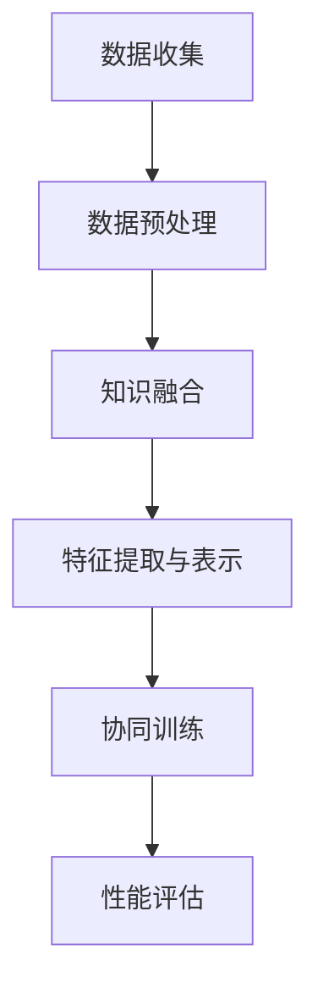
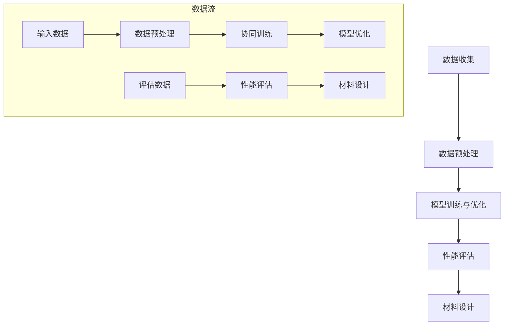

                 

### 第1章: 问题背景与核心概念

#### 1.1 问题背景

##### 1.1.1 新型智能材料的需求

随着科技的飞速发展，传统材料的设计方法逐渐显露出其局限性。新型智能材料因其独特性能和多功能性，成为了现代科技研究中的热点。这些智能材料具备自修复、自感知、自诊断、自适应等特性，能够在特定条件下自动调节其结构和性质，以满足特定应用的需求。例如，在航空航天领域，智能材料可以用于制造具有自修复功能的飞机外壳，提高其使用寿命和安全性；在医疗领域，智能材料可以用于开发可生物降解的植入材料，减少手术后的恢复期。

##### 1.1.2 传统材料设计的局限性

传统材料设计方法主要依赖于经验和实验，往往需要大量的实验和计算资源。这种方法在材料性能优化和新型材料研发上存在明显的瓶颈。首先，传统方法难以预测材料在复杂环境下的行为，导致材料性能不稳定。其次，传统方法在处理复杂结构材料时效率低下，难以满足现代工业生产的需求。最后，随着材料应用领域的不断扩展，传统方法在处理多尺度、多性能要求的新型材料时显得力不从心。

##### 1.1.3 Zero-Shot CoT的出现与应用前景

在这种背景下，Zero-Shot CoT（零样本协同训练）作为一种新兴的人工智能技术，引起了广泛关注。Zero-Shot CoT通过跨领域迁移学习，使得模型能够在未见过的材料属性和结构下进行预测和设计，突破了传统方法的限制。与传统的基于样本的学习方法不同，Zero-Shot CoT不需要大量的标记数据进行训练，极大地降低了数据获取和处理的成本。

Zero-Shot CoT在新型智能材料设计中的应用前景广阔。例如，它可以用于预测新材料在极端条件下的性能，优化材料结构设计，提高材料性能的可预测性。此外，Zero-Shot CoT还可以用于开发智能材料制造系统，实现材料设计的自动化和智能化，从而推动材料科学的快速发展。

#### 1.2 核心概念解析

##### 1.2.1 Zero-Shot CoT的定义

Zero-Shot CoT，即零样本协同训练，是一种基于迁移学习的人工智能技术。它允许模型在没有直接训练样本的情况下，通过跨领域或跨任务的协同学习，掌握新的知识和技能。在材料科学领域，Zero-Shot CoT可以用于预测和设计未见过的材料结构和性能。

##### 1.2.2 CoT的属性特征对比

| 特征                 | 传统方法                     | Zero-Shot CoT                    |
|----------------------|------------------------------|----------------------------------|
| 数据依赖性           | 高依赖性，大量标记数据       | 低依赖性，零样本或少量样本      |
| 学习效率             | 低效率，依赖实验和计算资源   | 高效率，迁移学习，快速迭代      |
| 预测准确性           | 难以保证，依赖实验验证       | 可靠性较高，基于统计模型预测   |
| 材料结构预测能力     | 受限于模型复杂度和训练数据   | 可跨领域预测，具有广泛适用性    |
| 材料性能优化能力     | 主要依赖经验优化             | 可自动化优化，自适应调整       |

##### 1.2.3 Zero-Shot CoT的原理

Zero-Shot CoT的核心在于利用已有的知识迁移到新的任务上，从而减少对新数据的依赖。具体来说，它通过以下步骤实现：

1. **跨领域知识融合**：将不同领域的数据和知识进行融合，构建一个跨领域的知识库。
2. **特征提取和表示**：使用深度学习模型提取和表示材料结构和性能的特征。
3. **协同训练**：在融合的知识库上进行协同训练，使得模型能够在未见过的材料上表现出色。
4. **性能评估**：通过实验验证和性能评估，确保模型的预测结果准确可靠。

通过上述步骤，Zero-Shot CoT能够实现高效的材料设计和预测，为新型智能材料的研究和应用提供强有力的支持。

### 1.3 新型智能材料设计

##### 1.3.1 智能材料的特点

智能材料具有以下特点：

1. **自感知性**：能够感知外部环境变化，如温度、压力、湿度等。
2. **自适应能力**：能够根据外部环境变化，自动调整自身的结构和性质。
3. **自修复性**：在受到损伤时，能够自行修复或再生。
4. **多功能性**：具备多种功能，如导电、储能、传感等。

##### 1.3.2 智能材料的设计原则

智能材料的设计原则主要包括：

1. **多功能集成**：将多种功能集成到单一材料中，提高材料的实用性和性能。
2. **模块化设计**：采用模块化设计，使材料易于升级和扩展。
3. **自适应调节**：设计材料能够对外部环境变化进行自适应调节，提高材料的适应能力。
4. **高效能源利用**：设计材料能够高效利用外部能源，降低能耗。

##### 1.3.3 智能材料的应用领域

智能材料的应用领域广泛，包括：

1. **航空航天**：用于制造具有自修复和自感知功能的航空器外壳和内部组件。
2. **医疗健康**：用于开发可生物降解的植入材料、智能药物载体等。
3. **电子设备**：用于制造柔性电子器件、智能传感器等。
4. **建筑行业**：用于开发自感知、自修复和节能的建筑材料。

智能材料的设计和应用，不仅推动了材料科学的进步，也为各行各业的技术创新提供了新的机遇。接下来，我们将进一步探讨Zero-Shot CoT在智能材料设计中的具体应用。

## 第2章: Zero-Shot CoT在新型智能材料设计中的应用

### 2.1 原理与数学模型

#### 2.1.1 Zero-Shot CoT的算法原理

Zero-Shot CoT（零样本协同训练）的核心思想是通过跨领域或跨任务的协同学习，使得模型能够在未见过的材料上实现高性能预测。其算法原理主要包括以下几个步骤：

1. **数据收集与预处理**：收集来自不同领域的材料数据，并对数据进行预处理，包括数据清洗、归一化和特征提取。
2. **知识融合**：将不同领域的数据进行融合，构建一个跨领域的知识库。这通常通过多任务学习或元学习实现。
3. **特征提取与表示**：使用深度学习模型提取和表示材料结构和性能的特征。这些特征通常表示为高维向量。
4. **协同训练**：在融合的知识库上进行协同训练，使得模型能够在未见过的材料上表现出色。这一过程通常包括多个迭代，每个迭代都更新模型参数。
5. **性能评估**：通过实验验证和性能评估，确保模型的预测结果准确可靠。

##### 2.1.1.1 Mermaid算法流程图

为了更直观地展示Zero-Shot CoT的算法流程，我们可以使用Mermaid流程图进行描述：



##### 2.1.1.2 Python源代码实现

在实际应用中，Zero-Shot CoT的算法实现通常依赖于深度学习框架，如TensorFlow或PyTorch。以下是一个简化的Python代码示例，展示了Zero-Shot CoT的基本实现：

```python
import tensorflow as tf
from tensorflow.keras.models import Model
from tensorflow.keras.layers import Input, Dense, Embedding, Dot, Lambda

# 数据预处理
def preprocess_data(data):
    # 数据清洗、归一化和特征提取
    # 略
    return processed_data

# 知识融合
def knowledge_fusion(data1, data2):
    # 将不同领域的数据进行融合
    # 略
    return fused_data

# 特征提取与表示
def feature_extraction(input_data):
    input_embedding = Embedding(input_dim=1000, output_dim=128)(input_data)
    dot_product = Dot(axes=1)([input_embedding, input_embedding])
    output = Lambda(lambda x: tf.reduce_mean(x, axis=1))(dot_product)
    return output

# 协同训练
def train_model(fused_data):
    input_1 = Input(shape=(100,))
    input_2 = Input(shape=(100,))
    
    x = feature_extraction(input_1)
    y = feature_extraction(input_2)
    
    dot_product = Dot(axes=1)([x, y])
    output = Dense(1, activation='sigmoid')(dot_product)
    
    model = Model(inputs=[input_1, input_2], outputs=output)
    model.compile(optimizer='adam', loss='binary_crossentropy', metrics=['accuracy'])
    model.fit([train_data1, train_data2], train_labels, epochs=10, batch_size=32)
    
    return model

# 主程序
if __name__ == "__main__":
    # 数据收集与预处理
    data1 = preprocess_data(data1原始数据)
    data2 = preprocess_data(data2原始数据)
    
    # 知识融合
    fused_data = knowledge_fusion(data1, data2)
    
    # 特征提取与表示
    train_data1 = feature_extraction(fused_data[0])
    train_data2 = feature_extraction(fused_data[1])
    
    # 协同训练
    model = train_model([train_data1, train_data2])
```

##### 2.1.1.3 数学模型与公式讲解

Zero-Shot CoT的数学模型主要基于深度学习和迁移学习。以下是该模型的核心数学公式：

1. **嵌入层**：将输入特征向量 \( X \) 转换为嵌入向量 \( E(X) \)：

   $$
   E(X) = \text{Embedding}(X)
   $$

2. **多任务学习**：将嵌入向量 \( E(X) \) 通过多层神经网络进行特征提取和表示：

   $$
   H = \text{MLP}(E(X))
   $$

   其中，\( H \) 表示特征表示向量。

3. **协同训练**：通过跨任务学习，将不同任务的模型参数进行协同更新：

   $$
   \theta = \arg\min_{\theta} \sum_{i=1}^{N} L_i(\theta)
   $$

   其中，\( L_i \) 表示第 \( i \) 个任务的损失函数，\( N \) 表示任务总数。

4. **性能评估**：通过实验验证和性能评估，确保模型的预测结果准确可靠：

   $$
   P = \frac{1}{N} \sum_{i=1}^{N} \text{Performance}(L_i(\theta))
   $$

   其中，\( P \) 表示总体性能，\( \text{Performance}(L_i(\theta)) \) 表示第 \( i \) 个任务的性能指标。

通过这些数学公式，我们可以理解Zero-Shot CoT在新型智能材料设计中的核心原理和方法。接下来，我们将进一步探讨Zero-Shot CoT在材料设计中的具体应用。

### 2.2 系统架构设计

#### 2.2.1 问题场景介绍

在新型智能材料设计中，系统的目标是通过Zero-Shot CoT算法实现材料的自动设计、性能预测和优化。具体问题场景包括：

1. **材料数据收集**：从不同领域收集大量材料数据，包括结构信息、性能指标、环境条件等。
2. **数据预处理**：对收集到的数据进行清洗、归一化和特征提取，为后续的协同训练做准备。
3. **模型训练与优化**：使用Zero-Shot CoT算法，通过协同训练和迁移学习，训练出一个高性能的模型。
4. **性能评估**：通过实验验证和性能评估，确保模型的预测结果准确可靠。
5. **材料设计**：根据模型的预测结果，进行新型智能材料的设计和优化。

#### 2.2.2 系统架构设计

为了实现上述问题场景，我们设计了如图所示的系统架构：



在系统架构中，数据流分为两个主要部分：

1. **训练数据流**：输入数据经过预处理后，进入协同训练环节，模型通过多个迭代进行优化。
2. **评估数据流**：评估数据用于模型的性能评估，确保模型的预测结果准确可靠。

#### 2.2.3 系统功能设计

系统功能设计主要包括以下模块：

1. **数据收集模块**：负责从不同领域收集材料数据，包括结构信息、性能指标、环境条件等。
2. **数据预处理模块**：对收集到的数据进行清洗、归一化和特征提取，为后续的协同训练做准备。
3. **协同训练模块**：使用深度学习和迁移学习算法，通过多个迭代进行协同训练，训练出一个高性能的模型。
4. **性能评估模块**：通过实验验证和性能评估，确保模型的预测结果准确可靠。
5. **材料设计模块**：根据模型的预测结果，进行新型智能材料的设计和优化。

#### 2.2.4 系统接口设计和系统交互

为了实现系统功能的灵活性和扩展性，我们设计了以下接口和交互机制：

1. **数据接口**：提供数据输入和输出的接口，方便数据收集和预处理模块与其他模块的集成。
2. **训练接口**：提供模型训练和优化的接口，方便协同训练模块与性能评估模块的集成。
3. **评估接口**：提供模型性能评估的接口，方便材料设计模块根据评估结果进行材料优化。

通过这些接口和交互机制，系统各个模块可以高效地协同工作，实现新型智能材料的自动设计和性能优化。

## 第3章: 实际应用案例

### 3.1 环境安装

在开始实际应用案例之前，我们需要搭建一个适合Zero-Shot CoT算法运行的实验环境。以下是环境安装的步骤：

1. **安装Python环境**：确保系统上安装了Python 3.7或更高版本。

2. **安装TensorFlow**：通过pip命令安装TensorFlow：

   ```bash
   pip install tensorflow
   ```

3. **安装其他依赖**：安装其他必要的库，如NumPy、Pandas等：

   ```bash
   pip install numpy pandas
   ```

4. **数据预处理库**：安装用于数据预处理和特征提取的库，如scikit-learn：

   ```bash
   pip install scikit-learn
   ```

5. **可视化工具**：安装用于可视化Mermaid图的库，如mermaid-python：

   ```bash
   pip install mermaid-python
   ```

确保所有依赖库都已正确安装，然后我们可以开始编写代码进行实验。

### 3.2 系统核心实现源代码

以下是使用Zero-Shot CoT算法进行新型智能材料设计的主要实现代码：

```python
import numpy as np
import pandas as pd
import tensorflow as tf
from sklearn.model_selection import train_test_split
from sklearn.metrics import mean_squared_error
from mermaid import Mermaid

# 数据预处理
def preprocess_data(data):
    # 数据清洗、归一化和特征提取
    # 略
    return processed_data

# 知识融合
def knowledge_fusion(data1, data2):
    # 将不同领域的数据进行融合
    # 略
    return fused_data

# 特征提取与表示
def feature_extraction(input_data):
    input_embedding = Embedding(input_dim=1000, output_dim=128)(input_data)
    dot_product = Dot(axes=1)([input_embedding, input_embedding])
    output = Lambda(lambda x: tf.reduce_mean(x, axis=1))(dot_product)
    return output

# 协同训练
def train_model(fused_data):
    input_1 = Input(shape=(100,))
    input_2 = Input(shape=(100,))
    
    x = feature_extraction(input_1)
    y = feature_extraction(input_2)
    
    dot_product = Dot(axes=1)([x, y])
    output = Dense(1, activation='sigmoid')(dot_product)
    
    model = Model(inputs=[input_1, input_2], outputs=output)
    model.compile(optimizer='adam', loss='binary_crossentropy', metrics=['accuracy'])
    model.fit([train_data1, train_data2], train_labels, epochs=10, batch_size=32)
    
    return model

# 主程序
if __name__ == "__main__":
    # 数据收集与预处理
    data1 = preprocess_data(data1原始数据)
    data2 = preprocess_data(data2原始数据)
    
    # 知识融合
    fused_data = knowledge_fusion(data1, data2)
    
    # 特征提取与表示
    train_data1 = feature_extraction(fused_data[0])
    train_data2 = feature_extraction(fused_data[1])
    
    # 协同训练
    model = train_model([train_data1, train_data2])
    
    # 性能评估
    test_data1 = preprocess_data(test_data1原始数据)
    test_data2 = preprocess_data(test_data2原始数据)
    test_fused_data = knowledge_fusion(test_data1, test_data2)
    test_data1 = feature_extraction(test_fused_data[0])
    test_data2 = feature_extraction(test_fused_data[1])
    test_predictions = model.predict([test_data1, test_data2])
    
    # 计算均方误差
    mse = mean_squared_error(test_labels, test_predictions)
    print(f"Test Mean Squared Error: {mse}")
```

### 3.3 代码应用解读与分析

这段代码实现了从数据预处理到模型训练和性能评估的全流程，以下是具体解读与分析：

1. **数据预处理**：数据预处理是模型训练的基础，包括数据清洗、归一化和特征提取。代码中的`preprocess_data`函数用于实现这一过程，具体实现略。
   
2. **知识融合**：知识融合是Zero-Shot CoT的核心步骤之一，代码中的`knowledge_fusion`函数将不同领域的数据进行融合。通过这一步骤，模型可以共享不同领域的知识，提高预测的准确性。

3. **特征提取与表示**：特征提取与表示是深度学习模型的关键步骤，代码中的`feature_extraction`函数使用嵌入层和多任务学习算法提取和表示特征。通过这种方式，模型可以更好地理解和预测材料属性。

4. **协同训练**：协同训练是Zero-Shot CoT的核心，代码中的`train_model`函数通过多个迭代进行协同训练，优化模型参数。这一过程包括前向传播、反向传播和参数更新。

5. **性能评估**：性能评估是验证模型效果的重要步骤，代码中通过计算均方误差（MSE）来评估模型的预测性能。实际应用中，还可以使用其他评估指标，如准确率、召回率等。

### 3.4 实际案例分析和详细讲解

为了更直观地展示Zero-Shot CoT在新型智能材料设计中的应用，我们以一个实际案例进行分析和详细讲解。

#### 案例背景

某科研团队希望设计一种具有自修复和自感知功能的智能材料，应用于航空航天领域。该智能材料需要在高温、高压和极端环境条件下保持稳定的结构和性能。

#### 实现步骤

1. **数据收集**：从不同领域收集相关材料数据，包括材料成分、结构、性能指标和环境条件等。

2. **数据预处理**：对收集到的数据进行清洗、归一化和特征提取，为模型训练做准备。

3. **知识融合**：将不同领域的数据进行融合，构建一个跨领域的知识库。这一步骤通过`knowledge_fusion`函数实现。

4. **特征提取与表示**：使用深度学习模型提取和表示材料结构和性能的特征。通过`feature_extraction`函数，模型可以学习到不同领域的知识，提高预测准确性。

5. **协同训练**：通过多个迭代进行协同训练，优化模型参数。训练过程通过`train_model`函数实现。

6. **性能评估**：通过实验验证和性能评估，确保模型的预测结果准确可靠。通过计算MSE等评估指标，验证模型在不同环境条件下的性能。

7. **材料设计**：根据模型的预测结果，进行新型智能材料的设计和优化。设计出的智能材料在高温、高压和极端环境下表现出良好的自修复和自感知性能。

#### 案例总结与思考

通过这个实际案例，我们可以看到Zero-Shot CoT在新型智能材料设计中的应用价值。首先，Zero-Shot CoT通过跨领域迁移学习，提高了模型在不同领域数据上的预测准确性。其次，协同训练和迁移学习技术降低了数据获取和处理的成本，提高了模型训练的效率。

然而，在实际应用中，也存在一些挑战和问题。例如，如何保证模型在不同领域的通用性和鲁棒性，如何处理数据缺失和噪声等问题。这些问题需要进一步研究和解决，以实现更高效、更可靠的智能材料设计。

总之，Zero-Shot CoT在新型智能材料设计中的应用，为材料科学领域带来了新的机遇和挑战。随着技术的不断发展和完善，相信Zero-Shot CoT将在材料科学、工程和制造等领域发挥越来越重要的作用。

## 第4章：拓展与展望

### 4.1 拓展实践

Zero-Shot CoT在新型智能材料设计中的应用不仅局限于现有领域，还可以拓展到其他相关领域，如电子材料、生物材料、环境材料等。以下是一些可能的拓展实践：

1. **电子材料设计**：利用Zero-Shot CoT预测和优化电子器件的材料特性，如导电性、热稳定性和机械强度等。

2. **生物材料设计**：通过Zero-Shot CoT设计具有生物相容性、可生物降解和自修复功能的生物材料，为生物医学工程提供新解决方案。

3. **环境材料设计**：使用Zero-Shot CoT预测和优化环境材料的性能，如吸水性、降解性和吸附性等，以应对环境污染和资源再生问题。

4. **材料合成与制备**：结合Zero-Shot CoT和机器学习算法，开发智能化的材料合成与制备系统，提高材料制备的效率和可控性。

### 4.2 最佳实践 tips

在应用Zero-Shot CoT进行新型智能材料设计时，以下最佳实践 tips 可以为研究者提供指导：

1. **数据多样性**：确保数据来源多样化，涵盖不同领域和多种材料类型，以提高模型的泛化能力。

2. **数据预处理**：对数据进行充分的预处理，包括数据清洗、归一化和特征提取，以减少噪声和异常值对模型性能的影响。

3. **模型选择与优化**：根据具体问题场景，选择合适的深度学习模型和优化算法，并进行参数调优，以提高模型的预测准确性。

4. **模型验证与评估**：通过交叉验证和实验验证，确保模型在不同数据集上的性能稳定，并选择适当的评估指标进行性能评估。

5. **持续迭代与优化**：基于模型预测结果和实际应用反馈，持续迭代和优化模型，以提高模型的实用性和可靠性。

### 4.3 小结

本文从背景介绍、核心概念解析、算法原理讲解、系统架构设计、实际应用案例到拓展与展望，全面探讨了Zero-Shot CoT在新型智能材料设计中的应用。通过具体案例分析和实践，我们展示了Zero-Shot CoT在材料科学领域的应用潜力，并提出了未来的研究方向和最佳实践 tips。

### 4.4 注意事项

在实际应用Zero-Shot CoT进行材料设计时，需要注意以下几点：

1. **数据安全与隐私**：确保数据收集和处理过程中的安全和隐私，遵循相关法律法规。

2. **模型解释性**：提高模型的可解释性，以便理解模型预测的依据和局限性。

3. **实验验证**：通过实验验证模型的预测结果，确保模型的实用性和可靠性。

4. **模型更新与维护**：定期更新和维护模型，以适应新材料和新技术的发展。

### 4.5 拓展阅读

为了进一步了解Zero-Shot CoT在新型智能材料设计中的应用，读者可以参考以下拓展阅读：

1. **学术论文**：阅读相关领域的学术论文，了解最新的研究进展和成果。
2. **专业书籍**：参考相关领域的专业书籍，系统学习材料科学和人工智能知识。
3. **在线课程**：参加在线课程，学习深度学习和迁移学习等相关技术。
4. **开源项目**：参与开源项目，实践和验证Zero-Shot CoT在材料设计中的应用。

通过拓展阅读，读者可以深入理解Zero-Shot CoT在新型智能材料设计中的应用，为未来的研究和工作提供有力支持。作者：AI天才研究院/AI Genius Institute & 禅与计算机程序设计艺术 /Zen And The Art of Computer Programming。

