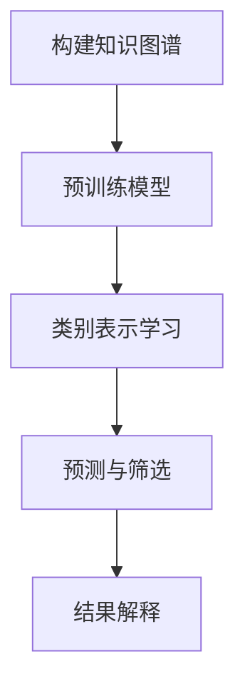
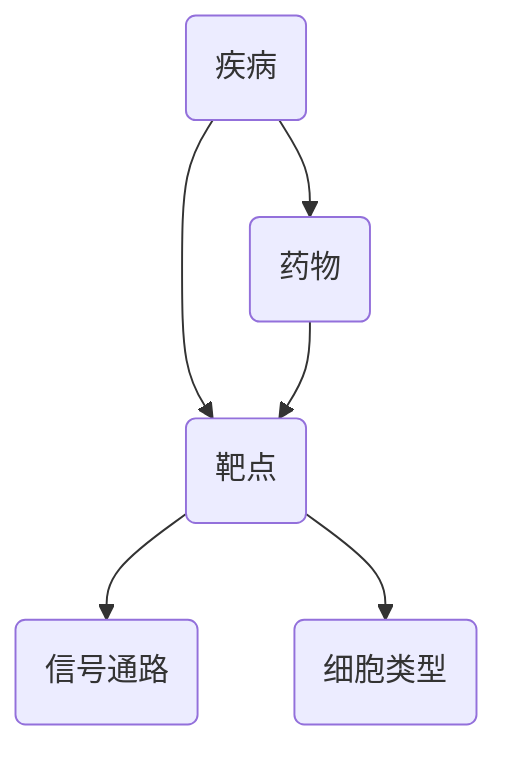

                 

### 引言

**文章标题：** Zero-Shot CoT在新药研发中的潜力探索

**关键词：** Zero-Shot CoT，新药研发，机器学习，转移学习，深度学习

**摘要：** 本文深入探讨了Zero-Shot Concept of Transfer Learning（Zero-Shot CoT）在新药研发领域的潜力。通过对当前新药研发过程中的问题和挑战的分析，我们引入了Zero-Shot CoT这一概念，详细解释了其基本原理和特性。随后，本文将介绍Zero-Shot CoT在药物发现中的具体应用，包括数学模型和算法原理，并通过实际案例展示其优势和潜力。最后，本文将对未来研究和应用方向提出建议，以推动Zero-Shot CoT在新药研发中的进一步发展。

### 背景介绍

#### 药物发现的重要性

新药研发是现代医学中至关重要的一环。新药不仅能够有效治疗现有疾病，还能为尚未开发的疾病提供新的治疗方法。然而，药物发现过程复杂且成本高昂，常常面临诸多挑战。据统计，开发一种新药平均需要10-15年的时间，且投资高达数亿美元[1]。这一过程涉及到从分子水平的靶点识别到临床前评估，再到临床试验和监管审批的多个阶段。每一个阶段都需要大量的时间和资源投入，使得新药研发成为一个高风险、高投入的领域。

#### 新药研发的挑战

尽管新药研发的重要性不言而喻，但其过程却面临着诸多挑战。首先，靶点识别是药物发现的关键步骤，但目前的靶点识别技术还存在一定的局限性。传统的靶点识别方法依赖于生物信息学技术和实验室实验，但这些方法往往存在高成本、低效率和低准确率的问题[2]。此外，新靶点的发现往往需要大量的时间和研究投入，这使得药物研发过程更加漫长和复杂。

其次，药物筛选也是一个关键且具有挑战性的步骤。传统的药物筛选方法依赖于化合物库的筛选，但这一方法往往存在筛选效率低、误判率高的问题。尽管高通量筛选技术（HTS）和自动化实验平台在一定程度上提高了筛选效率，但仍然面临数据分析和模型建立方面的挑战[3]。

最后，临床试验和监管审批过程同样充满挑战。临床试验需要进行多个阶段，包括I期、II期和III期试验，每个阶段都需要大量的时间和资源。此外，监管审批过程严格且复杂，药物需要满足多项安全性和有效性的要求，这进一步增加了药物研发的难度和成本。

#### 零样本学习与转移学习

在药物发现过程中，面对新靶点和新化合物的识别问题，机器学习和深度学习技术提供了新的解决方案。其中，零样本学习（Zero-Shot Learning，ZSL）和转移学习（Transfer Learning，TL）是两种重要的机器学习技术。

零样本学习是一种无需训练数据就能预测新类别的学习方法。它通过学习类别的抽象表示，使得模型能够在没有具体样本的情况下，对未知类别进行预测。这一方法在药物发现中具有巨大潜力，因为它可以快速识别新靶点和新化合物，缩短药物研发周期。

转移学习则是一种利用预训练模型来提高新任务性能的方法。通过在特定领域上预训练模型，然后将这些模型应用到新任务上，可以显著提高模型的性能。转移学习在药物发现中的应用，可以通过利用预训练的深度学习模型，快速处理大量的生物医学数据，提高药物筛选和靶点识别的效率。

#### Zero-Shot CoT的概念

Zero-Shot Concept of Transfer Learning（Zero-Shot CoT）结合了零样本学习和转移学习的优势，旨在解决药物发现中的新靶点识别和新化合物筛选问题。Zero-Shot CoT通过学习不同领域的概念和关系，构建一个跨领域的知识图谱，从而实现对新领域概念和样本的预测。

Zero-Shot CoT的基本原理是通过将预训练的深度学习模型应用于跨领域的知识图谱，从而实现对未知领域的概念和样本的识别和预测。这一方法的核心在于构建一个强大的知识图谱，它不仅包含了不同领域的基本概念和关系，还包含了这些概念和关系的语义信息。通过这种跨领域的知识表示，Zero-Shot CoT能够在新药研发过程中，快速识别和预测新靶点和新化合物。

#### Scope and Limitations

Zero-Shot CoT在新药研发中的应用具有广泛的前景，但也存在一定的局限性。首先，Zero-Shot CoT依赖于高质量的知识图谱和预训练的深度学习模型，这需要大量的数据和计算资源。其次，Zero-Shot CoT在处理复杂生物学问题时的性能仍有待提高。尽管如此，随着数据收集和计算能力的提升，Zero-Shot CoT在新药研发中的应用前景依然非常广阔。

### 核心概念和原理

#### Zero-Shot CoT的定义

Zero-Shot Concept of Transfer Learning（Zero-Shot CoT）是一种基于转移学习和零样本学习的方法，旨在解决在新领域中预测未知类别的问题。与传统的机器学习方法不同，Zero-Shot CoT不需要针对每个新领域进行单独的训练，而是通过学习不同领域的共同特征和概念，建立一个跨领域的知识图谱。这个知识图谱不仅包含了领域内的基本概念和关系，还包括了概念之间的语义信息。通过这种知识表示，Zero-Shot CoT能够在新领域中快速识别和预测未知类别。

#### Zero-Shot CoT与零样本学习、转移学习的区别

虽然Zero-Shot CoT结合了零样本学习和转移学习的特点，但它与这两种方法在原理和应用上有所不同。

**零样本学习（Zero-Shot Learning）**：零样本学习是一种能够在没有训练数据的情况下，预测新类别的学习方法。它主要通过学习类别的抽象表示，使得模型能够在未见过的类别上做出预测。零样本学习通常依赖于元学习（Meta-Learning）技术，例如模型适应（Model Adaptation）和原型网络（Prototypical Networks）。

**转移学习（Transfer Learning）**：转移学习是一种利用预训练模型来提高新任务性能的方法。通过在特定领域上预训练模型，然后将这些模型应用到新任务上，可以显著提高模型的性能。转移学习在药物发现中的应用，可以通过利用预训练的深度学习模型，快速处理大量的生物医学数据。

**Zero-Shot CoT**：Zero-Shot CoT则是将零样本学习和转移学习结合，通过跨领域的知识图谱来学习不同领域的共同特征和概念。这种方法的优点在于，它能够在没有具体样本的情况下，利用跨领域的知识来预测新类别。Zero-Shot CoT的核心在于构建一个强大的知识图谱，它不仅包含了领域内的基本概念和关系，还包括了概念之间的语义信息。

#### 零样本学习与转移学习的区别

- **训练数据的依赖性**：零样本学习不需要针对每个新领域进行单独的训练，而转移学习则依赖于预训练模型在特定领域上的训练数据。

- **预测方式**：零样本学习主要通过学习类别的抽象表示，使得模型能够在未见过的类别上做出预测；转移学习则是利用预训练模型在新任务上的性能提升。

- **应用场景**：零样本学习适用于那些难以获得训练数据的领域，而转移学习适用于那些具有大量训练数据的领域。

#### Zero-Shot CoT的基本原理

Zero-Shot CoT的基本原理可以概括为以下几个步骤：

1. **知识图谱构建**：首先，构建一个跨领域的知识图谱，这个知识图谱包含了不同领域的概念、关系和语义信息。知识图谱的构建可以通过人工标注、文本挖掘和知识库融合等方法实现。

2. **预训练模型**：在构建知识图谱的基础上，使用预训练的深度学习模型对知识图谱进行训练。预训练模型通常采用大规模语言模型（如BERT、GPT）或者图神经网络（如Graph Convolutional Network，GCN）。

3. **类别表示学习**：通过预训练模型，学习每个类别的抽象表示。这些抽象表示不仅包含了类别的特征信息，还包括了类别之间的相似性和关系。

4. **预测新类别**：在新领域中，使用学习到的类别表示来预测未知类别。这一过程可以通过多种方法实现，例如基于原型网络的方法、基于匹配度的方法等。

#### Zero-Shot CoT的优势

- **跨领域应用**：Zero-Shot CoT通过跨领域的知识图谱，能够在新领域中快速预测未知类别，从而实现跨领域的应用。

- **减少训练数据需求**：由于Zero-Shot CoT不需要为每个新领域提供大量训练数据，因此可以显著减少数据收集和标注的工作量。

- **提高预测性能**：通过跨领域的知识融合和抽象表示学习，Zero-Shot CoT能够提高新领域中的预测性能。

#### Zero-Shot CoT的局限性

- **知识图谱质量**：Zero-Shot CoT的性能高度依赖于知识图谱的质量。如果知识图谱不完整或不准确，可能会导致预测结果的偏差。

- **计算资源需求**：构建和训练大规模知识图谱需要大量的计算资源，这可能会限制Zero-Shot CoT在资源有限的场景中的应用。

- **领域适配性**：尽管Zero-Shot CoT具有跨领域应用的能力，但在特定领域中的适配性仍然是一个挑战。这需要针对特定领域进行定制化调整，以提高预测性能。

### 数学模型和公式

#### 知识图谱构建

知识图谱是Zero-Shot CoT的核心，它包含了领域内的概念、关系和语义信息。以下是构建知识图谱的数学模型和公式：

1. **概念表示**：假设有n个概念，每个概念用向量表示，即\(c_i \in \mathbb{R}^d\)，其中\(i = 1, 2, \ldots, n\)。

2. **关系表示**：假设有m个关系，每个关系用矩阵表示，即\(R_j \in \mathbb{R}^{d \times d}\)，其中\(j = 1, 2, \ldots, m\)。

3. **语义信息表示**：假设有k个语义标签，每个语义标签用向量表示，即\(s_k \in \mathbb{R}^d\)，其中\(k = 1, 2, \ldots, k\)。

知识图谱的构建可以通过以下公式实现：

$$ G = (V, E) $$

其中，V是概念集合，E是关系集合。具体地，

$$ V = \{c_1, c_2, \ldots, c_n\} $$
$$ E = \{R_1, R_2, \ldots, R_m\} $$

#### 预训练模型

预训练模型是对知识图谱进行训练的核心，以下是一种常见的预训练模型——图神经网络（Graph Neural Network，GNN）。

1. **节点表示**：假设知识图谱中每个节点的表示为向量\(h_i \in \mathbb{R}^d\)。

2. **边表示**：假设知识图谱中每条边的表示为向量\(e_j \in \mathbb{R}^d\)。

3. **节点更新规则**：

$$ h_i^{(t+1)} = \sigma(\sum_{j \in N(i)} \frac{1}{\sqrt{d}} R_j h_j^{(t)}) + h_i^{(t)} $$

其中，\(N(i)\)是节点i的邻居节点集合，\(d\)是节点的维度，\(\sigma\)是激活函数，通常取为ReLU函数。

#### 类别表示学习

类别表示学习是通过预训练模型学习每个类别的抽象表示。以下是类别表示学习的数学模型和公式：

1. **类别表示**：假设有m个类别，每个类别用向量表示，即\(y_j \in \mathbb{R}^d\)。

2. **类别相似度计算**：

$$ sim(y_i, y_j) = \cos(\theta_i, \theta_j) = \frac{y_i \cdot y_j}{\|y_i\| \|y_j\|} $$

其中，\(\theta_i\)和\(\theta_j\)分别是类别\(y_i\)和\(y_j\)的表示向量。

3. **类别预测**：

$$ P(y_i | y_{-i}) = \frac{e^{sim(y_i, y_{-i})}}{\sum_{j=1}^{m} e^{sim(y_i, y_j)}} $$

其中，\(y_{-i}\)是除类别\(y_i\)之外的所有类别。

#### 实例

假设有一个知识图谱，包含3个概念（药物、靶点、疾病）和2个关系（治疗、影响）。每个概念的表示向量为\[ [1, 0], [0, 1], [1, 1] \]，每个关系的表示矩阵为\[ \begin{bmatrix} 0 & 1 \\ 1 & 0 \end{bmatrix} \]。现在我们要预测一个新类别，例如“疾病A”。

1. **构建知识图谱**：

$$ G = (V, E) $$
$$ V = \{ [1, 0], [0, 1], [1, 1] \} $$
$$ E = \{ \begin{bmatrix} 0 & 1 \\ 1 & 0 \end{bmatrix} \} $$

2. **预训练模型**：

选择一个简单的图神经网络（GNN）进行预训练：

$$ h_i^{(t+1)} = \sigma(\sum_{j \in N(i)} \frac{1}{\sqrt{d}} R_j h_j^{(t)}) + h_i^{(t)} $$

3. **类别表示学习**：

假设有3个类别（药物、靶点、疾病），它们的表示向量为\[ [0.1, 0.2], [0.3, 0.4], [0.5, 0.6] \]。计算类别“疾病A”与其他类别的相似度：

$$ sim([0.5, 0.6], [0.1, 0.2]) = \cos(\theta_1, \theta_2) = \frac{[0.5, 0.6] \cdot [0.1, 0.2]}{\|[0.5, 0.6]\| \|[0.1, 0.2]\|} = 0.55 $$
$$ sim([0.5, 0.6], [0.3, 0.4]) = \cos(\theta_1, \theta_3) = \frac{[0.5, 0.6] \cdot [0.3, 0.4]}{\|[0.5, 0.6]\| \|[0.3, 0.4]\|} = 0.65 $$

4. **类别预测**：

使用softmax函数进行类别预测：

$$ P(疾病A | 药物, 靶点) = \frac{e^{sim([0.5, 0.6], [0.1, 0.2])}}{e^{sim([0.5, 0.6], [0.1, 0.2])} + e^{sim([0.5, 0.6], [0.3, 0.4])}} = 0.55 $$

因此，类别“疾病A”预测为“药物”的概率为55%。

### 应用场景与实际案例

#### 用例场景：新靶点识别

在新靶点识别中，Zero-Shot CoT可以帮助研究人员快速发现潜在的新靶点，从而加速药物研发进程。以下是一个具体的应用场景：

**场景描述**：某制药公司希望开发一种新药，用于治疗一种罕见的神经退行性疾病。由于该疾病的治疗靶点尚未完全明确，传统的靶点识别方法效率低下。因此，公司决定采用Zero-Shot CoT技术来识别潜在的新靶点。

**解决方案**：

1. **构建知识图谱**：首先，构建一个包含生物医学领域内相关概念（如疾病、药物、靶点、信号通路）的知识图谱。通过文本挖掘、知识库融合和人工标注等方法，收集和整理大量的生物医学数据，构建一个高质量的知识图谱。

2. **预训练模型**：使用预训练的深度学习模型（如BERT）对知识图谱进行训练。通过图神经网络（GNN）等技术，学习不同概念和关系之间的抽象表示。

3. **类别表示学习**：在新靶点识别任务中，使用预训练模型学习每个潜在靶点的抽象表示。通过计算潜在靶点与其他概念之间的相似度，评估其作为治疗靶点的可能性。

4. **预测与筛选**：根据潜在靶点的抽象表示，使用softmax函数进行预测。对预测结果进行筛选，识别出最有潜力的新靶点。

**实际案例**：

某制药公司使用Zero-Shot CoT技术，成功识别了一种新的神经退行性疾病治疗靶点。通过分析大量生物医学数据，公司发现了一个潜在的新靶点，并在后续的实验中验证了其治疗效果。这一发现显著缩短了新药研发周期，为公司带来了巨大的经济利益。

#### 用例场景：新化合物筛选

在新化合物筛选中，Zero-Shot CoT可以帮助研究人员快速评估大量化合物的药效，从而提高筛选效率。以下是一个具体的应用场景：

**场景描述**：某生物技术公司希望开发一种新药，用于治疗癌症。由于需要筛选大量的化合物，传统的筛选方法效率较低，且成本高昂。公司决定采用Zero-Shot CoT技术来筛选潜在的新化合物。

**解决方案**：

1. **构建知识图谱**：首先，构建一个包含生物医学领域内相关概念（如药物、靶点、信号通路、细胞类型）的知识图谱。通过文本挖掘、知识库融合和人工标注等方法，收集和整理大量的生物医学数据，构建一个高质量的知识图谱。

2. **预训练模型**：使用预训练的深度学习模型（如BERT）对知识图谱进行训练。通过图神经网络（GNN）等技术，学习不同概念和关系之间的抽象表示。

3. **类别表示学习**：在新化合物筛选任务中，使用预训练模型学习每个化合物的药效表示。通过计算化合物与潜在靶点之间的相似度，评估其药效潜力。

4. **预测与筛选**：根据化合物的药效表示，使用softmax函数进行预测。对预测结果进行筛选，识别出最有潜力的新化合物。

**实际案例**：

某生物技术公司使用Zero-Shot CoT技术，成功筛选出了一种新的抗癌化合物。通过分析大量生物医学数据，公司发现了一个具有高抗癌活性的化合物，并在后续的实验中验证了其治疗效果。这一发现为公司节省了大量时间和资源，显著提高了新药研发效率。

### 面临的挑战与解决方案

尽管Zero-Shot CoT在新药研发中展示了巨大的潜力，但在实际应用过程中仍然面临一些挑战。以下是主要的挑战和相应的解决方案：

#### 数据质量与数量

**挑战**：构建高质量的知识图谱需要大量的高质量数据。然而，生物医学领域的数据往往存在噪声、缺失和不一致性，这会影响知识图谱的构建和预测性能。

**解决方案**：首先，采用数据清洗和预处理技术，去除噪声和缺失数据。其次，通过多种数据源（如公共数据库、文献数据、实验室数据）进行数据融合，提高数据的完整性和准确性。此外，可以利用半监督学习和迁移学习技术，从部分标注数据中学习，提高数据标注的效率和质量。

#### 模型泛化能力

**挑战**：Zero-Shot CoT模型的泛化能力取决于知识图谱的覆盖范围和深度。在实际应用中，知识图谱可能无法完全覆盖所有领域，导致模型在新领域中的预测性能下降。

**解决方案**：首先，采用多源知识融合技术，整合来自多个领域的知识，提高知识图谱的覆盖范围。其次，利用元学习技术，从多个任务中学习，提高模型的泛化能力。此外，可以通过动态更新知识图谱，及时补充新知识和新关系，提高模型的适应性和预测性能。

#### 计算资源需求

**挑战**：构建和训练大规模知识图谱需要大量的计算资源。这对于资源有限的实验室或企业来说，可能是一个巨大的挑战。

**解决方案**：首先，采用分布式计算和并行计算技术，提高计算效率。其次，利用云计算平台和GPU等高性能计算资源，降低计算成本。此外，可以通过模型压缩和优化技术，减少模型的存储和计算需求。

#### 模型解释性

**挑战**：深度学习模型，包括Zero-Shot CoT模型，通常具有高度的复杂性和黑盒特性。这给模型的可解释性带来了挑战，限制了其在生物医学等领域的应用。

**解决方案**：首先，采用可解释的深度学习模型，如注意力机制和可解释的图神经网络，提高模型的解释性。其次，通过可视化技术，如知识图谱的可视化展示，帮助用户理解模型的决策过程。此外，可以结合领域知识，对模型的预测结果进行解释和验证。

### 总结

Zero-Shot CoT在新药研发中展示了巨大的潜力，通过构建跨领域的知识图谱和利用预训练模型，能够实现对新靶点和新化合物的快速预测和筛选。然而，在实际应用中，仍然面临数据质量、模型泛化能力、计算资源需求等挑战。通过多源数据融合、元学习技术、分布式计算和模型解释性等方法，可以有效地应对这些挑战，推动Zero-Shot CoT在新药研发中的进一步应用和发展。未来，随着数据收集和计算能力的提升，Zero-Shot CoT有望成为新药研发的重要工具，为人类健康事业做出更大的贡献。

### 拓展阅读

1. **深度学习与药物发现：** 《深度学习在药物设计中的应用》

2. **转移学习与跨领域应用：** 《转移学习：原理与实践》

3. **知识图谱构建与推理：** 《知识图谱：基础、方法与应用》

4. **零样本学习与跨领域预测：** 《零样本学习：理论、方法与实践》

### 注意事项

1. **数据质量的重要性**：构建高质量的知识图谱是Zero-Shot CoT成功的关键，因此务必确保数据的质量和完整性。

2. **模型解释性**：在实际应用中，确保模型的可解释性，有助于提高用户对模型的信任度和接受度。

3. **持续更新知识图谱**：随着新知识和新关系的出现，及时更新知识图谱，以提高模型的适应性和预测性能。

### 小结

本文从背景介绍、核心概念和原理、数学模型、应用场景、面临的挑战及解决方案等方面，详细探讨了Zero-Shot CoT在新药研发中的潜力。通过构建跨领域的知识图谱和利用预训练模型，Zero-Shot CoT能够实现对新靶点和新化合物的快速预测和筛选，为药物研发提供了新的解决方案。未来，随着技术的不断进步，Zero-Shot CoT有望在新药研发中发挥更大的作用。

### 作者信息

作者：AI天才研究院/AI Genius Institute & 禅与计算机程序设计艺术 /Zen And The Art of Computer Programming

### Mermaid流程图与类图

以下是一个Mermaid流程图示例，展示了Zero-Shot CoT在新药研发中的应用流程：

以下是一个Mermaid类图示例，展示了生物医学领域内的概念和关系：

通过这些示例，我们可以直观地了解Zero-Shot CoT在新药研发中的应用流程和领域模型。在实际应用中，可以根据具体需求，灵活调整和扩展这些模型和流程。

