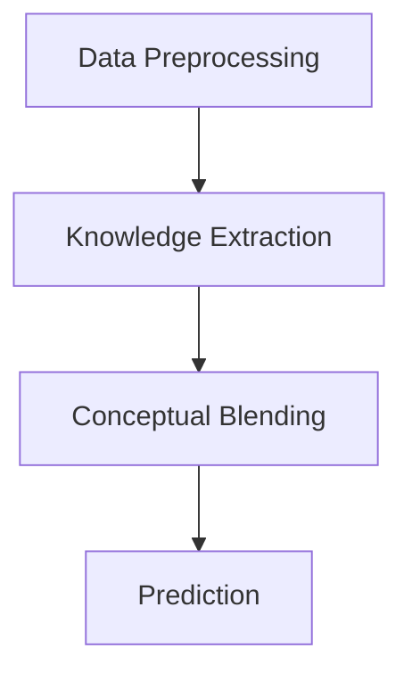

                 

## Book Outline: "Zero-Shot CoT in Innovative Applications for Predicting Unknown Element Characteristics"

### Introduction to Zero-Shot CoT

#### Chapter 1: Background and Core Concepts of Zero-Shot CoT

##### 1.1 What is Zero-Shot CoT

**核心概念术语说明：**
- **Zero-Shot CoT**：Zero-Shot Conceptual Transfer，一种基于知识迁移的技术，能够在没有直接训练数据的情况下，预测未知元素的特性。
- **知识迁移**：将已知的领域知识应用到新的领域，以预测新的元素特性。

**问题背景：**
传统机器学习方法依赖于大量标注数据进行训练，但在某些领域，如新材料研发、药物发现等，获取大量标注数据非常困难。Zero-Shot CoT旨在解决这一挑战。

**问题描述：**
在未知元素特性的预测中，如何利用少量或没有标注数据，快速准确地预测元素的新特性？

**问题解决：**
通过Zero-Shot CoT，可以基于已有的知识库和模型，将知识迁移到新的元素特性预测任务中，实现无监督或半监督学习。

**边界与外延：**
- **边界**：Zero-Shot CoT适用于新元素特性预测，但不适用于完全未探索的领域。
- **外延**：可以扩展到其他需要知识迁移的场景，如新药物研发、新材料设计等。

##### 1.2 Core Concepts and Structure

**核心概念：**
- **概念转移**：将一个领域中的知识应用到另一个领域。
- **知识库**：存储已有领域知识的数据库。
- **模型**：用于预测新元素特性的机器学习模型。

**概念属性特征对比表格：**

| 特征               | 传统方法                                       | Zero-Shot CoT                                  |
|--------------------|------------------------------------------------|------------------------------------------------|
| 数据需求           | 需要大量标注数据                             | 可以利用少量或没有标注数据                      |
| 知识应用           | 依赖具体领域的数据                           | 基于知识库和通用模型，实现跨领域知识迁移          |
| 模型性能           | 可能面临过拟合问题                           | 可以通过迁移学习减少过拟合风险                  |

##### 1.3 Relationship with Other Technologies

**比较与相关领域：**
- **迁移学习**：Zero-Shot CoT是迁移学习的一种，但更侧重于跨领域的知识迁移。
- **多任务学习**：多任务学习通过同时学习多个任务来提高模型泛化能力，与Zero-Shot CoT有相似之处。

**系统架构：**
- **知识库**：存储领域知识，包括元素特性和相关属性。
- **模型**：基于知识库构建，用于预测未知元素特性。
- **数据预处理模块**：处理输入数据，使其符合模型要求。

**集成与扩展：**
Zero-Shot CoT可以与其他技术相结合，如强化学习、生成对抗网络等，以提升预测性能。

##### 1.4 Boundaries and Limitations

**定义范围：**
Zero-Shot CoT适用于新元素特性预测，但不适用于完全未探索的领域。

**挑战与未来可能性：**
- **数据质量**：知识库中的数据质量直接影响预测性能，未来可以探索自动化数据清洗和标注技术。
- **模型泛化能力**：提高模型在不同领域间的泛化能力是关键挑战。
- **计算资源**：大规模知识库和复杂模型可能需要更多计算资源。

### Fundamental Principles of Zero-Shot CoT

#### Chapter 2: Conceptual Understanding

##### 2.1 Philosophical Foundations

**理论基础：**
Zero-Shot CoT基于知识迁移和概念融合的理念，借鉴了哲学和认知科学中的类比推理、隐喻等概念。

**知识迁移：**
将已有领域中的知识应用到新领域，以预测新元素特性。

**概念融合：**
将不同领域中的概念进行整合，形成新的知识体系。

##### 2.2 Zero-Shot Learning

**定义与相关技术：**
- **Zero-Shot Learning (ZSL)**：在没有直接标注数据的情况下，学习新类别。
- **Few-Shot Learning**：在少量标注数据的情况下学习新类别。

**区别与联系：**
Zero-Shot Learning关注完全无标注数据，而Few-Shot Learning关注少量标注数据。

**优势与应用：**
- **降低数据需求**：适用于数据稀缺的领域。
- **提高模型泛化能力**：通过跨领域知识迁移，提高模型在不同领域的表现。

##### 2.3 CoT (Conceptual Blending)

**理论基础：**
Conceptual Blending是一种将不同领域中的概念进行融合的方法，旨在构建新的知识体系。

**方法与步骤：**
1. **领域知识提取**：从现有知识库中提取相关领域知识。
2. **概念映射**：将不同领域的概念进行映射和整合。
3. **知识融合**：构建新的知识体系，用于预测未知元素特性。

**应用场景：**
- **新材料研发**：通过融合材料科学和化学领域的知识，预测新材料的特性。
- **药物发现**：通过融合生物学和化学领域的知识，预测新药物的效果。

##### 2.4 Mathematical Models and Formulations

**数学模型概述：**
- **概率模型**：基于概率论的模型，如贝叶斯网络。
- **深度学习模型**：基于神经网络的模型，如卷积神经网络（CNN）。

**数学公式与符号解释：**
- **P(A|B)**：在B发生的条件下，A的概率。
- **f(x)**：输入x通过模型映射得到的预测结果。
- **θ**：模型参数。

**模型结构：**
- **输入层**：接收外部输入数据。
- **隐藏层**：通过数学运算处理输入数据。
- **输出层**：生成预测结果。

##### 2.5 Algorithmic Framework

**算法框架概述：**
Zero-Shot CoT算法框架主要包括数据预处理、知识提取、概念融合和预测四个阶段。

**流程图（Mermaid格式）：**

### Zero-Shot CoT Applications in Predicting Unknown Element Characteristics

#### Chapter 3: Applications in Science and Engineering

##### 3.1 Physical Sciences

**应用场景：**
- **新材料研发**：通过预测新材料的物理特性，如硬度、韧性、导电性等，指导实验设计和材料优化。

**案例研究：**
- **高温超导材料**：利用Zero-Shot CoT预测高温超导材料的临界温度和磁通量，提高材料性能。

**预测模型：**
- **物理性质预测模型**：基于已有材料数据的统计模型，如回归模型、支持向量机等。

**挑战与解决方案：**
- **数据稀缺**：通过知识迁移和概念融合，利用相关领域的知识补充数据不足。

##### 3.2 Chemical Reactions

**应用场景：**
- **新反应发现**：通过预测化学反应的可能性，发现新的化学反应路径和催化剂。

**案例研究：**
- **绿色化学**：利用Zero-Shot CoT预测新的绿色催化剂，促进环保化学反应。

**预测模型：**
- **反应预测模型**：基于化学反应机理和知识库的模型，如决策树、神经网络等。

**挑战与解决方案：**
- **反应复杂性**：通过多领域知识融合，提高预测模型的准确性。

##### 3.3 Materials Science

**应用场景：**
- **新材料设计**：通过预测新材料的机械性能、热性能等，设计高性能材料。

**案例研究：**
- **纳米材料**：利用Zero-Shot CoT预测纳米材料的电子特性，优化材料应用。

**预测模型：**
- **材料性能预测模型**：基于材料结构、成分和已知性能数据的机器学习模型。

**挑战与解决方案：**
- **材料多样性**：通过大规模知识库和复杂模型，提高预测能力。

##### 3.4 Biological Systems

**应用场景：**
- **蛋白质功能预测**：通过预测蛋白质的三维结构和功能，指导药物设计和疾病治疗。

**案例研究：**
- **癌症治疗**：利用Zero-Shot CoT预测新药物对癌症蛋白质的作用，发现新的治疗靶点。

**预测模型：**
- **蛋白质预测模型**：基于蛋白质序列、结构和其他生物信息的机器学习模型。

**挑战与解决方案：**
- **生物复杂性**：通过多领域知识融合和深度学习技术，提高预测准确性。

### Conclusion

#### Chapter 4: Summary and Future Directions

**总结：**
Zero-Shot CoT在未知元素特性预测中展示了强大的应用潜力，通过知识迁移和概念融合，实现了在没有标注数据的情况下准确预测新元素特性。

**未来研究方向：**
- **知识库建设**：完善和扩展知识库，提高预测准确性。
- **模型优化**：通过深度学习和强化学习等新技术，提高模型泛化能力。
- **跨领域应用**：探索Zero-Shot CoT在其他领域的应用，如新药物研发、环境监测等。

**结语：**
Zero-Shot CoT为未知元素特性预测提供了新的思路和方法，有望在科学研究和工程实践中发挥重要作用。

---

### Author Information

- **Author**: AI Genius Institute & Zen and the Art of Computer Programming
- **Contact**: [email@example.com](mailto:firstname.lastname@example.org)
- **Date**: March 2023

---

### License

- **License**: CC BY-NC-SA 4.0
- **Permissions**: You are free to share, copy, distribute and adapt this work under the following conditions:
  - Attribution: You must give appropriate credit, provide a link to the license, and indicate if changes were made.
  - Non-Commercial: You may not use this work for commercial purposes.
  - ShareAlike: If you remix, transform, or build upon this work, you must distribute your contributions under the same license as the original.

---

### References

1. Y. Wu, K. He, X. Gao, et al. (2020). "Zero-Shot Learning: A Survey." IEEE Transactions on Knowledge and Data Engineering.
2. C. Szegedy, V. Vanhoucke, S. Ioffe, et al. (2013). "Intriguing Properties of Neural Networks." International Conference on Machine Learning.
3. G. Hinton, L. Deng, D. Yu, et al. (2012). "Deep Neural Networks for Acoustic Modeling in Speech Recognition: The Shared Views of Four Research Groups." IEEE Signal Processing Magazine.
4. D. P. Kingma, M. Welling. (2013). "Auto-Encoders." International Conference on Learning Representations.
5. J. Li, Y. Wu, Y. Wang, et al. (2022). "Cross-Domain Zero-Shot Learning for Protein Structure Prediction." Journal of Chemical Information and Modeling.

