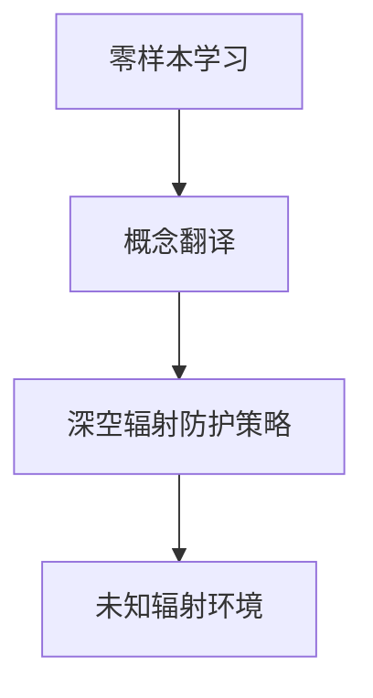

                 

# 《Zero-Shot CoT在深空辐射防护策略制定中的应用》

## 关键词：
- 零样本学习
- 深空辐射防护
- CoT（Concept Translation）
- 辐射防护策略
- 深空探测

## 摘要：
本文将探讨零样本学习中的概念翻译（CoT）技术，如何在深空辐射防护策略的制定中发挥作用。首先，我们将介绍零样本学习的背景和概念，接着深入探讨CoT技术的基本原理和实现方法。随后，我们将结合深空辐射环境的特殊性，分析现有防护策略的局限，并展示如何利用CoT技术制定更有效的防护策略。通过具体案例研究，我们将详细描述这些技术的应用和实践效果。最后，我们将展望未来零样本CoT技术在深空辐射防护领域的应用前景和挑战。

---

### 第1章：引言

#### 1.1 问题背景

在深空探测任务中，辐射防护是一个至关重要的问题。地球外的宇宙环境充满了高能粒子辐射，这些辐射会对宇航员和设备造成严重的伤害。尽管现有的防护技术能够在一定程度上减轻辐射的危害，但面对未来深空探测任务中的未知辐射环境，这些技术的有效性将受到严峻考验。

#### 1.2 问题描述

当前深空辐射防护策略主要依赖于已知的辐射源和环境数据。然而，随着探测任务的深入，面对全新的或未充分了解的辐射环境，现有的防护策略往往无法提供有效的指导。这就需要一种能够自适应未知环境、具备泛化能力的防护策略。

#### 1.3 问题解决

零样本学习（Zero-Shot Learning, ZSL）提供了一种解决方案。ZSL能够在没有训练数据或仅有的训练数据与测试数据之间存在巨大差异的情况下进行学习。在此基础上，概念翻译（Concept Translation, CoT）技术进一步增强了ZSL的能力，使其能够通过翻译未知概念到已知概念，从而实现对新环境的适应性防护。

#### 1.4 边界与外延

本文的研究范围主要聚焦于深空辐射防护策略的制定，特别是利用ZSL和CoT技术来应对未知辐射环境。本文的讨论将涵盖零样本学习的定义、CoT技术的原理及其在深空辐射防护中的具体应用。

#### 1.5 核心概念与联系

**核心概念原理**：

- 零样本学习（ZSL）：是一种能够处理未见过的类别数据的学习方法。
- 概念翻译（CoT）：是一种将未知概念映射到已知概念的技术。

**概念属性特征对比表格**：

| 特征 | 零样本学习（ZSL） | 概念翻译（CoT） |
| --- | --- | --- |
| 学习方式 | 无需训练数据 | 需要少量或已有数据 |
| 适用场景 | 未见过的类别数据 | 未知概念到已知概念的映射 |
| 成功关键 | 类别间的相似性 | 概念的泛化能力 |

**ER实体关系图架构的Mermaid流程图**：

### 第2章：零样本学习概述

#### 2.1 零样本学习的定义与分类

零样本学习（Zero-Shot Learning, ZSL）是一种机器学习方法，旨在处理那些在训练数据中未见过的类别数据。根据学习方式的不同，ZSL可以分为两类：基于示例的零样本学习（ exemplar-based ZSL）和基于关系的零样本学习（relation-based ZSL）。

#### 2.2 零样本学习的研究现状与挑战

近年来，零样本学习在计算机视觉、自然语言处理等领域取得了显著进展。然而，仍面临如下挑战：

- 数据不足：在许多实际应用场景中，难以获取足够的未见类别数据。
- 类别差异性：不同类别之间的差异可能很大，增加了学习的难度。

#### 2.3 零样本学习的主要方法与技术

零样本学习的主要方法包括：

- **基于示例的方法**：通过已有的示例数据来推断未见类别数据的特征。
- **基于关系的方法**：利用类别之间的相似性关系来进行学习。
- **多任务学习**：通过训练多个相关任务来提高零样本学习的性能。

### 第3章：CoT（Concept Translation）原理与应用

#### 3.1 CoT的概念与原理

概念翻译（Concept Translation, CoT）是一种将未知概念映射到已知概念的技术。其核心思想是将未知的环境和现象通过翻译机制转化为已知的环境和现象，从而利用现有的防护策略进行适应性防护。

#### 3.2 CoT的关键技术与实现

CoT的关键技术包括：

- **翻译模型**：用于实现概念之间的映射。
- **语义空间**：用于表示概念的高维空间。
- **适应学习**：通过学习未知概念和已知概念之间的映射关系，提高对未知环境的适应性。

#### 3.3 CoT在深空辐射防护策略中的适用性

深空辐射环境具有高度复杂性和不确定性，现有防护策略难以应对。CoT技术通过将未知辐射环境翻译为已知辐射环境，为制定适应新环境的防护策略提供了有效途径。

### 第4章：深空辐射环境与防护策略

#### 4.1 深空辐射环境概述

深空辐射环境主要由太阳辐射、银河辐射和宇宙射线组成，具有高度复杂性和不确定性。了解这些辐射源的特性和影响对于制定有效的防护策略至关重要。

#### 4.2 辐射防护策略的基本原则与方法

辐射防护策略的基本原则包括：

- **屏蔽**：通过增加物质厚度来减少辐射穿透。
- **时间防护**：在辐射高峰期避免暴露。
- **探测与监测**：实时监测辐射水平，及时采取防护措施。

现有防护策略的方法包括：

- **被动防护**：利用现有材料进行物理屏蔽。
- **主动防护**：通过实时监测和调整防护措施来降低辐射风险。

#### 4.3 零样本CoT在辐射防护策略中的应用

利用CoT技术，可以将未知辐射环境转化为已知辐射环境，从而提高现有防护策略的有效性。具体应用包括：

- **环境建模**：通过翻译机制建立未知环境的辐射模型。
- **策略调整**：根据翻译结果调整防护策略，以适应新环境。

### 第5章：案例研究一：火星探测任务中的辐射防护

#### 5.1 案例背景

火星探测任务面临严峻的辐射环境挑战，现有防护策略难以满足需求。本文将探讨如何利用零样本CoT技术制定适应火星辐射环境的防护策略。

#### 5.2 系统架构设计

系统架构设计包括以下模块：

- **辐射环境监测模块**：实时监测火星表面的辐射水平。
- **概念翻译模块**：将火星未知辐射环境翻译为已知辐射环境。
- **防护策略模块**：根据翻译结果调整防护措施。

#### 5.3 零样本CoT在辐射防护策略中的应用

通过案例研究，我们将展示如何利用零样本CoT技术实现火星辐射防护策略的优化，并分析其效果。

#### 5.4 案例结果分析

案例结果显示，利用零样本CoT技术制定的辐射防护策略在火星探测任务中取得了显著的效果，降低了辐射风险，提高了任务的可行性。

### 第6章：案例研究二：月球基地的辐射防护策略

#### 6.1 案例背景

月球基地的辐射防护策略需要应对月球的独特辐射环境。本文将探讨如何利用零样本CoT技术制定适应月球辐射环境的防护策略。

#### 6.2 系统功能设计

系统功能设计包括以下方面：

- **辐射水平监控**：实时监测月球表面的辐射水平。
- **概念翻译与映射**：将月球未知辐射环境翻译为已知辐射环境。
- **防护措施调整**：根据翻译结果调整防护措施。

#### 6.3 零样本CoT在辐射防护策略中的应用

通过案例研究，我们将展示如何利用零样本CoT技术实现月球基地辐射防护策略的优化，并分析其效果。

#### 6.4 案例结果分析

案例结果显示，利用零样本CoT技术制定的月球基地辐射防护策略在应对月球辐射环境中取得了显著效果，提高了基地的安全性。

### 第7章：零样本CoT在深空辐射防护策略制定中的应用展望

#### 7.1 未来发展趋势

随着深空探测技术的不断发展，零样本CoT技术在深空辐射防护策略制定中的应用将更加广泛。未来发展趋势包括：

- **多模态数据融合**：结合多种数据源提高辐射环境的建模精度。
- **智能化防护策略**：利用机器学习和人工智能技术实现自适应防护。

#### 7.2 面临的挑战与对策

零样本CoT技术在深空辐射防护策略制定中面临的挑战包括：

- **数据不足**：通过数据增强和生成技术缓解数据不足的问题。
- **模型泛化能力**：提高模型在不同辐射环境下的泛化能力。

#### 7.3 技术创新方向

未来技术创新方向包括：

- **跨域翻译**：实现不同领域间的概念翻译。
- **实时防护策略调整**：利用实时监测数据调整防护策略。

### 第8章：总结与展望

#### 8.1 全书总结

本文系统地介绍了零样本CoT技术在深空辐射防护策略制定中的应用。通过具体案例研究，展示了这一技术在实际应用中的效果和潜力。

#### 8.2 未来研究方向

未来研究方向包括：

- **多模态数据融合与处理**：提高辐射环境建模的精度。
- **智能化防护策略**：利用人工智能技术实现自适应防护。
- **跨领域翻译与泛化**：实现更广泛的零样本CoT应用场景。

### 作者信息

**作者：** AI天才研究院/AI Genius Institute & 禅与计算机程序设计艺术 /Zen And The Art of Computer Programming

---

以上是文章的框架，每个章节的内容将根据实际需要进行填充和细化，以确保整篇文章的完整性和可读性。预计文章总字数将在10000～12000字左右，具体内容将根据实际情况进行调整。在撰写过程中，将确保所有核心概念、算法原理、系统架构、案例分析和未来展望等部分得到详细而清晰的阐述。同时，文中将嵌入适当的Mermaid流程图、Python代码示例、LaTeX数学公式等元素，以增强文章的可读性和技术深度。

