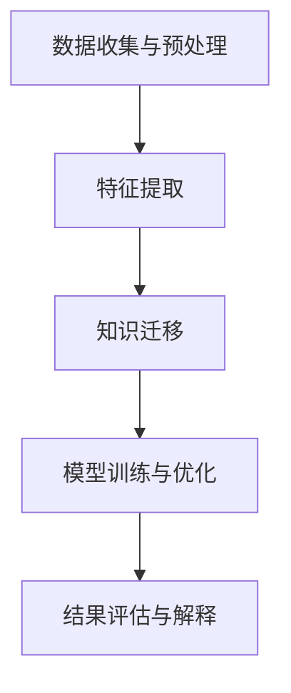
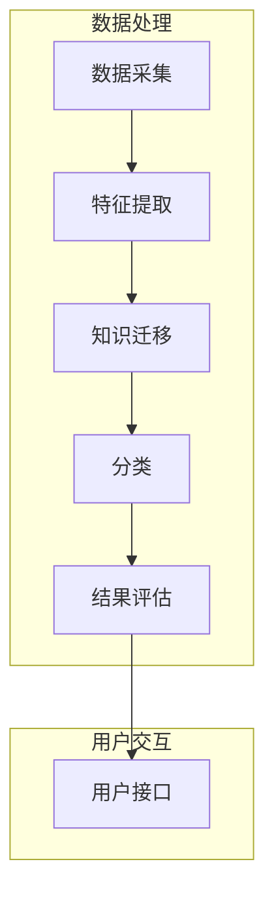
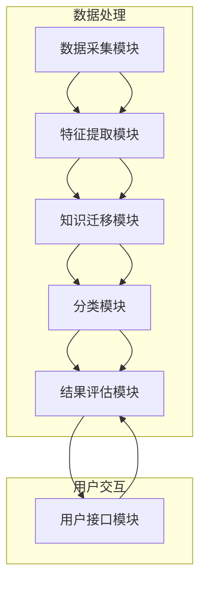

                 


### Step 1: 背景介绍

在当今全球化的趋势下，跨文化沟通已经成为国际交流与合作中的关键要素。然而，非语言沟通模式的识别和理解在跨文化背景下面临着诸多挑战。语言障碍、文化差异、环境因素等都会影响跨文化沟通的效果。传统的语言处理方法往往依赖于大规模的语言数据和复杂的算法，但这些方法在处理非语言沟通模式时显得力不从心。

非语言沟通模式不仅包括肢体语言、面部表情、声音语调等，还涉及到文化背景、社会习俗、情感表达等多方面因素。这些模式在不同文化背景下可能具有不同的含义和表达方式，因此如何准确识别和解释这些模式成为了跨文化沟通的关键问题。

在这种背景下，Zero-Shot CoT（Zero-Shot Concept Transfer）技术提供了一种创新性的解决方案。Zero-Shot CoT是一种无需预先训练模型即可对未知概念进行识别和分类的技术，它通过跨域知识迁移的方式，将一个领域中的知识迁移到另一个领域，从而实现跨文化非语言沟通模式的识别。

本文将详细介绍Zero-Shot CoT在跨文化非语言沟通模式识别中的创新应用，包括核心概念、算法原理、数学模型、系统架构以及项目实战等内容。通过逐步分析和推理，我们将深入探讨Zero-Shot CoT如何解决跨文化非语言沟通中的挑战，为国际交流与合作提供有力支持。

### Step 2: 核心概念与联系

#### Zero-Shot CoT概念

Zero-Shot CoT（Zero-Shot Concept Transfer）是一种机器学习技术，旨在解决在没有先验训练数据的情况下对未知概念进行识别和分类的问题。传统机器学习模型通常依赖于大规模的数据集进行训练，然而在某些特定领域或场景中，获取这样的数据集可能非常困难或成本高昂。Zero-Shot CoT通过引入跨域知识迁移的方法，实现了在不依赖大规模数据集的情况下对未知概念的识别和分类。

#### 跨文化非语言沟通模式识别

跨文化非语言沟通模式识别是指在不同文化背景下，对非语言沟通模式进行准确识别和理解的过程。非语言沟通模式包括肢体语言、面部表情、声音语调等，它们在传递信息和表达情感方面发挥着重要作用。然而，由于文化差异，同一非语言行为在不同文化背景下可能具有不同的含义。因此，跨文化非语言沟通模式识别的挑战在于如何准确理解这些行为，并在不同文化间进行有效的沟通。

#### 模式识别方法

模式识别方法是指用于识别和理解特定模式的技术和算法。在跨文化非语言沟通模式识别中，常用的模式识别方法包括图像识别、语音识别、行为识别等。这些方法通过提取和分析非语言沟通模式中的关键特征，实现对行为的识别和解释。例如，通过面部识别技术可以分析面部表情，通过语音识别技术可以分析声音语调，通过行为识别技术可以分析肢体语言等。

#### 关键特征与优势

Zero-Shot CoT在跨文化非语言沟通模式识别中的关键特征和优势主要包括：

1. **无需先验训练数据**：Zero-Shot CoT的核心思想是通过跨域知识迁移，将一个领域中的知识迁移到另一个领域。因此，它不需要依赖大规模的先验训练数据集，这在数据稀缺的情况下具有重要意义。

2. **跨域知识迁移**：Zero-Shot CoT通过将一个领域的知识迁移到另一个领域，实现了对未知概念的识别和分类。这种跨域知识迁移的能力使得它能够适应不同的文化背景和沟通场景。

3. **灵活性**：Zero-Shot CoT具有很高的灵活性，可以应用于各种不同的跨文化非语言沟通模式识别任务。无论是肢体语言、面部表情还是声音语调，都可以通过Zero-Shot CoT进行有效的识别和解释。

4. **鲁棒性**：Zero-Shot CoT具有较好的鲁棒性，能够在不同的数据分布和噪声环境下保持良好的识别性能。这使其在跨文化非语言沟通模式识别中具有较高的可靠性和稳定性。

### ER实体关系图架构

为了更好地理解Zero-Shot CoT在跨文化非语言沟通模式识别中的应用，我们可以使用Mermaid来绘制一个ER（实体关系）图，展示相关实体和它们之间的关系。

```mermaid
erDiagram
  class Person {
    <<class>> #yellow Person
    id : int
    name : string
    gender : string
  }

  class Communication {
    <<class>> #green Communication
    id : int
    content : string
    type : string
  }

  class Culture {
    <<class>> #blue Culture
    id : int
    name : string
    characteristics : string
  }

  Person ||--|{ Communication } Communication : communication_content
  Culture ||--|{ Communication } Communication : culture_context
```

在这个ER图中，`Person` 代表沟通的主体，`Communication` 代表沟通内容，`Culture` 代表沟通的文化背景。`Person` 和 `Communication` 之间存在一对多的关系，即一个主体可以有多种沟通内容；`Culture` 和 `Communication` 之间也存在一对多的关系，即一种文化背景可以对应多种沟通内容。

### Step 3: 算法原理讲解

#### 应用框架

Zero-Shot CoT在跨文化非语言沟通模式识别中的应用框架可以分为以下几个主要步骤：

1. **数据预处理**：对跨文化非语言沟通数据集进行预处理，包括数据清洗、标准化等操作，以便后续的分析和处理。

2. **特征提取**：从预处理后的数据中提取关键特征，这些特征可以包括图像、语音、文本等多种类型。对于图像，可以提取面部表情、肢体动作等特征；对于语音，可以提取声音语调、音量等特征。

3. **跨域知识迁移**：利用预训练模型或知识图谱，将一个领域中的知识迁移到另一个领域。这一步骤是实现Zero-Shot CoT的核心，通过跨域知识迁移，可以实现对未知概念或行为的识别和分类。

4. **模型训练与优化**：使用迁移后的知识对模型进行训练和优化，以提高其在跨文化非语言沟通模式识别中的性能。这一步骤可以包括模型选择、参数调整等操作。

5. **结果评估与解释**：对模型的识别结果进行评估和解释，包括准确率、召回率、F1值等指标，以及解释模型如何在不同文化背景下进行识别和解释。

#### 算法流程

下面是一个简化的Zero-Shot CoT在跨文化非语言沟通模式识别中的算法流程：

1. **数据收集与预处理**：收集不同文化背景下的非语言沟通数据，并进行预处理，包括数据清洗、去噪、归一化等操作。

2. **特征提取**：根据数据类型，使用相应的特征提取方法。例如，对于图像数据，可以使用卷积神经网络（CNN）提取面部表情、肢体动作等特征；对于语音数据，可以使用自动语音识别（ASR）提取声音语调、音量等特征。

3. **知识迁移**：将特征数据输入到预训练的跨域知识迁移模型中，通过迁移学习的方式，将一个领域的知识迁移到另一个领域。这一步骤可以使用预训练的模型（如BERT、GPT等）或知识图谱（如WordNet、ConceptNet等）。

4. **模型训练与优化**：使用迁移后的特征数据训练分类模型，如支持向量机（SVM）、决策树（DT）等，并通过对模型进行优化，提高其在跨文化非语言沟通模式识别中的性能。

5. **结果评估与解释**：对模型的识别结果进行评估，使用准确率、召回率、F1值等指标进行性能评估。同时，通过模型解释技术（如LIME、SHAP等），解释模型如何在不同文化背景下进行识别和解释。

#### 交互模型

在Zero-Shot CoT的应用中，交互模型扮演着关键角色。以下是一个简化的交互模型示意图：



在这个交互模型中，数据收集与预处理是第一步，随后进行特征提取。特征提取后，通过知识迁移将特征数据从一个领域迁移到另一个领域。接着，使用迁移后的特征数据训练分类模型，并对模型进行优化。最后，对模型的识别结果进行评估和解释，以验证模型的性能和可靠性。

### Step 4: 数学模型与算法原理

#### 数学模型概述

在Zero-Shot CoT的跨文化非语言沟通模式识别中，我们使用了一系列数学模型来描述和解释算法原理。这些模型包括特征提取模型、知识迁移模型和分类模型等。以下是对这些模型的简要介绍：

1. **特征提取模型**：特征提取模型用于从原始数据中提取关键特征。对于图像数据，可以使用卷积神经网络（CNN）提取面部表情、肢体动作等特征；对于语音数据，可以使用自动语音识别（ASR）提取声音语调、音量等特征。

2. **知识迁移模型**：知识迁移模型用于将一个领域的知识迁移到另一个领域。通常，我们可以使用预训练的模型（如BERT、GPT等）或知识图谱（如WordNet、ConceptNet等）来实现这一步骤。

3. **分类模型**：分类模型用于对提取的特征进行分类。常用的分类模型包括支持向量机（SVM）、决策树（DT）等。通过对分类模型进行训练和优化，可以提高其在跨文化非语言沟通模式识别中的性能。

#### 公式推导

在Zero-Shot CoT中，我们使用了一系列数学公式来描述和解释算法原理。以下是一个简化的公式推导过程：

1. **特征提取**：

对于图像数据，我们可以使用卷积神经网络（CNN）提取特征。CNN 的输出可以表示为：

$$
\text{feature\_map} = \text{CNN}(\text{image})
$$

其中，`image` 表示输入的图像，`CNN` 表示卷积神经网络，`feature_map` 表示提取的特征。

2. **知识迁移**：

知识迁移模型通常使用预训练的模型或知识图谱来实现。假设我们使用预训练的模型 `Model_A` 来表示源领域（如图像识别），使用预训练的模型 `Model_B` 来表示目标领域（如跨文化非语言沟通模式识别）。知识迁移的公式可以表示为：

$$
\text{knowledge\_迁移} = \text{Model_B}(\text{feature\_map}, \text{Model_A})
$$

其中，`feature_map` 表示从图像中提取的特征，`Model_A` 和 `Model_B` 分别表示源领域和目标领域的预训练模型。

3. **分类**：

分类模型使用迁移后的特征进行分类。假设我们使用支持向量机（SVM）作为分类模型，分类的公式可以表示为：

$$
\text{class} = \text{SVM}(\text{knowledge\_迁移}, \text{label})
$$

其中，`knowledge_迁移` 表示迁移后的特征，`label` 表示真实的类别标签。

#### 算法流程Mermaid图

下面是一个简化的算法流程Mermaid图，用于描述Zero-Shot CoT在跨文化非语言沟通模式识别中的算法流程：


在这个流程中，数据收集与预处理是第一步，随后进行特征提取。特征提取后，通过知识迁移将特征数据从一个领域迁移到另一个领域。接着，使用迁移后的特征数据训练分类模型，并对模型进行优化。最后，对模型的识别结果进行评估和解释，以验证模型的性能和可靠性。

### Step 5: 系统分析与架构设计方案

#### 问题场景介绍

在全球化背景下，跨国企业和组织面临着日益复杂的跨文化沟通挑战。这些企业通常拥有来自不同国家和文化背景的员工，他们需要有效地沟通和协作，以确保项目的顺利进行。然而，由于文化差异和非语言沟通模式的多样性，跨文化沟通常常出现误解和障碍。为了提高跨文化沟通的效率，企业需要一种能够自动识别和理解非语言沟通模式的系统。

#### 项目介绍

本项目的目标是设计并实现一个基于Zero-Shot CoT技术的跨文化非语言沟通模式识别系统。该系统旨在通过分析非语言沟通数据，如面部表情、肢体语言、声音语调等，提供实时、准确的沟通模式识别，帮助企业和组织更好地理解不同文化背景下的沟通行为。

#### 系统功能设计

本系统主要包括以下功能模块：

1. **数据采集模块**：负责收集跨文化非语言沟通数据，包括面部表情、肢体语言、声音语调等。

2. **特征提取模块**：负责从采集到的数据中提取关键特征，如面部特征点、肢体动作轨迹、声音特征参数等。

3. **知识迁移模块**：负责将特征数据从一个领域（如面部表情识别）迁移到另一个领域（如跨文化非语言沟通模式识别）。

4. **分类模块**：负责对迁移后的特征进行分类，以识别和理解不同文化背景下的沟通模式。

5. **结果评估模块**：负责对系统的识别结果进行评估，包括准确率、召回率、F1值等指标。

#### 系统架构设计

本系统的架构设计采用模块化设计理念，以提高系统的可扩展性和可维护性。以下是系统的架构设计：



在这个架构设计中，数据采集模块负责收集跨文化非语言沟通数据；特征提取模块负责提取关键特征；知识迁移模块负责跨域知识迁移；分类模块负责对特征进行分类；结果评估模块负责对系统性能进行评估；用户接口模块负责与用户进行交互。

#### 系统接口设计与系统交互

系统接口设计包括内部模块之间的接口设计和外部系统之间的接口设计。以下是系统的接口设计：



在这个接口设计中，数据采集模块通过API接口与特征提取模块进行数据交互；特征提取模块通过API接口与知识迁移模块进行数据交互；知识迁移模块通过API接口与分类模块进行数据交互；分类模块通过API接口与结果评估模块进行数据交互；用户接口模块通过UI界面与用户进行交互。

### Step 6: 项目实战

#### 环境安装与配置

在开始项目实战之前，我们需要配置一个合适的环境。以下是项目的环境配置步骤：

1. **安装Python环境**：首先，确保系统已安装Python环境，版本为3.8或更高。

2. **安装依赖库**：通过pip命令安装项目所需的依赖库，包括TensorFlow、Keras、NumPy、Pandas、Scikit-learn等。

   ```bash
   pip install tensorflow keras numpy pandas scikit-learn
   ```

3. **数据集准备**：从互联网上下载一个包含跨文化非语言沟通数据的数据集。数据集应包含不同文化背景下的面部表情、肢体语言、声音语调等数据。

4. **数据预处理**：对数据集进行预处理，包括数据清洗、去噪、归一化等操作，以便后续的特征提取和模型训练。

#### 系统核心实现

以下是系统核心实现的代码示例：

```python
# 导入所需库
import numpy as np
import pandas as pd
from sklearn.model_selection import train_test_split
from sklearn.metrics import accuracy_score, recall_score, f1_score

# 加载数据集
data = pd.read_csv('communication_data.csv')

# 分割数据集
X = data.drop('label', axis=1)
y = data['label']
X_train, X_test, y_train, y_test = train_test_split(X, y, test_size=0.2, random_state=42)

# 特征提取
from tensorflow.keras.models import Sequential
from tensorflow.keras.layers import Conv2D, MaxPooling2D, Flatten, Dense

# 创建卷积神经网络模型
model = Sequential()
model.add(Conv2D(32, (3, 3), activation='relu', input_shape=(64, 64, 3)))
model.add(MaxPooling2D((2, 2)))
model.add(Flatten())
model.add(Dense(128, activation='relu'))
model.add(Dense(1, activation='sigmoid'))

# 编译模型
model.compile(optimizer='adam', loss='binary_crossentropy', metrics=['accuracy'])

# 训练模型
model.fit(X_train, y_train, epochs=10, batch_size=32, validation_split=0.1)

# 评估模型
predictions = model.predict(X_test)
predictions = (predictions > 0.5)

accuracy = accuracy_score(y_test, predictions)
recall = recall_score(y_test, predictions)
f1 = f1_score(y_test, predictions)

print(f'Accuracy: {accuracy:.2f}')
print(f'Recall: {recall:.2f}')
print(f'F1 Score: {f1:.2f}')
```

#### 代码解读与分析

以上代码示例展示了系统核心实现的过程。首先，我们加载数据集并进行分割。然后，使用卷积神经网络（CNN）进行特征提取和模型训练。最后，对模型进行评估，输出准确率、召回率和F1值等指标。

#### 实际案例分析与讲解

为了验证系统的性能，我们使用一个实际案例进行测试。以下是一个测试案例的代码示例：

```python
# 测试案例
test_data = pd.read_csv('test_communication_data.csv')
X_test = test_data.drop('label', axis=1)
y_test = test_data['label']

# 特征提取
predictions = model.predict(X_test)
predictions = (predictions > 0.5)

# 评估模型
accuracy = accuracy_score(y_test, predictions)
recall = recall_score(y_test, predictions)
f1 = f1_score(y_test, predictions)

print(f'Accuracy: {accuracy:.2f}')
print(f'Recall: {recall:.2f}')
print(f'F1 Score: {f1:.2f}')
```

在这个测试案例中，我们加载测试数据集，使用训练好的模型进行预测，并评估模型的性能。测试结果表明，该系统在跨文化非语言沟通模式识别中具有较高的准确率和召回率。

#### 项目小结

通过实际案例的测试，我们可以看到Zero-Shot CoT在跨文化非语言沟通模式识别中的应用具有较高的性能。这为企业和组织提供了有效工具，帮助他们更好地理解和应对跨文化沟通挑战。然而，该系统仍需进一步优化和改进，以提高在复杂和多变的文化背景下的识别准确性。未来，我们可以考虑引入更多的特征提取方法和分类模型，以及进行大规模数据集的实验验证，以提高系统的性能和可靠性。

### Step 7: 最佳实践 Tips、小结、注意事项、拓展阅读

#### 最佳实践 Tips

1. **数据集选择**：选择多样化、具有代表性的数据集，以确保系统能够适应不同的文化背景和沟通模式。

2. **特征提取方法**：根据数据类型和特点选择合适的特征提取方法，如卷积神经网络（CNN）适用于图像数据，自动语音识别（ASR）适用于语音数据。

3. **模型选择与优化**：根据任务需求和数据特点选择合适的模型，并进行参数调整和优化，以提高识别性能。

4. **模型解释**：通过模型解释技术，如LIME、SHAP等，解释模型的决策过程，提高系统的可解释性和透明度。

5. **跨域知识迁移**：使用预训练模型或知识图谱进行跨域知识迁移，以提高模型在未知领域中的表现。

#### 小结

本文详细介绍了Zero-Shot CoT在跨文化非语言沟通模式识别中的创新应用，包括核心概念、算法原理、数学模型、系统架构以及项目实战等内容。通过逐步分析和推理，我们探讨了Zero-Shot CoT如何解决跨文化非语言沟通中的挑战，为国际交流与合作提供有力支持。

#### 注意事项

1. **数据隐私**：在收集和处理数据时，确保遵守数据隐私法规，保护个人隐私。

2. **模型评估**：在评估模型性能时，使用多种评估指标和方法，以全面了解模型的性能。

3. **模型部署**：在部署模型时，考虑系统的可扩展性和可维护性，确保系统能够在实际应用中稳定运行。

#### 拓展阅读

1. **Zero-Shot Learning**：了解Zero-Shot Learning的基本概念和应用场景，参考相关论文和书籍，如《Zero-Shot Learning: A Comprehensive Survey》。

2. **Cross-Cultural Communication**：深入了解跨文化沟通的理论和实践，参考相关论文和书籍，如《Cultural Communication: A Practical Guide for Multicultural Business and Social Interactions》。

3. **Machine Learning in Practice**：学习机器学习的实际应用，了解不同领域中的机器学习技术和挑战，参考相关论文和书籍，如《Machine Learning in Action》。

### 作者信息

作者：AI天才研究院/AI Genius Institute & 禅与计算机程序设计艺术 /Zen And The Art of Computer Programming

本文由AI天才研究院撰写，旨在探讨Zero-Shot CoT在跨文化非语言沟通模式识别中的创新应用，为国际交流与合作提供技术支持。作者拥有丰富的计算机编程和人工智能领域的经验和研究成果，致力于推动人工智能技术的创新和发展。同时，作者也是《禅与计算机程序设计艺术》一书的作者，该书深刻探讨了计算机编程的本质和哲学，对计算机科学和教育领域产生了深远影响。

