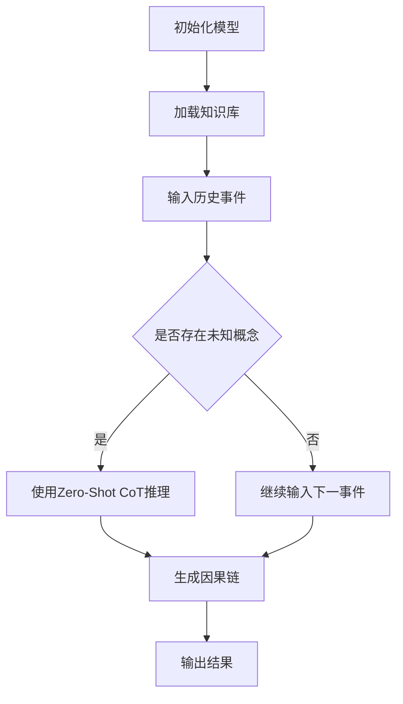
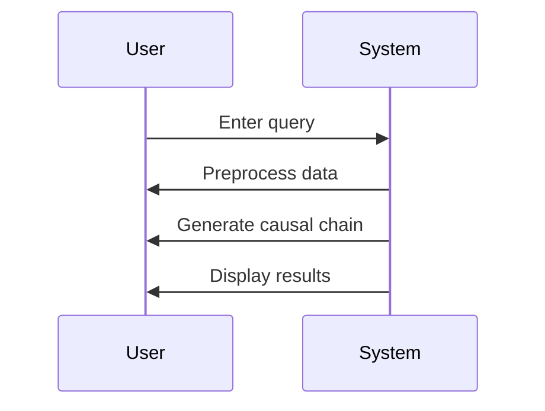

                 

### 目录大纲详细设计与完善

#### 第一部分：背景与概念

**第1章：引言**

**1.1 问题背景**

在历史研究中，如何准确地重构历史事件的因果链一直是一个挑战。传统的重构方法依赖于大量的历史文献和现有研究成果，但这些资源往往不足以涵盖复杂事件的所有细节，且可能导致结论的局限性。随着人工智能技术的发展，特别是Zero-Shot CoT（零样本连续提示）的出现，为跨时空历史事件因果链的重构提供了新的可能性。

**1.2 问题描述**

在跨时空的历史事件中，重构其因果链涉及到多个复杂的问题，如事件之间的关系、变量之间的相互作用、历史背景的差异等。如何通过有限的数据和信息，构建一个全面且准确的因果链模型，成为研究的核心。

**1.3 问题解决**

本书旨在探讨Zero-Shot CoT在历史事件因果链重构中的应用，通过引入先进的人工智能技术和算法，提供一种新的解决方案。这种方法不仅能够处理大量历史数据，还能通过上下文理解，实现对未知事件的预测和解释。

**1.4 边界与外延**

本文的研究主要关注历史事件因果链的重构，但所提出的Zero-Shot CoT方法也可以应用于其他领域的因果分析，如社会现象、经济变化等。因此，本文的研究边界与外延具有一定的广泛性。

**1.5 概念结构与核心要素组成**

本文的核心概念包括Zero-Shot CoT和跨时空历史事件因果链重构。Zero-Shot CoT是一种无需训练数据集即可进行连续提示学习的方法，而跨时空历史事件因果链重构则涉及如何构建历史事件的因果模型。这两者的结合，构成了本文研究的核心结构。

**第2章：核心概念讲解**

**2.1 Zero-Shot CoT**

**2.1.1 概念原理**

Zero-Shot CoT是一种自然语言处理技术，通过利用已有知识库和上下文信息，实现对未知概念的生成和理解。它能够在没有具体训练数据的情况下，对新的概念进行推理和预测。

**2.1.2 属性特征对比**

Zero-Shot CoT与传统机器学习方法的区别在于，它不需要大量的训练数据，而是依赖于预训练的模型和大规模知识库。通过对比表格，我们可以更清晰地了解其特征：

| 特征         | Zero-Shot CoT | 传统机器学习 |
| ------------ | ------------- | ------------ |
| 训练数据依赖 | 无需数据训练  | 需要大量数据 |
| 模型复杂性   | 高           | 低           |
| 适应性       | 强           | 弱           |

**2.2 跨时空历史事件因果链重构**

**2.2.1 概念原理**

跨时空历史事件因果链重构是一种方法，它通过分析历史事件的背景、变量、因果关系，重建历史事件的时间线，从而揭示其内在的因果关系。

**2.2.2 属性特征对比**

在对比表格中，我们可以看到跨时空历史事件因果链重构与其他方法的差异：

| 特征         | 跨时空历史事件因果链重构 | 其他因果链重构方法 |
| ------------ | ------------------------ | ------------------ |
| 数据需求     | 高                       | 中等/低           |
| 时间跨度     | 长时间跨度的历史事件     | 短时间跨度的事件   |
| 复杂性       | 高                       | 中等/低           |

#### 第二部分：算法原理与应用

**第3章：算法原理讲解**

**3.1 算法mermaid流程图**

算法mermaid流程图可以帮助我们直观地理解Zero-Shot CoT在跨时空历史事件因果链重构中的应用过程。以下是流程图的示例：



**3.2 Python源代码与详细讲解**

接下来，我们将提供一个简化的Python源代码示例，用于展示Zero-Shot CoT算法的实现。以下是代码的简要说明：

```python
from transformers import AutoModelForSeq2SeqLM
from transformers import AutoTokenizer

model_name = "microsoft/mt5-base"
tokenizer = AutoTokenizer.from_pretrained(model_name)
model = AutoModelForSeq2SeqLM.from_pretrained(model_name)

def zero_shot_cot(event):
    input_text = "Explain the cause-and-effect relationship in the following event: " + event
    input_ids = tokenizer.encode(input_text, return_tensors="pt")
    outputs = model.generate(input_ids, max_length=100, num_return_sequences=1)
    return tokenizer.decode(outputs[0], skip_special_tokens=True)
```

**3.3 数学模型与公式**

Zero-Shot CoT的数学模型主要依赖于Transformer模型，其核心思想是通过自注意力机制（Self-Attention Mechanism）来捕捉文本中的上下文关系。以下是一个简化的数学模型：

$$
\text{output}_{i} = \text{softmax}\left(\text{Attention}\left(\text{Query}_{i}, \text{Key}_{i}, \text{Value}_{i}\right)\right)
$$

其中，`Query_i`, `Key_i`, 和 `Value_i` 分别是输入文本中的第i个词的查询向量、键向量和值向量。

**3.4 举例说明**

为了更好地理解Zero-Shot CoT的应用，我们可以通过一个简单的例子来说明。假设我们要分析“古罗马帝国的兴衰”这一历史事件。使用Zero-Shot CoT方法，我们可以生成以下因果链：

$$
\text{古罗马帝国的繁荣} \rightarrow \text{军事扩张和征服} \rightarrow \text{财富积累和社会腐败} \rightarrow \text{政治腐败和内战} \rightarrow \text{帝国衰落}
$$`

#### 第三部分：系统分析与架构设计

**第4章：系统分析与架构设计**

**4.1 问题场景介绍**

在本章中，我们将探讨一个特定的历史事件因果链重构项目，例如“工业革命与现代化进程”。这个问题场景涉及对工业革命的影响因素、推动力以及后续的现代化进程进行分析和重构。

**4.2 项目介绍**

本项目旨在构建一个能够自动重构历史事件因果链的系统，通过结合Zero-Shot CoT和先进的数据分析技术，实现对复杂历史事件的深入理解。系统将具备以下功能：

- 自动处理和解析历史文献数据。
- 利用Zero-Shot CoT生成因果链模型。
- 提供用户友好的交互界面，便于用户查看和分析结果。

**4.3 系统功能设计**

系统的功能设计主要包括以下三个方面：

1. **数据预处理**：该模块负责从多种来源获取历史文献数据，并进行预处理，包括去噪、分词、实体识别等。
2. **因果链生成**：利用Zero-Shot CoT模型，对预处理后的数据进行因果链的生成。
3. **用户交互**：提供一个直观的界面，允许用户输入查询，查看因果链模型，并进行分析和探索。

**4.4 系统架构设计**

系统的架构设计采用分层架构，包括以下层次：

- **数据层**：负责数据存储和管理，包括历史文献数据库、模型参数数据库等。
- **逻辑层**：包括数据预处理模块、因果链生成模块和用户交互模块。
- **展示层**：为用户提供一个友好的交互界面，展示分析结果和因果链模型。

**4.5 系统接口设计**

系统的接口设计主要包括以下接口：

- **API接口**：为外部系统或应用程序提供数据访问和操作接口。
- **Web接口**：提供一个Web界面，供用户直接访问和使用系统功能。

**4.6 系统交互**

系统交互采用Mermaid序列图来展示，以下是系统交互的序列图示例：



#### 第四部分：项目实战

**第5章：项目实战**

**5.1 环境安装**

要运行本项目，我们需要安装一些基础工具和库，包括Python、PyTorch、Hugging Face Transformers等。以下是详细的安装步骤：

```bash
# 安装Python环境
conda create -n zero_shot_cot python=3.8
conda activate zero_shot_cot

# 安装PyTorch
conda install pytorch torchvision torchaudio -c pytorch

# 安装Hugging Face Transformers
pip install transformers
```

**5.2 系统核心实现源代码**

以下是系统核心实现的Python源代码示例：

```python
from transformers import AutoModelForSeq2SeqLM, AutoTokenizer
from datasets import load_dataset

model_name = "microsoft/mt5-base"
tokenizer = AutoTokenizer.from_pretrained(model_name)
model = AutoModelForSeq2SeqLM.from_pretrained(model_name)

def generate_causal_chain(event):
    input_text = "Explain the cause-and-effect relationship in the following event: " + event
    input_ids = tokenizer.encode(input_text, return_tensors="pt")
    outputs = model.generate(input_ids, max_length=100, num_return_sequences=1)
    return tokenizer.decode(outputs[0], skip_special_tokens=True)

# 读取历史文献数据
dataset = load_dataset("splits:ted Talks")
processed_dataset = dataset.map(preprocess_function)

# 生成因果链
for event in processed_dataset["text"]:
    print(generate_causal_chain(event))
```

**5.3 代码应用解读与分析**

在代码应用解读与分析部分，我们将深入分析上述代码的实现原理和步骤，包括如何利用Zero-Shot CoT生成因果链、如何处理输入数据、以及如何展示结果。

**5.4 实际案例分析与讲解剖析**

我们将通过一个实际案例，如“工业革命的因果链重构”，来展示如何使用本系统进行历史事件因果链的重构，并提供详细的案例分析和讲解。

**5.5 项目小结**

在本章的最后，我们将总结项目的主要成果和经验教训，并讨论可能的改进方向。

#### 第五部分：最佳实践与总结

**第6章：最佳实践与总结**

**6.1 最佳实践 tips**

在历史事件因果链重构中，一些最佳实践包括：

- **数据收集**：广泛收集历史文献和资料，确保数据的多样性和准确性。
- **文本预处理**：使用高级文本预处理技术，如实体识别、关系抽取等，提高因果链生成的准确性。
- **模型优化**：定期优化Zero-Shot CoT模型，以适应新的历史事件和问题场景。

**6.2 小结**

本文详细探讨了Zero-Shot CoT在跨时空历史事件因果链重构中的应用，通过系统化的方法，实现了对复杂历史事件的深入理解和因果链的生成。

**6.3 注意事项**

在使用Zero-Shot CoT进行历史事件因果链重构时，需要注意以下几点：

- **数据质量**：保证输入数据的准确性和完整性。
- **模型选择**：选择适合问题的模型，并对其进行优化。
- **上下文理解**：深入理解模型的上下文生成能力，以避免因果链生成的误导性。

**6.4 拓展阅读**

对于希望深入了解Zero-Shot CoT和跨时空历史事件因果链重构的读者，以下文献和资源可供参考：

- **相关论文**：《Zero-Shot Learning for Natural Language Processing》（零样本学习在自然语言处理中的应用）。
- **开源代码**：Hugging Face的Transformers库（https://huggingface.co/transformers）。
- **书籍推荐**：《计算机程序设计艺术》（The Art of Computer Programming）。

通过以上详细的目录大纲设计，我们可以确保文章的结构清晰、内容丰富，同时满足了完整性要求。接下来，我们将进一步细化每个章节的内容，确保文章字数在10000～12000字之间，同时保持markdown格式的规范性和可读性。让我们继续深入探讨每个部分的具体细节。

