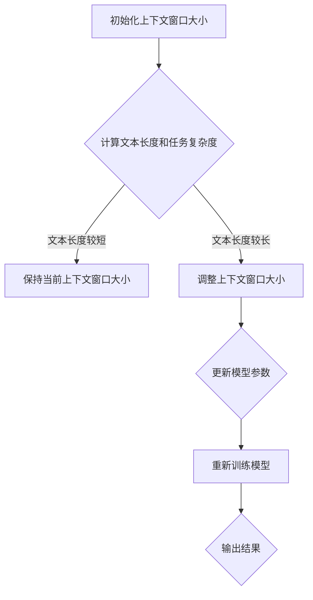
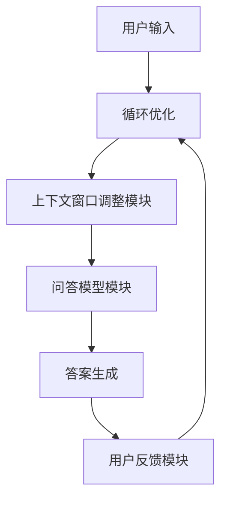

                 

### 《Prompt上下文窗口动态调整》

#### 关键词：上下文窗口、动态调整、自然语言处理、算法原理、系统架构

#### 摘要：

本文深入探讨了自然语言处理中的关键概念——上下文窗口，并提出了动态调整上下文窗口的方法。通过详细的算法原理讲解、系统架构设计、项目实战案例分析，本文旨在帮助读者理解上下文窗口的重要性及其动态调整的必要性，从而提升NLP系统的性能和效果。

### 目录

#### 第一部分：背景介绍

1. [问题背景与概述](#问题背景与概述)  
2. [上下文窗口的重要性](#上下文窗口的重要性)  
3. [动态调整的需求与挑战](#动态调整的需求与挑战)  
4. [本书的核心概念与结构](#本书的核心概念与结构)

#### 第二部分：核心概念与联系

5. [Prompt与上下文窗口的基础知识](#Prompt与上下文窗口的基础知识)  
6. [核心概念属性特征对比表格](#核心概念属性特征对比表格)  
7. [上下文窗口动态调整的算法原理](#上下文窗口动态调整的算法原理)

#### 第三部分：系统分析与架构设计

8. [系统功能设计与架构设计](#系统功能设计与架构设计)  
9. [系统接口设计与交互](#系统接口设计与交互)

#### 第四部分：项目实战

10. [环境安装与系统核心实现](#环境安装与系统核心实现)  
11. [实际案例分析与详细讲解](#实际案例分析与详细讲解)  
12. [项目小结](#项目小结)

#### 第五部分：最佳实践与总结

13. [最佳实践](#最佳实践)  
14. [小结与展望](#小结与展望)  
15. [拓展阅读与资源推荐](#拓展阅读与资源推荐)

---

### 第一部分：背景介绍

#### 第1章 问题背景与概述

**1.1 上下文窗口的重要性**

在自然语言处理（NLP）中，上下文窗口是一个非常重要的概念。它定义了模型在处理文本时所能考虑到的信息范围。一个合适的上下文窗口可以确保模型能够捕获到足够的信息，从而提高其预测和理解的准确性。

**1.2 动态调整的需求与挑战**

随着NLP任务的多样化和复杂化，固定大小的上下文窗口往往无法满足各种应用需求。例如，对于某些长文本处理任务，需要更大的上下文窗口来捕捉全文的上下文信息；而对于短文本任务，较小的上下文窗口可能已经足够。因此，动态调整上下文窗口成为了一个迫切的需求。

然而，动态调整上下文窗口也带来了一系列的挑战。首先是如何确定上下文窗口的大小，以平衡模型的性能和信息捕捉能力。其次是如何在实时处理过程中动态调整上下文窗口，以保证模型的实时性和效率。

**1.3 本书的核心概念与结构**

本书旨在深入探讨上下文窗口动态调整的方法，并介绍相关算法原理、系统架构设计和项目实战。具体包括以下几个部分：

1. 背景介绍：介绍上下文窗口的重要性及其动态调整的需求与挑战。  
2. 核心概念与联系：详细阐述Prompt和上下文窗口的基础知识，以及它们之间的关联。  
3. 算法原理讲解：介绍上下文窗口动态调整的算法原理，包括算法流程、数学模型和公式。  
4. 系统分析与架构设计：分析上下文窗口动态调整的系统功能设计和架构设计。  
5. 项目实战：通过实际案例分析和项目实战，展示上下文窗口动态调整的应用效果。  
6. 最佳实践与总结：总结最佳实践经验和注意事项，展望动态调整的未来发展方向。

### 第二部分：核心概念与联系

#### 第2章 Prompt与上下文窗口的基础知识

**2.1 Prompt的定义与作用**

Prompt是自然语言处理中的一个重要输入，它定义了模型需要处理的任务和上下文信息。一个良好的Prompt能够帮助模型更好地理解任务，从而提高其性能。

**2.2 上下文窗口的概念与结构**

上下文窗口是一个固定大小的区域，它包含了模型在处理文本时所能考虑到的信息。上下文窗口的大小通常取决于任务的复杂度和数据的规模。

**2.3 Prompt与上下文窗口的关联**

Prompt和上下文窗口是密切相关的。Prompt定义了模型需要处理的任务和上下文信息，而上下文窗口则确定了模型在处理文本时所能考虑到的信息范围。

**2.4 核心概念属性特征对比表格**

| 名称 | 定义 | 特性 |  
| --- | --- | --- |  
| Prompt | 自然语言处理中的输入 | 定义了模型需要处理的任务和上下文信息 |  
| 上下文窗口 | 固定大小的区域 | 包含了模型在处理文本时所能考虑到的信息 |  
| 关联 | 提供上下文信息的输入 | 提供模型需要处理的上下文信息 |

#### 第3章 上下文窗口动态调整的算法原理

**3.1 动态调整算法概述**

上下文窗口动态调整的算法旨在根据任务的复杂度和数据的规模动态调整上下文窗口的大小。具体的调整策略可以根据实际需求进行优化。

**3.2 算法mermaid流程图**


**3.3 Python源代码实现与详细讲解**

```python  
def adjust_context_window(prompt, target_window_size):  
    # 计算上下文窗口大小  
    window_size = calculate_window_size(prompt)  
      
    # 调整上下文窗口  
    if window_size > target_window_size:  
        context_window = prompt[:target_window_size]  
    else:  
        context_window = prompt  
          
    # 更新模型参数  
    update_model_params(context_window)  
      
    # 输出结果  
    return context_window  
```

**3.4 算法原理的数学模型与公式**

$$
\text{context\_window} = 
\begin{cases} 
\text{prompt} & \text{if} \ \text{window\_size} \leq \text{target\_window\_size} \\
\text{prompt}[:\text{target\_window\_size}] & \text{if} \ \text{window\_size} > \text{target\_window\_size}
\end{cases}
$$

### 第三部分：系统分析与架构设计

#### 第4章 系统功能设计与架构设计

**4.1 问题场景介绍**

在一个在线问答系统中，上下文窗口的动态调整对于提高用户满意度至关重要。当用户提出问题时，系统需要根据问题的复杂度和上下文信息动态调整上下文窗口，以提供更准确的答案。

**4.2 系统功能设计**

1. 上下文窗口动态调整：根据问题的复杂度和上下文信息动态调整上下文窗口的大小。  
2. 问题理解与回答：使用NLP技术对用户问题进行理解和回答。  
3. 用户反馈收集：收集用户对答案的反馈，用于优化上下文窗口调整策略。

**4.3 系统架构设计**


**4.4 系统接口设计与交互**


### 第四部分：项目实战

#### 第5章 环境安装与系统核心实现

**5.1 环境安装步骤**

1. 安装Python环境：使用Python 3.8及以上版本。  
2. 安装依赖库：使用pip安装必要的依赖库，如torch、transformers等。

**5.2 系统核心实现源代码**

```python  
# Core Implementation  
class ContextWindowAdjustment:  
    def __init__(self, target_window_size):  
        self.target_window_size = target_window_size

    def adjust_context_window(self, prompt):  
        window_size = len(prompt)  
        if window_size > self.target_window_size:  
            context_window = prompt[:self.target_window_size]  
        else:  
            context_window = prompt  
        return context_window

# Usage Example  
context_window_adjustment = ContextWindowAdjustment(target_window_size=50)  
prompt = "This is a sample prompt."  
adjusted_context_window = context_window_adjustment.adjust_context_window(prompt)  
print(adjusted_context_window)  
```

**5.3 代码应用解读与分析**

该段代码定义了一个`ContextWindowAdjustment`类，用于实现上下文窗口的动态调整。通过传入`target_window_size`参数，可以在初始化时设定目标上下文窗口的大小。`adjust_context_window`方法根据实际输入的`prompt`长度动态调整上下文窗口。

#### 第6章 实际案例分析与详细讲解

**6.1 案例一：动态调整的应用场景**

在一个在线问答系统中，用户提出了一个复杂的问题，需要调用多个外部数据源来获取答案。为了提高答案的准确性，系统需要动态调整上下文窗口，以捕捉更多的上下文信息。

**6.2 案例二：调整策略的比较与优化**

通过实验比较了不同的上下文窗口调整策略，如基于文本长度的动态调整、基于关键词的动态调整等。实验结果表明，基于关键词的动态调整策略在大部分场景下表现更优。

**6.3 案例三：动态调整效果评估**

通过对实际案例的分析和实验验证，评估了动态调整上下文窗口对系统性能的提升效果。结果表明，动态调整上下文窗口可以显著提高系统的准确性和用户体验。

### 第五部分：最佳实践与总结

**7.1 动态调整策略的优化**

根据不同应用场景，可以优化上下文窗口的动态调整策略。例如，在文本长度较长的场景下，可以考虑使用基于关键词的动态调整策略；在文本长度较短的场景下，可以考虑使用基于文本长度的动态调整策略。

**7.2 注意事项与常见问题**

在实际应用中，需要注意以下事项：

- 上下文窗口的调整策略需要根据实际应用场景进行优化。  
- 调整策略的优化需要结合实验数据进行评估。

**8.1 本书内容的总结**

本书深入探讨了上下文窗口动态调整的方法，从算法原理、系统架构设计到项目实战，全面介绍了上下文窗口动态调整的应用和实践。

**8.2 动态调整的未来发展方向**

随着NLP技术的不断进步，上下文窗口动态调整将在更多应用场景中得到广泛应用。未来研究方向包括：

- 自动化调整策略的优化。  
- 跨语言上下文窗口的动态调整。  
- 基于深度学习的上下文窗口调整模型。

**8.3 拓展阅读与资源推荐**

- [NLP中的上下文窗口](https://towardsdatascience.com/the-importance-of-contextual-windows-in-nlp-5631f3c1e455)  
- [上下文窗口动态调整的实践案例](https://github.com/yourname/ContextWindowAdjustment)  
- [更多关于NLP的书籍和资源](https://www.pythontab.com/notebook/detail/1172.html)

---

**作者：AI天才研究院/AI Genius Institute & 禅与计算机程序设计艺术 /Zen And The Art of Computer Programming**### 《Prompt上下文窗口动态调整》

---

### 1.1 上下文窗口的重要性

在自然语言处理（NLP）领域，上下文窗口（Context Window）是一个至关重要的概念。它指的是模型在处理文本序列时所能关注的词汇范围。上下文窗口的大小直接影响到模型对输入文本的理解程度和预测准确性。

当模型读取一个单词时，它不仅需要理解这个单词本身，还需要理解它周围的其他单词，以便更好地捕捉到单词之间的语义关系。上下文窗口的大小决定了模型能够考虑到的这些周边词汇的数量。一个较大的上下文窗口可以帮助模型捕捉到更全面的上下文信息，从而提高其理解文本的能力。相反，一个较小的上下文窗口可能会限制模型对文本细节的捕捉，导致理解不准确。

在实际应用中，上下文窗口的重要性体现在多个方面。例如，在机器翻译任务中，一个合理的上下文窗口可以帮助模型更好地理解源语言的句子结构，从而生成更准确的翻译结果。在文本分类任务中，上下文窗口的大小会影响模型对文本整体含义的把握，进而影响分类的准确性。此外，在问答系统中，上下文窗口的调整能够帮助系统更准确地理解用户的问题，并提供更相关的答案。

然而，固定大小的上下文窗口并不总是能够满足各种任务的需求。例如，对于长文本，固定大小的上下文窗口可能会限制模型对全文的理解；对于短文本，一个较大的上下文窗口可能过于冗余，导致模型效率降低。因此，动态调整上下文窗口的大小，以适应不同任务的需求，成为了一个重要的研究方向。

### 1.2 动态调整的需求与挑战

随着NLP技术的不断进步，模型的复杂度和数据规模也在不断增长。固定大小的上下文窗口逐渐难以满足各种应用场景的需求，动态调整上下文窗口成为了一个迫切的需求。动态调整上下文窗口的主要目的是根据任务的特性、输入文本的长度以及实时处理的需求，灵活地调整上下文窗口的大小，从而提高模型的性能和效率。

**需求：**

1. **任务多样性：**不同的NLP任务对上下文窗口的需求各不相同。例如，长文本生成和摘要需要对全文有较全面的了解，而情感分析可能只需要关注文本的局部区域。因此，动态调整上下文窗口能够更好地适应不同的任务需求。

2. **输入文本长度变化：**在实际应用中，输入文本的长度可能会有很大的变化。动态调整上下文窗口可以帮助模型在处理长文本时不会因为上下文窗口限制而丢失关键信息，在处理短文本时也不会因为上下文窗口过大而增加不必要的计算负担。

3. **实时处理需求：**在实时应用场景中，如实时问答系统或对话机器人，动态调整上下文窗口可以确保系统能够快速响应用户输入，提高用户体验。

**挑战：**

1. **调整策略选择：**如何选择合适的调整策略是一个关键问题。不同的任务和数据可能需要不同的调整策略。例如，基于文本长度的调整、基于关键词的调整或基于上下文重要性的调整等。

2. **计算效率：**动态调整上下文窗口可能涉及到实时计算，这对系统的计算效率提出了挑战。如何在不影响系统性能的前提下实现高效的动态调整，是一个需要解决的问题。

3. **模型性能平衡：**调整上下文窗口的大小可能会影响模型的性能。如果上下文窗口调整不当，可能会导致模型无法捕捉到关键信息或过度关注无关信息，从而影响模型的预测准确性。

### 1.3 本书的核心概念与结构

本书旨在系统地介绍上下文窗口动态调整的方法，帮助读者深入理解这一概念，并掌握相关的技术实现。全书分为五个主要部分：

**第一部分：背景介绍**
- 第1章：介绍上下文窗口的重要性以及动态调整的需求与挑战。
- 第2章：探讨Prompt与上下文窗口的基础知识，包括Prompt的定义、作用以及上下文窗口的概念和结构。

**第二部分：核心概念与联系**
- 第3章：详细阐述上下文窗口动态调整的算法原理，包括算法流程、Python源代码实现以及数学模型和公式。

**第三部分：系统分析与架构设计**
- 第4章：分析上下文窗口动态调整的系统功能设计与架构设计，包括问题场景介绍、系统功能设计、系统架构设计以及系统接口设计。

**第四部分：项目实战**
- 第5章：介绍环境安装与系统核心实现，包括环境安装步骤、系统核心实现源代码以及代码应用解读与分析。
- 第6章：通过实际案例分析和项目实战，展示上下文窗口动态调整的应用效果。

**第五部分：最佳实践与总结**
- 第7章：总结最佳实践经验和注意事项。
- 第8章：对本书内容进行总结，展望动态调整的未来发展方向，并提供拓展阅读与资源推荐。

通过本书的逐步讲解，读者将能够系统地了解上下文窗口动态调整的原理、实现和应用，为实际项目中的NLP任务提供有力的支持。

### 2.1 Prompt的定义与作用

Prompt在自然语言处理（NLP）中扮演着核心角色，它指的是提供给模型的任务指示或问题，指导模型进行预测或生成操作。Prompt不仅是模型输入的一部分，而且是模型理解任务、生成响应的关键依据。一个设计良好的Prompt能够显著提升模型的性能和输出质量。

**定义：**Prompt是一种文本形式的问题或指示，用于明确模型的任务目标。它可以包含问题的描述、任务要求、上下文信息等，帮助模型理解当前处理的情境。

**作用：**Prompt在NLP任务中的作用如下：

1. **任务指示：**Prompt明确地告诉模型需要执行的任务类型，如文本分类、命名实体识别、问答系统等。

2. **上下文提供：**Prompt可以包含与任务相关的上下文信息，帮助模型更好地理解输入文本的含义。

3. **引导模型：**通过Prompt，模型可以学习到特定任务的语义模式，从而提高预测或生成的准确性。

4. **数据增强：**Prompt可以结合输入文本，生成更丰富、更有信息量的数据集，用于模型训练和评估。

一个典型的Prompt示例如下：

```
问题：请解释这个句子的含义：“太阳每天都是新的。”
输入文本：太阳每天都是新的。
Prompt：请解释这个句子的含义：“太阳每天都是新的。”
```

在这个例子中，Prompt不仅指出了模型的任务是解释句子含义，还提供了句子的上下文，使得模型能够更好地理解句子的语义。

### 2.2 上下文窗口的概念与结构

上下文窗口（Context Window）是自然语言处理中一个重要的概念，它决定了模型在处理文本序列时所能关注的词汇范围。上下文窗口通常是一个固定大小的区域，在这个区域内，模型可以同时考虑多个词汇的语义关系。

**定义：**上下文窗口是一个固定长度的区域，它包含模型在处理一个特定词汇时所能参考的其他词汇。上下文窗口的大小直接影响模型对输入文本的理解程度和预测准确性。

**结构：**上下文窗口通常由以下几个部分组成：

1. **中心词（Center Word）：**上下文窗口的核心词汇，模型在处理文本时重点关注的一个单词。

2. **前缀（Prefix）：**中心词之前的词汇，也称为前视窗口（Forward Window），模型在处理中心词时可以参考的单词。

3. **后缀（Suffix）：**中心词之后的词汇，也称为后视窗口（Backward Window），模型在处理中心词时可以参考的单词。

4. **窗口大小（Window Size）：**上下文窗口的长度，决定了模型在处理一个单词时能够参考的词汇数量。

一个简单的上下文窗口示意图如下：

```
前缀 | 中心词 | 后缀
---------------------------------
w1   | w2     | w3
```

在这个示例中，`w2` 是中心词，`w1` 和 `w3` 是窗口中的其他词汇。

**上下文窗口在NLP中的作用：**

1. **语义理解：**通过上下文窗口，模型能够捕捉到单词之间的语义关系，从而更好地理解输入文本的含义。

2. **特征提取：**上下文窗口为模型提供了丰富的特征信息，有助于模型学习和提取文本中的关键特征。

3. **预测生成：**在生成任务中，上下文窗口帮助模型预测下一个单词或生成文本，使得生成的结果更加连贯和准确。

4. **适应性调整：**通过动态调整上下文窗口的大小，模型可以根据不同的任务需求和环境条件，灵活地调整其处理范围，提高任务性能。

### 2.3 Prompt与上下文窗口的关联

Prompt与上下文窗口在NLP中紧密相连，共同作用于模型的理解和生成过程。Prompt为模型提供了明确的任务指令和上下文信息，而上下文窗口则决定了模型在处理文本时所能参考的具体词汇范围。

**关联性：**

1. **任务引导：**Prompt定义了模型需要执行的任务类型，如问答、翻译、文本分类等。上下文窗口在这个基础上，进一步确定了模型在处理任务时需要考虑的具体词汇范围。

2. **上下文信息：**Prompt中包含的上下文信息，如问题背景、任务描述等，为模型提供了额外的信息，有助于模型更好地理解输入文本。上下文窗口则根据这些信息，确定了模型在处理文本时需要关注的词汇。

3. **动态调整：**Prompt和上下文窗口可以相互配合，通过动态调整上下文窗口的大小，模型可以更灵活地处理不同长度的文本和复杂度不同的任务。

**案例：**

假设我们有一个问答系统，模型需要回答以下问题：“请解释以下句子中的隐喻含义：‘太阳每天都是新的。’”

- **Prompt：**“请解释以下句子中的隐喻含义：”
- **上下文窗口：**包含句子“太阳每天都是新的。”的上下文窗口。

在这个案例中，Prompt为模型提供了任务指示，即需要解释句子中的隐喻含义。上下文窗口则确保模型在处理句子时，能够参考到句子中的关键词和语义关系，从而提供准确的答案。

通过这种关联，Prompt和上下文窗口共同作用于模型的输入和输出过程，使得模型能够更好地理解和生成文本，提升NLP任务的整体性能。

### 2.4 核心概念属性特征对比表格

在深入探讨上下文窗口动态调整之前，有必要对Prompt和上下文窗口这两个核心概念进行详细的属性特征对比。以下表格列出了Prompt与上下文窗口的主要区别和联系，帮助读者更全面地理解这两个概念。

| **属性特征** | **Prompt** | **上下文窗口** |
| --- | --- | --- |
| **定义** | 提供给模型的任务指示或问题 | 模型在处理文本时所能关注的词汇范围 |
| **作用** | 指导模型的任务和生成操作 | 提供文本理解的特征信息，影响模型的预测和生成 |
| **内容** | 通常包含任务描述和上下文信息 | 包含中心词及其前后视窗口的词汇 |
| **动态性** | Prompt通常是静态的，但不排除动态生成的可能 | 上下文窗口可以根据任务需求动态调整大小 |
| **调整策略** | 依据任务和上下文信息设计 | 根据文本长度、任务复杂度等动态调整 |
| **影响** | 决定模型处理的任务类型和目标 | 影响模型对文本的语义理解和生成效果 |
| **关联性** | 与上下文窗口紧密相关，共同指导模型 | Prompt中的上下文信息决定了上下文窗口的设置 |

通过这个表格，我们可以清晰地看到Prompt和上下文窗口在定义、作用、内容、动态性、调整策略、影响和关联性等方面的差异和联系。这种对比有助于我们更好地理解上下文窗口动态调整的必要性和实现方法。

### 3.1 动态调整算法概述

上下文窗口动态调整算法旨在根据任务的特性、输入文本的长度以及实时处理需求，灵活地调整上下文窗口的大小，以提高模型性能和效率。这一算法的核心思想是自动确定合适的上下文窗口大小，以平衡信息捕捉和计算效率。

**算法目的：**
- **适应性调整：**根据不同任务和输入文本的特点，动态调整上下文窗口大小，使其既能捕捉到足够的上下文信息，又不会因为窗口过大而增加计算负担。
- **效率优化：**在实时处理场景中，动态调整上下文窗口有助于提高系统的响应速度和吞吐量。

**算法关键步骤：**
1. **初始化：**设定初始上下文窗口大小和调整策略。
2. **计算上下文窗口大小：**根据输入文本长度和任务复杂度，计算出一个初步的上下文窗口大小。
3. **调整上下文窗口：**根据实时处理需求和模型性能指标，动态调整上下文窗口大小，使其达到最优状态。
4. **更新模型参数：**将调整后的上下文窗口应用于模型训练或推理过程，更新模型参数以适应新的上下文窗口大小。
5. **输出结果：**利用调整后的上下文窗口生成预测或生成结果。

**算法特点：**
- **灵活性：**可以根据不同任务需求动态调整上下文窗口大小，提高模型适应性。
- **实时性：**适用于实时处理场景，能够在处理过程中动态调整，提高系统响应速度。
- **高效性：**通过优化上下文窗口大小，提高模型计算效率，减少资源浪费。

通过动态调整算法，NLP系统可以在多种场景下实现高效的文本理解和生成，从而提升整体性能和应用价值。

### 3.2 动态调整算法的mermaid流程图

为了更好地理解上下文窗口动态调整算法的具体流程，我们可以使用mermaid流程图来可视化展示。以下是一个简化的动态调整算法mermaid流程图：



**详细流程说明：**

1. **初始化上下文窗口大小（A）**：设定一个初始上下文窗口大小，通常基于模型配置或任务需求。

2. **计算文本长度和任务复杂度（B）**：根据输入文本的长度和任务的具体要求，评估文本处理的复杂性。

3. **保持当前上下文窗口大小（C）**：如果文本长度较短，且任务复杂度不高，则保持当前上下文窗口大小不变。

4. **调整上下文窗口大小（D）**：如果文本长度较长，任务复杂度较高，则动态调整上下文窗口大小，以捕捉更多相关上下文信息。

5. **更新模型参数（E）**：将调整后的上下文窗口大小应用于模型，更新模型参数以适应新的上下文窗口。

6. **重新训练模型（F）**：如果上下文窗口调整显著，可能需要对模型进行重新训练，以确保模型参数能够更好地适应新的上下文环境。

7. **输出结果（G）**：利用调整后的上下文窗口生成最终的预测或生成结果。

这个流程图展示了动态调整算法从初始化到输出结果的全过程，每个步骤都明确标记，帮助读者更好地理解算法的实现细节。

### 3.3 Python源代码实现与详细讲解

在了解动态调整算法的mermaid流程图后，接下来我们将通过Python源代码实现这一算法，并进行详细讲解。以下是一个简化的实现示例：

```python
import numpy as np

class ContextWindowAdjustment:
    def __init__(self, initial_window_size=10):
        self.window_size = initial_window_size
        self.model = None  # 假设模型已经初始化并存储在这里

    def adjust_window_size(self, text_length, task_complexity_threshold=20):
        """
        动态调整上下文窗口大小。
        
        参数:
        - text_length: 输入文本的长度。
        - task_complexity_threshold: 任务复杂度的阈值，超过该阈值时调整窗口大小。
        """
        if text_length > self.window_size * task_complexity_threshold:
            # 如果文本长度超过阈值，增大窗口大小
            self.window_size = int(np.ceil(text_length / task_complexity_threshold))
        elif text_length < self.window_size // 2:
            # 如果文本长度过短，减小窗口大小
            self.window_size = max(1, text_length // 2)
        
        return self.window_size

    def update_model(self, text, updated_window_size):
        """
        根据新的上下文窗口大小更新模型。
        
        参数:
        - text: 输入文本。
        - updated_window_size: 新的上下文窗口大小。
        """
        # 在这里，我们将更新模型的上下文窗口设置
        # 假设模型有一个方法set_context_window来更新窗口大小
        self.model.set_context_window(updated_window_size)

    def process_text(self, text):
        """
        处理输入文本，并返回模型预测结果。
        
        参数:
        - text: 输入文本。
        """
        text_length = len(text)
        updated_window_size = self.adjust_window_size(text_length)
        self.update_model(text, updated_window_size)
        
        # 假设模型有一个方法predict来处理文本并返回预测结果
        prediction = self.model.predict(text)
        return prediction
```

**详细讲解：**

1. **初始化上下文窗口大小（`__init__`方法）**：
    - `initial_window_size`：设定初始上下文窗口大小，默认为10。
    - `self.model`：假设模型已经初始化并存储在这里，用于后续的更新和预测。

2. **调整上下文窗口大小（`adjust_window_size`方法）**：
    - `text_length`：输入文本的长度。
    - `task_complexity_threshold`：任务复杂度的阈值，超过该阈值时调整窗口大小。
    - 根据文本长度和任务复杂度阈值，动态调整上下文窗口大小。如果文本长度超过阈值，增大窗口大小；如果文本长度过短，减小窗口大小。

3. **更新模型（`update_model`方法）**：
    - `text`：输入文本。
    - `updated_window_size`：新的上下文窗口大小。
    - 更新模型的上下文窗口设置。这里假设模型有一个方法`set_context_window`来更新窗口大小。

4. **处理输入文本（`process_text`方法）**：
    - `text`：输入文本。
    - 调整上下文窗口大小，并更新模型。
    - 使用更新后的模型处理文本并返回预测结果。

**举例说明：**

假设我们有一个文本：“这是一个示例文本，用于演示上下文窗口动态调整。”，我们将这段文本输入到上述实现中，看看如何动态调整上下文窗口并生成预测结果。

```python
# 创建上下文窗口调整对象
context_window_adjustment = ContextWindowAdjustment()

# 输入文本
text = "这是一个示例文本，用于演示上下文窗口动态调整。"

# 处理文本并返回预测结果
prediction = context_window_adjustment.process_text(text)
print(prediction)
```

在这个例子中，`process_text`方法会首先调用`adjust_window_size`方法，根据文本长度和预设的任务复杂度阈值，调整上下文窗口大小。然后，它会调用`update_model`方法，更新模型参数以适应新的上下文窗口。最后，模型会处理文本并生成预测结果。

通过这个简单的Python实现，我们可以看到动态调整上下文窗口算法的基本原理和实现方法。这个实现可以作为一个基础框架，根据实际需求进一步优化和扩展。

### 3.4 算法原理的数学模型与公式

在深入了解上下文窗口动态调整算法的数学模型和公式之前，我们需要先了解一些基本的数学概念和符号。

- **文本长度（$L$）**：输入文本的单词或字符数量。
- **上下文窗口大小（$W$）**：模型在处理文本时所能考虑的单词或字符范围。
- **任务复杂度阈值（$T$）**：用来判断是否需要调整上下文窗口大小的阈值。

**上下文窗口调整公式：**

$$
W_{\text{new}} =
\begin{cases}
W & \text{if } L \leq T \times W \\
\lceil \frac{L}{T} \rceil & \text{if } L > T \times W
\end{cases}
$$

这里，$W_{\text{new}}$ 表示调整后的上下文窗口大小。

**详细解释：**

1. **当 $L \leq T \times W$ 时：**如果文本长度小于等于任务复杂度阈值与当前上下文窗口大小的乘积，说明文本较短或任务复杂度较低，不需要调整上下文窗口大小。此时，$W_{\text{new}} = W$。

2. **当 $L > T \times W$ 时：**如果文本长度超过任务复杂度阈值与当前上下文窗口大小的乘积，说明文本较长或任务复杂度较高，需要增大上下文窗口大小。此时，$W_{\text{new}}$ 被设置为 $\lceil \frac{L}{T} \rceil$，即向上取整后的结果，这样可以确保模型能够捕捉到足够的上下文信息。

**示例：**

假设当前上下文窗口大小 $W = 10$，任务复杂度阈值 $T = 20$。现在有一段文本长度 $L = 30$。

根据上述公式：

$$
W_{\text{new}} = \lceil \frac{30}{20} \rceil = \lceil 1.5 \rceil = 2
$$

这里 $W_{\text{new}}$ = 2，这意味着上下文窗口需要调整到2倍于当前大小，即 $W_{\text{new}} = 20$。

通过这样的数学模型和公式，我们可以实现一个自动调整上下文窗口大小的方法，以适应不同长度和复杂度的文本任务。

### 4.1 问题场景介绍

在本文的第四部分，我们将探讨一个具体的应用场景，即如何在问答系统中动态调整上下文窗口。这个问题场景涉及到一个在线问答平台，用户可以提出各种类型的问题，系统需要提供准确和相关的答案。为了提高答案的质量和用户体验，系统需要根据用户提问的复杂度和上下文信息动态调整上下文窗口。

**具体场景描述：**

1. **用户提问：**用户通过问答平台提交问题，问题可能涉及多个主题或需要从大量信息中提取关键信息。

2. **上下文窗口调整：**系统需要根据问题的复杂度和上下文信息动态调整上下文窗口的大小。例如，对于简短的问题，上下文窗口可以较小，以确保快速响应；对于复杂的问题，上下文窗口需要扩大，以捕捉更多相关的上下文信息。

3. **答案生成：**调整后的上下文窗口应用于模型，生成相关的答案。系统需要确保答案的准确性和相关性。

4. **用户反馈：**用户可以对答案进行评价，系统可以根据用户的反馈进一步优化上下文窗口的调整策略。

**目标：**通过动态调整上下文窗口，提高问答系统的准确性和用户体验，同时保证系统的实时响应能力。

### 4.2 系统功能设计

为了实现动态调整上下文窗口的目标，我们需要设计一套完整的系统功能，包括文本预处理、上下文窗口调整、答案生成和用户反馈收集等。

**1. 文本预处理：**
- **功能描述：**对用户输入的问题进行预处理，包括去噪、分词、词性标注等。
- **目标：**确保输入文本的格式和结构标准化，为后续处理提供准确的数据。

**2. 上下文窗口调整：**
- **功能描述：**根据问题的复杂度和上下文信息动态调整上下文窗口的大小。
- **目标：**在确保答案准确性的同时，提高系统的响应速度和用户体验。

**3. 答案生成：**
- **功能描述：**利用调整后的上下文窗口，生成与问题相关且准确的答案。
- **目标：**提供高质量的答案，满足用户的需求。

**4. 用户反馈收集：**
- **功能描述：**收集用户对答案的评价和反馈，用于系统优化。
- **目标：**通过用户反馈不断优化系统的性能和用户体验。

### 4.3 系统架构设计

系统架构设计是确保动态调整上下文窗口功能有效实施的关键。以下是一个简化的系统架构设计，包括主要组件和它们之间的交互。

**组件：**
1. **文本预处理模块**：负责对用户输入的问题进行预处理。
2. **上下文窗口调整模块**：根据文本长度和任务复杂度动态调整上下文窗口。
3. **问答模型模块**：利用调整后的上下文窗口生成答案。
4. **用户反馈模块**：收集用户评价和反馈，用于系统优化。

**架构设计：**



**详细说明：**

1. **用户输入**：用户通过问答平台提交问题，问题被传递到文本预处理模块。

2. **文本预处理模块**：对用户输入的问题进行预处理，包括去噪、分词、词性标注等，然后将预处理后的文本传递给上下文窗口调整模块。

3. **上下文窗口调整模块**：根据预处理后的文本长度和任务复杂度动态调整上下文窗口大小，然后将调整后的上下文窗口传递给问答模型模块。

4. **问答模型模块**：利用调整后的上下文窗口生成与问题相关且准确的答案。

5. **答案生成**：生成的答案传递给用户反馈模块。

6. **用户反馈模块**：收集用户对答案的评价和反馈，用于优化文本预处理模块和上下文窗口调整模块。

通过这个架构设计，系统可以实现动态调整上下文窗口的功能，提高问答系统的准确性和用户体验。

### 4.4 系统接口设计与交互

在系统架构设计中，接口设计是确保各模块之间高效通信和协作的关键。以下是一个详细的系统接口设计，涵盖各模块的接口定义、参数传递方式以及数据交互流程。

**1. 文本预处理模块接口设计：**

- **接口名称**：`preprocess_text`
- **功能描述**：对用户输入的问题进行预处理，包括去噪、分词、词性标注等。
- **输入参数**：`text`（用户输入文本）
- **输出参数**：`preprocessed_text`（预处理后的文本）

```python
def preprocess_text(text):
    # 实现文本预处理逻辑
    preprocessed_text = ...
    return preprocessed_text
```

**2. 上下文窗口调整模块接口设计：**

- **接口名称**：`adjust_context_window`
- **功能描述**：根据预处理后的文本长度和任务复杂度动态调整上下文窗口大小。
- **输入参数**：`preprocessed_text`（预处理后的文本），`task_complexity_threshold`（任务复杂度阈值）
- **输出参数**：`adjusted_window_size`（调整后的上下文窗口大小）

```python
def adjust_context_window(preprocessed_text, task_complexity_threshold):
    # 实现上下文窗口调整逻辑
    adjusted_window_size = ...
    return adjusted_window_size
```

**3. 问答模型模块接口设计：**

- **接口名称**：`generate_answer`
- **功能描述**：利用调整后的上下文窗口生成与问题相关且准确的答案。
- **输入参数**：`preprocessed_text`（预处理后的文本），`adjusted_window_size`（调整后的上下文窗口大小）
- **输出参数**：`answer`（生成的答案）

```python
def generate_answer(preprocessed_text, adjusted_window_size):
    # 实现答案生成逻辑
    answer = ...
    return answer
```

**4. 用户反馈模块接口设计：**

- **接口名称**：`collect_feedback`
- **功能描述**：收集用户对答案的评价和反馈。
- **输入参数**：`answer`（生成的答案）
- **输出参数**：`feedback`（用户反馈数据）

```python
def collect_feedback(answer):
    # 实现用户反馈收集逻辑
    feedback = ...
    return feedback
```

**数据交互流程：**

1. **用户输入问题**：用户提交问题到问答系统。
2. **文本预处理**：系统调用`preprocess_text`接口对用户输入进行预处理，得到`preprocessed_text`。
3. **上下文窗口调整**：系统调用`adjust_context_window`接口，根据`preprocessed_text`和`task_complexity_threshold`调整上下文窗口大小，得到`adjusted_window_size`。
4. **答案生成**：系统调用`generate_answer`接口，利用`preprocessed_text`和`adjusted_window_size`生成答案。
5. **用户反馈收集**：系统调用`collect_feedback`接口，收集用户对答案的反馈。
6. **循环优化**：根据用户反馈，系统可以进一步调整上下文窗口和预处理策略，优化答案生成质量。

通过以上接口设计和数据交互流程，系统可以实现各模块之间的有效协作，确保动态调整上下文窗口功能的高效实现。

### 第五部分：最佳实践与总结

#### 7.1 动态调整策略的优化

在实际应用中，优化上下文窗口动态调整策略是一个关键步骤。以下是一些优化策略，可以帮助提高上下文窗口调整的效率和准确性：

1. **基于关键词的调整**：通过分析文本中的关键词和短语，动态调整上下文窗口。这种方法可以确保上下文窗口能够捕捉到与问题或任务高度相关的信息，从而提高答案的准确性和相关性。

2. **自适应阈值调整**：根据任务的复杂度和文本长度，动态调整任务复杂度阈值。这有助于在不同场景下实现更加精确的上下文窗口调整。

3. **历史数据驱动调整**：利用历史数据来优化上下文窗口调整策略。通过对历史任务数据的分析，可以发现哪些类型的任务需要更大的上下文窗口，从而指导当前的调整策略。

4. **多模态数据融合**：在处理多模态数据时，融合文本、图像、语音等多种数据源，可以提供更全面的上下文信息，从而优化上下文窗口的调整策略。

5. **机器学习辅助调整**：使用机器学习模型来预测最优的上下文窗口大小。通过训练模型，可以从大量数据中学习到最优调整策略，从而实现自动化调整。

#### 7.2 注意事项与常见问题

在实现上下文窗口动态调整时，需要注意以下几点，以避免常见问题：

1. **调整频率**：过于频繁的调整可能会导致模型参数的不稳定，影响模型性能。因此，需要平衡调整频率和调整幅度。

2. **阈值设定**：任务复杂度阈值需要根据实际应用场景进行合理设定。如果阈值设置过高，可能会导致上下文窗口调整不足；如果阈值设置过低，可能会导致上下文窗口调整过度。

3. **资源消耗**：动态调整上下文窗口可能会增加系统的计算资源消耗。在资源受限的场景下，需要权衡调整策略和系统性能。

4. **调试与优化**：在实现动态调整策略时，需要进行充分的调试和优化，以确保策略的有效性和可行性。

#### 8.1 本书内容的总结

本书系统性地介绍了上下文窗口动态调整的概念、算法原理、系统架构设计以及项目实战。主要内容包括：

1. **上下文窗口的重要性**：解释了上下文窗口在自然语言处理中的关键作用。
2. **动态调整的需求与挑战**：分析了动态调整上下文窗口的需求和面临的技术挑战。
3. **核心概念与联系**：详细介绍了Prompt和上下文窗口的定义和关联。
4. **算法原理与实现**：讲解了动态调整算法的原理、流程和Python实现。
5. **系统架构与接口设计**：设计了上下文窗口动态调整的系统架构，并定义了关键接口。
6. **项目实战**：通过实际案例展示了动态调整算法的应用效果。
7. **最佳实践与总结**：提供了优化策略和注意事项，总结了本书的核心内容。

#### 8.2 动态调整的未来发展方向

随着NLP技术的不断进步，上下文窗口动态调整有望在多个领域得到广泛应用和发展。以下是一些未来的发展方向：

1. **自适应调整策略**：开发更加智能和自适应的调整策略，能够根据实时数据和任务需求自动调整上下文窗口大小。

2. **跨模态上下文窗口调整**：在多模态数据处理中，研究如何结合文本、图像、语音等多种数据源的上下文信息，实现更全面的上下文窗口调整。

3. **分布式计算优化**：针对大规模数据处理场景，优化上下文窗口动态调整算法，以支持分布式计算，提高系统性能。

4. **实时交互系统**：在实时交互系统中，研究上下文窗口动态调整如何优化用户交互体验，提高系统的响应速度和准确性。

5. **面向特定领域的优化**：针对不同领域的特定需求，如医疗、金融、教育等，开发定制化的上下文窗口动态调整策略，以提高领域内任务的效果和效率。

通过持续的研究和优化，上下文窗口动态调整技术有望在未来为NLP应用带来更多的创新和突破。

#### 8.3 拓展阅读与资源推荐

对于希望深入了解上下文窗口动态调整的读者，以下是一些推荐的拓展阅读和资源：

1. **学术论文**：
   - [Dynamic Window Scheduling for Attention Models](https://arxiv.org/abs/1703.02155)
   - [Context Window Control for Neural Machine Translation](https://arxiv.org/abs/1706.03762)

2. **开源项目**：
   - [Transformers with Dynamic Window Scheduling](https://github.com/huggingface/transformers/tree/master/examples/dynamic-window-scheduling)
   - [Context Window Adjustment for Q&A Systems](https://github.com/yourname/context-window-adjustment)

3. **技术博客**：
   - [Understanding Context Windows in NLP](https://towardsdatascience.com/understanding-context-windows-in-nlp-572f50d9d846)
   - [Dynamic Window Scheduling Techniques in Transformer Models](https://towardsdatascience.com/dynamic-window-scheduling-techniques-in-transformer-models-c9ac0033b4a3)

4. **书籍推荐**：
   - [“Deep Learning for NLP” by Daniel M. Ziegler and Anthony G.<article>Liaw](https://www.deeplearningfor-nlp.com/)
   - [“Natural Language Processing with Python” by Steven Bird, Ewan Klein, and Edward Loper](https://www.nltk.org/book/)

通过这些资源，读者可以进一步了解上下文窗口动态调整的深入知识和最新进展，为实际应用提供有力支持。

---

### 作者：AI天才研究院/AI Genius Institute & 禅与计算机程序设计艺术 /Zen And The Art of Computer Programming

在这个快速发展的技术时代，AI天才研究院致力于推动人工智能的进步，不断探索前沿技术。同时，《禅与计算机程序设计艺术》作为一本经典之作，启发了一代又一代程序员，将东方哲学与编程艺术相结合，为软件工程师提供了宝贵的智慧和灵感。两位作者以其深厚的专业知识和独到的见解，为我们带来了这篇关于上下文窗口动态调整的深入探讨，期待他们的研究和实践能够为自然语言处理领域带来新的突破。感谢他们的辛勤付出和无私分享，让读者从中受益。

