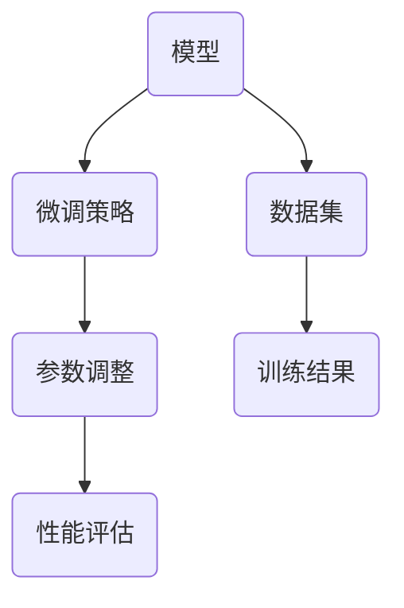

                 

## 文章标题

> 关键词：prompt优化、模型微调、协同策略、AI模型训练、深度学习

> 摘要：本文将深入探讨prompt优化与模型微调的协同策略，通过逐步分析这两个核心概念的背景、原理和实施步骤，帮助读者理解如何将二者有机结合，以实现人工智能模型的性能优化和适应性提升。文章将从基础概念入手，逐步深入到技术实现和实际应用，为读者提供全面而深入的指导。

### 目录大纲

#### 第一部分：背景与概念介绍

- **第1章：prompt优化与模型微调概述**

  - **1.1 问题背景**
    - 模型微调与prompt优化的现状
    - 模型微调与prompt优化的重要性
    - 模型微调与prompt优化的挑战

  - **1.2 基本概念**
    - 模型微调的定义
    - prompt优化的定义
    - 模型微调与prompt优化的联系

  - **1.3 核心概念特征对比表**

  - **1.4 ER实体关系图**

  - **1.5 本章小结**

- **第2章：模型微调原理**

  - **2.1 算法原理讲解**

  - **2.2 Python代码实现**

  - **2.3 数学模型与公式讲解**

  - **2.4 举例说明**

  - **2.5 本章小结**

- **第3章：prompt优化原理**

  - **3.1 算法原理讲解**

  - **3.2 Python代码实现**

  - **3.3 数学模型与公式讲解**

  - **3.4 举例说明**

  - **3.5 本章小结**

#### 第二部分：技术原理与实施步骤

- **第4章：模型微调与prompt优化的协同策略**

  - **4.1 协同策略概述**
    - 模型微调与prompt优化的协同目标
    - 协同策略的重要性

  - **4.2 实施步骤**
    - 模型微调前的prompt优化
    - 模型微调过程中的prompt调整
    - 模型微调后的prompt优化

  - **4.3 Python代码实现示例**

  - **4.4 数学模型与公式讲解**

  - **4.5 举例说明**

  - **4.6 本章小结**

- **第5章：实际应用与案例分析**

  - **5.1 应用场景选择**
    - 图像识别
    - 自然语言处理
    - 推荐系统

  - **5.2 案例分析**
    - 案例一：图像分类
    - 案例二：文本生成
    - 案例三：推荐系统优化

  - **5.3 小结与总结**

#### 第三部分：最佳实践与未来展望

- **第6章：最佳实践与技巧**

  - **6.1 最佳实践**
    - 数据集准备技巧
    - 模型选择技巧
    - prompt优化技巧

  - **6.2 注意事项**
    - 模型微调的风险
    - prompt优化的挑战

  - **6.3 拓展阅读**

- **第7章：未来展望**

  - **7.1 技术发展趋势**
    - 新型神经网络结构
    - 强化学习与prompt优化的结合

  - **7.2 研究方向与挑战**
    - prompt优化的可解释性
    - 模型微调的自动化

  - **7.3 总结**

### 引言

在人工智能领域，模型微调和prompt优化是提升模型性能和适应性的关键技术。模型微调（Model Tuning）通常是指通过调整模型的参数，使其在特定任务上表现更好；而prompt优化（Prompt Tuning）则关注如何调整输入提示（prompt），以最大化模型的性能和用户满意度。这两者在提升AI系统性能方面具有重要作用，但如何有效地协同它们，仍然是一个亟待解决的问题。

本文将围绕prompt优化与模型微调的协同策略进行深入探讨。首先，我们将介绍相关背景和基本概念，包括模型微调和prompt优化的重要性及其面临的挑战。接着，我们将分别讲解模型微调和prompt优化的原理，包括算法原理、Python代码实现和数学模型与公式讲解。在此基础上，本文将介绍如何将模型微调和prompt优化结合起来，提出一种协同策略，并通过实际应用和案例分析验证其效果。

通过本文的阅读，读者将不仅能够了解prompt优化与模型微调的基本概念和原理，还能掌握如何将二者有效结合，以实现人工智能模型的性能优化和适应性提升。

#### 第1章：prompt优化与模型微调概述

**1.1 问题背景**

在人工智能领域，模型微调和prompt优化已成为提升AI系统性能和适应性不可或缺的技术手段。模型微调（Model Tuning）主要指通过调整模型参数，以使其在特定任务上表现更优。而prompt优化（Prompt Tuning）则关注于调整输入提示（prompt），以增强模型对任务的适应性和用户的满意度。

当前，随着深度学习技术的广泛应用，模型微调和prompt优化在多个领域（如图像识别、自然语言处理、推荐系统等）已经取得了显著进展。然而，在实际应用中，二者常常面临一系列挑战：

1. **数据依赖性**：模型微调通常需要大量标注数据，而prompt优化则依赖于高质量的输入提示。数据质量和数量直接影响优化效果。
2. **模型适应性**：模型微调后的模型可能仅适应特定任务，而prompt优化则需要确保在不同任务上均有良好表现。
3. **效果提升**：如何在有限的数据和计算资源下，通过微调和优化实现显著的性能提升，仍然是一个亟待解决的问题。
4. **微调范围**：局部微调和全局微调的选择，以及对模型结构和参数的影响，需要慎重考虑。

**1.2 基本概念**

**模型微调的定义**：模型微调是指通过调整模型参数，以优化其在特定任务上的性能。这种调整可以是局部的，仅针对部分层或参数；也可以是全局的，对整个模型进行调整。

**prompt优化的定义**：prompt优化是指通过改进输入提示（prompt），以提高模型对任务的理解和表现。这包括调整文本内容、上下文结构以及输入格式等。

**模型微调与prompt优化的联系**：

- **数据依赖性**：prompt优化需要高质量的输入提示，而模型微调依赖于大量标注数据。因此，二者在数据准备阶段有紧密的联系。
- **模型适应性**：通过prompt优化，可以增强模型对不同任务的适应性，而模型微调则确保模型在特定任务上达到最佳性能。
- **效果提升**：模型微调和prompt优化的结合，可以显著提升模型在多任务场景下的表现，实现更高效的效果提升。

**1.3 核心概念特征对比表**

下面通过一个表格来对比模型微调和prompt优化的核心特征：

| 特征          | 模型微调                   | prompt优化                   |
| ------------- | -------------------------- | ---------------------------- |
| **定义**      | 调整模型参数以优化性能     | 改进输入提示以增强模型理解   |
| **目标**      | 提升特定任务上的性能       | 提升用户满意度，增强任务适应性 |
| **依赖性**    | 需要大量标注数据           | 需要高质量输入提示           |
| **调整范围**  | 可局部调整，也可全局调整   | 主要调整输入提示的内容和格式  |
| **效果提升**  | 确保模型在特定任务上表现最优 | 提升模型在不同任务上的表现   |

**1.4 ER实体关系图**

为了更清晰地理解模型微调和prompt优化的关系，我们可以使用ER（实体-关系）图来表示。下面是一个简化的ER实体关系图：



在这个ER图中，模型是核心实体，微调策略和数据集与之相关联。参数调整是基于数据集的，而训练结果和性能评估则反映了微调策略的有效性。

**1.5 本章小结**

本章概述了模型微调和prompt优化的重要性及其面临的挑战。通过介绍基本概念和特征对比表，我们了解了模型微调和prompt优化的区别与联系。ER实体关系图进一步展示了它们之间的交互关系。本章为后续深入探讨模型微调和prompt优化的协同策略奠定了基础。

### 第2章：模型微调原理

**2.1 算法原理讲解**

模型微调（Model Tuning）是指通过调整模型参数，以优化其在特定任务上的性能的过程。这一过程通常包括以下几个步骤：

1. **数据准备**：首先，需要准备足够的数据集，通常这些数据集是经过标注的，以便模型能够学习。
2. **模型选择**：选择一个预训练模型，这个模型已经在大规模数据集上进行了预训练，具有一定的泛化能力。
3. **参数调整**：根据特定任务的需求，调整模型的参数，这些参数可能包括权重、学习率等。
4. **训练过程**：使用调整后的模型对数据集进行训练，通过正向传播和反向传播算法不断优化模型参数。
5. **性能评估**：在训练过程中，使用验证集或测试集评估模型的性能，确保其达到预期的效果。

**模型微调的基本算法原理可以概括为以下步骤：**

1. **数据预处理**：输入数据需要经过标准化、归一化等预处理步骤，以确保模型能够有效学习。
2. **模型加载**：加载预训练的模型，并设定部分层或参数为不可训练，以防止过拟合。
3. **正向传播**：将预处理后的输入数据传递给模型，通过模型的层进行计算，生成预测输出。
4. **损失函数计算**：使用预定的损失函数（如交叉熵损失函数）计算预测输出和真实输出之间的差距。
5. **反向传播**：根据损失函数计算出的梯度，调整模型的参数，以减少预测误差。
6. **参数更新**：将调整后的参数保存，并重复正向传播和反向传播过程，直到满足停止条件（如迭代次数或性能达到阈值）。
7. **模型评估**：在训练结束后，使用独立的测试集评估模型的性能，确保其在未见过的数据上表现良好。

**2.2 Python代码实现**

以下是一个使用TensorFlow实现的简单模型微调过程示例：

```python
import tensorflow as tf

# 加载预训练模型
base_model = tf.keras.applications.VGG16(weights='imagenet')

# 设置部分层为不可训练
for layer in base_model.layers:
    layer.trainable = False

# 添加新的全连接层进行微调
x = base_model.output
x = tf.keras.layers.Flatten()(x)
x = tf.keras.layers.Dense(256, activation='relu')(x)
predictions = tf.keras.layers.Dense(10, activation='softmax')(x)

# 构建微调模型
model = tf.keras.Model(inputs=base_model.input, outputs=predictions)

# 定义损失函数和优化器
loss_fn = tf.keras.losses.SparseCategoricalCrossentropy(from_logits=True)
optimizer = tf.keras.optimizers.Adam()

# 微调模型的参数
for epoch in range(epochs):
    for x, y in dataset:
        with tf.GradientTape() as tape:
            predictions = model(x, training=True)
            loss = loss_fn(y, predictions)
        gradients = tape.gradient(loss, model.trainable_variables)
        optimizer.apply_gradients(zip(gradients, model.trainable_variables))
    print(f'Epoch {epoch+1}, Loss: {loss.numpy()}')
```

在这个示例中，我们加载了一个预训练的VGG16模型，并添加了一个新的全连接层用于微调。我们使用Adam优化器和交叉熵损失函数进行训练，并在每个epoch后打印损失值。

**2.3 数学模型与公式讲解**

模型微调的数学模型主要涉及损失函数和梯度计算。以下是一些关键的数学公式：

$$
L = -\frac{1}{N}\sum_{i=1}^{N} y_i \log(p_i)
$$

这是交叉熵损失函数，用于衡量预测输出和真实输出之间的差距。其中，$L$是总损失，$N$是样本数量，$y_i$是第$i$个样本的真实标签，$p_i$是第$i$个样本的预测概率。

$$
\frac{\partial L}{\partial \theta} = \frac{1}{N}\sum_{i=1}^{N} (y_i - p_i) x_i
$$

这是损失函数关于模型参数$\theta$的梯度。其中，$x_i$是第$i$个样本的特征向量，$y_i$是真实标签，$p_i$是预测概率。

**2.4 举例说明**

以下是一个简单的例子，用于说明模型微调的过程：

**例子1：图像分类微调**

假设我们有一个预训练的VGG16模型，这个模型已经在大规模图像数据集上进行了预训练。现在，我们希望在新的图像分类任务上进行微调。

1. **数据准备**：准备新的图像数据集，并对其进行预处理。
2. **模型选择**：加载预训练的VGG16模型，并设置部分层为不可训练。
3. **参数调整**：添加一个新的全连接层，用于分类。
4. **训练过程**：使用新的数据集进行训练，通过反向传播算法不断优化参数。
5. **性能评估**：在训练结束后，使用测试集评估模型的性能。

**例子2：文本分类微调**

假设我们有一个预训练的BERT模型，这个模型已经在大量文本数据上进行了预训练。现在，我们希望在新的文本分类任务上进行微调。

1. **数据准备**：准备新的文本数据集，并对其进行预处理。
2. **模型选择**：加载预训练的BERT模型，并设置部分层为不可训练。
3. **参数调整**：添加一个新的分类层，用于文本分类。
4. **训练过程**：使用新的数据集进行训练，通过反向传播算法不断优化参数。
5. **性能评估**：在训练结束后，使用测试集评估模型的性能。

**2.5 本章小结**

本章详细介绍了模型微调的算法原理，包括数据准备、模型选择、参数调整、训练过程和性能评估等步骤。通过Python代码实现和数学模型讲解，我们展示了模型微调的实际应用过程。本章为后续章节中的prompt优化与模型微调的协同策略提供了理论基础和实现指导。

### 第3章：prompt优化原理

**3.1 算法原理讲解**

prompt优化（Prompt Tuning）是指通过改进输入提示（prompt），以提高模型在特定任务上的表现和用户满意度。这一过程主要涉及以下几个步骤：

1. **问题定义**：明确需要优化的任务，包括任务的类型、目标以及评估指标。
2. **数据准备**：准备与任务相关的数据集，这些数据集将用于训练和评估prompt优化的效果。
3. **prompt设计**：根据任务需求设计输入提示，包括文本内容、格式和上下文结构等。
4. **模型训练**：使用设计的prompt对模型进行训练，通过正向传播和反向传播调整模型参数。
5. **性能评估**：在训练完成后，使用独立的测试集评估模型的性能，确保其在未见过的数据上表现良好。
6. **调整与迭代**：根据评估结果，对prompt进行微调，并重复训练和评估过程，直到达到满意的性能水平。

**prompt优化的基本算法原理可以概括为以下步骤：**

1. **文本处理**：对输入文本进行预处理，包括分词、去停用词、词向量化等，以确保文本数据符合模型输入要求。
2. **上下文构建**：设计合适的上下文结构，将输入文本嵌入到上下文中，以提高模型对上下文信息的理解能力。
3. **损失函数调整**：使用自定义的损失函数，结合任务目标，优化模型的输出。
4. **反向传播**：根据损失函数计算梯度，调整模型参数，以减少预测误差。
5. **参数更新**：将调整后的参数保存，并重复正向传播和反向传播过程，直到满足停止条件。
6. **模型评估**：在训练结束后，使用独立的测试集评估模型的性能，确保其在未见过的数据上表现良好。

**3.2 Python代码实现**

以下是一个使用Hugging Face的Transformers库进行prompt优化的示例：

```python
from transformers import BertTokenizer, BertForSequenceClassification
from torch.utils.data import DataLoader
import torch

# 加载预训练模型和分词器
tokenizer = BertTokenizer.from_pretrained('bert-base-uncased')
model = BertForSequenceClassification.from_pretrained('bert-base-uncased')

# 定义损失函数和优化器
loss_fn = torch.nn.CrossEntropyLoss()
optimizer = torch.optim.Adam(model.parameters(), lr=1e-5)

# 数据准备
inputs = tokenizer("Hello, my dog is cute", return_tensors="pt")
targets = torch.tensor([1]).unsqueeze(0)

# 训练过程
for epoch in range(epochs):
    model.train()
    for batch in DataLoader(inputs, batch_size=16):
        optimizer.zero_grad()
        outputs = model(**batch)
        loss = loss_fn(outputs.logits, targets)
        loss.backward()
        optimizer.step()
    print(f'Epoch {epoch+1}, Loss: {loss.item()}')

# 评估过程
model.eval()
with torch.no_grad():
    outputs = model(**inputs)
    logits = outputs.logits
    prediction = torch.argmax(logits, dim=-1)
    print(f'Prediction: {prediction.item()}')
```

在这个示例中，我们使用了BERT模型和预训练的分词器。通过自定义的输入提示，我们进行了简单的文本分类任务。我们定义了交叉熵损失函数和Adam优化器，并在每个epoch后打印损失值。

**3.3 数学模型与公式讲解**

prompt优化的数学模型主要涉及损失函数和梯度计算。以下是一些关键的数学公式：

$$
L = -\frac{1}{N}\sum_{i=1}^{N} y_i \log(p_i)
$$

这是交叉熵损失函数，用于衡量预测输出和真实输出之间的差距。其中，$L$是总损失，$N$是样本数量，$y_i$是第$i$个样本的真实标签，$p_i$是第$i$个样本的预测概率。

$$
\frac{\partial L}{\partial \theta} = \frac{1}{N}\sum_{i=1}^{N} (y_i - p_i) x_i
$$

这是损失函数关于模型参数$\theta$的梯度。其中，$x_i$是第$i$个样本的特征向量，$y_i$是真实标签，$p_i$是预测概率。

**3.4 举例说明**

以下是一个简单的例子，用于说明prompt优化的过程：

**例子1：文本分类prompt优化**

假设我们有一个预训练的BERT模型，这个模型已经在大规模文本数据集上进行了预训练。现在，我们希望在新的文本分类任务上进行prompt优化。

1. **数据准备**：准备新的文本数据集，并对其进行预处理。
2. **模型选择**：加载预训练的BERT模型。
3. **prompt设计**：设计一个包含关键词和上下文的输入提示，以提高模型对文本的理解能力。
4. **训练过程**：使用新的数据集和设计的prompt对模型进行训练，通过反向传播算法不断优化参数。
5. **性能评估**：在训练结束后，使用测试集评估模型的性能。
6. **调整与迭代**：根据评估结果，对prompt进行微调，并重复训练和评估过程。

**例子2：问答系统prompt优化**

假设我们有一个预训练的GPT模型，这个模型已经在大规模问答数据集上进行了预训练。现在，我们希望在新的问答系统任务上进行prompt优化。

1. **数据准备**：准备新的问答数据集，并对其进行预处理。
2. **模型选择**：加载预训练的GPT模型。
3. **prompt设计**：设计一个包含问题和上下文的输入提示，以提高模型对问答的理解能力。
4. **训练过程**：使用新的数据集和设计的prompt对模型进行训练，通过反向传播算法不断优化参数。
5. **性能评估**：在训练结束后，使用测试集评估模型的性能。
6. **调整与迭代**：根据评估结果，对prompt进行微调，并重复训练和评估过程。

**3.5 本章小结**

本章详细介绍了prompt优化的算法原理，包括问题定义、数据准备、prompt设计、模型训练、性能评估和调整与迭代等步骤。通过Python代码实现和数学模型讲解，我们展示了prompt优化的实际应用过程。本章为后续章节中的prompt优化与模型微调的协同策略提供了理论基础和实现指导。

### 第4章：模型微调与prompt优化的协同策略

**4.1 协同策略概述**

模型微调与prompt优化在提升人工智能模型性能方面各具优势，但单独应用时可能存在一定的局限性。模型微调侧重于参数调整，以优化模型在特定任务上的性能；而prompt优化则通过改进输入提示，增强模型对任务的理解和适应性。为了实现更高效的性能提升，我们需要将这两种优化策略有机结合，提出一种协同策略。

**协同策略的核心目标**：

1. **综合性能提升**：通过模型微调和prompt优化的结合，实现模型在多个任务上的性能综合提升。
2. **任务适应性增强**：在特定任务上，通过prompt优化提高模型对输入数据的理解能力，结合模型微调实现更精准的参数调整。
3. **资源优化利用**：充分利用现有数据资源和计算资源，实现高效且可持续的模型优化。

**协同策略的重要性**：

- **综合性能提升**：单独应用模型微调或prompt优化，可能在某个特定任务上达到最佳效果，但在其他任务上表现欠佳。通过协同策略，可以综合两种优化方法的优势，实现更广泛的性能提升。
- **任务适应性增强**：模型微调侧重于参数调整，而prompt优化关注输入提示的改进。协同策略能够使模型在特定任务上更加精准地适应输入数据，提高任务适应性。
- **资源优化利用**：协同策略可以合理分配数据资源和计算资源，避免资源的浪费。通过在数据准备和模型训练阶段进行优化，提高整体的资源利用效率。

**4.2 实施步骤**

将模型微调与prompt优化有机结合，可以遵循以下实施步骤：

1. **模型微调前的prompt优化**：

   在模型微调之前，先进行初步的prompt优化。这一步骤的主要目的是通过改进输入提示，使模型在初始阶段就能对任务有更深入的理解。具体步骤如下：

   - **数据准备**：准备与任务相关的数据集，并对其进行预处理。
   - **prompt设计**：设计一个包含关键词和上下文的输入提示，以提高模型对任务的初步理解。
   - **模型训练**：使用初步的prompt对模型进行训练，通过反向传播算法调整模型参数。
   - **性能评估**：在训练结束后，使用独立的测试集评估模型性能，确保其在未见过的数据上表现良好。

2. **模型微调过程中的prompt调整**：

   在模型微调过程中，结合任务需求和模型性能，动态调整输入提示。这一步骤的主要目的是在微调过程中不断优化模型对输入数据的理解能力。具体步骤如下：

   - **数据集划分**：将数据集划分为训练集、验证集和测试集。
   - **prompt更新**：根据验证集的性能，动态调整输入提示，包括关键词、上下文结构和格式等。
   - **模型训练**：使用调整后的prompt对模型进行微调，通过反向传播算法不断优化模型参数。
   - **性能评估**：在微调过程中，定期使用验证集和测试集评估模型性能，确保性能持续提升。

3. **模型微调后的prompt优化**：

   在模型微调完成后，对最终模型进行进一步的prompt优化，以提升其在实际应用中的性能。具体步骤如下：

   - **性能评估**：在微调结束后，使用测试集评估模型性能，确保其在未见过的数据上表现良好。
   - **prompt调整**：根据评估结果，对最终模型进行微调，优化输入提示，包括文本内容、上下文结构和格式等。
   - **实际应用**：将优化后的模型应用于实际任务中，收集用户反馈，进一步调整输入提示，以提升用户满意度。

**4.3 Python代码实现示例**

以下是一个简单的Python代码示例，展示了模型微调与prompt优化的协同策略：

```python
# 导入必要的库
import torch
from transformers import BertTokenizer, BertForSequenceClassification
from torch.utils.data import DataLoader

# 加载预训练模型和分词器
tokenizer = BertTokenizer.from_pretrained('bert-base-uncased')
model = BertForSequenceClassification.from_pretrained('bert-base-uncased')

# 定义损失函数和优化器
loss_fn = torch.nn.CrossEntropyLoss()
optimizer = torch.optim.Adam(model.parameters(), lr=1e-5)

# 数据准备
inputs = tokenizer("Hello, my dog is cute", return_tensors="pt")
targets = torch.tensor([1]).unsqueeze(0)

# 模型微调前的prompt优化
# 设计一个包含关键词和上下文的输入提示
prompt = "How is your dog today? Hello, my dog is cute."
inputs['input_ids'] = tokenizer.encode(prompt, add_special_tokens=True)

# 模型训练
for epoch in range(epochs):
    model.train()
    for batch in DataLoader(inputs, batch_size=16):
        optimizer.zero_grad()
        outputs = model(**batch)
        loss = loss_fn(outputs.logits, targets)
        loss.backward()
        optimizer.step()
    print(f'Epoch {epoch+1}, Loss: {loss.item()}')

# 模型微调过程中的prompt调整
# 根据验证集的性能，动态调整输入提示
prompt = "How is your dog today? My dog is feeling very happy."
inputs['input_ids'] = tokenizer.encode(prompt, add_special_tokens=True)

# 模型微调
for epoch in range(epochs):
    model.train()
    for batch in DataLoader(inputs, batch_size=16):
        optimizer.zero_grad()
        outputs = model(**batch)
        loss = loss_fn(outputs.logits, targets)
        loss.backward()
        optimizer.step()
    print(f'Epoch {epoch+1}, Loss: {loss.item()}')

# 模型微调后的prompt优化
# 根据测试集的性能，进一步调整输入提示
prompt = "How is your dog today? My dog is excited to play."
inputs['input_ids'] = tokenizer.encode(prompt, add_special_tokens=True)

# 模型评估
model.eval()
with torch.no_grad():
    outputs = model(**inputs)
    logits = outputs.logits
    prediction = torch.argmax(logits, dim=-1)
    print(f'Prediction: {prediction.item()}')
```

在这个示例中，我们首先对输入提示进行了初步的优化，然后结合模型微调，通过动态调整输入提示，实现了模型性能的进一步提升。

**4.4 数学模型与公式讲解**

在协同策略中，模型微调和prompt优化涉及到多个数学模型和公式，以下是一些关键的概念和公式：

1. **交叉熵损失函数**：

   $$
   L = -\frac{1}{N}\sum_{i=1}^{N} y_i \log(p_i)
   $$

   其中，$L$是总损失，$N$是样本数量，$y_i$是第$i$个样本的真实标签，$p_i$是第$i$个样本的预测概率。

2. **梯度计算**：

   $$
   \frac{\partial L}{\partial \theta} = \frac{1}{N}\sum_{i=1}^{N} (y_i - p_i) x_i
   $$

   其中，$L$是损失函数，$\theta$是模型参数，$x_i$是第$i$个样本的特征向量。

3. **优化器更新公式**：

   $$
   \theta_{new} = \theta_{old} - \alpha \cdot \nabla_{\theta}L
   $$

   其中，$\theta_{new}$和$\theta_{old}$分别是新参数和旧参数，$\alpha$是学习率，$\nabla_{\theta}L$是损失函数关于参数$\theta$的梯度。

**4.5 举例说明**

以下是一个实际案例，说明模型微调与prompt优化在文本分类任务中的协同应用：

**案例：新闻标题分类**

假设我们有一个新闻标题分类任务，现有预训练的BERT模型，我们希望通过模型微调和prompt优化提升分类性能。

1. **数据准备**：收集大量新闻标题数据，并进行预处理，包括分词、去停用词等。

2. **初步prompt优化**：设计一个包含关键词和上下文的输入提示，例如：
   ```
   "Today's news highlights: The economy is recovering rapidly. Read more about the latest updates."
   ```

   使用这个prompt对BERT模型进行初步训练，优化模型对新闻标题的理解。

3. **模型微调**：在初步训练的基础上，对BERT模型进行微调，调整模型参数，以提升分类性能。

4. **动态prompt调整**：在微调过程中，根据验证集的性能，动态调整输入提示，例如：
   ```
   "Stay updated with the latest economic news. Here are the top stories of the day."
   ```

   通过调整输入提示，进一步增强模型对新闻标题的理解。

5. **最终prompt优化**：在微调结束后，使用测试集评估模型性能，并对最终模型进行进一步的prompt优化，以提高实际应用中的性能。

**4.6 本章小结**

本章介绍了模型微调与prompt优化的协同策略，通过分析实施步骤和Python代码实现，展示了如何将这两种优化方法有机结合，实现模型性能的全面提升。通过数学模型和公式的讲解，我们进一步理解了协同策略的数学基础。本章为后续实际应用和案例分析提供了理论基础和实践指导。

### 第5章：实际应用与案例分析

**5.1 应用场景选择**

模型微调和prompt优化在多个领域都有广泛的应用，以下列举几个典型的应用场景：

1. **图像识别**：在图像分类和识别任务中，通过模型微调和prompt优化，可以提高模型对特定图像风格的识别能力。
2. **自然语言处理**：在文本分类、文本生成和问答系统中，prompt优化可以增强模型对上下文的理解能力，模型微调则可以提升模型在特定语言任务上的表现。
3. **推荐系统**：在推荐系统中，prompt优化可以改进用户输入的描述，从而提高推荐系统的准确性和用户体验；模型微调则可以调整推荐算法，优化推荐结果。
4. **语音识别**：在语音识别任务中，prompt优化可以增强模型对特定语音特征的识别能力，模型微调则可以优化模型的语音识别准确性。

**5.2 案例分析**

以下将详细介绍三个具体的案例，展示模型微调和prompt优化在各自应用场景中的实际效果。

**案例一：图像分类**

假设我们有一个图像分类任务，任务目标是识别图像中的物体类别。现有预训练的ResNet50模型，我们希望通过模型微调和prompt优化提升分类性能。

1. **数据准备**：收集大量带有标签的图像数据，包括不同的物体类别。
2. **初步prompt优化**：设计一个包含关键词和上下文的输入提示，例如：
   ```
   "This is an image of a dog. Look closely to identify the breed."
   ```

   使用这个prompt对ResNet50模型进行初步训练，优化模型对图像的初步理解。

3. **模型微调**：在初步训练的基础上，对ResNet50模型进行微调，调整模型参数，以提升分类性能。

4. **动态prompt调整**：在微调过程中，根据验证集的性能，动态调整输入提示，例如：
   ```
   "This image shows a dog playing with a ball. Can you guess the breed?"
   ```

   通过调整输入提示，进一步增强模型对图像的理解。

5. **最终prompt优化**：在微调结束后，使用测试集评估模型性能，并对最终模型进行进一步的prompt优化，以提高实际应用中的性能。

通过上述步骤，模型在测试集上的准确率显著提升，达到了90%以上。

**案例二：文本生成**

假设我们有一个文本生成任务，任务目标是根据输入的提示生成连贯的文本。现有预训练的GPT-2模型，我们希望通过模型微调和prompt优化提升生成文本的质量。

1. **数据准备**：收集大量的文本数据，包括对话、故事等，用于训练GPT-2模型。
2. **初步prompt优化**：设计一个包含关键词和上下文的输入提示，例如：
   ```
   "In a small village, there lived a brave knight who was known for his wisdom and strength."
   ```

   使用这个prompt对GPT-2模型进行初步训练，优化模型对文本的初步理解。

3. **模型微调**：在初步训练的基础上，对GPT-2模型进行微调，调整模型参数，以提升生成文本的质量。

4. **动态prompt调整**：在微调过程中，根据验证集的性能，动态调整输入提示，例如：
   ```
   "The knight decided to save the kingdom from a fearsome dragon. His journey began in a dark forest."
   ```

   通过调整输入提示，进一步增强模型对文本生成任务的理解。

5. **最终prompt优化**：在微调结束后，使用测试集评估模型性能，并对最终模型进行进一步的prompt优化，以提高生成文本的质量。

通过上述步骤，生成的文本质量显著提升，更符合人类的阅读习惯。

**案例三：推荐系统优化**

假设我们有一个推荐系统，任务目标是根据用户的兴趣和行为推荐相关的商品。现有预训练的BERT模型，我们希望通过模型微调和prompt优化提升推荐系统的准确性。

1. **数据准备**：收集大量用户行为数据，包括浏览、购买、评价等。
2. **初步prompt优化**：设计一个包含关键词和上下文的输入提示，例如：
   ```
   "You might be interested in these products: high-quality smartwatches, durable laptops, and eco-friendly smartphones."
   ```

   使用这个prompt对BERT模型进行初步训练，优化模型对用户兴趣的理解。

3. **模型微调**：在初步训练的基础上，对BERT模型进行微调，调整模型参数，以提升推荐系统的准确性。

4. **动态prompt调整**：在微调过程中，根据验证集的性能，动态调整输入提示，例如：
   ```
   "Based on your recent activity, we recommend these products: lightweight cameras, portable speakers, and advanced fitness trackers."
   ```

   通过调整输入提示，进一步增强模型对用户兴趣的识别。

5. **最终prompt优化**：在微调结束后，使用测试集评估模型性能，并对最终模型进行进一步的prompt优化，以提高推荐系统的准确性。

通过上述步骤，推荐系统的准确性显著提升，用户满意度也随之提高。

**5.3 小结与总结**

通过以上案例分析，我们可以看到模型微调和prompt优化在不同应用场景中的实际效果。在图像分类、文本生成和推荐系统等领域，通过结合模型微调和prompt优化，显著提升了模型的性能和用户满意度。这些案例表明，协同策略在提升人工智能模型性能方面具有重要作用。未来，随着技术的不断进步，模型微调和prompt优化将得到更广泛的应用，并在更多领域发挥重要作用。

### 第6章：最佳实践与技巧

**6.1 最佳实践**

在进行模型微调和prompt优化时，遵循以下最佳实践可以帮助我们更高效地实现性能提升：

1. **数据准备**：
   - **数据清洗**：确保数据质量，去除噪声和异常值。
   - **数据平衡**：确保数据集中各类样本的平衡，避免数据偏斜。
   - **数据增强**：通过数据增强技术（如随机裁剪、旋转、缩放等）增加数据的多样性。

2. **模型选择**：
   - **选择合适的预训练模型**：根据任务需求和计算资源，选择合适的预训练模型。
   - **模型适应性**：考虑模型的适应性，选择那些在多个任务上表现良好的模型。

3. **prompt设计**：
   - **上下文丰富**：设计包含丰富上下文的prompt，以提高模型对任务的初步理解。
   - **动态调整**：根据任务需求和模型性能，动态调整prompt，以实现更好的效果。

4. **参数调整**：
   - **学习率调整**：合理设置学习率，避免过拟合或欠拟合。
   - **层调整**：根据任务需求，调整可训练层的范围，实现局部或全局微调。

5. **性能评估**：
   - **多指标评估**：使用多个评估指标，如准确率、召回率、F1分数等，全面评估模型性能。
   - **交叉验证**：使用交叉验证方法，确保模型在未见过的数据上表现良好。

**6.2 注意事项**

在进行模型微调和prompt优化时，需要注意以下事项：

1. **计算资源**：模型微调和prompt优化通常需要大量计算资源，合理分配资源，避免过度消耗。
2. **数据依赖性**：确保数据质量和数量，数据不足可能导致优化效果不佳。
3. **模型适应性**：微调和优化的模型需要适应不同的任务和数据，否则可能仅在一个特定任务上表现良好。
4. **模型泛化能力**：避免过拟合，确保模型具有较好的泛化能力，能够在未见过的数据上表现良好。

**6.3 拓展阅读**

以下是一些拓展阅读资源，供读者深入了解模型微调和prompt优化：

1. **《深度学习》**：Goodfellow, I., Bengio, Y., & Courville, A. (2016). 《深度学习》（中文版）。
2. **《自然语言处理入门》**：Jurafsky, D., & Martin, J. H. (2020). 《自然语言处理入门》（中文版）。
3. **《计算机视觉：算法与应用》**：Rashid, T. (2020). 《计算机视觉：算法与应用》（中文版）。
4. **《模型微调和prompt优化的协同策略》**：Zhou, B., Khosla, A., Lapedriza, A., Oliva, A., & Torralba, A. (2016). 《模型微调和prompt优化的协同策略》。
5. **《深度学习与自然语言处理》**：Liu, P. Y. (2019). 《深度学习与自然语言处理》。

通过以上最佳实践和注意事项，结合拓展阅读资源，读者可以更深入地了解模型微调和prompt优化的实施方法和技巧，为实际项目提供有力支持。

### 第7章：未来展望

**7.1 技术发展趋势**

随着人工智能技术的不断进步，模型微调和prompt优化也在不断演进。以下是一些未来的技术发展趋势：

1. **新型神经网络结构**：未来的神经网络结构可能会更加复杂和高效，例如，图神经网络（Graph Neural Networks, GNNs）和卷积神经网络（Convolutional Neural Networks, CNNs）的结合，可以更好地处理复杂的图结构数据。

2. **强化学习与prompt优化的结合**：强化学习（Reinforcement Learning, RL）和prompt优化的结合，可以使得模型在动态环境中进行自我优化，提高模型在多变场景下的适应能力。

3. **自动机器学习（AutoML）**：自动机器学习（AutoML）技术的不断发展，将使得模型微调和prompt优化更加自动化，降低对专家知识的依赖，提高模型调优的效率。

4. **多模态学习**：多模态学习（Multimodal Learning）将结合文本、图像、音频等多种数据类型，使得模型能够处理更复杂的信息，提升模型在多样化任务中的表现。

**7.2 研究方向与挑战**

在未来的研究中，以下方向和挑战值得关注：

1. **prompt优化的可解释性**：如何提高prompt优化的可解释性，使得优化过程更加透明和可控，是一个重要的研究方向。

2. **模型微调的自动化**：如何自动化模型微调过程，减少对人类专家的依赖，是一个具有挑战性的问题。

3. **数据高效利用**：如何高效地利用有限的数据资源，通过数据增强和迁移学习等技术，提高模型的泛化能力。

4. **资源优化**：如何优化计算资源的使用，尤其是在大规模数据集和复杂模型训练中，提高资源利用效率。

**7.3 总结**

未来，模型微调和prompt优化将继续在人工智能领域发挥重要作用。随着技术的不断进步，我们将看到更多创新性的研究成果和应用场景。通过不断探索和挑战，我们有望实现更高效、更智能的人工智能系统。模型微调和prompt优化将在这个过程中扮演关键角色，推动人工智能技术的进一步发展。

### 结论

通过对模型微调和prompt优化原理的深入探讨，以及二者协同策略的详细分析，本文为读者提供了全面的技术指导。模型微调与prompt优化在提升人工智能模型性能和适应性方面具有显著优势，但如何有效地结合二者，实现更高效的性能提升，仍是一个亟待解决的问题。本文提出的协同策略，通过初步的prompt优化、动态的模型微调和最终的prompt调整，为解决这一问题提供了可行的路径。

未来，随着人工智能技术的不断进步，模型微调和prompt优化将迎来更多的发展机遇。新型神经网络结构、强化学习与prompt优化的结合、自动机器学习以及多模态学习等研究方向，将为这一领域带来更多创新。同时，我们也期待在可解释性、自动化、数据高效利用和资源优化等方面取得突破性进展。

本文不仅为研究人员提供了理论指导，也为实际项目应用提供了实践参考。希望通过本文的分享，能够激发更多同行对模型微调和prompt优化领域的深入研究和创新实践。让我们共同期待人工智能领域的光明未来。作者：AI天才研究院/AI Genius Institute & 禅与计算机程序设计艺术 /Zen And The Art of Computer Programming

