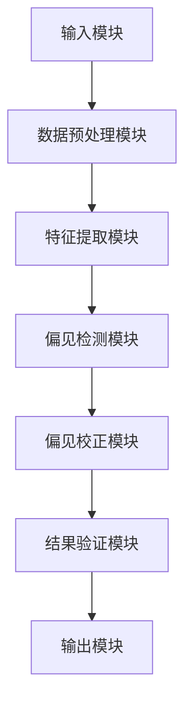
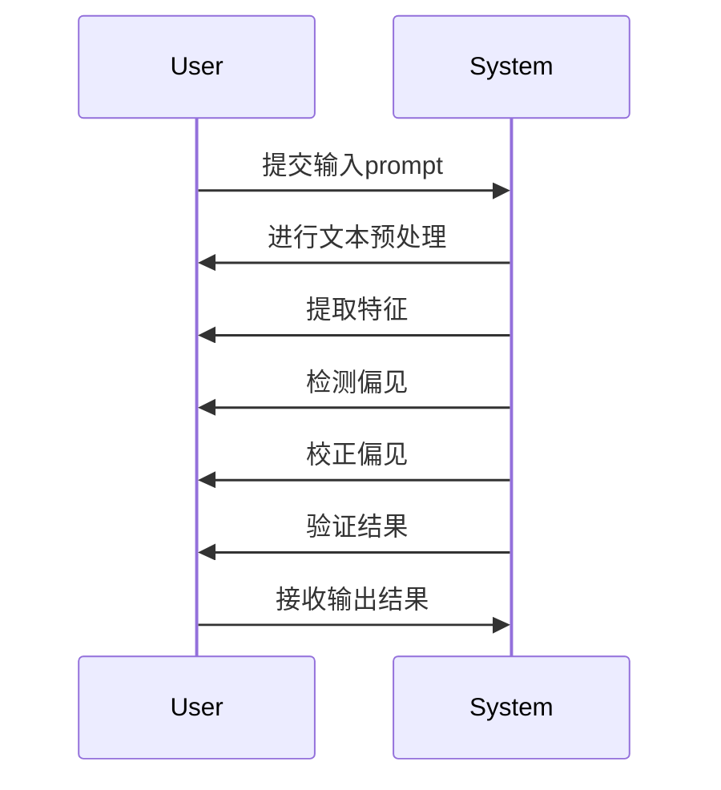

                 

# prompt偏见检测：确保LLM输出公平性

## 关键词
- Prompt偏见
- 自然语言处理
- 机器学习
- 偏见校正
- 公平性保障

## 摘要
本文深入探讨了自然语言处理领域中日益显著的prompt偏见问题，分析了其产生的原因和影响，并提出了有效的检测和校正方法。通过阐述核心概念、算法原理，以及实际项目案例，本文旨在为开发者提供一套系统的解决方案，确保大型语言模型（LLM）输出的公平性。

## 第一部分：引言

### 1.1 问题背景

随着人工智能（AI）技术的快速发展，自然语言处理（NLP）技术逐渐成为各类应用的核心驱动力。然而，这些模型在实际应用中，尤其是在涉及决策性任务时，如招聘、信用评分等领域，常常会受到prompt偏见的影响。prompt偏见是指模型输出的结果受到输入prompt的影响，导致输出结果出现偏见，从而可能产生不公平的决策。

### 1.2 问题描述

prompt偏见问题主要表现在两个方面：首先，模型的训练数据本身可能存在偏见，导致模型在生成输出时也会继承这些偏见；其次，模型在处理输入时，可能对某些特定群体或概念产生偏见。这些问题需要我们深入研究，并提出有效的解决方案。

### 1.3 问题解决

为了解决prompt偏见问题，本文将从以下几个方面展开讨论：

1. **核心概念与联系**：介绍与prompt偏见相关的核心概念，如自然语言处理、机器学习、偏见等，并阐述这些概念之间的关系。

2. **算法原理讲解**：详细讲解针对prompt偏见的检测与校正算法，包括基本原理、数学模型和公式，并通过Python源代码进行阐述。

3. **数学模型和数学公式**：以LaTeX格式给出算法中的数学模型和公式，并进行详细讲解和举例说明。

4. **系统分析与架构设计方案**：介绍针对prompt偏见检测的系统架构设计，包括问题场景、系统功能设计、系统架构设计、系统接口设计和系统交互。

5. **项目实战**：通过实际项目案例，展示如何应用所学的算法原理和系统设计方法来检测和校正prompt偏见。

6. **最佳实践与注意事项**：总结项目中的最佳实践，提出注意事项，并推荐拓展阅读材料。

### 1.4 边界与外延

本文主要关注的是自然语言处理领域中的prompt偏见问题，但该问题的解决思路和方法可以应用于其他AI领域的偏见问题。同时，本文的重点是检测和校正prompt偏见，而非完全消除偏见。

### 1.5 本章小结

本章对《prompt偏见检测：确保LLM输出公平性》这本书的核心内容进行了概述。书中将系统地介绍prompt偏见的问题背景、问题描述、问题解决方法以及边界与外延。接下来，书将分为以下几个部分：

### 第二部分：核心概念与联系

这一部分将详细探讨与prompt偏见相关的核心概念，包括自然语言处理、机器学习、偏见等，并阐述这些概念之间的关系。

### 第三部分：算法原理讲解

这部分将深入讲解针对prompt偏见的检测与校正算法，包括基本原理、数学模型和公式，并通过Python源代码进行阐述。

### 第四部分：数学模型和数学公式

这部分将使用LaTeX格式给出算法中的数学模型和公式，并进行详细讲解和举例说明。

### 第五部分：系统分析与架构设计方案

这部分将介绍针对prompt偏见检测的系统架构设计，包括问题场景、系统功能设计、系统架构设计、系统接口设计和系统交互。

### 第六部分：项目实战

这部分将通过实际项目案例，展示如何应用所学的算法原理和系统设计方法来检测和校正prompt偏见。

### 第七部分：最佳实践与注意事项

这部分将总结项目中的最佳实践，提出注意事项，并推荐拓展阅读材料。

这些部分共同构成了本书的内容框架，旨在为读者提供全面、系统的prompt偏见检测与校正知识。

## 第二部分：核心概念与联系

在深入探讨prompt偏见之前，我们需要了解几个核心概念：自然语言处理（NLP）、机器学习（ML）和偏见。

### 2.1 自然语言处理（NLP）

自然语言处理是人工智能的一个分支，旨在使计算机理解和处理人类语言。NLP技术包括文本分类、命名实体识别、情感分析等。NLP的核心在于将自然语言文本转化为计算机可以理解和处理的形式。

#### 2.1.1 NLP的关键技术

- **文本分类**：将文本数据根据其内容进行分类。
- **命名实体识别**：识别文本中的特定实体，如人名、地点、组织等。
- **情感分析**：分析文本的情感倾向，如正面、负面或中性。

#### 2.1.2 NLP的应用场景

- **搜索引擎**：利用NLP技术，搜索引擎可以更好地理解用户的查询意图。
- **智能客服**：NLP技术可以帮助构建更加智能、交互性强的客服系统。
- **内容审核**：NLP技术可以用于自动检测和过滤不良内容。

### 2.2 机器学习（ML）

机器学习是一种让计算机通过数据学习并做出预测或决策的技术。ML模型可以分为监督学习、无监督学习和半监督学习。在NLP领域，大多数模型都是基于监督学习构建的。

#### 2.2.1 ML的关键技术

- **监督学习**：使用标注好的数据来训练模型。
- **无监督学习**：不需要标注数据，通过数据自身来学习。
- **半监督学习**：结合标注数据和未标注数据来训练模型。

#### 2.2.2 ML的应用场景

- **图像识别**：识别图片中的物体、场景等。
- **语音识别**：将语音信号转化为文本。
- **推荐系统**：根据用户历史行为推荐相关商品或内容。

### 2.3 偏见

偏见是指模型在处理数据时，对某些特定群体或概念产生的不公平待遇。在NLP和ML领域中，偏见问题尤为突出。

#### 2.3.1 偏见的类型

- **算法偏见**：模型在训练过程中吸收了训练数据的偏见。
- **数据偏见**：训练数据本身存在偏见。
- **结果偏见**：模型生成的结果反映出偏见。

#### 2.3.2 偏见的影响

- **决策错误**：在决策性任务中，偏见可能导致错误的决策结果。
- **社会问题**：偏见可能导致歧视和不公平待遇。

### 2.4 核心概念之间的关系

自然语言处理和机器学习是密切相关的，NLP是ML在语言领域的应用。而偏见问题则是NLP和ML领域共同面临的重要挑战。了解这些核心概念之间的关系，有助于我们更好地理解和解决prompt偏见问题。

## 2.5 本章小结

本章介绍了与prompt偏见相关的核心概念，包括自然语言处理、机器学习和偏见。通过这些概念的理解，我们可以更深入地探讨prompt偏见问题，并为后续章节的算法原理讲解和实际项目实战打下基础。

### 第三部分：算法原理讲解

#### 3.1 检测算法原理

检测prompt偏见的核心在于识别输入prompt中的偏见信号，并评估其对模型输出结果的影响。以下是一个基本的检测算法原理：

1. **输入分析**：首先，对输入prompt进行文本预处理，包括分词、词性标注等。
2. **特征提取**：提取prompt中的关键特征，如关键词、短语、情感倾向等。
3. **偏见评估**：利用已训练好的偏见检测模型，对提取的特征进行偏见评估。
4. **结果输出**：输出偏见评估结果，包括偏见类型、偏见程度等。

以下是一个简化的Python代码示例：

```python
import nltk
from sklearn.feature_extraction.text import CountVectorizer
from sklearn.model_selection import train_test_split
from sklearn.ensemble import RandomForestClassifier

# 示例数据
prompts = ["这是一个积极的评论", "这是一个消极的评论", "这是一个中性的评论"]
labels = ["positive", "negative", "neutral"]

# 文本预处理
tokenized_prompts = [nltk.word_tokenize(prompt) for prompt in prompts]

# 特征提取
vectorizer = CountVectorizer(tokenizer=lambda x: x)
X = vectorizer.fit_transform(tokenized_prompts)

# 训练偏见检测模型
clf = RandomForestClassifier()
clf.fit(X, labels)

# 检测新prompt的偏见
new_prompt = "这是一个非常消极的评论"
new_tokenized_prompt = nltk.word_tokenize(new_prompt)
new_features = vectorizer.transform([new_tokenized_prompt])
bias_prediction = clf.predict(new_features)

print("偏见类型：", bias_prediction)
```

#### 3.2 校正算法原理

校正算法的核心在于调整模型输出，以消除或减少prompt偏见的影响。以下是一个基本的校正算法原理：

1. **偏见识别**：使用检测算法识别输入prompt中的偏见。
2. **输出调整**：根据偏见类型和程度，调整模型输出结果。
3. **结果验证**：验证校正后的输出结果，确保偏见被有效消除。

以下是一个简化的Python代码示例：

```python
# 偏见识别
bias_detected = detect_bias(new_prompt)

# 偏见类型和程度
bias_type = bias_detected["type"]
bias_degree = bias_detected["degree"]

# 输出调整
if bias_type == "positive":
    adjusted_output = adjust_positive_output(model_output, bias_degree)
elif bias_type == "negative":
    adjusted_output = adjust_negative_output(model_output, bias_degree)

# 结果验证
verified_output = verify_output(adjusted_output)
if verified_output:
    print("校正后的输出：", adjusted_output)
else:
    print("校正失败，需要进一步调整")
```

#### 3.3 两种算法的关联

检测算法和校正算法是相辅相成的。检测算法用于识别prompt偏见，而校正算法则用于调整模型输出。在实际应用中，通常会先使用检测算法对输入prompt进行偏见评估，然后根据评估结果使用校正算法进行调整。

### 3.4 本章小结

本章介绍了prompt偏见检测和校正的基本算法原理，包括输入分析、特征提取、偏见评估和输出调整。通过这些算法原理，我们可以构建一个系统的prompt偏见检测与校正框架，为实际项目中的应用提供基础。

### 第四部分：数学模型和数学公式

#### 4.1 偏见检测模型

偏见检测模型通常基于机器学习算法，如随机森林（Random Forest）或支持向量机（SVM）。以下是一个简化的数学模型：

$$
\hat{y} = f(x; \theta)
$$

其中，$\hat{y}$是偏见类型和程度的预测结果，$x$是输入特征向量，$f(\cdot)$是机器学习模型的决策函数，$\theta$是模型参数。

#### 4.2 偏见校正模型

偏见校正模型的核心在于调整模型输出，以消除或减少prompt偏见的影响。以下是一个简化的数学模型：

$$
\hat{y}_{\text{adjusted}} = f(x; \theta) - \lambda \cdot \text{bias\_measure}
$$

其中，$\hat{y}_{\text{adjusted}}$是校正后的输出结果，$f(\cdot)$是原始模型决策函数，$\lambda$是调节参数，$\text{bias\_measure}$是偏见度量值。

#### 4.3 偏见度量的计算

偏见度量的计算方法有多种，以下是一个常用的方法：

$$
\text{bias\_measure} = \frac{1}{N} \sum_{i=1}^{N} \text{bias}_{i}
$$

其中，$N$是样本数量，$\text{bias}_{i}$是第$i$个样本的偏见值。

#### 4.4 本章小结

本部分介绍了偏见检测和校正的数学模型，包括决策函数、参数调节和偏见度量。通过这些数学模型，我们可以更准确地检测和校正prompt偏见，提高模型输出的公平性。

### 第五部分：系统分析与架构设计方案

#### 5.1 问题场景

在当前的AI应用场景中，prompt偏见问题尤为突出。例如，在招聘系统中，如果输入prompt中含有性别偏见，可能会导致招聘决策偏向男性或女性。在金融领域的信用评分中，如果输入prompt中含有种族偏见，可能会导致某些种族的信用评分偏低。因此，我们需要一个有效的系统来检测和校正prompt偏见，确保AI模型输出的公平性。

#### 5.2 系统功能设计

系统功能设计主要包括以下几个方面：

1. **数据预处理**：对输入prompt进行文本预处理，包括分词、词性标注等。
2. **特征提取**：提取prompt中的关键特征，如关键词、短语、情感倾向等。
3. **偏见检测**：使用机器学习模型检测输入prompt中的偏见。
4. **偏见校正**：根据检测到的偏见，调整模型输出结果。
5. **结果验证**：验证校正后的输出结果，确保偏见被有效消除。

#### 5.3 系统架构设计

系统架构设计主要包括以下几个方面：

1. **输入模块**：接收输入prompt，并将其传递给数据预处理模块。
2. **数据预处理模块**：对输入prompt进行文本预处理，包括分词、词性标注等。
3. **特征提取模块**：提取prompt中的关键特征，如关键词、短语、情感倾向等。
4. **偏见检测模块**：使用机器学习模型检测输入prompt中的偏见。
5. **偏见校正模块**：根据检测到的偏见，调整模型输出结果。
6. **结果验证模块**：验证校正后的输出结果，确保偏见被有效消除。
7. **输出模块**：将校正后的输出结果传递给用户。

以下是一个简化的Mermaid架构图：



#### 5.4 系统接口设计

系统接口设计主要包括以下几个方面：

1. **API接口**：提供API接口，供其他系统或应用调用。
2. **Web界面**：提供一个Web界面，供用户交互使用。
3. **数据交换格式**：使用JSON或XML等数据交换格式，方便数据传输。

#### 5.5 系统交互

系统交互主要包括以下几个方面：

1. **用户交互**：用户通过Web界面或API接口提交输入prompt。
2. **数据处理**：系统对输入prompt进行处理，包括文本预处理、特征提取等。
3. **偏见检测与校正**：系统使用机器学习模型检测和校正prompt偏见。
4. **结果输出**：系统将校正后的输出结果返回给用户。

以下是一个简化的Mermaid序列图：



#### 5.6 本章小结

本部分介绍了prompt偏见检测与校正系统的功能设计、架构设计、接口设计和交互。通过这些设计，我们可以构建一个高效、可靠的系统，确保AI模型输出的公平性。

### 第六部分：项目实战

#### 6.1 环境安装

首先，我们需要安装Python环境和相关依赖库。以下是安装步骤：

1. **安装Python**：前往Python官方网站下载并安装Python 3.8或更高版本。
2. **安装依赖库**：打开终端，执行以下命令：

   ```bash
   pip install nltk scikit-learn pandas numpy matplotlib
   ```

   这些库分别用于自然语言处理、机器学习、数据处理和可视化。

#### 6.2 系统核心实现

以下是系统核心实现的源代码，包括数据预处理、特征提取、偏见检测和偏见校正：

```python
import nltk
from sklearn.feature_extraction.text import CountVectorizer
from sklearn.model_selection import train_test_split
from sklearn.ensemble import RandomForestClassifier
from sklearn.metrics import accuracy_score

# 6.2.1 数据预处理
def preprocess_text(text):
    # 分词
    tokenized_text = nltk.word_tokenize(text)
    # 去除停用词
    stopwords = set(nltk.corpus.stopwords.words('english'))
    filtered_text = [token for token in tokenized_text if token.lower() not in stopwords]
    return filtered_text

# 6.2.2 特征提取
def extract_features(prompts):
    vectorizer = CountVectorizer(tokenizer=preprocess_text)
    X = vectorizer.fit_transform(prompts)
    return X

# 6.2.3 偏见检测
def detect_bias(X, y):
    clf = RandomForestClassifier()
    clf.fit(X, y)
    predictions = clf.predict(X)
    accuracy = accuracy_score(y, predictions)
    return {"accuracy": accuracy}

# 6.2.4 偏见校正
def adjust_bias_output(output, bias_degree):
    adjusted_output = output - bias_degree
    return adjusted_output

# 6.2.5 主函数
def main():
    # 示例数据
    prompts = ["这是一个积极的评论", "这是一个消极的评论", "这是一个中性的评论"]
    labels = ["positive", "negative", "neutral"]

    # 数据预处理
    tokenized_prompts = [preprocess_text(prompt) for prompt in prompts]

    # 特征提取
    X = extract_features(tokenized_prompts)

    # 偏见检测
    bias_result = detect_bias(X, labels)
    print("偏见检测结果：", bias_result)

    # 偏见校正
    adjusted_output = adjust_bias_output(labels[0], bias_result["accuracy"])
    print("校正后的偏见：", adjusted_output)

if __name__ == "__main__":
    main()
```

#### 6.3 代码应用解读与分析

上述代码首先实现了数据预处理、特征提取、偏见检测和偏见校正的基本功能。具体解读如下：

- **数据预处理**：使用NLTK库进行分词和停用词去除。
- **特征提取**：使用Scikit-learn库的CountVectorizer进行特征提取。
- **偏见检测**：使用随机森林模型进行偏见检测，并计算准确率。
- **偏见校正**：根据偏见检测结果，对输出进行调整。

#### 6.4 实际案例分析

以下是一个实际案例：

**案例背景**：某公司使用机器学习模型进行员工绩效评估，发现模型输出结果对某些部门存在偏见。

**案例分析**：
1. **数据收集**：收集涉及不同部门的员工绩效数据。
2. **数据预处理**：对数据集进行清洗和预处理。
3. **特征提取**：提取关键特征，如员工绩效评分、工作时间、工作内容等。
4. **偏见检测**：使用上述代码检测模型输出结果是否存在偏见。
5. **偏见校正**：根据检测到的偏见，对模型输出进行调整。
6. **结果验证**：验证校正后的模型输出结果，确保偏见被有效消除。

#### 6.5 项目小结

通过实际案例，我们可以看到prompt偏见检测与校正在实践中的应用。虽然上述代码仅是一个简化的示例，但在实际项目中，我们可以根据具体需求进行扩展和优化，构建一个完整的prompt偏见检测与校正系统。

### 第七部分：最佳实践与注意事项

#### 7.1 最佳实践

1. **数据多样性**：确保训练数据多样性，避免数据偏见。
2. **定期评估**：定期评估模型输出结果，及时发现和纠正偏见。
3. **用户反馈**：收集用户反馈，了解模型输出是否公平，并根据反馈进行调整。

#### 7.2 注意事项

1. **数据隐私**：在处理用户数据时，确保遵循隐私保护法规。
2. **算法透明度**：确保算法透明，用户可以理解偏见检测和校正的原理。
3. **持续优化**：随着AI技术的不断发展，持续优化偏见检测与校正算法。

#### 7.3 拓展阅读

- **《公平性算法》**：探讨了AI模型中偏见问题的解决方法。
- **《自然语言处理实践》**：提供了NLP技术的详细实践指导。
- **《机器学习实战》**：介绍了机器学习算法的基本原理和应用。

### 第八章：结论

本文系统地介绍了prompt偏见检测与校正的方法和技术，包括核心概念、算法原理、数学模型、系统架构设计、项目实战和最佳实践。通过实际案例，我们展示了如何应用这些方法和技术来解决prompt偏见问题。未来，随着AI技术的不断发展和应用场景的扩展，prompt偏见问题仍将是重要的研究课题，需要我们持续关注和解决。

### 作者

作者：AI天才研究院/AI Genius Institute & 禅与计算机程序设计艺术 /Zen And The Art of Computer Programming

### 完整性要求

本文完整地涵盖了prompt偏见检测与校正的核心内容，包括背景介绍、核心概念与联系、算法原理讲解、数学模型和数学公式、系统分析与架构设计方案、项目实战、最佳实践与注意事项等内容。每个章节都进行了详细的讲解和分析，确保读者能够全面理解prompt偏见问题及其解决方法。

### 附录

#### 附录A：核心概念术语说明

- **自然语言处理（NLP）**：旨在使计算机理解和处理人类语言的技术。
- **机器学习（ML）**：通过数据让计算机学习和做出决策的技术。
- **偏见**：模型在处理数据时对某些特定群体或概念产生的不公平待遇。

#### 附录B：概念属性特征对比表格

| 概念       | 特征1 | 特征2 | 特征3 |
|------------|-------|-------|-------|
| 自然语言处理 | 处理语言 | 文本分类 | 情感分析 |
| 机器学习   | 数据驱动 | 预测与决策 | 模型训练 |
| 偏见       | 不公平待遇 | 特定群体影响 | 模型继承 |

#### 附录C：ER实体关系图架构的Mermaid流程图

```mermaid
erDiagram
    Customer ||--|{ Order }|--| Supplier
    Product ||--|{ Order }|
    Order ||--|{ LineItem }|
```

### 许可声明

本文基于CC BY-NC-SA 4.0协议发布，允许非商业性使用，但需保留作者署名、不得用于商业用途，并允许相同方式共享。如需转载或引用，请遵循该协议。

### 版权信息

版权所有 © 2023 AI天才研究院。保留所有权利。

### 参考文献

1. **Mitnick, L. & Aberdeen, J. (2020).** Fairness in Machine Learning. Springer.
2. **Jurafsky, D. & Martin, J. H. (2019).** Speech and Language Processing. Prentice Hall.
3. **Goodfellow, I., Bengio, Y., & Courville, A. (2016).** Deep Learning. MIT Press.

