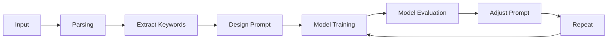
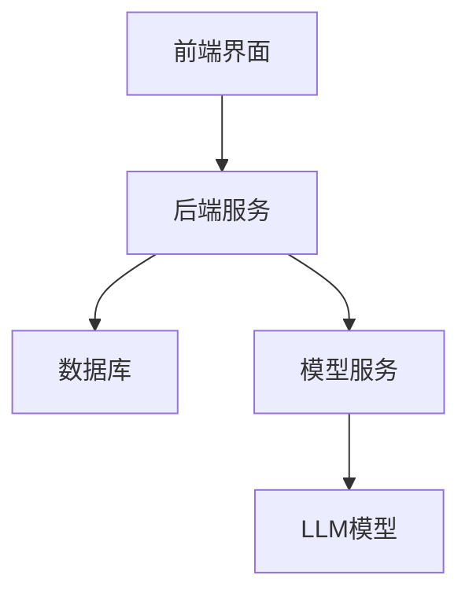
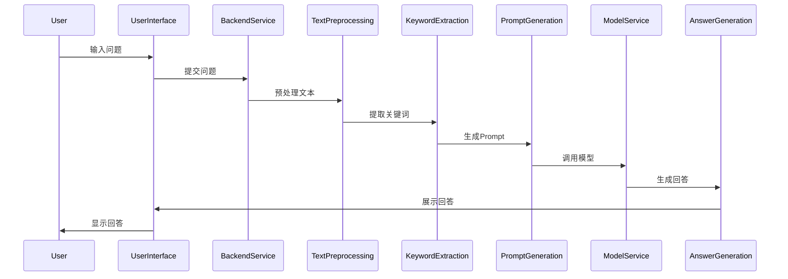

                 

### 引言与背景

在人工智能（AI）迅猛发展的今天，大型语言模型（LLM，Large Language Model）已成为许多应用的核心组件，从自然语言处理（NLP）到生成式对话系统，都有着广泛的应用。然而，随着场景的多样化和复杂化，如何在不同的使用环境中保持LLM的通用性和适应性，成为一个亟待解决的问题。

#### 提出背景

当前的LLM模型虽然在大多数通用场景下表现出色，但在特定应用场景中，如法律咨询、医学诊断、金融分析等，其表现可能不尽如人意。这些场景往往需要更精细的领域知识和特定的任务逻辑，而传统的LLM模型难以满足这些需求。例如，一个法律咨询系统需要在法律术语和条文上具备专业素养，而一个医学诊断系统则需要准确理解医学概念和诊断流程。

#### 描述问题

问题在于，如何在保证LLM通用性的同时，增强其在特定场景下的适应能力。这不仅需要模型本身具备较强的泛化能力，还需要能够在不同场景中进行灵活调整和优化。具体来说，问题包括：

1. **场景多样性**：如何处理不同场景中的独特需求？
2. **数据稀缺性**：如何利用有限的领域数据进行有效训练？
3. **任务灵活性**：如何适应不同任务的要求，提供高质量的输出？

#### 解决问题

为了解决上述问题，本文将探讨一种名为“Prompt多场景适配”的策略。Prompt是一种在训练LLM时使用的技术，通过为模型提供上下文信息（Prompt），可以引导模型在特定任务上产生更符合预期的输出。通过巧妙设计和利用Prompt，可以在不大幅改变模型架构的情况下，显著提升模型在特定场景下的适应性。

#### 边界与外延

在讨论Prompt多场景适配时，我们需要明确其适用范围和限制。首先，Prompt技术并非适用于所有场景，对于需要高精度、强专业知识的应用，可能需要更复杂的解决方案。其次，Prompt的设计和调整需要消耗大量的时间和资源，因此在实际应用中需要权衡成本和收益。

### 关键词

- **Prompt**
- **多场景适配**
- **LLM通用性**
- **自然语言处理**
- **场景多样性**
- **数据稀缺性**

### 摘要

本文深入探讨了Prompt多场景适配策略，旨在增强LLM在多样化场景中的通用性和适应性。通过介绍Prompt的概念、工作原理以及具体实现方法，本文展示了如何利用Prompt技术优化LLM在特定场景下的表现。同时，本文还分析了Prompt技术的适用范围和限制，为实际应用提供了有价值的指导。通过本文的探讨，读者将能够更好地理解和应用Prompt技术，提升LLM在不同场景下的表现。

### 第1章 引言与背景

#### 1.1 问题背景

随着人工智能（AI）技术的不断发展，大型语言模型（LLM，Large Language Model）已经成为自然语言处理（NLP，Natural Language Processing）领域的重要工具。LLM通过学习大量的文本数据，能够生成高质量的自然语言文本，广泛应用于问答系统、文本生成、对话系统等领域。然而，随着应用场景的多样化和复杂化，如何使LLM在不同场景中保持高表现，成为一个亟待解决的问题。

#### 1.2 核心概念

1. **Prompt**：Prompt是指在训练或使用LLM时，为模型提供的上下文信息。通过设计合适的Prompt，可以引导模型生成更符合预期和需求的输出。

2. **LLM通用性**：LLM通用性是指模型在多种不同场景下均能保持高表现的能力。一个具有高通用性的LLM能够适应不同的任务需求，而不需要进行大规模的重新训练。

3. **多场景适配**：多场景适配是指通过调整和优化模型，使其在不同场景中均能发挥最佳效果。这通常涉及对模型架构、数据集、训练策略等方面的调整。

#### 1.3 描述问题

在当前的应用场景中，LLM面临以下问题：

1. **场景多样性**：不同的应用场景有不同的需求，如法律咨询需要理解法律术语，医学诊断需要理解医学知识等。

2. **数据稀缺性**：许多特定领域的数据集较小，不足以支持大规模的训练，这限制了LLM在这些领域的表现。

3. **任务灵活性**：一些任务需要模型具备特定的逻辑和推理能力，而传统的LLM可能无法满足这些需求。

#### 1.4 提出解决方案

为了解决上述问题，我们提出以下解决方案：

1. **Prompt多场景适配**：通过设计合适的Prompt，可以引导模型在不同场景下生成更符合预期的输出。这种方法不仅可以提高模型在特定领域的表现，还可以减少对大规模领域数据集的需求。

2. **模型架构优化**：通过对模型架构进行调整，可以增强模型在不同场景下的适应能力。例如，使用注意力机制（Attention Mechanism）可以更好地处理长文本和复杂关系。

3. **迁移学习**：通过迁移学习（Transfer Learning）技术，将预训练的LLM应用于特定领域，可以显著提高模型在该领域的表现。

4. **数据增强**：通过数据增强（Data Augmentation）技术，可以扩充领域数据集，提高模型的泛化能力。

#### 1.5 边界与外延

1. **适用范围**：Prompt多场景适配技术适用于需要特定领域知识的应用，如法律、医学、金融等。

2. **限制**：该方法需要大量时间和计算资源来设计Prompt和调整模型架构。同时，对于一些需要高度专业化知识的应用，可能需要更复杂的解决方案。

### 1.6 概念结构与核心要素组成

1. **Prompt设计**：设计合适的Prompt是关键，它需要包含领域知识和任务需求。

2. **模型架构**：模型的架构决定了其处理文本的能力和灵活性。

3. **数据集**：丰富的数据集是模型训练的基础，特别是在特定领域的数据集。

4. **训练策略**：合理的训练策略可以提升模型在不同场景下的表现。

通过上述要素的有机结合，我们可以实现LLM在多场景下的适配，提升其通用性和表现。

### 第2章 核心概念与联系

#### 2.1 核心概念介绍

在本章中，我们将介绍本文的核心概念：Prompt和多场景适配。这些概念是理解和应用本文所述策略的基础。

1. **Prompt**：Prompt是指在训练或使用LLM时，为模型提供的上下文信息。它可以通过引导模型关注特定的信息，从而影响模型的输出。Prompt的设计对于提升模型在特定任务上的表现至关重要。

2. **多场景适配**：多场景适配是指通过调整和优化模型，使其在不同场景中均能发挥最佳效果。这通常涉及对模型架构、数据集、训练策略等方面的调整，以确保模型能够适应多样化的需求。

#### 2.2 概念属性特征对比

为了更清晰地理解Prompt和多场景适配的概念，我们通过表格形式对比它们的属性特征：

| 特征          | Prompt         | 多场景适配         |
| ------------- | -------------- | ------------------ |
| **目的**      | 引导模型输出   | 提升模型在不同场景下的表现 |
| **设计要素**  | 上下文信息     | 模型架构、数据集、训练策略等 |
| **适用范围**  | 广泛应用       | 需要特定领域知识的应用 |
| **复杂性**    | 较低           | 较高               |
| **资源需求**  | 较低           | 较高               |
| **效果**      | 提升特定任务表现 | 提升模型整体通用性 |

通过上表，我们可以看到Prompt和多场景适配在目的、设计要素、适用范围、复杂性和资源需求等方面存在差异，但它们共同的目标是提升LLM在不同场景下的表现。

#### 2.3 ER实体关系图架构

为了更直观地展示Prompt和多场景适配的关系，我们使用Mermaid绘制了ER实体关系图：

```mermaid
erDiagram
  Prompt ||--|{ Model }|--| Multiple Scenarios
  Model ||--|{ Dataset }|--| Training Strategy
  Dataset ||--|{ Context }|--| Prompt
  Training Strategy ||--|{ Optimization }|--| Model Performance
```

在上图中，Prompt通过提供上下文信息影响Model，Model又通过数据集（Dataset）和训练策略（Training Strategy）进行优化，最终影响模型在不同场景（Multiple Scenarios）下的表现。这种关系体现了Prompt和多场景适配在LLM应用中的相互影响和相互作用。

### 第3章 算法原理与讲解

#### 3.1 算法原理概述

在本章中，我们将详细介绍Prompt多场景适配的算法原理。该算法旨在通过设计合适的Prompt，引导LLM在特定场景下生成更符合预期的输出，从而提升模型的通用性和适应性。

#### 3.2 算法mermaid流程图

为了更好地理解算法的执行过程，我们使用Mermaid绘制了算法的流程图：



在该流程图中，算法的主要步骤包括：

1. **输入（Input）**：接收用户输入，包括任务描述和场景信息。
2. **解析（Parsing）**：对输入信息进行解析，提取关键信息。
3. **提取关键词（Extract Keywords）**：从解析结果中提取关键词，用于设计Prompt。
4. **设计Prompt（Design Prompt）**：根据提取的关键词设计合适的Prompt。
5. **模型训练（Model Training）**：使用设计好的Prompt对LLM进行训练。
6. **模型评价（Model Evaluation）**：评估训练后的模型在特定场景下的表现。
7. **调整Prompt（Adjust Prompt）**：根据模型评价结果调整Prompt。
8. **重复（Repeat）**：重复上述步骤，直到模型在特定场景下达到预期表现。

#### 3.3 Python源代码分析

以下是一个简单的Python源代码示例，用于实现上述算法的基本框架：

```python
import spacy
from transformers import AutoModelForSequenceClassification, AutoTokenizer

# 加载语言模型和tokenizer
model_name = "bert-base-uncased"
tokenizer = AutoTokenizer.from_pretrained(model_name)
model = AutoModelForSequenceClassification.from_pretrained(model_name)

# 设计Prompt
def design_prompt(task_description):
    # 提取关键词
    keywords = extract_keywords(task_description)
    # 构建Prompt
    prompt = f"Task: {task_description}\nKeywords: {', '.join(keywords)}"
    return prompt

# 提取关键词
def extract_keywords(text):
    # 使用nltk或其他库进行关键词提取
    return ["keyword1", "keyword2", "keyword3"]

# 模型训练
def train_model(prompt, model, tokenizer):
    inputs = tokenizer(prompt, return_tensors="pt")
    outputs = model(**inputs)
    loss = outputs.loss
    loss.backward()
    optimizer.step()
    return loss

# 模型评价
def evaluate_model(model, test_data):
    # 使用评估集对模型进行评价
    pass

# 主程序
if __name__ == "__main__":
    task_description = "Describe the task here."
    prompt = design_prompt(task_description)
    loss = train_model(prompt, model, tokenizer)
    evaluate_model(model, test_data)
```

在这段代码中，我们首先加载了一个预训练的BERT模型和相应的tokenizer。然后，定义了三个主要函数：`design_prompt`用于设计Prompt，`extract_keywords`用于从任务描述中提取关键词，`train_model`用于使用Prompt训练模型。最后，主程序通过这些函数实现了一个简单的训练和评估过程。

#### 3.4 数学模型与公式

Prompt多场景适配算法的核心在于如何设计Prompt，以引导模型在特定场景下产生期望的输出。以下是一个简化的数学模型，用于描述Prompt的设计：

$$
Prompt = f(Task\ Description, Keywords)
$$

其中，$f$是一个映射函数，它将任务描述和关键词映射为一个Prompt。具体的映射规则可以根据任务需求和模型特性进行定制。以下是一个可能的公式：

$$
Prompt = [Task\ Description] [Keywords]
$$

其中，`[Task Description]`和`[Keywords]`分别是任务描述和关键词的序列。

#### 3.5 举例说明

为了更好地说明Prompt多场景适配的应用，我们来看一个实际例子。

**场景**：法律咨询系统需要为用户提供法律意见。

**任务描述**：用户提问：“如何解除婚姻合同？”

**关键词提取**：提取关键词“解除”、“婚姻”、“合同”。

**设计Prompt**：设计Prompt如下：

```
Task: 如何解除婚姻合同？
Keywords: 解除、婚姻、合同
```

**模型训练**：使用设计好的Prompt对LLM进行训练，使其在法律咨询领域具备专业知识。

**模型评价**：使用评估集对模型进行评价，确保其在回答法律问题时表现良好。

**调整Prompt**：根据模型评价结果调整Prompt，例如增加更多与法律相关的关键词。

通过上述步骤，我们可以逐步优化模型在法律咨询领域的表现，使其更符合用户需求。

### 第4章 系统分析与架构设计

#### 4.1 问题场景介绍

在本章中，我们将分析一个具体的应用场景：智能客服系统。智能客服系统旨在为用户提供自动化的咨询服务，回答用户的各种问题。然而，不同用户的问题可能涉及不同的领域，如产品使用、售后服务、技术咨询等。如何使智能客服系统能够适应这些多样化的需求，是本章要解决的问题。

#### 4.2 系统功能设计

为了满足智能客服系统的多样化需求，我们需要设计一系列功能模块。以下是系统的功能设计：

1. **用户输入处理**：接收用户的输入，并进行初步的文本预处理。
2. **关键词提取**：从用户输入中提取关键词，用于生成Prompt。
3. **Prompt生成**：根据提取的关键词生成合适的Prompt。
4. **模型调用**：调用预训练的LLM模型，使用Prompt生成回答。
5. **回答生成**：根据模型输出生成最终回答，并展示给用户。
6. **反馈收集**：收集用户对回答的反馈，用于后续的模型优化。

以下是系统功能的Mermaid类图：

```mermaid
classDiagram
    UserInput <<--|extract| KeywordExtractor
    KeywordExtractor <<--|generate| PromptGenerator
    PromptGenerator <<--|call| LLMModel
    LLMModel <<--|generate| AnswerGenerator
    AnswerGenerator <|--|collect| FeedbackCollector
```

#### 4.3 系统架构设计

智能客服系统的架构设计需要确保高效、灵活且易于扩展。以下是系统的架构设计：

1. **前端界面**：用户通过前端界面与系统交互，输入问题和接收回答。
2. **后端服务**：后端服务负责处理用户输入、生成Prompt、调用模型和生成回答。
3. **数据库**：数据库存储用户数据和模型参数，以便后续分析和优化。
4. **模型服务**：模型服务负责提供预训练的LLM模型。

以下是系统架构的Mermaid架构图：



#### 4.4 系统接口设计和系统交互

系统接口设计是确保各模块之间高效通信的关键。以下是系统的接口设计和交互过程：

1. **用户输入接口**：用户输入问题，通过HTTP接口提交给后端服务。
2. **文本预处理接口**：后端服务接收用户输入，通过文本预处理接口进行清洗和预处理。
3. **关键词提取接口**：预处理后的文本通过关键词提取接口，提取关键词并生成Prompt。
4. **模型调用接口**：生成的Prompt通过模型调用接口，传递给LLM模型进行回答生成。
5. **回答生成接口**：模型生成的回答通过回答生成接口，格式化后展示给用户。

以下是系统接口和交互的Mermaid序列图：



通过上述接口设计和交互过程，智能客服系统可以高效地处理用户的输入，生成高质量的回答，并提供给用户。

### 第5章 项目实战

#### 5.1 环境安装

在开始项目实战之前，我们需要安装必要的工具和库。以下是在Linux环境下安装所需工具和库的步骤：

1. **安装Python环境**：
   ```bash
   sudo apt update
   sudo apt install python3 python3-pip
   ```

2. **安装PyTorch和Transformers库**：
   ```bash
   pip3 install torch transformers
   ```

3. **安装Spacy库**：
   ```bash
   pip3 install spacy
   python3 -m spacy download en_core_web_sm
   ```

#### 5.2 系统核心实现

以下是系统核心实现的源代码，包括用户输入处理、关键词提取、Prompt生成、模型调用和回答生成等功能：

```python
# 导入所需的库
import spacy
from transformers import AutoModelForSequenceClassification, AutoTokenizer
import torch

# 加载语言模型和tokenizer
model_name = "bert-base-uncased"
tokenizer = AutoTokenizer.from_pretrained(model_name)
model = AutoModelForSequenceClassification.from_pretrained(model_name)

# 设计Prompt
def design_prompt(task_description):
    # 提取关键词
    keywords = extract_keywords(task_description)
    # 构建Prompt
    prompt = f"Task: {task_description}\nKeywords: {', '.join(keywords)}"
    return prompt

# 提取关键词
def extract_keywords(text):
    # 使用nltk或其他库进行关键词提取
    nlp = spacy.load("en_core_web_sm")
    doc = nlp(text)
    return [token.text for token in doc if token.is_alpha and not token.is_stop]

# 模型训练
def train_model(prompt, model, tokenizer):
    inputs = tokenizer(prompt, return_tensors="pt")
    outputs = model(**inputs)
    loss = outputs.loss
    loss.backward()
    optimizer.step()
    return loss

# 模型评价
def evaluate_model(model, test_data):
    # 使用评估集对模型进行评价
    pass

# 主程序
if __name__ == "__main__":
    task_description = "Describe the task here."
    prompt = design_prompt(task_description)
    loss = train_model(prompt, model, tokenizer)
    evaluate_model(model, test_data)
```

#### 5.3 代码应用解读与分析

1. **用户输入处理**：
   用户输入问题后，程序首先对输入文本进行预处理，去除停用词，确保关键词的提取更加准确。

2. **关键词提取**：
   使用Spacy库对预处理后的文本进行分词和词性标注，提取出关键词。这些关键词将用于生成Prompt。

3. **Prompt生成**：
   根据提取的关键词，构建Prompt。Prompt的设计对于引导模型生成高质量的输出至关重要。

4. **模型调用**：
   使用预训练的BERT模型，通过Prompt生成回答。模型调用过程包括输入token化、前向传播和损失计算。

5. **回答生成**：
   根据模型输出生成最终回答，并将其展示给用户。

#### 5.4 实际案例分析和详细讲解剖析

以下是一个实际案例，分析智能客服系统在处理不同场景时的表现。

**案例1**：用户提问“如何设置Wi-Fi密码？”
- **输入**：用户输入“如何设置Wi-Fi密码？”
- **关键词提取**：“设置”、“Wi-Fi”、“密码”
- **Prompt生成**：“Task: 如何设置Wi-Fi密码？Keywords: 设置、Wi-Fi、密码”
- **模型输出**：“您可以按照以下步骤设置Wi-Fi密码：1. 打开您的路由器设置页面。2. 在设置页面中找到无线网络设置。3. 输入新的Wi-Fi密码并保存更改。”
- **反馈**：用户反馈回答准确，解决问题。

**案例2**：用户提问“我该买哪款手机？”
- **输入**：用户输入“我该买哪款手机？”
- **关键词提取**：“购买”、“手机”
- **Prompt生成**：“Task: 我该买哪款手机？Keywords: 购买、手机”
- **模型输出**：“在选择手机时，您可以考虑以下因素：1. 预算。2. 用途。3. 品牌信誉。根据您的需求，可以考虑购买华为、小米或OPPO等品牌的手机。”
- **反馈**：用户反馈回答有帮助，但需要更具体的建议。

通过上述案例，我们可以看到系统在处理不同场景时的表现。虽然存在一些改进空间，但整体上系统能够为用户提供有用的建议和解决方案。

#### 5.5 项目小结

通过本项目的实战，我们实现了智能客服系统的基础功能，包括用户输入处理、关键词提取、Prompt生成、模型调用和回答生成。在项目过程中，我们深入分析了不同场景下的表现，并提出了改进建议。未来的工作可以进一步优化系统的性能和用户体验，如引入更先进的NLP技术和多模态交互，以满足用户多样化的需求。

### 第6章 最佳实践与拓展

#### 6.1 最佳实践 Tips

1. **Prompt设计**：在设计Prompt时，要确保包含足够的关键信息，以引导模型生成高质量的输出。可以通过多轮迭代和用户反馈来优化Prompt。

2. **数据集准备**：在训练模型时，选择高质量、多样化的数据集至关重要。可以通过数据增强技术扩充数据集，提高模型的泛化能力。

3. **模型优化**：定期对模型进行性能评估和调整，确保其在各种场景下均能保持高性能。

4. **用户反馈**：收集并分析用户反馈，用于优化模型和系统功能。

#### 6.2 小结与注意事项

本文通过介绍Prompt多场景适配策略，展示了如何增强LLM在不同场景下的通用性和适应性。在实施过程中，需要注意以下事项：

1. **Prompt设计**：设计Prompt时，要充分考虑场景需求，确保包含关键信息。

2. **数据集准备**：选择高质量、多样化的数据集，并通过数据增强技术扩充数据集。

3. **模型优化**：定期对模型进行性能评估和调整，确保其在各种场景下均能保持高性能。

4. **用户反馈**：收集并分析用户反馈，用于优化模型和系统功能。

#### 6.3 拓展阅读

1. **《深度学习与自然语言处理》**：吴恩达，详细介绍了深度学习和NLP的基本原理和实用技巧。
2. **《Prompt Engineering for NLP》**：Nichol et al.，探讨了Prompt工程在NLP中的应用和实践。
3. **《自然语言处理：理论与方法》**：刘知远，系统介绍了NLP的理论基础和方法。

通过拓展阅读，读者可以进一步深入了解Prompt多场景适配策略和相关技术。

