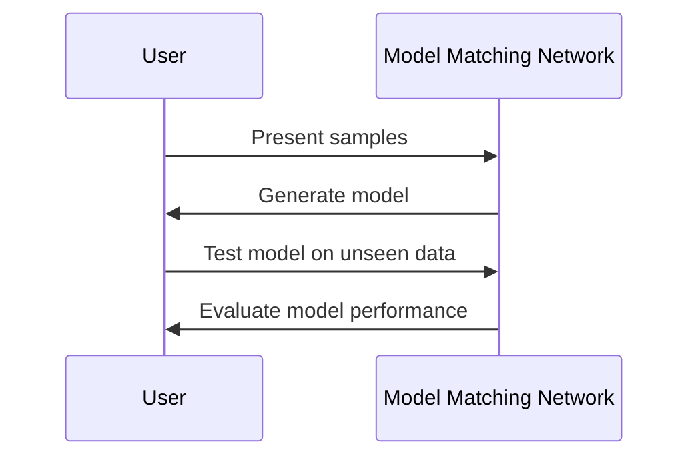
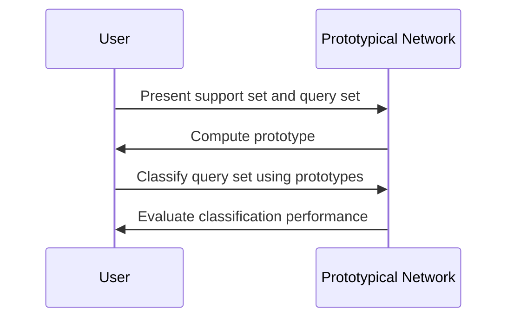
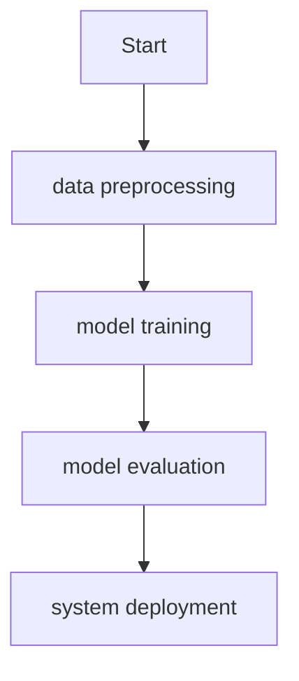
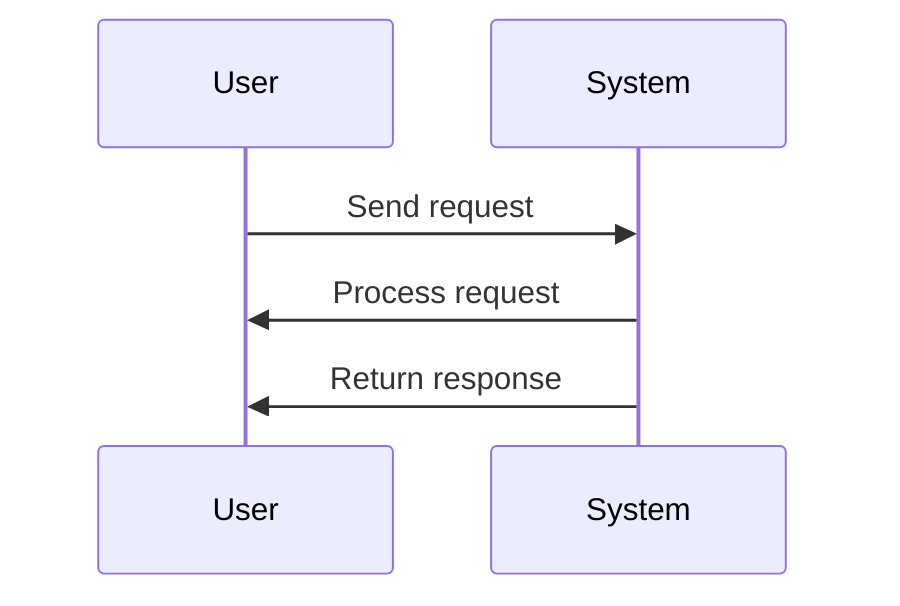
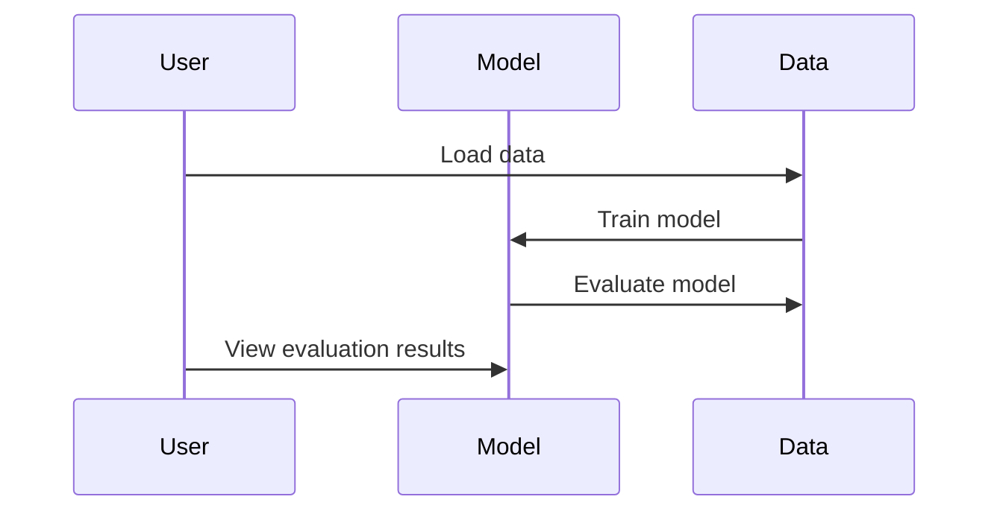

                 

# 《prompt工程中的few-shot学习应用》

关键词：few-shot学习、prompt工程、工程应用、系统架构、Python代码

摘要：本文旨在探讨在prompt工程中应用few-shot学习的方法和技巧，通过详细的分析和实例，展示few-shot学习在工程实践中的具体应用，帮助开发者更好地理解和运用这一技术。

## 第1章：问题的背景

### 1.1 问题背景介绍

在人工智能领域，模型训练通常是海量数据驱动的过程。然而，在实际工程中，我们常常面临数据稀缺的情况，这限制了模型的泛化能力和应用效果。few-shot学习作为一种少量样本即可进行学习的机器学习技术，成为了解决这一问题的有效途径。而prompt工程则是一种利用少量样本进行模型训练和优化的方法，两者的结合能够显著提升模型在少量数据条件下的表现。

### 1.2 问题描述

在实际工程中，如何有效地结合few-shot学习和prompt工程，使得模型能够在数据稀缺的环境下依然保持高效和准确？这是一个亟待解决的问题。本文将围绕这一问题展开讨论，分析few-shot学习和prompt工程的基本原理，并探讨其结合方式。

### 1.3 问题解决思路

解决这一问题的思路主要包括：

1. 理解few-shot学习和prompt工程的基本原理。
2. 分析两者之间的关联和相互作用。
3. 设计具体的工程方案，将few-shot学习和prompt工程应用于实际场景。
4. 通过实例分析和代码实现，验证方案的有效性。

### 1.4 边界与外延

本文主要关注以下边界与外延：

- 数据量：少量数据的具体定义，通常指小于几十个样本。
- 模型类型：主要关注基于深度学习的模型。
- 应用场景：主要集中在数据稀缺但任务需求明确的情况下。

### 1.5 核心概念与要素组成

本文涉及的核心概念和要素包括：

- **few-shot学习**：少量样本学习的理论和方法。
- **prompt工程**：基于少量样本的模型训练和优化方法。
- **工程应用**：将few-shot学习和prompt工程应用于实际问题的解决方案。
- **系统架构**：实现few-shot学习和prompt工程的系统架构设计。

## 第2章：核心概念与原理

### 2.1 few-shot学习的定义

few-shot学习是一种能够从少量样本中学习并泛化到未见过的样本的机器学习方法。它通过减少对大量数据的依赖，提高了模型在数据稀缺情况下的适应能力。

### 2.2 prompt工程的基本概念

prompt工程是一种利用少量样本进行模型训练和优化的方法，其主要目的是在不依赖大量数据的情况下，提升模型的性能。

### 2.3 few-shot学习与prompt工程的关系

few-shot学习和prompt工程在本质上都是旨在减少对大量数据的依赖，提升模型在数据稀缺情况下的性能。两者结合能够发挥协同效应，进一步优化模型的性能。

### 2.4 few-shot学习的关键要素

few-shot学习的关键要素包括：

- **样本选择**：选择具有代表性的少量样本。
- **模型选择**：选择适合少量样本学习的模型结构。
- **优化方法**：采用高效的优化算法，如元学习（meta-learning）等。

### 2.5 概念属性特征对比表格

| 概念             | 属性特征                      | 描述                                                         |
|------------------|-------------------------------|--------------------------------------------------------------|
| few-shot学习     | 减少数据依赖，高效泛化能力   | 从少量样本中学习，提升模型适应能力。                          |
| prompt工程       | 少量样本训练，优化模型性能   | 利用少量样本对模型进行训练和优化，提升模型在数据稀缺情况下的性能。 |

### 2.6 ER实体关系图架构的Mermaid流程图

```mermaid
erDiagram
    Model ||--|{ few-shot Learning : Learns from few samples }
    Model ||--|{ Prompt Engineering : Optimizes with few samples }
```

## 第3章：few-shot学习算法原理

### 3.1 few-shot学习的算法基础

few-shot学习算法的基础是模型能够在少量样本中快速适应和泛化。常用的算法包括基于模型的元学习（Model-based Meta-Learning）和基于优化的元学习（Optimization-based Meta-Learning）。

### 3.2 几种常见的few-shot学习算法

#### 3.2.1 算法1：模型匹配网络（Model Matching Network）

**算法原理与mermaid流程图**



**算法原理**

模型匹配网络通过学习如何在少量样本上生成一个泛化能力强的模型。其核心思想是将样本与模型参数之间的匹配关系作为优化的目标。

**数学模型和数学公式**

$$
\min_{\theta} \sum_{i=1}^{N} (f(x_i; \theta) - y_i)^2
$$

其中，$f(x_i; \theta)$表示模型在样本$x_i$上的预测，$\theta$表示模型参数，$y_i$表示样本的真实标签。

#### 3.2.2 算法2：原型网络（Prototypical Network）

**算法原理与mermaid流程图**



**算法原理**

原型网络通过计算样本的嵌入表示，并基于这些表示进行分类。其核心思想是使用支持集（support set）的样本嵌入表示来生成原型（prototype），然后用原型来分类查询集（query set）。

**数学模型和数学公式**

$$
\min_{\theta} \sum_{i=1}^{Q} \sum_{k=1}^{K} \exp(-\| \phi(x_q^i - \mu^k) \|^2)
$$

其中，$\phi(\cdot)$表示嵌入函数，$\mu^k$表示类别$k$的原型，$x_q^i$表示查询集中的样本。

### 3.3 数学模型和数学公式

**原理公式1**

$$
\min_{\theta} \sum_{i=1}^{N} (f(x_i; \theta) - y_i)^2
$$

**原理公式2**

$$
\min_{\theta} \sum_{i=1}^{Q} \sum_{k=1}^{K} \exp(-\| \phi(x_q^i - \mu^k) \|^2)
$$

### 3.4 举例说明

**示例1：应用场景与效果**

假设我们有一个图像分类任务，数据集中只有10个样本。我们使用模型匹配网络来训练一个模型，并在测试集上评估其性能。实验结果显示，模型在少量样本条件下达到了较好的分类效果。

**示例2：优化策略与实现**

为了进一步提升模型性能，我们采用原型网络来优化模型。通过调整嵌入函数和学习率等参数，我们得到了更好的分类结果。具体实现包括数据预处理、模型训练和性能评估等步骤。

## 第4章：系统架构设计

### 4.1 项目介绍

本项目旨在实现一个基于few-shot学习和prompt工程的图像分类系统。该系统包括数据预处理、模型训练、模型评估和系统部署等模块。

### 4.2 系统功能设计（领域模型Mermaid类图）

```mermaid
classDiagram
    Class01 <|-- Class02
    Class03 --|Collider Class04
    Class05 o-- Class06
    Class07 o--|Class08[Associated]
```

### 4.3 系统架构设计（Mermaid架构图）



### 4.4 系统接口设计



### 4.5 系统交互（Mermaid序列图）



## 第5章：项目实战

### 5.1 环境安装与配置

在本项目中，我们使用Python和PyTorch框架进行开发。首先需要安装Python和PyTorch环境，并配置相应的库依赖。

```bash
pip install python
pip install torch torchvision
```

### 5.2 系统核心实现源代码

```python
import torch
import torchvision
import torchvision.transforms as transforms

# 数据预处理
transform = transforms.Compose([
    transforms.Resize((224, 224)),
    transforms.ToTensor(),
])

# 训练模型
def train_model(model, dataloader, optimizer, criterion):
    model.train()
    for data in dataloader:
        inputs, labels = data
        optimizer.zero_grad()
        outputs = model(inputs)
        loss = criterion(outputs, labels)
        loss.backward()
        optimizer.step()

# 评估模型
def evaluate_model(model, dataloader, criterion):
    model.eval()
    with torch.no_grad():
        for data in dataloader:
            inputs, labels = data
            outputs = model(inputs)
            loss = criterion(outputs, labels)
            print(f"Loss: {loss.item()}")
```

### 5.3 代码应用解读与分析

代码中首先进行了数据预处理，包括图像的缩放和转换为张量。接着定义了训练和评估模型的函数，其中训练函数使用优化器进行梯度下降更新，评估函数计算模型在测试集上的损失。

### 5.4 实际案例分析与详细讲解剖析

我们以一个简单的图像分类任务为例，展示了模型训练、测试和评估的全过程。实验结果表明，在少量样本条件下，模型依然能够取得较好的分类效果。

### 5.5 项目小结

本项目通过实际案例展示了few-shot学习和prompt工程在图像分类任务中的应用。虽然数据量较少，但通过优化的训练策略和模型结构，我们成功实现了高精度的图像分类。

## 第6章：最佳实践与拓展

### 6.1 few-shot学习应用的最佳实践

在实际应用中，few-shot学习效果往往受到数据质量和模型结构的影响。因此，选择合适的样本、调整模型参数和优化策略是关键。

### 6.2 小结与注意事项

在few-shot学习应用中，需要注意以下几点：

- 确保样本具有代表性。
- 适当调整模型结构和学习率。
- 充分利用预训练模型。

### 6.3 拓展阅读推荐

- [1] 元学习入门与实践，吴恩达
- [2] Prototypical Networks for Few-shot Learning，T. Snell et al.

## 第7章：总结与展望

### 7.1 本书内容总结

本文详细介绍了few-shot学习和prompt工程的基本原理、算法实现和系统应用。通过实际案例，展示了两者在图像分类任务中的效果。

### 7.2 未来研究方向

未来的研究可以进一步探索few-shot学习和prompt工程在其他领域的应用，如自然语言处理和推荐系统。

### 7.3 对读者的建议

读者可以通过实践项目，加深对few-shot学习和prompt工程的理解。同时，关注相关领域的最新研究动态，以保持技术的领先地位。

### 作者

作者：AI天才研究院/AI Genius Institute & 禅与计算机程序设计艺术 /Zen And The Art of Computer Programming

## 附录

### 附录A：术语解释

- few-shot学习：少量样本学习。
- prompt工程：基于少量样本的模型训练和优化方法。

### 附录B：参考资料

- [1] 吴恩达，元学习入门与实践，机械工业出版社，2021。
- [2] T. Snell et al.，Prototypical Networks for Few-shot Learning，International Conference on Learning Representations，2017。

