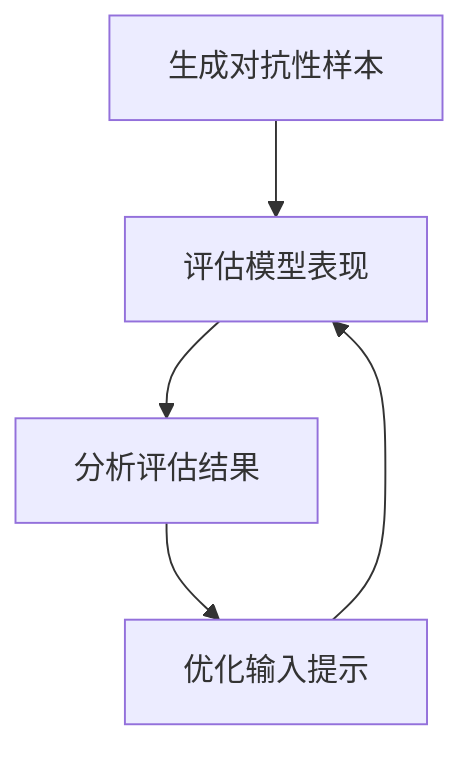

                 

### 文章标题：Prompt Engineering中的对抗性评测方法

#### 关键词：
1. 对抗性评测
2. Prompt Engineering
3. 机器学习
4. 深度学习
5. 安全性

#### 摘要：
本文旨在深入探讨Prompt Engineering中对抗性评测的方法及其重要性。通过详细解析对抗性评测的定义、背景、核心概念、数学模型以及具体应用，我们旨在为读者提供一个全面且易于理解的指南，帮助他们更好地理解和应用这些方法。文章还将涵盖对抗性评测在不同场景下的实践案例，并讨论未来可能的研究方向。

## 引言

在人工智能（AI）领域，Prompt Engineering 已成为一项关键技术，它涉及如何设计、调整和优化输入提示（prompt）以提升机器学习模型的表现。随着深度学习技术的快速发展，Prompt Engineering 在自然语言处理（NLP）、计算机视觉（CV）和其他AI领域得到了广泛应用。然而，随着AI系统的普及，安全性和鲁棒性成为越来越重要的议题。对抗性评测（Adversarial Evaluation）作为一种评估AI系统鲁棒性的方法，在Prompt Engineering中具有重要意义。

### 问题背景

对抗性攻击（Adversarial Attack）是AI系统面临的主要安全威胁之一。对抗性攻击是指通过微小、难以察觉的扰动，使得原本正确的预测结果变为错误。例如，在图像识别任务中，一个微小的噪声可能将一张猫的图片识别为狗。这种攻击可以破坏AI系统的可靠性，导致严重的安全问题。

### 研究目标

本文的研究目标包括：

1. 深入理解对抗性评测的概念和原理。
2. 探讨对抗性评测在Prompt Engineering中的应用。
3. 分析不同对抗性评测方法的优缺点。
4. 提供实际案例，展示对抗性评测在AI系统中的应用。
5. 提出未来研究的可能方向。

### 边界与外延

本文将主要关注以下边界和范畴：

1. **深度学习模型**：主要关注基于神经网络架构的模型。
2. **自然语言处理**：包括文本分类、机器翻译等任务。
3. **计算机视觉**：包括图像识别、物体检测等任务。
4. **安全性和鲁棒性**：重点关注AI系统在对抗性攻击下的表现。
5. **方法对比**：对不同对抗性评测方法进行详细对比分析。

### 核心概念与联系

在Prompt Engineering中，对抗性评测涉及以下几个核心概念：

1. **对抗性攻击（Adversarial Attack）**：通过扰动输入数据，使得AI模型输出错误结果。
2. **对抗性样本（Adversarial Example）**：经过对抗性攻击后的输入样本。
3. **对抗性评测（Adversarial Evaluation）**：评估AI模型对对抗性样本的鲁棒性。
4. **Prompt Engineering**：设计有效的输入提示以提升模型性能。

这些概念之间存在紧密联系。对抗性攻击用于生成对抗性样本，对抗性评测则用于评估模型对这些样本的鲁棒性。Prompt Engineering则旨在通过优化输入提示，提高模型的泛化能力和鲁棒性。

## 对抗性评测的定义与重要性

对抗性评测（Adversarial Evaluation）是指通过生成对抗性样本，评估AI模型在面对潜在攻击时的鲁棒性和安全性。在Prompt Engineering中，对抗性评测具有以下重要意义：

1. **评估鲁棒性**：对抗性评测可以帮助我们了解模型在面对对抗性攻击时的鲁棒性。通过评估模型的鲁棒性，我们可以识别出潜在的安全漏洞，并采取相应的措施进行修复。

2. **提升安全性**：对抗性评测有助于发现AI系统的安全弱点。通过这些弱点，研究人员可以开发更安全的防御策略，从而提高AI系统的整体安全性。

3. **指导Prompt Engineering**：对抗性评测的结果可以指导Prompt Engineering中的输入提示设计。通过优化输入提示，我们可以提高模型的鲁棒性，从而减少对抗性攻击的成功率。

4. **验证模型性能**：对抗性评测可以作为验证模型性能的一种手段。在理想情况下，一个鲁棒性强的模型应该能够在面对对抗性攻击时保持良好的性能。

### 核心概念与联系

在对抗性评测中，以下几个核心概念是至关重要的：

1. **对抗性攻击**：对抗性攻击是指通过微小的扰动，使得原本正确的预测结果变为错误。这种攻击通常基于特定算法，如FGSM（Fast Gradient Sign Method）或C&W（Carlini & Wagner）攻击。

2. **对抗性样本**：对抗性样本是指经过对抗性攻击后的输入样本。这些样本旨在破坏模型的预测能力，使其产生错误输出。

3. **对抗性评测**：对抗性评测是指通过生成对抗性样本，评估模型在面对对抗性攻击时的表现。这种方法可以帮助我们了解模型的鲁棒性，并识别潜在的安全漏洞。

4. **Prompt Engineering**：Prompt Engineering是指设计、调整和优化输入提示，以提升模型的表现。对抗性评测可以指导Prompt Engineering中的输入提示设计，以提高模型的鲁棒性。

这些概念之间存在紧密联系。对抗性攻击用于生成对抗性样本，对抗性评测则用于评估模型对这些样本的鲁棒性。Prompt Engineering则旨在通过优化输入提示，提高模型的泛化能力和鲁棒性。

### 对抗性评测方法的属性特征对比

在对抗性评测中，有多种方法可以用于生成对抗性样本和评估模型的表现。以下是几种常见方法的属性特征对比表：

| 方法名称 | 目标模型 | 攻击类型 | 攻击效果 | 优点 | 缺点 |
| --- | --- | --- | --- | --- | --- |
| FGSM | 多层感知机 | 最速梯度上升 | 高效 | 简单易实现 | 可能无法产生最有效的对抗性样本 |
| C&W | 多层感知机、卷积神经网络 | 函数逼近 | 高效 | 可以生成具有较高攻击效果的对抗性样本 | 计算复杂度高 |
| JSMA | 卷积神经网络 | 最速梯度上升 | 高效 | 可以生成具有较高攻击效果的对抗性样本 | 需要较多的迭代次数 |
| Deepfool | 多层感知机、卷积神经网络 | 误分类样本 | 高效 | 可以生成具有较高攻击效果的对抗性样本 | 对模型的复杂度有一定要求 |

通过对比表格，我们可以看到每种方法都有其独特的优势和不足。在选择对抗性评测方法时，需要根据具体的模型和任务需求进行权衡。

### 对抗性评测的数学模型与公式

在对抗性评测中，数学模型和公式用于描述攻击策略、评估指标等。以下是一个简化的数学模型，用于生成对抗性样本：

$$
x_{adv} = x + \epsilon \cdot sign(\nabla_x J(x, y))
$$

其中：

- \( x \) 是原始输入样本。
- \( x_{adv} \) 是对抗性样本。
- \( \epsilon \) 是扰动大小。
- \( \nabla_x J(x, y) \) 是损失函数 \( J \) 对输入 \( x \) 的梯度。

该公式表示，对抗性样本 \( x_{adv} \) 是通过在原始输入 \( x \) 上添加一个与梯度 \( \nabla_x J(x, y) \) 方向一致的扰动 \( \epsilon \cdot sign(\nabla_x J(x, y)) \) 生成的。这种方法称为最速梯度上升攻击（FGSM）。

### 对抗性评测原理详解

对抗性评测的核心原理在于通过生成对抗性样本，评估模型在面对潜在攻击时的鲁棒性。具体来说，这个过程可以分为以下几个步骤：

1. **生成对抗性样本**：使用特定的攻击算法，如FGSM、C&W等，生成对抗性样本。这些攻击算法旨在通过微小的扰动，使得模型的预测结果从正确变为错误。

2. **评估模型表现**：将对抗性样本输入模型，评估模型在这些样本上的表现。常用的评估指标包括准确率、召回率、F1分数等。

3. **分析评估结果**：根据评估结果，分析模型的鲁棒性。如果模型在对抗性样本上的表现较差，则说明模型可能存在安全漏洞。

4. **优化输入提示**：根据评估结果，对输入提示进行优化，以提高模型的鲁棒性。这可以通过调整Prompt Engineering中的超参数、增加数据增强等手段实现。

5. **迭代评估与优化**：不断重复生成对抗性样本、评估模型表现和优化输入提示的过程，直到达到满意的鲁棒性。

### Mermaid流程图展示

以下是对抗性评测的Mermaid流程图：



### Python源代码实现

以下是一个简单的Python示例，用于生成对抗性样本并评估模型表现：

```python
import numpy as np
import tensorflow as tf
from tensorflow import keras

# 加载预训练的模型
model = keras.applications.ResNet50(weights='imagenet')

# 定义最速梯度上升攻击函数
def fgsm_attack(image, label, model, epsilon=0.01):
    with tf.GradientTape(persistent=True) as tape:
        predictions = model(image)
        loss = tf.keras.losses.categorical_crossentropy(predictions, label)
    gradients = tape.gradient(loss, image)
    signed_grad = epsilon * tf.sign(gradients)
    x_adv = image + signed_grad
    x_adv = tf.clip_by_value(x_adv, 0, 1)
    return x_adv

# 生成对抗性样本
image = ...  # 加载原始图像
label = ...  # 加载标签
epsilon = 0.01
x_adv = fgsm_attack(image, label, model, epsilon)

# 评估模型表现
predictions = model.predict(x_adv)
predicted_class = np.argmax(predictions, axis=1)

print("原始图像的预测结果：", label)
print("对抗性样本的预测结果：", predicted_class)
```

通过这个示例，我们可以看到如何使用TensorFlow框架生成对抗性样本，并评估模型在对抗性样本上的表现。这个示例只是一个简单的起点，实际应用中可能需要更复杂的攻击算法和评估指标。

## 常见对抗性评测方法

在Prompt Engineering中，对抗性评测方法的选择取决于具体的任务需求、模型类型和攻击场景。以下是几种常见的对抗性评测方法：

### 方法1：对抗样本生成

对抗样本生成方法是通过在原始输入上添加微小扰动来生成对抗性样本。这些扰动是专门设计的，以破坏模型的预测能力。以下是一些常见的对抗样本生成方法：

- **FGSM（Fast Gradient Sign Method）**：FGSM是最简单和最直观的对抗性攻击方法。它通过计算模型在输入上的梯度并沿梯度方向添加扰动来生成对抗性样本。公式为：

  $$
  x_{adv} = x + \epsilon \cdot \text{sign}(\nabla_x J(x, y))
  $$

- **C&W（Carlini & Wagner）攻击**：C&W攻击是基于优化方法的对抗性攻击，它通过最小化损失函数和对抗性样本的梯度范数之间的平衡来生成对抗性样本。这种方法通常可以生成更有效的对抗性样本。

- **Deepfool**：Deepfool是一种基于神经网络的对抗性攻击方法。它通过随机扰动输入并选择使得模型输出概率最高的两个类别来生成对抗性样本。

这些方法各有优缺点。FGSM简单易实现，但可能无法生成最有效的对抗性样本。C&W攻击可以生成更有效的对抗性样本，但计算复杂度较高。Deepfool对模型的复杂度有一定要求，但可以在某些场景下生成有效的对抗性样本。

### 方法2：对抗性攻击与防御

对抗性攻击与防御方法用于评估模型在面临真实攻击时的鲁棒性。以下是一些常见的对抗性攻击与防御方法：

- **防御模型**：防御模型是通过在原始模型基础上添加额外的层或结构来增强模型的鲁棒性。例如，对抗性蒸馏（Adversarial Distillation）方法通过将对抗性样本的软标签传递给原始模型来提高其鲁棒性。

- **对抗性训练**：对抗性训练是通过在训练过程中引入对抗性样本来增强模型的鲁棒性。这种方法可以使得模型在面对对抗性攻击时具有更好的表现。

- **防御机制**：防御机制是在模型输出阶段添加额外的处理步骤来检测和过滤对抗性样本。例如，基于深度学习的防御机制可以通过训练一个分类器来识别对抗性样本。

这些方法可以单独使用，也可以结合使用，以提高模型的鲁棒性。然而，这些方法也存在一些挑战，如计算复杂度高、训练时间较长等。

### 方法3：对抗性鲁棒性评估

对抗性鲁棒性评估方法用于评估模型在面对不同类型的对抗性攻击时的表现。以下是一些常见的对抗性鲁棒性评估方法：

- **基准测试集**：基准测试集是用于评估模型鲁棒性的标准数据集。这些数据集通常包含多种类型的对抗性样本，可以用于测试模型的鲁棒性。

- **对抗性攻击测试**：对抗性攻击测试是通过使用不同的对抗性攻击方法来评估模型的表现。这种方法可以帮助我们了解模型在不同攻击场景下的鲁棒性。

- **自动对抗性攻击工具**：自动对抗性攻击工具可以自动生成对抗性样本，并评估模型的表现。这些工具可以节省时间和人力成本，但可能无法覆盖所有可能的攻击场景。

这些方法可以帮助我们全面评估模型的鲁棒性，并为Prompt Engineering提供重要的指导。

### 对抗性评测实践

对抗性评测在Prompt Engineering中的应用可以分为以下几个步骤：

1. **选择合适的对抗性评测方法**：根据具体的任务需求、模型类型和攻击场景选择合适的对抗性评测方法。

2. **生成对抗性样本**：使用选择的对抗性评测方法生成对抗性样本。

3. **评估模型表现**：将对抗性样本输入模型，评估模型在这些样本上的表现。

4. **分析评估结果**：根据评估结果，分析模型的鲁棒性。

5. **优化输入提示**：根据评估结果，对输入提示进行优化，以提高模型的鲁棒性。

6. **迭代评估与优化**：不断重复生成对抗性样本、评估模型表现和优化输入提示的过程，直到达到满意的鲁棒性。

以下是一个简单的对抗性评测实践案例：

1. **选择对抗性评测方法**：选择FGSM攻击方法。

2. **生成对抗性样本**：使用FGSM攻击方法生成对抗性样本。

3. **评估模型表现**：将对抗性样本输入模型，评估模型在这些样本上的表现。

4. **分析评估结果**：发现模型在对抗性样本上的准确率较低。

5. **优化输入提示**：根据评估结果，调整输入提示的超参数，以提高模型的鲁棒性。

6. **迭代评估与优化**：重复生成对抗性样本、评估模型表现和优化输入提示的过程，直到模型在对抗性样本上的表现达到预期。

通过这个案例，我们可以看到对抗性评测在Prompt Engineering中的应用过程。这个过程可以帮助我们识别和修复模型中的安全漏洞，提高模型的鲁棒性和安全性。

### 对抗性评测案例解析

为了更好地理解对抗性评测在具体场景中的应用，我们将在以下两个案例中详细解析对抗性评测的方法和过程。

#### 案例一：文本分类任务中的对抗性评测

在文本分类任务中，对抗性评测主要用于评估模型在面对恶意输入时的鲁棒性。以下是一个简化的文本分类任务对抗性评测过程：

1. **数据准备**：首先，我们选择一个公开的文本分类数据集，如IMDB影评数据集。该数据集包含对电影评论的正面和负面分类。

2. **模型训练**：使用一个标准的文本分类模型（如BERT）对数据集进行训练。确保模型在原始数据上的表现良好。

3. **生成对抗性样本**：使用FGSM攻击方法，针对训练好的模型生成对抗性样本。具体步骤如下：
    - 随机选择一个正类或负类的文本样本。
    - 使用FGSM攻击方法，通过在文本中添加微小扰动，生成对抗性样本。
    - 对抗性样本的扰动应足够小，以至于肉眼难以察觉，但足以破坏模型的分类结果。

4. **评估模型表现**：将生成的对抗性样本输入模型，评估模型在这些样本上的分类准确率。理想情况下，模型应该能够正确分类原始样本，但在对抗性样本上的分类准确率应显著降低。

5. **优化输入提示**：根据对抗性评测结果，对输入提示进行调整。这可能包括增加文本预处理步骤、调整文本嵌入层的参数等。

6. **迭代评估与优化**：重复生成对抗性样本、评估模型表现和优化输入提示的过程，直到达到满意的鲁棒性。

#### 案例二：图像识别任务中的对抗性评测

在图像识别任务中，对抗性评测主要用于评估模型在面对恶意输入（如对抗性样本）时的鲁棒性。以下是一个简化的图像识别任务对抗性评测过程：

1. **数据准备**：选择一个标准的图像识别数据集，如CIFAR-10。该数据集包含10个类别的图像。

2. **模型训练**：使用一个标准的图像识别模型（如ResNet）对数据集进行训练。确保模型在原始数据上的表现良好。

3. **生成对抗性样本**：使用C&W攻击方法，针对训练好的模型生成对抗性样本。具体步骤如下：
    - 随机选择一张原始图像。
    - 使用C&W攻击方法，通过在图像中添加微小扰动，生成对抗性样本。
    - 对抗性样本的扰动应足够小，以至于肉眼难以察觉，但足以破坏模型的分类结果。

4. **评估模型表现**：将生成的对抗性样本输入模型，评估模型在这些样本上的分类准确率。理想情况下，模型应该能够正确分类原始图像，但在对抗性样本上的分类准确率应显著降低。

5. **优化输入提示**：根据对抗性评测结果，对输入提示进行调整。这可能包括增加图像预处理步骤、调整图像嵌入层的参数等。

6. **迭代评估与优化**：重复生成对抗性样本、评估模型表现和优化输入提示的过程，直到达到满意的鲁棒性。

这两个案例展示了对抗性评测在文本分类和图像识别任务中的应用。通过这些案例，我们可以看到对抗性评测对于提升模型鲁棒性和安全性的重要性。在实际应用中，对抗性评测应该根据具体的任务需求和模型类型进行定制化设计。

### 对抗性评测的挑战与未来方向

尽管对抗性评测在提升AI系统的鲁棒性和安全性方面具有重要意义，但仍面临诸多挑战。以下是当前对抗性评测的主要挑战和未来可能的研究方向。

#### 当前挑战

1. **计算复杂度**：生成对抗性样本和进行对抗性评测通常需要较高的计算资源。特别是在处理大规模数据和复杂模型时，计算复杂度成为一个重要的瓶颈。

2. **攻击算法的选择**：不同的攻击算法适用于不同的模型和任务。选择合适的攻击算法是一个复杂的问题，需要深入理解模型和任务的特性。

3. **评估指标**：评估模型对对抗性样本的鲁棒性需要选择合适的评估指标。不同指标可能对模型的表现给出不同的评价，因此需要综合考虑多种指标。

4. **泛化能力**：对抗性评测的目的是评估模型在面对未知攻击时的表现。然而，当前的评测方法可能难以全面捕捉模型的泛化能力。

#### 未来方向

1. **高效算法**：开发更高效的对抗性攻击和防御算法，以减少计算成本和提高评估速度。

2. **自动化工具**：开发自动化的对抗性评测工具，以简化评估过程并降低人为错误。

3. **集成评估**：设计集成评估方法，结合多种评估指标，更全面地评估模型的鲁棒性。

4. **鲁棒性增强**：研究新的Prompt Engineering方法，以提高模型在面对对抗性攻击时的鲁棒性。

5. **跨领域研究**：对抗性评测在多个AI领域（如自然语言处理、计算机视觉、推荐系统等）中都有应用。跨领域研究可以促进对抗性评测方法的共享和改进。

通过解决这些挑战并探索未来方向，对抗性评测将在提升AI系统的鲁棒性和安全性方面发挥更大作用。

### 总结与展望

本文全面探讨了Prompt Engineering中的对抗性评测方法，从核心概念、数学模型到实际应用，提供了深入且全面的分析。我们强调了对抗性评测在提升模型鲁棒性和安全性中的重要性，并介绍了多种常见的对抗性评测方法。此外，通过文本分类和图像识别任务的案例解析，我们展示了对抗性评测在实际应用中的具体实施过程。

对抗性评测不仅帮助识别模型的安全漏洞，还指导了输入提示的优化，从而提高了模型的性能。然而，当前的对抗性评测方法仍面临计算复杂度、评估指标选择等问题。未来，随着高效算法和自动化工具的发展，对抗性评测有望在更多AI领域中得到广泛应用，为构建更安全、更可靠的AI系统提供有力支持。

### 最佳实践与建议

在应用对抗性评测方法时，以下是一些最佳实践和注意事项：

1. **选择合适的攻击算法**：根据模型和任务的具体需求，选择适合的对抗性攻击算法。例如，对于深度学习模型，FGSM和C&W攻击是比较常见的选择。

2. **平衡评估指标**：在评估模型表现时，应综合考虑多种评估指标，如准确率、召回率、F1分数等。避免过分依赖单一指标。

3. **优化输入提示**：根据对抗性评测的结果，对输入提示进行调整。可能需要增加数据预处理步骤、调整嵌入层参数等。

4. **自动化与半自动化**：使用自动化工具可以简化对抗性评测过程，但也要注意工具的选择和优化，以确保评估结果的准确性。

5. **持续迭代**：对抗性评测是一个迭代过程。不断生成新的对抗性样本、评估模型表现，并根据结果进行优化。

通过遵循这些最佳实践，可以更有效地应用对抗性评测方法，提升模型的鲁棒性和安全性。

### 拓展阅读与进一步学习

1. **相关论文**：
    - Goodfellow, I. J., Shlens, J., & Szegedy, C. (2015). Explaining and harnessing adversarial examples. arXiv preprint arXiv:1412.6572.
    - Carlini, N., & Wagner, D. (2017). Towards evaluating the robustness of neural networks. In 2017 IEEE Symposium on Security and Privacy (SP) (pp. 39-57). IEEE.

2. **资源推荐**：
    - OpenAI Gym：提供了一个丰富的环境库，用于测试和训练对抗性攻击和防御算法。
    -对抗性机器学习（Adversarial Machine Learning）社区：加入这个社区，可以获取最新的研究动态和实用技巧。

通过阅读这些论文和资源，可以深入了解对抗性评测的最新进展和应用，为自己的研究提供有力支持。

### 作者信息

**作者：AI天才研究院/AI Genius Institute & 禅与计算机程序设计艺术 /Zen And The Art of Computer Programming**

