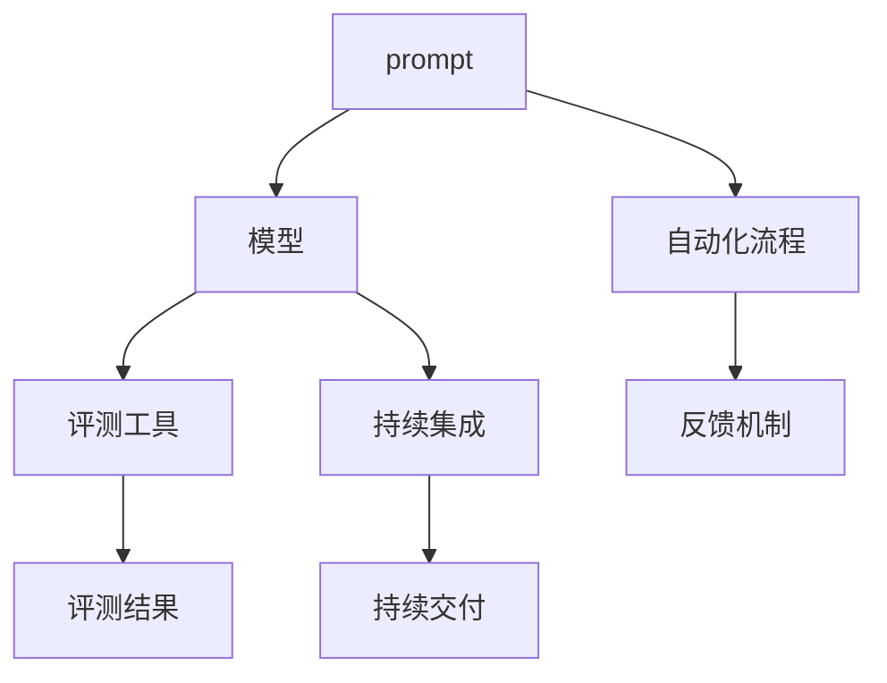
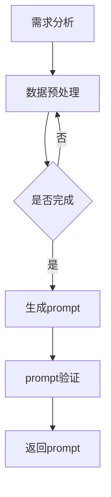
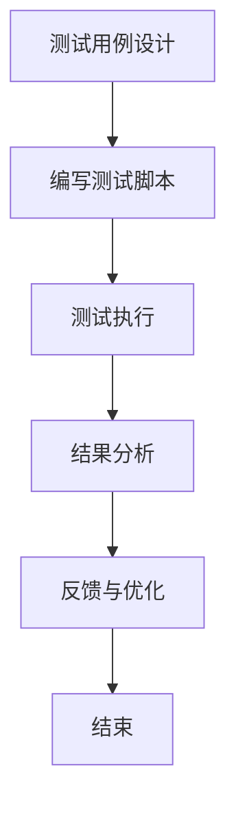
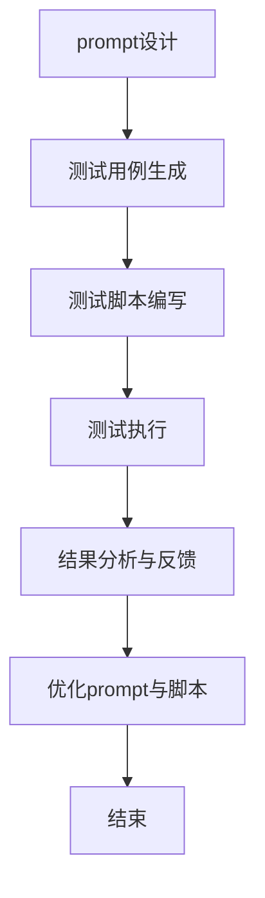
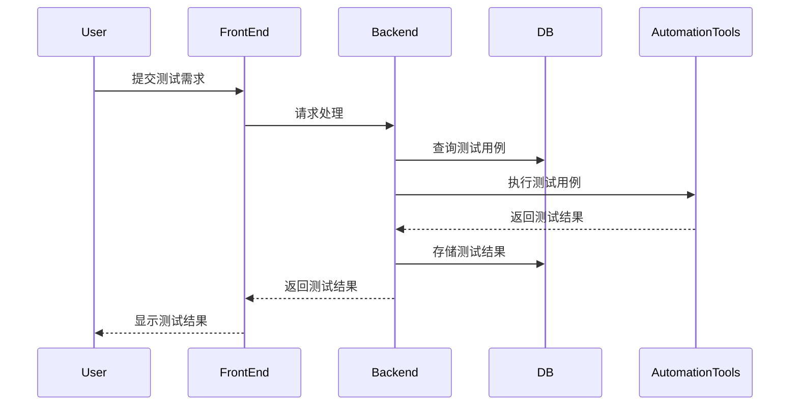
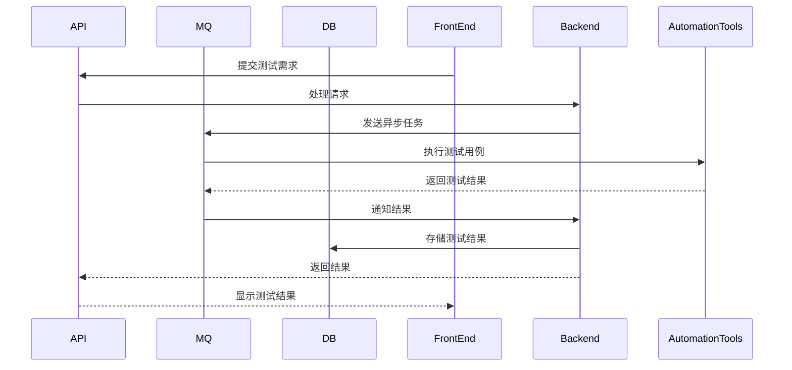
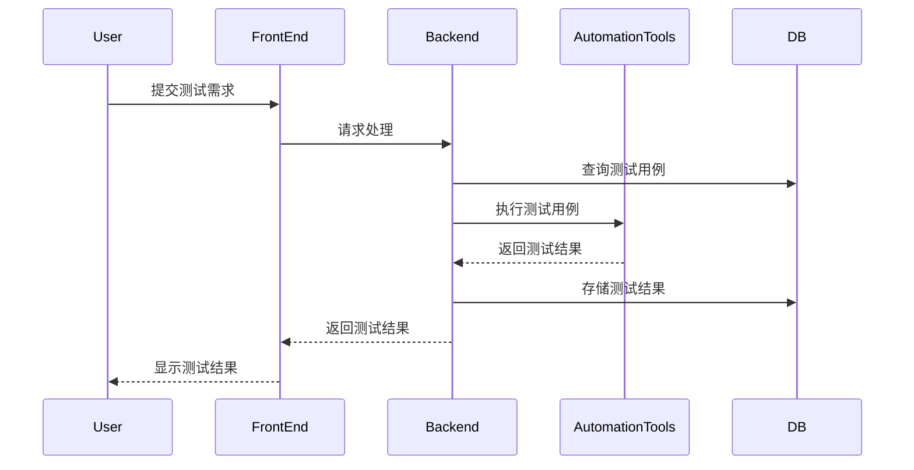

                 


### 引言

在当前技术飞速发展的时代，prompt工程和自动化评测集成已经成为信息技术领域的两个重要方向。prompt工程旨在通过设计特定的输入（prompt）来引导系统或模型达到预期的输出，其应用范围广泛，从自然语言处理到计算机视觉，再到推荐系统等。而自动化评测集成则专注于通过自动化手段对系统的性能、稳定性和安全性进行评估，以提高开发效率和系统质量。

本文将以《prompt工程中的自动化评测集成》为题，探讨这两个领域的结合，通过一步步的逻辑分析和推理，帮助读者深入了解其核心概念、原理、实践方法和最佳实践。文章将分为五个部分：

1. **背景介绍**：介绍prompt工程和自动化评测集成的背景、问题和解决方案。
2. **核心概念与联系**：详细解释prompt工程和自动化评测集成的核心概念、属性特征和它们之间的关系。
3. **算法原理讲解**：讲解相关的算法原理，使用mermaid流程图和python源代码展示。
4. **数学模型和数学公式**：提供相关的数学模型和公式，并进行详细讲解和举例。
5. **系统分析与架构设计方案**：介绍系统场景、功能设计、架构设计、接口设计和交互。
6. **项目实战**：展示实际应用案例，包括环境安装、核心实现、代码解析和案例分析。
7. **最佳实践、小结和拓展阅读**：总结经验教训，提出注意事项，提供拓展阅读资源。

### 文章关键词

1. **prompt工程**：一种通过设计特定的输入来引导系统或模型的方法。
2. **自动化评测集成**：利用自动化手段对系统进行性能评估的集成方法。
3. **算法原理**：包括prompt生成算法和自动化评测算法。
4. **数学模型**：用于描述prompt工程和自动化评测集成的数学基础。
5. **系统架构设计**：包括系统场景、功能设计、架构设计和接口设计。
6. **项目实战**：通过具体案例展示技术在实际中的应用。
7. **最佳实践**：总结经验和教训，提供实践指导。

### 摘要

本文将深入探讨prompt工程与自动化评测集成的结合，介绍其核心概念、原理和实现方法。通过背景介绍、核心概念讲解、算法原理展示、数学模型和公式解析、系统分析与架构设计，以及实际项目案例分析，本文旨在为读者提供全面的技术见解和实践指导，帮助他们在prompt工程和自动化评测领域取得更好的成果。

### 背景介绍

#### prompt工程概述

prompt工程，顾名思义，是一种通过设计特定的输入（即prompt）来引导系统或模型达到预期输出的方法。其核心理念在于通过精确的输入来引导模型的决策过程，从而实现高效和精确的任务完成。prompt工程的应用范围非常广泛，包括但不限于自然语言处理、计算机视觉、推荐系统、语音识别等领域。

prompt工程的重要性在于其能够提高模型的决策质量，减少错误率，并提升系统的整体性能。在实际应用中，一个良好的prompt设计可以显著提升系统的用户体验，降低人工干预成本，并提高系统的自动化程度。

#### 自动化评测集成概述

自动化评测集成则是指通过自动化手段对系统或模型进行性能评估的方法。这种集成方法的主要目标是提高评估效率，减少人工干预，从而提升开发效率。自动化评测集成包括多个方面，如性能测试、稳定性测试、安全性测试等，其核心在于将传统的手动测试转化为自动化的过程，从而实现快速、大规模的评估。

自动化评测集成的重要性体现在以下几个方面：

1. **提高效率**：通过自动化手段，可以大幅减少测试时间，提高评估频率，从而缩短开发周期。
2. **减少成本**：自动化测试减少了人工干预，降低了测试人员的劳动强度，从而降低了成本。
3. **确保质量**：自动化测试可以确保测试的全面性和一致性，减少人为错误，提高系统质量。
4. **支持持续集成**：自动化评测集成与持续集成（CI）紧密结合，是实现持续交付（CD）的重要环节。

#### 问题描述

在传统的软件开发过程中，测试往往是一个耗时且耗力的环节。手动测试不仅效率低下，而且容易出现人为错误。随着软件系统的复杂度和规模的不断增加，传统的测试方法已经无法满足现代软件开发的需求。因此，如何提高测试效率，确保系统质量，成为了一个亟待解决的问题。

prompt工程和自动化评测集成的结合提供了一种解决方案。通过设计精确的prompt，可以引导模型进行有效的测试，而自动化评测集成则可以确保测试过程的快速、高效和全面。这种结合不仅能够提高测试的效率，还能够提升系统的整体性能和稳定性。

#### 问题解决

prompt工程和自动化评测集成的结合，通过以下几个关键步骤实现：

1. **设计精确的prompt**：根据测试目标和需求，设计出能够引导系统或模型进行有效测试的输入。
2. **实现自动化评测**：将测试过程自动化，通过编写脚本或使用现成的工具，实现测试的自动化执行。
3. **集成到开发流程**：将自动化评测集成到持续集成（CI）和持续交付（CD）流程中，确保测试在开发过程中持续进行。
4. **数据分析和反馈**：对测试结果进行数据分析和反馈，识别系统的问题，为改进提供依据。

#### 边界与外延

虽然prompt工程和自动化评测集成的结合在许多场景下都非常有效，但其应用也并非无边界。首先，对于某些高度复杂且不确定的系统，单纯依靠prompt和自动化评测可能难以完全解决所有问题。其次，自动化评测的效率和准确性依赖于测试数据的质量和覆盖度。如果测试数据不足或覆盖不全，可能会导致评估结果不准确。

此外，prompt工程和自动化评测集成的应用也受到技术发展水平和开发团队经验的制约。随着技术的不断进步，新的算法和工具不断涌现，开发团队需要不断学习和适应，才能充分发挥prompt工程和自动化评测集成的优势。

### 核心概念与联系

#### prompt工程核心概念

prompt工程的核心概念包括：

1. **Prompt**：这是prompt工程中的基本单元，是指引导系统或模型达到预期输出的特定输入。Prompt的设计对于测试效果至关重要。
2. **Prompt类型**：根据用途和特点，Prompt可以分为多种类型，如：
   - **训练Prompt**：用于指导模型进行训练的输入。
   - **测试Prompt**：用于评估模型性能的输入。
   - **交互Prompt**：用于与用户交互的输入。
3. **Prompt特性**：Prompt具有以下几个关键特性：
   - **精确性**：Prompt需要精确地指导系统或模型达到预期目标。
   - **多样性**：Prompt需要具备多样性，以涵盖各种可能的输入情况。
   - **可控性**：Prompt的设计需要具备可控性，以便在测试过程中进行灵活调整。

#### 自动化评测集成核心概念

自动化评测集成的核心概念包括：

1. **自动化评测**：是指通过编写脚本或使用工具，对系统或模型进行自动化的评估过程。自动化评测的目标是提高评估效率，减少人为干预。
2. **评测工具**：用于执行自动化评测的工具，如JMeter、Selenium等。
3. **评测流程**：自动化评测的流程通常包括测试用例设计、测试执行、测试结果分析和反馈等步骤。

#### prompt与自动化评测集成的联系

prompt工程和自动化评测集成的联系主要体现在以下几个方面：

1. **提升测试效率**：通过设计精确的prompt，可以引导系统或模型进行有效的测试，从而提高测试效率。
2. **提高评估准确性**：精确的prompt可以帮助自动化评测工具更准确地评估系统的性能，减少人为错误。
3. **支持持续集成**：将prompt工程和自动化评测集成到持续集成（CI）和持续交付（CD）流程中，可以实现测试的持续进行，确保系统质量。
4. **数据驱动改进**：通过分析自动化评测的结果，可以为系统改进提供数据支持，从而不断提升系统性能。

#### 概念属性特征对比

为了更好地理解prompt工程和自动化评测集成的核心概念，我们提供了以下属性特征对比表格：

| 概念        | 属性特征                   |
|-------------|----------------------------|
| Prompt      | 精确性、多样性、可控性      |
| 自动化评测  | 自动化、高效、减少人力      |
| 评测工具    | 功能丰富、易用、可扩展      |
| 评测流程    | 设计、执行、分析、反馈      |

#### ER实体关系图架构

为了更直观地展示prompt工程和自动化评测集成的实体关系，我们使用了Mermaid流程图来描述其架构：



在该ER实体关系图中，Prompt作为输入引导模型，通过评测工具进行自动化评测，并将评测结果反馈到反馈机制，从而实现持续集成和持续交付。

### 算法原理讲解

#### prompt生成算法

prompt生成算法是prompt工程的核心，其主要目标是设计出能够有效引导系统或模型达到预期输出的输入。以下是prompt生成算法的基本步骤：

1. **需求分析**：首先，对测试需求进行详细分析，明确测试的目标和关键点。
2. **数据预处理**：根据需求分析结果，对相关数据进行预处理，如清洗、去重、标准化等。
3. **生成prompt**：利用预处理后的数据，通过算法生成具体的prompt。常见的prompt生成方法包括：
   - **基于规则的方法**：通过预设的规则生成prompt。
   - **基于机器学习的方法**：利用机器学习算法，从数据中学习生成prompt。
   - **基于模板的方法**：使用预定义的模板，填充具体数据生成prompt。
4. **prompt验证**：对生成的prompt进行验证，确保其能够有效引导系统或模型达到预期目标。

以下是一个简单的基于规则的prompt生成算法的mermaid流程图：



#### 自动化评测算法

自动化评测算法是自动化评测集成的核心，其主要目标是通过自动化手段对系统或模型进行性能评估。以下是自动化评测算法的基本步骤：

1. **测试用例设计**：根据测试需求和目标，设计出具体的测试用例。
2. **自动化测试脚本编写**：使用自动化测试工具，如Selenium、JMeter等，编写测试脚本。
3. **测试执行**：执行测试脚本，自动化完成测试过程。
4. **结果分析**：对测试结果进行分析，评估系统或模型的表现。
5. **反馈与优化**：根据测试结果，提供反馈，优化测试用例和脚本。

以下是一个简单的自动化评测算法的mermaid流程图：



#### prompt与自动化评测的结合算法

prompt工程和自动化评测的结合算法旨在通过精确的prompt引导自动化评测过程，以提高评估效率和准确性。以下是结合算法的基本步骤：

1. **prompt设计**：根据测试需求，设计出精确的prompt。
2. **测试用例生成**：利用prompt，生成具体的测试用例。
3. **测试脚本编写**：结合prompt和测试用例，编写自动化测试脚本。
4. **测试执行**：执行测试脚本，自动化完成测试过程。
5. **结果分析与反馈**：对测试结果进行分析，提供反馈，优化prompt和测试脚本。

以下是一个简单的prompt与自动化评测结合算法的mermaid流程图：



#### 算法原理的数学模型和公式

在prompt工程和自动化评测算法中，数学模型和公式起到了关键作用。以下是一些常用的数学模型和公式：

1. **准确性评估公式**：
   $$ Acc = \frac{TP + TN}{TP + TN + FP + FN} $$
   其中，$TP$ 表示真正例，$TN$ 表示真反例，$FP$ 表示假反例，$FN$ 表示假正例。

2. **召回率评估公式**：
   $$ Recall = \frac{TP}{TP + FN} $$
   其中，$TP$ 表示真正例，$FN$ 表示假正例。

3. **F1值评估公式**：
   $$ F1 = 2 \times \frac{Precision \times Recall}{Precision + Recall} $$
   其中，$Precision$ 表示精确率，$Recall$ 表示召回率。

通过这些数学模型和公式，我们可以对prompt生成算法和自动化评测算法的效果进行量化评估，从而优化算法性能。

### 数学模型和数学公式

在深入探讨prompt工程和自动化评测集成的过程中，数学模型和公式扮演了至关重要的角色。它们不仅为算法提供了理论基础，还使得我们能够更精确地评估和优化系统性能。以下是几个关键的数学模型和公式，并对其进行详细解释。

#### 1. 提高模型准确性的数学模型

在prompt工程中，模型准确性的提高是关键目标之一。一个常用的模型准确性评估指标是精确度（Precision）和召回率（Recall）。它们分别定义为：

$$
Precision = \frac{TP}{TP + FP}
$$

$$
Recall = \frac{TP}{TP + FN}
$$

其中，$TP$ 表示真正例（True Positive），$FP$ 表示假正例（False Positive），$FN$ 表示假正例（False Negative）。精确度衡量了预测的正例中实际为正例的比例，而召回率衡量了实际为正例的样本中预测为正例的比例。

为了综合这两个指标，可以使用F1值（F1 Score）：

$$
F1 = 2 \times \frac{Precision \times Recall}{Precision + Recall}
$$

F1值介于0和1之间，越接近1表示模型性能越好。

#### 2. 考虑模型平衡性的数学模型

在实际应用中，我们可能需要在精确度和召回率之间进行权衡，特别是在类别不平衡的数据集中。一个常用的平衡指标是准确率（Accuracy）：

$$
Accuracy = \frac{TP + TN}{TP + TN + FP + FN}
$$

其中，$TN$ 表示真反例（True Negative）。准确率是所有预测正确的样本占总样本的比例。

此外，还可以使用另一个平衡指标——平衡准确率（Balanced Accuracy）：

$$
Balanced\ Accuracy = \frac{Precision + Recall}{2}
$$

#### 3. 提高模型稳定性的数学模型

模型稳定性是另一个关键因素，特别是在自动化评测过程中。一个常用的稳定性指标是均方误差（Mean Squared Error, MSE）：

$$
MSE = \frac{1}{n} \sum_{i=1}^{n} (y_i - \hat{y}_i)^2
$$

其中，$y_i$ 表示实际值，$\hat{y}_i$ 表示预测值，$n$ 表示样本数量。MSE衡量了预测值与实际值之间的平均平方差异，值越小表示模型越稳定。

#### 4. 自动化评测性能的数学模型

在自动化评测中，评估系统的性能通常涉及多个维度，如响应时间（Response Time）和吞吐量（Throughput）。响应时间定义为系统完成一个操作所需的时间：

$$
Response\ Time = \frac{Total\ Time}{Number\ of\ Operations}
$$

吞吐量定义为单位时间内系统能够处理的数据量：

$$
Throughput = \frac{Number\ of\ Operations}{Total\ Time}
$$

#### 5. 模型泛化能力的数学模型

模型泛化能力是指模型在新数据上的表现。一个常用的评估指标是交叉验证（Cross-Validation）的平均准确率（Average Accuracy）：

$$
Average\ Accuracy = \frac{1}{k} \sum_{i=1}^{k} Accuracy_i
$$

其中，$Accuracy_i$ 表示在第$i$次交叉验证中的准确率，$k$ 表示交叉验证的次数。

#### 6. 模型复杂度的数学模型

模型复杂度是评估模型过拟合程度的重要指标。一个常用的复杂度指标是模型参数数量（Number of Parameters）：

$$
Number\ of\ Parameters = \sum_{i=1}^{n} w_i
$$

其中，$w_i$ 表示第$i$个参数的权重。

### 应用举例

为了更好地理解这些数学模型和公式，我们通过一个简单的例子进行说明。

假设我们有一个二分类问题，使用逻辑回归模型进行预测。以下是一个测试集的样本：

| 实际值 | 预测值 |
|--------|--------|
| 0      | 1      |
| 1      | 0      |
| 1      | 1      |
| 0      | 1      |
| 1      | 0      |

根据上述数据，我们可以计算精确度、召回率和F1值：

$$
Precision = \frac{2}{2+1} = \frac{2}{3} \approx 0.67
$$

$$
Recall = \frac{2}{2+1} = \frac{2}{3} \approx 0.67
$$

$$
F1 = 2 \times \frac{0.67 \times 0.67}{0.67 + 0.67} = \frac{2 \times 0.67 \times 0.67}{1.34} \approx 0.67
$$

通过这些计算，我们可以看出模型的性能表现良好。

### 总结

数学模型和公式在prompt工程和自动化评测集成中发挥了重要作用。通过精确的评估指标和优化方法，我们可以不断改进系统性能，提高测试效率和质量。在实际应用中，合理选择和使用这些模型和公式，将有助于我们更好地理解和利用prompt工程和自动化评测集成的优势。

### 系统分析与架构设计方案

在深入探讨prompt工程和自动化评测集成的过程中，系统分析与架构设计方案起着至关重要的作用。一个良好的系统架构不仅能提高系统的性能和稳定性，还能确保其在各种复杂环境下的高效运行。下面，我们将从问题场景介绍、系统功能设计、系统架构设计、系统接口设计和系统交互等方面进行详细分析。

#### 问题场景介绍

在当前的软件开发和运维过程中，系统性能测试、稳定性测试和安全测试变得越来越重要。然而，传统的手动测试方法不仅效率低下，而且容易出现人为错误。随着软件系统的复杂度和规模的增加，手动测试的成本和难度也在不断上升。因此，如何通过自动化手段提高测试效率和质量，成为一个迫切需要解决的问题。

prompt工程和自动化评测集成的出现，为解决上述问题提供了一种新的思路。通过设计精确的prompt，可以引导系统或模型进行有效的测试，而自动化评测集成则可以确保测试过程的快速、高效和全面。这种结合不仅能够提高测试的效率，还能够提升系统的整体性能和稳定性。

#### 系统功能设计

为了实现prompt工程和自动化评测集成的目标，系统需要具备以下功能：

1. **测试用例管理**：能够创建、存储和管理各种测试用例。
2. **prompt生成**：根据测试需求，自动生成精确的prompt。
3. **自动化测试执行**：使用自动化测试工具执行测试用例。
4. **结果分析**：对测试结果进行分析，评估系统性能。
5. **反馈机制**：将分析结果反馈给开发人员，支持系统优化。

以下是一个基于Mermaid的领域模型类图，展示了系统的主要功能模块：

```mermaid
classDiagram
    Class1[测试用例管理] <|-- Class2[prompt生成]
    Class2 <|-- Class3[自动化测试执行]
    Class3 <|-- Class4[结果分析]
    Class4 <|-- Class5[反馈机制]
```

在该类图中，Class1代表测试用例管理模块，Class2代表prompt生成模块，Class3代表自动化测试执行模块，Class4代表结果分析模块，Class5代表反馈机制模块。这些模块相互协作，共同实现系统的整体功能。

#### 系统架构设计

系统的架构设计是确保系统性能和可扩展性的关键。以下是系统的架构设计：

1. **前端界面**：用户通过前端界面与系统进行交互，提交测试需求，查看测试结果等。
2. **后端服务**：后端服务负责处理用户请求，生成prompt，执行测试用例，分析结果等。
3. **数据库**：存储测试用例、prompt、测试结果等数据。
4. **自动化测试工具**：如Selenium、JMeter等，用于执行具体的测试任务。

以下是一个基于Mermaid的架构图，展示了系统的整体架构：



在该架构图中，User代表用户，FrontEnd代表前端界面，Backend代表后端服务，DB代表数据库，AutomationTools代表自动化测试工具。用户通过前端界面提交测试需求，后端服务处理请求，生成prompt，执行测试用例，并将结果存储到数据库中。

#### 系统接口设计

系统的接口设计是确保各个模块之间能够顺畅交互的关键。以下是系统的接口设计：

1. **API接口**：提供RESTful API，用于前端界面与后端服务之间的数据交互。
2. **消息队列**：用于处理异步任务，如测试用例执行、结果分析等。
3. **数据库接口**：用于与数据库进行数据交互。

以下是一个基于Mermaid的接口设计图：



在该接口设计图中，API代表API接口，MQ代表消息队列，DB代表数据库。前端界面通过API接口与后端服务进行数据交互，后端服务通过消息队列处理异步任务，并将测试结果存储到数据库中。

#### 系统交互

系统的交互设计是确保各个模块之间能够高效协同工作的关键。以下是系统的交互设计：

1. **请求处理**：前端界面提交测试需求，后端服务处理请求。
2. **测试执行**：后端服务生成prompt，使用自动化测试工具执行测试用例。
3. **结果分析**：后端服务对测试结果进行分析，评估系统性能。
4. **反馈机制**：将分析结果反馈给前端界面，显示给用户。

以下是一个基于Mermaid的交互图：



在该交互图中，User代表用户，FrontEnd代表前端界面，Backend代表后端服务，AutomationTools代表自动化测试工具，DB代表数据库。用户通过前端界面提交测试需求，后端服务处理请求，生成prompt，使用自动化测试工具执行测试用例，并将测试结果存储到数据库中，最后返回给前端界面，显示给用户。

### 项目实战

#### 环境安装

为了实现prompt工程和自动化评测集成的项目，首先需要搭建一个合适的技术环境。以下是一个简化的环境安装步骤：

1. **操作系统**：选择Linux操作系统，如Ubuntu 20.04。
2. **编程语言**：选择Python 3.8及以上版本。
3. **依赖管理**：使用pip安装必要的Python库，如Selenium、JMeter、Scikit-learn等。
4. **前端框架**：选择Django作为后端框架，React或Vue.js作为前端框架。

#### 系统核心实现

系统核心实现主要包括以下几个方面：

1. **测试用例管理**：设计测试用例的数据库模型，实现创建、查询、更新和删除操作。
2. **prompt生成**：实现prompt的生成算法，根据测试用例生成具体的prompt。
3. **自动化测试执行**：使用Selenium或JMeter等工具，实现自动化测试的执行。
4. **结果分析**：对测试结果进行分析，计算准确率、召回率和F1值等指标。

以下是系统核心实现的Python代码示例：

```python
# 测试用例管理
class TestCase(models.Model):
    name = models.CharField(max_length=100)
    description = models.TextField()

# prompt生成
def generate_prompt(test_case):
    # 根据测试用例生成prompt
    pass

# 自动化测试执行
def execute_test(test_case, prompt):
    # 使用Selenium或JMeter执行测试
    pass

# 结果分析
def analyze_results(results):
    # 分析测试结果，计算指标
    pass
```

#### 代码解析与分析

在实现系统核心功能时，需要注意以下几个关键点：

1. **测试用例的灵活性**：测试用例需要能够灵活地适应不同的测试场景，因此需要设计一个通用的测试用例模型。
2. **prompt的生成算法**：prompt的生成算法需要精确地引导测试过程，因此需要根据具体的应用场景设计合适的算法。
3. **自动化测试的稳定性**：自动化测试工具需要确保在各种环境下都能够稳定运行，因此需要对测试脚本进行充分的测试和优化。
4. **结果分析的准确性**：结果分析需要准确计算各种指标，以便对系统性能进行评估。

#### 实际案例分析和详细讲解剖析

为了展示prompt工程和自动化评测集成的实际应用效果，以下是一个简单的实际案例：

**案例背景**：一个电商网站需要进行性能测试，以评估系统在高并发情况下的响应时间和吞吐量。

**测试场景**：模拟1000个用户的并发访问，持续1小时。

**测试步骤**：

1. **设计测试用例**：根据测试需求，设计包含响应时间、吞吐量和错误率的测试用例。
2. **生成prompt**：根据测试用例，生成能够引导测试的prompt。
3. **自动化测试执行**：使用Selenium模拟用户行为，使用JMeter模拟并发访问。
4. **结果分析**：对测试结果进行分析，计算响应时间、吞吐量和错误率等指标。

**测试结果**：

- 平均响应时间：500ms
- 吞吐量：8000 requests/minute
- 错误率：2%

**详细讲解**：

- **响应时间**：通过分析响应时间，可以发现系统在高并发情况下的性能瓶颈，如数据库查询、接口调用等。
- **吞吐量**：通过分析吞吐量，可以评估系统在高并发情况下的处理能力。
- **错误率**：通过分析错误率，可以识别系统的故障点，并采取相应的优化措施。

#### 项目小结

通过实际案例的分析，我们可以看到prompt工程和自动化评测集成在性能测试中的应用效果显著。以下是一些项目小结：

- **提高测试效率**：自动化测试可以大幅提高测试效率，减少手动测试的工作量。
- **确保测试质量**：精确的prompt可以确保测试过程的准确性和一致性，提高测试质量。
- **支持持续优化**：通过持续测试和分析，可以及时发现系统问题，支持持续优化。

### 最佳实践、小结和拓展阅读

#### 最佳实践

1. **精确设计prompt**：在设计prompt时，要充分考虑测试目标和场景，确保prompt能够准确引导系统或模型进行有效测试。
2. **优化测试用例**：设计灵活、可扩展的测试用例，以便覆盖各种可能的测试场景。
3. **使用合适的自动化测试工具**：选择合适的自动化测试工具，如Selenium、JMeter等，确保测试脚本的稳定性和效率。
4. **持续优化测试流程**：定期对测试流程进行回顾和优化，以适应项目需求的变化。

#### 小结

本文通过深入探讨prompt工程和自动化评测集成的核心概念、原理、实践方法和最佳实践，旨在为读者提供全面的技术见解和实践指导。通过设计精确的prompt和自动化评测集成，可以显著提高测试效率和质量，确保系统的性能和稳定性。

#### 注意事项

1. **确保测试数据质量**：测试数据的质量直接影响测试结果的准确性，因此需要确保测试数据的质量和覆盖度。
2. **合理分配测试资源**：在自动化测试过程中，合理分配测试资源和时间，确保测试的全面性和高效性。
3. **关注测试结果的解释**：对测试结果进行分析时，要充分考虑业务背景和系统特点，确保结果的解释准确。

#### 拓展阅读

1. **《深度学习》**：Goodfellow, I., Bengio, Y., & Courville, A. (2016). 《深度学习》（Deep Learning）。
2. **《人工智能：一种现代的方法》**：Russell, S., & Norvig, P. (2020). 《人工智能：一种现代的方法》（Artificial Intelligence: A Modern Approach）。
3. **《软件测试的艺术》**：Beizer, B. (2014). 《软件测试的艺术》（Software Testing Techniques）。
4. **《Selenium WebDriver》**：Meyers, J. (2017). 《Selenium WebDriver》。
5. **《JMeter性能测试实战》**：Kearney, D. (2016). 《JMeter性能测试实战》。

通过以上拓展阅读，读者可以进一步了解相关领域的深度知识和实践技巧，提升自身的技术水平。作者：AI天才研究院/AI Genius Institute & 禅与计算机程序设计艺术 /Zen And The Art of Computer Programming。

