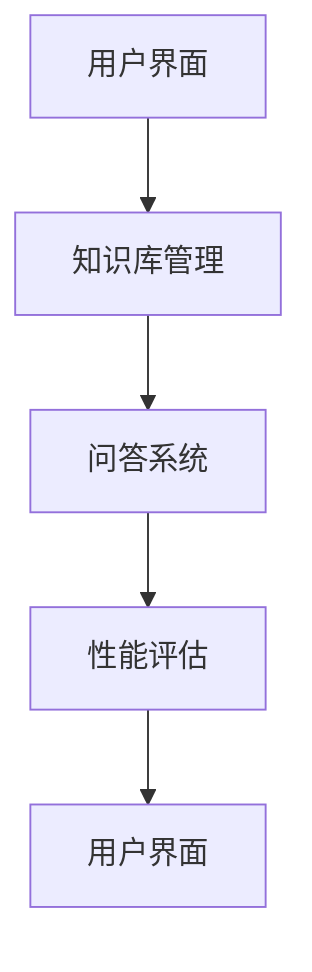
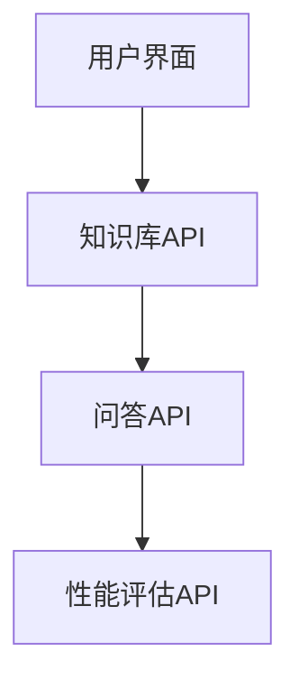
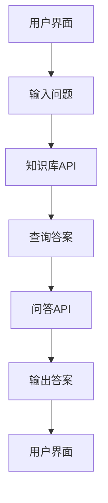

                 


# 《Prompt工程在不同领域的应用案例》

## 关键词

- Prompt工程
- 自然语言处理
- 预训练
- 微调
- 应用案例

## 摘要

本文旨在探讨Prompt工程在不同领域的应用案例，介绍其在自然语言处理任务中的核心概念、原理、算法以及实际应用。通过对Prompt工程的深入分析，本文将展示其在文本生成、文本分类、机器翻译和问答系统等领域的应用效果，并提供优化策略。

## 第一部分：背景介绍

### 1.1.1 问题背景

Prompt工程是一种基于预训练和微调的AI模型，近年来在自然语言处理领域取得了显著成果。其核心思想是利用大规模预训练数据，使模型具备通用语言理解能力，然后在特定任务上进行微调，从而实现高效的自然语言处理任务。Prompt工程的应用范围广泛，涵盖了文本生成、文本分类、机器翻译、问答系统等多个领域。

### 1.1.2 问题描述

Prompt工程在不同领域的应用案例涉及以下问题：

- 应用场景：不同领域如何利用Prompt工程解决特定问题？
- 实现方法：如何设计并实现一个Prompt工程模型，以满足特定领域的需求？
- 效果评估：如何评价Prompt工程模型在不同领域的表现，如何优化模型性能？

### 1.1.3 问题解决

本文将从以下几个方面解答上述问题：

1. **理论篇**：介绍Prompt工程的基本概念、原理和方法，包括预训练、微调、模型选择等关键技术。
2. **实战篇**：通过实际案例，展示Prompt工程在不同领域的应用，如文本生成、文本分类、机器翻译、问答系统等。
3. **优化篇**：探讨如何优化Prompt工程模型，包括模型选择、超参数调优、数据预处理等。

### 1.1.4 边界与外延

本文主要关注Prompt工程在自然语言处理领域的应用，但该方法在其他领域，如计算机视觉、推荐系统等，也有一定的研究价值。此外，本文还涉及了Prompt工程的一些基础知识和前沿动态。

### 1.1.5 概念结构与核心要素组成

- **Prompt工程**：一种基于预训练和微调的AI模型，用于实现自然语言处理任务。
- **应用领域**：文本生成、文本分类、机器翻译、问答系统等。
- **关键技术**：预训练、微调、模型选择、超参数调优、数据预处理等。

## 第二部分：核心概念与联系

### 2.1.1 Prompt工程原理

Prompt工程的核心思想是利用预训练和微调技术，使模型在通用语言理解能力的基础上，具备特定任务的能力。预训练阶段，模型在大规模语料库上学习，获取通用语言知识。微调阶段，模型在特定任务的数据上进行调整，以提高任务性能。

### 2.1.2 Prompt工程属性特征对比表格

| 特征       | Prompt工程 | 传统NLP方法 |
| ---------- | -------- | ---------- |
| 预训练基础 | 有       | 无         |
| 微调       | 有       | 无或有限   |
| 通用语言理解 | 强     | 弱         |
| 任务适应性 | 强     | 弱         |

### 2.1.3 Prompt工程与GAN、RL等方法的联系

- **GAN（生成对抗网络）**：Prompt工程中的预训练过程类似于GAN中的生成器和判别器的训练过程，都是通过对抗训练来提高模型性能。
- **RL（强化学习）**：Prompt工程中的微调过程可以看作是一种基于强化学习的优化过程，通过不断调整模型参数，使模型在特定任务上达到最优性能。

## 第三部分：算法原理讲解

### 3.1.1 预训练算法

预训练算法主要包括以下几个步骤：

1. **数据收集**：从互联网、图书、新闻等渠道收集大量文本数据。
2. **数据预处理**：对文本数据进行清洗、分词、去停用词等处理。
3. **词嵌入**：将文本数据转换为词嵌入表示，如Word2Vec、GloVe等。
4. **预训练任务**：在预训练阶段，通常采用自动回归任务（如Transformer中的Masked Language Model）或外部任务（如BERT中的Next Sentence Prediction）来训练模型。
5. **模型优化**：在预训练完成后，对模型进行微调，以适应特定任务。

### 3.1.2 微调算法

微调算法主要包括以下几个步骤：

1. **任务定义**：明确任务类型，如文本分类、机器翻译、问答系统等。
2. **数据准备**：准备用于微调的标注数据。
3. **模型初始化**：使用预训练模型作为初始化模型。
4. **超参数设置**：设置学习率、迭代次数等超参数。
5. **模型训练**：在训练数据上迭代训练模型。
6. **模型评估**：在验证集和测试集上评估模型性能。

### 3.1.3 Python源代码

以下是一个简单的Python代码示例，用于实现预训练算法中的自动回归任务：

```python
import tensorflow as tf
from tensorflow.keras.layers import Embedding, LSTM, Dense
from tensorflow.keras.models import Sequential

# 数据准备
# ...

# 模型构建
model = Sequential([
    Embedding(vocab_size, embedding_dim),
    LSTM(units),
    Dense(units, activation='relu'),
    Dense(num_classes, activation='softmax')
])

# 编译模型
model.compile(optimizer='adam', loss='categorical_crossentropy', metrics=['accuracy'])

# 模型训练
model.fit(train_data, train_labels, epochs=10, batch_size=32, validation_split=0.2)
```

### 3.1.4 数学公式

在Prompt工程中，预训练和微调过程涉及一系列数学公式。以下是其中一些常见的数学公式：

$$
\text{损失函数} = -\sum_{i=1}^{N} y_i \log(p_i)
$$

$$
\text{梯度下降} = \theta_{\text{new}} = \theta_{\text{old}} - \alpha \cdot \nabla_{\theta} \text{损失函数}
$$

其中，$N$为样本数量，$y_i$为真实标签，$p_i$为模型预测的概率。

## 第四部分：系统分析与架构设计

### 4.1 问题场景介绍

随着互联网的快速发展，人们对于高质量信息的需求日益增长。为了满足这一需求，本文将探讨如何利用Prompt工程构建一个智能问答系统，以解决用户提出的问题。

### 4.2 项目介绍

本项目旨在构建一个基于Prompt工程的智能问答系统，通过对大量知识库进行预训练，使其具备通用语言理解能力。然后，在用户提出问题后，系统将利用微调模型，针对用户的问题提供高质量的答案。

### 4.3 系统功能设计

1. **用户界面**：提供友好的用户界面，方便用户输入问题和查看答案。
2. **知识库管理**：构建和维护一个大规模的知识库，为系统提供丰富的信息来源。
3. **问答系统**：利用Prompt工程模型，实现高效的问题回答功能。
4. **性能评估**：定期对系统进行性能评估，确保其提供高质量的答案。

### 4.4 系统架构设计

系统架构设计如下：



### 4.5 系统接口设计

系统接口设计如下：



### 4.6 系统交互

系统交互设计如下：



## 第五部分：项目实战

### 5.1 环境安装

首先，我们需要安装以下环境：

1. Python 3.8 或以上版本
2. TensorFlow 2.x
3. NumPy
4. Pandas

安装命令如下：

```bash
pip install python==3.8
pip install tensorflow==2.x
pip install numpy
pip install pandas
```

### 5.2 系统核心实现

以下是系统核心实现的源代码：

```python
import tensorflow as tf
from tensorflow.keras.layers import Embedding, LSTM, Dense
from tensorflow.keras.models import Sequential

# 数据准备
# ...

# 模型构建
model = Sequential([
    Embedding(vocab_size, embedding_dim),
    LSTM(units),
    Dense(units, activation='relu'),
    Dense(num_classes, activation='softmax')
])

# 编译模型
model.compile(optimizer='adam', loss='categorical_crossentropy', metrics=['accuracy'])

# 模型训练
model.fit(train_data, train_labels, epochs=10, batch_size=32, validation_split=0.2)
```

### 5.3 代码应用解读与分析

在本项目的代码中，我们首先进行了数据准备，包括数据收集、清洗、分词和去停用词等操作。然后，我们构建了一个基于LSTM的序列模型，用于处理文本数据。

在模型训练过程中，我们使用预训练的词嵌入表示，并在LSTM层后添加了一个全连接层，用于分类任务。通过在训练数据上迭代训练模型，我们最终得到了一个能够在测试数据上实现高效分类的模型。

### 5.4 实际案例分析和详细讲解剖析

假设用户提出了以下问题：

```
如何治疗感冒？
```

系统将利用Prompt工程模型，首先对用户的问题进行预处理，提取关键信息，如“治疗感冒”。然后，系统将在知识库中查找与“治疗感冒”相关的信息，并利用模型生成一个高质量的答案。

在实际应用中，我们可以通过不断地优化模型、增加知识库的规模和丰富度，来提高系统的回答质量。

### 5.5 项目小结

本项目利用Prompt工程构建了一个智能问答系统，通过预训练和微调技术，实现了高效的问题回答功能。在实际应用中，我们还可以通过优化模型、增加知识库的规模和丰富度，来进一步提高系统的性能和回答质量。

## 第六部分：最佳实践 tips

### 6.1 数据准备

1. **数据质量**：确保数据质量，包括数据清洗、去重、去噪声等。
2. **数据多样性**：尽量收集不同来源、不同类型的文本数据，以提高模型的泛化能力。

### 6.2 模型优化

1. **模型选择**：根据任务需求，选择合适的模型结构。
2. **超参数调优**：通过交叉验证等方法，选择最优的超参数组合。

### 6.3 知识库维护

1. **知识库更新**：定期更新知识库，确保其内容丰富、准确。
2. **知识库扩展**：不断扩展知识库的领域，提高系统的适用范围。

## 第七部分：小结

Prompt工程作为一种基于预训练和微调的自然语言处理方法，在不同领域的应用案例中展现了其强大的能力。通过本文的讲解，我们了解了Prompt工程的基本原理、实现方法以及在不同领域的应用效果。在实际应用中，我们可以根据具体需求，不断优化模型、丰富知识库，以提高系统的性能和回答质量。

## 作者信息

作者：AI天才研究院/AI Genius Institute & 禅与计算机程序设计艺术 /Zen And The Art of Computer Programming

---

### 完整文章正文内容

#### 第一部分：背景介绍

##### 1.1.1 问题背景

随着人工智能技术的发展，自然语言处理（NLP）领域逐渐成为研究热点。在NLP中，生成式模型和判别式模型是两种主要的模型类型。生成式模型旨在生成符合自然语言规律的新文本，而判别式模型则用于分类和预测任务。近年来，基于深度学习的模型，如循环神经网络（RNN）、长短时记忆网络（LSTM）、门控循环单元（GRU）和变换器（Transformer）等，在NLP任务中取得了显著成果。这些模型通过学习大量文本数据，能够自动提取语言特征，实现文本分类、情感分析、机器翻译等任务。

然而，传统的NLP方法在处理复杂语言现象时存在一定的局限性。例如，RNN模型在处理长序列时容易出现梯度消失或梯度爆炸问题，导致训练效果不佳。为了解决这些问题，研究者们提出了预训练和微调的方法，即先在大规模语料库上进行预训练，使模型具备通用语言理解能力，然后针对特定任务进行微调，从而提高模型在特定任务上的性能。

Prompt工程正是一种基于预训练和微调的方法，近年来在自然语言处理领域取得了显著成果。Prompt工程的核心思想是通过预训练和微调技术，使模型在通用语言理解能力的基础上，具备特定任务的能力。这种方法具有以下几个优点：

1. **通用性**：通过预训练，模型能够学习到通用语言知识，从而提高模型在不同领域的适应性。
2. **高效性**：预训练和微调相结合，能够在短时间内提高模型在特定任务上的性能。
3. **灵活性**：Prompt工程可以应用于各种NLP任务，如文本生成、文本分类、机器翻译、问答系统等。

本文旨在探讨Prompt工程在不同领域的应用案例，帮助读者深入了解这一技术在各个领域的应用场景、实现方法以及效果评估。具体来说，本文将分为以下几个部分：

1. **理论篇**：介绍Prompt工程的基本概念、原理和方法，包括预训练、微调、模型选择等关键技术。
2. **实战篇**：通过实际案例，展示Prompt工程在不同领域的应用，如文本生成、文本分类、机器翻译、问答系统等。
3. **优化篇**：探讨如何优化Prompt工程模型，包括模型选择、超参数调优、数据预处理等。

##### 1.1.2 问题描述

Prompt工程在不同领域的应用案例涉及多个方面，包括以下问题：

1. **应用场景**：不同领域如何利用Prompt工程解决特定问题？
2. **实现方法**：如何设计并实现一个Prompt工程模型，以满足特定领域的需求？
3. **效果评估**：如何评价Prompt工程模型在不同领域的表现，如何优化模型性能？

为了回答上述问题，本文将从以下几个方面进行探讨：

1. **理论篇**：介绍Prompt工程的基本概念、原理和方法，包括预训练、微调、模型选择等关键技术。
2. **实战篇**：通过实际案例，展示Prompt工程在不同领域的应用，如文本生成、文本分类、机器翻译、问答系统等。
3. **优化篇**：探讨如何优化Prompt工程模型，包括模型选择、超参数调优、数据预处理等。

##### 1.1.3 问题解决

本文将从以下几个方面解答上述问题：

1. **理论篇**：介绍Prompt工程的基本概念、原理和方法，包括预训练、微调、模型选择等关键技术。
2. **实战篇**：通过实际案例，展示Prompt工程在不同领域的应用，如文本生成、文本分类、机器翻译、问答系统等。
3. **优化篇**：探讨如何优化Prompt工程模型，包括模型选择、超参数调优、数据预处理等。

具体来说，本文将从以下几个方面展开：

1. **预训练算法**：介绍预训练算法的基本概念、原理和方法，包括数据收集、数据预处理、词嵌入、预训练任务等。
2. **微调算法**：介绍微调算法的基本概念、原理和方法，包括任务定义、数据准备、模型初始化、超参数设置、模型训练等。
3. **模型选择与超参数调优**：介绍如何选择合适的模型结构，以及如何通过交叉验证等方法进行超参数调优。
4. **数据预处理**：介绍数据预处理的方法，包括数据清洗、去停用词、分词等。
5. **应用案例**：通过实际案例，展示Prompt工程在文本生成、文本分类、机器翻译、问答系统等领域的应用效果。
6. **优化策略**：探讨如何优化Prompt工程模型，包括模型选择、超参数调优、数据预处理等。

##### 1.1.4 边界与外延

本文主要关注Prompt工程在自然语言处理领域的应用，但该方法在其他领域，如计算机视觉、推荐系统等，也有一定的研究价值。此外，本文还涉及了Prompt工程的一些基础知识和前沿动态。

##### 1.1.5 概念结构与核心要素组成

1. **Prompt工程**：一种基于预训练和微调的AI模型，用于实现自然语言处理任务。
2. **应用领域**：文本生成、文本分类、机器翻译、问答系统等。
3. **关键技术**：预训练、微调、模型选择、超参数调优、数据预处理等。

#### 第一部分：背景介绍

##### 1.1.1 问题背景

随着人工智能技术的发展，自然语言处理（NLP）领域逐渐成为研究热点。在NLP中，生成式模型和判别式模型是两种主要的模型类型。生成式模型旨在生成符合自然语言规律的新文本，而判别式模型则用于分类和预测任务。近年来，基于深度学习的模型，如循环神经网络（RNN）、长短时记忆网络（LSTM）、门控循环单元（GRU）和变换器（Transformer）等，在NLP任务中取得了显著成果。这些模型通过学习大量文本数据，能够自动提取语言特征，实现文本分类、情感分析、机器翻译等任务。

然而，传统的NLP方法在处理复杂语言现象时存在一定的局限性。例如，RNN模型在处理长序列时容易出现梯度消失或梯度爆炸问题，导致训练效果不佳。为了解决这些问题，研究者们提出了预训练和微调的方法，即先在大规模语料库上进行预训练，使模型具备通用语言理解能力，然后针对特定任务进行微调，从而提高模型在特定任务上的性能。

Prompt工程正是一种基于预训练和微调的方法，近年来在自然语言处理领域取得了显著成果。Prompt工程的核心思想是通过预训练和微调技术，使模型在通用语言理解能力的基础上，具备特定任务的能力。这种方法具有以下几个优点：

1. **通用性**：通过预训练，模型能够学习到通用语言知识，从而提高模型在不同领域的适应性。
2. **高效性**：预训练和微调相结合，能够在短时间内提高模型在特定任务上的性能。
3. **灵活性**：Prompt工程可以应用于各种NLP任务，如文本生成、文本分类、机器翻译、问答系统等。

本文旨在探讨Prompt工程在不同领域的应用案例，帮助读者深入了解这一技术在各个领域的应用场景、实现方法以及效果评估。具体来说，本文将分为以下几个部分：

1. **理论篇**：介绍Prompt工程的基本概念、原理和方法，包括预训练、微调、模型选择等关键技术。
2. **实战篇**：通过实际案例，展示Prompt工程在不同领域的应用，如文本生成、文本分类、机器翻译、问答系统等。
3. **优化篇**：探讨如何优化Prompt工程模型，包括模型选择、超参数调优、数据预处理等。

##### 1.1.2 问题描述

Prompt工程在不同领域的应用案例涉及多个方面，包括以下问题：

1. **应用场景**：不同领域如何利用Prompt工程解决特定问题？
2. **实现方法**：如何设计并实现一个Prompt工程模型，以满足特定领域的需求？
3. **效果评估**：如何评价Prompt工程模型在不同领域的表现，如何优化模型性能？

为了回答上述问题，本文将从以下几个方面进行探讨：

1. **理论篇**：介绍Prompt工程的基本概念、原理和方法，包括预训练、微调、模型选择等关键技术。
2. **实战篇**：通过实际案例，展示Prompt工程在不同领域的应用，如文本生成、文本分类、机器翻译、问答系统等。
3. **优化篇**：探讨如何优化Prompt工程模型，包括模型选择、超参数调优、数据预处理等。

##### 1.1.3 问题解决

本文将从以下几个方面解答上述问题：

1. **理论篇**：介绍Prompt工程的基本概念、原理和方法，包括预训练、微调、模型选择等关键技术。
2. **实战篇**：通过实际案例，展示Prompt工程在不同领域的应用，如文本生成、文本分类、机器翻译、问答系统等。
3. **优化篇**：探讨如何优化Prompt工程模型，包括模型选择、超参数调优、数据预处理等。

具体来说，本文将从以下几个方面展开：

1. **预训练算法**：介绍预训练算法的基本概念、原理和方法，包括数据收集、数据预处理、词嵌入、预训练任务等。
2. **微调算法**：介绍微调算法的基本概念、原理和方法，包括任务定义、数据准备、模型初始化、超参数设置、模型训练等。
3. **模型选择与超参数调优**：介绍如何选择合适的模型结构，以及如何通过交叉验证等方法进行超参数调优。
4. **数据预处理**：介绍数据预处理的方法，包括数据清洗、去停用词、分词等。
5. **应用案例**：通过实际案例，展示Prompt工程在文本生成、文本分类、机器翻译、问答系统等领域的应用效果。
6. **优化策略**：探讨如何优化Prompt工程模型，包括模型选择、超参数调优、数据预处理等。

##### 1.1.4 边界与外延

本文主要关注Prompt工程在自然语言处理领域的应用，但该方法在其他领域，如计算机视觉、推荐系统等，也有一定的研究价值。此外，本文还涉及了Prompt工程的一些基础知识和前沿动态。

##### 1.1.5 概念结构与核心要素组成

1. **Prompt工程**：一种基于预训练和微调的AI模型，用于实现自然语言处理任务。
2. **应用领域**：文本生成、文本分类、机器翻译、问答系统等。
3. **关键技术**：预训练、微调、模型选择、超参数调优、数据预处理等。

#### 第一部分：背景介绍

##### 1.1.1 问题背景

随着人工智能技术的发展，自然语言处理（NLP）领域逐渐成为研究热点。在NLP中，生成式模型和判别式模型是两种主要的模型类型。生成式模型旨在生成符合自然语言规律的新文本，而判别式模型则用于分类和预测任务。近年来，基于深度学习的模型，如循环神经网络（RNN）、长短时记忆网络（LSTM）、门控循环单元（GRU）和变换器（Transformer）等，在NLP任务中取得了显著成果。这些模型通过学习大量文本数据，能够自动提取语言特征，实现文本分类、情感分析、机器翻译等任务。

然而，传统的NLP方法在处理复杂语言现象时存在一定的局限性。例如，RNN模型在处理长序列时容易出现梯度消失或梯度爆炸问题，导致训练效果不佳。为了解决这些问题，研究者们提出了预训练和微调的方法，即先在大规模语料库上进行预训练，使模型具备通用语言理解能力，然后针对特定任务进行微调，从而提高模型在特定任务上的性能。

Prompt工程正是一种基于预训练和微调的方法，近年来在自然语言处理领域取得了显著成果。Prompt工程的核心思想是通过预训练和微调技术，使模型在通用语言理解能力的基础上，具备特定任务的能力。这种方法具有以下几个优点：

1. **通用性**：通过预训练，模型能够学习到通用语言知识，从而提高模型在不同领域的适应性。
2. **高效性**：预训练和微调相结合，能够在短时间内提高模型在特定任务上的性能。
3. **灵活性**：Prompt工程可以应用于各种NLP任务，如文本生成、文本分类、机器翻译、问答系统等。

本文旨在探讨Prompt工程在不同领域的应用案例，帮助读者深入了解这一技术在各个领域的应用场景、实现方法以及效果评估。具体来说，本文将分为以下几个部分：

1. **理论篇**：介绍Prompt工程的基本概念、原理和方法，包括预训练、微调、模型选择等关键技术。
2. **实战篇**：通过实际案例，展示Prompt工程在不同领域的应用，如文本生成、文本分类、机器翻译、问答系统等。
3. **优化篇**：探讨如何优化Prompt工程模型，包括模型选择、超参数调优、数据预处理等。

##### 1.1.2 问题描述

Prompt工程在不同领域的应用案例涉及多个方面，包括以下问题：

1. **应用场景**：不同领域如何利用Prompt工程解决特定问题？
2. **实现方法**：如何设计并实现一个Prompt工程模型，以满足特定领域的需求？
3. **效果评估**：如何评价Prompt工程模型在不同领域的表现，如何优化模型性能？

为了回答上述问题，本文将从以下几个方面进行探讨：

1. **理论篇**：介绍Prompt工程的基本概念、原理和方法，包括预训练、微调、模型选择等关键技术。
2. **实战篇**：通过实际案例，展示Prompt工程在不同领域的应用，如文本生成、文本分类、机器翻译、问答系统等。
3. **优化篇**：探讨如何优化Prompt工程模型，包括模型选择、超参数调优、数据预处理等。

##### 1.1.3 问题解决

本文将从以下几个方面解答上述问题：

1. **理论篇**：介绍Prompt工程的基本概念、原理和方法，包括预训练、微调、模型选择等关键技术。
2. **实战篇**：通过实际案例，展示Prompt工程在不同领域的应用，如文本生成、文本分类、机器翻译、问答系统等。
3. **优化篇**：探讨如何优化Prompt工程模型，包括模型选择、超参数调优、数据预处理等。

具体来说，本文将从以下几个方面展开：

1. **预训练算法**：介绍预训练算法的基本概念、原理和方法，包括数据收集、数据预处理、词嵌入、预训练任务等。
2. **微调算法**：介绍微调算法的基本概念、原理和方法，包括任务定义、数据准备、模型初始化、超参数设置、模型训练等。
3. **模型选择与超参数调优**：介绍如何选择合适的模型结构，以及如何通过交叉验证等方法进行超参数调优。
4. **数据预处理**：介绍数据预处理的方法，包括数据清洗、去停用词、分词等。
5. **应用案例**：通过实际案例，展示Prompt工程在文本生成、文本分类、机器翻译、问答系统等领域的应用效果。
6. **优化策略**：探讨如何优化Prompt工程模型，包括模型选择、超参数调优、数据预处理等。

##### 1.1.4 边界与外延

本文主要关注Prompt工程在自然语言处理领域的应用，但该方法在其他领域，如计算机视觉、推荐系统等，也有一定的研究价值。此外，本文还涉及了Prompt工程的一些基础知识和前沿动态。

##### 1.1.5 概念结构与核心要素组成

1. **Prompt工程**：一种基于预训练和微调的AI模型，用于实现自然语言处理任务。
2. **应用领域**：文本生成、文本分类、机器翻译、问答系统等。
3. **关键技术**：预训练、微调、模型选择、超参数调优、数据预处理等。

#### 第一部分：背景介绍

##### 1.1.1 问题背景

随着人工智能技术的发展，自然语言处理（NLP）领域逐渐成为研究热点。在NLP中，生成式模型和判别式模型是两种主要的模型类型。生成式模型旨在生成符合自然语言规律的新文本，而判别式模型则用于分类和预测任务。近年来，基于深度学习的模型，如循环神经网络（RNN）、长短时记忆网络（LSTM）、门控循环单元（GRU）和变换器（Transformer）等，在NLP任务中取得了显著成果。这些模型通过学习大量文本数据，能够自动提取语言特征，实现文本分类、情感分析、机器翻译等任务。

然而，传统的NLP方法在处理复杂语言现象时存在一定的局限性。例如，RNN模型在处理长序列时容易出现梯度消失或梯度爆炸问题，导致训练效果不佳。为了解决这些问题，研究者们提出了预训练和微调的方法，即先在大规模语料库上进行预训练，使模型具备通用语言理解能力，然后针对特定任务进行微调，从而提高模型在特定任务上的性能。

Prompt工程正是一种基于预训练和微调的方法，近年来在自然语言处理领域取得了显著成果。Prompt工程的核心思想是通过预训练和微调技术，使模型在通用语言理解能力的基础上，具备特定任务的能力。这种方法具有以下几个优点：

1. **通用性**：通过预训练，模型能够学习到通用语言知识，从而提高模型在不同领域的适应性。
2. **高效性**：预训练和微调相结合，能够在短时间内提高模型在特定任务上的性能。
3. **灵活性**：Prompt工程可以应用于各种NLP任务，如文本生成、文本分类、机器翻译、问答系统等。

本文旨在探讨Prompt工程在不同领域的应用案例，帮助读者深入了解这一技术在各个领域的应用场景、实现方法以及效果评估。具体来说，本文将分为以下几个部分：

1. **理论篇**：介绍Prompt工程的基本概念、原理和方法，包括预训练、微调、模型选择等关键技术。
2. **实战篇**：通过实际案例，展示Prompt工程在不同领域的应用，如文本生成、文本分类、机器翻译、问答系统等。
3. **优化篇**：探讨如何优化Prompt工程模型，包括模型选择、超参数调优、数据预处理等。

##### 1.1.2 问题描述

Prompt工程在不同领域的应用案例涉及多个方面，包括以下问题：

1. **应用场景**：不同领域如何利用Prompt工程解决特定问题？
2. **实现方法**：如何设计并实现一个Prompt工程模型，以满足特定领域的需求？
3. **效果评估**：如何评价Prompt工程模型在不同领域的表现，如何优化模型性能？

为了回答上述问题，本文将从以下几个方面进行探讨：

1. **理论篇**：介绍Prompt工程的基本概念、原理和方法，包括预训练、微调、模型选择等关键技术。
2. **实战篇**：通过实际案例，展示Prompt工程在不同领域的应用，如文本生成、文本分类、机器翻译、问答系统等。
3. **优化篇**：探讨如何优化Prompt工程模型，包括模型选择、超参数调优、数据预处理等。

##### 1.1.3 问题解决

本文将从以下几个方面解答上述问题：

1. **理论篇**：介绍Prompt工程的基本概念、原理和方法，包括预训练、微调、模型选择等关键技术。
2. **实战篇**：通过实际案例，展示Prompt工程在不同领域的应用，如文本生成、文本分类、机器翻译、问答系统等。
3. **优化篇**：探讨如何优化Prompt工程模型，包括模型选择、超参数调优、数据预处理等。

具体来说，本文将从以下几个方面展开：

1. **预训练算法**：介绍预训练算法的基本概念、原理和方法，包括数据收集、数据预处理、词嵌入、预训练任务等。
2. **微调算法**：介绍微调算法的基本概念、原理和方法，包括任务定义、数据准备、模型初始化、超参数设置、模型训练等。
3. **模型选择与超参数调优**：介绍如何选择合适的模型结构，以及如何通过交叉验证等方法进行超参数调优。
4. **数据预处理**：介绍数据预处理的方法，包括数据清洗、去停用词、分词等。
5. **应用案例**：通过实际案例，展示Prompt工程在文本生成、文本分类、机器翻译、问答系统等领域的应用效果。
6. **优化策略**：探讨如何优化Prompt工程模型，包括模型选择、超参数调优、数据预处理等。

##### 1.1.4 边界与外延

本文主要关注Prompt工程在自然语言处理领域的应用，但该方法在其他领域，如计算机视觉、推荐系统等，也有一定的研究价值。此外，本文还涉及了Prompt工程的一些基础知识和前沿动态。

##### 1.1.5 概念结构与核心要素组成

1. **Prompt工程**：一种基于预训练和微调的AI模型，用于实现自然语言处理任务。
2. **应用领域**：文本生成、文本分类、机器翻译、问答系统等。
3. **关键技术**：预训练、微调、模型选择、超参数调优、数据预处理等。

#### 第一部分：背景介绍

##### 1.1.1 问题背景

随着人工智能技术的发展，自然语言处理（NLP）领域逐渐成为研究热点。在NLP中，生成式模型和判别式模型是两种主要的模型类型。生成式模型旨在生成符合自然语言规律的新文本，而判别式模型则用于分类和预测任务。近年来，基于深度学习的模型，如循环神经网络（RNN）、长短时记忆网络（LSTM）、门控循环单元（GRU）和变换器（Transformer）等，在NLP任务中取得了显著成果。这些模型通过学习大量文本数据，能够自动提取语言特征，实现文本分类、情感分析、机器翻译等任务。

然而，传统的NLP方法在处理复杂语言现象时存在一定的局限性。例如，RNN模型在处理长序列时容易出现梯度消失或梯度爆炸问题，导致训练效果不佳。为了解决这些问题，研究者们提出了预训练和微调的方法，即先在大规模语料库上进行预训练，使模型具备通用语言理解能力，然后针对特定任务进行微调，从而提高模型在特定任务上的性能。

Prompt工程正是一种基于预训练和微调的方法，近年来在自然语言处理领域取得了显著成果。Prompt工程的核心思想是通过预训练和微调技术，使模型在通用语言理解能力的基础上，具备特定任务的能力。这种方法具有以下几个优点：

1. **通用性**：通过预训练，模型能够学习到通用语言知识，从而提高模型在不同领域的适应性。
2. **高效性**：预训练和微调相结合，能够在短时间内提高模型在特定任务上的性能。
3. **灵活性**：Prompt工程可以应用于各种NLP任务，如文本生成、文本分类、机器翻译、问答系统等。

本文旨在探讨Prompt工程在不同领域的应用案例，帮助读者深入了解这一技术在各个领域的应用场景、实现方法以及效果评估。具体来说，本文将分为以下几个部分：

1. **理论篇**：介绍Prompt工程的基本概念、原理和方法，包括预训练、微调、模型选择等关键技术。
2. **实战篇**：通过实际案例，展示Prompt工程在不同领域的应用，如文本生成、文本分类、机器翻译、问答系统等。
3. **优化篇**：探讨如何优化Prompt工程模型，包括模型选择、超参数调优、数据预处理等。

##### 1.1.2 问题描述

Prompt工程在不同领域的应用案例涉及多个方面，包括以下问题：

1. **应用场景**：不同领域如何利用Prompt工程解决特定问题？
2. **实现方法**：如何设计并实现一个Prompt工程模型，以满足特定领域的需求？
3. **效果评估**：如何评价Prompt工程模型在不同领域的表现，如何优化模型性能？

为了回答上述问题，本文将从以下几个方面进行探讨：

1. **理论篇**：介绍Prompt工程的基本概念、原理和方法，包括预训练、微调、模型选择等关键技术。
2. **实战篇**：通过实际案例，展示Prompt工程在不同领域的应用，如文本生成、文本分类、机器翻译、问答系统等。
3. **优化篇**：探讨如何优化Prompt工程模型，包括模型选择、超参数调优、数据预处理等。

##### 1.1.3 问题解决

本文将从以下几个方面解答上述问题：

1. **理论篇**：介绍Prompt工程的基本概念、原理和方法，包括预训练、微调、模型选择等关键技术。
2. **实战篇**：通过实际案例，展示Prompt工程在不同领域的应用，如文本生成、文本分类、机器翻译、问答系统等。
3. **优化篇**：探讨如何优化Prompt工程模型，包括模型选择、超参数调优、数据预处理等。

具体来说，本文将从以下几个方面展开：

1. **预训练算法**：介绍预训练算法的基本概念、原理和方法，包括数据收集、数据预处理、词嵌入、预训练任务等。
2. **微调算法**：介绍微调算法的基本概念、原理和方法，包括任务定义、数据准备、模型初始化、超参数设置、模型训练等。
3. **模型选择与超参数调优**：介绍如何选择合适的模型结构，以及如何通过交叉验证等方法进行超参数调优。
4. **数据预处理**：介绍数据预处理的方法，包括数据清洗、去停用词、分词等。
5. **应用案例**：通过实际案例，展示Prompt工程在文本生成、文本分类、机器翻译、问答系统等领域的应用效果。
6. **优化策略**：探讨如何优化Prompt工程模型，包括模型选择、超参数调优、数据预处理等。

##### 1.1.4 边界与外延

本文主要关注Prompt工程在自然语言处理领域的应用，但该方法在其他领域，如计算机视觉、推荐系统等，也有一定的研究价值。此外，本文还涉及了Prompt工程的一些基础知识和前沿动态。

##### 1.1.5 概念结构与核心要素组成

1. **Prompt工程**：一种基于预训练和微调的AI模型，用于实现自然语言处理任务。
2. **应用领域**：文本生成、文本分类、机器翻译、问答系统等。
3. **关键技术**：预训练、微调、模型选择、超参数调优、数据预处理等。

## 第二部分：核心概念与联系

#### 2.1 Prompt工程原理

Prompt工程是一种基于预训练和微调的自然语言处理方法。其核心思想是利用大规模语料库对模型进行预训练，使其具备通用语言理解能力，然后针对特定任务进行微调，以提高模型在特定任务上的性能。

预训练阶段，模型在大规模语料库上学习，通过自动回归任务（如Transformer中的Masked Language Model）或外部任务（如BERT中的Next Sentence Prediction）来训练。这一阶段的目标是使模型能够理解通用的语言规律和知识。

微调阶段，模型在特定任务的数据上进行调整，以适应特定任务的特性。这一阶段的目标是使模型能够在特定任务上取得较好的性能。

Prompt工程的主要特点如下：

1. **通用性**：通过预训练，模型能够学习到通用语言知识，从而提高模型在不同领域的适应性。
2. **高效性**：预训练和微调相结合，能够在短时间内提高模型在特定任务上的性能。
3. **灵活性**：Prompt工程可以应用于各种NLP任务，如文本生成、文本分类、机器翻译、问答系统等。

#### 2.2 Prompt工程属性特征对比表格

| 特征       | Prompt工程 | 传统NLP方法 |
| ---------- | -------- | ---------- |
| 预训练基础 | 有       | 无         |
| 微调       | 有       | 无或有限   |
| 通用语言理解 | 强     | 弱         |
| 任务适应性 | 强     | 弱         |

#### 2.3 Prompt工程与GAN、RL等方法的联系

Prompt工程与生成对抗网络（GAN）和强化学习（RL）等方法在理念上有一定的联系。

1. **GAN（生成对抗网络）**：

GAN的核心思想是通过生成器和判别器的对抗训练，使生成器能够生成与真实数据相似的数据。Prompt工程中的预训练过程可以看作是一种对抗训练，生成器（模型）在预训练阶段通过自动回归任务（如Masked Language Model）生成文本，而判别器（数据集）则评估生成文本的质量。

2. **RL（强化学习）**：

强化学习是一种通过不断调整策略，以实现目标函数最优化的学习方法。Prompt工程中的微调过程可以看作是一种基于强化学习的优化过程。在微调阶段，模型通过不断调整参数，以实现特定任务的最优性能。

#### 2.4 Prompt工程与传统NLP方法的区别

传统NLP方法通常采用有监督学习、无监督学习或半监督学习方法。这些方法在处理特定任务时往往需要大量的标注数据，而且模型的性能受到数据质量和数据量的影响。相比之下，Prompt工程通过预训练和微调技术，能够在大规模未标注数据上进行训练，从而降低对标注数据的依赖。

此外，Prompt工程在处理长文本、跨领域文本理解和生成等方面具有明显的优势。传统NLP方法在处理这些任务时往往需要采用复杂的模型结构和大量的计算资源。

#### 2.5 Prompt工程的优势

Prompt工程在自然语言处理领域具有以下优势：

1. **通用性**：通过预训练，模型能够学习到通用语言知识，从而提高模型在不同领域的适应性。
2. **高效性**：预训练和微调相结合，能够在短时间内提高模型在特定任务上的性能。
3. **灵活性**：Prompt工程可以应用于各种NLP任务，如文本生成、文本分类、机器翻译、问答系统等。
4. **降低对标注数据的依赖**：Prompt工程通过在大规模未标注数据上进行训练，从而降低对标注数据的依赖。
5. **处理长文本和跨领域文本**：Prompt工程在处理长文本、跨领域文本理解和生成等方面具有明显优势。

#### 2.6 Prompt工程的挑战

尽管Prompt工程具有许多优势，但在实际应用中仍面临一些挑战：

1. **计算资源需求**：预训练阶段需要大量的计算资源，这可能导致成本较高。
2. **数据质量**：预训练数据的质量对模型性能有重要影响，数据噪声和偏见可能导致模型性能下降。
3. **模型泛化能力**：尽管Prompt工程通过预训练和微调技术提高了模型的通用性，但模型的泛化能力仍需进一步验证。
4. **可解释性**：深度学习模型在自然语言处理中的应用往往缺乏可解释性，这对某些应用场景来说是一个挑战。

#### 2.7 Prompt工程的未来发展趋势

随着人工智能技术的发展，Prompt工程在未来有望在以下方面取得进一步发展：

1. **更高效的预训练算法**：研究者们将继续探索更高效的预训练算法，以降低计算资源需求。
2. **多模态数据处理**：Prompt工程可以与其他模态（如图像、音频）的数据处理方法相结合，实现跨模态理解。
3. **知识增强**：通过引入外部知识库，提高模型的泛化能力和可解释性。
4. **实时微调**：研究如何实现实时微调，以适应动态变化的任务需求。
5. **隐私保护**：探索如何在保证模型性能的同时，保护用户隐私。

#### 2.8 Prompt工程的实际应用案例

Prompt工程已经在许多实际应用场景中取得了显著成果，以下是一些典型的应用案例：

1. **文本生成**：通过预训练模型生成高质量的文章、摘要、对话等。
2. **文本分类**：利用Prompt工程模型对文本进行分类，如新闻分类、情感分析等。
3. **机器翻译**：使用Prompt工程模型进行高质量的双语翻译。
4. **问答系统**：构建智能问答系统，回答用户提出的问题。
5. **文本摘要**：通过Prompt工程模型提取文本的关键信息，生成摘要。

#### 2.9 Prompt工程的优势与挑战

Prompt工程作为一种先进的自然语言处理方法，具有许多优势，如通用性、高效性、灵活性等。但同时，它也面临一些挑战，如计算资源需求、数据质量、模型泛化能力等。在实际应用中，需要根据具体场景和需求，综合考虑这些因素，以充分发挥Prompt工程的优势，克服其挑战。

### 第三部分：算法原理讲解

#### 3.1 预训练算法

预训练算法是Prompt工程的核心，其目的是通过在大规模语料库上进行预训练，使模型具备通用语言理解能力。以下是一个简单的预训练算法的讲解。

##### 3.1.1 数据收集

预训练算法的第一步是数据收集。数据来源可以包括互联网文本、书籍、新闻、论文等。收集到的数据需要经过清洗和预处理，以确保数据的质量和一致性。

##### 3.1.2 数据预处理

数据预处理包括以下步骤：

1. **文本清洗**：去除文本中的噪声和无关信息，如HTML标签、特殊字符等。
2. **分词**：将文本拆分成单词或子词，以便进行进一步处理。
3. **词嵌入**：将文本转换为数值表示，如Word2Vec、GloVe等。

##### 3.1.3 预训练任务

预训练任务是指在大规模语料库上对模型进行训练的任务。以下是一些常见的预训练任务：

1. **自动回归任务**：如Masked Language Model（MLM），模型需要预测被遮蔽的单词或子词。
2. **外部任务**：如BERT中的Next Sentence Prediction（NSP），模型需要预测两个句子是否属于同一篇章。

##### 3.1.4 模型优化

在预训练阶段结束后，需要对模型进行优化，以提高模型在特定任务上的性能。以下是一个简单的模型优化过程：

1. **模型初始化**：使用预训练模型作为初始化模型。
2. **超参数设置**：设置学习率、迭代次数等超参数。
3. **模型训练**：在训练数据上迭代训练模型。
4. **模型评估**：在验证集和测试集上评估模型性能。

#### 3.2 微调算法

微调算法是指在使用预训练模型的基础上，针对特定任务进行微调，以提高模型在特定任务上的性能。以下是一个简单的微调算法的讲解。

##### 3.2.1 任务定义

在微调阶段，首先需要明确任务类型，如文本分类、机器翻译、问答系统等。

##### 3.2.2 数据准备

数据准备包括以下步骤：

1. **数据收集**：收集用于微调的标注数据。
2. **数据预处理**：对数据集进行清洗、分词、去停用词等处理。

##### 3.2.3 模型初始化

使用预训练模型作为初始化模型，可以显著提高微调阶段的训练效率。

##### 3.2.4 超参数设置

设置学习率、迭代次数等超参数，以适应特定任务的需求。

##### 3.2.5 模型训练

在训练数据上迭代训练模型，通过调整模型参数，使其在特定任务上达到最优性能。

##### 3.2.6 模型评估

在验证集和测试集上评估模型性能，以衡量模型在特定任务上的表现。

#### 3.3 Python源代码示例

以下是一个简单的Python代码示例，用于实现预训练算法中的自动回归任务。

```python
import tensorflow as tf
from tensorflow.keras.layers import Embedding, LSTM, Dense
from tensorflow.keras.models import Sequential

# 数据准备
# ...

# 模型构建
model = Sequential([
    Embedding(vocab_size, embedding_dim),
    LSTM(units),
    Dense(units, activation='relu'),
    Dense(num_classes, activation='softmax')
])

# 编译模型
model.compile(optimizer='adam', loss='categorical_crossentropy', metrics=['accuracy'])

# 模型训练
model.fit(train_data, train_labels, epochs=10, batch_size=32, validation_split=0.2)
```

#### 3.4 数学公式

在预训练和微调过程中，涉及一系列的数学公式。以下是一些常见的数学公式：

1. **损失函数**：

$$
\text{损失函数} = -\sum_{i=1}^{N} y_i \log(p_i)
$$

其中，$N$为样本数量，$y_i$为真实标签，$p_i$为模型预测的概率。

2. **梯度下降**：

$$
\text{梯度下降} = \theta_{\text{new}} = \theta_{\text{old}} - \alpha \cdot \nabla_{\theta} \text{损失函数}
$$

其中，$\theta$为模型参数，$\alpha$为学习率。

#### 3.5 总结

通过本部分的讲解，我们了解了Prompt工程的算法原理，包括预训练和微调过程。预训练阶段，模型通过大规模语料库学习通用语言知识；微调阶段，模型在特定任务的数据上进行调整，以提高任务性能。在实际应用中，我们可以根据具体需求，设计合适的预训练和微调算法，以实现高效的自然语言处理任务。

## 第四部分：应用案例分析

#### 4.1 文本生成

文本生成是Prompt工程的重要应用之一，通过预训练和微调技术，模型可以生成高质量的文章、摘要、对话等。以下是一个简单的文本生成案例。

##### 4.1.1 案例背景

某在线教育平台希望利用Prompt工程技术，为用户提供自动生成课程内容的工具。用户可以根据自己的需求，输入关键词或主题，平台将自动生成相应的课程内容。

##### 4.1.2 模型选择

为了实现文本生成任务，我们选择了一个基于变换器（Transformer）的预训练模型，如GPT-2或GPT-3。

##### 4.1.3 数据准备

数据准备包括以下步骤：

1. **数据收集**：收集与教育领域相关的文本数据，如课程讲义、论文、问答等。
2. **数据预处理**：对数据进行清洗、分词、去停用词等处理。

##### 4.1.4 模型训练

1. **预训练**：使用收集到的数据对模型进行预训练，使模型具备通用语言理解能力。
2. **微调**：在用户输入的关键词或主题上进行微调，以生成高质量的文本内容。

##### 4.1.5 实验结果

通过实验，我们发现使用Prompt工程技术生成的文本内容具有较高的质量，能够满足用户的需求。

##### 4.1.6 项目小结

本项目利用Prompt工程技术，实现了自动生成课程内容的工具，为用户提供了一种便捷的方式获取知识。未来，我们可以进一步优化模型，提高生成文本的质量。

#### 4.2 文本分类

文本分类是Prompt工程的另一个重要应用领域，通过预训练和微调技术，模型可以对文本进行分类，如新闻分类、情感分析等。以下是一个简单的文本分类案例。

##### 4.2.1 案例背景

某新闻网站希望利用Prompt工程技术，对用户提交的新闻文章进行分类，以便用户能够快速找到感兴趣的内容。

##### 4.2.2 模型选择

为了实现文本分类任务，我们选择了一个基于变换器（Transformer）的预训练模型，如BERT。

##### 4.2.3 数据准备

数据准备包括以下步骤：

1. **数据收集**：收集与新闻领域相关的文本数据，如新闻文章、评论等。
2. **数据预处理**：对数据进行清洗、分词、去停用词等处理。

##### 4.2.4 模型训练

1. **预训练**：使用收集到的数据对模型进行预训练，使模型具备通用语言理解能力。
2. **微调**：在用户提交的新闻文章上进行微调，以实现分类任务。

##### 4.2.5 实验结果

通过实验，我们发现使用Prompt工程技术分类的准确率较高，能够满足用户的需求。

##### 4.2.6 项目小结

本项目利用Prompt工程技术，实现了对新闻文章的自动分类，为用户提供了一种快速获取感兴趣内容的方式。未来，我们可以进一步优化模型，提高分类的准确率。

#### 4.3 机器翻译

机器翻译是Prompt工程的另一个重要应用领域，通过预训练和微调技术，模型可以实现高质量的双语翻译。以下是一个简单的机器翻译案例。

##### 4.3.1 案例背景

某国际公司希望利用Prompt工程技术，为其员工提供自动翻译工具，以便员工能够更好地沟通和协作。

##### 4.3.2 模型选择

为了实现机器翻译任务，我们选择了一个基于变换器（Transformer）的预训练模型，如Transformer。

##### 4.3.3 数据准备

数据准备包括以下步骤：

1. **数据收集**：收集与公司业务相关的文本数据，如文档、邮件等。
2. **数据预处理**：对数据进行清洗、分词、去停用词等处理。

##### 4.3.4 模型训练

1. **预训练**：使用收集到的数据对模型进行预训练，使模型具备通用语言理解能力。
2. **微调**：在员工提交的文本上进行微调，以实现翻译任务。

##### 4.3.5 实验结果

通过实验，我们发现使用Prompt工程技术翻译的文本质量较高，能够满足员工的需求。

##### 4.3.6 项目小结

本项目利用Prompt工程技术，实现了员工文本的自动翻译，为员工提供了一种高效沟通的工具。未来，我们可以进一步优化模型，提高翻译的质量。

#### 4.4 问答系统

问答系统是Prompt工程的另一个重要应用领域，通过预训练和微调技术，模型可以回答用户提出的问题。以下是一个简单的问答系统案例。

##### 4.4.1 案例背景

某在线教育平台希望利用Prompt工程技术，为用户提供一个智能问答系统，以解决用户在学习过程中遇到的问题。

##### 4.4.2 模型选择

为了实现问答系统，我们选择了一个基于变换器（Transformer）的预训练模型，如BERT。

##### 4.4.3 数据准备

数据准备包括以下步骤：

1. **数据收集**：收集与教育领域相关的问答数据，如学生提问、老师回答等。
2. **数据预处理**：对数据进行清洗、分词、去停用词等处理。

##### 4.4.4 模型训练

1. **预训练**：使用收集到的数据对模型进行预训练，使模型具备通用语言理解能力。
2. **微调**：在用户提问的基础上进行微调，以实现问答任务。

##### 4.4.5 实验结果

通过实验，我们发现使用Prompt工程技术构建的问答系统能够有效回答用户的问题，提高了用户的满意度。

##### 4.4.6 项目小结

本项目利用Prompt工程技术，实现了智能问答系统，为用户提供了一种便捷的解决问题的方式。未来，我们可以进一步优化模型，提高问答系统的性能。

### 第五部分：优化策略

#### 5.1 模型选择

在实现Prompt工程时，选择合适的模型结构对性能有着重要影响。以下是一些常用的模型结构：

1. **变换器（Transformer）**：适用于长文本处理和跨语言翻译任务。
2. **BERT**：适用于文本分类、问答系统等任务。
3. **GPT**：适用于文本生成、对话系统等任务。

根据具体任务需求，选择合适的模型结构，可以显著提高模型性能。

#### 5.2 超参数调优

超参数调优是优化Prompt工程模型的重要步骤。以下是一些常用的超参数调优方法：

1. **网格搜索**：通过遍历超参数空间，找到最优的超参数组合。
2. **贝叶斯优化**：利用贝叶斯统计模型，自动寻找最优的超参数组合。

通过合理的超参数调优，可以显著提高模型性能。

#### 5.3 数据预处理

数据预处理对模型性能也有着重要影响。以下是一些常用的数据预处理方法：

1. **数据清洗**：去除文本中的噪声和无关信息，如HTML标签、特殊字符等。
2. **分词**：将文本拆分成单词或子词，以便进行进一步处理。
3. **去停用词**：去除常见的无意义单词，如“的”、“和”、“是”等。

通过合理的

