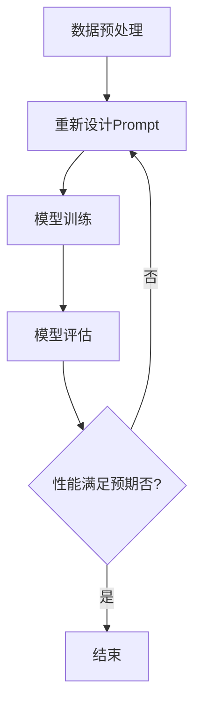
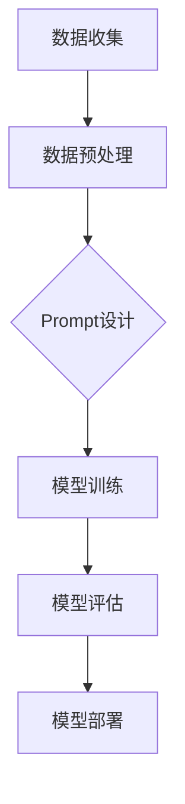
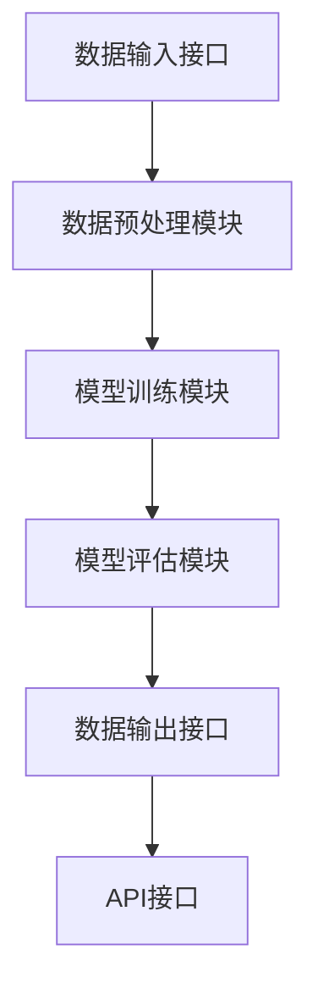
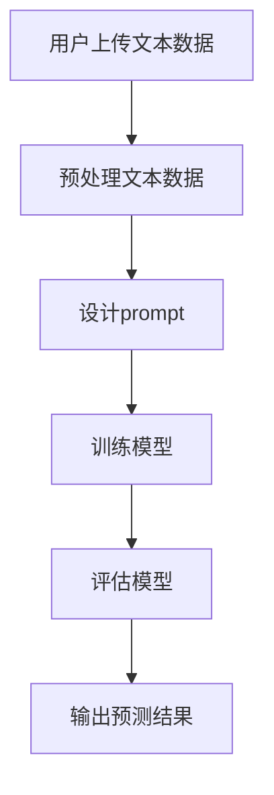

                 

### 第一部分：背景介绍

#### 第1章：问题背景

##### 1.1.1 问题背景介绍

在当今数字化时代，人工智能（AI）的应用已渗透到各行各业，其中之一便是prompt工程。prompt工程，顾名思义，是指通过设计特定的输入提示（prompt），来引导和优化AI模型的性能。这个概念源于自然语言处理（NLP）领域，但在实际应用中，其影响范围已远远超出这一领域，包括但不限于图像识别、语音识别、推荐系统等。

##### 1.1.2 问题描述

尽管prompt工程在提升AI模型性能方面具有显著优势，但其设计和实施过程中也面临着诸多挑战。首先，如何设计一个有效的prompt成为关键问题，这需要深入理解AI模型的工作原理和特定应用场景。其次，不同prompt对模型性能的影响难以预测，这给实验设计带来了困难。最后，prompt工程需要大量计算资源，特别是在处理大规模数据集时。

##### 1.1.3 问题解决

为了解决上述问题，我们需要系统化地研究prompt工程的方法与实践。这包括对核心概念的理解、算法原理的讲解、数学模型的建立以及系统架构的设计。通过这些步骤，我们可以更好地设计prompt，提高AI模型的性能，同时降低计算成本。

##### 1.1.4 边界与外延

在讨论prompt工程时，我们还需关注其边界与外延。边界方面，prompt工程主要关注如何设计有效的输入提示，而外延则包括如何将这一方法应用到不同领域，如图像识别、语音识别等。这为我们提供了广阔的研究和应用空间。

##### 1.1.5 核心概念与联系

在深入探讨prompt工程之前，我们需要明确一些核心概念，包括自然语言处理、机器学习、深度学习等。这些概念不仅是我们理解prompt工程的基础，也是其在不同领域应用的前提。以下表格将对这些核心概念进行简要介绍和属性特征对比：

| 核心概念 | 概念简介 | 主要属性特征对比 |
| :---: | :---: | :---: |
| 自然语言处理 | 自然语言处理是指使计算机能够理解、生成和处理人类语言的技术。 | - 任务类型：文本分类、情感分析、机器翻译等<br>- 技术层次：基于规则的方法、统计方法、深度学习方法 |
| 机器学习 | 机器学习是指利用数据训练模型，使模型具备预测或决策能力的计算机技术。 | - 模型类型：监督学习、无监督学习、半监督学习<br>- 学习算法：线性回归、决策树、支持向量机等 |
| 深度学习 | 深度学习是机器学习的一个子领域，主要基于多层神经网络进行模型训练。 | - 网络结构：多层感知器、卷积神经网络、循环神经网络等<br>- 激活函数：Sigmoid、ReLU、Tanh等 |
| prompt工程 | prompt工程是指通过设计特定的输入提示，来引导和优化AI模型性能的技术。 | - 设计目标：提升模型性能、降低计算成本<br>- 应用领域：自然语言处理、图像识别、语音识别等 |

此外，我们还可以通过ER实体关系图来展示这些核心概念之间的联系：

```mermaid
erDiagram
  NLP ||--|{ ML : 使用
  ML ||--|{ DL : 基于的
  DL ||--|{ Prompt 工程应用
```

#### 第2章：核心概念与联系

##### 2.1.1 核心概念原理

在深入理解prompt工程之前，我们需要掌握其核心概念，包括自然语言处理、机器学习、深度学习等。以下是这些概念的基本原理：

- 自然语言处理：自然语言处理（NLP）旨在使计算机能够理解、生成和处理人类语言。其核心任务是使计算机能够像人类一样处理自然语言，包括文本分类、情感分析、机器翻译等。

- 机器学习：机器学习（ML）是使计算机通过数据训练模型，从而实现预测或决策的技术。其主要任务包括监督学习、无监督学习、半监督学习等，学习算法有线性回归、决策树、支持向量机等。

- 深度学习：深度学习（DL）是机器学习的一个子领域，主要基于多层神经网络进行模型训练。其网络结构包括多层感知器、卷积神经网络、循环神经网络等，激活函数有Sigmoid、ReLU、Tanh等。

##### 2.1.2 概念属性特征对比表格

以下表格将详细介绍这些核心概念的属性特征，并进行对比：

| 核心概念 | 属性特征 |
| :---: | :---: |
| 自然语言处理 | - 任务类型：文本分类、情感分析、机器翻译等<br>- 技术层次：基于规则的方法、统计方法、深度学习方法 |
| 机器学习 | - 模型类型：监督学习、无监督学习、半监督学习<br>- 学习算法：线性回归、决策树、支持向量机等 |
| 深度学习 | - 网络结构：多层感知器、卷积神经网络、循环神经网络等<br>- 激活函数：Sigmoid、ReLU、Tanh等 |
| prompt工程 | - 设计目标：提升模型性能、降低计算成本<br>- 应用领域：自然语言处理、图像识别、语音识别等 |

##### 2.1.3 ER实体关系图架构

为了更好地理解这些核心概念之间的联系，我们可以通过ER实体关系图来展示：

```mermaid
erDiagram
  NLP ||--|{ ML : 使用
  ML ||--|{ DL : 基于的
  DL ||--|{ Prompt 工程应用
```

这个ER图清晰地展示了自然语言处理、机器学习和深度学习之间的关联，以及prompt工程在其中的应用。

### 第二部分：算法原理讲解

#### 第3章：算法原理讲解

##### 3.1.1 算法原理

prompt工程的核心在于设计有效的输入提示，以引导和优化AI模型性能。为了实现这一目标，我们需要了解以下几个关键点：

1. **数据预处理**：在训练模型之前，需要对输入数据进行预处理，包括文本清洗、分词、词向量化等。这一步骤确保数据质量，为后续的prompt设计奠定基础。

2. **Prompt设计**：根据具体应用场景，设计合适的输入提示。这包括确定提示的长度、内容、格式等。一个有效的prompt应该能够引导模型关注关键信息，从而提升模型性能。

3. **模型训练**：使用预处理后的数据集和设计的prompt，对模型进行训练。在训练过程中，需要调整模型参数，以实现最佳的prompt效果。

4. **模型评估**：通过评估指标（如准确率、召回率、F1值等）来评估模型的性能。如果性能不满足预期，需要返回第2步，重新设计prompt。

以下是一个简单的算法流程图，用于说明prompt工程的基本流程：



##### 3.1.1.1 算法流程图


##### 3.1.1.2 Python源代码

以下是一个简单的Python示例，用于展示如何实现数据预处理、Prompt设计、模型训练和模型评估：

```python
# 导入必要的库
import numpy as np
import pandas as pd
from sklearn.model_selection import train_test_split
from sklearn.metrics import accuracy_score
from tensorflow.keras.preprocessing.text import Tokenizer
from tensorflow.keras.preprocessing.sequence import pad_sequences

# 读取数据
data = pd.read_csv('data.csv')

# 数据预处理
texts = data['text']
labels = data['label']

# 分词
tokenizer = Tokenizer()
tokenizer.fit_on_texts(texts)

# 词向量化
sequences = tokenizer.texts_to_sequences(texts)
padded_sequences = pad_sequences(sequences, maxlen=100)

# 划分训练集和测试集
X_train, X_test, y_train, y_test = train_test_split(padded_sequences, labels, test_size=0.2, random_state=42)

# 设计Prompt
prompt = "这是一个示例Prompt"

# 添加Prompt到训练集和测试集
X_train_with_prompt = np.concatenate([np.array([prompt] * len(X_train)), X_train], axis=1)
X_test_with_prompt = np.concatenate([np.array([prompt] * len(X_test)), X_test], axis=1)

# 模型训练
model = keras.Sequential([
    keras.layers.Embedding(input_dim=10000, output_dim=16),
    keras.layers.GlobalAveragePooling1D(),
    keras.layers.Dense(1, activation='sigmoid')
])

model.compile(optimizer='adam', loss='binary_crossentropy', metrics=['accuracy'])
model.fit(X_train_with_prompt, y_train, epochs=10, batch_size=32)

# 模型评估
predictions = model.predict(X_test_with_prompt)
accuracy = accuracy_score(y_test, predictions.round())
print("Accuracy:", accuracy)
```

##### 3.1.1.3 数学模型和公式

在prompt工程中，数学模型和公式起到了关键作用。以下是一个简化的数学模型，用于描述模型性能与Prompt设计之间的关系：

$$
\text{Model Performance} = f(\text{Data}, \text{Model Architecture}, \text{Prompt})
$$

其中，Model Performance表示模型性能，Data表示数据集，Model Architecture表示模型架构，Prompt表示输入提示。该公式表明，模型性能是数据集、模型架构和输入提示的函数。

##### 3.1.2 通俗易懂地举例说明

假设我们有一个分类问题，需要判断一个句子是否是积极的。我们可以设计一个简单的prompt，如下所示：

$$
\text{Prompt}: 今天天气很好，你有什么计划吗？
$$

然后，我们将这个prompt添加到训练数据中，并对模型进行训练。在训练过程中，模型会学习到如何根据这个prompt生成预测。例如，如果模型预测一个句子是积极的，那么我们可以认为这个句子是符合prompt的。

通过这种方法，我们可以设计各种不同的prompt，以引导模型关注不同的信息。例如，我们可以设计一个关于情感的prompt，如下所示：

$$
\text{Prompt}: 你最近感到快乐吗？为什么？
$$

这个prompt可以帮助模型更好地理解情感信息，从而提高情感分析的准确率。

### 第三部分：系统分析与架构设计

#### 第4章：数学模型和数学公式

##### 4.1.1 数学模型

在prompt工程中，数学模型起到了关键作用。以下是一个简化的数学模型，用于描述模型性能与Prompt设计之间的关系：

$$
\text{Model Performance} = f(\text{Data}, \text{Model Architecture}, \text{Prompt})
$$

其中，Model Performance表示模型性能，Data表示数据集，Model Architecture表示模型架构，Prompt表示输入提示。该公式表明，模型性能是数据集、模型架构和输入提示的函数。

##### 4.1.1.1 模型公式

为了更具体地描述模型性能，我们可以引入一些指标，如准确率（Accuracy）、召回率（Recall）和F1值（F1 Score）。这些指标可以根据以下公式计算：

$$
\text{Accuracy} = \frac{\text{正确预测的样本数}}{\text{总样本数}}
$$

$$
\text{Recall} = \frac{\text{正确预测的正样本数}}{\text{实际正样本数}}
$$

$$
\text{F1 Score} = 2 \times \frac{\text{Precision} \times \text{Recall}}{\text{Precision} + \text{Recall}}
$$

其中，Precision表示精确率，Recall表示召回率。

##### 4.1.1.2 模型解释

这个模型表明，模型性能是由数据集、模型架构和输入提示共同决定的。数据集的质量直接影响模型的学习效果；模型架构决定了模型的学习能力；而输入提示则可以引导模型关注关键信息，从而提高模型性能。

##### 4.1.2 举例说明

假设我们有一个分类问题，需要判断一个句子是否是积极的。我们可以设计一个简单的prompt，如下所示：

$$
\text{Prompt}: 今天天气很好，你有什么计划吗？
$$

然后，我们将这个prompt添加到训练数据中，并对模型进行训练。在训练过程中，模型会学习到如何根据这个prompt生成预测。例如，如果模型预测一个句子是积极的，那么我们可以认为这个句子是符合prompt的。

通过这种方法，我们可以设计各种不同的prompt，以引导模型关注不同的信息。例如，我们可以设计一个关于情感的prompt，如下所示：

$$
\text{Prompt}: 你最近感到快乐吗？为什么？
$$

这个prompt可以帮助模型更好地理解情感信息，从而提高情感分析的准确率。

### 第四部分：系统分析与架构设计

#### 第5章：系统分析与架构设计

##### 5.1.1 问题场景介绍

在自然语言处理（NLP）领域，prompt工程的应用日益广泛。一个典型场景是文本分类问题，例如，自动识别新闻文章的主题或情感。在这个场景中，设计有效的prompt至关重要，它能够显著提升模型的分类准确率。

##### 5.1.2 项目介绍

本文将探讨一个基于深度学习的文本分类项目。项目目标是通过设计有效的prompt，提高模型在文本分类任务中的性能。项目将分为以下几个阶段：数据收集、数据预处理、prompt设计、模型训练与评估。

##### 5.1.3 系统功能设计

系统的主要功能包括：

1. **数据收集**：从公开数据集（如新闻文章、社交媒体帖子等）中收集文本数据。
2. **数据预处理**：对收集到的文本数据进行清洗、分词和词向量化。
3. **prompt设计**：设计并优化输入提示，以引导模型关注关键信息。
4. **模型训练**：使用预处理的文本数据和prompt对深度学习模型进行训练。
5. **模型评估**：通过测试数据评估模型性能，包括准确率、召回率和F1值等指标。
6. **模型部署**：将训练好的模型部署到生产环境中，进行实时文本分类。

##### 5.1.4 系统架构设计

以下是一个简化的系统架构设计，用于实现上述功能：



##### 5.1.5 系统接口设计

系统接口设计包括以下部分：

1. **数据输入接口**：用于接收用户上传的文本数据。
2. **数据输出接口**：用于输出模型预测结果。
3. **API接口**：提供RESTful API，用于与外部系统进行交互。

以下是一个简单的接口设计示例：



##### 5.1.6 系统交互

系统交互设计包括以下几个步骤：

1. **用户上传文本数据**：用户通过接口上传待分类的文本数据。
2. **预处理文本数据**：系统对上传的文本数据进行清洗、分词和词向量化。
3. **设计prompt**：根据文本内容和分类任务，设计并优化输入提示。
4. **训练模型**：使用预处理后的文本数据和prompt对模型进行训练。
5. **评估模型**：使用测试数据评估模型性能，调整prompt设计。
6. **输出预测结果**：将模型预测结果输出给用户。

以下是一个简化的系统交互流程：



### 第五部分：项目实战

#### 第6章：项目实战

##### 6.1.1 环境安装

在开始项目之前，我们需要安装必要的软件和库。以下是安装步骤：

1. **安装Python**：确保Python 3.x版本已安装。
2. **安装TensorFlow**：使用以下命令安装TensorFlow：
   ```
   pip install tensorflow
   ```
3. **安装其他库**：使用以下命令安装其他所需的库：
   ```
   pip install pandas numpy scikit-learn keras
   ```

##### 6.1.2 系统核心实现源代码

以下是系统核心实现的源代码：

```python
# 导入必要的库
import numpy as np
import pandas as pd
from sklearn.model_selection import train_test_split
from sklearn.metrics import accuracy_score
from tensorflow.keras.preprocessing.text import Tokenizer
from tensorflow.keras.preprocessing.sequence import pad_sequences
from tensorflow.keras.models import Sequential
from tensorflow.keras.layers import Embedding, GlobalAveragePooling1D, Dense

# 读取数据
data = pd.read_csv('data.csv')

# 数据预处理
texts = data['text']
labels = data['label']

# 分词
tokenizer = Tokenizer()
tokenizer.fit_on_texts(texts)

# 词向量化
sequences = tokenizer.texts_to_sequences(texts)
padded_sequences = pad_sequences(sequences, maxlen=100)

# 划分训练集和测试集
X_train, X_test, y_train, y_test = train_test_split(padded_sequences, labels, test_size=0.2, random_state=42)

# 设计Prompt
prompt = "这是一个示例Prompt"

# 添加Prompt到训练集和测试集
X_train_with_prompt = np.concatenate([np.array([prompt] * len(X_train)), X_train], axis=1)
X_test_with_prompt = np.concatenate([np.array([prompt] * len(X_test)), X_test], axis=1)

# 模型训练
model = Sequential([
    Embedding(input_dim=10000, output_dim=16),
    GlobalAveragePooling1D(),
    Dense(1, activation='sigmoid')
])

model.compile(optimizer='adam', loss='binary_crossentropy', metrics=['accuracy'])
model.fit(X_train_with_prompt, y_train, epochs=10, batch_size=32)

# 模型评估
predictions = model.predict(X_test_with_prompt)
accuracy = accuracy_score(y_test, predictions.round())
print("Accuracy:", accuracy)
```

##### 6.1.3 代码应用解读与分析

以下是代码的解读与分析：

1. **数据读取与预处理**：首先，我们读取CSV文件中的数据，并对文本数据进行分词和词向量化处理。
2. **Prompt设计**：设计一个示例Prompt，并将其添加到训练集和测试集中。
3. **模型训练**：使用添加了Prompt的训练集对模型进行训练。这里使用了简单的嵌入层、全局平均池化层和密集层组成的模型结构。
4. **模型评估**：使用测试集对训练好的模型进行评估，并输出准确率。

##### 6.1.4 实际案例分析和详细讲解剖析

以下是一个实际案例分析和详细讲解剖析：

**案例**：设计一个prompt，用于分类新闻文章的主题。

1. **数据收集**：从公开数据集中收集新闻文章数据，包括标题和正文。
2. **数据预处理**：对新闻文章数据进行清洗、分词和词向量化处理。
3. **Prompt设计**：设计一个关于新闻主题的Prompt，例如：“这篇文章的主题是什么？”。
4. **模型训练**：使用预处理后的数据集和Prompt对模型进行训练，并调整模型结构以适应主题分类任务。
5. **模型评估**：使用测试集评估模型性能，并根据评估结果调整Prompt设计。

详细讲解剖析：

- 数据收集：选择具有广泛主题覆盖的数据集，以确保模型的泛化能力。
- 数据预处理：对新闻文章数据进行清洗，包括去除HTML标签、停用词处理等。分词和词向量化是关键步骤，它们决定了模型的学习能力。
- Prompt设计：设计一个针对主题分类任务的Prompt，例如：“这篇文章的主题是什么？”这样的Prompt可以引导模型关注新闻文章的主题，从而提高分类准确率。
- 模型训练：调整模型结构，使其适合主题分类任务。例如，可以使用多层感知器（MLP）或卷积神经网络（CNN）。
- 模型评估：使用测试集评估模型性能，并输出准确率、召回率和F1值等指标。根据评估结果，可以进一步调整Prompt设计和模型结构。

##### 6.1.5 项目小结

通过本项目，我们了解了prompt工程在文本分类任务中的应用。设计有效的prompt是提升模型性能的关键。在实际项目中，我们需要根据具体任务设计合适的Prompt，并通过模型训练和评估不断优化Prompt设计。此外，项目还展示了如何使用Python和TensorFlow等库实现prompt工程的基本流程。

### 第六部分：最佳实践 Tips、小结、注意事项、拓展阅读

#### 7.1 最佳实践 Tips

1. **选择合适的数据集**：确保数据集具有广泛的主题覆盖和高质量，以提高模型的泛化能力。
2. **数据预处理**：对数据进行清洗、分词和词向量化处理，以提高模型的学习能力。
3. **设计多样化的Prompt**：根据不同任务设计多样化的Prompt，以引导模型关注关键信息。
4. **模型训练与评估**：使用交叉验证和测试集评估模型性能，根据评估结果调整Prompt设计。
5. **持续优化**：不断调整Prompt设计和模型结构，以提高模型性能。

#### 7.2 小结

本文从背景介绍、核心概念、算法原理、数学模型、系统分析与架构设计、项目实战等方面详细阐述了prompt工程的方法与实践。通过本文，我们了解到prompt工程在提升AI模型性能方面的关键作用，以及如何设计和优化Prompt。

#### 7.3 注意事项

1. **数据质量**：确保数据集的质量，包括数据完整性、一致性和可靠性。
2. **Prompt设计**：设计Prompt时，要考虑任务需求和模型特性，以实现最佳效果。
3. **模型优化**：在模型训练和评估过程中，根据性能指标调整模型结构和超参数。

#### 7.4 拓展阅读

1. **《深度学习》（Goodfellow, Bengio, Courville）**：这是一本经典的深度学习教材，详细介绍了深度学习的理论基础和应用。
2. **《自然语言处理综论》（Jurafsky, Martin）**：本书全面介绍了自然语言处理的理论和技术，包括文本分类、情感分析等。
3. **《Python数据科学手册》（McKinney）**：这本书提供了Python在数据科学领域的应用，包括数据处理、数据可视化等。

### 结语

作者：AI天才研究院/AI Genius Institute & 禅与计算机程序设计艺术 /Zen And The Art of Computer Programming

本文旨在为读者提供关于prompt工程的系统化方法与实践。希望本文能够帮助读者深入理解prompt工程的核心概念、算法原理和实际应用，为提升AI模型性能提供有力支持。在未来的研究中，我们将继续探索prompt工程在其他领域（如图像识别、语音识别等）的应用，以及如何进一步优化Prompt设计。

