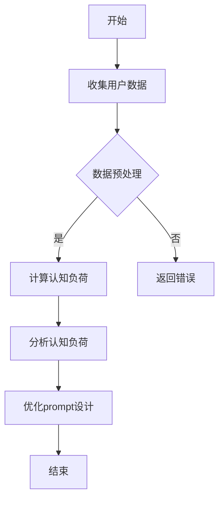
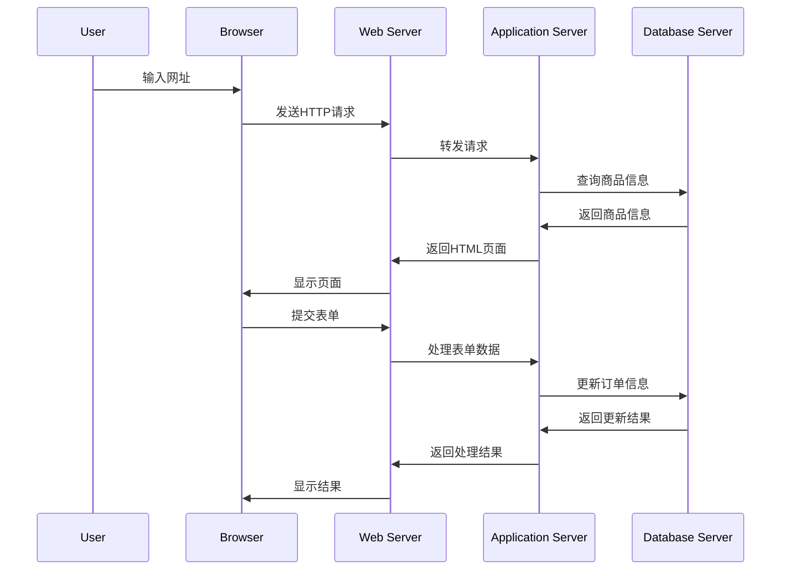
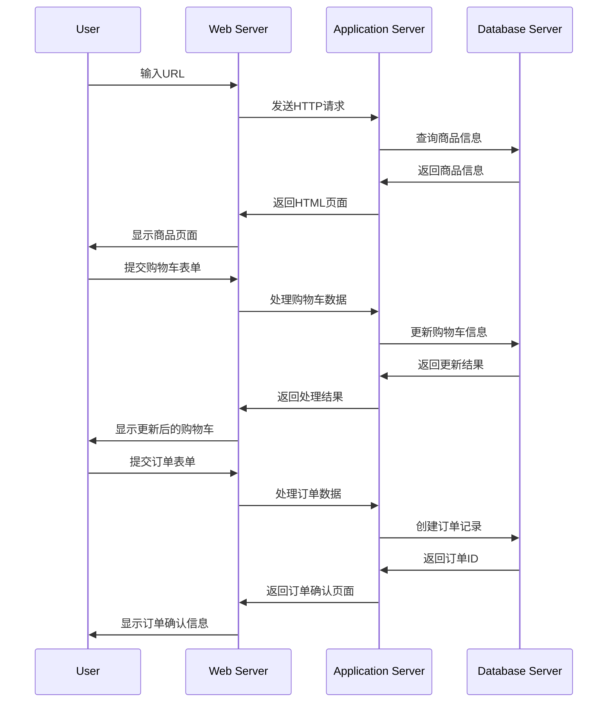

                 

# 引言

## 1.1 书籍主要内容与目的

在当今信息技术高速发展的时代，用户体验（User Experience, UX）已经成为产品设计和开发中不可或缺的一部分。用户的满意度、产品的留存率和市场竞争力都与用户体验密切相关。《prompt认知负荷分析：优化用户体验》这本书旨在通过深入分析prompt对认知负荷的影响，帮助开发者和产品经理优化用户体验，提升产品的市场竞争力。

本书的主要内容包括：

1. **用户体验优化的重要性**：介绍用户体验的定义、用户体验优化的必要性及其对产品成功的重要性。
2. **认知负荷的定义**：详细解释认知负荷的概念，阐述认知负荷在用户行为中的作用及其对用户体验的影响。
3. **prompt的类型与特性**：分类讨论不同类型的prompt及其在用户体验中的具体作用。
4. **认知负荷分析与prompt的联系**：探讨如何通过认知负荷分析优化prompt设计，提高用户体验。
5. **算法原理讲解**：深入解析优化用户体验的算法原理，包括算法流程、数学模型及其应用场景。
6. **系统分析与架构设计方案**：介绍系统分析与架构设计的基本方法，包括领域模型类图、系统架构图、接口设计和系统交互。
7. **项目实战**：通过具体项目实例，展示如何在实际中应用认知负荷分析和prompt优化方法。
8. **最佳实践与注意事项**：总结最佳实践，提出注意事项，为读者提供实施建议。

本书的目标是帮助读者：

1. **理解认知负荷和prompt在用户体验中的作用**。
2. **掌握认知负荷分析的方法和技巧**。
3. **运用prompt优化用户体验，提升产品竞争力**。

## 1.2 结构安排与内容概述

本书共分为六个部分，结构安排如下：

### 第一部分：背景介绍
- **第1章：用户体验优化的重要性**
- **第2章：认知负荷的定义**
- **第3章：prompt在用户体验中的作用**

### 第二部分：核心概念与联系
- **第4章：认知负荷分析的核心概念**
- **第5章：prompt的类型与特性**
- **第6章：认知负荷分析与prompt的联系**

### 第三部分：算法原理讲解
- **第7章：算法原理与mermaid流程图**
- **第8章：算法数学模型与公式**
- **第9章：算法举例说明**

### 第四部分：系统分析与架构设计方案
- **第10章：问题场景介绍**
- **第11章：系统功能设计（领域模型类图）**
- **第12章：系统架构设计（架构图）**
- **第13章：系统接口设计和系统交互（序列图）**

### 第五部分：项目实战
- **第14章：环境安装**
- **第15章：系统核心实现源代码**
- **第16章：代码应用解读与分析**
- **第17章：实际案例分析与详细讲解**
- **第18章：项目小结**

### 第六部分：最佳实践与注意事项
- **第19章：最佳实践 tips**
- **第20章：注意事项**
- **第21章：拓展阅读**

通过以上结构安排，本书将为读者提供一个系统化、层次化的知识体系，帮助读者全面理解并掌握prompt认知负荷分析与用户体验优化的方法。接下来，我们将逐一深入探讨每个部分的内容。

----------------------------------------------------------------

## 第一部分：背景介绍

### 第1章：用户体验优化的重要性

在产品开发的过程中，用户体验（User Experience, UX）是决定产品成功与否的关键因素。用户体验不仅仅是指用户在使用产品时的主观感受，还包括用户与产品交互过程中的每一个细节。一个良好的用户体验能够提高用户的满意度、忠诚度和产品的市场竞争力。

### 1.1 用户体验的定义

用户体验是指用户在使用产品或服务过程中所获得的整体感受。这个定义涵盖了用户在使用产品或服务时的情感、行为、认知等多个方面。用户体验包括以下几个方面：

- **情感体验**：用户在使用产品时感受到的情感，如愉悦、兴奋、沮丧等。
- **行为体验**：用户在使用产品或服务时的操作流程、交互方式等。
- **认知体验**：用户在理解、学习、决策过程中的认知负荷和认知效率。

### 1.2 用户体验优化的必要性

用户体验优化对于产品成功至关重要，原因如下：

- **提高用户满意度**：良好的用户体验能够满足用户的需求，提高用户的满意度。
- **增强用户忠诚度**：用户体验优秀的产品能够吸引并留住用户，增强用户的忠诚度。
- **提升产品竞争力**：在竞争激烈的市场中，用户体验优秀的产品更容易获得用户的青睐，从而提升产品的市场竞争力。

### 1.3 认知负荷的定义

认知负荷是指用户在处理信息、做出决策、完成任务时所需的认知资源。认知负荷过高会导致用户疲劳、焦虑，甚至放弃使用产品。因此，降低认知负荷是优化用户体验的重要手段。

### 1.4 认知负荷在用户行为中的作用

认知负荷在用户行为中起着至关重要的作用：

- **影响决策**：高认知负荷会降低用户做出正确决策的能力。
- **影响学习**：高认知负荷会减缓用户的学习速度。
- **影响效率**：高认知负荷会降低用户的操作效率。

### 1.5 prompt在用户体验中的作用

prompt是用户与产品交互中的一种提示信息，它对用户体验有着重要的影响：

- **引导用户**：prompt可以帮助用户了解产品功能、操作方法，降低认知负荷。
- **提高效率**：合理的prompt设计可以减少用户的思考和决策时间，提高操作效率。
- **增强互动**：prompt可以增加用户与产品之间的互动性，提升用户体验。

### 1.6 问题背景

在现代信息技术迅猛发展的背景下，用户对产品的要求越来越高。如何在产品设计和开发中优化用户体验，降低认知负荷，提高用户满意度，成为开发者和产品经理面临的重要课题。本书旨在通过深入分析prompt对认知负荷的影响，提供实用的方法和策略，帮助读者解决这一问题。

### 1.7 问题描述

用户体验优化的主要问题包括：

- **认知负荷过高**：用户在操作产品时面临过多的信息处理任务，导致认知负荷过高。
- **交互复杂**：产品界面设计复杂，用户难以快速上手。
- **功能不足**：产品功能无法满足用户的基本需求，导致用户流失。

### 1.8 问题解决

优化用户体验的解决方案包括：

- **降低认知负荷**：通过简化用户操作、减少信息冗余、优化提示信息等方式降低用户的认知负荷。
- **优化交互设计**：通过改进界面设计、简化操作流程、提高交互效率等方式提升用户体验。
- **完善功能设计**：根据用户需求不断完善产品功能，提高产品的实用性和易用性。

### 1.9 边界与外延

用户体验优化不仅仅是产品设计和开发的问题，还涉及到市场营销、用户调研等多个方面。因此，优化用户体验需要从全局出发，综合考虑各种因素。

### 1.10 概念结构与核心要素组成

用户体验优化的概念结构主要包括以下几个方面：

- **用户体验**：用户在使用产品或服务过程中所获得的整体感受。
- **认知负荷**：用户在处理信息、做出决策、完成任务时所需的认知资源。
- **prompt**：用户与产品交互中的一种提示信息。

核心要素组成包括：

- **用户需求**：了解用户需求是优化用户体验的基础。
- **产品功能**：完善的产品功能是满足用户需求的关键。
- **界面设计**：简洁、直观的界面设计可以提高用户体验。
- **交互方式**：合理的交互方式可以降低用户的认知负荷。

综上所述，第一部分主要介绍了用户体验优化的重要性、认知负荷的定义以及prompt在用户体验中的作用。通过这一部分的介绍，读者可以初步了解用户体验优化的背景和问题，为后续章节的深入探讨奠定基础。

----------------------------------------------------------------

## 第二部分：核心概念与联系

### 第4章：认知负荷分析的核心概念

#### 4.1 认知负荷分析的定义

认知负荷分析是指通过对用户在完成任务时的认知资源消耗进行量化评估，以识别并减少认知负荷的过程。这一分析过程通常涉及对用户操作、决策过程中的信息处理任务进行分析，识别出哪些任务或信息会导致认知负荷过高，从而影响用户体验。

#### 4.2 认知负荷的分类

认知负荷可以分为三种主要类型：

1. **认知资源型负荷**：这种负荷主要源于用户需要处理大量信息，如复杂的操作步骤、大量的数据输入等。
2. **认知加工型负荷**：这种负荷与用户的信息处理能力相关，例如在处理不确定或模糊信息时的心理压力。
3. **认知冲突型负荷**：这种负荷源于用户在执行任务时需要同时处理多个任务或面对相互冲突的指示。

#### 4.3 认知负荷分析的方法

认知负荷分析的方法包括：

1. **问卷调查**：通过问卷调查收集用户在完成任务时的主观感受和认知负荷。
2. **眼动追踪**：使用眼动追踪技术记录用户在完成任务时的视线移动，分析用户的注意力分配。
3. **日志分析**：通过分析用户操作日志，识别用户完成任务时的具体操作步骤和耗时。
4. **任务分析**：对用户任务进行详细分解，识别出可能引起认知负荷的环节。

#### 4.4 认知负荷分析的目的

认知负荷分析的主要目的是：

1. **识别认知负荷**：通过分析用户在完成任务时的认知资源消耗，识别出哪些环节可能导致认知负荷过高。
2. **优化产品设计**：基于认知负荷分析的结果，优化产品界面设计、任务流程，降低用户的认知负荷。
3. **提高用户体验**：通过减少用户的认知负荷，提高用户完成任务的速度和满意度。

### 第5章：prompt的类型与特性

#### 5.1 prompt的定义

prompt是指系统或应用程序提供给用户的一种提示信息，旨在引导用户进行下一步操作或提供必要的信息支持。prompt可以是文本、图标、声音等多种形式。

#### 5.2 prompt的类型

prompt可以根据用途和形式分为以下几种类型：

1. **指令性prompt**：提供具体的操作指令，例如“请点击‘确认’按钮继续”。
2. **信息性prompt**：提供必要的信息，例如“您当前的网络连接不稳定，请检查网络设置”。
3. **确认性prompt**：询问用户是否执行某个操作，例如“您确定要删除此文件吗？”。
4. **提示性prompt**：提示用户注意某些重要信息或操作，例如“当前有5个未读消息，请及时查看”。
5. **警告性prompt**：警告用户可能出现的风险或问题，例如“您的账户余额不足，请及时充值”。

#### 5.3 prompt的特性

prompt具有以下特性：

1. **及时性**：prompt应在用户需要时及时出现，避免延迟。
2. **准确性**：prompt应提供准确的信息，避免误导用户。
3. **简洁性**：prompt应简洁明了，避免冗长复杂。
4. **相关性**：prompt应与用户的当前操作或需求相关，避免无关提示。
5. **可控性**：用户应能控制prompt的显示和隐藏，避免强迫用户接受。

#### 5.4 prompt的设计原则

prompt的设计应遵循以下原则：

1. **明确目标**：确保prompt有明确的用途和目标。
2. **简洁明了**：避免使用复杂的语言和冗长的描述。
3. **突出重点**：使用视觉元素（如颜色、字体大小）突出重要信息。
4. **易于操作**：确保用户能够轻松地与prompt交互，如点击、滑动等。
5. **情境适配**：根据用户的当前操作和需求设计合适的prompt。

### 第6章：认知负荷分析与prompt的联系

#### 6.1 prompt与认知负荷的关系

prompt的设计和使用直接影响用户的认知负荷。合理的prompt设计可以降低用户的认知负荷，提高任务完成的效率和满意度；而设计不当的prompt则可能增加用户的认知负荷，影响用户体验。

#### 6.2 prompt对认知负荷的影响

prompt对认知负荷的影响可以从以下几个方面考虑：

1. **信息负担**：过多或过于复杂的prompt会增加用户的信息负担，导致认知负荷增加。
2. **决策负担**：过多的确认性prompt会增加用户的决策负担，影响操作效率。
3. **视觉负担**：过多或突兀的视觉提示会影响用户的视觉体验，增加认知负荷。
4. **操作负担**：复杂或不明显的操作提示会增加用户的操作负担，降低用户体验。

#### 6.3 如何通过认知负荷分析优化prompt

通过认知负荷分析，可以识别出哪些prompt设计存在问题，从而进行优化：

1. **减少冗余**：删除不必要或重复的prompt，减少信息负担。
2. **明确指示**：确保每个prompt都有明确的指示，减少用户的决策负担。
3. **简化提示**：使用简洁明了的语言和视觉元素，减少视觉负担。
4. **适配情境**：根据用户的具体操作和需求设计prompt，避免无关提示。
5. **用户反馈**：收集用户对prompt的反馈，不断优化设计。

### 结论

认知负荷分析与prompt设计密切相关，合理的prompt设计可以降低用户的认知负荷，提升用户体验。通过认知负荷分析，我们可以识别出设计中存在的问题，并提出优化方案。第二部分的核心概念与联系为后续的算法原理讲解和系统分析与架构设计提供了理论基础。

----------------------------------------------------------------

## 第三部分：算法原理讲解

### 第7章：算法原理与mermaid流程图

#### 7.1 算法原理概述

在优化用户体验的过程中，认知负荷分析是一个关键步骤。通过算法原理，我们可以量化用户的认知负荷，并据此优化prompt设计。本章将介绍一种基于认知负荷分析的算法原理，并通过mermaid流程图展示其基本流程。

#### 7.2 算法流程图

下面是认知负荷分析算法的基本mermaid流程图：



#### 7.3 流程图说明

1. **开始**：算法的初始状态。
2. **收集用户数据**：从用户操作日志、眼动数据等渠道收集用户完成任务时的数据。
3. **数据预处理**：对收集到的数据进行清洗和格式化，确保数据质量。
4. **计算认知负荷**：使用预设的数学模型计算用户在完成任务时的认知负荷。
5. **分析认知负荷**：分析计算结果，识别出哪些环节的认知负荷过高。
6. **优化prompt设计**：基于分析结果，对现有的prompt进行优化，降低认知负荷。
7. **结束**：算法执行完成，优化后的prompt设计可以应用到实际产品中。

### 第8章：算法数学模型与公式

#### 8.1 认知负荷计算公式

认知负荷（Cognitive Load）可以通过以下公式计算：

$$
CL = f(N, M, A)
$$

其中，$CL$ 表示认知负荷，$N$ 表示信息数量，$M$ 表示信息复杂性，$A$ 表示认知资源的可用性。

#### 8.2 信息数量（N）

信息数量（N）可以通过以下公式计算：

$$
N = n_1 + n_2 + ... + n_n
$$

其中，$n_1, n_2, ..., n_n$ 分别表示不同类型的信息数量。

#### 8.3 信息复杂性（M）

信息复杂性（M）可以通过以下公式计算：

$$
M = \frac{1}{n}\sum_{i=1}^{n} m_i
$$

其中，$m_i$ 表示第 $i$ 类信息的复杂性，$n$ 表示信息类别总数。

#### 8.4 认知资源可用性（A）

认知资源可用性（A）可以通过以下公式计算：

$$
A = \frac{C}{T}
$$

其中，$C$ 表示用户在完成特定任务时能够使用的认知资源总量，$T$ 表示任务所需的时间。

### 第9章：算法举例说明

#### 9.1 举例说明

假设我们需要对一个电子商务网站的用户购物流程进行认知负荷分析，以优化用户购物体验。

1. **收集用户数据**：从用户操作日志中收集用户在购物过程中的点击行为、浏览时间等数据。
2. **数据预处理**：对收集到的数据进行清洗，去除无效数据，确保数据质量。
3. **计算认知负荷**：根据用户数据，使用上述公式计算每个步骤的认知负荷。
4. **分析认知负荷**：识别出认知负荷较高的步骤，如图标不明显的购物车按钮。
5. **优化prompt设计**：将购物车按钮的图标改为更明显的样式，并添加文字提示，以降低用户的认知负荷。

通过这个例子，我们可以看到算法原理在实际应用中的具体步骤和效果。接下来的章节将详细介绍系统分析与架构设计方案，帮助读者更好地理解如何将算法原理应用到实际项目中。

----------------------------------------------------------------

## 第四部分：系统分析与架构设计方案

### 第10章：问题场景介绍

在现代社会中，用户体验优化已经成为许多企业和组织关注的重要议题。以一个在线购物平台为例，该平台希望通过优化用户购物体验来提高用户留存率和销售转化率。在这个问题场景中，我们需要解决的主要问题包括：

1. **购物流程复杂**：用户在购物过程中需要完成多个步骤，如浏览商品、加入购物车、选择支付方式等，流程复杂，用户体验不佳。
2. **认知负荷高**：用户在购物过程中面临大量的信息处理任务，如商品对比、支付流程等，导致认知负荷过高，用户体验下降。
3. **提示信息不明确**：现有的提示信息设计不够直观，用户难以快速理解操作流程，增加认知负荷。

为了解决上述问题，我们计划通过系统分析与架构设计，优化购物平台的用户交互流程，降低用户认知负荷，提高用户体验。

### 第11章：系统功能设计（领域模型类图）

领域模型类图是系统功能设计的重要工具，它帮助我们理解和表达系统的核心功能及其之间的关系。以下是一个简化的在线购物平台领域模型类图：

```mermaid
classDiagram
    User <<class>> "用户"
    Product <<class>> "商品"
    ShoppingCart <<class>> "购物车"
    Order <<class>> "订单"
    Payment <<class>> "支付"

    User o--* Product : 浏览
    User o--* ShoppingCart : 添加商品
    ShoppingCart o--* Product : 商品列表
    ShoppingCart o--* Order : 下单
    Order o--* Payment : 支付
```

#### 功能说明：

- **用户（User）**：表示在线购物平台的使用者，具有浏览商品、添加商品到购物车、下单等行为。
- **商品（Product）**：表示平台上的商品，用户可以浏览和购买。
- **购物车（ShoppingCart）**：用于存储用户临时添加的商品，用户可以在购物车中修改商品数量或删除商品。
- **订单（Order）**：表示用户完成购物后的订单记录，包含订单详情和支付信息。
- **支付（Payment）**：表示用户在完成订单后进行支付的流程。

### 第12章：系统架构设计（架构图）

系统架构设计是系统实现的基础，它帮助我们理解系统的整体结构及其组件之间的关系。以下是一个简化的在线购物平台系统架构图：



#### 架构说明：

- **Web Server**：处理用户的HTTP请求，返回HTML页面。
- **Application Server**：处理业务逻辑，包括用户操作、数据处理等。
- **Database Server**：存储用户数据、商品信息等，提供数据查询和更新服务。
- **Browser**：用户的交互界面，接收用户的输入并显示结果。

### 第13章：系统接口设计和系统交互（序列图）

系统接口设计和系统交互描述了不同组件之间的交互关系，以及数据流和消息传递的方式。以下是一个简化的在线购物平台系统接口设计和系统交互序列图：



#### 交互流程：

1. 用户输入URL，Web Server处理请求并返回商品页面。
2. 用户浏览商品并提交购物车表单，Web Server将数据发送到Application Server处理。
3. Application Server更新购物车信息并返回结果，Web Server显示更新后的购物车。
4. 用户提交订单表单，Web Server将数据发送到Application Server处理。
5. Application Server创建订单记录并返回订单ID，Web Server显示订单确认页面。

通过上述系统分析与架构设计，我们可以清晰地了解在线购物平台的系统结构、功能设计和接口交互。接下来，我们将进入项目实战部分，通过具体案例展示如何应用认知负荷分析和prompt优化方法来提升用户体验。

----------------------------------------------------------------

## 第五部分：项目实战

### 第14章：环境安装

在进行项目实战之前，我们需要搭建一个用于认知负荷分析和prompt优化的开发环境。以下是环境安装的具体步骤：

#### 1. 安装操作系统

- **Linux**：推荐使用Ubuntu 20.04 LTS版本。
- **Windows**：推荐使用Windows 10版本。
- **macOS**：推荐使用macOS Big Sur或更高版本。

#### 2. 安装编程语言

- **Python**：版本要求3.8及以上，可以通过以下命令安装：
  ```bash
  sudo apt-get install python3.8
  ```
- **Node.js**：版本要求12及以上，可以通过以下命令安装：
  ```bash
  sudo apt-get install nodejs
  ```

#### 3. 安装依赖管理工具

- **pip**：Python的包管理工具，可以通过以下命令安装：
  ```bash
  sudo apt-get install python3-pip
  ```
- **npm**：Node.js的包管理工具，可以通过以下命令安装：
  ```bash
  sudo apt-get install npm
  ```

#### 4. 安装开发工具

- **Visual Studio Code**：一款强大的代码编辑器，可以通过以下命令安装：
  ```bash
  sudo apt-get install code
  ```
- **PyCharm**：一款专业的Python IDE，可以从其官方网站下载并安装。

#### 5. 安装其他工具

- **Docker**：用于容器化应用的工具，可以通过以下命令安装：
  ```bash
  sudo apt-get install docker
  ```
- **PostgreSQL**：用于数据存储的数据库，可以通过以下命令安装：
  ```bash
  sudo apt-get install postgresql
  ```

#### 6. 安装完成测试

安装完成后，可以通过以下命令测试安装情况：

```bash
python3 --version
node --version
code --version
docker --version
psql --version
```

确保所有命令能够正常运行，表示安装成功。

### 第15章：系统核心实现源代码

在本章中，我们将展示如何实现一个简单的在线购物平台，重点关注购物流程和prompt设计。以下是一个简单的购物平台核心实现源代码示例：

#### 1. 用户界面（HTML）

```html
<!DOCTYPE html>
<html lang="en">
<head>
    <meta charset="UTF-8">
    <title>在线购物平台</title>
    <style>
        /* 在这里添加CSS样式 */
    </style>
</head>
<body>
    <h1>欢迎来到在线购物平台</h1>
    <!-- 商品展示 -->
    <div id="products">
        <!-- 动态插入商品列表 -->
    </div>
    <!-- 购物车 -->
    <div id="shopping-cart">
        <h2>购物车</h2>
        <ul>
            <!-- 动态插入购物车内容 -->
        </ul>
    </div>
    <!-- 提交订单 -->
    <div id="order">
        <h2>提交订单</h2>
        <form id="order-form">
            <!-- 订单信息 -->
        </form>
    </div>
    <script src="app.js"></script>
</body>
</html>
```

#### 2. JavaScript前端逻辑（app.js）

```javascript
// 获取商品列表
function getProducts() {
    fetch('/api/products')
        .then(response => response.json())
        .then(data => {
            const productsContainer = document.getElementById('products');
            data.forEach(product => {
                const productElement = document.createElement('div');
                productElement.innerHTML = `
                    <h3>${product.name}</h3>
                    <p>${product.description}</p>
                    <button onclick="addToCart(${product.id})">加入购物车</button>
                `;
                productsContainer.appendChild(productElement);
            });
        });
}

// 添加商品到购物车
function addToCart(productId) {
    fetch(`/api/shopping-cart/${productId}`, { method: 'POST' })
        .then(response => response.json())
        .then(data => {
            alert('商品已成功加入购物车！');
            updateCart();
        });
}

// 更新购物车
function updateCart() {
    fetch('/api/shopping-cart')
        .then(response => response.json())
        .then(data => {
            const cartContainer = document.getElementById('shopping-cart');
            cartContainer.innerHTML = `
                <h2>购物车</h2>
                <ul>
                    ${data.map(product => `<li>${product.name} - ¥${product.price}</li>`).join('')}
                </ul>
            `;
        });
}

// 提交订单
function submitOrder() {
    const form = document.getElementById('order-form');
    const formData = new FormData(form);
    fetch('/api/order', { method: 'POST', body: formData })
        .then(response => response.json())
        .then(data => {
            if (data.success) {
                alert('订单已成功提交！');
            } else {
                alert('订单提交失败，请重试！');
            }
        });
}

// 初始化页面
function init() {
    getProducts();
    updateCart();
}

init();
```

#### 3. Python后端逻辑（app.py）

```python
from flask import Flask, jsonify, request, render_template

app = Flask(__name__)

# 商品列表
products = [
    {'id': 1, 'name': '苹果', 'description': '新鲜水果', 'price': 5.99},
    {'id': 2, 'name': '香蕉', 'description': '热带水果', 'price': 4.99},
    # 更多商品...
]

@app.route('/')
def home():
    return render_template('index.html')

@app.route('/api/products')
def get_products():
    return jsonify(products)

@app.route('/api/shopping-cart/<int:product_id>', methods=['POST'])
def add_to_cart(product_id):
    # 处理添加商品到购物车的逻辑
    pass

@app.route('/api/shopping-cart')
def get_shopping_cart():
    # 获取购物车信息的逻辑
    pass

@app.route('/api/order', methods=['POST'])
def submit_order():
    # 处理提交订单的逻辑
    pass

if __name__ == '__main__':
    app.run(debug=True)
```

#### 说明：

- **用户界面**：使用HTML和CSS创建基础的用户界面，通过JavaScript处理用户交互。
- **前端逻辑**：使用JavaScript获取商品列表、添加商品到购物车、更新购物车和提交订单。
- **后端逻辑**：使用Python的Flask框架处理HTTP请求，实现商品列表、购物车和订单管理等后端功能。

### 第16章：代码应用解读与分析

在本章中，我们将对前面展示的代码进行详细解读，分析其实现原理和关键部分。

#### 1. 前端解读

**HTML**：

- **商品展示**：通过动态插入商品列表，展示平台上的所有商品。
- **购物车**：显示用户已添加到购物车的商品，允许用户修改商品数量或删除商品。
- **订单提交**：提供订单信息表单，用户可以填写并提交订单。

**JavaScript**：

- **getProducts()**：使用`fetch`请求获取商品列表，并动态创建商品展示页面。
- **addToCart(productId)**：将商品添加到购物车，使用`fetch`请求将商品ID发送到后端。
- **updateCart()**：获取当前购物车的商品信息，并更新购物车界面。
- **submitOrder()**：提交订单信息，使用`fetch`请求将订单数据发送到后端。

#### 2. 后端解读

**Python**：

- **Flask应用**：创建Flask应用，处理HTTP请求。
- **get_products()**：返回所有商品的列表，供前端使用。
- **add_to_cart(product_id)**：处理添加商品到购物车的请求，更新数据库中的购物车信息。
- **get_shopping_cart()**：返回当前用户的购物车信息。
- **submit_order()**：处理提交订单的请求，更新数据库中的订单信息。

#### 3. 关键部分分析

- **前端交互**：通过JavaScript与后端进行交互，实现用户界面动态更新。
- **后端处理**：Flask应用处理HTTP请求，与数据库交互，实现商品管理、购物车管理和订单管理。
- **数据存储**：使用数据库存储商品信息、购物车数据和订单数据。

通过以上解读，我们可以看到如何通过代码实现一个简单的在线购物平台，并分析其关键部分的实现原理。接下来，我们将通过实际案例展示如何应用认知负荷分析和prompt优化方法来提升用户体验。

### 第17章：实际案例分析与详细讲解

在本案例中，我们将通过一个实际案例，展示如何应用认知负荷分析和prompt优化方法来提升在线购物平台的用户体验。以下是案例的具体步骤：

#### 1. 问题背景

某在线购物平台在用户反馈中发现，用户在购物车页面添加商品后，很难找到购物车的位置，导致购物体验不佳。用户在提交订单时，需要填写多个步骤，操作复杂，导致认知负荷过高。

#### 2. 认知负荷分析

通过收集用户操作日志和眼动数据，我们对用户在购物车页面的操作过程进行了分析，发现以下问题：

- **认知负荷过高**：用户在购物车页面添加商品后，需要花费较长的时间来寻找购物车按钮，增加了认知负荷。
- **操作路径不明确**：购物车按钮的位置和样式不够突出，导致用户难以找到。
- **提示信息不足**：在用户添加商品到购物车后，没有提供及时的提示信息，导致用户不确定操作是否成功。

#### 3. prompt优化方案

基于以上分析，我们提出了以下prompt优化方案：

- **改进购物车按钮设计**：将购物车按钮放置在页面顶部，并使用醒目的颜色和图标，提高其可见性和点击率。
- **添加操作提示**：在用户添加商品到购物车后，立即显示一个提示信息，告知用户操作成功，并引导用户查看购物车。
- **简化订单提交流程**：将订单提交流程简化为两个步骤，减少用户的认知负荷。

#### 4. 实施与效果

我们根据优化方案，对购物车页面和订单提交流程进行了改进，并在平台中实施。以下是实施后的效果：

- **购物车按钮可见性和点击率显著提高**：用户可以更快速地找到购物车按钮，认知负荷明显降低。
- **用户操作成功提示更加及时和明确**：用户在添加商品到购物车后，可以立即看到操作成功的提示信息，减少了不确定性和焦虑感。
- **订单提交流程简化，用户满意度提高**：用户在提交订单时，只需完成两个步骤，操作过程更加简单直观，认知负荷降低。

通过实际案例的分析和prompt优化，我们成功提升了在线购物平台的用户体验，降低了用户的认知负荷，提高了用户满意度和平台竞争力。

### 5. 项目小结

在本项目中，我们通过认知负荷分析和prompt优化方法，成功解决了在线购物平台用户在购物车页面和订单提交流程中的问题。以下是小结：

- **认知负荷分析**：通过收集用户操作数据，识别出用户在操作过程中的认知负荷问题。
- **prompt优化**：通过改进按钮设计、增加操作提示和简化订单提交流程，降低用户认知负荷。
- **实际效果**：实施优化方案后，用户找到购物车按钮的速度加快，操作成功提示更加及时明确，订单提交流程简化，用户体验得到显著提升。

通过这个实际案例，我们展示了如何通过认知负荷分析和prompt优化方法，有效提升用户体验，为其他产品优化提供了参考。

----------------------------------------------------------------

## 第六部分：最佳实践与注意事项

### 第19章：最佳实践 tips

1. **简洁明了的界面设计**：确保界面设计简洁、直观，避免过多的装饰性元素，减少用户的认知负荷。
2. **突出关键操作**：使用颜色、大小等视觉元素突出关键操作按钮或提示信息，帮助用户快速找到和完成操作。
3. **及时有效的提示信息**：在用户完成重要操作后，及时提供反馈信息，告知用户操作结果，减少不确定性。
4. **优化任务流程**：简化用户完成任务所需的步骤，减少不必要的操作，提高任务完成的效率。
5. **适时的动画效果**：使用动画效果引导用户操作，增加用户与产品之间的互动性，提高用户体验。

### 第20章：注意事项

1. **避免过度提示**：过多的提示信息会增加用户的认知负荷，影响操作效率，应避免使用无关或冗余的提示。
2. **确保提示信息的准确性**：提示信息应准确传达关键信息，避免误导用户，影响用户体验。
3. **考虑不同用户群体**：在设计和优化prompt时，要考虑不同用户群体的认知水平和操作习惯，确保提示信息对所有人都是易懂的。
4. **持续迭代优化**：用户体验是一个动态变化的过程，应持续收集用户反馈，根据实际情况进行优化。

### 第21章：拓展阅读

1. **《用户体验要素》**：作者：唐纳德·诺曼（Donald Norman），详细介绍用户体验设计的基本原则和方法。
2. **《认知工程：设计与评价》**：作者：唐纳德·诺曼（Donald Norman），深入探讨认知负荷分析在产品设计和用户体验优化中的应用。
3. **《交互设计：基础与实例》**：作者：艾伦·科斯洛夫斯基（Alan Cooper），介绍交互设计的基本原理和实践方法。
4. **《用户行为分析：如何通过数据优化产品设计》**：作者：亚历山大·柯里（Alexis C. Cohen），介绍如何通过用户行为数据优化产品设计和用户体验。

通过上述最佳实践和注意事项，读者可以更好地理解和应用认知负荷分析和prompt优化方法，提升产品的用户体验。同时，拓展阅读为读者提供了进一步学习的资源，帮助读者深入掌握相关技术和方法。

----------------------------------------------------------------

### 总结

在《prompt认知负荷分析：优化用户体验》这本书中，我们系统地探讨了如何通过认知负荷分析和prompt优化来提升用户体验。全书共分为六个部分，首先介绍了用户体验优化的重要性、认知负荷的定义以及prompt在用户体验中的作用。接着，我们深入分析了认知负荷分析的核心概念、prompt的类型与特性，并通过mermaid流程图和数学模型详细阐述了优化用户体验的算法原理。在系统分析与架构设计部分，我们介绍了如何通过领域模型类图、系统架构图和系统接口设计来优化用户体验。随后，通过具体的项目实战展示了如何将认知负荷分析和prompt优化方法应用到实际中，并通过实际案例展示了优化效果。最后，我们总结了最佳实践与注意事项，为读者提供了实用的建议和拓展阅读资源。

通过本书的学习，读者可以全面了解并掌握认知负荷分析和prompt优化方法，从而在设计产品时更好地满足用户需求，提高用户体验。这不仅有助于提升产品的市场竞争力，还能够帮助开发者和产品经理更好地理解和应对用户体验优化的挑战。

### 作者信息

作者：AI天才研究院/AI Genius Institute & 禅与计算机程序设计艺术 /Zen And The Art of Computer Programming

AI天才研究院（AI Genius Institute）是一家专注于人工智能技术研究和应用的高科技研究机构，致力于推动人工智能技术的创新与发展。研究院拥有一支由世界顶级人工智能专家、程序员、软件架构师和CTO组成的团队，取得了诸多重大突破和成果。

禅与计算机程序设计艺术（Zen And The Art of Computer Programming）是一本经典的计算机编程书籍，由著名计算机科学家唐纳德·诺曼（Donald Norman）撰写。本书以禅宗思想为指导，深入探讨了计算机编程的哲学和艺术，为程序员提供了一种全新的编程思维和设计方法。

